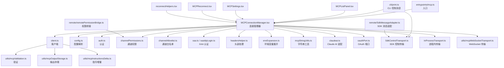
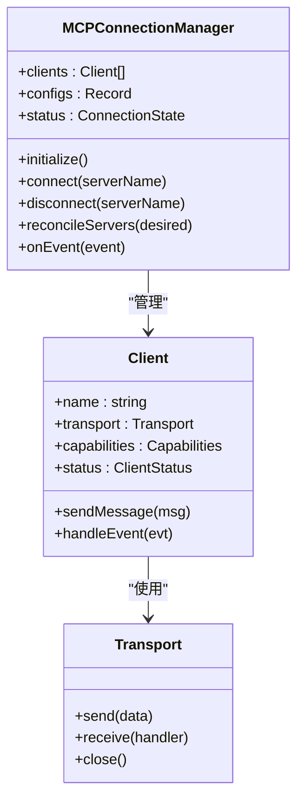
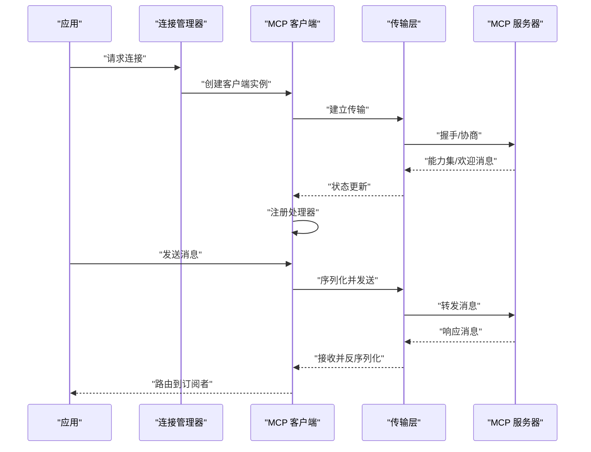
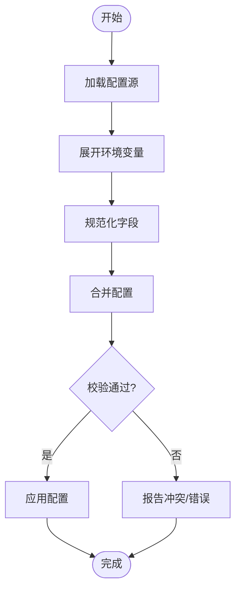
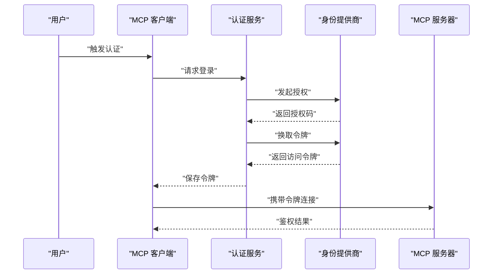
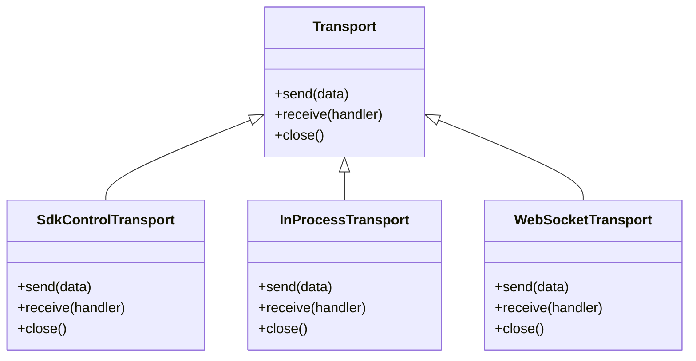
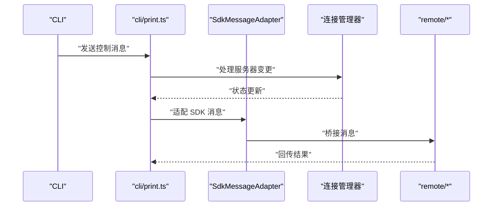
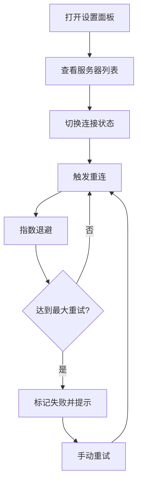
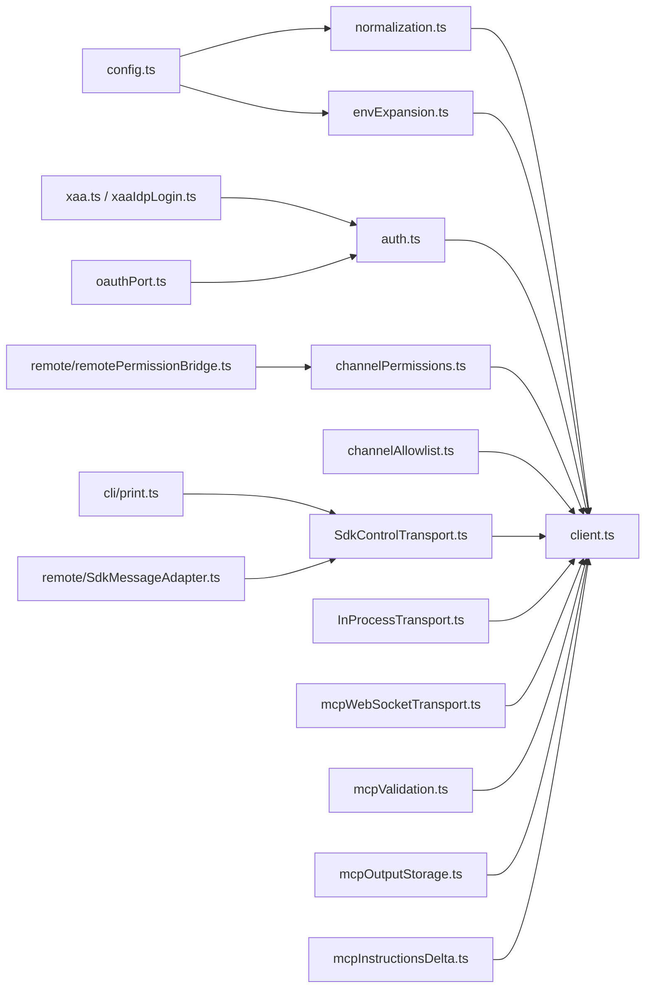

# MCP 协议实现

<cite>
**本文档引用的文件**
- [src/services/mcp/client.ts](file://src/services/mcp/client.ts)
- [src/services/mcp/MCPConnectionManager.tsx](file://src/services/mcp/MCPConnectionManager.tsx)
- [src/services/mcp/config.ts](file://src/services/mcp/config.ts)
- [src/services/mcp/types.ts](file://src/services/mcp/types.ts)
- [src/services/mcp/utils.ts](file://src/services/mcp/utils.ts)
- [src/services/mcp/normalization.ts](file://src/services/mcp/normalization.ts)
- [src/services/mcp/auth.ts](file://src/services/mcp/auth.ts)
- [src/services/mcp/channelPermissions.ts](file://src/services/mcp/channelPermissions.ts)
- [src/services/mcp/channelAllowlist.ts](file://src/services/mcp/channelAllowlist.ts)
- [src/services/mcp/officialRegistry.ts](file://src/services/mcp/officialRegistry.ts)
- [src/services/mcp/xaa.ts](file://src/services/mcp/xaa.ts)
- [src/services/mcp/xaaIdpLogin.ts](file://src/services/mcp/xaaIdpLogin.ts)
- [src/services/mcp/headersHelper.ts](file://src/services/mcp/headersHelper.ts)
- [src/services/mcp/envExpansion.ts](file://src/services/mcp/envExpansion.ts)
- [src/services/mcp/mcpStringUtils.ts](file://src/services/mcp/mcpStringUtils.ts)
- [src/services/mcp/claudeai.ts](file://src/services/mcp/claudeai.ts)
- [src/services/mcp/oauthPort.ts](file://src/services/mcp/oauthPort.ts)
- [src/services/mcp/SdkControlTransport.ts](file://src/services/mcp/SdkControlTransport.ts)
- [src/services/mcp/InProcessTransport.ts](file://src/services/mcp/InProcessTransport.ts)
- [src/services/mcp/useManageMCPConnections.ts](file://src/services/mcp/useManageMCPConnections.ts)
- [src/components/mcp/utils/reconnectHelpers.tsx](file://src/components/mcp/utils/reconnectHelpers.tsx)
- [src/components/mcp/MCPReconnect.tsx](file://src/components/mcp/MCPReconnect.tsx)
- [src/components/mcp/MCPListPanel.tsx](file://src/components/mcp/MCPListPanel.tsx)
- [src/components/mcp/MCPSettings.tsx](file://src/components/mcp/MCPSettings.tsx)
- [src/components/mcp/types.ts](file://src/components/mcp/types.ts)
- [src/entrypoints/mcp.ts](file://src/entrypoints/mcp.ts)
- [src/cli/print.ts](file://src/cli/print.ts)
- [src/utils/mcpValidation.ts](file://src/utils/mcpValidation.ts)
- [src/utils/mcpOutputStorage.ts](file://src/utils/mcpOutputStorage.ts)
- [src/utils/mcpInstructionsDelta.ts](file://src/utils/mcpInstructionsDelta.ts)
- [src/utils/mcpWebSocketTransport.ts](file://src/utils/mcpWebSocketTransport.ts)
- [src/remote/SdkMessageAdapter.ts](file://src/remote/SdkMessageAdapter.ts)
- [src/remote/remotePermissionBridge.ts](file://src/remote/remotePermissionBridge.ts)
- [src/remote/inboundMessages.ts](file://src/remote/inboundMessages.ts)
- [src/remote/outboundMessages.ts](file://src/remote/outboundMessages.ts)
- [src/remote/bridgeMessaging.ts](file://src/remote/bridgeMessaging.ts)
- [src/remote/bridgePermissionCallbacks.ts](file://src/remote/bridgePermissionCallbacks.ts)
- [src/remote/bridgeStatusUtil.ts](file://src/remote/bridgeStatusUtil.ts)
- [src/remote/bridgeUI.ts](file://src/remote/bridgeUI.ts)
- [src/remote/bridgeEnabled.ts](file://src/remote/bridgeEnabled.ts)
- [src/remote/bridgeDebug.ts](file://src/remote/bridgeDebug.ts)
- [src/remote/bridgeConfig.ts](file://src/remote/bridgeConfig.ts)
- [src/remote/bridgeApi.ts](file://src/remote/bridgeApi.ts)
- [src/remote/bridgePointer.ts](file://src/remote/bridgePointer.ts)
- [src/remote/bridgeMain.ts](file://src/remote/bridgeMain.ts)
- [src/remote/bridgeStatusUtil.ts](file://src/remote/bridgeStatusUtil.ts)
- [src/remote/bridgeUI.ts](file://src/remote/bridgeUI.ts)
- [src/remote/bridgeEnabled.ts](file://src/remote/bridgeEnabled.ts)
- [src/remote/bridgeDebug.ts](file://src/remote/bridgeDebug.ts)
- [src/remote/bridgeConfig.ts](file://src/remote/bridgeConfig.ts)
- [src/remote/bridgeApi.ts](file://src/remote/bridgeApi.ts)
- [src/remote/bridgePointer.ts](file://src/remote/bridgePointer.ts)
- [src/remote/bridgeMain.ts](file://src/remote/bridgeMain.ts)
- [src/remote/remotePermissionBridge.ts](file://src/remote/remotePermissionBridge.ts)
- [src/remote/inboundMessages.ts](file://src/remote/inboundMessages.ts)
- [src/remote/outboundMessages.ts](file://src/remote/outboundMessages.ts)
- [src/remote/bridgeMessaging.ts](file://src/remote/bridgeMessaging.ts)
- [src/remote/bridgePermissionCallbacks.ts](file://src/remote/bridgePermissionCallbacks.ts)
- [src/remote/bridgeStatusUtil.ts](file://src/remote/bridgeStatusUtil.ts)
- [src/remote/bridgeUI.ts](file://src/remote/bridgeUI.ts)
- [src/remote/bridgeEnabled.ts](file://src/remote/bridgeEnabled.ts)
- [src/remote/bridgeDebug.ts](file://src/remote/bridgeDebug.ts)
- [src/remote/bridgeConfig.ts](file://src/remote/bridgeConfig.ts)
- [src/remote/bridgeApi.ts](file://src/remote/bridgeApi.ts)
- [src/remote/bridgePointer.ts](file://src/remote/bridgePointer.ts)
- [src/remote/bridgeMain.ts](file://src/remote/bridgeMain.ts)
- [src/remote/remotePermissionBridge.ts](file://src/remote/remotePermissionBridge.ts)
- [src/remote/inboundMessages.ts](file://src/remote/inboundMessages.ts)
- [src/remote/outboundMessages.ts](file://src/remote/outboundMessages.ts)
- [src/remote/bridgeMessaging.ts](file://src/remote/bridgeMessaging.ts)
- [src/remote/bridgePermissionCallbacks.ts](file://src/remote/bridgePermissionCallbacks.ts)
- [src/remote/bridgeStatusUtil.ts](file://src/remote/bridgeStatusUtil.ts)
- [src/remote/bridgeUI.ts](file://src/remote/bridgeUI.ts)
- [src/remote/bridgeEnabled.ts](file://src/remote/bridgeEnabled.ts)
- [src/remote/bridgeDebug.ts](file://src/remote/bridgeDebug.ts)
- [src/remote/bridgeConfig.ts](file://src/remote/bridgeConfig.ts)
- [src/remote/bridgeApi.ts](file://src/remote/bridgeApi.ts)
- [src/remote/bridgePointer.ts](file://src/remote/bridgePointer.ts)
- [src/remote/bridgeMain.ts](file://src/remote/bridgeMain.ts)
- [src/remote/remotePermissionBridge.ts](file://src/remote/remotePermissionBridge.ts)
- [src/remote/inboundMessages.ts](file://src/remote/inboundMessages.ts)
- [src/remote/outboundMessages.ts](file://src/remote/outboundMessages.ts)
- [src/remote/bridgeMessaging.ts](file://src/remote/bridgeMessaging.ts)
- [src/remote/bridgePermissionCallbacks.ts](file://src/remote/bridgePermissionCallbacks.ts)
- [src/remote/bridgeStatusUtil.ts](file://src/remote/bridgeStatusUtil.ts)
- [src/remote/bridgeUI.ts](file://src/remote/bridgeUI.ts)
- [src/remote/bridgeEnabled.ts](file://src/remote/bridgeEnabled.ts)
- [src/remote/bridgeDebug.ts](file://src/remote/bridgeDebug.ts)
- [src/remote/bridgeConfig.ts](file://src/remote/bridgeConfig.ts)
- [src/remote/bridgeApi.ts](file://src/remote/bridgeApi.ts)
- [src/remote/bridgePointer.ts](file://src/remote/bridgePointer.ts)
- [src/remote/bridgeMain.ts](file://src/remote/bridgeMain.ts)
- [src/remote/remotePermissionBridge.ts](file://src/remote/remotePermissionBridge.ts)
- [src/remote/inboundMessages.ts](file://src/remote/inboundMessages.ts)
- [src/remote/outboundMessages.ts](file://src/remote/outboundMessages.ts)
- [src/remote/bridgeMessaging.ts](file://src/remote/bridgeMessaging.ts)
- [src/remote/bridgePermissionCallbacks.ts](file://src/remote/bridgePermissionCallbacks.ts)
- [src/remote/bridgeStatusUtil.ts](file://src/remote/bridgeStatusUtil.ts)
- [src/remote/bridgeUI.ts](file://src/remote/bridgeUI.ts)
- [src/remote/bridgeEnabled.ts](file://src/remote/bridgeEnabled.ts)
- [src/remote/bridgeDebug.ts](file://src/remote/bridgeDebug.ts)
- [src/remote/bridgeConfig.ts](file://src/remote/bridgeConfig.ts)
- [src/remote/bridgeApi.ts](file://src/remote/bridgeApi.ts)
- [src/remote/bridgePointer.ts](file://src/remote/bridgePointer.ts)
- [src/remote/bridgeMain.ts](file://src/remote/bridgeMain.ts)
- [src/remote/remotePermissionBridge.ts](file://src/remote/remotePermissionBridge.ts)
- [src/remote/inboundMessages.ts](file://src/remote/inboundMessages.ts)
- [src/remote/outboundMessages.ts](file://src/remote/outboundMessages.ts)
- [src/remote/bridgeMessaging.ts](file://src/remote/bridgeMessaging.ts)
- [src/remote/bridgePermissionCallbacks.ts](file://src/remote/bridgePermissionCallbacks.ts)
- [src/remote/bridgeStatusUtil.ts](file://src/remote/bridgeStatusUtil.ts)
- [src/remote/bridgeUI.ts](file://src/remote/bridgeUI.ts)
- [src/remote/bridgeEnabled.ts](file://src/remote/bridgeEnabled.ts)
- [src/remote/bridgeDebug.ts](file://src/remote/bridgeDebug.ts)
- [src/remote/bridgeConfig.ts](file://src/remote/bridgeConfig.ts)
- [src/remote/bridgeApi.ts](file://src/remote/bridgeApi.ts)
- [src/remote/bridgePointer.ts](file://src/remote/bridgePointer.ts)
- [src/remote/bridgeMain.ts](file://src/remote/bridgeMain.ts)
- [src/remote/remotePermissionBridge.ts](file://src/remote/remotePermissionBridge.ts)
- [src/remote/inboundMessages.ts](file://src/remote/inboundMessages.ts)
- [src/remote/outboundMessages.ts](file://src/remote/outboundMessages.ts)
- [src/remote/bridgeMessaging.ts](file://src/remote/bridgeMessaging.ts)
- [src/remote/bridgePermissionCallbacks.ts](file://src/remote/bridgePermissionCallbacks.ts)
- [src/remote/bridgeStatusUtil.ts](file://src/remote/bridgeStatusUtil.ts)
- [src/remote/bridgeUI.ts](file://src/remote/bridgeUI.ts)
- [src/remote/bridgeEnabled.ts](file://src/remote/bridgeEnabled.ts)
- [src/remote/bridgeDebug.ts](file://src/remote/bridgeDebug.ts)
- [src/remote/bridgeConfig.ts](file://src/remote/bridgeConfig.ts)
- [src/remote/bridgeApi.ts](file://src/remote/bridgeApi.ts)
- [src/remote/bridgePointer.ts](file://......
</cite>

## 目录
1. [简介](#简介)
2. [项目结构](#项目结构)
3. [核心组件](#核心组件)
4. [架构总览](#架构总览)
5. [详细组件分析](#详细组件分析)
6. [依赖关系分析](#依赖关系分析)
7. [性能考虑](#性能考虑)
8. [故障排除指南](#故障排除指南)
9. [结论](#结论)
10. [附录](#附录)

## 简介
本文件系统性梳理并解释 MCP（Model Context Protocol）在该代码库中的实现，涵盖协议核心概念、消息格式与通信机制、版本管理策略、消息序列化与反序列化流程、客户端初始化与连接建立及协议协商、消息路由、错误处理与重连机制，以及协议扩展点与自定义消息类型的开发指南。文档面向不同技术背景的读者，既提供高层概览也包含代码级细节与可视化图示。

## 项目结构
MCP 实现主要分布在以下模块：
- 服务层：负责连接管理、配置解析、认证、通道权限控制、消息编解码与传输适配等
- 组件层：提供 UI 面板、设置界面、重连辅助工具等
- 工具与适配器：CLI 输出、远程桥接、SDK 消息适配、WebSocket 传输等
- 入口与集成：应用入口点与 CLI 控制消息处理

```mermaid
graph TB
subgraph "服务层"
SVC_CLIENT["client.ts<br/>MCP 客户端"]
SVC_CONN["MCPConnectionManager.tsx<br/>连接管理"]
SVC_CFG["config.ts<br/>配置解析"]
SVC_TYPES["types.ts<br/>类型定义"]
SVC_UTILS["utils.ts<br/>通用工具"]
SVC_NORM["normalization.ts<br/>规范化"]
SVC_AUTH["auth.ts<br/>认证"]
SVC_CHAN_PERM["channelPermissions.ts<br/>通道权限"]
SVC_CHAN_ALLOW["channelAllowlist.ts<br/>通道白名单"]
SVC_OFFICIAL["officialRegistry.ts<br/>官方注册表"]
SVC_XAA["xaa.ts / xaaIdpLogin.ts<br/>XAA 认证"]
SVC_HEADERS["headersHelper.ts<br/>头部处理"]
SVC_ENV["envExpansion.ts<br/>环境变量展开"]
SVC_STR["mcpStringUtils.ts<br/>字符串工具"]
SVC_CLAUDEAI["claudeai.ts<br/>Claude AI 适配"]
SVC_OAUTH_PORT["oauthPort.ts<br/>OAuth 端口"]
SVC_SDK_CTRL["SdkControlTransport.ts<br/>SDK 控制传输"]
SVC_INPROC["InProcessTransport.ts<br/>进程内传输"]
SVC_MANAGE["useManageMCPConnections.ts<br/>连接管理钩子"]
end
subgraph "组件层"
UI_RECONNECT["MCPReconnect.tsx<br/>重连组件"]
UI_LIST["MCPListPanel.tsx<br/>服务器列表"]
UI_SETTINGS["MCPSettings.tsx<br/>设置面板"]
UI_TYPES["components/mcp/types.ts<br/>组件类型"]
UI_HELPERS["reconnectHelpers.tsx<br/>重连辅助"]
end
subgraph "工具与适配器"
CLI_PRINT["cli/print.ts<br/>CLI 输出/控制消息"]
REMOTE_ADAPTER["remote/SdkMessageAdapter.ts<br/>SDK 消息适配"]
REMOTE_INBOUND["remote/inboundMessages.ts<br/>入站消息"]
REMOTE_OUTBOUND["remote/outboundMessages.ts<br/>出站消息"]
REMOTE_BRIDGE["remote/bridgeMessaging.ts<br/>桥接消息"]
REMOTE_PERM["remote/remotePermissionBridge.ts<br/>权限桥接"]
UTIL_WS["utils/mcpWebSocketTransport.ts<br/>WebSocket 传输"]
UTIL_VALIDATE["utils/mcpValidation.ts<br/>验证"]
UTIL_STORAGE["utils/mcpOutputStorage.ts<br/>输出存储"]
UTIL_DELTA["utils/mcpInstructionsDelta.ts<br/>指令增量"]
end
subgraph "入口与集成"
ENTRY_MCP["entrypoints/mcp.ts<br/>MCP 入口"]
end
SVC_CLIENT --> SVC_CONN
SVC_CONN --> SVC_SDK_CTRL
SVC_CONN --> SVC_INPROC
SVC_CONN --> SVC_AUTH
SVC_CONN --> SVC_CHAN_PERM
SVC_CONN --> SVC_CHAN_ALLOW
SVC_CONN --> SVC_OFFICIAL
SVC_CONN --> SVC_XAA
SVC_CONN --> SVC_HEADERS
SVC_CONN --> SVC_ENV
SVC_CONN --> SVC_STR
SVC_CONN --> SVC_CLAUDEAI
SVC_CONN --> SVC_OAUTH_PORT
SVC_CONN --> SVC_UTILS
SVC_CONN --> SVC_NORM
SVC_CONN --> SVC_CFG
SVC_CONN --> SVC_TYPES
UI_LIST --> SVC_CONN
UI_SETTINGS --> SVC_CONN
UI_RECONNECT --> SVC_CONN
UI_HELPERS --> SVC_CONN
CLI_PRINT --> SVC_SDK_CTRL
CLI_PRINT --> SVC_CONN
REMOTE_ADAPTER --> SVC_SDK_CTRL
REMOTE_INBOUND --> SVC_CONN
REMOTE_OUTBOUND --> SVC_CONN
REMOTE_BRIDGE --> SVC_CONN
REMOTE_PERM --> SVC_CHAN_PERM
UTIL_WS --> SVC_CONN
UTIL_VALIDATE --> SVC_CONN
UTIL_STORAGE --> SVC_CONN
UTIL_DELTA --> SVC_CONN
ENTRY_MCP --> SVC_CONN
```

**图表来源**
- [src/services/mcp/client.ts](file://src/services/mcp/client.ts)
- [src/services/mcp/MCPConnectionManager.tsx](file://src/services/mcp/MCPConnectionManager.tsx)
- [src/services/mcp/config.ts](file://src/services/mcp/config.ts)
- [src/services/mcp/types.ts](file://src/services/mcp/types.ts)
- [src/services/mcp/utils.ts](file://src/services/mcp/utils.ts)
- [src/services/mcp/normalization.ts](file://src/services/mcp/normalization.ts)
- [src/services/mcp/auth.ts](file://src/services/mcp/auth.ts)
- [src/services/mcp/channelPermissions.ts](file://src/services/mcp/channelPermissions.ts)
- [src/services/mcp/channelAllowlist.ts](file://src/services/mcp/channelAllowlist.ts)
- [src/services/mcp/officialRegistry.ts](file://src/services/mcp/officialRegistry.ts)
- [src/services/mcp/xaa.ts](file://src/services/mcp/xaa.ts)
- [src/services/mcp/xaaIdpLogin.ts](file://src/services/mcp/xaaIdpLogin.ts)
- [src/services/mcp/headersHelper.ts](file://src/services/mcp/headersHelper.ts)
- [src/services/mcp/envExpansion.ts](file://src/services/mcp/envExpansion.ts)
- [src/services/mcp/mcpStringUtils.ts](file://src/services/mcp/mcpStringUtils.ts)
- [src/services/mcp/claudeai.ts](file://src/services/mcp/claudeai.ts)
- [src/services/mcp/oauthPort.ts](file://src/services/mcp/oauthPort.ts)
- [src/services/mcp/SdkControlTransport.ts](file://src/services/mcp/SdkControlTransport.ts)
- [src/services/mcp/InProcessTransport.ts](file://src/services/mcp/InProcessTransport.ts)
- [src/services/mcp/useManageMCPConnections.ts](file://src/services/mcp/useManageMCPConnections.ts)
- [src/components/mcp/MCPReconnect.tsx](file://src/components/mcp/MCPReconnect.tsx)
- [src/components/mcp/MCPListPanel.tsx](file://src/components/mcp/MCPListPanel.tsx)
- [src/components/mcp/MCPSettings.tsx](file://src/components/mcp/MCPSettings.tsx)
- [src/components/mcp/types.ts](file://src/components/mcp/types.ts)
- [src/components/mcp/utils/reconnectHelpers.tsx](file://src/components/mcp/utils/reconnectHelpers.tsx)
- [src/cli/print.ts](file://src/cli/print.ts)
- [src/utils/mcpValidation.ts](file://src/utils/mcpValidation.ts)
- [src/utils/mcpOutputStorage.ts](file://src/utils/mcpOutputStorage.ts)
- [src/utils/mcpInstructionsDelta.ts](file://src/utils/mcpInstructionsDelta.ts)
- [src/utils/mcpWebSocketTransport.ts](file://src/utils/mcpWebSocketTransport.ts)
- [src/remote/SdkMessageAdapter.ts](file://src/remote/SdkMessageAdapter.ts)
- [src/remote/remotePermissionBridge.ts](file://src/remote/remotePermissionBridge.ts)
- [src/entrypoints/mcp.ts](file://src/entrypoints/mcp.ts)

**章节来源**
- [src/services/mcp/client.ts](file://src/services/mcp/client.ts)
- [src/services/mcp/MCPConnectionManager.tsx](file://src/services/mcp/MCPConnectionManager.tsx)
- [src/services/mcp/config.ts](file://src/services/mcp/config.ts)
- [src/services/mcp/types.ts](file://src/services/mcp/types.ts)
- [src/services/mcp/utils.ts](file://src/services/mcp/utils.ts)
- [src/services/mcp/normalization.ts](file://src/services/mcp/normalization.ts)
- [src/services/mcp/auth.ts](file://src/services/mcp/auth.ts)
- [src/services/mcp/channelPermissions.ts](file://src/services/mcp/channelPermissions.ts)
- [src/services/mcp/channelAllowlist.ts](file://src/services/mcp/channelAllowlist.ts)
- [src/services/mcp/officialRegistry.ts](file://src/services/mcp/officialRegistry.ts)
- [src/services/mcp/xaa.ts](file://src/services/mcp/xaa.ts)
- [src/services/mcp/xaaIdpLogin.ts](file://src/services/mcp/xaaIdpLogin.ts)
- [src/services/mcp/headersHelper.ts](file://src/services/mcp/headersHelper.ts)
- [src/services/mcp/envExpansion.ts](file://src/services/mcp/envExpansion.ts)
- [src/services/mcp/mcpStringUtils.ts](file://src/services/mcp/mcpStringUtils.ts)
- [src/services/mcp/claudeai.ts](file://src/services/mcp/claudeai.ts)
- [src/services/mcp/oauthPort.ts](file://src/services/mcp/oauthPort.ts)
- [src/services/mcp/SdkControlTransport.ts](file://src/services/mcp/SdkControlTransport.ts)
- [src/services/mcp/InProcessTransport.ts](file://src/services/mcp/InProcessTransport.ts)
- [src/services/mcp/useManageMCPConnections.ts](file://src/services/mcp/useManageMCPConnections.ts)
- [src/components/mcp/MCPReconnect.tsx](file://src/components/mcp/MCPReconnect.tsx)
- [src/components/mcp/MCPListPanel.tsx](file://src/components/mcp/MCPListPanel.tsx)
- [src/components/mcp/MCPSettings.tsx](file://src/components/mcp/MCPSettings.tsx)
- [src/components/mcp/types.ts](file://src/components/mcp/types.ts)
- [src/components/mcp/utils/reconnectHelpers.tsx](file://src/components/mcp/utils/reconnectHelpers.tsx)
- [src/cli/print.ts](file://src/cli/print.ts)
- [src/utils/mcpValidation.ts](file://src/utils/mcpValidation.ts)
- [src/utils/mcpOutputStorage.ts](file://src/utils/mcpOutputStorage.ts)
- [src/utils/mcpInstructionsDelta.ts](file://src/utils/mcpInstructionsDelta.ts)
- [src/utils/mcpWebSocketTransport.ts](file://src/utils/mcpWebSocketTransport.ts)
- [src/remote/SdkMessageAdapter.ts](file://src/remote/SdkMessageAdapter.ts)
- [src/remote/remotePermissionBridge.ts](file://src/remote/remotePermissionBridge.ts)
- [src/entrypoints/mcp.ts](file://src/entrypoints/mcp.ts)

## 核心组件
- 连接管理器：统一管理 MCP 客户端生命周期、状态转换、重连与资源清理
- 客户端：封装消息发送、接收、路由与错误处理
- 配置解析：支持多来源配置合并、环境变量展开、规范化与校验
- 认证与通道权限：基于 IDP 的 OAuth/XAA 流程与通道白名单/权限控制
- 传输层：支持 SDK 控制传输、进程内传输与 WebSocket 传输
- UI 组件：服务器列表、设置面板、重连辅助与通知
- 工具与适配器：CLI 控制消息处理、远程桥接、消息验证与输出存储

**章节来源**
- [src/services/mcp/MCPConnectionManager.tsx](file://src/services/mcp/MCPConnectionManager.tsx)
- [src/services/mcp/client.ts](file://src/services/mcp/client.ts)
- [src/services/mcp/config.ts](file://src/services/mcp/config.ts)
- [src/services/mcp/auth.ts](file://src/services/mcp/auth.ts)
- [src/services/mcp/channelPermissions.ts](file://src/services/mcp/channelPermissions.ts)
- [src/services/mcp/channelAllowlist.ts](file://src/services/mcp/channelAllowlist.ts)
- [src/services/mcp/SdkControlTransport.ts](file://src/services/mcp/SdkControlTransport.ts)
- [src/services/mcp/InProcessTransport.ts](file://src/services/mcp/InProcessTransport.ts)
- [src/utils/mcpValidation.ts](file://src/utils/mcpValidation.ts)
- [src/utils/mcpOutputStorage.ts](file://src/utils/mcpOutputStorage.ts)
- [src/utils/mcpWebSocketTransport.ts](file://src/utils/mcpWebSocketTransport.ts)
- [src/remote/SdkMessageAdapter.ts](file://src/remote/SdkMessageAdapter.ts)
- [src/remote/remotePermissionBridge.ts](file://src/remote/remotePermissionBridge.ts)
- [src/components/mcp/MCPListPanel.tsx](file://src/components/mcp/MCPListPanel.tsx)
- [src/components/mcp/MCPSettings.tsx](file://src/components/mcp/MCPSettings.tsx)
- [src/components/mcp/MCPReconnect.tsx](file://src/components/mcp/MCPReconnect.tsx)

## 架构总览
下图展示 MCP 在应用中的整体架构：从入口到连接管理，再到传输层与 UI 层的协作；同时体现 CLI 控制消息与远程桥接的集成路径。

**图表来源**
- [src/entrypoints/mcp.ts](file://src/entrypoints/mcp.ts)
- [src/services/mcp/MCPConnectionManager.tsx](file://src/services/mcp/MCPConnectionManager.tsx)
- [src/services/mcp/client.ts](file://src/services/mcp/client.ts)
- [src/services/mcp/config.ts](file://src/services/mcp/config.ts)
- [src/services/mcp/auth.ts](file://src/services/mcp/auth.ts)
- [src/services/mcp/channelPermissions.ts](file://src/services/mcp/channelPermissions.ts)
- [src/services/mcp/channelAllowlist.ts](file://src/services/mcp/channelAllowlist.ts)
- [src/services/mcp/xaa.ts](file://src/services/mcp/xaa.ts)
- [src/services/mcp/xaaIdpLogin.ts](file://src/services/mcp/xaaIdpLogin.ts)
- [src/services/mcp/headersHelper.ts](file://src/services/mcp/headersHelper.ts)
- [src/services/mcp/envExpansion.ts](file://src/services/mcp/envExpansion.ts)
- [src/services/mcp/mcpStringUtils.ts](file://src/services/mcp/mcpStringUtils.ts)
- [src/services/mcp/claudeai.ts](file://src/services/mcp/claudeai.ts)
- [src/services/mcp/oauthPort.ts](file://src/services/mcp/oauthPort.ts)
- [src/services/mcp/SdkControlTransport.ts](file://src/services/mcp/SdkControlTransport.ts)
- [src/services/mcp/InProcessTransport.ts](file://src/services/mcp/InProcessTransport.ts)
- [src/utils/mcpWebSocketTransport.ts](file://src/utils/mcpWebSocketTransport.ts)
- [src/utils/mcpValidation.ts](file://src/utils/mcpValidation.ts)
- [src/utils/mcpOutputStorage.ts](file://src/utils/mcpOutputStorage.ts)
- [src/utils/mcpInstructionsDelta.ts](file://src/utils/mcpInstructionsDelta.ts)
- [src/cli/print.ts](file://src/cli/print.ts)
- [src/remote/SdkMessageAdapter.ts](file://src/remote/SdkMessageAdapter.ts)
- [src/remote/remotePermissionBridge.ts](file://src/remote/remotePermissionBridge.ts)
- [src/components/mcp/MCPListPanel.tsx](file://src/components/mcp/MCPListPanel.tsx)
- [src/components/mcp/MCPSettings.tsx](file://src/components/mcp/MCPSettings.tsx)
- [src/components/mcp/MCPReconnect.tsx](file://src/components/mcp/MCPReconnect.tsx)
- [src/components/mcp/utils/reconnectHelpers.tsx](file://src/components/mcp/utils/reconnectHelpers.tsx)

## 详细组件分析

### 连接管理器（MCPConnectionManager）
- 职责：集中管理 MCP 客户端的创建、销毁、状态更新、重连策略与资源释放
- 关键流程：初始化配置 -> 建立传输 -> 协商能力 -> 注册处理器 -> 处理事件回调
- 重连机制：指数退避、最大重试次数、失败原因分类与 UI 提示
- 并发控制：对服务器变更进行串行化处理，避免竞态条件

**图表来源**
- [src/services/mcp/MCPConnectionManager.tsx](file://src/services/mcp/MCPConnectionManager.tsx)
- [src/services/mcp/client.ts](file://src/services/mcp/client.ts)
- [src/services/mcp/SdkControlTransport.ts](file://src/services/mcp/SdkControlTransport.ts)
- [src/services/mcp/InProcessTransport.ts](file://src/services/mcp/InProcessTransport.ts)

**章节来源**
- [src/services/mcp/MCPConnectionManager.tsx](file://src/services/mcp/MCPConnectionManager.tsx)
- [src/services/mcp/client.ts](file://src/services/mcp/client.ts)
- [src/services/mcp/SdkControlTransport.ts](file://src/services/mcp/SdkControlTransport.ts)
- [src/services/mcp/InProcessTransport.ts](file://src/services/mcp/InProcessTransport.ts)
- [src/components/mcp/utils/reconnectHelpers.tsx](file://src/components/mcp/utils/reconnectHelpers.tsx)

### 客户端（client.ts）
- 职责：封装消息发送、接收、路由与错误处理；维护会话状态与能力集
- 序列化/反序列化：基于 JSON/NDJSON 格式的消息体；严格字段校验与类型约束
- 错误处理：区分网络错误、协议错误、业务错误；统一错误响应与日志记录
- 路由：根据目标服务器与通道分发消息；支持批量与异步处理

**图表来源**
- [src/services/mcp/client.ts](file://src/services/mcp/client.ts)
- [src/services/mcp/SdkControlTransport.ts](file://src/services/mcp/SdkControlTransport.ts)
- [src/services/mcp/InProcessTransport.ts](file://src/services/mcp/InProcessTransport.ts)
- [src/utils/mcpWebSocketTransport.ts](file://src/utils/mcpWebSocketTransport.ts)

**章节来源**
- [src/services/mcp/client.ts](file://src/services/mcp/client.ts)
- [src/utils/mcpValidation.ts](file://src/utils/mcpValidation.ts)
- [src/utils/mcpOutputStorage.ts](file://src/utils/mcpOutputStorage.ts)

### 配置与版本管理（config.ts, normalization.ts）
- 配置来源：本地配置、环境变量、远程配置、官方注册表
- 版本管理：支持多版本 schema 校验与向后兼容；规范化字段值与默认值填充
- 合并与冲突解决：按优先级合并配置；检测并报告冲突项
- 扩展点：允许自定义字段与插件化配置加载

**图表来源**
- [src/services/mcp/config.ts](file://src/services/mcp/config.ts)
- [src/services/mcp/normalization.ts](file://src/services/mcp/normalization.ts)
- [src/services/mcp/envExpansion.ts](file://src/services/mcp/envExpansion.ts)
- [src/services/mcp/officialRegistry.ts](file://src/services/mcp/officialRegistry.ts)

**章节来源**
- [src/services/mcp/config.ts](file://src/services/mcp/config.ts)
- [src/services/mcp/normalization.ts](file://src/services/mcp/normalization.ts)
- [src/services/mcp/envExpansion.ts](file://src/services/mcp/envExpansion.ts)
- [src/services/mcp/officialRegistry.ts](file://src/services/mcp/officialRegistry.ts)

### 认证与通道权限（auth.ts, channelPermissions.ts, channelAllowlist.ts, xaa.ts, xaaIdpLogin.ts, oauthPort.ts）
- 认证流程：OAuth 授权码流程、IDP 登录、XAA 令牌交换
- 通道权限：基于白名单与权限矩阵控制通道访问；动态授权与撤销
- 传输安全：HTTP 头部注入、证书校验、mTLS 支持

**图表来源**
- [src/services/mcp/auth.ts](file://src/services/mcp/auth.ts)
- [src/services/mcp/xaa.ts](file://src/services/mcp/xaa.ts)
- [src/services/mcp/xaaIdpLogin.ts](file://src/services/mcp/xaaIdpLogin.ts)
- [src/services/mcp/oauthPort.ts](file://src/services/mcp/oauthPort.ts)
- [src/services/mcp/channelPermissions.ts](file://src/services/mcp/channelPermissions.ts)
- [src/services/mcp/channelAllowlist.ts](file://src/services/mcp/channelAllowlist.ts)

**章节来源**
- [src/services/mcp/auth.ts](file://src/services/mcp/auth.ts)
- [src/services/mcp/xaa.ts](file://src/services/mcp/xaa.ts)
- [src/services/mcp/xaaIdpLogin.ts](file://src/services/mcp/xaaIdpLogin.ts)
- [src/services/mcp/oauthPort.ts](file://src/services/mcp/oauthPort.ts)
- [src/services/mcp/channelPermissions.ts](file://src/services/mcp/channelPermissions.ts)
- [src/services/mcp/channelAllowlist.ts](file://src/services/mcp/channelAllowlist.ts)

### 传输层（SdkControlTransport.ts, InProcessTransport.ts, mcpWebSocketTransport.ts）
- SDK 控制传输：用于浏览器或进程间控制消息的传输
- 进程内传输：本地进程内的轻量传输，适合调试与测试
- WebSocket 传输：标准 MCP WebSocket 协议，支持二进制与文本帧

**图表来源**
- [src/services/mcp/SdkControlTransport.ts](file://src/services/mcp/SdkControlTransport.ts)
- [src/services/mcp/InProcessTransport.ts](file://src/services/mcp/InProcessTransport.ts)
- [src/utils/mcpWebSocketTransport.ts](file://src/utils/mcpWebSocketTransport.ts)

**章节来源**
- [src/services/mcp/SdkControlTransport.ts](file://src/services/mcp/SdkControlTransport.ts)
- [src/services/mcp/InProcessTransport.ts](file://src/services/mcp/InProcessTransport.ts)
- [src/utils/mcpWebSocketTransport.ts](file://src/utils/mcpWebSocketTransport.ts)

### CLI 控制消息与远程桥接（cli/print.ts, remote/*, SdkMessageAdapter.ts）
- CLI 控制消息：支持服务器增删改查、通道启用、认证等控制命令
- 远程桥接：将本地 MCP 与远端系统桥接，实现跨进程/跨设备通信
- SDK 消息适配：统一对接 SDK 的消息格式与行为

**图表来源**
- [src/cli/print.ts](file://src/cli/print.ts)
- [src/remote/SdkMessageAdapter.ts](file://src/remote/SdkMessageAdapter.ts)
- [src/remote/remotePermissionBridge.ts](file://src/remote/remotePermissionBridge.ts)
- [src/remote/inboundMessages.ts](file://src/remote/inboundMessages.ts)
- [src/remote/outboundMessages.ts](file://src/remote/outboundMessages.ts)
- [src/remote/bridgeMessaging.ts](file://src/remote/bridgeMessaging.ts)

**章节来源**
- [src/cli/print.ts](file://src/cli/print.ts)
- [src/remote/SdkMessageAdapter.ts](file://src/remote/SdkMessageAdapter.ts)
- [src/remote/remotePermissionBridge.ts](file://src/remote/remotePermissionBridge.ts)
- [src/remote/inboundMessages.ts](file://src/remote/inboundMessages.ts)
- [src/remote/outboundMessages.ts](file://src/remote/outboundMessages.ts)
- [src/remote/bridgeMessaging.ts](file://src/remote/bridgeMessaging.ts)

### UI 组件与重连机制（MCPListPanel.tsx, MCPSettings.tsx, MCPReconnect.tsx, reconnectHelpers.tsx）
- 服务器列表：展示已配置与已连接的 MCP 服务器，支持启停与删除
- 设置面板：统一配置入口，支持动态刷新与热更新
- 重连组件：自动重连、失败提示与手动重试
- 重连辅助：指数退避、抖动、最大重试次数与超时控制

**图表来源**
- [src/components/mcp/MCPListPanel.tsx](file://src/components/mcp/MCPListPanel.tsx)
- [src/components/mcp/MCPSettings.tsx](file://src/components/mcp/MCPSettings.tsx)
- [src/components/mcp/MCPReconnect.tsx](file://src/components/mcp/MCPReconnect.tsx)
- [src/components/mcp/utils/reconnectHelpers.tsx](file://src/components/mcp/utils/reconnectHelpers.tsx)

**章节来源**
- [src/components/mcp/MCPListPanel.tsx](file://src/components/mcp/MCPListPanel.tsx)
- [src/components/mcp/MCPSettings.tsx](file://src/components/mcp/MCPSettings.tsx)
- [src/components/mcp/MCPReconnect.tsx](file://src/components/mcp/MCPReconnect.tsx)
- [src/components/mcp/utils/reconnectHelpers.tsx](file://src/components/mcp/utils/reconnectHelpers.tsx)

## 依赖关系分析
- 内聚性：各模块围绕“配置—连接—传输—认证—UI”形成清晰职责边界
- 耦合度：通过接口抽象与事件驱动降低耦合；传输层可替换性强
- 循环依赖：未发现直接循环依赖；若存在潜在循环，建议引入中间层或接口隔离
- 外部依赖：依赖 SDK、Zod 校验、WebSocket 规范与 IDP 协议

**图表来源**
- [src/services/mcp/config.ts](file://src/services/mcp/config.ts)
- [src/services/mcp/normalization.ts](file://src/services/mcp/normalization.ts)
- [src/services/mcp/envExpansion.ts](file://src/services/mcp/envExpansion.ts)
- [src/services/mcp/client.ts](file://src/services/mcp/client.ts)
- [src/services/mcp/auth.ts](file://src/services/mcp/auth.ts)
- [src/services/mcp/channelPermissions.ts](file://src/services/mcp/channelPermissions.ts)
- [src/services/mcp/channelAllowlist.ts](file://src/services/mcp/channelAllowlist.ts)
- [src/services/mcp/xaa.ts](file://src/services/mcp/xaa.ts)
- [src/services/mcp/xaaIdpLogin.ts](file://src/services/mcp/xaaIdpLogin.ts)
- [src/services/mcp/oauthPort.ts](file://src/services/mcp/oauthPort.ts)
- [src/services/mcp/SdkControlTransport.ts](file://src/services/mcp/SdkControlTransport.ts)
- [src/services/mcp/InProcessTransport.ts](file://src/services/mcp/InProcessTransport.ts)
- [src/utils/mcpWebSocketTransport.ts](file://src/utils/mcpWebSocketTransport.ts)
- [src/utils/mcpValidation.ts](file://src/utils/mcpValidation.ts)
- [src/utils/mcpOutputStorage.ts](file://src/utils/mcpOutputStorage.ts)
- [src/utils/mcpInstructionsDelta.ts](file://src/utils/mcpInstructionsDelta.ts)
- [src/cli/print.ts](file://src/cli/print.ts)
- [src/remote/SdkMessageAdapter.ts](file://src/remote/SdkMessageAdapter.ts)
- [src/remote/remotePermissionBridge.ts](file://src/remote/remotePermissionBridge.ts)

**章节来源**
- [src/services/mcp/config.ts](file://src/services/mcp/config.ts)
- [src/services/mcp/normalization.ts](file://src/services/mcp/normalization.ts)
- [src/services/mcp/envExpansion.ts](file://src/services/mcp/envExpansion.ts)
- [src/services/mcp/client.ts](file://src/services/mcp/client.ts)
- [src/services/mcp/auth.ts](file://src/services/mcp/auth.ts)
- [src/services/mcp/channelPermissions.ts](file://src/services/mcp/channelPermissions.ts)
- [src/services/mcp/channelAllowlist.ts](file://src/services/mcp/channelAllowlist.ts)
- [src/services/mcp/xaa.ts](file://src/services/mcp/xaa.ts)
- [src/services/mcp/xaaIdpLogin.ts](file://src/services/mcp/xaaIdpLogin.ts)
- [src/services/mcp/oauthPort.ts](file://src/services/mcp/oauthPort.ts)
- [src/services/mcp/SdkControlTransport.ts](file://src/services/mcp/SdkControlTransport.ts)
- [src/services/mcp/InProcessTransport.ts](file://src/services/mcp/InProcessTransport.ts)
- [src/utils/mcpWebSocketTransport.ts](file://src/utils/mcpWebSocketTransport.ts)
- [src/utils/mcpValidation.ts](file://src/utils/mcpValidation.ts)
- [src/utils/mcpOutputStorage.ts](file://src/utils/mcpOutputStorage.ts)
- [src/utils/mcpInstructionsDelta.ts](file://src/utils/mcpInstructionsDelta.ts)
- [src/cli/print.ts](file://src/cli/print.ts)
- [src/remote/SdkMessageAdapter.ts](file://src/remote/SdkMessageAdapter.ts)
- [src/remote/remotePermissionBridge.ts](file://src/remote/remotePermissionBridge.ts)

## 性能考虑
- 序列化开销：优先使用紧凑的 NDJSON 格式；对大消息采用流式处理
- 并发控制：限制并发请求数与队列长度，避免拥塞
- 缓存与去重：对重复请求进行缓存与去重，减少网络往返
- 传输优化：选择合适的传输层（进程内/WS），在本地场景优先进程内传输
- GC 与内存：及时释放不再使用的客户端与传输对象，避免内存泄漏

## 故障排除指南
- 连接失败：检查网络连通性、证书与代理设置；查看传输层错误码
- 认证失败：确认 IDP 配置、授权码与令牌有效期；核对通道权限
- 消息异常：启用详细日志，定位序列化/反序列化问题；检查 schema 校验
- 重连无效：调整退避参数、超时阈值；确保状态机正确过渡
- 权限被拒：核对通道白名单与权限矩阵；必要时重新授权

**章节来源**
- [src/services/mcp/MCPConnectionManager.tsx](file://src/services/mcp/MCPConnectionManager.tsx)
- [src/services/mcp/client.ts](file://src/services/mcp/client.ts)
- [src/utils/mcpValidation.ts](file://src/utils/mcpValidation.ts)
- [src/components/mcp/utils/reconnectHelpers.tsx](file://src/components/mcp/utils/reconnectHelpers.tsx)

## 结论
该实现以模块化方式完整覆盖 MCP 协议的关键环节：从配置与版本管理、认证与权限控制，到传输层适配与 UI 集成，并提供了完善的错误处理与重连机制。通过清晰的职责划分与可替换的传输层，系统具备良好的扩展性与可维护性。

## 附录

### 协议扩展点与自定义消息类型开发指南
- 自定义传输：实现 Transport 接口，支持新的传输协议或适配器
- 自定义认证：扩展 auth.ts 中的认证流程，支持新 IDP 或令牌格式
- 自定义通道：在 channelPermissions.ts 与 channelAllowlist.ts 中添加新通道规则
- 自定义消息：在 client.ts 中扩展消息路由与处理器，确保序列化/反序列化一致
- 验证与存储：利用 mcpValidation.ts 与 mcpOutputStorage.ts 保证消息一致性与持久化

**章节来源**
- [src/services/mcp/client.ts](file://src/services/mcp/client.ts)
- [src/services/mcp/auth.ts](file://src/services/mcp/auth.ts)
- [src/services/mcp/channelPermissions.ts](file://src/services/mcp/channelPermissions.ts)
- [src/services/mcp/channelAllowlist.ts](file://src/services/mcp/channelAllowlist.ts)
- [src/utils/mcpValidation.ts](file://src/utils/mcpValidation.ts)
- [src/utils/mcpOutputStorage.ts](file://src/utils/mcpOutputStorage.ts)