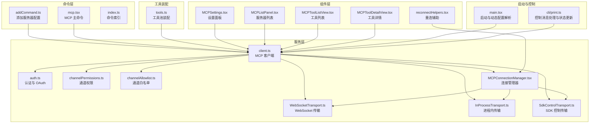
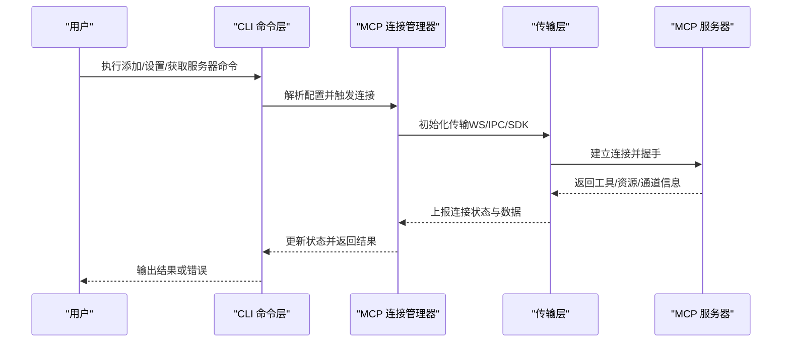
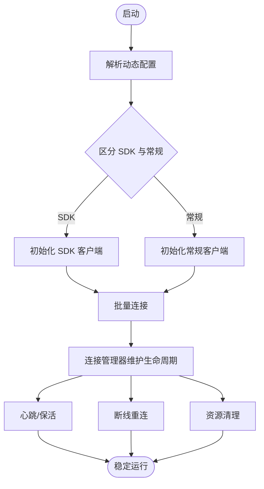
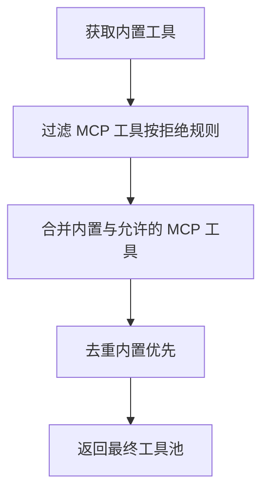
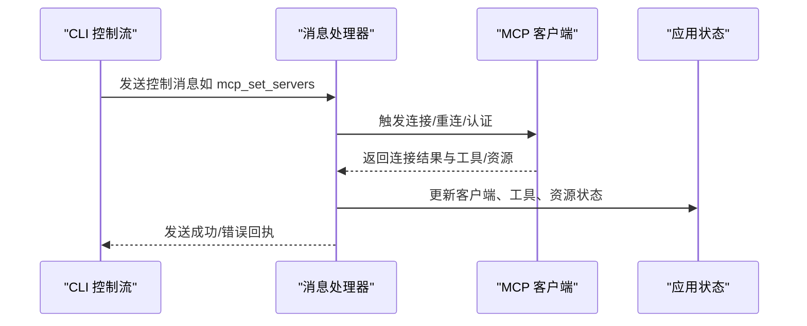
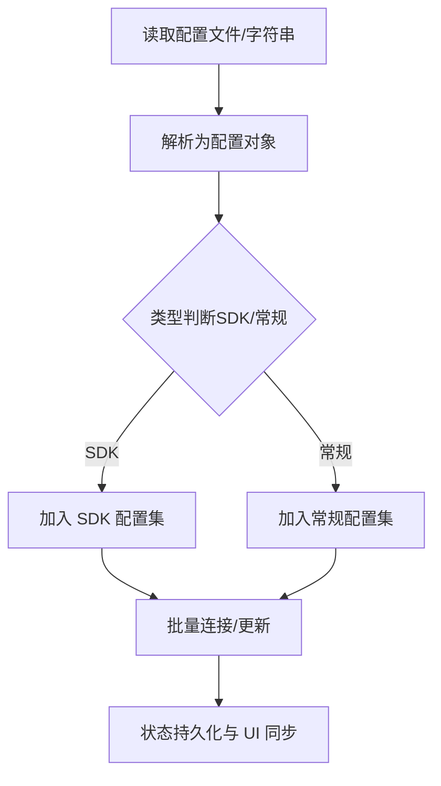
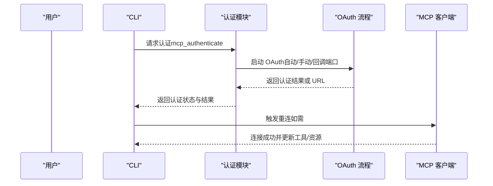
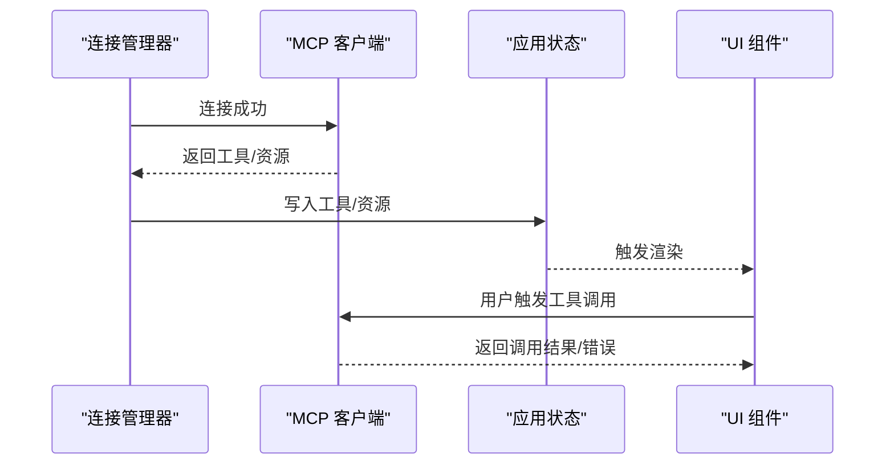
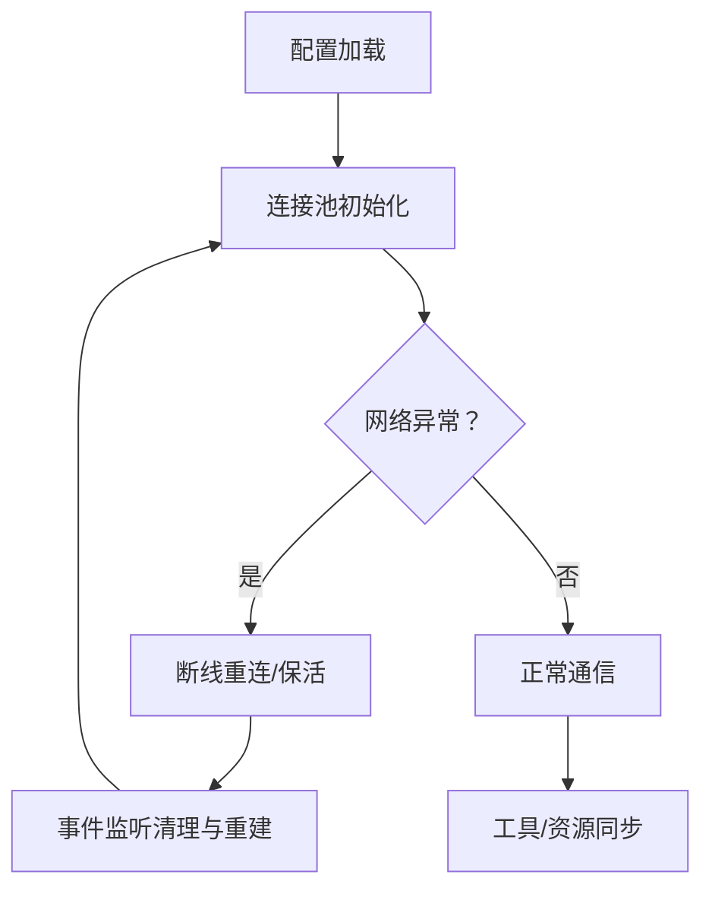
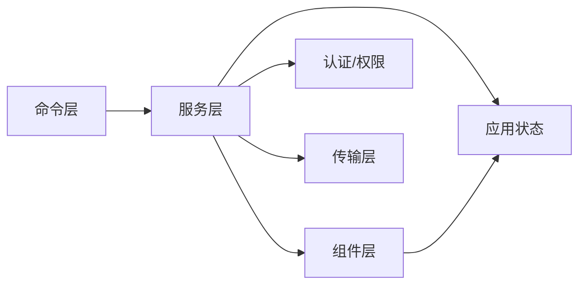

# MCP 集成

<cite>
**本文引用的文件**
- [src/main.tsx](file://src/main.tsx)
- [src/cli/print.ts](file://src/cli/print.ts)
- [src/commands/mcp/addCommand.ts](file://src/commands/mcp/addCommand.ts)
- [src/commands/mcp/index.ts](file://src/commands/mcp/index.ts)
- [src/commands/mcp/mcp.tsx](file://src/commands/mcp/mcp.tsx)
- [src/tools.ts](file://src/tools.ts)
- [src/services/mcp/client.ts](file://src/services/mcp/client.ts)
- [src/services/mcp/config.ts](file://src/services/mcp/config.ts)
- [src/services/mcp/auth.ts](file://src/services/mcp/auth.ts)
- [src/services/mcp/channelPermissions.ts](file://src/services/mcp/channelPermissions.ts)
- [src/services/mcp/channelAllowlist.ts](file://src/services/mcp/channelAllowlist.ts)
- [src/services/mcp/InProcessTransport.ts](file://src/services/mcp/InProcessTransport.ts)
- [src/services/mcp/SdkControlTransport.ts](file://src/services/mcp/SdkControlTransport.ts)
- [src/services/mcp/MCPConnectionManager.tsx](file://src/services/mcp/MCPConnectionManager.tsx)
- [src/components/mcp/MCPSettings.tsx](file://src/components/mcp/MCPSettings.tsx)
- [src/components/mcp/MCPListPanel.tsx](file://src/components/mcp/MCPListPanel.tsx)
- [src/components/mcp/MCPToolListView.tsx](file://src/components/mcp/MCPToolListView.tsx)
- [src/components/mcp/MCPToolDetailView.tsx](file://src/components/mcp/MCPToolDetailView.tsx)
- [src/components/mcp/MCPRemoteServerMenu.tsx](file://src/components/mcp/MCPRemoteServerMenu.tsx)
- [src/components/mcp/MCPStdioServerMenu.tsx](file://src/components/mcp/MCPStdioServerMenu.tsx)
- [src/components/mcp/MCPAgentServerMenu.tsx](file://src/components/mcp/MCPAgentServerMenu.tsx)
- [src/components/mcp/utils/reconnectHelpers.tsx](file://src/components/mcp/utils/reconnectHelpers.tsx)
- [src/cli/transports/WebSocketTransport.ts](file://src/cli/transports/WebSocketTransport.ts)
- [src/services/mcp/oauthPort.ts](file://src/services/mcp/oauthPort.ts)
- [src/services/mcp/headersHelper.ts](file://src/services/mcp/headersHelper.ts)
- [src/services/mcp/normalization.ts](file://src/services/mcp/normalization.ts)
- [src/services/mcp/envExpansion.ts](file://src/services/mcp/envExpansion.ts)
- [src/services/mcp/mcpStringUtils.ts](file://src/services/mcp/mcpStringUtils.ts)
- [src/services/mcp/elicitationHandler.ts](file://src/services/mcp/elicitationHandler.ts)
- [src/services/mcp/channelNotification.ts](file://src/services/mcp/channelNotification.ts)
- [src/services/mcp/claudeai.ts](file://src/services/mcp/claudeai.ts)
- [src/services/mcp/InProcessTransport.ts](file://src/services/mcp/InProcessTransport.ts)
- [src/services/mcp/SdkControlTransport.ts](file://src/services/mcp/SdkControlTransport.ts)
- [src/services/mcp/client.ts](file://src/services/mcp/client.ts)
- [src/services/mcp/config.ts](file://src/services/mcp/config.ts)
- [src/services/mcp/auth.ts](file://src/services/mcp/auth.ts)
- [src/services/mcp/channelPermissions.ts](file://src/services/mcp/channelPermissions.ts)
- [src/services/mcp/channelAllowlist.ts](file://src/services/mcp/channelAllowlist.ts)
- [src/services/mcp/MCPConnectionManager.tsx](file://src/services/mcp/MCPConnectionManager.tsx)
- [src/components/mcp/MCPSettings.tsx](file://src/components/mcp/MCPSettings.tsx)
- [src/components/mcp/MCPListPanel.tsx](file://src/components/mcp/MCPListPanel.tsx)
- [src/components/mcp/MCPToolListView.tsx](file://src/components/mcp/MCPToolListView.tsx)
- [src/components/mcp/MCPToolDetailView.tsx](file://src/components/mcp/MCPToolDetailView.tsx)
- [src/components/mcp/MCPRemoteServerMenu.tsx](file://src/components/mcp/MCPRemoteServerMenu.tsx)
- [src/components/mcp/MCPStdioServerMenu.tsx](file://src/components/mcp/MCPStdioServerMenu.tsx)
- [src/components/mcp/MCPAgentServerMenu.tsx](file://src/components/mcp/MCPAgentServerMenu.tsx)
- [src/components/mcp/utils/reconnectHelpers.tsx](file://src/components/mcp/utils/reconnectHelpers.tsx)
- [src/cli/transports/WebSocketTransport.ts](file://src/cli/transports/WebSocketTransport.ts)
- [src/services/mcp/oauthPort.ts](file://src/services/mcp/oauthPort.ts)
- [src/services/mcp/headersHelper.ts](file://src/services/mcp/headersHelper.ts)
- [src/services/mcp/normalization.ts](file://src/services/mcp/normalization.ts)
- [src/services/mcp/envExpansion.ts](file://src/services/mcp/envExpansion.ts)
- [src/services/mcp/mcpStringUtils.ts](file://src/services/mcp/mcpStringUtils.ts)
- [src/services/mcp/elicitationHandler.ts](file://src/services/mcp/elicitationHandler.ts)
- [src/services/mcp/channelNotification.ts](file://src/services/mcp/channelNotification.ts)
- [src/services/mcp/claudeai.ts](file://src/services/mcp/claudeai.ts)
</cite>

## 目录
1. [简介](#简介)
2. [项目结构](#项目结构)
3. [核心组件](#核心组件)
4. [架构总览](#架构总览)
5. [详细组件分析](#详细组件分析)
6. [依赖关系分析](#依赖关系分析)
7. [性能考量](#性能考量)
8. [故障排查指南](#故障排查指南)
9. [结论](#结论)
10. [附录](#附录)

## 简介
本文件系统性梳理了 Claude-Code 代码库中对 MCP（Model Context Protocol）的集成与实现，覆盖服务端连接管理、客户端工具集成、协议消息处理、服务器发现与配置、认证与权限验证、工具注册与调用、配置管理、连接池优化与故障恢复等主题，并提供最佳实践与常见问题解决方案。目标是帮助开发者在远程协作场景下高效、安全地使用 MCP 能力。

## 项目结构
MCP 相关能力主要分布在以下区域：
- 命令层：命令入口与子命令（添加、列出、设置服务器等）
- 服务层：MCP 客户端、传输层、认证、通道权限、连接管理
- 组件层：设置面板、列表面板、工具列表与详情、重连辅助
- 工具装配：统一合并内置工具与 MCP 工具，去重与权限过滤
- 启动与控制流：应用启动时解析动态配置、批量连接、状态更新

**图表来源**
- [src/commands/mcp/addCommand.ts](file://src/commands/mcp/addCommand.ts)
- [src/commands/mcp/mcp.tsx](file://src/commands/mcp/mcp.tsx)
- [src/services/mcp/client.ts](file://src/services/mcp/client.ts)
- [src/cli/transports/WebSocketTransport.ts](file://src/cli/transports/WebSocketTransport.ts)
- [src/services/mcp/InProcessTransport.ts](file://src/services/mcp/InProcessTransport.ts)
- [src/services/mcp/SdkControlTransport.ts](file://src/services/mcp/SdkControlTransport.ts)
- [src/services/mcp/auth.ts](file://src/services/mcp/auth.ts)
- [src/services/mcp/channelPermissions.ts](file://src/services/mcp/channelPermissions.ts)
- [src/services/mcp/channelAllowlist.ts](file://src/services/mcp/channelAllowlist.ts)
- [src/services/mcp/MCPConnectionManager.tsx](file://src/services/mcp/MCPConnectionManager.tsx)
- [src/components/mcp/MCPSettings.tsx](file://src/components/mcp/MCPSettings.tsx)
- [src/components/mcp/MCPListPanel.tsx](file://src/components/mcp/MCPListPanel.tsx)
- [src/components/mcp/MCPToolListView.tsx](file://src/components/mcp/MCPToolListView.tsx)
- [src/components/mcp/MCPToolDetailView.tsx](file://src/components/mcp/MCPToolDetailView.tsx)
- [src/components/mcp/utils/reconnectHelpers.tsx](file://src/components/mcp/utils/reconnectHelpers.tsx)
- [src/tools.ts](file://src/tools.ts)
- [src/main.tsx](file://src/main.tsx)
- [src/cli/print.ts](file://src/cli/print.ts)

**章节来源**
- [src/main.tsx:1419-2408](file://src/main.tsx#L1419-L2408)
- [src/cli/print.ts:1425-1500](file://src/cli/print.ts#L1425-L1500)

## 核心组件
- MCP 客户端与传输
  - 客户端负责建立与维护与 MCP 服务器的连接，处理请求/响应、资源与工具清单、通道通知等。
  - 支持多种传输：WebSocket、进程内（In-Process）、SDK 控制传输。
- 认证与 OAuth
  - 提供 OAuth 流程封装，支持回调端口、手动回调、客户端密钥存储等。
- 权限与通道控制
  - 通道权限与白名单用于限制可访问的通道集合，保障安全。
- 连接管理器
  - 统一管理连接生命周期、重连策略、会话活动回调、心跳与保活。
- 工具装配
  - 将内置工具与 MCP 工具合并，按权限规则过滤，避免重复并确保内置工具优先。
- 设置与 UI
  - 提供 MCP 设置面板、服务器列表、工具列表与详情、重连辅助组件。

**章节来源**
- [src/services/mcp/client.ts](file://src/services/mcp/client.ts)
- [src/cli/transports/WebSocketTransport.ts](file://src/cli/transports/WebSocketTransport.ts)
- [src/services/mcp/InProcessTransport.ts](file://src/services/mcp/InProcessTransport.ts)
- [src/services/mcp/SdkControlTransport.ts](file://src/services/mcp/SdkControlTransport.ts)
- [src/services/mcp/auth.ts](file://src/services/mcp/auth.ts)
- [src/services/mcp/channelPermissions.ts](file://src/services/mcp/channelPermissions.ts)
- [src/services/mcp/channelAllowlist.ts](file://src/services/mcp/channelAllowlist.ts)
- [src/services/mcp/MCPConnectionManager.tsx](file://src/services/mcp/MCPConnectionManager.tsx)
- [src/tools.ts:325-352](file://src/tools.ts#L325-L352)
- [src/components/mcp/MCPSettings.tsx](file://src/components/mcp/MCPSettings.tsx)
- [src/components/mcp/MCPListPanel.tsx](file://src/components/mcp/MCPListPanel.tsx)
- [src/components/mcp/MCPToolListView.tsx](file://src/components/mcp/MCPToolListView.tsx)
- [src/components/mcp/MCPToolDetailView.tsx](file://src/components/mcp/MCPToolDetailView.tsx)
- [src/components/mcp/utils/reconnectHelpers.tsx](file://src/components/mcp/utils/reconnectHelpers.tsx)

## 架构总览
MCP 集成采用“命令驱动 + 服务层 + UI 展示”的分层设计。启动阶段解析动态配置，批量连接服务器；运行期通过控制消息处理连接状态变更、工具与资源更新；工具池由内置工具与 MCP 工具合并而成，遵循权限与去重规则。

**图表来源**
- [src/commands/mcp/addCommand.ts](file://src/commands/mcp/addCommand.ts)
- [src/services/mcp/MCPConnectionManager.tsx](file://src/services/mcp/MCPConnectionManager.tsx)
- [src/cli/transports/WebSocketTransport.ts](file://src/cli/transports/WebSocketTransport.ts)
- [src/services/mcp/client.ts](file://src/services/mcp/client.ts)

## 详细组件分析

### 服务端连接管理
- 动态配置解析与批量连接
  - 应用启动时解析动态 MCP 配置，区分 SDK 与常规服务器类型，进行批量连接与状态推进。
- 连接生命周期
  - 连接管理器负责心跳、保活、会话活动回调、断线重连与资源清理。
- 传输抽象
  - WebSocket 传输支持 Bun 与 Node 环境事件绑定与解绑，避免内存泄漏；进程内与 SDK 传输分别适配不同场景。

**图表来源**
- [src/main.tsx:1419-2408](file://src/main.tsx#L1419-L2408)
- [src/services/mcp/MCPConnectionManager.tsx](file://src/services/mcp/MCPConnectionManager.tsx)
- [src/cli/transports/WebSocketTransport.ts](file://src/cli/transports/WebSocketTransport.ts)

**章节来源**
- [src/main.tsx:1419-2408](file://src/main.tsx#L1419-L2408)
- [src/services/mcp/MCPConnectionManager.tsx](file://src/services/mcp/MCPConnectionManager.tsx)
- [src/cli/transports/WebSocketTransport.ts:170-386](file://src/cli/transports/WebSocketTransport.ts#L170-L386)

### 客户端工具集成与工具池装配
- 工具池装配规则
  - 合并内置工具与 MCP 工具，按权限上下文过滤，去除被拒绝的 MCP 工具，按名称去重且内置工具优先。
- 动态工具更新
  - 当服务器连接状态变化或 OAuth 成功后，更新工具池并触发 UI 刷新。

**图表来源**
- [src/tools.ts:325-352](file://src/tools.ts#L325-L352)

**章节来源**
- [src/tools.ts:325-352](file://src/tools.ts#L325-L352)
- [src/cli/print.ts:1425-1500](file://src/cli/print.ts#L1425-L1500)

### 协议消息处理与控制流
- 控制消息处理
  - 处理 mcp_set_servers、channel_enable、mcp_authenticate、mcp_oauth_callback_url 等控制消息，协调连接状态、通道启用与认证流程。
- 状态更新与回执
  - 对每条控制消息生成成功或错误回执，必要时携带额外信息（如认证 URL）。

**图表来源**
- [src/cli/print.ts:3281-3464](file://src/cli/print.ts#L3281-L3464)

**章节来源**
- [src/cli/print.ts:3281-3464](file://src/cli/print.ts#L3281-L3464)

### 服务器发现机制与配置管理
- 服务器发现
  - 通过命令行参数与配置文件解析，支持多源配置合并与覆盖。
- 配置类型与解析
  - 区分 SDK 与常规服务器配置，分别初始化与管理。
- 动态服务器管理
  - 支持动态增删改服务器配置，自动触发重连与工具更新。

**图表来源**
- [src/main.tsx:1419-2408](file://src/main.tsx#L1419-L2408)
- [src/commands/mcp/addCommand.ts:198-229](file://src/commands/mcp/addCommand.ts#L198-L229)

**章节来源**
- [src/main.tsx:1419-2408](file://src/main.tsx#L1419-L2408)
- [src/commands/mcp/addCommand.ts:198-229](file://src/commands/mcp/addCommand.ts#L198-L229)

### 认证流程与权限验证
- OAuth 流程
  - 支持自动打开浏览器、回调端口、手动回调等多种模式；成功后根据是否需要重新连接决定后续动作。
- 权限与通道控制
  - 通道权限与白名单用于限制可访问通道，结合权限上下文进行工具过滤。
- 认证 URL 与回调
  - 在需要用户交互时返回认证 URL；在无须交互时直接完成认证。

**图表来源**
- [src/cli/print.ts:3333-3464](file://src/cli/print.ts#L3333-L3464)
- [src/services/mcp/auth.ts](file://src/services/mcp/auth.ts)
- [src/services/mcp/oauthPort.ts](file://src/services/mcp/oauthPort.ts)
- [src/services/mcp/channelPermissions.ts](file://src/services/mcp/channelPermissions.ts)
- [src/services/mcp/channelAllowlist.ts](file://src/services/mcp/channelAllowlist.ts)

**章节来源**
- [src/cli/print.ts:3333-3464](file://src/cli/print.ts#L3333-L3464)
- [src/services/mcp/auth.ts](file://src/services/mcp/auth.ts)
- [src/services/mcp/oauthPort.ts](file://src/services/mcp/oauthPort.ts)
- [src/services/mcp/channelPermissions.ts](file://src/services/mcp/channelPermissions.ts)
- [src/services/mcp/channelAllowlist.ts](file://src/services/mcp/channelAllowlist.ts)

### 工具注册、调用与结果处理
- 工具注册
  - 服务器连接成功后，拉取工具与资源清单，写入应用状态并触发 UI 刷新。
- 工具调用
  - 工具池装配完成后，按权限上下文选择可用工具，执行调用并处理结果。
- 结果处理
  - 结合通道通知与 UI 组件展示调用结果或错误。

**图表来源**
- [src/services/mcp/client.ts](file://src/services/mcp/client.ts)
- [src/tools.ts:325-352](file://src/tools.ts#L325-L352)
- [src/components/mcp/MCPToolListView.tsx](file://src/components/mcp/MCPToolListView.tsx)
- [src/components/mcp/MCPToolDetailView.tsx](file://src/components/mcp/MCPToolDetailView.tsx)

**章节来源**
- [src/services/mcp/client.ts](file://src/services/mcp/client.ts)
- [src/tools.ts:325-352](file://src/tools.ts#L325-L352)
- [src/components/mcp/MCPToolListView.tsx](file://src/components/mcp/MCPToolListView.tsx)
- [src/components/mcp/MCPToolDetailView.tsx](file://src/components/mcp/MCPToolDetailView.tsx)

### 配置管理、连接池优化与故障恢复
- 配置管理
  - 支持从文件与命令行注入配置，动态合并与覆盖，区分 SDK 与常规服务器。
- 连接池优化
  - 传输层在断开时移除事件监听，避免内存泄漏；WebSocket 传输在 Bun 与 Node 环境下分别处理事件绑定。
- 故障恢复
  - 连接管理器提供断线重连、心跳与保活、会话活动回调等机制；UI 提供重连辅助组件。

**图表来源**
- [src/main.tsx:1419-2408](file://src/main.tsx#L1419-L2408)
- [src/cli/transports/WebSocketTransport.ts:170-386](file://src/cli/transports/WebSocketTransport.ts#L170-L386)
- [src/services/mcp/MCPConnectionManager.tsx](file://src/services/mcp/MCPConnectionManager.tsx)
- [src/components/mcp/utils/reconnectHelpers.tsx](file://src/components/mcp/utils/reconnectHelpers.tsx)

**章节来源**
- [src/main.tsx:1419-2408](file://src/main.tsx#L1419-L2408)
- [src/cli/transports/WebSocketTransport.ts:170-386](file://src/cli/transports/WebSocketTransport.ts#L170-L386)
- [src/services/mcp/MCPConnectionManager.tsx](file://src/services/mcp/MCPConnectionManager.tsx)
- [src/components/mcp/utils/reconnectHelpers.tsx](file://src/components/mcp/utils/reconnectHelpers.tsx)

## 依赖关系分析
- 命令层依赖服务层与 UI 层，负责输入输出与流程编排。
- 服务层内部通过传输层与外部服务器交互，通过认证与权限模块保证安全。
- 工具装配依赖应用状态与权限上下文，确保工具池一致性。
- UI 层依赖服务层与应用状态，提供可视化与交互。

**图表来源**
- [src/commands/mcp/index.ts](file://src/commands/mcp/index.ts)
- [src/services/mcp/client.ts](file://src/services/mcp/client.ts)
- [src/components/mcp/MCPSettings.tsx](file://src/components/mcp/MCPSettings.tsx)
- [src/tools.ts](file://src/tools.ts)

**章节来源**
- [src/commands/mcp/index.ts](file://src/commands/mcp/index.ts)
- [src/services/mcp/client.ts](file://src/services/mcp/client.ts)
- [src/components/mcp/MCPSettings.tsx](file://src/components/mcp/MCPSettings.tsx)
- [src/tools.ts](file://src/tools.ts)

## 性能考量
- 事件监听清理
  - 断开连接时移除 WebSocket 事件监听，防止闭包与旧对象累积导致内存泄漏。
- 心跳与保活
  - 连接管理器维持心跳与保活，降低连接中断概率，提升稳定性。
- 工具池去重与权限过滤
  - 合并与去重减少重复工具带来的调度开销，权限过滤避免无效调用。
- 批量连接与增量更新
  - 启动阶段批量连接，运行期增量推送状态，减少 UI 抖动与重复渲染。

[本节为通用指导，无需特定文件来源]

## 故障排查指南
- 连接失败
  - 检查传输层事件绑定与清理逻辑，确认断开时已移除监听；查看连接管理器的心跳与保活状态。
- 认证失败
  - 确认 OAuth 回调端口或手动回调路径正确；检查认证 URL 是否返回；关注回调提交器与活跃流程状态。
- 工具不可用
  - 核对权限上下文与通道白名单；确认工具池装配顺序与去重规则；检查服务器工具清单是否更新。
- UI 不刷新
  - 确认状态更新路径与 UI 组件订阅；检查工具/资源增量推送逻辑。

**章节来源**
- [src/cli/transports/WebSocketTransport.ts:170-386](file://src/cli/transports/WebSocketTransport.ts#L170-L386)
- [src/services/mcp/MCPConnectionManager.tsx](file://src/services/mcp/MCPConnectionManager.tsx)
- [src/cli/print.ts:3333-3464](file://src/cli/print.ts#L3333-L3464)
- [src/tools.ts:325-352](file://src/tools.ts#L325-L352)

## 结论
该代码库对 MCP 的集成实现了从配置解析、连接管理、认证授权到工具装配与 UI 展示的完整闭环。通过传输层抽象、连接管理器与权限控制，系统在远程协作场景下具备良好的扩展性与安全性。建议在生产环境中配合日志与监控完善故障定位与性能观测。

[本节为总结，无需特定文件来源]

## 附录
- 常用命令
  - 添加服务器：基于命令入口与参数解析，支持头信息与 OAuth 配置。
  - 获取服务器：查询服务器健康状态与范围标签。
- 关键配置项
  - 服务器类型（HTTP/SDK/STDIO）、URL、头信息、OAuth 参数、客户端密钥等。
- 最佳实践
  - 使用通道白名单与权限上下文限制访问范围；
  - 在动态配置变更时序列化处理，避免竞态；
  - 断开连接时清理事件监听，保持内存健康；
  - 使用增量状态推送与工具池去重，提升 UI 与调用效率。

**章节来源**
- [src/commands/mcp/addCommand.ts:198-229](file://src/commands/mcp/addCommand.ts#L198-L229)
- [src/commands/mcp/mcp.tsx:192-210](file://src/commands/mcp/mcp.tsx#L192-L210)
- [src/main.tsx:1419-2408](file://src/main.tsx#L1419-L2408)