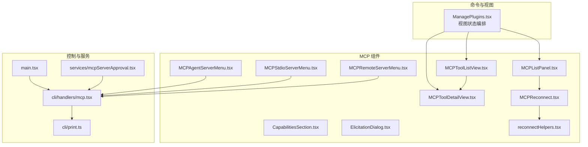
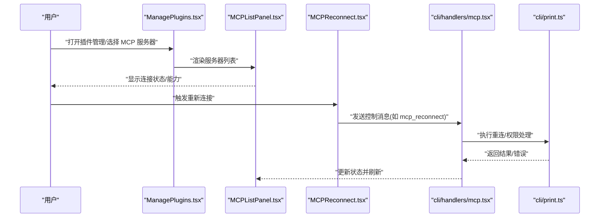
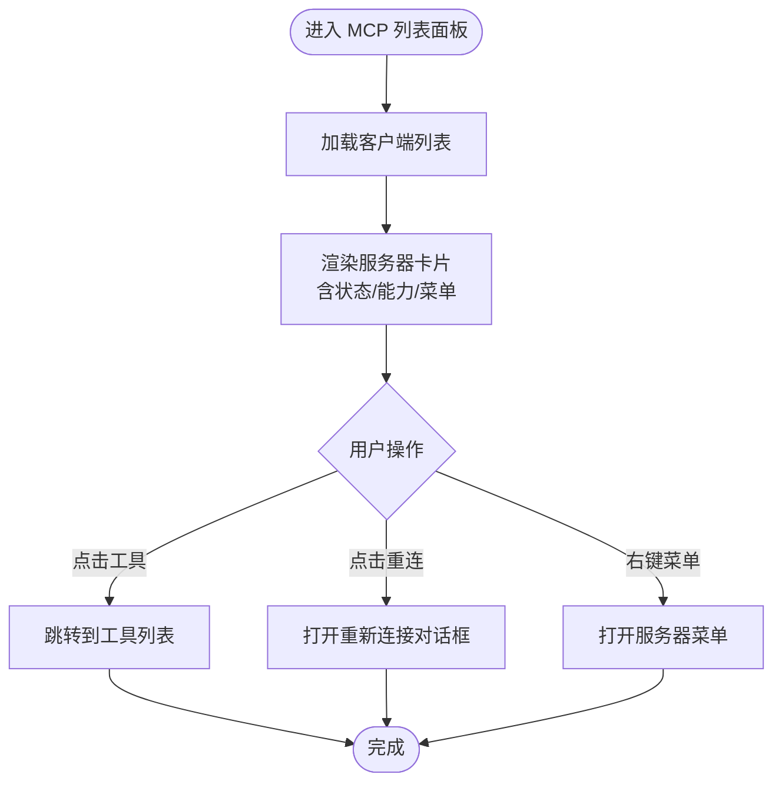
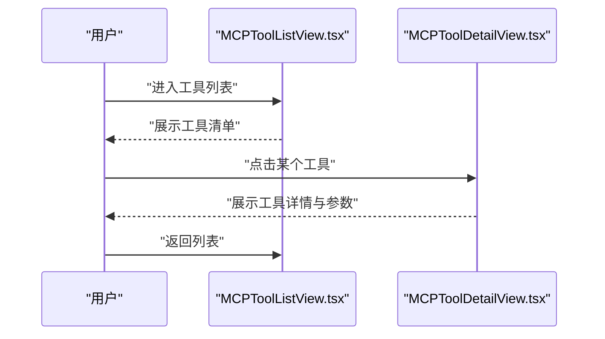
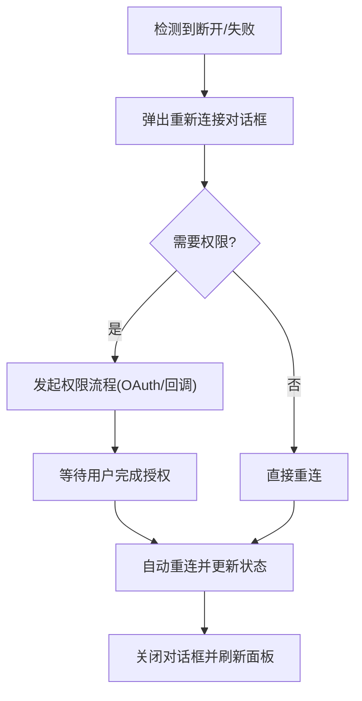
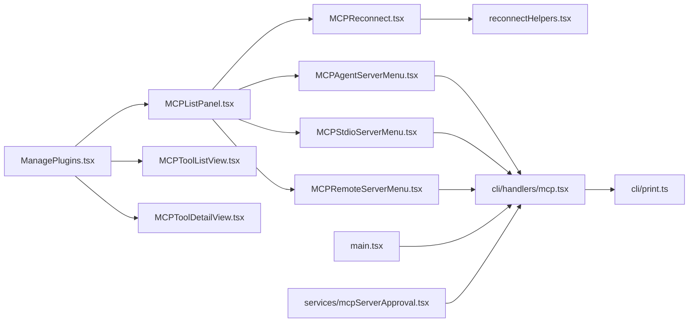

# UI 组件与交互

<cite>
**本文引用的文件**   
- [src/components/mcp/MCPListPanel.tsx](file://src/components/mcp/MCPListPanel.tsx)
- [src/components/mcp/CapabilitiesSection.tsx](file://src/components/mcp/CapabilitiesSection.tsx)
- [src/components/mcp/MCPToolListView.tsx](file://src/components/mcp/MCPToolListView.tsx)
- [src/components/mcp/MCPToolDetailView.tsx](file://src/components/mcp/MCPToolDetailView.tsx)
- [src/components/mcp/MCPReconnect.tsx](file://src/components/mcp/MCPReconnect.tsx)
- [src/components/mcp/ElicitationDialog.tsx](file://src/components/mcp/ElicitationDialog.tsx)
- [src/components/mcp/MCPAgentServerMenu.tsx](file://src/components/mcp/MCPAgentServerMenu.tsx)
- [src/components/mcp/MCPStdioServerMenu.tsx](file://src/components/mcp/MCPStdioServerMenu.tsx)
- [src/components/mcp/MCPRemoteServerMenu.tsx](file://src/components/mcp/MCPRemoteServerMenu.tsx)
- [src/components/mcp/utils/reconnectHelpers.tsx](file://src/components/mcp/utils/reconnectHelpers.tsx)
- [src/commands/plugin/ManagePlugins.tsx](file://src/commands/plugin/ManagePlugins.tsx)
- [src/cli/handlers/mcp.tsx](file://src/cli/handlers/mcp.tsx)
- [src/services/mcpServerApproval.tsx](file://src/services/mcpServerApproval.tsx)
- [src/cli/print.ts](file://src/cli/print.ts)
- [src/main.tsx](file://src/main.tsx)
</cite>

## 目录
1. [引言](#引言)
2. [项目结构](#项目结构)
3. [核心组件](#核心组件)
4. [架构总览](#架构总览)
5. [组件详解](#组件详解)
6. [依赖关系分析](#依赖关系分析)
7. [性能考量](#性能考量)
8. [故障排查指南](#故障排查指南)
9. [结论](#结论)
10. [附录：扩展与自定义指南](#附录扩展与自定义指南)

## 引言
本文件聚焦于 MCP（Model Context Protocol）在前端 UI 中的组件化实现与用户交互流程，涵盖 MCP 列表面板、能力展示、工具列表与详情、重新连接对话框，以及服务器菜单（代理/标准输入/远程）的管理界面。文档同时阐述权限请求处理、连接状态可视化与错误信息展示机制，并给出组件间通信模式、状态管理与响应式设计建议，最后提供 UI 扩展与自定义组件开发指南。

## 项目结构
MCP UI 相关代码主要分布在以下位置：
- 组件层：src/components/mcp 下的面板、列表、详情、菜单与重连对话框等
- 视图编排：src/commands/plugin/ManagePlugins.tsx 中的视图状态切换与导航
- 命令与控制消息：src/cli/handlers/mcp.tsx 与 CLI 输出逻辑 src/cli/print.ts
- 启动与动态配置：src/main.tsx 中的动态 MCP 配置解析与应用
- 服务与审批：src/services/mcpServerApproval.tsx 的服务器审批流程



图表来源
- [src/commands/plugin/ManagePlugins.tsx](file://src/commands/plugin/ManagePlugins.tsx)
- [src/components/mcp/MCPListPanel.tsx](file://src/components/mcp/MCPListPanel.tsx)
- [src/components/mcp/MCPToolListView.tsx](file://src/components/mcp/MCPToolListView.tsx)
- [src/components/mcp/MCPToolDetailView.tsx](file://src/components/mcp/MCPToolDetailView.tsx)
- [src/components/mcp/MCPReconnect.tsx](file://src/components/mcp/MCPReconnect.tsx)
- [src/components/mcp/ElicitationDialog.tsx](file://src/components/mcp/ElicitationDialog.tsx)
- [src/components/mcp/MCPAgentServerMenu.tsx](file://src/components/mcp/MCPAgentServerMenu.tsx)
- [src/components/mcp/MCPStdioServerMenu.tsx](file://src/components/mcp/MCPStdioServerMenu.tsx)
- [src/components/mcp/MCPRemoteServerMenu.tsx](file://src/components/mcp/MCPRemoteServerMenu.tsx)
- [src/components/mcp/utils/reconnectHelpers.tsx](file://src/components/mcp/utils/reconnectHelpers.tsx)
- [src/cli/handlers/mcp.tsx](file://src/cli/handlers/mcp.tsx)
- [src/cli/print.ts](file://src/cli/print.ts)
- [src/services/mcpServerApproval.tsx](file://src/services/mcpServerApproval.tsx)
- [src/main.tsx](file://src/main.tsx)

章节来源
- [src/commands/plugin/ManagePlugins.tsx](file://src/commands/plugin/ManagePlugins.tsx)
- [src/components/mcp/MCPListPanel.tsx](file://src/components/mcp/MCPListPanel.tsx)
- [src/components/mcp/MCPToolListView.tsx](file://src/components/mcp/MCPToolListView.tsx)
- [src/components/mcp/MCPToolDetailView.tsx](file://src/components/mcp/MCPToolDetailView.tsx)
- [src/components/mcp/MCPReconnect.tsx](file://src/components/mcp/MCPReconnect.tsx)
- [src/components/mcp/ElicitationDialog.tsx](file://src/components/mcp/ElicitationDialog.tsx)
- [src/components/mcp/MCPAgentServerMenu.tsx](file://src/components/mcp/MCPAgentServerMenu.tsx)
- [src/components/mcp/MCPStdioServerMenu.tsx](file://src/components/mcp/MCPStdioServerMenu.tsx)
- [src/components/mcp/MCPRemoteServerMenu.tsx](file://src/components/mcp/MCPRemoteServerMenu.tsx)
- [src/components/mcp/utils/reconnectHelpers.tsx](file://src/components/mcp/utils/reconnectHelpers.tsx)
- [src/cli/handlers/mcp.tsx](file://src/cli/handlers/mcp.tsx)
- [src/cli/print.ts](file://src/cli/print.ts)
- [src/services/mcpServerApproval.tsx](file://src/services/mcpServerApproval.tsx)
- [src/main.tsx](file://src/main.tsx)

## 核心组件
- MCP 列表面板：展示已配置与已连接的 MCP 服务器，支持排序、过滤与操作入口
- 能力展示：呈现服务器支持的能力（如工具、资源、提示词等）
- 工具列表与详情：按服务器维度列出可用工具，进入工具详情页查看参数与使用说明
- 重新连接对话框：在断开或失败时引导用户进行重连与权限处理
- 服务器菜单：分别针对代理服务器、标准输入服务器与远程（SSE/HTTP）服务器提供菜单项与操作
- 权限与审批：通过审批对话框与 CLI 控制消息处理权限请求与认证流程

章节来源
- [src/components/mcp/MCPListPanel.tsx](file://src/components/mcp/MCPListPanel.tsx)
- [src/components/mcp/CapabilitiesSection.tsx](file://src/components/mcp/CapabilitiesSection.tsx)
- [src/components/mcp/MCPToolListView.tsx](file://src/components/mcp/MCPToolListView.tsx)
- [src/components/mcp/MCPToolDetailView.tsx](file://src/components/mcp/MCPToolDetailView.tsx)
- [src/components/mcp/MCPReconnect.tsx](file://src/components/mcp/MCPReconnect.tsx)
- [src/components/mcp/MCPAgentServerMenu.tsx](file://src/components/mcp/MCPAgentServerMenu.tsx)
- [src/components/mcp/MCPStdioServerMenu.tsx](file://src/components/mcp/MCPStdioServerMenu.tsx)
- [src/components/mcp/MCPRemoteServerMenu.tsx](file://src/components/mcp/MCPRemoteServerMenu.tsx)
- [src/services/mcpServerApproval.tsx](file://src/services/mcpServerApproval.tsx)

## 架构总览
MCP UI 的交互由“视图状态编排”驱动，配合“组件层”渲染具体 UI；“控制消息”与“CLI 输出”负责与后端桥接与状态同步；“服务层”处理审批与权限流程；“启动入口”负责动态配置注入。



图表来源
- [src/commands/plugin/ManagePlugins.tsx](file://src/commands/plugin/ManagePlugins.tsx)
- [src/components/mcp/MCPListPanel.tsx](file://src/components/mcp/MCPListPanel.tsx)
- [src/components/mcp/MCPReconnect.tsx](file://src/components/mcp/MCPReconnect.tsx)
- [src/cli/handlers/mcp.tsx](file://src/cli/handlers/mcp.tsx)
- [src/cli/print.ts](file://src/cli/print.ts)

## 组件详解

### MCP 列表面板（MCPListPanel）
- 职责：展示所有 MCP 客户端（服务器），包括名称、类型、连接状态、能力概览与操作入口
- 状态：从全局状态中读取客户端集合，根据连接状态与能力进行可视化
- 交互：点击进入“工具列表”，点击“重新连接”弹出对话框，右键打开对应菜单



图表来源
- [src/components/mcp/MCPListPanel.tsx](file://src/components/mcp/MCPListPanel.tsx)

章节来源
- [src/components/mcp/MCPListPanel.tsx](file://src/components/mcp/MCPListPanel.tsx)

### 能力展示（CapabilitiesSection）
- 职责：以分组方式展示服务器能力，如工具、资源、提示词等
- 数据来源：来自客户端状态中的能力字段
- 可视化：按类别折叠/展开，支持搜索与快速定位

章节来源
- [src/components/mcp/CapabilitiesSection.tsx](file://src/components/mcp/CapabilitiesSection.tsx)

### 工具列表与详情（MCPToolListView / MCPToolDetailView）
- 工具列表：按服务器筛选工具，支持分页/搜索；点击进入详情
- 工具详情：展示工具参数、描述、示例调用与使用限制
- 导航：列表页支持返回上级（如服务器详情）



图表来源
- [src/components/mcp/MCPToolListView.tsx](file://src/components/mcp/MCPToolListView.tsx)
- [src/components/mcp/MCPToolDetailView.tsx](file://src/components/mcp/MCPToolDetailView.tsx)

章节来源
- [src/components/mcp/MCPToolListView.tsx](file://src/components/mcp/MCPToolListView.tsx)
- [src/components/mcp/MCPToolDetailView.tsx](file://src/components/mcp/MCPToolDetailView.tsx)

### 重新连接对话框（MCPReconnect）
- 触发：当服务器断开或连接失败时弹出
- 功能：引导用户进行权限处理（如 OAuth）、手动回调、或直接重连
- 协同：与 CLI 控制消息配合，完成后刷新状态



图表来源
- [src/components/mcp/MCPReconnect.tsx](file://src/components/mcp/MCPReconnect.tsx)
- [src/components/mcp/utils/reconnectHelpers.tsx](file://src/components/mcp/utils/reconnectHelpers.tsx)
- [src/cli/handlers/mcp.tsx](file://src/cli/handlers/mcp.tsx)
- [src/cli/print.ts](file://src/cli/print.ts)

章节来源
- [src/components/mcp/MCPReconnect.tsx](file://src/components/mcp/MCPReconnect.tsx)
- [src/components/mcp/utils/reconnectHelpers.tsx](file://src/components/mcp/utils/reconnectHelpers.tsx)
- [src/cli/handlers/mcp.tsx](file://src/cli/handlers/mcp.tsx)
- [src/cli/print.ts](file://src/cli/print.ts)

### 服务器菜单（MCPAgentServerMenu / MCPStdioServerMenu / MCPRemoteServerMenu）
- 代理服务器菜单：提供与代理相关的操作入口（如启用通道、配置）
- 标准输入服务器菜单：提供本地进程交互入口（如重启、日志）
- 远程服务器菜单：针对 SSE/HTTP 类型服务器的操作（如认证、清空令牌、重连）

```mermaid
classDiagram
class MCPAgentServerMenu {
+handleEnableChannel()
+handleConfigure()
}
class MCPStdioServerMenu {
+handleRestart()
+handleViewLogs()
}
class MCPRemoteServerMenu {
+handleAuthenticate()
+handleClearAuth()
+handleReconnect()
}
MCPAgentServerMenu --> "调用" cli/handlers/mcp.tsx
MCPStdioServerMenu --> "调用" cli/handlers/mcp.tsx
MCPRemoteServerMenu --> "调用" cli/handlers/mcp.tsx
```

图表来源
- [src/components/mcp/MCPAgentServerMenu.tsx](file://src/components/mcp/MCPAgentServerMenu.tsx)
- [src/components/mcp/MCPStdioServerMenu.tsx](file://src/components/mcp/MCPStdioServerMenu.tsx)
- [src/components/mcp/MCPRemoteServerMenu.tsx](file://src/components/mcp/MCPRemoteServerMenu.tsx)
- [src/cli/handlers/mcp.tsx](file://src/cli/handlers/mcp.tsx)

章节来源
- [src/components/mcp/MCPAgentServerMenu.tsx](file://src/components/mcp/MCPAgentServerMenu.tsx)
- [src/components/mcp/MCPStdioServerMenu.tsx](file://src/components/mcp/MCPStdioServerMenu.tsx)
- [src/components/mcp/MCPRemoteServerMenu.tsx](file://src/components/mcp/MCPRemoteServerMenu.tsx)
- [src/cli/handlers/mcp.tsx](file://src/cli/handlers/mcp.tsx)

### 权限请求与审批（mcpServerApproval）
- 流程：当服务器需要用户授权时，弹出审批对话框，用户确认后进入授权流程
- 协作：与 CLI 控制消息配合，完成授权后自动重连并更新状态

章节来源
- [src/services/mcpServerApproval.tsx](file://src/services/mcpServerApproval.tsx)
- [src/cli/handlers/mcp.tsx](file://src/cli/handlers/mcp.tsx)
- [src/cli/print.ts](file://src/cli/print.ts)

### 视图编排与导航（ManagePlugins）
- 负责在“服务器详情/工具列表/工具详情”之间切换
- 根据当前选中的客户端构建 ServerInfo 并传递给子组件

章节来源
- [src/commands/plugin/ManagePlugins.tsx](file://src/commands/plugin/ManagePlugins.tsx)

## 依赖关系分析
- 组件耦合：MCP 列表面板作为根容器，其他组件（列表/详情/重连/菜单）均围绕其状态与事件展开
- 外部依赖：CLI 控制消息与打印输出负责与后端桥接，动态配置在启动时注入
- 状态来源：全局应用状态（AppState）与动态 MCP 状态（dynamicMcpState）共同决定 UI 表现



图表来源
- [src/commands/plugin/ManagePlugins.tsx](file://src/commands/plugin/ManagePlugins.tsx)
- [src/components/mcp/MCPListPanel.tsx](file://src/components/mcp/MCPListPanel.tsx)
- [src/components/mcp/MCPToolListView.tsx](file://src/components/mcp/MCPToolListView.tsx)
- [src/components/mcp/MCPToolDetailView.tsx](file://src/components/mcp/MCPToolDetailView.tsx)
- [src/components/mcp/MCPReconnect.tsx](file://src/components/mcp/MCPReconnect.tsx)
- [src/components/mcp/utils/reconnectHelpers.tsx](file://src/components/mcp/utils/reconnectHelpers.tsx)
- [src/components/mcp/MCPAgentServerMenu.tsx](file://src/components/mcp/MCPAgentServerMenu.tsx)
- [src/components/mcp/MCPStdioServerMenu.tsx](file://src/components/mcp/MCPStdioServerMenu.tsx)
- [src/components/mcp/MCPRemoteServerMenu.tsx](file://src/components/mcp/MCPRemoteServerMenu.tsx)
- [src/cli/handlers/mcp.tsx](file://src/cli/handlers/mcp.tsx)
- [src/cli/print.ts](file://src/cli/print.ts)
- [src/services/mcpServerApproval.tsx](file://src/services/mcpServerApproval.tsx)
- [src/main.tsx](file://src/main.tsx)

章节来源
- [src/commands/plugin/ManagePlugins.tsx](file://src/commands/plugin/ManagePlugins.tsx)
- [src/components/mcp/MCPListPanel.tsx](file://src/components/mcp/MCPListPanel.tsx)
- [src/components/mcp/MCPToolListView.tsx](file://src/components/mcp/MCPToolListView.tsx)
- [src/components/mcp/MCPToolDetailView.tsx](file://src/components/mcp/MCPToolDetailView.tsx)
- [src/components/mcp/MCPReconnect.tsx](file://src/components/mcp/MCPReconnect.tsx)
- [src/components/mcp/utils/reconnectHelpers.tsx](file://src/components/mcp/utils/reconnectHelpers.tsx)
- [src/components/mcp/MCPAgentServerMenu.tsx](file://src/components/mcp/MCPAgentServerMenu.tsx)
- [src/components/mcp/MCPStdioServerMenu.tsx](file://src/components/mcp/MCPStdioServerMenu.tsx)
- [src/components/mcp/MCPRemoteServerMenu.tsx](file://src/components/mcp/MCPRemoteServerMenu.tsx)
- [src/cli/handlers/mcp.tsx](file://src/cli/handlers/mcp.tsx)
- [src/cli/print.ts](file://src/cli/print.ts)
- [src/services/mcpServerApproval.tsx](file://src/services/mcpServerApproval.tsx)
- [src/main.tsx](file://src/main.tsx)

## 性能考量
- 渲染优化：对工具列表采用虚拟滚动与分页，避免一次性渲染大量节点
- 状态缓存：能力与资源数据在状态中缓存，减少重复查询
- 重连节流：重连对话框内对重连按钮进行防抖，避免频繁触发
- 懒加载：菜单与详情组件按需加载，降低首屏压力

## 故障排查指南
- 无法连接/频繁断开
  - 检查服务器菜单中的“清空令牌/重连”选项，必要时重新授权
  - 查看 CLI 输出中的错误码与堆栈，定位网络或认证问题
- 工具不可见
  - 在“能力展示”中确认服务器是否声明该工具
  - 使用“工具列表”搜索工具名，检查过滤条件
- 重新连接无响应
  - 确认权限流程已完成，若为手动回调，确保回调地址正确
  - 查看“重新连接对话框”的状态提示与日志

章节来源
- [src/components/mcp/MCPReconnect.tsx](file://src/components/mcp/MCPReconnect.tsx)
- [src/components/mcp/MCPRemoteServerMenu.tsx](file://src/components/mcp/MCPRemoteServerMenu.tsx)
- [src/cli/handlers/mcp.tsx](file://src/cli/handlers/mcp.tsx)
- [src/cli/print.ts](file://src/cli/print.ts)

## 结论
MCP UI 通过清晰的组件分层与视图编排，实现了从服务器概览到工具细节的完整交互链路。配合权限审批与重连机制，保证了在复杂网络与认证场景下的稳定性。未来可在虚拟滚动、能力缓存与错误可视化方面进一步优化。

## 附录：扩展与自定义指南
- 新增服务器菜单项
  - 在对应菜单组件中添加新动作，调用 CLI 控制消息处理器
  - 在状态中新增字段并在面板中渲染
- 自定义工具详情
  - 在工具详情组件中扩展渲染区域，增加参数校验与示例
- 响应式设计
  - 使用栅格布局与断点适配，移动端优先展示关键信息（状态/重连）
- 错误与提示
  - 将错误映射为可读文案，提供一键重试与复制日志功能