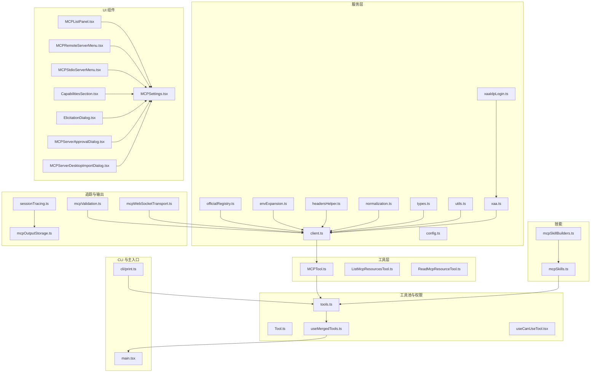
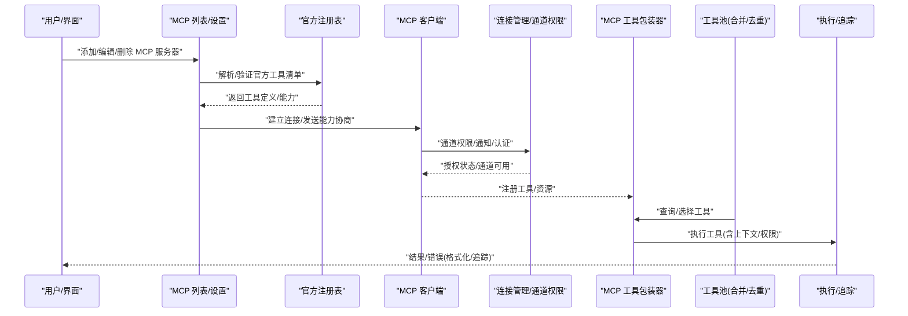
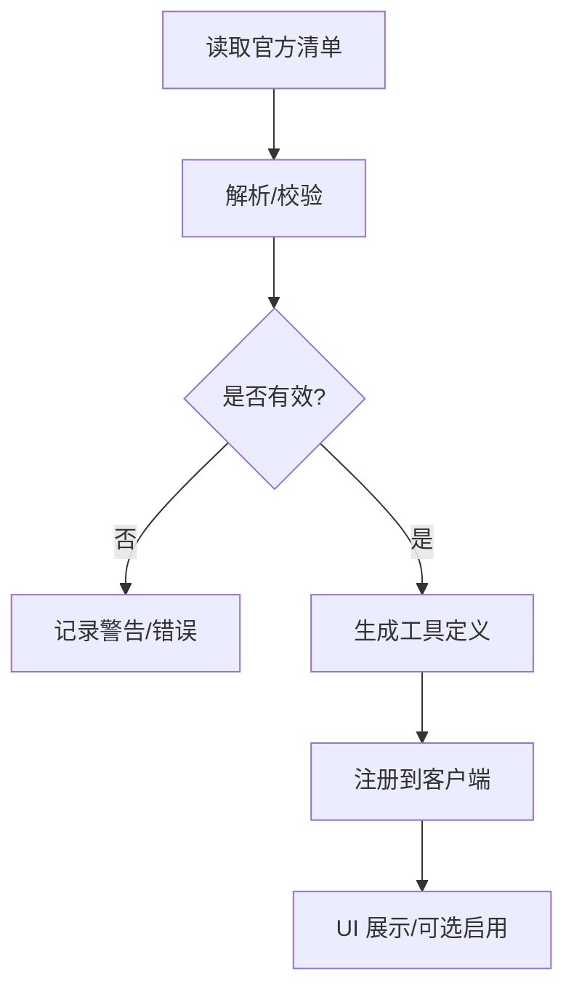
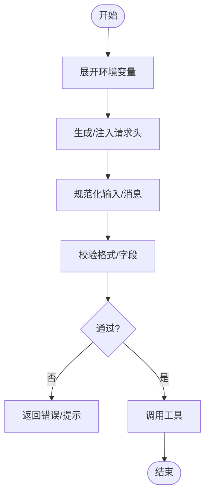
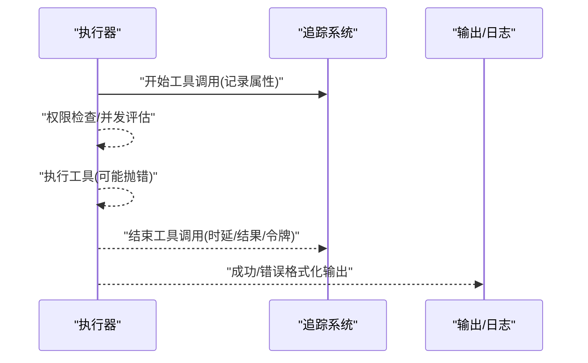
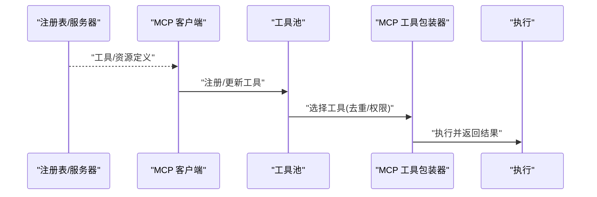
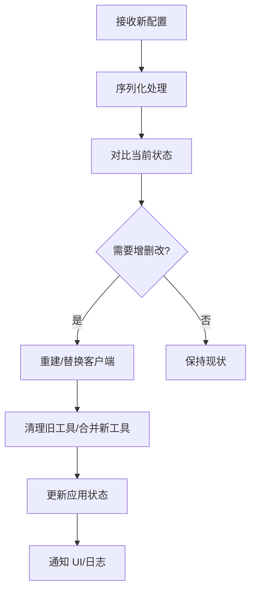
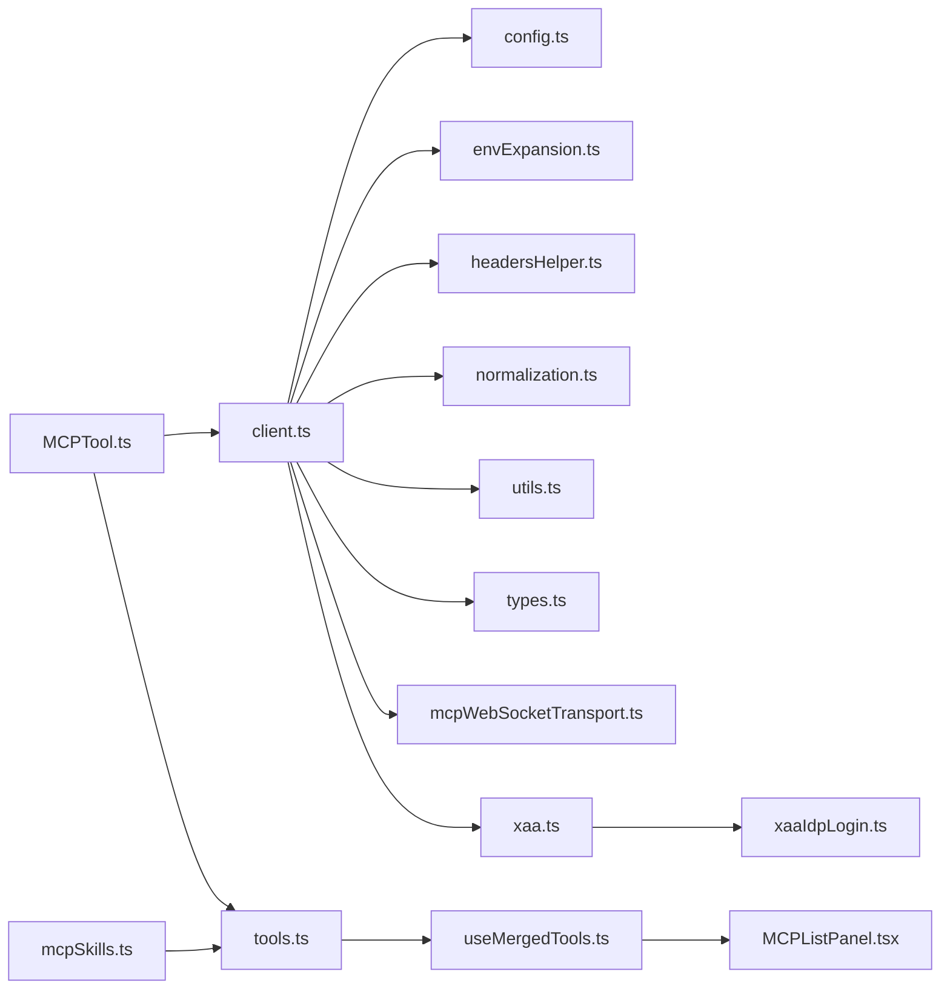

# 工具集成

<cite>
**本文引用的文件**
- [src/services/mcp/officialRegistry.ts](file://src/services/mcp/officialRegistry.ts)
- [src/services/mcp/client.ts](file://src/services/mcp/client.ts)
- [src/services/mcp/config.ts](file://src/services/mcp/config.ts)
- [src/services/mcp/envExpansion.ts](file://src/services/mcp/envExpansion.ts)
- [src/services/mcp/headersHelper.ts](file://src/services/mcp/headersHelper.ts)
- [src/services/mcp/normalization.ts](file://src/services/mcp/normalization.ts)
- [src/services/mcp/types.ts](file://src/services/mcp/types.ts)
- [src/services/mcp/utils.ts](file://src/services/mcp/utils.ts)
- [src/services/mcp/xaa.ts](file://src/services/mcp/xaa.ts)
- [src/services/mcp/xaaIdpLogin.ts](file://src/services/mcp/xaaIdpLogin.ts)
- [src/tools/MCPTool/MCPTool.ts](file://src/tools/MCPTool/MCPTool.ts)
- [src/tools/ListMcpResourcesTool/ListMcpResourcesTool.ts](file://src/tools/ListMcpResourcesTool/ListMcpResourcesTool.ts)
- [src/tools/ReadMcpResourceTool/ReadMcpResourceTool.ts](file://src/tools/ReadMcpResourceTool/ReadMcpResourceTool.ts)
- [src/utils/mcpValidation.ts](file://src/utils/mcpValidation.ts)
- [src/utils/mcpWebSocketTransport.ts](file://src/utils/mcpWebSocketTransport.ts)
- [src/utils/mcpOutputStorage.ts](file://src/utils/mcpOutputStorage.ts)
- [src/utils/mcpInstructionsDelta.ts](file://src/utils/mcpInstructionsDelta.ts)
- [src/utils/claudeInChrome/mcpServer.ts](file://src/utils/claudeInChrome/mcpServer.ts)
- [src/utils/computerUse/mcpServer.ts](file://src/utils/computerUse/mcpServer.ts)
- [src/skills/mcpSkillBuilders.ts](file://src/skills/mcpSkillBuilders.ts)
- [src/skills/mcpSkills.ts](file://src/skills/mcpSkills.ts)
- [src/components/mcp/MCPListPanel.tsx](file://src/components/mcp/MCPListPanel.tsx)
- [src/components/mcp/MCPRemoteServerMenu.tsx](file://src/components/mcp/MCPRemoteServerMenu.tsx)
- [src/components/mcp/MCPStdioServerMenu.tsx](file://src/components/mcp/MCPStdioServerMenu.tsx)
- [src/components/mcp/MCPSettings.tsx](file://src/components/mcp/MCPSettings.tsx)
- [src/components/mcp/CapabilitiesSection.tsx](file://src/components/mcp/CapabilitiesSection.tsx)
- [src/components/mcp/ElicitationDialog.tsx](file://src/components/mcp/ElicitationDialog.tsx)
- [src/components/mcp/MCPServerApprovalDialog.tsx](file://src/components/mcp/MCPServerApprovalDialog.tsx)
- [src/components/mcp/MCPServerDesktopImportDialog.tsx](file://src/components/mcp/MCPServerDesktopImportDialog.tsx)
- [src/hooks/toolPermission/useCanUseTool.tsx](file://src/hooks/toolPermission/useCanUseTool.tsx)
- [src/hooks/useMergedTools.ts](file://src/hooks/useMergedTools.ts)
- [src/tools.ts](file://src/tools.ts)
- [src/Tool.ts](file://src/Tool.ts)
- [src/cli/print.ts](file://src/cli/print.ts)
- [src/main.tsx](file://src/main.tsx)
- [src/utils/telemetry/sessionTracing.ts](file://src/utils/telemetry/sessionTracing.ts)
</cite>

## 目录
1. [简介](#简介)
2. [项目结构](#项目结构)
3. [核心组件](#核心组件)
4. [架构总览](#架构总览)
5. [详细组件分析](#详细组件分析)
6. [依赖关系分析](#依赖关系分析)
7. [性能考量](#性能考量)
8. [故障排查指南](#故障排查指南)
9. [结论](#结论)
10. [附录](#附录)

## 简介
本文件系统性梳理 Claude Code 中的 MCP（Model Context Protocol）工具集成体系，覆盖工具发现、注册与调用机制；官方工具注册表与第三方工具集成流程；工具参数的动态获取、环境变量展开与请求头处理；工具执行上下文管理、结果格式化与错误传播；以及自定义 MCP 工具开发指南与性能优化策略。目标是帮助开发者在不深入源码的前提下，理解并高效使用与扩展 MCP 工具生态。

## 项目结构
围绕 MCP 的核心代码分布在以下模块：
- 服务层：MCP 客户端、配置、环境变量展开、请求头辅助、规范化与校验、类型定义、工具集与实用函数等
- 工具层：MCP 工具包装器、资源列举与读取工具
- UI 组件：MCP 列表面板、菜单、设置、能力展示、提示对话框与审批流程
- 技能与技能构建器：MCP 技能的加载与构建
- 工具池与权限：工具合并、去重、权限检查与过滤
- CLI 与主入口：服务器变更应用、SDK MCP 客户端初始化、工具池装配
- 追踪与输出：工具执行追踪、结果格式化与错误传播

图表来源
- [src/services/mcp/officialRegistry.ts](file://src/services/mcp/officialRegistry.ts)
- [src/services/mcp/client.ts](file://src/services/mcp/client.ts)
- [src/services/mcp/config.ts](file://src/services/mcp/config.ts)
- [src/services/mcp/envExpansion.ts](file://src/services/mcp/envExpansion.ts)
- [src/services/mcp/headersHelper.ts](file://src/services/mcp/headersHelper.ts)
- [src/services/mcp/normalization.ts](file://src/services/mcp/normalization.ts)
- [src/services/mcp/types.ts](file://src/services/mcp/types.ts)
- [src/services/mcp/utils.ts](file://src/services/mcp/utils.ts)
- [src/services/mcp/xaa.ts](file://src/services/mcp/xaa.ts)
- [src/services/mcp/xaaIdpLogin.ts](file://src/services/mcp/xaaIdpLogin.ts)
- [src/tools/MCPTool/MCPTool.ts](file://src/tools/MCPTool/MCPTool.ts)
- [src/tools/ListMcpResourcesTool/ListMcpResourcesTool.ts](file://src/tools/ListMcpResourcesTool/ListMcpResourcesTool.ts)
- [src/tools/ReadMcpResourceTool/ReadMcpResourceTool.ts](file://src/tools/ReadMcpResourceTool/ReadMcpResourceTool.ts)
- [src/components/mcp/MCPListPanel.tsx](file://src/components/mcp/MCPListPanel.tsx)
- [src/components/mcp/MCPRemoteServerMenu.tsx](file://src/components/mcp/MCPRemoteServerMenu.tsx)
- [src/components/mcp/MCPStdioServerMenu.tsx](file://src/components/mcp/MCPStdioServerMenu.tsx)
- [src/components/mcp/MCPSettings.tsx](file://src/components/mcp/MCPSettings.tsx)
- [src/components/mcp/CapabilitiesSection.tsx](file://src/components/mcp/CapabilitiesSection.tsx)
- [src/components/mcp/ElicitationDialog.tsx](file://src/components/mcp/ElicitationDialog.tsx)
- [src/components/mcp/MCPServerApprovalDialog.tsx](file://src/components/mcp/MCPServerApprovalDialog.tsx)
- [src/components/mcp/MCPServerDesktopImportDialog.tsx](file://src/components/mcp/MCPServerDesktopImportDialog.tsx)
- [src/skills/mcpSkillBuilders.ts](file://src/skills/mcpSkillBuilders.ts)
- [src/skills/mcpSkills.ts](file://src/skills/mcpSkills.ts)
- [src/tools.ts](file://src/tools.ts)
- [src/Tool.ts](file://src/Tool.ts)
- [src/hooks/useMergedTools.ts](file://src/hooks/useMergedTools.ts)
- [src/hooks/toolPermission/useCanUseTool.tsx](file://src/hooks/toolPermission/useCanUseTool.tsx)
- [src/cli/print.ts](file://src/cli/print.ts)
- [src/main.tsx](file://src/main.tsx)
- [src/utils/telemetry/sessionTracing.ts](file://src/utils/telemetry/sessionTracing.ts)
- [src/utils/mcpOutputStorage.ts](file://src/utils/mcpOutputStorage.ts)
- [src/utils/mcpValidation.ts](file://src/utils/mcpValidation.ts)
- [src/utils/mcpWebSocketTransport.ts](file://src/utils/mcpWebSocketTransport.ts)

章节来源
- [src/services/mcp/officialRegistry.ts](file://src/services/mcp/officialRegistry.ts)
- [src/services/mcp/client.ts](file://src/services/mcp/client.ts)
- [src/tools.ts](file://src/tools.ts)
- [src/cli/print.ts](file://src/cli/print.ts)
- [src/main.tsx](file://src/main.tsx)

## 核心组件
- MCP 官方注册表与客户端
  - 官方注册表负责解析与验证官方工具清单，为工具发现与注册提供权威来源
  - MCP 客户端封装连接、消息传输、通道权限与通知、认证与 OAuth 登录、XAA 身份提供商登录等
- 配置与运行时支持
  - 配置模块提供服务器配置、通道白名单、指令增量更新、输出存储与 WebSocket 传输
  - 环境变量展开与请求头辅助确保参数与认证头按运行时环境正确注入
  - 规范化与校验保障工具定义与消息格式一致性
- 工具包装与资源访问
  - MCP 工具包装器将外部工具暴露为统一的 Tool 接口，支持权限检查、并发安全与只读标记
  - 资源列举与读取工具用于枚举与获取 MCP 服务器提供的资源
- UI 与交互
  - 多个 MCP 面板与菜单组件支撑服务器管理、能力展示、提示与审批流程
- 工具池与权限
  - 工具合并与去重逻辑保证内置工具优先、MCP 工具可选加入，并通过权限钩子进行过滤
- CLI 与主入口
  - 主入口负责解析 MCP 配置、应用服务器变更、初始化 SDK MCP 客户端与工具池装配
  - CLI 输出流中对错误进行格式化并传播到结构化 IO

章节来源
- [src/services/mcp/officialRegistry.ts](file://src/services/mcp/officialRegistry.ts)
- [src/services/mcp/client.ts](file://src/services/mcp/client.ts)
- [src/services/mcp/config.ts](file://src/services/mcp/config.ts)
- [src/services/mcp/envExpansion.ts](file://src/services/mcp/envExpansion.ts)
- [src/services/mcp/headersHelper.ts](file://src/services/mcp/headersHelper.ts)
- [src/services/mcp/normalization.ts](file://src/services/mcp/normalization.ts)
- [src/services/mcp/types.ts](file://src/services/mcp/types.ts)
- [src/services/mcp/utils.ts](file://src/services/mcp/utils.ts)
- [src/services/mcp/xaa.ts](file://src/services/mcp/xaa.ts)
- [src/services/mcp/xaaIdpLogin.ts](file://src/services/mcp/xaaIdpLogin.ts)
- [src/tools/MCPTool/MCPTool.ts](file://src/tools/MCPTool/MCPTool.ts)
- [src/tools/ListMcpResourcesTool/ListMcpResourcesTool.ts](file://src/tools/ListMcpResourcesTool/ListMcpResourcesTool.ts)
- [src/tools/ReadMcpResourceTool/ReadMcpResourceTool.ts](file://src/tools/ReadMcpResourceTool/ReadMcpResourceTool.ts)
- [src/components/mcp/MCPListPanel.tsx](file://src/components/mcp/MCPListPanel.tsx)
- [src/components/mcp/MCPRemoteServerMenu.tsx](file://src/components/mcp/MCPRemoteServerMenu.tsx)
- [src/components/mcp/MCPStdioServerMenu.tsx](file://src/components/mcp/MCPStdioServerMenu.tsx)
- [src/components/mcp/MCPSettings.tsx](file://src/components/mcp/MCPSettings.tsx)
- [src/components/mcp/CapabilitiesSection.tsx](file://src/components/mcp/CapabilitiesSection.tsx)
- [src/components/mcp/ElicitationDialog.tsx](file://src/components/mcp/ElicitationDialog.tsx)
- [src/components/mcp/MCPServerApprovalDialog.tsx](file://src/components/mcp/MCPServerApprovalDialog.tsx)
- [src/components/mcp/MCPServerDesktopImportDialog.tsx](file://src/components/mcp/MCPServerDesktopImportDialog.tsx)
- [src/tools.ts](file://src/tools.ts)
- [src/Tool.ts](file://src/Tool.ts)
- [src/hooks/useMergedTools.ts](file://src/hooks/useMergedTools.ts)
- [src/hooks/toolPermission/useCanUseTool.tsx](file://src/hooks/toolPermission/useCanUseTool.tsx)
- [src/cli/print.ts](file://src/cli/print.ts)
- [src/main.tsx](file://src/main.tsx)

## 架构总览
下图展示了 MCP 工具从“发现/注册”到“调用/执行”的整体流程，包括官方注册表、客户端、工具包装器、工具池、权限与 UI 的协同关系。

图表来源
- [src/services/mcp/officialRegistry.ts](file://src/services/mcp/officialRegistry.ts)
- [src/services/mcp/client.ts](file://src/services/mcp/client.ts)
- [src/tools/MCPTool/MCPTool.ts](file://src/tools/MCPTool/MCPTool.ts)
- [src/tools.ts](file://src/tools.ts)
- [src/hooks/useMergedTools.ts](file://src/hooks/useMergedTools.ts)
- [src/utils/telemetry/sessionTracing.ts](file://src/utils/telemetry/sessionTracing.ts)

## 详细组件分析

### 官方工具注册表与第三方工具集成
- 官方注册表负责解析与校验官方工具清单，生成标准化的工具定义，供客户端注册与 UI 展示
- 第三方工具集成通过标准 MCP 协议完成：客户端与服务器协商能力、建立通道、注册工具与资源，最终被工具池合并并暴露给会话

图表来源
- [src/services/mcp/officialRegistry.ts](file://src/services/mcp/officialRegistry.ts)
- [src/services/mcp/client.ts](file://src/services/mcp/client.ts)

章节来源
- [src/services/mcp/officialRegistry.ts](file://src/services/mcp/officialRegistry.ts)
- [src/services/mcp/client.ts](file://src/services/mcp/client.ts)

### 工具参数动态获取、环境变量展开与请求头处理
- 环境变量展开：在工具调用前对输入参数中的占位符进行替换，确保敏感信息与路径按运行时环境生效
- 请求头处理：根据认证方式与通道要求生成或注入必要的请求头，如令牌、代理或自定义头部
- 规范化与校验：对工具定义与消息进行规范化，避免歧义与不一致

图表来源
- [src/services/mcp/envExpansion.ts](file://src/services/mcp/envExpansion.ts)
- [src/services/mcp/headersHelper.ts](file://src/services/mcp/headersHelper.ts)
- [src/services/mcp/normalization.ts](file://src/services/mcp/normalization.ts)
- [src/utils/mcpValidation.ts](file://src/utils/mcpValidation.ts)

章节来源
- [src/services/mcp/envExpansion.ts](file://src/services/mcp/envExpansion.ts)
- [src/services/mcp/headersHelper.ts](file://src/services/mcp/headersHelper.ts)
- [src/services/mcp/normalization.ts](file://src/services/mcp/normalization.ts)
- [src/utils/mcpValidation.ts](file://src/utils/mcpValidation.ts)

### 工具执行上下文管理、结果格式化与错误传播
- 上下文管理：工具执行前进行权限检查与并发安全评估；执行后通过追踪系统记录时延、结果与令牌用量
- 结果格式化：CLI 输出与 UI 呈现采用统一的格式化策略，错误与成功路径分别处理
- 错误传播：在 CLI 流程中捕获异常并以结构化消息形式立即输出，确保用户可见且可诊断

图表来源
- [src/utils/telemetry/sessionTracing.ts](file://src/utils/telemetry/sessionTracing.ts)
- [src/cli/print.ts](file://src/cli/print.ts)
- [src/utils/mcpOutputStorage.ts](file://src/utils/mcpOutputStorage.ts)

章节来源
- [src/utils/telemetry/sessionTracing.ts](file://src/utils/telemetry/sessionTracing.ts)
- [src/cli/print.ts](file://src/cli/print.ts)
- [src/utils/mcpOutputStorage.ts](file://src/utils/mcpOutputStorage.ts)

### 工具发现、注册与调用机制
- 发现：通过官方注册表或服务器能力协商发现可用工具与资源
- 注册：客户端将工具注册到内部工具池，同时维护 SDK MCP 客户端与工具集合
- 调用：工具池按名称去重并优先内置工具；权限钩子进一步过滤不可用工具；最终由工具包装器执行

图表来源
- [src/services/mcp/officialRegistry.ts](file://src/services/mcp/officialRegistry.ts)
- [src/services/mcp/client.ts](file://src/services/mcp/client.ts)
- [src/tools.ts](file://src/tools.ts)
- [src/tools/MCPTool/MCPTool.ts](file://src/tools/MCPTool/MCPTool.ts)

章节来源
- [src/services/mcp/officialRegistry.ts](file://src/services/mcp/officialRegistry.ts)
- [src/services/mcp/client.ts](file://src/services/mcp/client.ts)
- [src/tools.ts](file://src/tools.ts)
- [src/tools/MCPTool/MCPTool.ts](file://src/tools/MCPTool/MCPTool.ts)

### 自定义 MCP 工具开发指南
- 工具定义与能力：遵循 MCP 协议规范，声明工具能力与参数模式；通过官方注册表或服务器能力协商暴露
- 包装与注册：使用 MCP 工具包装器将外部实现适配为统一 Tool 接口，确保具备权限检查、并发安全与只读标记等特性
- 参数与环境：在工具输入中使用环境变量占位符，结合环境变量展开模块确保运行时替换
- 认证与头：根据需要生成或注入请求头，必要时集成 OAuth 或 XAA 登录流程
- 权限与并发：合理标注 isConcurrencySafe、isReadOnly、isDestructive，以便工具池与权限钩子正确处理
- 资源访问：提供资源列举与读取工具，便于在会话中按需获取数据

章节来源
- [src/tools/MCPTool/MCPTool.ts](file://src/tools/MCPTool/MCPTool.ts)
- [src/Tool.ts](file://src/Tool.ts)
- [src/services/mcp/envExpansion.ts](file://src/services/mcp/envExpansion.ts)
- [src/services/mcp/headersHelper.ts](file://src/services/mcp/headersHelper.ts)
- [src/services/mcp/xaa.ts](file://src/services/mcp/xaa.ts)
- [src/services/mcp/xaaIdpLogin.ts](file://src/services/mcp/xaaIdpLogin.ts)
- [src/tools/ListMcpResourcesTool/ListMcpResourcesTool.ts](file://src/tools/ListMcpResourcesTool/ListMcpResourcesTool.ts)
- [src/tools/ReadMcpResourceTool/ReadMcpResourceTool.ts](file://src/tools/ReadMcpResourceTool/ReadMcpResourceTool.ts)

### MCP 服务器变更与 SDK 客户端同步
- 动态变更：支持在运行时增删改 MCP 服务器配置，序列化处理防止竞态
- SDK 同步：重新初始化 SDK MCP 客户端，清理旧工具并合并新工具，保持工具池一致性
- 应用与回滚：通过响应对象记录新增/移除/错误，便于 UI 与日志反馈

图表来源
- [src/cli/print.ts](file://src/cli/print.ts)
- [src/main.tsx](file://src/main.tsx)

章节来源
- [src/cli/print.ts](file://src/cli/print.ts)
- [src/main.tsx](file://src/main.tsx)

## 依赖关系分析
- 模块内聚与耦合
  - 客户端与配置、环境展开、请求头、规范化与校验紧密耦合，形成稳定的工具调用链
  - 工具包装器与工具池解耦，通过统一接口对接不同来源的工具
  - UI 组件与工具池、权限钩子松耦合，通过状态与事件驱动交互
- 外部依赖与集成点
  - WebSocket 传输与指令增量更新用于实时通信与状态同步
  - OAuth/XAA 登录用于身份认证与授权
  - 技能系统与 MCP 工具共享工具池装配逻辑

图表来源
- [src/services/mcp/client.ts](file://src/services/mcp/client.ts)
- [src/services/mcp/config.ts](file://src/services/mcp/config.ts)
- [src/services/mcp/envExpansion.ts](file://src/services/mcp/envExpansion.ts)
- [src/services/mcp/headersHelper.ts](file://src/services/mcp/headersHelper.ts)
- [src/services/mcp/normalization.ts](file://src/services/mcp/normalization.ts)
- [src/services/mcp/utils.ts](file://src/services/mcp/utils.ts)
- [src/services/mcp/types.ts](file://src/services/mcp/types.ts)
- [src/services/mcp/xaa.ts](file://src/services/mcp/xaa.ts)
- [src/services/mcp/xaaIdpLogin.ts](file://src/services/mcp/xaaIdpLogin.ts)
- [src/utils/mcpWebSocketTransport.ts](file://src/utils/mcpWebSocketTransport.ts)
- [src/tools/MCPTool/MCPTool.ts](file://src/tools/MCPTool/MCPTool.ts)
- [src/tools.ts](file://src/tools.ts)
- [src/hooks/useMergedTools.ts](file://src/hooks/useMergedTools.ts)
- [src/components/mcp/MCPListPanel.tsx](file://src/components/mcp/MCPListPanel.tsx)
- [src/skills/mcpSkills.ts](file://src/skills/mcpSkills.ts)

章节来源
- [src/services/mcp/client.ts](file://src/services/mcp/client.ts)
- [src/utils/mcpWebSocketTransport.ts](file://src/utils/mcpWebSocketTransport.ts)
- [src/tools/MCPTool/MCPTool.ts](file://src/tools/MCPTool/MCPTool.ts)
- [src/tools.ts](file://src/tools.ts)
- [src/hooks/useMergedTools.ts](file://src/hooks/useMergedTools.ts)
- [src/components/mcp/MCPListPanel.tsx](file://src/components/mcp/MCPListPanel.tsx)
- [src/skills/mcpSkills.ts](file://src/skills/mcpSkills.ts)

## 性能考量
- 工具池稳定性：通过排序与去重确保缓存键稳定，避免频繁失效
- 并发安全：合理标注 isConcurrencySafe，减少不必要的串行化开销
- 传输与追踪：使用 WebSocket 降低轮询成本；追踪系统仅在启用时记录额外属性，避免无谓开销
- 输出与日志：CLI 输出流按需累积，避免长时间持有大量中间消息

章节来源
- [src/tools.ts](file://src/tools.ts)
- [src/Tool.ts](file://src/Tool.ts)
- [src/utils/telemetry/sessionTracing.ts](file://src/utils/telemetry/sessionTracing.ts)
- [src/cli/print.ts](file://src/cli/print.ts)

## 故障排查指南
- 服务器变更冲突：当同时收到“后台插件安装”与“控制消息”时，系统通过序列化调用避免竞态；若出现异常，检查响应对象中的错误列表
- 连接与通道：确认通道权限与通知状态；必要时重新建立连接或刷新授权
- 参数与头：核对环境变量展开与请求头生成是否符合预期；校验工具定义与消息格式
- 执行错误：查看 CLI 输出中的错误消息与内存错误堆栈；结合追踪系统定位耗时与失败原因

章节来源
- [src/cli/print.ts](file://src/cli/print.ts)
- [src/services/mcp/client.ts](file://src/services/mcp/client.ts)
- [src/services/mcp/envExpansion.ts](file://src/services/mcp/envExpansion.ts)
- [src/services/mcp/headersHelper.ts](file://src/services/mcp/headersHelper.ts)
- [src/utils/telemetry/sessionTracing.ts](file://src/utils/telemetry/sessionTracing.ts)

## 结论
该 MCP 工具集成体系以“注册表/客户端/工具包装器/工具池/权限/UI”为主线，实现了从工具发现、注册到调用的全链路闭环。通过环境变量展开、请求头处理与规范化校验，确保工具在多变运行环境中稳定工作；借助追踪与输出机制，提供可观测与可诊断的执行体验。对于自定义工具开发，建议严格遵循协议规范、合理标注工具属性、充分利用权限与并发模型，并通过官方注册表或服务器能力协商完成集成。

## 附录
- MCP 技能与技能构建器：将 MCP 工具纳入技能系统，统一装配与调度
- UI 交互：通过多个面板与对话框完成服务器管理、能力展示与审批流程
- 主入口与 CLI：负责配置解析、服务器变更应用与工具池装配，确保运行时一致性

章节来源
- [src/skills/mcpSkillBuilders.ts](file://src/skills/mcpSkillBuilders.ts)
- [src/skills/mcpSkills.ts](file://src/skills/mcpSkills.ts)
- [src/components/mcp/MCPListPanel.tsx](file://src/components/mcp/MCPListPanel.tsx)
- [src/components/mcp/MCPRemoteServerMenu.tsx](file://src/components/mcp/MCPRemoteServerMenu.tsx)
- [src/components/mcp/MCPStdioServerMenu.tsx](file://src/components/mcp/MCPStdioServerMenu.tsx)
- [src/components/mcp/MCPSettings.tsx](file://src/components/mcp/MCPSettings.tsx)
- [src/components/mcp/CapabilitiesSection.tsx](file://src/components/mcp/CapabilitiesSection.tsx)
- [src/components/mcp/ElicitationDialog.tsx](file://src/components/mcp/ElicitationDialog.tsx)
- [src/components/mcp/MCPServerApprovalDialog.tsx](file://src/components/mcp/MCPServerApprovalDialog.tsx)
- [src/components/mcp/MCPServerDesktopImportDialog.tsx](file://src/components/mcp/MCPServerDesktopImportDialog.tsx)
- [src/main.tsx](file://src/main.tsx)
- [src/cli/print.ts](file://src/cli/print.ts)