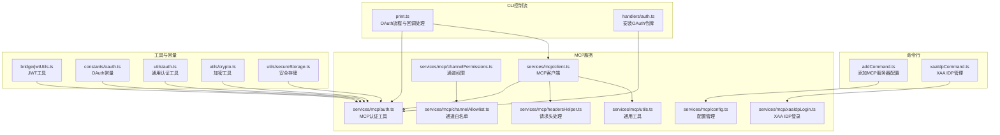
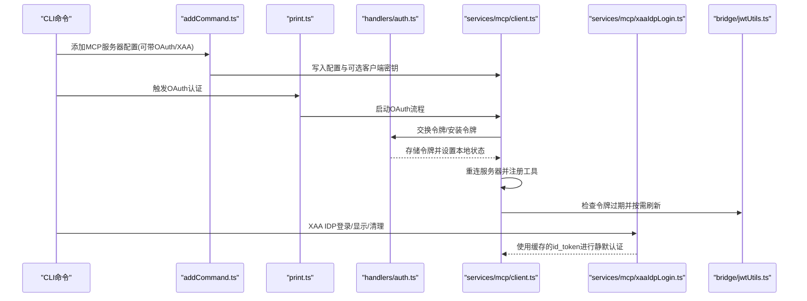
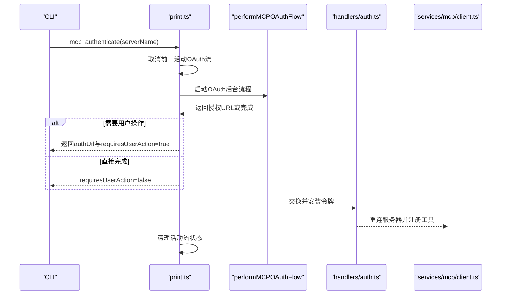
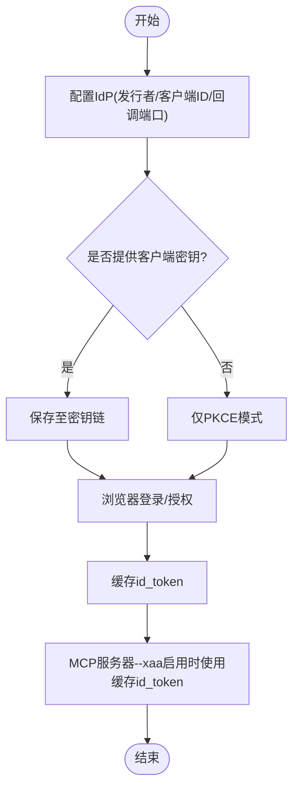
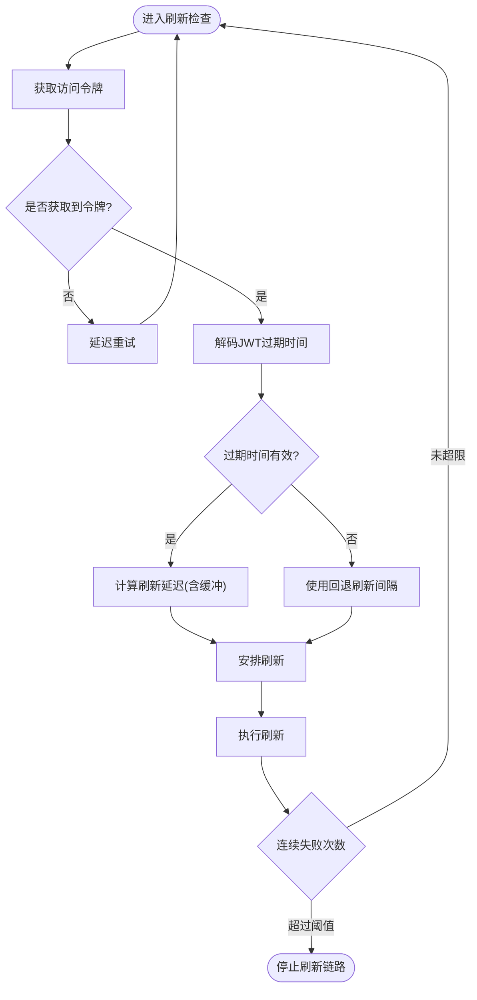
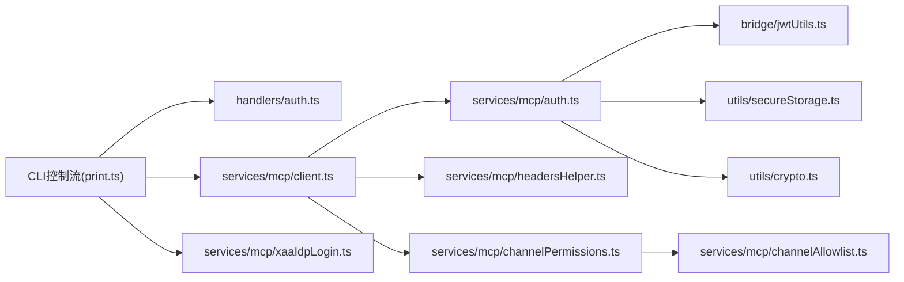

# 认证与授权

<cite>
**本文引用的文件**
- [src/commands/mcp/addCommand.ts](file://src/commands/mcp/addCommand.ts)
- [src/commands/mcp/xaaIdpCommand.ts](file://src/commands/mcp/xaaIdpCommand.ts)
- [src/cli/print.ts](file://src/cli/print.ts)
- [src/cli/handlers/auth.ts](file://src/cli/handlers/auth.ts)
- [src/bridge/jwtUtils.ts](file://src/bridge/jwtUtils.ts)
- [src/services/mcp/auth.ts](file://src/services/mcp/auth.ts)
- [src/services/mcp/xaaIdpLogin.ts](file://src/services/mcp/xaaIdpLogin.ts)
- [src/services/mcp/client.ts](file://src/services/mcp/client.ts)
- [src/services/mcp/config.ts](file://src/services/mcp/config.ts)
- [src/services/mcp/utils.ts](file://src/services/mcp/utils.ts)
- [src/services/mcp/channelPermissions.ts](file://src/services/mcp/channelPermissions.ts)
- [src/services/mcp/channelAllowlist.ts](file://src/services/mcp/channelAllowlist.ts)
- [src/services/mcp/headersHelper.ts](file://src/services/mcp/headersHelper.ts)
- [src/constants/oauth.ts](file://src/constants/oauth.ts)
- [src/utils/auth.ts](file://src/utils/auth.ts)
- [src/utils/crypto.ts](file://src/utils/crypto.ts)
- [src/utils/secureStorage.ts](file://src/utils/secureStorage.ts)
- [src/entrypoints/mcp.ts](file://src/entrypoints/mcp.ts)
</cite>

## 目录
1. [引言](#引言)
2. [项目结构](#项目结构)
3. [核心组件](#核心组件)
4. [架构总览](#架构总览)
5. [详细组件分析](#详细组件分析)
6. [依赖关系分析](#依赖关系分析)
7. [性能考量](#性能考量)
8. [故障排查指南](#故障排查指南)
9. [结论](#结论)
10. [附录](#附录)

## 引言
本文件系统性梳理 MCP（Model Context Protocol）认证与授权体系，覆盖以下主题：
- OAuth 流程与 API 密钥管理
- 会话令牌处理与自动刷新
- XAA（XDG Application Authentication）协议与 IDP 登录集成
- 通道权限控制、资源访问控制与权限继承机制
- 认证失败处理、令牌刷新策略与安全最佳实践
- 自定义认证方案的扩展指南

目标是帮助开发者在不深入源码的前提下理解整体设计，并为后续扩展与维护提供清晰指引。

## 项目结构
围绕认证与授权的关键目录与文件：
- 命令行入口与子命令：添加 MCP 服务器配置、XAA IDP 管理
- CLI 控制流：OAuth 授权、回调处理、重连与状态更新
- 服务层：MCP 客户端、认证工具、XAA IDP 登录、通道权限
- 工具与常量：JWT 工具、OAuth 常量、加密与安全存储

图表来源
- [src/commands/mcp/addCommand.ts:198-229](file://src/commands/mcp/addCommand.ts#L198-L229)
- [src/commands/mcp/xaaIdpCommand.ts:44-112](file://src/commands/mcp/xaaIdpCommand.ts#L44-L112)
- [src/cli/print.ts:3333-3402](file://src/cli/print.ts#L3333-L3402)
- [src/cli/handlers/auth.ts:50-80](file://src/cli/handlers/auth.ts#L50-L80)
- [src/services/mcp/client.ts](file://src/services/mcp/client.ts)
- [src/services/mcp/auth.ts](file://src/services/mcp/auth.ts)
- [src/services/mcp/xaaIdpLogin.ts](file://src/services/mcp/xaaIdpLogin.ts)
- [src/services/mcp/config.ts](file://src/services/mcp/config.ts)
- [src/services/mcp/utils.ts](file://src/services/mcp/utils.ts)
- [src/services/mcp/headersHelper.ts](file://src/services/mcp/headersHelper.ts)
- [src/services/mcp/channelPermissions.ts](file://src/services/mcp/channelPermissions.ts)
- [src/services/mcp/channelAllowlist.ts](file://src/services/mcp/channelAllowlist.ts)
- [src/bridge/jwtUtils.ts:34-183](file://src/bridge/jwtUtils.ts#L34-L183)
- [src/constants/oauth.ts](file://src/constants/oauth.ts)
- [src/utils/auth.ts](file://src/utils/auth.ts)
- [src/utils/crypto.ts](file://src/utils/crypto.ts)
- [src/utils/secureStorage.ts](file://src/utils/secureStorage.ts)

章节来源
- [src/commands/mcp/addCommand.ts:198-229](file://src/commands/mcp/addCommand.ts#L198-L229)
- [src/commands/mcp/xaaIdpCommand.ts:44-112](file://src/commands/mcp/xaaIdpCommand.ts#L44-L112)
- [src/cli/print.ts:3333-3402](file://src/cli/print.ts#L3333-L3402)
- [src/cli/handlers/auth.ts:50-80](file://src/cli/handlers/auth.ts#L50-L80)

## 核心组件
- OAuth 流程与令牌管理
  - CLI 触发 OAuth 授权、等待回调、安装令牌并触发重连
  - 令牌刷新：基于 JWT 过期时间与缓冲区策略自动刷新
- API 密钥管理
  - 通过命令行参数或密钥链保存客户端密钥；与 OAuth 并行支持
- XAA（XDG Application Authentication）与 IDP 集成
  - 统一的 IdP 配置与缓存；支持 PKCE 或含机密的授权；静默登录
- 通道权限与资源访问控制
  - 通道白名单与权限继承；插件来源校验；IDE 触发的通道启用
- 安全与最佳实践
  - HTTPS/localhost 限制、密钥链存储、错误处理与重试

章节来源
- [src/cli/print.ts:3333-3402](file://src/cli/print.ts#L3333-L3402)
- [src/bridge/jwtUtils.ts:34-183](file://src/bridge/jwtUtils.ts#L34-L183)
- [src/commands/mcp/xaaIdpCommand.ts:44-112](file://src/commands/mcp/xaaIdpCommand.ts#L44-L112)
- [src/services/mcp/channelPermissions.ts](file://src/services/mcp/channelPermissions.ts)
- [src/services/mcp/channelAllowlist.ts](file://src/services/mcp/channelAllowlist.ts)

## 架构总览
下图展示从 CLI 到 MCP 服务器的认证与授权主路径，以及令牌刷新与通道权限控制的关键节点。

图表来源
- [src/commands/mcp/addCommand.ts:198-229](file://src/commands/mcp/addCommand.ts#L198-L229)
- [src/cli/print.ts:3333-3402](file://src/cli/print.ts#L3333-L3402)
- [src/cli/handlers/auth.ts:50-80](file://src/cli/handlers/auth.ts#L50-L80)
- [src/services/mcp/client.ts](file://src/services/mcp/client.ts)
- [src/services/mcp/xaaIdpLogin.ts](file://src/services/mcp/xaaIdpLogin.ts)
- [src/bridge/jwtUtils.ts:34-183](file://src/bridge/jwtUtils.ts#L34-L183)

## 详细组件分析

### OAuth 流程与令牌管理
- 触发与回调
  - CLI 发送控制消息触发 OAuth，记录活动流、回调提交器与手动回调使用标记
  - 支持浏览器自动打开或手动回调 URL 提交；等待授权 URL 或直接完成
- 令牌安装与重连
  - 成功后安装令牌、保存账户信息、清理缓存；根据需要重连 MCP 服务器并更新动态状态
- 失败处理
  - 记录错误日志；清理活动流状态；避免竞态与悬挂定时器

图表来源
- [src/cli/print.ts:3333-3402](file://src/cli/print.ts#L3333-L3402)
- [src/cli/handlers/auth.ts:50-80](file://src/cli/handlers/auth.ts#L50-L80)
- [src/services/mcp/client.ts](file://src/services/mcp/client.ts)

章节来源
- [src/cli/print.ts:3333-3402](file://src/cli/print.ts#L3333-L3402)
- [src/cli/handlers/auth.ts:50-80](file://src/cli/handlers/auth.ts#L50-L80)

### API 密钥管理
- 添加服务器时可指定客户端凭据与固定回调端口
- 若提供客户端密钥，写入到安全存储中供后续认证使用
- 与 OAuth 并行支持，满足不同部署场景

章节来源
- [src/commands/mcp/addCommand.ts:198-229](file://src/commands/mcp/addCommand.ts#L198-L229)
- [src/services/mcp/auth.ts](file://src/services/mcp/auth.ts)

### XAA（XDG Application Authentication）与 IDP 登录集成
- 统一的 IdP 配置（发行者、客户端ID、可选回调端口）
- 支持 PKCE 或含机密的授权方式；客户端密钥存储于密钥链
- 缓存 id_token 实现静默登录；支持强制重新登录与清理
- 与 MCP 服务器的 --xaa 标记配合，实现静默认证

图表来源
- [src/commands/mcp/xaaIdpCommand.ts:44-112](file://src/commands/mcp/xaaIdpCommand.ts#L44-L112)
- [src/services/mcp/xaaIdpLogin.ts](file://src/services/mcp/xaaIdpLogin.ts)

章节来源
- [src/commands/mcp/xaaIdpCommand.ts:44-112](file://src/commands/mcp/xaaIdpCommand.ts#L44-L112)
- [src/services/mcp/xaaIdpLogin.ts](file://src/services/mcp/xaaIdpLogin.ts)

### 会话令牌处理与刷新
- 刷新策略
  - 基于 JWT 的 exp 时间与固定缓冲区提前刷新
  - 当新令牌的过期时间未知时采用回退刷新间隔
  - 连续失败达到阈值后停止刷新链路
- 生成号与会话生命周期
  - 以会话 ID 与生成号跟踪刷新任务，避免过期或重调度导致的悬挂定时器

图表来源
- [src/bridge/jwtUtils.ts:34-183](file://src/bridge/jwtUtils.ts#L34-L183)

章节来源
- [src/bridge/jwtUtils.ts:34-183](file://src/bridge/jwtUtils.ts#L34-L183)

### 通道权限控制、资源访问控制与权限继承
- 通道白名单与允许列表
  - 通道启用时基于插件来源标识构建条目，写入允许列表
  - 重复启用幂等处理，避免重复追加
- 插件来源校验
  - 要求来自市场插件源，否则短路拒绝
- 权限继承与通知
  - 通道消息以高优先级排队，由消费端在回合间隙处理
  - 与交互式权限处理解耦，IDE 场景由其自身对话框处理

章节来源
- [src/cli/print.ts:4644-4711](file://src/cli/print.ts#L4644-L4711)
- [src/services/mcp/channelPermissions.ts](file://src/services/mcp/channelPermissions.ts)
- [src/services/mcp/channelAllowlist.ts](file://src/services/mcp/channelAllowlist.ts)

### 请求头与传输层安全
- 请求头处理
  - 统一解析与注入认证头（如 Authorization），确保传输一致性
- 传输类型约束
  - SSE/HTTP 类型服务器支持 OAuth；非 HTTP 类型不支持
- 证书与信任
  - 上游代理与 mTLS 相关能力在上游模块中实现，保障传输安全

章节来源
- [src/services/mcp/headersHelper.ts](file://src/services/mcp/headersHelper.ts)
- [src/cli/print.ts:3312-3326](file://src/cli/print.ts#L3312-L3326)
- [src/upstreamproxy/upstreamproxy.ts](file://src/upstreamproxy/upstreamproxy.ts)
- [src/upstreamproxy/relay.ts](file://src/upstreamproxy/relay.ts)

### 自定义认证方案扩展指南
- 新增认证类型
  - 在 MCP 客户端侧扩展认证工具与头部处理逻辑
  - 在命令行层新增子命令或选项以支持新方案
- 令牌生命周期
  - 实现与现有刷新策略一致的过期检测与刷新机制
- 安全边界
  - 严格遵循 HTTPS/localhost 限制；敏感数据使用密钥链存储
  - 明确失败处理与重试上限，避免无限循环

章节来源
- [src/services/mcp/auth.ts](file://src/services/mcp/auth.ts)
- [src/services/mcp/client.ts](file://src/services/mcp/client.ts)
- [src/services/mcp/headersHelper.ts](file://src/services/mcp/headersHelper.ts)
- [src/utils/secureStorage.ts](file://src/utils/secureStorage.ts)
- [src/utils/crypto.ts](file://src/utils/crypto.ts)

## 依赖关系分析
- 组件内聚与耦合
  - CLI 控制流与 MCP 客户端解耦，通过控制消息与事件通信
  - 认证工具与 JWT 工具松耦合，便于替换与测试
  - 通道权限与允许列表职责单一，避免跨模块污染
- 外部依赖与集成点
  - OAuth 服务与常量配置；IDP 发行者与回调端口
  - 密钥链与安全存储；加密与哈希工具

图表来源
- [src/cli/print.ts:3333-3402](file://src/cli/print.ts#L3333-L3402)
- [src/cli/handlers/auth.ts:50-80](file://src/cli/handlers/auth.ts#L50-L80)
- [src/services/mcp/client.ts](file://src/services/mcp/client.ts)
- [src/services/mcp/auth.ts](file://src/services/mcp/auth.ts)
- [src/services/mcp/headersHelper.ts](file://src/services/mcp/headersHelper.ts)
- [src/bridge/jwtUtils.ts:34-183](file://src/bridge/jwtUtils.ts#L34-L183)
- [src/utils/secureStorage.ts](file://src/utils/secureStorage.ts)
- [src/utils/crypto.ts](file://src/utils/crypto.ts)
- [src/services/mcp/xaaIdpLogin.ts](file://src/services/mcp/xaaIdpLogin.ts)
- [src/services/mcp/channelPermissions.ts](file://src/services/mcp/channelPermissions.ts)
- [src/services/mcp/channelAllowlist.ts](file://src/services/mcp/channelAllowlist.ts)

章节来源
- [src/cli/print.ts:3333-3402](file://src/cli/print.ts#L3333-L3402)
- [src/services/mcp/client.ts](file://src/services/mcp/client.ts)
- [src/services/mcp/auth.ts](file://src/services/mcp/auth.ts)
- [src/bridge/jwtUtils.ts:34-183](file://src/bridge/jwtUtils.ts#L34-L183)

## 性能考量
- 刷新频率与缓冲
  - 合理设置刷新缓冲与回退间隔，平衡实时性与网络开销
- 并发与竞态
  - 活动 OAuth 流与手动回调提交器的并发控制，避免重复连接
- 重试与退避
  - 刷新失败的指数退避与上限控制，防止雪崩效应

## 故障排查指南
- OAuth 失败
  - 检查服务器类型是否支持 OAuth；确认回调端口与浏览器可用性
  - 查看 CLI 日志中的错误信息与活动流状态清理情况
- 令牌问题
  - 核对 JWT 过期时间与刷新缓冲；确认连续失败计数未达阈值
- XAA 登录异常
  - 确认 IdP 发行者 URL 与回调端口格式；检查密钥链中客户端密钥是否存在
- 通道启用失败
  - 确认服务器来自市场插件源；检查允许列表幂等性与通知队列

章节来源
- [src/cli/print.ts:3312-3326](file://src/cli/print.ts#L3312-L3326)
- [src/cli/print.ts:4644-4711](file://src/cli/print.ts#L4644-L4711)
- [src/commands/mcp/xaaIdpCommand.ts:44-112](file://src/commands/mcp/xaaIdpCommand.ts#L44-L112)
- [src/bridge/jwtUtils.ts:34-183](file://src/bridge/jwtUtils.ts#L34-L183)

## 结论
该认证与授权体系通过 CLI 控制流、MCP 客户端与服务层协作，实现了从 OAuth 到 XAA 的多范式认证支持；结合通道权限与资源访问控制，提供了细粒度的安全边界。令牌刷新与失败处理策略保证了稳定性与安全性。建议在扩展新认证方案时遵循现有模式，确保安全边界与可观测性。

## 附录
- 关键实现位置参考
  - OAuth 流程与回调：[src/cli/print.ts:3333-3402](file://src/cli/print.ts#L3333-L3402)
  - 令牌安装与重连：[src/cli/handlers/auth.ts:50-80](file://src/cli/handlers/auth.ts#L50-L80)
  - 令牌刷新策略：[src/bridge/jwtUtils.ts:34-183](file://src/bridge/jwtUtils.ts#L34-L183)
  - 添加服务器与密钥保存：[src/commands/mcp/addCommand.ts:198-229](file://src/commands/mcp/addCommand.ts#L198-L229)
  - XAA IDP 管理：[src/commands/mcp/xaaIdpCommand.ts:44-112](file://src/commands/mcp/xaaIdpCommand.ts#L44-L112)
  - 通道权限与允许列表：[src/cli/print.ts:4644-4711](file://src/cli/print.ts#L4644-L4711)
  - 请求头与传输安全：[src/services/mcp/headersHelper.ts](file://src/services/mcp/headersHelper.ts)