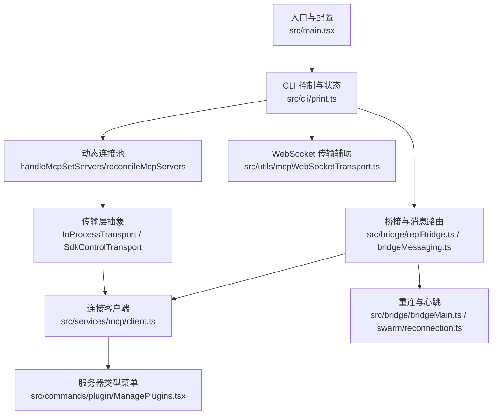
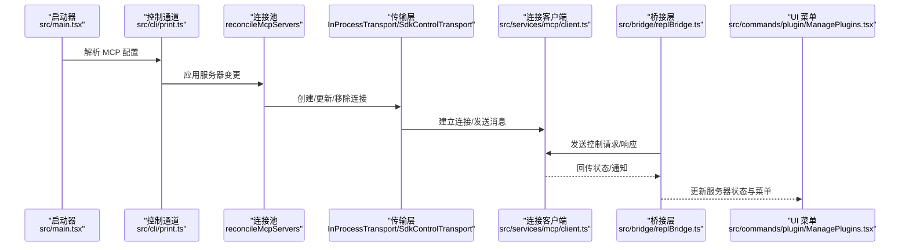
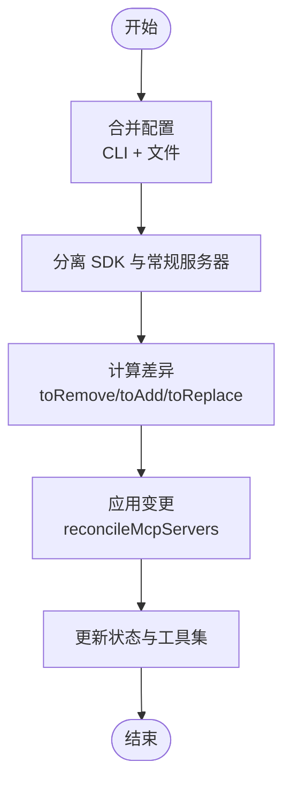
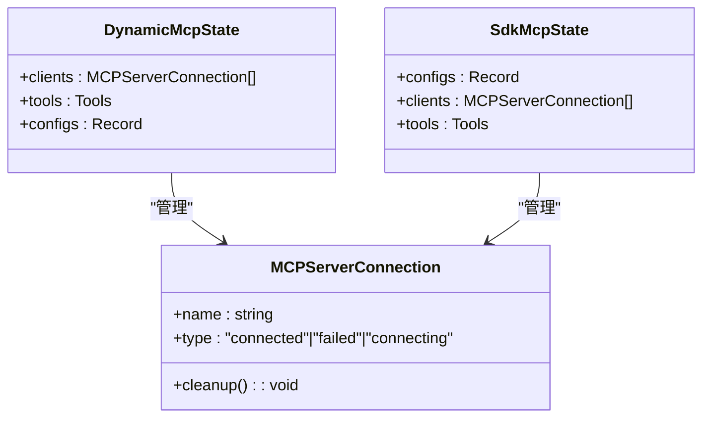
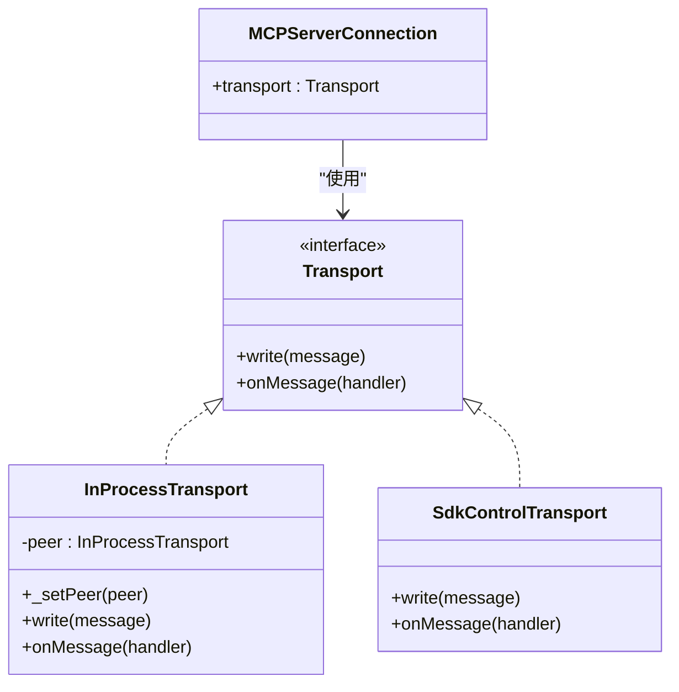
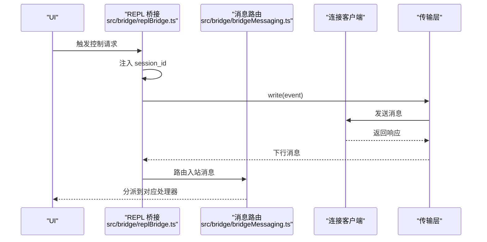
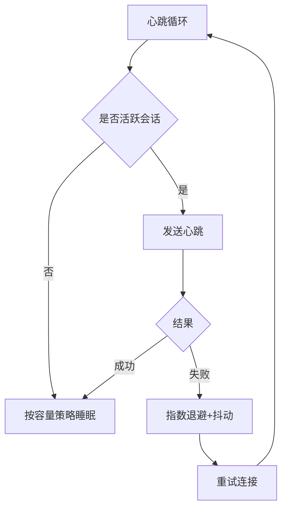
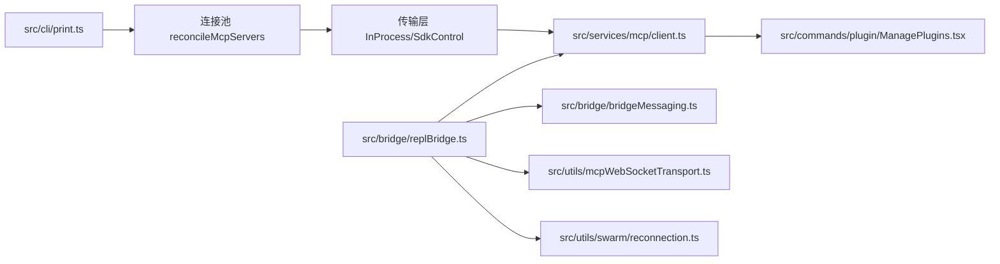

# 连接管理

<cite>
**本文引用的文件**   
- [src/cli/print.ts](file://src/cli/print.ts)
- [src/main.tsx](file://src/main.tsx)
- [src/services/mcp/InProcessTransport.ts](file://src/services/mcp/InProcessTransport.ts)
- [src/services/mcp/SdkControlTransport.ts](file://src/services/mcp/SdkControlTransport.ts)
- [src/services/mcp/client.ts](file://src/services/mcp/client.ts)
- [src/bridge/replBridge.ts](file://src/bridge/replBridge.ts)
- [src/bridge/bridgeMessaging.ts](file://src/bridge/bridgeMessaging.ts)
- [src/bridge/bridgeMain.ts](file://src/bridge/bridgeMain.ts)
- [src/commands/plugin/ManagePlugins.tsx](file://src/commands/plugin/ManagePlugins.tsx)
- [src/utils/mcpWebSocketTransport.ts](file://src/utils/mcpWebSocketTransport.ts)
- [src/utils/swarm/reconnection.ts](file://src/utils/swarm/reconnection.ts)
</cite>

## 目录
1. [引言](#引言)
2. [项目结构](#项目结构)
3. [核心组件](#核心组件)
4. [架构总览](#架构总览)
5. [详细组件分析](#详细组件分析)
6. [依赖关系分析](#依赖关系分析)
7. [性能考量](#性能考量)
8. [故障排查指南](#故障排查指南)
9. [结论](#结论)
10. [附录](#附录)

## 引言
本文件系统性梳理 MCP（Model Context Protocol）连接管理系统，覆盖服务器发现与配置、连接建立与维护、连接池与多路复用、传输层抽象（InProcessTransport 与 SdkControlTransport）、连接状态监控、健康检查与自动重连、性能优化与故障诊断等主题。目标是帮助开发者在理解现有实现的基础上，安全地扩展与优化 MCP 连接能力。

## 项目结构
围绕 MCP 连接管理的关键模块分布如下：
- 配置与启动：从命令行或设置解析 MCP 配置，区分 SDK 与常规进程型服务器。
- 控制通道与状态：通过控制消息协调服务器增删改、认证、通道启用与资源同步。
- 连接生命周期：动态连接池管理、连接状态监控、健康检查与自动重连。
- 传输层抽象：支持进程内直连与 SDK 控制通道两类传输方式。
- UI 与桥接：在 UI 中展示服务器状态、工具与菜单，并通过桥接层发送控制请求。

图表来源
- [src/main.tsx:2386-2408](file://src/main.tsx#L2386-L2408)
- [src/cli/print.ts:5446-5479](file://src/cli/print.ts#L5446-L5479)
- [src/services/mcp/InProcessTransport.ts:10-58](file://src/services/mcp/InProcessTransport.ts#L10-L58)
- [src/services/mcp/SdkControlTransport.ts](file://src/services/mcp/SdkControlTransport.ts)
- [src/services/mcp/client.ts:916-936](file://src/services/mcp/client.ts#L916-L936)
- [src/bridge/replBridge.ts:1778-1822](file://src/bridge/replBridge.ts#L1778-L1822)
- [src/bridge/bridgeMessaging.ts:124-148](file://src/bridge/bridgeMessaging.ts#L124-L148)
- [src/commands/plugin/ManagePlugins.tsx:1972-2002](file://src/commands/plugin/ManagePlugins.tsx#L1972-L2002)
- [src/utils/mcpWebSocketTransport.ts](file://src/utils/mcpWebSocketTransport.ts)
- [src/bridge/bridgeMain.ts:715-745](file://src/bridge/bridgeMain.ts#L715-L745)
- [src/utils/swarm/reconnection.ts](file://src/utils/swarm/reconnection.ts)

章节来源
- [src/main.tsx:2386-2408](file://src/main.tsx#L2386-L2408)
- [src/cli/print.ts:5446-5479](file://src/cli/print.ts#L5446-L5479)

## 核心组件
- 配置与分发
  - 启动阶段合并 CLI 与文件配置，分离 SDK 与常规服务器配置，为后续连接建立提供输入。
- 动态连接池
  - reconcileMcpServers 负责对当前状态与期望状态进行对比，执行新增、删除与替换；handleMcpSetServers 将变更应用到 SDK 与动态两类状态。
- 传输层抽象
  - InProcessTransport 提供进程内直连传输，适合本地或同进程场景。
  - SdkControlTransport 通过 SDK 控制通道与外部环境交互，适配浏览器或 SDK 环境。
- 桥接与控制
  - REPL 桥接负责发送控制请求/响应，消息路由处理入站消息并按类型分派。
- 健康检查与重连
  - 心跳循环与指数退避策略用于维持连接稳定，异常时自动重试并更新 UI 状态。

章节来源
- [src/main.tsx:2386-2408](file://src/main.tsx#L2386-L2408)
- [src/cli/print.ts:5446-5479](file://src/cli/print.ts#L5446-L5479)
- [src/services/mcp/InProcessTransport.ts:10-58](file://src/services/mcp/InProcessTransport.ts#L10-L58)
- [src/services/mcp/SdkControlTransport.ts](file://src/services/mcp/SdkControlTransport.ts)
- [src/services/mcp/client.ts:916-936](file://src/services/mcp/client.ts#L916-L936)
- [src/bridge/replBridge.ts:1778-1822](file://src/bridge/replBridge.ts#L1778-L1822)
- [src/bridge/bridgeMessaging.ts:124-148](file://src/bridge/bridgeMessaging.ts#L124-L148)
- [src/bridge/bridgeMain.ts:715-745](file://src/bridge/bridgeMain.ts#L715-L745)

## 架构总览
下图展示了 MCP 连接管理的整体交互：配置解析后进入控制通道，动态连接池根据状态差异进行增删改，传输层承载消息，桥接层负责控制请求与消息路由，同时配合健康检查与重连策略。

图表来源
- [src/main.tsx:2386-2408](file://src/main.tsx#L2386-L2408)
- [src/cli/print.ts:5446-5479](file://src/cli/print.ts#L5446-L5479)
- [src/services/mcp/InProcessTransport.ts:10-58](file://src/services/mcp/InProcessTransport.ts#L10-L58)
- [src/services/mcp/SdkControlTransport.ts](file://src/services/mcp/SdkControlTransport.ts)
- [src/services/mcp/client.ts:916-936](file://src/services/mcp/client.ts#L916-L936)
- [src/bridge/replBridge.ts:1778-1822](file://src/bridge/replBridge.ts#L1778-L1822)
- [src/commands/plugin/ManagePlugins.tsx:1972-2002](file://src/commands/plugin/ManagePlugins.tsx#L1972-L2002)

## 详细组件分析

### 配置与状态管理
- 配置解析与合并
  - 启动时合并 CLI 与文件配置，区分 SDK 与常规服务器配置，确保后续连接建立的输入正确。
- 服务器变更应用
  - reconcileMcpServers 对比当前与期望配置，计算需要移除、添加与替换的服务器集合，并更新连接池与工具集。
  - handleMcpSetServers 将 SDK 与动态两类状态分别处理，返回响应与新状态，便于上层继续操作。

图表来源
- [src/main.tsx:2386-2408](file://src/main.tsx#L2386-L2408)
- [src/cli/print.ts:5446-5479](file://src/cli/print.ts#L5446-L5479)

章节来源
- [src/main.tsx:2386-2408](file://src/main.tsx#L2386-L2408)
- [src/cli/print.ts:5446-5479](file://src/cli/print.ts#L5446-L5479)

### 连接池管理与多路复用
- 连接池职责
  - 维护当前连接列表、工具集与配置映射；在服务器变更时进行增删改，保证状态一致性。
- 多路复用策略
  - 通过统一的客户端接口与传输层抽象，实现同一进程中多个服务器的并发连接与消息调度。
- 工具与资源同步
  - 在连接状态变化后，注册通知处理器、重新注册通道处理程序，并同步资源视图。

图表来源
- [src/cli/print.ts:5306-5342](file://src/cli/print.ts#L5306-L5342)

章节来源
- [src/cli/print.ts:5306-5342](file://src/cli/print.ts#L5306-L5342)

### 传输层抽象：InProcessTransport 与 SdkControlTransport
- InProcessTransport
  - 提供进程内直连传输，适合本地或同进程场景；通过成对实例建立双向通道，简化通信。
- SdkControlTransport
  - 通过 SDK 控制通道与外部环境交互，适配浏览器或 SDK 环境；与客户端集成以发送/接收控制消息。
- 客户端集成
  - 客户端在运行时动态加载传输模块，选择合适的传输实现以满足不同部署形态。

图表来源
- [src/services/mcp/InProcessTransport.ts:10-58](file://src/services/mcp/InProcessTransport.ts#L10-L58)
- [src/services/mcp/SdkControlTransport.ts](file://src/services/mcp/SdkControlTransport.ts)
- [src/services/mcp/client.ts:916-936](file://src/services/mcp/client.ts#L916-L936)

章节来源
- [src/services/mcp/InProcessTransport.ts:10-58](file://src/services/mcp/InProcessTransport.ts#L10-L58)
- [src/services/mcp/SdkControlTransport.ts](file://src/services/mcp/SdkControlTransport.ts)
- [src/services/mcp/client.ts:916-936](file://src/services/mcp/client.ts#L916-L936)

### 桥接与控制通道
- 请求与响应
  - 桥接层封装控制请求/响应发送逻辑，统一注入会话 ID 并记录调试日志。
- 入站消息路由
  - 入站消息解析后按类型分派，区分控制响应与其他 SDK 消息，避免重复处理与回环。
- 通道启用与认证
  - 支持通道启用、认证流程与服务器切换，确保连接状态一致与安全。

图表来源
- [src/bridge/replBridge.ts:1778-1822](file://src/bridge/replBridge.ts#L1778-L1822)
- [src/bridge/bridgeMessaging.ts:124-148](file://src/bridge/bridgeMessaging.ts#L124-L148)

章节来源
- [src/bridge/replBridge.ts:1778-1822](file://src/bridge/replBridge.ts#L1778-L1822)
- [src/bridge/bridgeMessaging.ts:124-148](file://src/bridge/bridgeMessaging.ts#L124-L148)

### 连接状态监控、健康检查与自动重连
- 心跳与退避
  - 心跳循环在活跃会话中定期发送心跳，异常时采用指数退避策略并带抖动，避免雪崩效应。
- 重连策略
  - 在连接错误或容量限制下，等待退避时间后重试；必要时进行心跳保活，确保租约不丢失。
- UI 状态反馈
  - 重连过程中的延迟与持续时间实时更新 UI，提升可观测性。

图表来源
- [src/bridge/bridgeMain.ts:715-745](file://src/bridge/bridgeMain.ts#L715-L745)
- [src/bridge/bridgeMain.ts:1314-1338](file://src/bridge/bridgeMain.ts#L1314-L1338)
- [src/utils/swarm/reconnection.ts](file://src/utils/swarm/reconnection.ts)

章节来源
- [src/bridge/bridgeMain.ts:715-745](file://src/bridge/bridgeMain.ts#L715-L745)
- [src/bridge/bridgeMain.ts:1314-1338](file://src/bridge/bridgeMain.ts#L1314-L1338)
- [src/utils/swarm/reconnection.ts](file://src/utils/swarm/reconnection.ts)

### 服务器类型与 UI 展示
- 类型识别
  - UI 根据服务器配置类型（如 stdio、sse、http）渲染不同的菜单项与信息。
- 菜单与工具
  - 不同类型的服务器在 UI 中展示对应的工具数量与操作入口，便于用户管理。

章节来源
- [src/commands/plugin/ManagePlugins.tsx:1972-2002](file://src/commands/plugin/ManagePlugins.tsx#L1972-L2002)

## 依赖关系分析
- 组件耦合
  - CLI 控制通道与连接池紧密耦合，负责状态变更的入口；传输层与客户端解耦，便于替换实现。
  - 桥接层与消息路由独立于具体传输，降低跨环境差异带来的影响。
- 外部依赖
  - WebSocket 传输辅助用于远程场景的消息通道；重连与心跳策略作为通用能力被桥接层复用。

图表来源
- [src/cli/print.ts:5446-5479](file://src/cli/print.ts#L5446-L5479)
- [src/services/mcp/InProcessTransport.ts:10-58](file://src/services/mcp/InProcessTransport.ts#L10-L58)
- [src/services/mcp/SdkControlTransport.ts](file://src/services/mcp/SdkControlTransport.ts)
- [src/services/mcp/client.ts:916-936](file://src/services/mcp/client.ts#L916-L936)
- [src/bridge/replBridge.ts:1778-1822](file://src/bridge/replBridge.ts#L1778-L1822)
- [src/bridge/bridgeMessaging.ts:124-148](file://src/bridge/bridgeMessaging.ts#L124-L148)
- [src/commands/plugin/ManagePlugins.tsx:1972-2002](file://src/commands/plugin/ManagePlugins.tsx#L1972-L2002)
- [src/utils/mcpWebSocketTransport.ts](file://src/utils/mcpWebSocketTransport.ts)
- [src/utils/swarm/reconnection.ts](file://src/utils/swarm/reconnection.ts)

章节来源
- [src/cli/print.ts:5446-5479](file://src/cli/print.ts#L5446-L5479)
- [src/services/mcp/InProcessTransport.ts:10-58](file://src/services/mcp/InProcessTransport.ts#L10-L58)
- [src/services/mcp/SdkControlTransport.ts](file://src/services/mcp/SdkControlTransport.ts)
- [src/services/mcp/client.ts:916-936](file://src/services/mcp/client.ts#L916-L936)
- [src/bridge/replBridge.ts:1778-1822](file://src/bridge/replBridge.ts#L1778-L1822)
- [src/bridge/bridgeMessaging.ts:124-148](file://src/bridge/bridgeMessaging.ts#L124-L148)
- [src/commands/plugin/ManagePlugins.tsx:1972-2002](file://src/commands/plugin/ManagePlugins.tsx#L1972-L2002)
- [src/utils/mcpWebSocketTransport.ts](file://src/utils/mcpWebSocketTransport.ts)
- [src/utils/swarm/reconnection.ts](file://src/utils/swarm/reconnection.ts)

## 性能考量
- 连接池规模与并发
  - 合理设置最大并发连接数，避免过多连接导致上下文切换与资源争用。
- 传输层选择
  - 进程内直连适合低延迟场景；SDK 控制通道适合跨环境场景，需关注序列化与往返开销。
- 心跳与退避
  - 心跳间隔应平衡存活检测灵敏度与网络负载；退避上限与抖动参数需结合业务峰值调整。
- 缓存与去重
  - 利用最近 UUID 集合避免重复处理与回环，减少无效工作量。

## 故障排查指南
- 常见问题定位
  - 连接失败：查看控制响应错误信息与客户端状态类型，确认认证与权限配置。
  - 通道未启用：核对通道启用请求与服务器配置，确保会话 ID 与请求匹配。
  - 重连频繁：检查心跳间隔与退避参数，观察网络波动与服务端可用性。
- 日志与可观测性
  - 关注桥接层与控制通道的日志输出，定位消息发送/接收异常。
  - 使用 UI 展示的重连状态与耗时，辅助判断问题根因。
- 修复建议
  - 调整退避参数与心跳周期，避免过密轮询。
  - 对认证失败场景增加重试与降级策略，防止无限重试。
  - 在插件安装或配置变更后，触发 MCP 配置重算，确保 SDK 与动态服务器状态一致。

章节来源
- [src/cli/print.ts:3197-3205](file://src/cli/print.ts#L3197-L3205)
- [src/cli/print.ts:3297-3310](file://src/cli/print.ts#L3297-L3310)
- [src/bridge/bridgeMain.ts:1314-1338](file://src/bridge/bridgeMain.ts#L1314-L1338)
- [src/bridge/bridgeMessaging.ts:124-148](file://src/bridge/bridgeMessaging.ts#L124-L148)

## 结论
该 MCP 连接管理系统通过清晰的配置解析、严格的连接池管理、可插拔的传输层与稳健的桥接控制通道，实现了对多类服务器的统一接入与运维。结合健康检查与自动重连机制，系统在复杂环境中仍能保持高可用与可观测性。建议在生产环境中进一步完善指标采集与告警策略，持续优化传输层与心跳参数，以获得更佳的稳定性与性能表现。

## 附录
- 术语
  - SDK：软件开发工具包，此处指代 SDK 控制通道与相关客户端。
  - 传输层：承载 MCP 消息的底层通信抽象，包括进程内直连与 SDK 控制通道。
  - 连接池：集中管理 MCP 服务器连接的状态与生命周期。
- 参考路径
  - 配置解析与合并：[src/main.tsx:2386-2408](file://src/main.tsx#L2386-L2408)
  - 服务器变更应用：[src/cli/print.ts:5446-5479](file://src/cli/print.ts#L5446-L5479)
  - 连接池数据结构：[src/cli/print.ts:5306-5342](file://src/cli/print.ts#L5306-L5342)
  - 传输层实现：[src/services/mcp/InProcessTransport.ts:10-58](file://src/services/mcp/InProcessTransport.ts#L10-L58)，[src/services/mcp/SdkControlTransport.ts](file://src/services/mcp/SdkControlTransport.ts)
  - 客户端集成：[src/services/mcp/client.ts:916-936](file://src/services/mcp/client.ts#L916-L936)
  - 桥接与消息路由：[src/bridge/replBridge.ts:1778-1822](file://src/bridge/replBridge.ts#L1778-L1822)，[src/bridge/bridgeMessaging.ts:124-148](file://src/bridge/bridgeMessaging.ts#L124-L148)
  - 重连与心跳：[src/bridge/bridgeMain.ts:715-745](file://src/bridge/bridgeMain.ts#L715-L745)，[src/bridge/bridgeMain.ts:1314-1338](file://src/bridge/bridgeMain.ts#L1314-L1338)，[src/utils/swarm/reconnection.ts](file://src/utils/swarm/reconnection.ts)
  - UI 展示：[src/commands/plugin/ManagePlugins.tsx:1972-2002](file://src/commands/plugin/ManagePlugins.tsx#L1972-L2002)