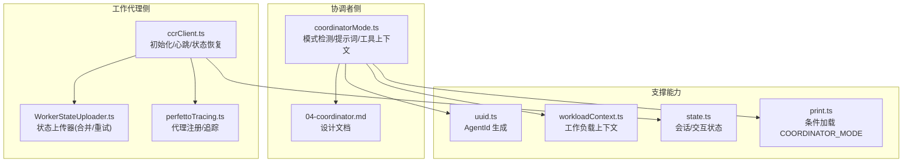
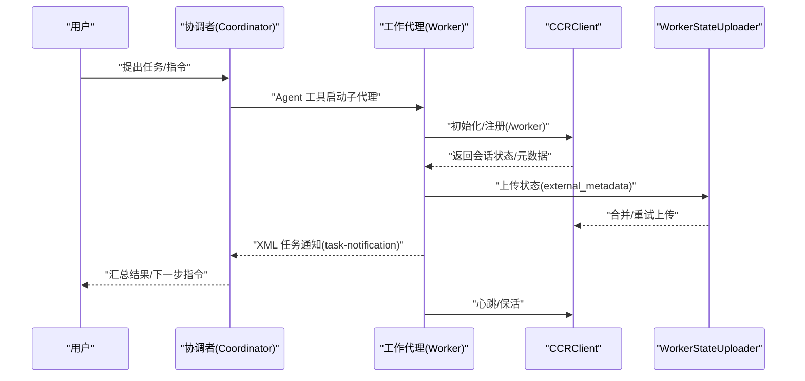
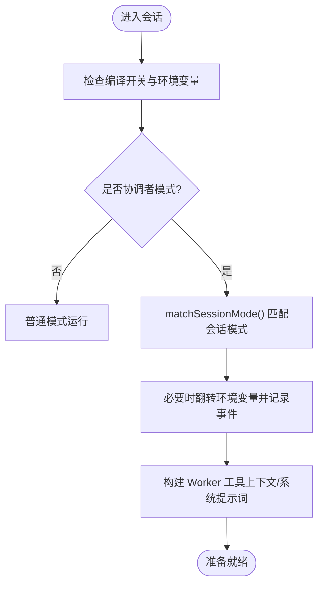
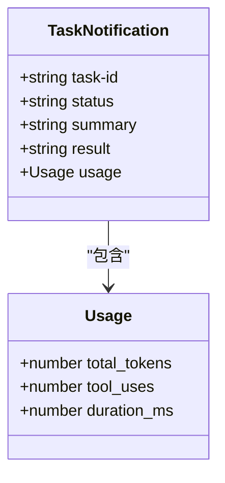
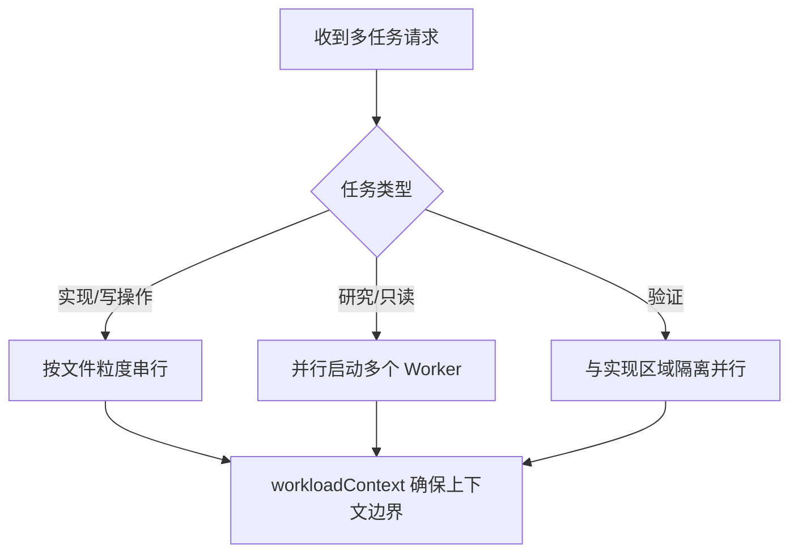
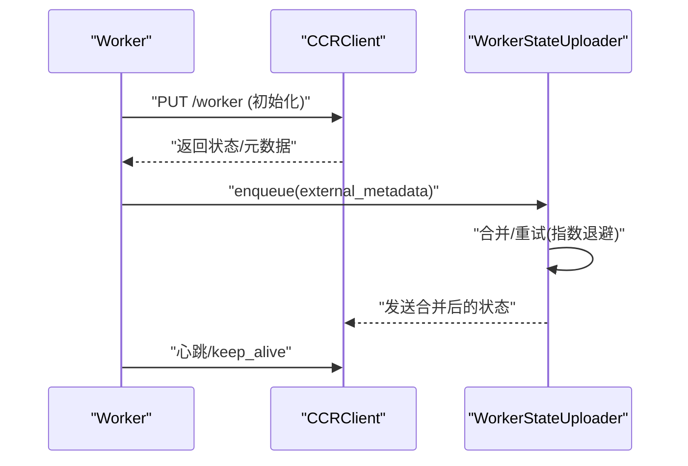
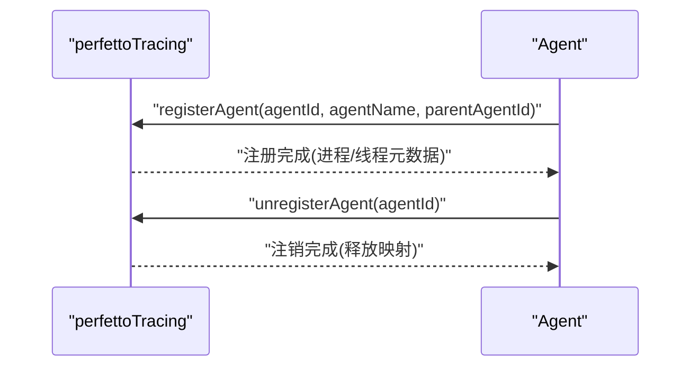
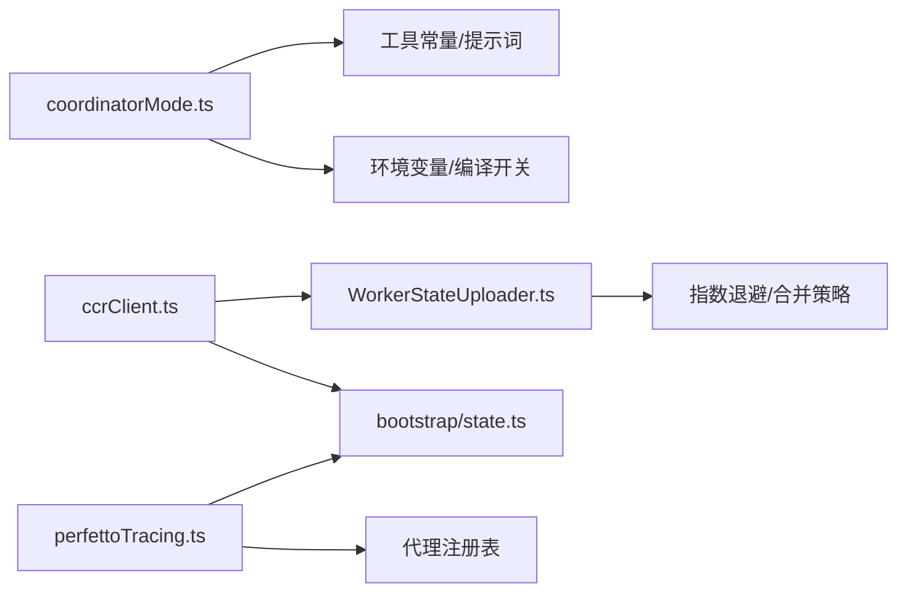

# 协调者代理

<cite>
**本文引用的文件**
- [coordinatorMode.ts](file://src/coordinator/coordinatorMode.ts)
- [workerAgent.ts](file://src/coordinator/workerAgent.ts)
- [04-coordinator.md](file://docs/04-coordinator.md)
- [ccrClient.ts](file://src/cli/transports/ccrClient.ts)
- [WorkerStateUploader.ts](file://src/cli/transports/WorkerStateUploader.ts)
- [perfettoTracing.ts](file://src/utils/teleport/perfettoTracing.ts)
- [state.ts](file://src/bootstrap/state.ts)
- [uuid.ts](file://src/utils/uuid.ts)
- [workloadContext.ts](file://src/utils/workloadContext.ts)
- [print.ts](file://src/cli/print.ts)
</cite>

## 目录
1. [简介](#简介)
2. [项目结构](#项目结构)
3. [核心组件](#核心组件)
4. [架构总览](#架构总览)
5. [详细组件分析](#详细组件分析)
6. [依赖关系分析](#依赖关系分析)
7. [性能考量](#性能考量)
8. [故障排除指南](#故障排除指南)
9. [结论](#结论)
10. [附录](#附录)

## 简介
本文件系统性阐述“协调者代理”体系的设计原理与实现机制，覆盖以下关键主题：
- 协调者模式的启用与会话模式匹配逻辑
- 工作代理（Worker）的管理与通信协议
- 分布式任务调度与并发控制策略
- 工作负载分配与代理状态同步机制
- 故障转移与任务优先级调度思路
- 配置项、监控指标与故障排除建议

该体系以“协调者（Coordinator）+ 多个工作代理（Worker）”为核心，协调者负责任务拆解、资源编排与结果汇总；Worker 负责具体代码操作与验证，二者通过标准化的 XML 通知通道进行异步协作。

## 项目结构
与协调者代理相关的关键模块分布如下：
- 协调者模式与提示词：src/coordinator/coordinatorMode.ts
- Worker 类型常量：src/coordinator/workerAgent.ts
- 文档说明：docs/04-coordinator.md
- 工作代理生命周期与状态上报：src/cli/transports/ccrClient.ts、src/cli/transports/WorkerStateUploader.ts
- 性能追踪与代理注册：src/utils/teleport/perfettoTracing.ts
- 会话与交互状态：src/bootstrap/state.ts
- 标识符生成：src/utils/uuid.ts
- 工作负载上下文：src/utils/workloadContext.ts
- CLI 条件加载：src/cli/print.ts

图示来源
- [coordinatorMode.ts:1-370](file://src/coordinator/coordinatorMode.ts#L1-L370)
- [04-coordinator.md:1-135](file://docs/04-coordinator.md#L1-L135)
- [ccrClient.ts:387-526](file://src/cli/transports/ccrClient.ts#L387-L526)
- [WorkerStateUploader.ts:1-131](file://src/cli/transports/WorkerStateUploader.ts#L1-L131)
- [perfettoTracing.ts:114-463](file://src/utils/teleport/perfettoTracing.ts#L114-L463)
- [uuid.ts:1-27](file://src/utils/uuid.ts#L1-L27)
- [workloadContext.ts:1-57](file://src/utils/workloadContext.ts#L1-L57)
- [state.ts:1043-1099](file://src/bootstrap/state.ts#L1043-L1099)
- [print.ts:356-380](file://src/cli/print.ts#L356-L380)

章节来源
- [coordinatorMode.ts:1-370](file://src/coordinator/coordinatorMode.ts#L1-L370)
- [04-coordinator.md:1-135](file://docs/04-coordinator.md#L1-L135)

## 核心组件
- 协调者模式开关与会话匹配
  - 通过编译开关与运行时环境变量共同决定是否启用协调者模式，并在会话恢复时自动匹配历史模式。
- Worker 工具集与系统提示词
  - 动态生成 Worker 可用工具列表，按“简化模式”与“标准模式”区分；提供标准任务流程（研究/合成/实现/验证）与并发规则。
- Worker 生命周期与状态同步
  - 初始化、心跳、状态恢复与元数据上传；采用指数退避与合并策略保证高可用与一致性。
- 代理状态与追踪
  - 注册/注销代理，记录进程/线程信息，支持 Perfetto 追踪；结合会话状态与交互状态保障可观测性。

章节来源
- [coordinatorMode.ts:36-109](file://src/coordinator/coordinatorMode.ts#L36-L109)
- [coordinatorMode.ts:111-370](file://src/coordinator/coordinatorMode.ts#L111-L370)
- [workerAgent.ts:1-2](file://src/coordinator/workerAgent.ts#L1-L2)
- [ccrClient.ts:473-526](file://src/cli/transports/ccrClient.ts#L473-L526)
- [WorkerStateUploader.ts:1-131](file://src/cli/transports/WorkerStateUploader.ts#L1-L131)
- [perfettoTracing.ts:114-463](file://src/utils/teleport/perfettoTracing.ts#L114-L463)
- [state.ts:1043-1099](file://src/bootstrap/state.ts#L1043-L1099)

## 架构总览
协调者代理系统采用“协调者-工作代理”的分层架构：
- 协调者负责任务规划、工具授权与结果整合
- 工作代理独立执行具体任务，通过统一的事件/状态通道与协调者交互
- 系统通过状态上传器与心跳维持长连接，确保在故障场景下的可恢复性

图示来源
- [coordinatorMode.ts:111-370](file://src/coordinator/coordinatorMode.ts#L111-L370)
- [ccrClient.ts:387-526](file://src/cli/transports/ccrClient.ts#L387-L526)
- [WorkerStateUploader.ts:1-131](file://src/cli/transports/WorkerStateUploader.ts#L1-L131)

## 详细组件分析

### 协调者模式与会话匹配
- 模式启用条件
  - 编译期 feature('COORDINATOR_MODE') 与运行时 CLAUDE_CODE_COORDINATOR_MODE 环境变量共同决定
- 会话模式匹配
  - 当进程模式与会话历史不一致时，自动翻转环境变量以匹配会话原始模式，并记录分析事件
- 工具上下文与系统提示词
  - 根据“简化模式”动态生成 Worker 工具清单；提供标准任务流程、并发规则与禁止甩锅式委派等指导原则

图示来源
- [coordinatorMode.ts:36-78](file://src/coordinator/coordinatorMode.ts#L36-L78)
- [coordinatorMode.ts:80-109](file://src/coordinator/coordinatorMode.ts#L80-L109)

章节来源
- [coordinatorMode.ts:36-109](file://src/coordinator/coordinatorMode.ts#L36-L109)
- [04-coordinator.md:29-44](file://docs/04-coordinator.md#L29-L44)

### Worker 通信协议与任务通知
- 通知格式
  - 以 XML 结构的 task-notification 注入到对话流，包含 task-id、status、summary、result、usage 等字段
- 使用约定
  - 协调者仅使用 Agent、SendMessage、TaskStop 三类工具；Worker 不直接参与对话，结果以通知形式呈现

图示来源
- [coordinatorMode.ts:142-165](file://src/coordinator/coordinatorMode.ts#L142-L165)

章节来源
- [coordinatorMode.ts:142-165](file://src/coordinator/coordinatorMode.ts#L142-L165)
- [04-coordinator.md:58-71](file://docs/04-coordinator.md#L58-L71)

### 并发与工作负载分配
- 并发规则
  - 只读任务（研究）自由并行；写操作任务（实现）对同一组文件串行；验证可在不同文件区域与实现并行
- 工作负载上下文
  - 通过 AsyncLocalStorage 为每个调用边界建立工作负载标签，避免上下文泄漏导致的误判

图示来源
- [coordinatorMode.ts:211-219](file://src/coordinator/coordinatorMode.ts#L211-L219)
- [workloadContext.ts:1-57](file://src/utils/workloadContext.ts#L1-L57)

章节来源
- [coordinatorMode.ts:211-219](file://src/coordinator/coordinatorMode.ts#L211-L219)
- [workloadContext.ts:1-57](file://src/utils/workloadContext.ts#L1-L57)

### Worker 生命周期与状态同步
- 初始化与状态恢复
  - 注册时清空过期 pending_action/task_summary；并发获取会话状态并在成功后记录诊断日志
- 心跳与保活
  - 通过会话活动回调发送 keep_alive 事件，防止租约过期
- 状态上传器
  - 支持合并最近两次上传、指数退避重试、RFC 7396 合并策略，确保高可靠与低抖动

图示来源
- [ccrClient.ts:473-526](file://src/cli/transports/ccrClient.ts#L473-L526)
- [WorkerStateUploader.ts:1-131](file://src/cli/transports/WorkerStateUploader.ts#L1-L131)

章节来源
- [ccrClient.ts:387-526](file://src/cli/transports/ccrClient.ts#L387-L526)
- [WorkerStateUploader.ts:1-131](file://src/cli/transports/WorkerStateUploader.ts#L1-L131)

### 代理状态与追踪
- 代理注册与注销
  - 为每个 Agent 分配唯一进程 ID 与线程 ID，注册时输出进程/线程元数据，注销时释放内存
- Perfetto 追踪
  - 提供 API 记录 LLM 请求跨度、父代理关系等，便于端到端性能分析

图示来源
- [perfettoTracing.ts:114-463](file://src/utils/teleport/perfettoTracing.ts#L114-L463)

章节来源
- [perfettoTracing.ts:114-463](file://src/utils/teleport/perfettoTracing.ts#L114-L463)

### 标识符与会话状态
- AgentId 生成
  - 使用随机字节生成带前缀的唯一标识符，确保与任务 ID 保持一致格式
- 会话/交互状态
  - 提供交互性、客户端类型、严格工具结果配对等全局状态访问接口

章节来源
- [uuid.ts:19-27](file://src/utils/uuid.ts#L19-L27)
- [state.ts:1043-1099](file://src/bootstrap/state.ts#L1043-L1099)

### 条件加载与编译开关
- CLI 条件加载
  - 在打印模块中根据编译开关按需引入协调者模块，避免非目标平台的依赖循环

章节来源
- [print.ts:356-380](file://src/cli/print.ts#L356-L380)

## 依赖关系分析
- 协调者模式依赖
  - 工具集合来自常量与外部配置；系统提示词内联在模块中；会话模式匹配依赖运行时环境变量
- Worker 生命周期依赖
  - CCRClient 依赖状态上传器与会话活动回调；状态上传器依赖指数退避与合并策略
- 追踪与可观测性
  - Perfetto 追踪依赖代理注册表与进程/线程映射；与会话状态协同提供端到端视图

图示来源
- [coordinatorMode.ts:1-370](file://src/coordinator/coordinatorMode.ts#L1-L370)
- [ccrClient.ts:387-526](file://src/cli/transports/ccrClient.ts#L387-L526)
- [WorkerStateUploader.ts:1-131](file://src/cli/transports/WorkerStateUploader.ts#L1-L131)
- [perfettoTracing.ts:114-463](file://src/utils/teleport/perfettoTracing.ts#L114-L463)
- [state.ts:1043-1099](file://src/bootstrap/state.ts#L1043-L1099)

章节来源
- [coordinatorMode.ts:1-370](file://src/coordinator/coordinatorMode.ts#L1-L370)
- [ccrClient.ts:387-526](file://src/cli/transports/ccrClient.ts#L387-L526)
- [WorkerStateUploader.ts:1-131](file://src/cli/transports/WorkerStateUploader.ts#L1-L131)
- [perfettoTracing.ts:114-463](file://src/utils/teleport/perfettoTracing.ts#L114-L463)
- [state.ts:1043-1099](file://src/bootstrap/state.ts#L1043-L1099)

## 性能考量
- 并发与串行化
  - 对写操作按文件区域串行，减少冲突与回滚成本；验证与实现并行提升吞吐
- 状态上传优化
  - 合并最近两次上传，降低网络开销；指数退避与抖动避免风暴
- 追踪与诊断
  - 通过 Perfetto 记录关键跨度，结合会话状态定位瓶颈
- 标识符与上下文
  - 唯一 AgentId 与 ALS 上下文确保跨异步链路的一致性与可追踪性

## 故障排除指南
- 模式不匹配
  - 症状：恢复会话后行为异常
  - 处理：确认 CLAUDE_CODE_COORDINATOR_MODE 是否与会话历史一致；必要时允许系统自动翻转并观察分析事件
- Worker 注册失败
  - 症状：初始化 PUT 返回 409 或失败
  - 处理：检查 epoch 冲突与认证头；查看诊断日志中的初始化失败与状态恢复时间
- 状态未更新
  - 症状：协调者未收到 Worker 最新状态
  - 处理：确认状态上传器队列与重试；检查合并策略是否正确应用
- 心跳中断
  - 症状：租约过期或长时间无响应
  - 处理：确保会话活动回调触发 keep_alive；检查网络稳定性
- 追踪缺失
  - 症状：无法看到代理注册/注销或父代理关系
  - 处理：确认 Perfetto 开关与代理注册调用；核对进程/线程映射

章节来源
- [coordinatorMode.ts:49-78](file://src/coordinator/coordinatorMode.ts#L49-L78)
- [ccrClient.ts:473-526](file://src/cli/transports/ccrClient.ts#L473-L526)
- [WorkerStateUploader.ts:69-95](file://src/cli/transports/WorkerStateUploader.ts#L69-L95)
- [perfettoTracing.ts:384-420](file://src/utils/teleport/perfettoTracing.ts#L384-L420)

## 结论
协调者代理系统通过明确的角色分工、严格的通信协议与稳健的状态同步机制，实现了高并发、可恢复且可观测的分布式任务编排。其核心在于：
- 协调者专注于任务规划与结果整合，Worker 专注执行与验证
- 通过 XML 通知与状态上传器实现可靠的异步协作
- 借助工作负载上下文与追踪能力保障性能与可维护性

## 附录

### 配置选项
- 编译开关
  - COORDINATOR_MODE：启用协调者模式的编译期开关
- 运行时环境变量
  - CLAUDE_CODE_COORDINATOR_MODE：控制是否启用协调者模式
  - CLAUDE_CODE_SIMPLE：简化模式，限制 Worker 工具集
- 特征门控
  - tengu_scratch：启用跨 Worker 共享知识的 scratchpad 目录

章节来源
- [coordinatorMode.ts:36-41](file://src/coordinator/coordinatorMode.ts#L36-L41)
- [coordinatorMode.ts:88-106](file://src/coordinator/coordinatorMode.ts#L88-L106)
- [04-coordinator.md:111-118](file://docs/04-coordinator.md#L111-L118)

### 监控指标与可观测性
- 事件与日志
  - 协调者模式切换事件、Worker 初始化/状态恢复诊断事件
- 追踪
  - Perfetto 进程/线程元数据、API 调用跨度、父代理关系
- 会话状态
  - 交互性、客户端类型、严格工具结果配对等全局状态

章节来源
- [coordinatorMode.ts:71-77](file://src/coordinator/coordinatorMode.ts#L71-L77)
- [ccrClient.ts:509-525](file://src/cli/transports/ccrClient.ts#L509-L525)
- [perfettoTracing.ts:340-420](file://src/utils/teleport/perfettoTracing.ts#L340-L420)
- [state.ts:1057-1099](file://src/bootstrap/state.ts#L1057-L1099)