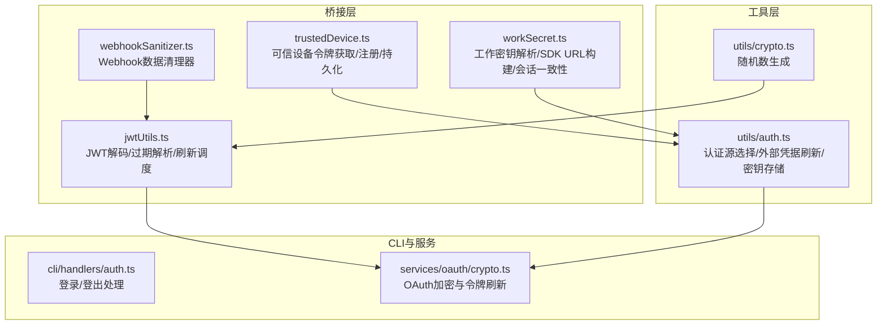
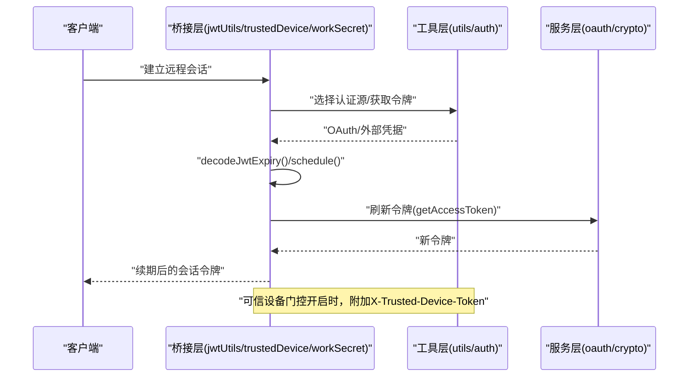
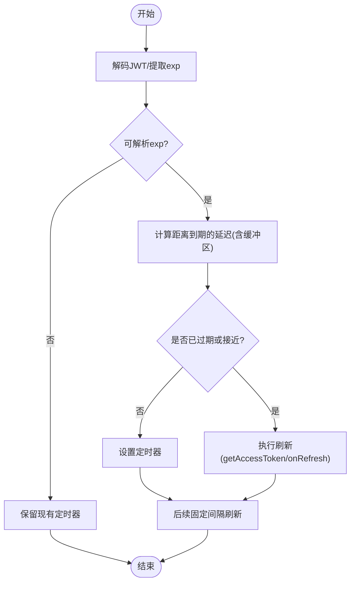
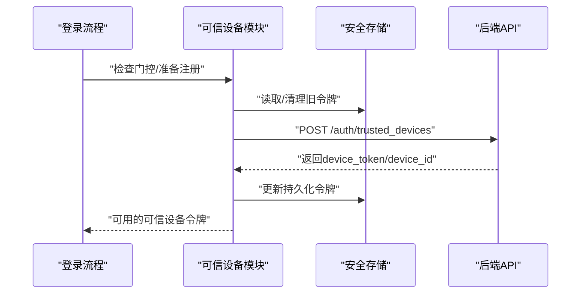
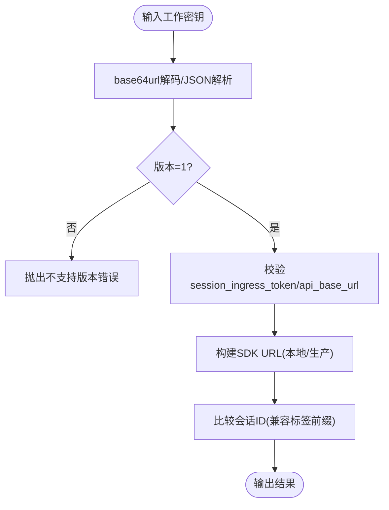
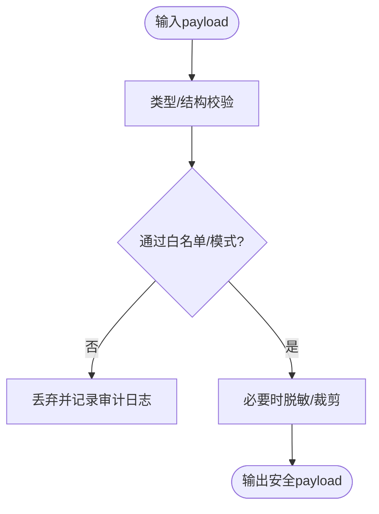
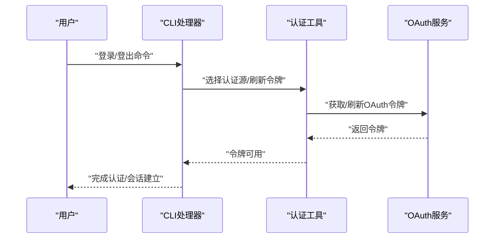
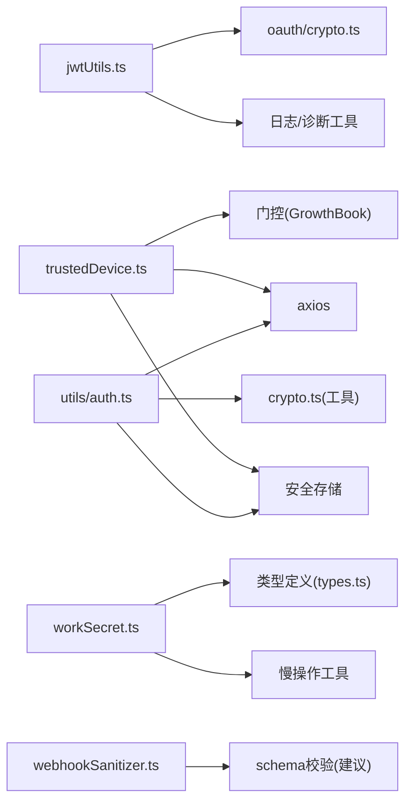

# 安全与认证

<cite>
**本文引用的文件**
- [jwtUtils.ts](file://src/bridge/jwtUtils.ts)
- [trustedDevice.ts](file://src/bridge/trustedDevice.ts)
- [workSecret.ts](file://src/bridge/workSecret.ts)
- [webhookSanitizer.ts](file://src/bridge/webhookSanitizer.ts)
- [auth.ts（工具）](file://src/utils/auth.ts)
- [crypto.ts](file://src/utils/crypto.ts)
- [auth.ts（CLI处理器）](file://src/cli/handlers/auth.ts)
- [crypto.ts（服务端OAuth）](file://src/services/oauth/crypto.ts)
</cite>

## 目录
1. [简介](#简介)
2. [项目结构](#项目结构)
3. [核心组件](#核心组件)
4. [架构总览](#架构总览)
5. [详细组件分析](#详细组件分析)
6. [依赖关系分析](#依赖关系分析)
7. [性能考量](#性能考量)
8. [故障排查指南](#故障排查指南)
9. [结论](#结论)
10. [附录：安全配置与应急响应](#附录安全配置与应急响应)

## 简介
本文件面向远程协作场景下的“安全与认证”主题，系统化梳理并解释以下关键能力：
- JWT 工具：解码、过期时间解析与令牌刷新调度机制
- 可信设备管理：设备令牌的获取、缓存、注册与持久化
- 工作密钥（Work Secret）安全存储与解析：版本校验、URL 构建与会话一致性判定
- Webhook 清理器：当前实现为透传，建议扩展为强类型白名单/黑名单过滤
- 远程会话身份验证与权限控制：基于 OAuth 的令牌来源选择、令牌刷新与会话一致性
- 加密通信与审计：传输层安全（wss/ws）、事件日志与诊断日志
- 安全配置指南、漏洞防护与应急响应流程

## 项目结构
围绕安全与认证的关键模块分布于以下路径：
- 桥接层（Bridge）：JWT 工具、可信设备、工作密钥、Webhook 清理器
- 工具层（Utils）：认证源选择、外部凭据（AWS/GCP）刷新与缓存、随机数生成
- CLI 处理器：登录/登出等入口的认证处理
- 服务层：OAuth 加密与令牌刷新

**图表来源**
- [jwtUtils.ts:1-257](file://src/bridge/jwtUtils.ts#L1-L257)
- [trustedDevice.ts:1-211](file://src/bridge/trustedDevice.ts#L1-L211)
- [workSecret.ts:1-128](file://src/bridge/workSecret.ts#L1-L128)
- [webhookSanitizer.ts:1-4](file://src/bridge/webhookSanitizer.ts#L1-L4)
- [auth.ts（工具）:1-2003](file://src/utils/auth.ts#L1-L2003)
- [crypto.ts:1-14](file://src/utils/crypto.ts#L1-L14)
- [auth.ts（CLI处理器）](file://src/cli/handlers/auth.ts)
- [crypto.ts（服务端OAuth）](file://src/services/oauth/crypto.ts)

**章节来源**
- [jwtUtils.ts:1-257](file://src/bridge/jwtUtils.ts#L1-L257)
- [trustedDevice.ts:1-211](file://src/bridge/trustedDevice.ts#L1-L211)
- [workSecret.ts:1-128](file://src/bridge/workSecret.ts#L1-L128)
- [webhookSanitizer.ts:1-4](file://src/bridge/webhookSanitizer.ts#L1-L4)
- [auth.ts（工具）:1-2003](file://src/utils/auth.ts#L1-L2003)
- [crypto.ts:1-14](file://src/utils/crypto.ts#L1-L14)
- [auth.ts（CLI处理器）](file://src/cli/handlers/auth.ts)
- [crypto.ts（服务端OAuth）](file://src/services/oauth/crypto.ts)

## 核心组件
- JWT 工具：提供无签名验证的负载解码、过期时间提取与令牌刷新调度器；支持基于到期前缓冲区的主动刷新与失败重试上限
- 可信设备：在门控开启时从安全存储读取设备令牌，支持环境变量覆盖；登录后进行设备注册并持久化，同时对旧令牌进行清理
- 工作密钥：对 base64url 编码的工作密钥进行版本校验与字段完整性检查；根据 API 基础地址构建 SDK URL，并提供会话 ID 兼容性比较
- Webhook 清理器：当前为恒等返回，建议扩展为白名单/黑名单过滤以抵御恶意载荷
- 认证源与凭据：统一识别 OAuth/外部 API Key/文件描述符等来源；提供 AWS/GCP 凭据刷新与缓存；支持安全存储与键链交互

**章节来源**
- [jwtUtils.ts:1-257](file://src/bridge/jwtUtils.ts#L1-L257)
- [trustedDevice.ts:1-211](file://src/bridge/trustedDevice.ts#L1-L211)
- [workSecret.ts:1-128](file://src/bridge/workSecret.ts#L1-L128)
- [webhookSanitizer.ts:1-4](file://src/bridge/webhookSanitizer.ts#L1-L4)
- [auth.ts（工具）:1-2003](file://src/utils/auth.ts#L1-L2003)

## 架构总览
远程协作的认证与安全由多层协同完成：
- 令牌来源与选择：优先使用受管 OAuth，结合文件描述符、外部 API Key 等策略
- 令牌生命周期：通过刷新调度器在到期前主动刷新，避免长连接中断
- 设备信任：在门控开启时附加可信设备令牌头，提升 Elevated 安全层级
- 会话一致性：通过工作密钥与 SDK URL 构建确保桥接端与后端一致的会话上下文
- 数据安全：Webhook 清理器应实施严格过滤；传输采用 wss/ws；日志与事件用于审计

**图表来源**
- [jwtUtils.ts:72-256](file://src/bridge/jwtUtils.ts#L72-L256)
- [trustedDevice.ts:35-210](file://src/bridge/trustedDevice.ts#L35-L210)
- [auth.ts（工具）:153-206](file://src/utils/auth.ts#L153-L206)
- [crypto.ts（服务端OAuth）](file://src/services/oauth/crypto.ts)

## 详细组件分析

### JWT 工具与令牌刷新调度
- 解码与过期解析：支持剥离前缀的 JWT 字符串，Base64URL 负载解析，返回过期时间（Unix 秒）
- 刷新调度器：
  - 基于到期前缓冲区触发刷新，避免临界窗口内失效
  - 支持从 expires_in 直接调度，防止不透明 JWT 场景
  - 失败重试与上限控制，避免无限重试
  - 代际计数防止竞态：取消或重新调度时提升代次，丢弃过期回调
  - 事件与诊断日志：记录刷新状态与错误，便于排障

**图表来源**
- [jwtUtils.ts:102-230](file://src/bridge/jwtUtils.ts#L102-L230)

**章节来源**
- [jwtUtils.ts:1-257](file://src/bridge/jwtUtils.ts#L1-L257)

### 可信设备管理机制
- 门控策略：通过 GrowthBook 特性门控决定是否发送可信设备令牌
- 缓存与持久化：memoized 读取安全存储中的设备令牌；登录前后清理缓存与旧令牌
- 注册流程：在登录后立即向后端发起注册请求，成功后写入安全存储并清除缓存
- 环境变量覆盖：测试/企业包装场景可通过环境变量直接注入令牌，跳过注册

**图表来源**
- [trustedDevice.ts:98-210](file://src/bridge/trustedDevice.ts#L98-L210)

**章节来源**
- [trustedDevice.ts:1-211](file://src/bridge/trustedDevice.ts#L1-L211)

### 工作密钥安全存储与解析
- 版本校验：仅接受指定版本的工作密钥，防止未知格式导致的解析异常
- 字段校验：要求存在会话入口令牌与 API 基础地址
- URL 构建：区分本地与生产环境，自动选择 ws/wss 与对应版本路径
- 会话一致性：提供标签化 ID 的兼容比较逻辑，避免因前缀差异导致的“外域会话”误判

**图表来源**
- [workSecret.ts:6-87](file://src/bridge/workSecret.ts#L6-L87)

**章节来源**
- [workSecret.ts:1-128](file://src/bridge/workSecret.ts#L1-L128)

### Webhook 清理器的数据验证与安全过滤
- 当前实现：恒等返回，不做任何过滤或清洗
- 建议增强：
  - 白名单/黑名单：仅允许预定义字段与类型
  - 结构化校验：对嵌套对象与数组进行深度校验
  - 长度与字符集限制：防止超长载荷与特殊字符攻击
  - 内容去敏：对敏感字段进行脱敏或屏蔽
  - 审计日志：记录被拒绝的载荷与原因

**图表来源**
- [webhookSanitizer.ts:1-4](file://src/bridge/webhookSanitizer.ts#L1-L4)

**章节来源**
- [webhookSanitizer.ts:1-4](file://src/bridge/webhookSanitizer.ts#L1-L4)

### 远程会话的身份验证流程、权限验证与访问控制
- 认证源选择：综合考虑裸模式、第三方提供商、外部 API Key/令牌、文件描述符等，确保在受管环境中不回退到用户终端配置
- 权限与作用域：OAuth 令牌的作用域决定是否启用 Anthropic 认证；CLI 处理器中对登录/登出进行适配
- 传输安全：SDK URL 在本地走 ws，在生产走 wss，确保通道加密
- 会话一致性：通过工作密钥与 SDK URL 构建保证桥接端与后端一致的会话上下文

**图表来源**
- [auth.ts（CLI处理器）](file://src/cli/handlers/auth.ts)
- [auth.ts（工具）:153-206](file://src/utils/auth.ts#L153-L206)
- [crypto.ts（服务端OAuth）](file://src/services/oauth/crypto.ts)

**章节来源**
- [auth.ts（工具）:1-2003](file://src/utils/auth.ts#L1-L2003)
- [auth.ts（CLI处理器）](file://src/cli/handlers/auth.ts)
- [crypto.ts（服务端OAuth）](file://src/services/oauth/crypto.ts)

## 依赖关系分析
- 组件耦合
  - jwtUtils 依赖日志与慢操作工具，与 OAuth 刷新链路配合
  - trustedDevice 依赖安全存储与门控，注册过程调用后端 API
  - workSecret 依赖慢操作工具与类型定义，构建 SDK URL 并参与会话一致性判断
  - webhookSanitizer 当前为纯函数，建议引入 schema 校验库
- 外部依赖
  - axios 用于可信设备注册与工作密钥注册
  - lodash-es.memoize 用于缓存与性能优化
  - crypto/randomUUID 提供安全随机数

**图表来源**
- [jwtUtils.ts:1-257](file://src/bridge/jwtUtils.ts#L1-L257)
- [trustedDevice.ts:1-211](file://src/bridge/trustedDevice.ts#L1-L211)
- [workSecret.ts:1-128](file://src/bridge/workSecret.ts#L1-L128)
- [webhookSanitizer.ts:1-4](file://src/bridge/webhookSanitizer.ts#L1-L4)
- [auth.ts（工具）:1-2003](file://src/utils/auth.ts#L1-L2003)
- [crypto.ts:1-14](file://src/utils/crypto.ts#L1-L14)
- [crypto.ts（服务端OAuth）](file://src/services/oauth/crypto.ts)

**章节来源**
- [jwtUtils.ts:1-257](file://src/bridge/jwtUtils.ts#L1-L257)
- [trustedDevice.ts:1-211](file://src/bridge/trustedDevice.ts#L1-L211)
- [workSecret.ts:1-128](file://src/bridge/workSecret.ts#L1-L128)
- [webhookSanitizer.ts:1-4](file://src/bridge/webhookSanitizer.ts#L1-L4)
- [auth.ts（工具）:1-2003](file://src/utils/auth.ts#L1-L2003)
- [crypto.ts:1-14](file://src/utils/crypto.ts#L1-L14)
- [crypto.ts（服务端OAuth）](file://src/services/oauth/crypto.ts)

## 性能考量
- 缓存与去抖：trustedDevice 使用 memoized 读取安全存储，减少子进程开销；jwtUtils 使用代际计数避免竞态与重复定时器
- 异步刷新：令牌刷新采用异步获取与失败重试，避免阻塞主流程
- 传输优化：本地开发使用 ws，生产使用 wss，减少中间层重写成本
- 日志与诊断：调试日志与事件日志分离，降低生产环境开销

[本节为通用指导，无需具体文件分析]

## 故障排查指南
- 令牌刷新失败
  - 现象：连续重试但无法获取 OAuth 令牌
  - 排查：检查 getAccessToken 实现、网络连通性、门控状态与失败计数
  - 参考：[jwtUtils.ts:165-230](file://src/bridge/jwtUtils.ts#L165-L230)
- 可信设备注册失败
  - 现象：注册接口返回非 2xx 或缺少 device_token
  - 排查：确认门控开启、OAuth 令牌有效、essential traffic 模式未阻断
  - 参考：[trustedDevice.ts:98-210](file://src/bridge/trustedDevice.ts#L98-L210)
- 工作密钥解析错误
  - 现象：版本不受支持或字段缺失
  - 排查：核对 base64url 编码与 JSON 结构，确认 API 基础地址正确
  - 参考：[workSecret.ts:6-32](file://src/bridge/workSecret.ts#L6-L32)
- Webhook 异常
  - 现象：收到不可信或超长载荷
  - 建议：实现白名单/黑名单与长度限制，记录审计日志
  - 参考：[webhookSanitizer.ts:1-4](file://src/bridge/webhookSanitizer.ts#L1-L4)

**章节来源**
- [jwtUtils.ts:165-230](file://src/bridge/jwtUtils.ts#L165-L230)
- [trustedDevice.ts:98-210](file://src/bridge/trustedDevice.ts#L98-L210)
- [workSecret.ts:6-32](file://src/bridge/workSecret.ts#L6-L32)
- [webhookSanitizer.ts:1-4](file://src/bridge/webhookSanitizer.ts#L1-L4)

## 结论
该系统通过“令牌生命周期管理 + 设备信任 + 会话一致性 + 传输加密”的组合，为远程协作提供了稳健的安全基线。建议在现有基础上强化 Webhook 清理器的过滤能力，并完善凭证来源的可见性与审计，以进一步提升整体安全性与可观测性。

[本节为总结，无需具体文件分析]

## 附录：安全配置与应急响应

### 安全配置指南
- 令牌刷新
  - 合理设置到期前缓冲区与重试上限，避免频繁刷新与资源浪费
  - 对刷新失败进行告警与降级处理
- 可信设备
  - 通过门控分阶段启用，先开启客户端发送头，再开启服务端强制
  - 登录前后清理旧令牌与缓存，避免跨账户混淆
- 工作密钥
  - 严格校验版本与字段，禁止空值或非法格式
  - 本地与生产环境分别使用 ws/wss，确保路径与版本号正确
- Webhook
  - 引入白名单/黑名单与结构化校验，限制长度与字符集
  - 对敏感字段进行脱敏，记录审计日志

### 漏洞防护措施
- 输入验证：所有外部输入（JWT、工作密钥、Webhook）必须经过严格校验
- 最小权限：认证源与凭据仅在必要时暴露，避免泄露
- 传输加密：默认使用 wss，本地开发可使用 ws 但需明确风险
- 审计日志：记录关键事件（令牌刷新、设备注册、Webhook 处理），便于追踪

### 应急响应流程
- 发现异常
  - 快速定位日志与事件，确认受影响范围
- 隔离与降级
  - 关闭相关门控或临时禁用刷新链路
- 修复与验证
  - 修复问题后进行灰度验证，逐步恢复服务
- 回溯与改进
  - 分析根因，补充测试与监控，完善安全策略

[本节为通用指导，无需具体文件分析]