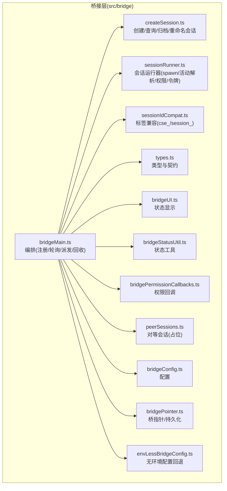
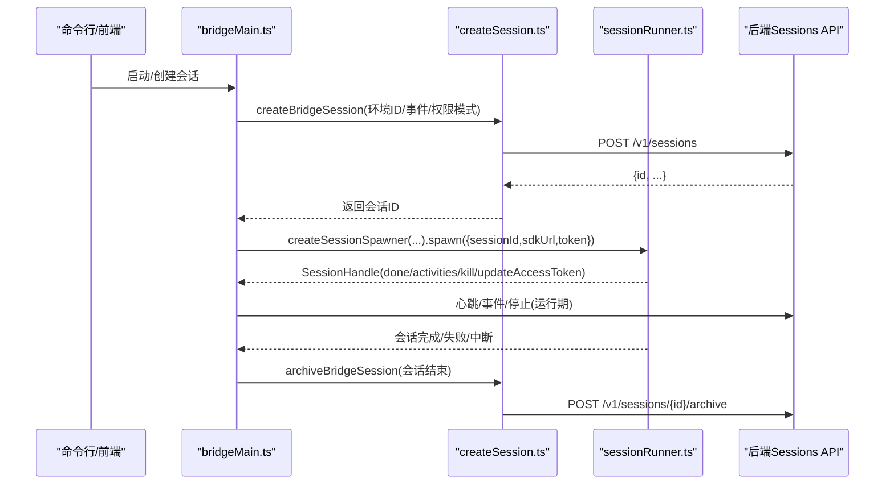
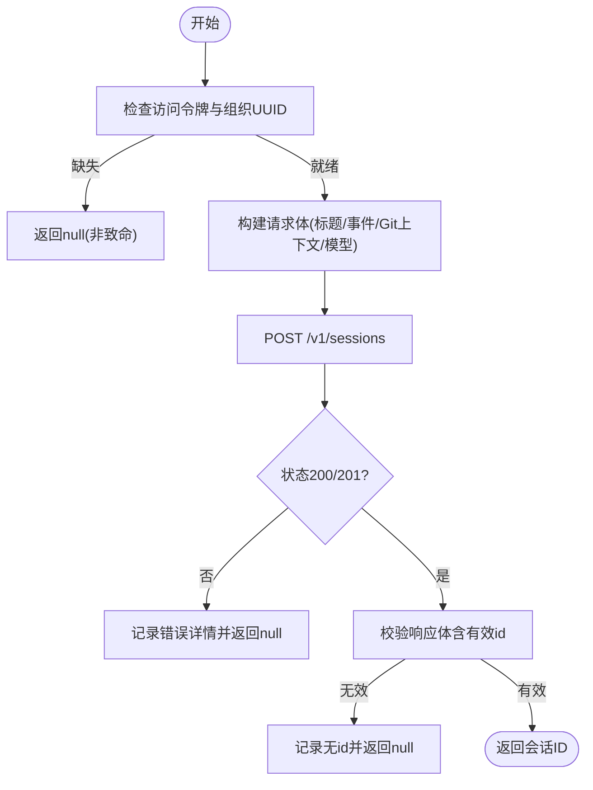
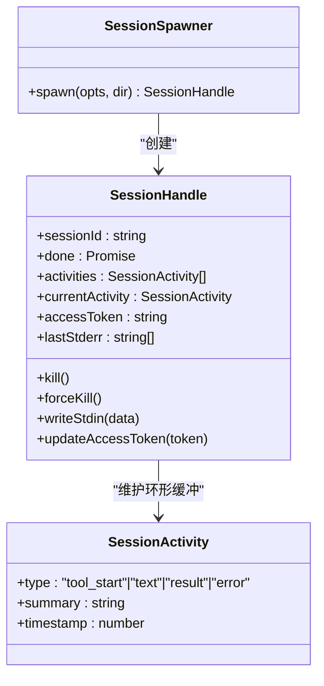
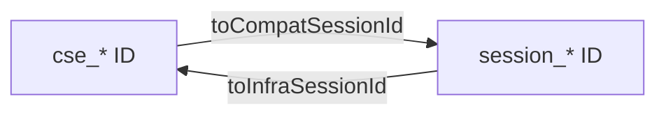
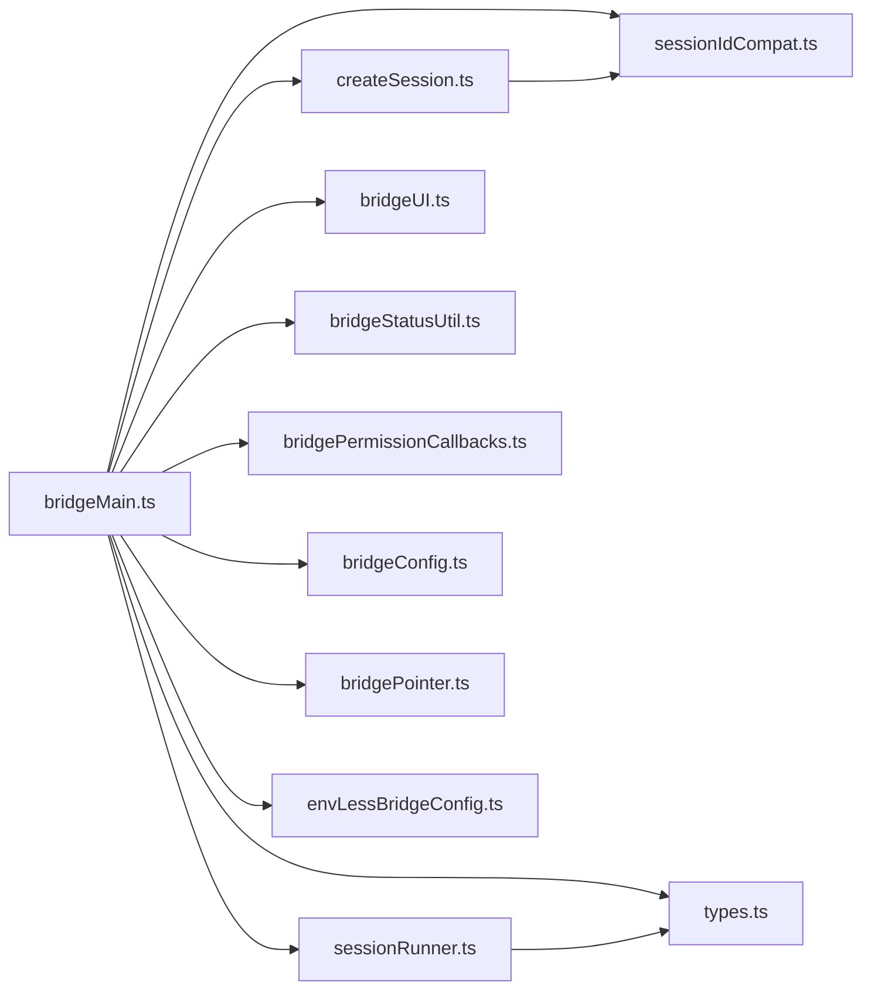

# 会话管理

<cite>
**本文引用的文件**
- [createSession.ts](file://src/bridge/createSession.ts)
- [sessionRunner.ts](file://src/bridge/sessionRunner.ts)
- [peerSessions.ts](file://src/bridge/peerSessions.ts)
- [sessionIdCompat.ts](file://src/bridge/sessionIdCompat.ts)
- [types.ts](file://src/bridge/types.ts)
- [bridgeMain.ts](file://src/bridge/bridgeMain.ts)
- [bridgeApi.ts](file://src/bridge/bridgeApi.ts)
- [bridgeConfig.ts](file://src/bridge/bridgeConfig.ts)
- [bridgePointer.ts](file://src/bridge/bridgePointer.ts)
- [bridgeStatusUtil.ts](file://src/bridge/bridgeStatusUtil.ts)
- [bridgeUI.ts](file://src/bridge/bridgeUI.ts)
- [bridgePermissionCallbacks.ts](file://src/bridge/bridgePermissionCallbacks.ts)
- [envLessBridgeConfig.ts](file://src/bridge/envLessBridgeConfig.ts)
- [sessionIdCompat.ts](file://src/bridge/sessionIdCompat.ts)
- [types.ts](file://src/bridge/types.ts)
</cite>

## 目录
1. [引言](#引言)
2. [项目结构](#项目结构)
3. [核心组件](#核心组件)
4. [架构总览](#架构总览)
5. [组件详解](#组件详解)
6. [依赖关系分析](#依赖关系分析)
7. [性能与可扩展性](#性能与可扩展性)
8. [故障排查指南](#故障排查指南)
9. [结论](#结论)
10. [附录：最佳实践与示例路径](#附录最佳实践与示例路径)

## 引言
本文件系统化梳理“会话管理”模块，聚焦以下目标：
- 深入解释会话创建流程（createSession.ts）
- 解析会话运行器设计模式与生命周期控制（sessionRunner.ts）
- 阐述对等会话管理现状与兼容层（peerSessions.ts 与 sessionIdCompat.ts）
- 给出会话状态跟踪、超时与资源清理、错误恢复策略
- 提供可直接定位到源码的示例路径，便于快速上手与排障

## 项目结构
会话管理相关代码主要位于 src/bridge 目录，围绕“创建会话”“运行会话”“兼容层”三大子域协作：
- 创建与归档：createSession.ts 提供创建、查询、归档、重命名等接口
- 进程管理与生命周期：sessionRunner.ts 负责子进程 spawn、活动解析、权限请求转发、令牌刷新、退出状态判定
- 兼容层：sessionIdCompat.ts 处理 cse_* 与 session_* 标签互转
- 类型与契约：types.ts 定义会话句柄、工作项、活动类型、桥接配置等
- 上层编排：bridgeMain.ts 调用上述能力，组织环境注册、轮询、会话派发与回收
- UI/状态：bridgeUI.ts、bridgeStatusUtil.ts 等负责状态渲染与交互
- 权限回调：bridgePermissionCallbacks.ts 协调权限决策回传
- 配置与入口：bridgeConfig.ts、bridgePointer.ts、envLessBridgeConfig.ts 提供配置与入口参数

图表来源
- [bridgeMain.ts](file://src/bridge/bridgeMain.ts)
- [createSession.ts](file://src/bridge/createSession.ts)
- [sessionRunner.ts](file://src/bridge/sessionRunner.ts)
- [sessionIdCompat.ts](file://src/bridge/sessionIdCompat.ts)
- [types.ts](file://src/bridge/types.ts)
- [bridgeUI.ts](file://src/bridge/bridgeUI.ts)
- [bridgeStatusUtil.ts](file://src/bridge/bridgeStatusUtil.ts)
- [bridgePermissionCallbacks.ts](file://src/bridge/bridgePermissionCallbacks.ts)
- [peerSessions.ts](file://src/bridge/peerSessions.ts)
- [bridgeConfig.ts](file://src/bridge/bridgeConfig.ts)
- [bridgePointer.ts](file://src/bridge/bridgePointer.ts)
- [envLessBridgeConfig.ts](file://src/bridge/envLessBridgeConfig.ts)

章节来源
- [bridgeMain.ts](file://src/bridge/bridgeMain.ts)
- [createSession.ts](file://src/bridge/createSession.ts)
- [sessionRunner.ts](file://src/bridge/sessionRunner.ts)
- [sessionIdCompat.ts](file://src/bridge/sessionIdCompat.ts)
- [types.ts](file://src/bridge/types.ts)
- [bridgeUI.ts](file://src/bridge/bridgeUI.ts)
- [bridgeStatusUtil.ts](file://src/bridge/bridgeStatusUtil.ts)
- [bridgePermissionCallbacks.ts](file://src/bridge/bridgePermissionCallbacks.ts)
- [peerSessions.ts](file://src/bridge/peerSessions.ts)
- [bridgeConfig.ts](file://src/bridge/bridgeConfig.ts)
- [bridgePointer.ts](file://src/bridge/bridgePointer.ts)
- [envLessBridgeConfig.ts](file://src/bridge/envLessBridgeConfig.ts)

## 核心组件
- 会话创建与管理：提供创建、查询、归档、标题更新等 API，并在必要时进行会话 ID 标签转换以适配 v1/v2 兼容层
- 会话运行器：封装子进程生命周期、NDJSON 流解析、活动追踪、权限请求转发、令牌刷新、退出状态判定
- 兼容层：在 CCR v2 与旧版 API 之间进行会话 ID 标签互转
- 类型与契约：统一定义会话句柄、活动类型、工作项、桥接配置等，确保跨模块一致性
- 编排器：负责环境注册、轮询工作、派发会话、回收资源与错误处理

章节来源
- [createSession.ts](file://src/bridge/createSession.ts)
- [sessionRunner.ts](file://src/bridge/sessionRunner.ts)
- [sessionIdCompat.ts](file://src/bridge/sessionIdCompat.ts)
- [types.ts](file://src/bridge/types.ts)
- [bridgeMain.ts](file://src/bridge/bridgeMain.ts)

## 架构总览
下图展示了从桥接器到后端服务的会话全生命周期：创建、轮询、派发、运行、归档。

图表来源
- [bridgeMain.ts](file://src/bridge/bridgeMain.ts)
- [createSession.ts](file://src/bridge/createSession.ts)
- [sessionRunner.ts](file://src/bridge/sessionRunner.ts)

## 组件详解

### 会话创建流程（createSession.ts）
- 功能要点
  - 通过 POST /v1/sessions 创建会话，支持标题、事件、Git 源与结果上下文、模型选择、权限模式等
  - 使用组织级认证头与特定 beta 头，确保在组织维度可见
  - 支持查询会话信息（GET /v1/sessions/{id}）与归档（POST /v1/sessions/{id}/archive）
  - 支持异步更新会话标题（PATCH /v1/sessions/{id}），内部自动进行会话 ID 标签转换
- 关键行为
  - 认证与组织校验失败时返回空值，避免非致命错误影响调用方
  - 对响应体进行严格校验，确保存在合法的字符串型 id
  - 归档与标题更新采用“尽力而为”的错误处理策略（归档抛错由调用方捕获；标题更新吞掉异常）

图表来源
- [createSession.ts](file://src/bridge/createSession.ts)

章节来源
- [createSession.ts](file://src/bridge/createSession.ts)

### 会话运行器（sessionRunner.ts）
- 设计模式
  - 工厂模式：createSessionSpawner 生成 SessionSpawner，封装 spawn 逻辑与依赖注入
  - 观察者模式：通过 onActivity/onPermissionRequest/onDebug 回调对外暴露事件
  - 状态机：done Promise 表达完成态（completed/failed/interrupted）
- 生命周期控制
  - 子进程 spawn：设置环境变量（含会话访问令牌、是否启用 v2、工作代数等），管道 stdin/stdout/stderr
  - 输出解析：逐行解析 NDJSON，提取活动（tool_start/text/result/error）、用户首次消息、权限请求
  - 资源管理：stderr 环形缓冲、活动环形缓冲、调试日志与转录文件写入
  - 退出判定：根据 close 事件的 code/signal 判断 completed/failed/interrupted
  - 终止策略：先 SIGTERM，必要时 SIGKILL；支持强制终止
  - 令牌刷新：通过向子进程 stdin 发送更新消息，使子进程即时感知新令牌
- 可观测性
  - debugTruncate 截断日志，避免过长输出
  - onActivity 提供最近若干条活动，onDebug 提供细粒度调试信息

图表来源
- [sessionRunner.ts](file://src/bridge/sessionRunner.ts)
- [types.ts](file://src/bridge/types.ts)

章节来源
- [sessionRunner.ts](file://src/bridge/sessionRunner.ts)
- [types.ts](file://src/bridge/types.ts)

### 对等会话管理（peerSessions.ts）
- 当前实现
  - 提供占位函数 listPeerSessions，返回空数组，表示当前未实现对等会话协调
- 后续演进建议
  - 若引入多实例桥接器或分布式会话，可在该模块中扩展节点发现、心跳、冲突解决与状态同步

章节来源
- [peerSessions.ts](file://src/bridge/peerSessions.ts)

### 会话 ID 兼容性处理（sessionIdCompat.ts）
- 目标
  - 在 CCR v2 与旧版 API 之间进行会话 ID 标签互转，保证不同层面对同一会话的识别一致
- 能力
  - toCompatSessionId：将 cse_* 转为 session_*（受开关控制）
  - toInfraSessionId：将 session_* 转为 cse_*（用于底层基础设施调用）
  - 通过 setCseShimGate 注册开关，避免 SDK 打包侧引入额外依赖链
- 使用场景
  - bridgeMain 在归档/查询标题时需要将会话 ID 转换为兼容格式
  - 与 createSession.ts 的标题更新、归档等 API 协作

图表来源
- [sessionIdCompat.ts](file://src/bridge/sessionIdCompat.ts)

章节来源
- [sessionIdCompat.ts](file://src/bridge/sessionIdCompat.ts)

### 类型与契约（types.ts）
- 重要类型
  - SessionActivity / SessionActivityType：活动类型与摘要
  - SessionHandle：会话句柄（生命周期、活动、令牌、I/O）
  - SessionSpawnOpts：spawn 参数（sessionId/sdKUrl/token/useCcrV2/workerEpoch/onFirstUserMessage）
  - BridgeApiClient：桥接客户端接口（注册/轮询/确认/停止/去注册/发送权限响应/归档/重连/心跳）
  - BridgeConfig：桥接器配置（目录/机器名/分支/Git仓库/最大会话数/模式/调试/超时等）
- 作用
  - 统一跨模块的数据结构与接口契约，降低耦合，提升可测试性

章节来源
- [types.ts](file://src/bridge/types.ts)

### 编排器（bridgeMain.ts）
- 主要职责
  - 环境注册与轮询：注册桥接环境、拉取工作、确认工作、心跳
  - 会话派发：根据工作项创建会话（调用 createSession.ts），启动运行器（调用 sessionRunner.ts）
  - 会话回收：会话结束后归档（调用 createSession.ts），释放资源
  - 错误处理：网络异常、超时、权限拒绝等场景的降级与重试
- 关键点
  - 与 createSession.ts 的集成：创建/查询/归档/重命名
  - 与 sessionRunner.ts 的集成：spawn、活动上报、权限请求转发、令牌刷新
  - 与 sessionIdCompat.ts 的集成：在调用兼容 API 前进行 ID 转换
  - 与 bridgeUI/bridgeStatusUtil 的集成：状态渲染与用户反馈

章节来源
- [bridgeMain.ts](file://src/bridge/bridgeMain.ts)

## 依赖关系分析
- 内部依赖
  - bridgeMain.ts 依赖 createSession.ts、sessionRunner.ts、types.ts、sessionIdCompat.ts、bridgeUI.ts、bridgeStatusUtil.ts、bridgePermissionCallbacks.ts、bridgeConfig.ts、bridgePointer.ts、envLessBridgeConfig.ts
  - createSession.ts 依赖 sessionIdCompat.ts（标题更新/归档时）
  - sessionRunner.ts 依赖 types.ts（契约）、debugUtils.ts（截断）、slowOperations.ts（JSON 序列化/反序列化）
- 外部依赖
  - axios 用于 HTTP 请求
  - child_process/fs/path/readline 用于进程与文件操作
- 循环依赖
  - 通过模块拆分与按需动态导入规避循环依赖风险

图表来源
- [bridgeMain.ts](file://src/bridge/bridgeMain.ts)
- [createSession.ts](file://src/bridge/createSession.ts)
- [sessionRunner.ts](file://src/bridge/sessionRunner.ts)
- [types.ts](file://src/bridge/types.ts)
- [sessionIdCompat.ts](file://src/bridge/sessionIdCompat.ts)
- [bridgeUI.ts](file://src/bridge/bridgeUI.ts)
- [bridgeStatusUtil.ts](file://src/bridge/bridgeStatusUtil.ts)
- [bridgePermissionCallbacks.ts](file://src/bridge/bridgePermissionCallbacks.ts)
- [bridgeConfig.ts](file://src/bridge/bridgeConfig.ts)
- [bridgePointer.ts](file://src/bridge/bridgePointer.ts)
- [envLessBridgeConfig.ts](file://src/bridge/envLessBridgeConfig.ts)

章节来源
- [bridgeMain.ts](file://src/bridge/bridgeMain.ts)
- [createSession.ts](file://src/bridge/createSession.ts)
- [sessionRunner.ts](file://src/bridge/sessionRunner.ts)
- [types.ts](file://src/bridge/types.ts)
- [sessionIdCompat.ts](file://src/bridge/sessionIdCompat.ts)
- [bridgeUI.ts](file://src/bridge/bridgeUI.ts)
- [bridgeStatusUtil.ts](file://src/bridge/bridgeStatusUtil.ts)
- [bridgePermissionCallbacks.ts](file://src/bridge/bridgePermissionCallbacks.ts)
- [bridgeConfig.ts](file://src/bridge/bridgeConfig.ts)
- [bridgePointer.ts](file://src/bridge/bridgePointer.ts)
- [envLessBridgeConfig.ts](file://src/bridge/envLessBridgeConfig.ts)

## 性能与可扩展性
- 日志与可观测性
  - 使用环形缓冲限制活动与 stderr 数量，避免内存膨胀
  - 调试文件与转录文件分离，便于离线分析
- I/O 与解析
  - NDJSON 行式解析，单行开销低；对非 JSON 行进行容错
  - 将原始行写入转录文件，便于事后审计与复盘
- 并发与隔离
  - 每个会话独立子进程，隔离资源与错误
  - 通过环境变量传递令牌，避免父进程泄露敏感信息
- 超时与回收
  - 默认会话超时时间较长（24 小时），可通过配置调整
  - 会话结束即归档，减少后端无效会话数量

[本节为通用指导，不直接分析具体文件]

## 故障排查指南
- 无法创建会话
  - 检查访问令牌与组织 UUID 是否存在
  - 查看请求失败详情与状态码
  - 确认 beta 头与组织 UUID 是否正确
- 会话无法启动或立即退出
  - 查看 stderr 环形缓冲中的最后若干行
  - 检查子进程 PID 与退出码/信号
  - 确认 SDK URL、会话 ID、令牌是否正确
- 权限请求未生效
  - 确认 onPermissionRequest 回调已注册
  - 检查权限响应事件是否成功发送至会话事件流
- 令牌过期
  - 使用 updateAccessToken 刷新令牌
  - 确保子进程能接收 stdin 更新消息
- 会话标题不同步
  - 确认标题更新调用与兼容 ID 转换
  - 注意标题更新为尽力而为，异常会被吞掉

章节来源
- [createSession.ts](file://src/bridge/createSession.ts)
- [sessionRunner.ts](file://src/bridge/sessionRunner.ts)
- [bridgePermissionCallbacks.ts](file://src/bridge/bridgePermissionCallbacks.ts)

## 结论
会话管理模块通过“创建—运行—归档”的闭环设计，结合运行器的强健生命周期管理与兼容层的 ID 标签转换，实现了在多版本后端与多实例桥接器场景下的稳定运行。建议在生产环境中配合完善的日志与转录、严格的令牌管理与超时控制，持续优化并发与资源隔离策略。

[本节为总结性内容，不直接分析具体文件]

## 附录：最佳实践与示例路径
- 如何创建会话
  - 调用 createBridgeSession，传入环境 ID、事件、Git 信息与权限模式
  - 示例路径：[createBridgeSession 调用示例](file://src/bridge/bridgeMain.ts)
- 如何启动会话运行器
  - 使用 createSessionSpawner 创建会话运行器，spawn 会话并订阅活动
  - 示例路径：[spawn 会话示例](file://src/bridge/bridgeMain.ts)
- 如何监控会话状态
  - 通过 SessionHandle.activities 与 onActivity 回调获取最近活动
  - 示例路径：[活动解析与回调](file://src/bridge/sessionRunner.ts)
- 如何终止会话
  - 先尝试 SIGTERM，必要时 SIGKILL；或直接调用 forceKill
  - 示例路径：[终止策略](file://src/bridge/sessionRunner.ts)
- 如何处理权限请求
  - 注册 onPermissionRequest，在收到 control_request 后发送 control_response
  - 示例路径：[权限回调](file://src/bridge/bridgePermissionCallbacks.ts)
- 如何进行会话 ID 兼容
  - 在调用兼容 API 前使用 toCompatSessionId 转换
  - 示例路径：[ID 转换](file://src/bridge/sessionIdCompat.ts)
- 如何归档会话
  - 会话结束后调用 archiveBridgeSession
  - 示例路径：[归档会话](file://src/bridge/createSession.ts)

章节来源
- [bridgeMain.ts](file://src/bridge/bridgeMain.ts)
- [sessionRunner.ts](file://src/bridge/sessionRunner.ts)
- [bridgePermissionCallbacks.ts](file://src/bridge/bridgePermissionCallbacks.ts)
- [sessionIdCompat.ts](file://src/bridge/sessionIdCompat.ts)
- [createSession.ts](file://src/bridge/createSession.ts)