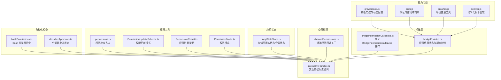
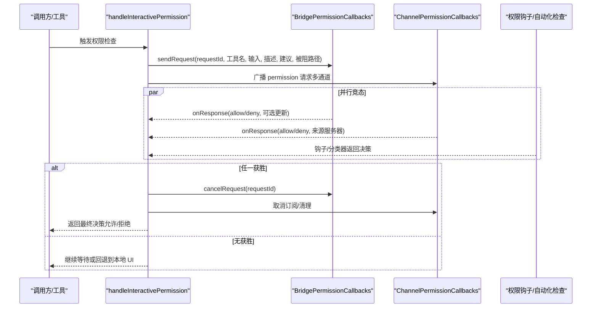
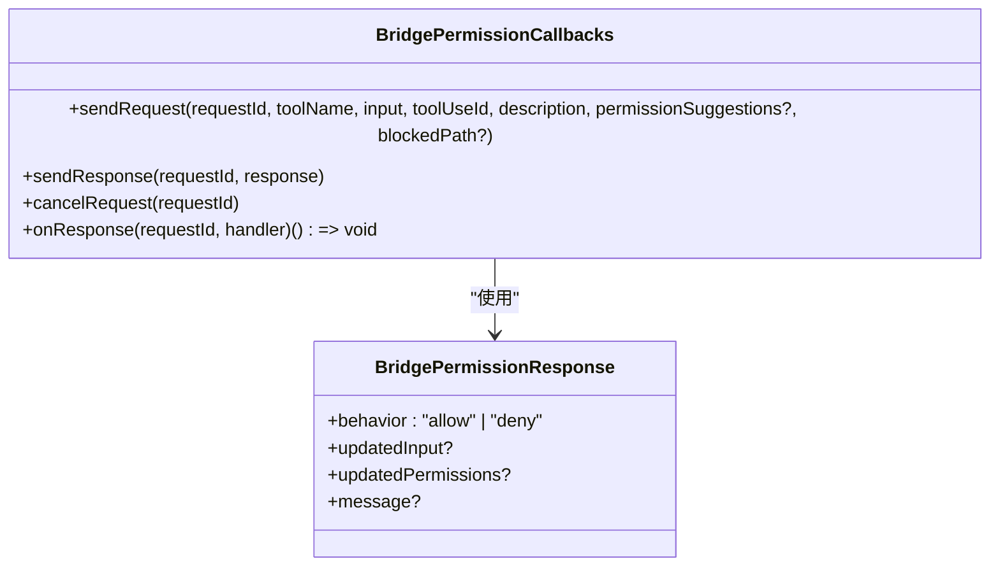
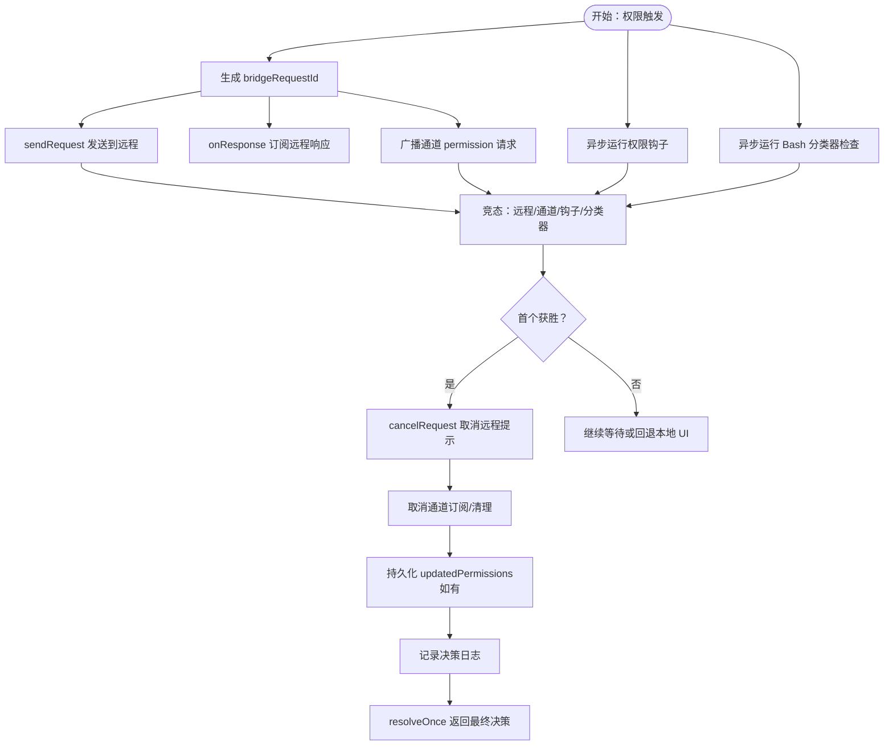
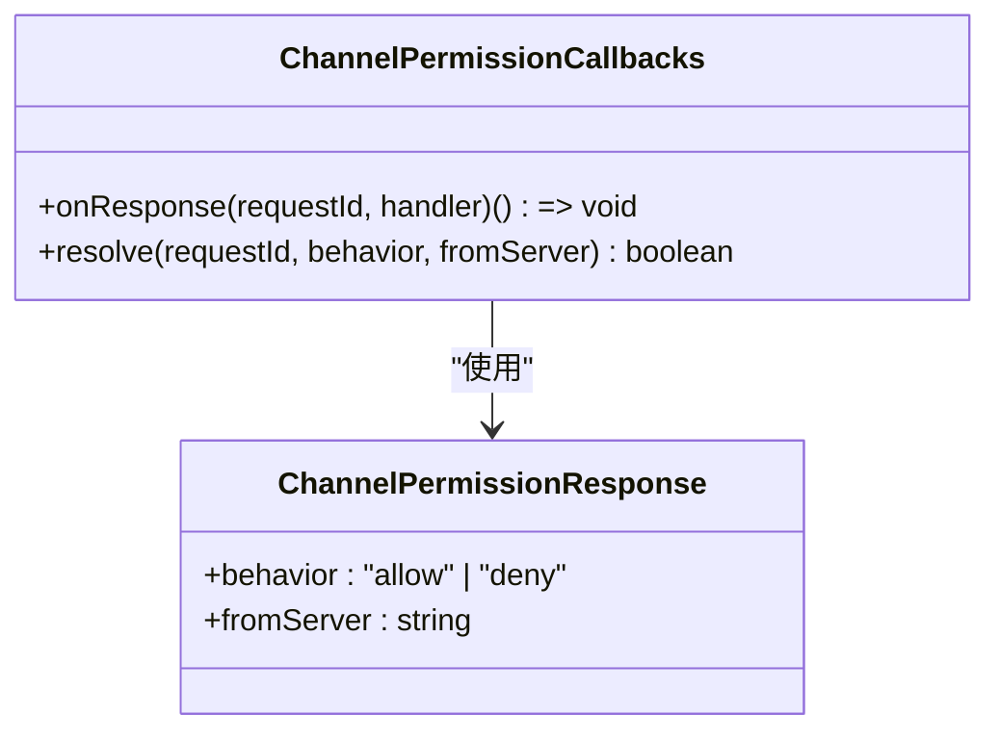
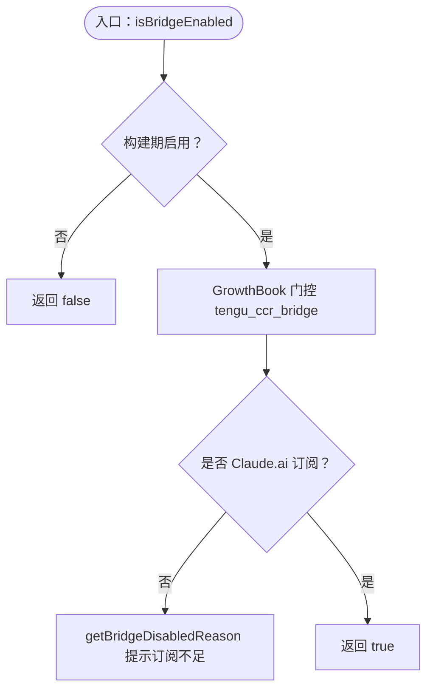
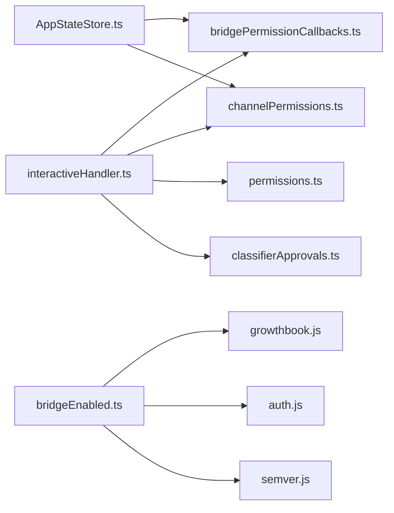

# 权限回调

<cite>
**本文引用的文件**
- [bridgePermissionCallbacks.ts](file://src/bridge/bridgePermissionCallbacks.ts)
- [bridgeEnabled.ts](file://src/bridge/bridgeEnabled.ts)
- [interactiveHandler.ts](file://src/hooks/toolPermission/handlers/interactiveHandler.ts)
- [channelPermissions.ts](file://src/services/mcp/channelPermissions.ts)
- [AppStateStore.ts](file://src/state/AppStateStore.ts)
- [permissions.ts](file://src/utils/permissions/permissions.ts)
- [PermissionUpdateSchema.ts](file://src/utils/permissions/PermissionUpdateSchema.ts)
- [PermissionResult.ts](file://src/utils/permissions/PermissionResult.ts)
- [PermissionMode.ts](file://src/utils/permissions/PermissionMode.ts)
- [bashPermissions.ts](file://src/tools/BashTool/bashPermissions.ts)
- [classifierApprovals.ts](file://src/utils/classifierApprovals.ts)
- [growthbook.js](file://src/services/analytics/growthbook.js)
- [auth.js](file://src/utils/auth.js)
- [envUtils.js](file://src/utils/envUtils.js)
- [semver.js](file://src/utils/semver.js)
- [channelNotification.js](file://src/services/mcp/channelNotification.js)
</cite>

## 目录
1. [简介](#简介)
2. [项目结构](#项目结构)
3. [核心组件](#核心组件)
4. [架构总览](#架构总览)
5. [详细组件分析](#详细组件分析)
6. [依赖关系分析](#依赖关系分析)
7. [性能考量](#性能考量)
8. [故障排查指南](#故障排查指南)
9. [结论](#结论)
10. [附录](#附录)

## 简介
本文件系统性解析权限回调机制，聚焦以下目标：
- 深入解释 bridgePermissionCallbacks.ts 中的权限检查流程、回调函数设计与权限决策逻辑
- 详述权限验证的触发时机、回调注册与执行机制、权限结果处理与缓存策略
- 阐明 bridgeEnabled.ts 中的权限启用状态管理、权限开关控制与权限状态同步
- 提供可操作的示例路径，展示如何实现自定义权限回调、处理权限请求与管理权限状态
- 解释权限安全机制、性能考虑与最佳实践

## 项目结构
围绕权限回调的关键模块分布如下：
- 桥接层：bridgePermissionCallbacks.ts 定义桥接权限回调接口；bridgeEnabled.ts 管理权限启用状态与版本校验
- 交互处理器：interactiveHandler.ts 实现交互式权限流，协调本地 UI、桥接（远程）、通道（短信等）与自动化检查
- 通道权限：channelPermissions.ts 提供跨通道权限提示与响应解析
- 应用状态：AppStateStore.ts 存储桥接与通道权限回调实例
- 权限工具：permissions.ts、PermissionUpdateSchema.ts、PermissionResult.ts、PermissionMode.ts 提供权限规则、更新与模式支持
- 自动化检查：bashPermissions.ts、classifierApprovals.ts 提供 Bash 分类器与自动批准状态
- 能力门控：growthbook.js、auth.js、envUtils.js、semver.js 提供特性开关、认证与版本校验

图表来源
- [bridgePermissionCallbacks.ts:1-44](file://src/bridge/bridgePermissionCallbacks.ts#L1-L44)
- [bridgeEnabled.ts:1-203](file://src/bridge/bridgeEnabled.ts#L1-L203)
- [interactiveHandler.ts:1-537](file://src/hooks/toolPermission/handlers/interactiveHandler.ts#L1-L537)
- [channelPermissions.ts:1-241](file://src/services/mcp/channelPermissions.ts#L1-L241)
- [AppStateStore.ts:440-570](file://src/state/AppStateStore.ts#L440-L570)
- [permissions.ts](file://src/utils/permissions/permissions.ts)
- [PermissionUpdateSchema.ts](file://src/utils/permissions/PermissionUpdateSchema.ts)
- [PermissionResult.ts](file://src/utils/permissions/PermissionResult.ts)
- [PermissionMode.ts](file://src/utils/permissions/PermissionMode.ts)
- [bashPermissions.ts](file://src/tools/BashTool/bashPermissions.ts)
- [classifierApprovals.ts](file://src/utils/classifierApprovals.ts)
- [growthbook.js](file://src/services/analytics/growthbook.js)
- [auth.js](file://src/utils/auth.js)
- [envUtils.js](file://src/utils/envUtils.js)
- [semver.js](file://src/utils/semver.js)

章节来源
- [bridgePermissionCallbacks.ts:1-44](file://src/bridge/bridgePermissionCallbacks.ts#L1-L44)
- [bridgeEnabled.ts:1-203](file://src/bridge/bridgeEnabled.ts#L1-L203)
- [interactiveHandler.ts:1-537](file://src/hooks/toolPermission/handlers/interactiveHandler.ts#L1-L537)
- [channelPermissions.ts:1-241](file://src/services/mcp/channelPermissions.ts#L1-L241)
- [AppStateStore.ts:440-570](file://src/state/AppStateStore.ts#L440-L570)

## 核心组件
- BridgePermissionCallbacks 接口：定义 sendRequest、sendResponse、cancelRequest、onResponse 四个方法，用于与远程（如 claude.ai 的 CCR）进行双向权限确认与取消
- BridgePermissionResponse 类型：描述行为（允许/拒绝）、可选更新输入、权限更新建议与消息
- 交互式权限处理器：handleInteractivePermission 统一协调本地 UI、桥接、通道与自动化检查，通过“竞态”机制以首个响应为准
- 通道权限回调工厂：createChannelPermissionCallbacks 提供通道级权限响应订阅与解析
- 应用状态存储：AppStateStore 在会话生命周期内持有桥接与通道权限回调实例，确保稳定引用
- 权限工具链：permissions.ts 提供 hasPermissionsToUseTool 入口；PermissionUpdateSchema.ts/PermissionResult.ts/PermissionMode.ts 提供类型与模式支撑
- 启用状态与版本校验：bridgeEnabled.ts 提供 isBridgeEnabled/isBridgeEnabledBlocking/getBridgeDisabledReason/checkBridgeMinVersion 等能力门控

章节来源
- [bridgePermissionCallbacks.ts:3-27](file://src/bridge/bridgePermissionCallbacks.ts#L3-L27)
- [bridgePermissionCallbacks.ts:29-42](file://src/bridge/bridgePermissionCallbacks.ts#L29-L42)
- [interactiveHandler.ts:57-320](file://src/hooks/toolPermission/handlers/interactiveHandler.ts#L57-L320)
- [channelPermissions.ts:209-241](file://src/services/mcp/channelPermissions.ts#L209-L241)
- [AppStateStore.ts:446-451](file://src/state/AppStateStore.ts#L446-L451)
- [permissions.ts](file://src/utils/permissions/permissions.ts)
- [PermissionUpdateSchema.ts](file://src/utils/permissions/PermissionUpdateSchema.ts)
- [PermissionResult.ts](file://src/utils/permissions/PermissionResult.ts)
- [PermissionMode.ts](file://src/utils/permissions/PermissionMode.ts)
- [bridgeEnabled.ts:28-173](file://src/bridge/bridgeEnabled.ts#L28-L173)

## 架构总览
权限回调的整体流程由“触发—竞态—决策—持久化/取消—日志记录”构成。交互式处理器在权限触发后，同时向桥接、通道与自动化检查发起竞态请求，并以首个获胜者为准完成最终决策。

图表来源
- [interactiveHandler.ts:234-298](file://src/hooks/toolPermission/handlers/interactiveHandler.ts#L234-L298)
- [interactiveHandler.ts:300-408](file://src/hooks/toolPermission/handlers/interactiveHandler.ts#L300-L408)
- [interactiveHandler.ts:410-431](file://src/hooks/toolPermission/handlers/interactiveHandler.ts#L410-L431)
- [interactiveHandler.ts:433-530](file://src/hooks/toolPermission/handlers/interactiveHandler.ts#L433-L530)
- [bridgePermissionCallbacks.ts:10-27](file://src/bridge/bridgePermissionCallbacks.ts#L10-L27)
- [channelPermissions.ts:46-61](file://src/services/mcp/channelPermissions.ts#L46-L61)

## 详细组件分析

### 组件A：BridgePermissionCallbacks 接口与响应类型
- 设计要点
  - sendRequest：向远程发送权限请求，携带工具名、输入、描述、建议与被阻路径
  - sendResponse/cancelRequest：对远程响应进行允许/拒绝与取消
  - onResponse：订阅指定请求 ID 的响应，返回取消订阅函数
  - isBridgePermissionResponse：类型守卫，确保响应具备必需字段（behavior）
- 数据结构复杂度
  - 响应对象为轻量结构，时间复杂度 O(1)，空间复杂度 O(1)
  - 订阅映射基于请求 ID，查找/删除均为哈希表操作，期望 O(1)

图表来源
- [bridgePermissionCallbacks.ts:10-27](file://src/bridge/bridgePermissionCallbacks.ts#L10-L27)
- [bridgePermissionCallbacks.ts:3-8](file://src/bridge/bridgePermissionCallbacks.ts#L3-L8)
- [bridgePermissionCallbacks.ts:29-42](file://src/bridge/bridgePermissionCallbacks.ts#L29-L42)

章节来源
- [bridgePermissionCallbacks.ts:1-44](file://src/bridge/bridgePermissionCallbacks.ts#L1-L44)

### 组件B：交互式权限处理器（handleInteractivePermission）
- 触发时机
  - 当 hasPermissionsToUseTool 判定为“询问”时触发；若 awaitAutomatedChecksBeforeDialog 为真，则先等待自动化检查再弹窗
- 注册与执行机制
  - 生成唯一 bridgeRequestId；向桥接发送请求并订阅 onResponse
  - 若通道功能开启且工具无需用户交互，广播 permission 请求至所有符合条件的通道客户端
  - 异步运行权限钩子与 Bash 分类器检查，竞速用户响应
  - 使用 resolve-once 与 claim 防止重复决议
- 结果处理与取消
  - 首个获胜分支负责 cancelRequest、取消通道订阅、移除队列项并记录日志
  - 支持 updatedPermissions 持久化与 updatedInput 回传
- 缓存策略
  - 通过 createResolveOnce 与 abort 信号避免重复计算与资源泄漏
  - 分类器状态通过 classifierApprovals 进行短期缓存与 UI 展示

图表来源
- [interactiveHandler.ts:57-320](file://src/hooks/toolPermission/handlers/interactiveHandler.ts#L57-L320)
- [interactiveHandler.ts:320-431](file://src/hooks/toolPermission/handlers/interactiveHandler.ts#L320-L431)
- [interactiveHandler.ts:433-530](file://src/hooks/toolPermission/handlers/interactiveHandler.ts#L433-L530)

章节来源
- [interactiveHandler.ts:1-537](file://src/hooks/toolPermission/handlers/interactiveHandler.ts#L1-L537)
- [permissions.ts](file://src/utils/permissions/permissions.ts)
- [classifierApprovals.ts](file://src/utils/classifierApprovals.ts)

### 组件C：通道权限回调工厂（createChannelPermissionCallbacks）
- 功能概述
  - 提供 onResponse 订阅与 resolve 解析，基于 Map 维护挂起请求
  - 严格区分大小写键名，统一转为小写以保证匹配一致性
  - resolve 成功后立即删除条目，防止重复触发与竞态问题
- 安全与可用性
  - 仅在通道声明了相应实验性能力时才视为有效通道
  - 生成短 ID（5 字母，避免易冲突子串），降低碰撞风险
  - 截断输入预览，保护隐私与带宽

图表来源
- [channelPermissions.ts:46-61](file://src/services/mcp/channelPermissions.ts#L46-L61)
- [channelPermissions.ts:40-44](file://src/services/mcp/channelPermissions.ts#L40-L44)
- [channelPermissions.ts:209-241](file://src/services/mcp/channelPermissions.ts#L209-L241)

章节来源
- [channelPermissions.ts:1-241](file://src/services/mcp/channelPermissions.ts#L1-L241)

### 组件D：应用状态与回调实例（AppStateStore）
- 位置与职责
  - replBridgePermissionCallbacks：会话级桥接权限回调实例，稳定引用便于跨组件共享
  - channelPermissionCallbacks：通道权限回调实例，构造于连接管理钩子中
- 生命周期
  - 在会话初始化时创建，存储于 AppState，随会话结束而释放
  - 通过稳定的引用避免因状态序列化导致的函数相等性问题

章节来源
- [AppStateStore.ts:446-451](file://src/state/AppStateStore.ts#L446-L451)
- [AppStateStore.ts:456-570](file://src/state/AppStateStore.ts#L456-L570)

### 组件E：权限启用状态管理（bridgeEnabled.ts）
- 启用判定
  - isBridgeEnabled：构建期特性开关 + 用户订阅状态 + GrowthBook 门控
  - isBridgeEnabledBlocking：磁盘缓存快速路径 + 服务端刷新慢路径
  - getBridgeDisabledReason：提供具体禁用原因（订阅、作用域、组织 UUID、门控）
- 版本与兼容
  - checkBridgeMinVersion：校验 CLI 最低版本，避免不兼容
  - isEnvLessBridgeEnabled：v2（无环境变量）REPL 桥接路径开关
- 默认值与镜像模式
  - getCcrAutoConnectDefault：默认自动连接 CCR 的策略
  - isCcrMirrorEnabled：镜像模式开关（本地会话镜像转发事件）

图表来源
- [bridgeEnabled.ts:28-87](file://src/bridge/bridgeEnabled.ts#L28-L87)
- [bridgeEnabled.ts:160-173](file://src/bridge/bridgeEnabled.ts#L160-L173)
- [growthbook.js](file://src/services/analytics/growthbook.js)
- [auth.js](file://src/utils/auth.js)

章节来源
- [bridgeEnabled.ts:1-203](file://src/bridge/bridgeEnabled.ts#L1-L203)

## 依赖关系分析
- 组件耦合
  - interactiveHandler 依赖 bridgePermissionCallbacks、channelPermissions、permissions、classifierApprovals 等模块
  - AppStateStore 作为容器，承载桥接与通道回调实例，降低跨组件耦合
- 外部依赖
  - GrowthBook 提供动态配置与门控
  - auth.js 提供订阅状态与作用域判断
  - semver.js 用于版本比较
- 循环依赖规避
  - 通过命名空间导入与延迟加载避免 auth → config → bridgeEnabled 的循环

图表来源
- [interactiveHandler.ts:1-537](file://src/hooks/toolPermission/handlers/interactiveHandler.ts#L1-L537)
- [bridgePermissionCallbacks.ts:1-44](file://src/bridge/bridgePermissionCallbacks.ts#L1-L44)
- [channelPermissions.ts:1-241](file://src/services/mcp/channelPermissions.ts#L1-L241)
- [AppStateStore.ts:440-570](file://src/state/AppStateStore.ts#L440-L570)
- [bridgeEnabled.ts:1-203](file://src/bridge/bridgeEnabled.ts#L1-L203)
- [growthbook.js](file://src/services/analytics/growthbook.js)
- [auth.js](file://src/utils/auth.js)
- [semver.js](file://src/utils/semver.js)

章节来源
- [interactiveHandler.ts:1-537](file://src/hooks/toolPermission/handlers/interactiveHandler.ts#L1-L537)
- [AppStateStore.ts:440-570](file://src/state/AppStateStore.ts#L440-L570)
- [bridgeEnabled.ts:1-203](file://src/bridge/bridgeEnabled.ts#L1-L203)

## 性能考量
- 竞态优化
  - 通过 abort 信号与 resolve-once 防止重复计算与资源泄漏
  - 通道广播采用 fire-and-forget，失败即优雅降级，避免阻塞主流程
- 缓存与门控
  - GrowthBook 动态配置与磁盘缓存结合，减少网络开销
  - 分类器状态短期缓存，提升 UI 响应体验
- 输入截断
  - 通道输入预览截断，降低传输与渲染成本

## 故障排查指南
- 常见问题
  - 远程权限提示未消失：确认已调用 cancelRequest 或在 recheckPermission 中取消
  - 通道回复无效：检查通道客户端是否声明所需能力与是否在允许列表中
  - 自动化检查报错：分类器错误会被记录但不会中断流程，关注日志级别
- 关键定位点
  - 交互式处理器中的订阅与取消逻辑
  - 通道回调的 resolve 流程与 Map 清理
  - 权限启用状态与版本校验链路

章节来源
- [interactiveHandler.ts:137-231](file://src/hooks/toolPermission/handlers/interactiveHandler.ts#L137-L231)
- [interactiveHandler.ts:255-298](file://src/hooks/toolPermission/handlers/interactiveHandler.ts#L255-L298)
- [channelPermissions.ts:228-238](file://src/services/mcp/channelPermissions.ts#L228-L238)

## 结论
该权限回调体系通过“接口抽象 + 竞态决策 + 多通道协同 + 门控与版本校验”的组合，实现了高可用、可扩展且安全的权限治理。桥接与通道的双轨制既保证了用户体验，又提供了安全边界；状态与缓存策略兼顾性能与可靠性。建议在自定义实现中遵循“稳定引用、竞态优先、及时取消、日志留痕”的原则。

## 附录

### 实战示例（示例路径）
- 自定义桥接回调实现
  - 参考接口定义与类型守卫：[bridgePermissionCallbacks.ts:10-42](file://src/bridge/bridgePermissionCallbacks.ts#L10-L42)
  - 在会话初始化时注入 AppState：[AppStateStore.ts:446-451](file://src/state/AppStateStore.ts#L446-L451)
- 处理权限请求
  - 交互式处理器的请求发送与响应订阅：[interactiveHandler.ts:244-298](file://src/hooks/toolPermission/handlers/interactiveHandler.ts#L244-L298)
  - 通道广播与订阅：[interactiveHandler.ts:316-408](file://src/hooks/toolPermission/handlers/interactiveHandler.ts#L316-L408)
- 管理权限状态
  - 权限更新持久化与输入回传：[interactiveHandler.ts:162-181](file://src/hooks/toolPermission/handlers/interactiveHandler.ts#L162-L181)
  - 启用状态与版本校验：[bridgeEnabled.ts:28-173](file://src/bridge/bridgeEnabled.ts#L28-L173)
- 安全与最佳实践
  - 通道能力声明与短 ID 生成：[channelPermissions.ts:177-194](file://src/services/mcp/channelPermissions.ts#L177-L194)、[channelPermissions.ts:140-152](file://src/services/mcp/channelPermissions.ts#L140-L152)
  - 分类器错误日志与 UI 降级：[interactiveHandler.ts:523-529](file://src/hooks/toolPermission/handlers/interactiveHandler.ts#L523-L529)