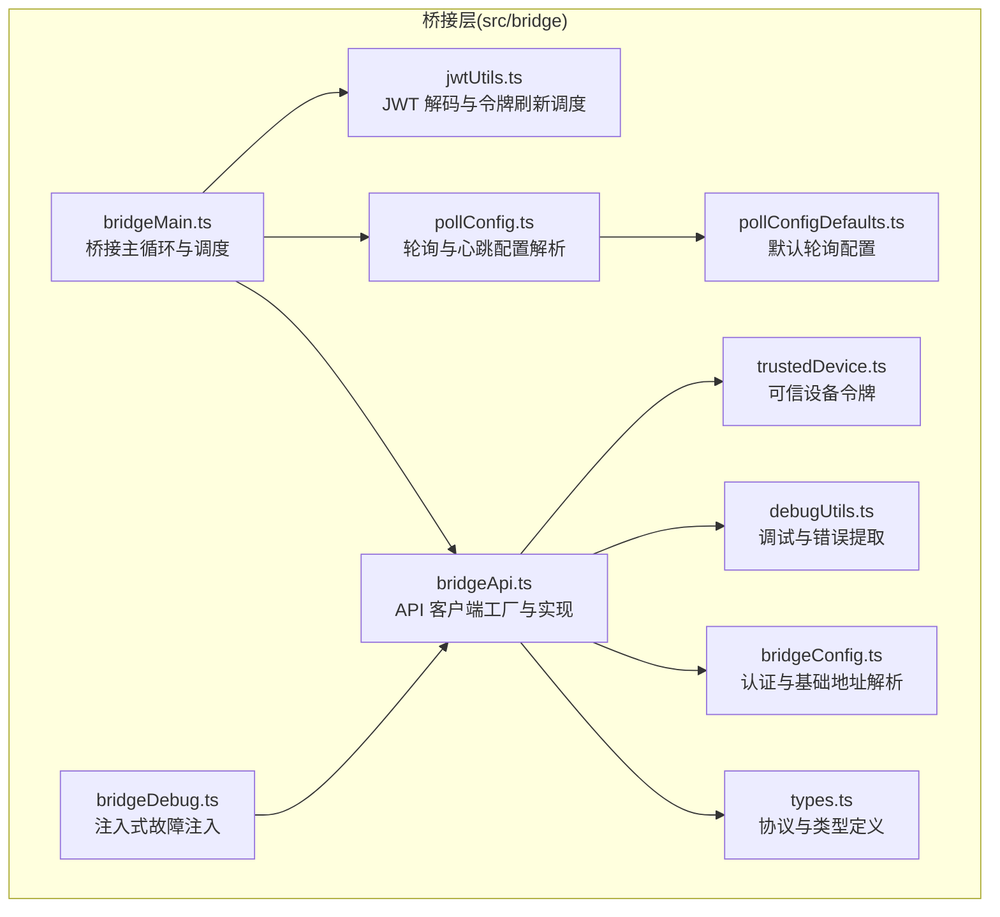
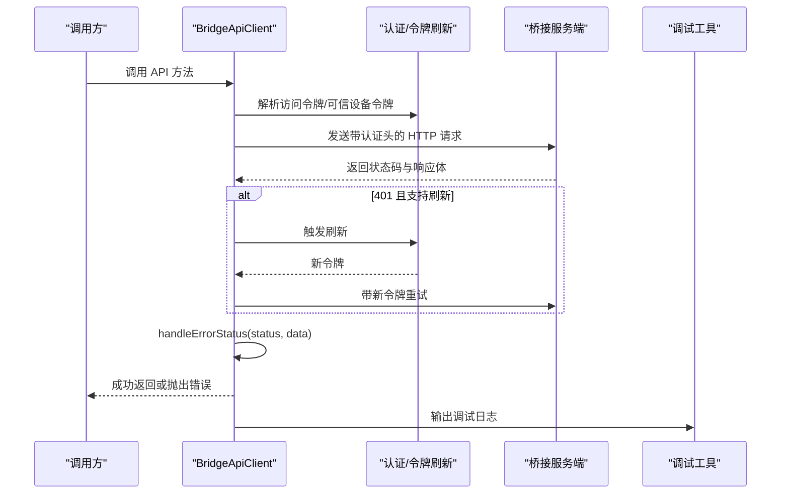
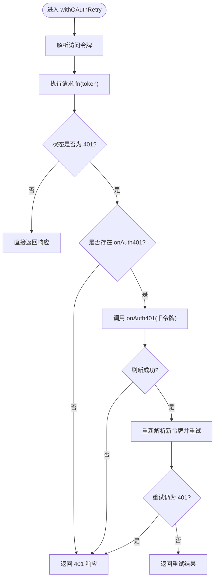
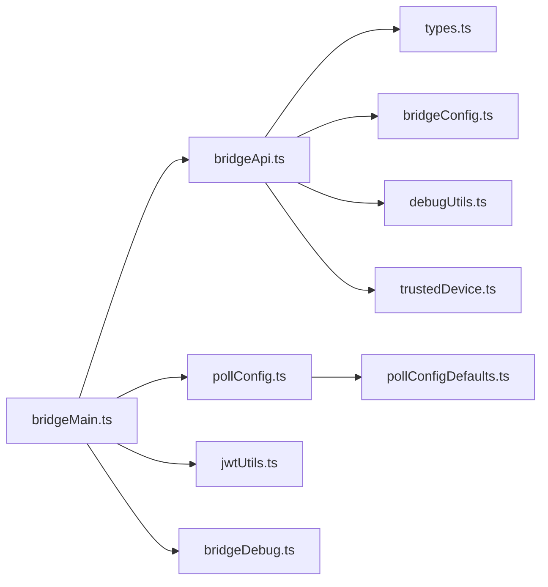

# 桥接 API

<cite>
**本文引用的文件**
- [bridgeApi.ts](file://src/bridge/bridgeApi.ts)
- [types.ts](file://src/bridge/types.ts)
- [bridgeConfig.ts](file://src/bridge/bridgeConfig.ts)
- [pollConfig.ts](file://src/bridge/pollConfig.ts)
- [pollConfigDefaults.ts](file://src/bridge/pollConfigDefaults.ts)
- [bridgeMain.ts](file://src/bridge/bridgeMain.ts)
- [debugUtils.ts](file://src/bridge/debugUtils.ts)
- [bridgeDebug.ts](file://src/bridge/bridgeDebug.ts)
- [trustedDevice.ts](file://src/bridge/trustedDevice.ts)
- [jwtUtils.ts](file://src/bridge/jwtUtils.ts)
</cite>

## 目录
1. [简介](#简介)
2. [项目结构](#项目结构)
3. [核心组件](#核心组件)
4. [架构总览](#架构总览)
5. [详细组件分析](#详细组件分析)
6. [依赖关系分析](#依赖关系分析)
7. [性能考量](#性能考量)
8. [故障排除指南](#故障排除指南)
9. [结论](#结论)
10. [附录](#附录)

## 简介
本文件面向需要集成或维护“桥接 API”的工程师与高级用户，系统性解析 bridgeApi.ts 中的 API 客户端实现、类型定义与配置管理，覆盖以下关键能力：
- 环境注册与注销（registerBridgeEnvironment / deregisterEnvironment）
- 工作项轮询与确认（pollForWork / acknowledgeWork / stopWork）
- 会话归档与重连（archiveSession / reconnectSession）
- 工作心跳（heartbeatWork）
- 权限事件上报（sendPermissionResponseEvent）
- 认证与重试策略、错误分类与致命错误处理
- 超时与重试配置、可信设备头注入、调试与排障工具

## 项目结构
桥接 API 的核心位于 src/bridge 目录，围绕一个可复用的客户端工厂函数 createBridgeApiClient 构建，配合类型定义、配置解析与运行时主循环使用。

图表来源
- [bridgeApi.ts:68-452](file://src/bridge/bridgeApi.ts#L68-L452)
- [types.ts:133-176](file://src/bridge/types.ts#L133-L176)
- [bridgeConfig.ts:38-48](file://src/bridge/bridgeConfig.ts#L38-L48)
- [pollConfig.ts:102-110](file://src/bridge/pollConfig.ts#L102-L110)
- [pollConfigDefaults.ts:55-82](file://src/bridge/pollConfigDefaults.ts#L55-L82)
- [bridgeMain.ts:141-300](file://src/bridge/bridgeMain.ts#L141-L300)
- [debugUtils.ts:45-121](file://src/bridge/debugUtils.ts#L45-L121)
- [bridgeDebug.ts:84-135](file://src/bridge/bridgeDebug.ts#L84-L135)
- [trustedDevice.ts:54-59](file://src/bridge/trustedDevice.ts#L54-L59)
- [jwtUtils.ts:72-256](file://src/bridge/jwtUtils.ts#L72-L256)

章节来源
- [bridgeApi.ts:68-452](file://src/bridge/bridgeApi.ts#L68-L452)
- [types.ts:133-176](file://src/bridge/types.ts#L133-L176)
- [bridgeConfig.ts:38-48](file://src/bridge/bridgeConfig.ts#L38-L48)
- [pollConfig.ts:102-110](file://src/bridge/pollConfig.ts#L102-L110)
- [pollConfigDefaults.ts:55-82](file://src/bridge/pollConfigDefaults.ts#L55-L82)
- [bridgeMain.ts:141-300](file://src/bridge/bridgeMain.ts#L141-L300)
- [debugUtils.ts:45-121](file://src/bridge/debugUtils.ts#L45-L121)
- [bridgeDebug.ts:84-135](file://src/bridge/bridgeDebug.ts#L84-L135)
- [trustedDevice.ts:54-59](file://src/bridge/trustedDevice.ts#L54-L59)
- [jwtUtils.ts:72-256](file://src/bridge/jwtUtils.ts#L72-L256)

## 核心组件
- API 客户端工厂：createBridgeApiClient(deps) 返回一组强类型 API 方法，统一注入认证头、超时与调试日志，并在 401 场景下按需触发一次令牌刷新重试。
- 类型系统：WorkResponse、WorkSecret、BridgeConfig、BridgeApiClient 等，明确请求/响应结构与职责边界。
- 配置体系：环境基础地址与访问令牌解析、轮询间隔与心跳配置、可信设备令牌注入。
- 运行时主循环：桥接主循环负责工作项轮询、心跳、会话管理、容量唤醒与错误恢复。

章节来源
- [bridgeApi.ts:68-452](file://src/bridge/bridgeApi.ts#L68-L452)
- [types.ts:133-176](file://src/bridge/types.ts#L133-L176)
- [bridgeConfig.ts:38-48](file://src/bridge/bridgeConfig.ts#L38-L48)
- [pollConfig.ts:102-110](file://src/bridge/pollConfig.ts#L102-L110)
- [pollConfigDefaults.ts:55-82](file://src/bridge/pollConfigDefaults.ts#L55-L82)
- [bridgeMain.ts:141-300](file://src/bridge/bridgeMain.ts#L141-L300)

## 架构总览
桥接 API 的调用链路如下：应用通过 createBridgeApiClient 获取客户端实例；客户端在每次请求前构造认证头（含可选可信设备令牌），执行请求并在 401 时尝试刷新令牌后重试；服务端返回状态码由 handleErrorStatus 统一转换为业务错误或致命错误；主循环根据配置进行轮询与心跳，维持会话活性。

图表来源
- [bridgeApi.ts:106-139](file://src/bridge/bridgeApi.ts#L106-L139)
- [bridgeApi.ts:454-500](file://src/bridge/bridgeApi.ts#L454-L500)
- [debugUtils.ts:45-82](file://src/bridge/debugUtils.ts#L45-L82)

## 详细组件分析

### API 客户端工厂与认证重试
- 工厂函数 createBridgeApiClient(deps) 注入基础 URL、访问令牌获取器、运行器版本、可选调试回调、可选 401 刷新处理器与可选可信设备令牌获取器。
- getHeaders() 自动拼装 Authorization、内容类型、Anthropic 版本头、Beta 头、运行器版本头；当存在可信设备令牌时附加 X-Trusted-Device-Token。
- withOAuthRetry(fn, context) 在 401 时尝试刷新令牌并重试一次，否则原样返回 401 供上层抛出 BridgeFatalError。

图表来源
- [bridgeApi.ts:106-139](file://src/bridge/bridgeApi.ts#L106-L139)

章节来源
- [bridgeApi.ts:68-89](file://src/bridge/bridgeApi.ts#L68-L89)
- [bridgeApi.ts:106-139](file://src/bridge/bridgeApi.ts#L106-L139)
- [trustedDevice.ts:54-59](file://src/bridge/trustedDevice.ts#L54-L59)

### 环境注册与注销
- registerBridgeEnvironment(config)：向 /v1/environments/bridge 注册桥接环境，携带机器名、目录、分支、仓库 URL、最大会话数、元数据（worker_type）、可选复用环境 ID 等；返回后端分配的 environment_id 与 environment_secret。
- deregisterEnvironment(environmentId)：删除桥接环境，用于优雅停机。

章节来源
- [bridgeApi.ts:142-197](file://src/bridge/bridgeApi.ts#L142-L197)
- [bridgeApi.ts:301-323](file://src/bridge/bridgeApi.ts#L301-L323)

### 工作项轮询与确认
- pollForWork(environmentId, environmentSecret, signal?, reclaimOlderThanMs?)：轮询待处理工作项；空闲时记录连续空轮询次数并按阈值输出调试日志；返回 WorkResponse 或 null。
- acknowledgeWork(environmentId, workId, sessionToken)：确认收到工作项，使用会话令牌鉴权。
- stopWork(environmentId, workId, force)：停止工作项，内部同样走 withOAuthRetry。

章节来源
- [bridgeApi.ts:199-247](file://src/bridge/bridgeApi.ts#L199-L247)
- [bridgeApi.ts:249-299](file://src/bridge/bridgeApi.ts#L249-L299)

### 会话归档与重连
- archiveSession(sessionId)：归档会话，409 表示已归档（幂等）。
- reconnectSession(environmentId, sessionId)：强制清理过期工作实例并将会话重新排队到指定环境，用于 --session-id 恢复。

章节来源
- [bridgeApi.ts:325-356](file://src/bridge/bridgeApi.ts#L325-L356)
- [bridgeApi.ts:358-385](file://src/bridge/bridgeApi.ts#L358-L385)

### 工作心跳
- heartbeatWork(environmentId, workId, sessionToken)：发送轻量心跳以延长租约，使用会话令牌鉴权，返回是否延长与当前状态。

章节来源
- [bridgeApi.ts:387-417](file://src/bridge/bridgeApi.ts#L387-L417)

### 权限事件上报
- sendPermissionResponseEvent(sessionId, event, sessionToken)：向会话事件接口上报权限决策事件（control_response）。

章节来源
- [bridgeApi.ts:419-450](file://src/bridge/bridgeApi.ts#L419-L450)

### 错误处理与致命错误
- handleErrorStatus(status, data, context)：统一处理非 200/204 的状态码，401 抛出 BridgeFatalError，403 检查过期类型，404/410 抛出相应提示，429 抛出速率限制错误，其他抛出通用错误。
- isExpiredErrorType(errorType)：判断错误类型是否表示会话/环境过期。
- isSuppressible403(err)：判断 403 是否可抑制（如外部轮询权限不足或缺少 environments:manage）。

章节来源
- [bridgeApi.ts:454-500](file://src/bridge/bridgeApi.ts#L454-L500)
- [bridgeApi.ts:502-524](file://src/bridge/bridgeApi.ts#L502-L524)

### 类型定义与配置
- WorkResponse/WorkSecret/BridgeConfig/BridgeApiClient 等类型定义清晰区分环境、工作项、会话与客户端接口。
- 轮询与心跳配置通过 GrowthBook 动态下发，包含单会话与多会话场景的不同间隔，以及回收旧工作项的时间阈值。

章节来源
- [types.ts:18-51](file://src/bridge/types.ts#L18-L51)
- [types.ts:81-115](file://src/bridge/types.ts#L81-L115)
- [types.ts:133-176](file://src/bridge/types.ts#L133-L176)
- [pollConfig.ts:28-92](file://src/bridge/pollConfig.ts#L28-L92)
- [pollConfigDefaults.ts:44-82](file://src/bridge/pollConfigDefaults.ts#L44-L82)

### 认证流程与可信设备
- 访问令牌优先取自开发环境覆盖变量，否则从 OAuth 存储读取；基础 URL 同理。
- 可信设备令牌仅在服务端开关开启时注入，避免不必要的头字段。

章节来源
- [bridgeConfig.ts:38-48](file://src/bridge/bridgeConfig.ts#L38-L48)
- [trustedDevice.ts:54-59](file://src/bridge/trustedDevice.ts#L54-L59)

### 令牌刷新与会话保活
- createTokenRefreshScheduler 提供基于 JWT exp 的自动刷新与回退定时刷新，避免会话因令牌过期中断。
- 会话保活可通过 session_keepalive_interval_v2_ms 配置推送 keep_alive 帧，防止上游代理回收空闲会话。

章节来源
- [jwtUtils.ts:72-256](file://src/bridge/jwtUtils.ts#L72-L256)
- [pollConfig.ts:68-72](file://src/bridge/pollConfig.ts#L68-L72)

## 依赖关系分析
- 模块内聚：bridgeApi.ts 将 HTTP 调用、认证头组装、401 刷新、错误分类与调试日志聚合在一个客户端中，便于测试与替换。
- 外部依赖：axios 用于 HTTP 请求；GrowthBook 用于动态配置；安全存储用于可信设备令牌持久化。
- 主循环耦合：bridgeMain.ts 依赖 API 客户端完成轮询、心跳、重连与会话管理，形成稳定的控制流。

图表来源
- [bridgeMain.ts:24-50](file://src/bridge/bridgeMain.ts#L24-L50)
- [bridgeApi.ts:3-10](file://src/bridge/bridgeApi.ts#L3-L10)
- [types.ts:1-16](file://src/bridge/types.ts#L1-L16)
- [bridgeConfig.ts:14-16](file://src/bridge/bridgeConfig.ts#L14-L16)
- [debugUtils.ts:1-8](file://src/bridge/debugUtils.ts#L1-L8)
- [trustedDevice.ts:1-14](file://src/bridge/trustedDevice.ts#L1-L14)
- [pollConfig.ts:1-8](file://src/bridge/pollConfig.ts#L1-L8)
- [pollConfigDefaults.ts:1-7](file://src/bridge/pollConfigDefaults.ts#L1-L7)
- [jwtUtils.ts:1-6](file://src/bridge/jwtUtils.ts#L1-L6)
- [bridgeDebug.ts:1-4](file://src/bridge/bridgeDebug.ts#L1-L4)

章节来源
- [bridgeMain.ts:24-50](file://src/bridge/bridgeMain.ts#L24-L50)
- [bridgeApi.ts:3-10](file://src/bridge/bridgeApi.ts#L3-L10)
- [types.ts:1-16](file://src/bridge/types.ts#L1-L16)
- [bridgeConfig.ts:14-16](file://src/bridge/bridgeConfig.ts#L14-L16)
- [debugUtils.ts:1-8](file://src/bridge/debugUtils.ts#L1-L8)
- [trustedDevice.ts:1-14](file://src/bridge/trustedDevice.ts#L1-L14)
- [pollConfig.ts:1-8](file://src/bridge/pollConfig.ts#L1-L8)
- [pollConfigDefaults.ts:1-7](file://src/bridge/pollConfigDefaults.ts#L1-L7)
- [jwtUtils.ts:1-6](file://src/bridge/jwtUtils.ts#L1-L6)
- [bridgeDebug.ts:1-4](file://src/bridge/bridgeDebug.ts#L1-L4)

## 性能考量
- 轮询与心跳：通过 GrowthBook 动态配置不同场景下的轮询间隔与心跳间隔，避免过度轮询导致服务器压力与本地 CPU 占用。
- 空轮询抑制：连续空轮询超过阈值才输出日志，降低噪音。
- 超时设置：各 API 默认 10 秒超时，注册接口 15 秒，兼顾稳定性与快速失败。
- 令牌刷新：提前缓冲时间刷新会话令牌，减少因令牌过期导致的重试与中断。
- 可信设备头：仅在开关开启时注入，避免额外网络开销。

章节来源
- [pollConfig.ts:28-92](file://src/bridge/pollConfig.ts#L28-L92)
- [pollConfigDefaults.ts:55-82](file://src/bridge/pollConfigDefaults.ts#L55-L82)
- [bridgeApi.ts:209-210](file://src/bridge/bridgeApi.ts#L209-L210)
- [bridgeApi.ts:179-184](file://src/bridge/bridgeApi.ts#L179-L184)
- [jwtUtils.ts:52-58](file://src/bridge/jwtUtils.ts#L52-L58)
- [trustedDevice.ts:54-59](file://src/bridge/trustedDevice.ts#L54-L59)

## 故障排除指南
- 401 未授权：检查登录状态与令牌刷新回调 onAuth401 是否可用；若不可用，401 将直接作为 BridgeFatalError 抛出。
- 403 权限不足：区分可抑制的 403（如外部轮询权限不足）与不可抑制的权限问题；过期错误类型将提示重启远程控制。
- 404/410：通常表示环境不存在或已过期，建议重新注册或重启远程控制。
- 429 速率限制：调整轮询间隔或等待冷却后再试。
- 空轮询过多：检查 reclaimOlderThanMs 参数与服务器工作项分发策略。
- 可信设备：确保服务端开关开启且本地已正确存储可信设备令牌。
- 调试日志：使用 debugUtils.debugBody/redactSecrets 输出请求/响应摘要，注意敏感信息脱敏。

章节来源
- [bridgeApi.ts:454-500](file://src/bridge/bridgeApi.ts#L454-L500)
- [bridgeApi.ts:502-524](file://src/bridge/bridgeApi.ts#L502-L524)
- [debugUtils.ts:45-82](file://src/bridge/debugUtils.ts#L45-L82)
- [trustedDevice.ts:54-59](file://src/bridge/trustedDevice.ts#L54-L59)

## 结论
bridgeApi.ts 提供了稳定、可配置、可观测的桥接 API 客户端实现，结合类型系统与动态配置，能够满足多会话、高可用与低干扰的远程控制需求。通过 withOAuthRetry、错误分类与调试工具链，开发者可以快速定位问题并优化性能。

## 附录

### API 方法一览与参数说明
- registerBridgeEnvironment(config)
  - 输入：BridgeConfig
  - 返回：{ environment_id, environment_secret }
- deregisterEnvironment(environmentId)
  - 输入：environmentId
- pollForWork(environmentId, environmentSecret, signal?, reclaimOlderThanMs?)
  - 输入：environmentId, environmentSecret, 可选 AbortSignal, 可选 reclaimOlderThanMs
  - 返回：WorkResponse | null
- acknowledgeWork(environmentId, workId, sessionToken)
  - 输入：environmentId, workId, sessionToken
- stopWork(environmentId, workId, force)
  - 输入：environmentId, workId, force
- archiveSession(sessionId)
  - 输入：sessionId
- reconnectSession(environmentId, sessionId)
  - 输入：environmentId, sessionId
- heartbeatWork(environmentId, workId, sessionToken)
  - 输入：environmentId, workId, sessionToken
  - 返回：{ lease_extended, state }
- sendPermissionResponseEvent(sessionId, event, sessionToken)
  - 输入：sessionId, event, sessionToken

章节来源
- [bridgeApi.ts:142-197](file://src/bridge/bridgeApi.ts#L142-L197)
- [bridgeApi.ts:301-323](file://src/bridge/bridgeApi.ts#L301-L323)
- [bridgeApi.ts:199-247](file://src/bridge/bridgeApi.ts#L199-L247)
- [bridgeApi.ts:249-299](file://src/bridge/bridgeApi.ts#L249-L299)
- [bridgeApi.ts:325-356](file://src/bridge/bridgeApi.ts#L325-L356)
- [bridgeApi.ts:358-385](file://src/bridge/bridgeApi.ts#L358-L385)
- [bridgeApi.ts:387-417](file://src/bridge/bridgeApi.ts#L387-L417)
- [bridgeApi.ts:419-450](file://src/bridge/bridgeApi.ts#L419-L450)

### 实际调用示例（路径参考）
- 环境注册
  - [bridgeApi.ts:142-197](file://src/bridge/bridgeApi.ts#L142-L197)
- 轮询工作项
  - [bridgeApi.ts:199-247](file://src/bridge/bridgeApi.ts#L199-L247)
- 心跳保活
  - [bridgeApi.ts:387-417](file://src/bridge/bridgeApi.ts#L387-L417)
- 归档会话
  - [bridgeApi.ts:325-356](file://src/bridge/bridgeApi.ts#L325-L356)
- 权限事件上报
  - [bridgeApi.ts:419-450](file://src/bridge/bridgeApi.ts#L419-L450)