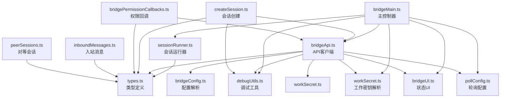
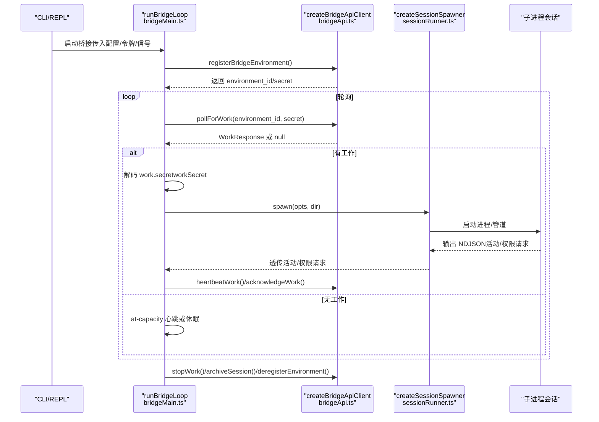
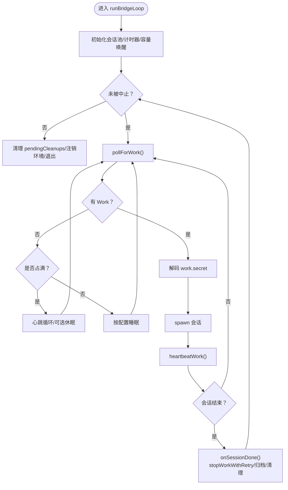
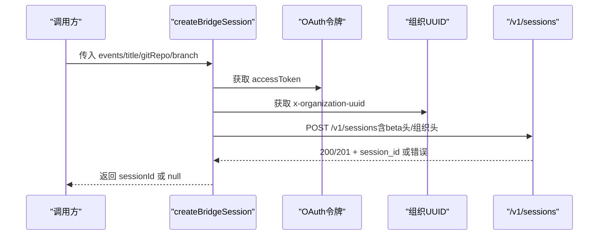
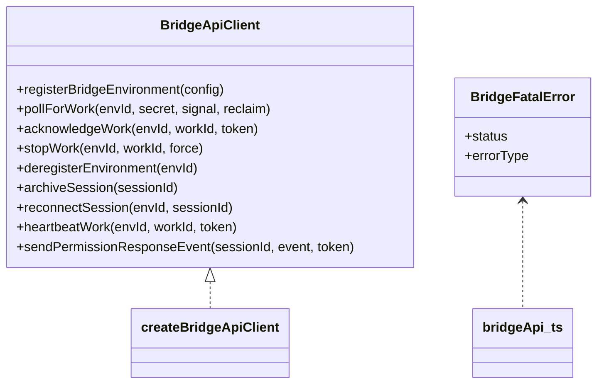
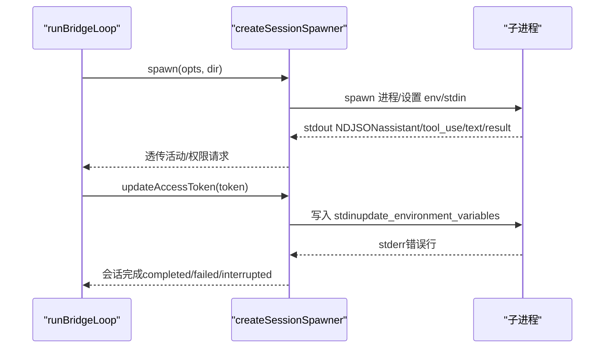
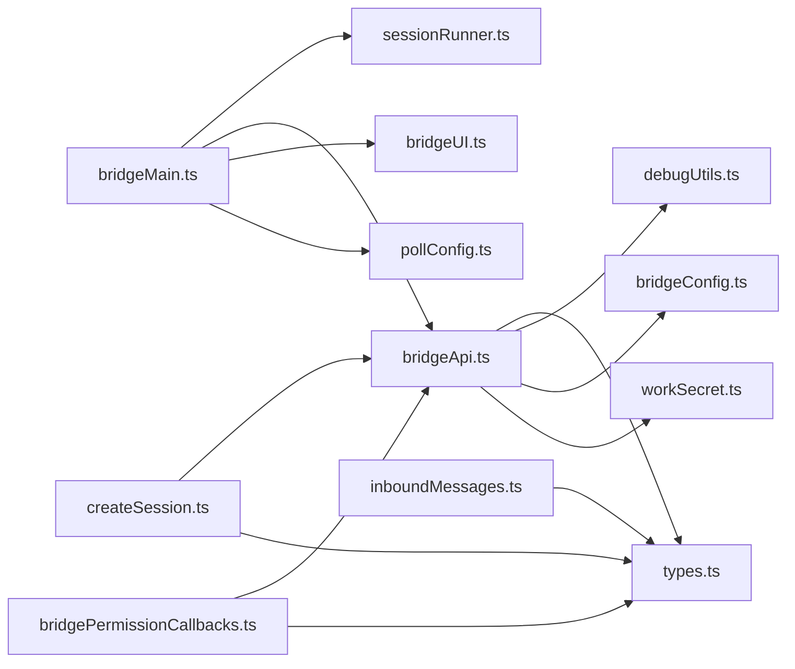

# 桥接系统

<cite>
**本文引用的文件**
- [bridgeMain.ts](file://src/bridge/bridgeMain.ts)
- [createSession.ts](file://src/bridge/createSession.ts)
- [peerSessions.ts](file://src/bridge/peerSessions.ts)
- [bridgeApi.ts](file://src/bridge/bridgeApi.ts)
- [bridgePermissionCallbacks.ts](file://src/bridge/bridgePermissionCallbacks.ts)
- [types.ts](file://src/bridge/types.ts)
- [sessionRunner.ts](file://src/bridge/sessionRunner.ts)
- [bridgeConfig.ts](file://src/bridge/bridgeConfig.ts)
- [bridgeUI.ts](file://src/bridge/bridgeUI.ts)
- [workSecret.ts](file://src/bridge/workSecret.ts)
- [bridgeStatusUtil.ts](file://src/bridge/bridgeStatusUtil.ts)
- [inboundMessages.ts](file://src/bridge/inboundMessages.ts)
- [pollConfig.ts](file://src/bridge/pollConfig.ts)
- [debugUtils.ts](file://src/bridge/debugUtils.ts)
</cite>

## 目录
1. [简介](#简介)
2. [项目结构](#项目结构)
3. [核心组件](#核心组件)
4. [架构总览](#架构总览)
5. [详细组件分析](#详细组件分析)
6. [依赖关系分析](#依赖关系分析)
7. [性能考量](#性能考量)
8. [故障排查指南](#故障排查指南)
9. [结论](#结论)
10. [附录](#附录)

## 简介
本文件为桥接系统的深度技术文档，聚焦于以下关键主题：
- 主控制器 bridgeMain.ts 的运行循环与会话生命周期管理
- 会话创建流程 createSession.ts 的 API 调用与上下文构建
- 对等会话管理 peerSessions.ts 的扩展点与现状
- 桥接 API 接口 bridgeApi.ts 的认证、重试、心跳与事件发送机制
- 权限回调 bridgePermissionCallbacks.ts 的请求/响应模型
- 配置管理 bridgeConfig.ts、轮询配置 pollConfig.ts、UI 展示 bridgeUI.ts、工作密钥解析 workSecret.ts、调试工具 debugUtils.ts 的协作
- 错误处理策略、消息协议、安全机制与性能优化建议

## 项目结构
桥接系统位于 src/bridge 目录下，围绕“环境注册—轮询—会话创建/复用—子进程会话—心跳/权限—归档/注销”的闭环展开。主要模块职责如下：
- 运行时控制：bridgeMain.ts（主循环、会话池、心跳、容量唤醒）
- 会话生命周期：sessionRunner.ts（子进程 spawn、活动解析、权限请求转发）
- API 客户端：bridgeApi.ts（环境/会话 API、权限事件、心跳、重试）
- 会话创建：createSession.ts（POST /sessions、GET /sessions、PATCH /sessions、POST /sessions/{id}/archive）
- 权限回调：bridgePermissionCallbacks.ts（请求/响应类型与校验）
- 类型定义：types.ts（WorkResponse、SessionHandle、BridgeApiClient 等）
- 配置与工具：bridgeConfig.ts、pollConfig.ts、bridgeUI.ts、workSecret.ts、bridgeStatusUtil.ts、debugUtils.ts、inboundMessages.ts、peerSessions.ts

图表来源
- [bridgeMain.ts:141-800](file://src/bridge/bridgeMain.ts#L141-L800)
- [bridgeApi.ts:68-452](file://src/bridge/bridgeApi.ts#L68-L452)
- [sessionRunner.ts:248-548](file://src/bridge/sessionRunner.ts#L248-L548)
- [createSession.ts:34-180](file://src/bridge/createSession.ts#L34-L180)
- [bridgePermissionCallbacks.ts:10-44](file://src/bridge/bridgePermissionCallbacks.ts#L10-L44)
- [types.ts:133-263](file://src/bridge/types.ts#L133-L263)
- [pollConfig.ts:102-111](file://src/bridge/pollConfig.ts#L102-L111)
- [workSecret.ts:6-32](file://src/bridge/workSecret.ts#L6-L32)
- [debugUtils.ts:1-142](file://src/bridge/debugUtils.ts#L1-L142)
- [bridgeUI.ts:294-531](file://src/bridge/bridgeUI.ts#L294-L531)
- [bridgeConfig.ts:38-49](file://src/bridge/bridgeConfig.ts#L38-L49)
- [inboundMessages.ts:21-81](file://src/bridge/inboundMessages.ts#L21-L81)
- [peerSessions.ts:1-4](file://src/bridge/peerSessions.ts#L1-L4)

章节来源
- [bridgeMain.ts:141-800](file://src/bridge/bridgeMain.ts#L141-L800)
- [bridgeApi.ts:68-452](file://src/bridge/bridgeApi.ts#L68-L452)
- [sessionRunner.ts:248-548](file://src/bridge/sessionRunner.ts#L248-L548)
- [createSession.ts:34-180](file://src/bridge/createSession.ts#L34-L180)
- [bridgePermissionCallbacks.ts:10-44](file://src/bridge/bridgePermissionCallbacks.ts#L10-L44)
- [types.ts:133-263](file://src/bridge/types.ts#L133-L263)
- [pollConfig.ts:102-111](file://src/bridge/pollConfig.ts#L102-L111)
- [workSecret.ts:6-32](file://src/bridge/workSecret.ts#L6-L32)
- [debugUtils.ts:1-142](file://src/bridge/debugUtils.ts#L1-L142)
- [bridgeUI.ts:294-531](file://src/bridge/bridgeUI.ts#L294-L531)
- [bridgeConfig.ts:38-49](file://src/bridge/bridgeConfig.ts#L38-L49)
- [inboundMessages.ts:21-81](file://src/bridge/inboundMessages.ts#L21-L81)
- [peerSessions.ts:1-4](file://src/bridge/peerSessions.ts#L1-L4)

## 核心组件
- 主控制器 runBridgeLoop：维护会话映射、心跳、令牌刷新、容量唤醒、日志与 UI 更新、完成清理与归档、单/多会话生命周期耦合
- 会话运行器 createSessionSpawner/spawn：子进程 spawn、NDJSON 解析、活动追踪、权限请求转发、stdin/stdout/stderr 管道、令牌热更新
- API 客户端 createBridgeApiClient：环境注册、轮询、确认、停止、注销、会话归档、重连、心跳、权限事件发送；统一 401 刷新与错误分类
- 会话创建 createBridgeSession：组织事件、Git 上下文、模型、权限模式，调用 /v1/sessions 创建会话
- 权限回调接口：定义请求/响应结构与校验，支持取消与订阅
- 类型系统 types.ts：WorkResponse、SessionHandle、BridgeApiClient、权限事件等强类型契约
- 配置与工具：bridgeConfig.ts（令牌/基础地址）、pollConfig.ts（GrowthBook 驱动的轮询参数）、bridgeUI.ts（终端 UI 渲染）、workSecret.ts（解码/SDK URL 构建/兼容 ID）、bridgeStatusUtil.ts（URL 构建/状态标签）、debugUtils.ts（脱敏/截断/错误提取）、inboundMessages.ts（入站消息规范化）

章节来源
- [bridgeMain.ts:141-800](file://src/bridge/bridgeMain.ts#L141-L800)
- [sessionRunner.ts:248-548](file://src/bridge/sessionRunner.ts#L248-L548)
- [bridgeApi.ts:68-452](file://src/bridge/bridgeApi.ts#L68-L452)
- [createSession.ts:34-180](file://src/bridge/createSession.ts#L34-L180)
- [bridgePermissionCallbacks.ts:10-44](file://src/bridge/bridgePermissionCallbacks.ts#L10-L44)
- [types.ts:133-263](file://src/bridge/types.ts#L133-L263)
- [bridgeConfig.ts:38-49](file://src/bridge/bridgeConfig.ts#L38-L49)
- [pollConfig.ts:102-111](file://src/bridge/pollConfig.ts#L102-L111)
- [bridgeUI.ts:294-531](file://src/bridge/bridgeUI.ts#L294-L531)
- [workSecret.ts:6-32](file://src/bridge/workSecret.ts#L6-L32)
- [bridgeStatusUtil.ts:38-58](file://src/bridge/bridgeStatusUtil.ts#L38-L58)
- [debugUtils.ts:26-53](file://src/bridge/debugUtils.ts#L26-L53)
- [inboundMessages.ts:21-81](file://src/bridge/inboundMessages.ts#L21-L81)

## 架构总览
桥接系统采用“主循环驱动 + 子进程会话 + 服务端 API 协作”的架构。主循环负责环境级任务（轮询、心跳、容量管理），会话层负责具体任务执行（工具调用、权限决策、结果回传）。

图表来源
- [bridgeMain.ts:141-800](file://src/bridge/bridgeMain.ts#L141-L800)
- [bridgeApi.ts:141-451](file://src/bridge/bridgeApi.ts#L141-L451)
- [sessionRunner.ts:248-548](file://src/bridge/sessionRunner.ts#L248-L548)
- [workSecret.ts:6-32](file://src/bridge/workSecret.ts#L6-L32)

## 详细组件分析

### 主控制器 runBridgeLoop（bridgeMain.ts）
- 会话池与状态：使用 Map 维护 sessionId→handle、开始时间、workId、兼容 ID、会话令牌、定时器、已完成 workId、worktree 信息、超时标记、标题集合、容量唤醒
- 心跳策略：heartbeatActiveWorkItems 对所有活跃 work 执行心跳，区分“成功/鉴权失败/致命错误”，鉴权失败触发 reconnectSession 并记录事件
- 令牌刷新：通过 tokenRefresh 调度器在 OAuth 令牌到期前 5 分钟触发 onRefresh，v2 通过 reconnectSession 触发服务端重新派发，v1 直接更新 handle.accessToken
- 轮询与退避：根据 GrowthBook 配置动态调整空闲/占满/部分占满的轮询间隔；检测系统休眠以避免误判
- 生命周期：onSessionDone 清理计时器/令牌刷新、移除 UI、停止状态更新、调用 stopWorkWithRetry、清理 worktree、多会话模式归档、单会话模式终止轮询
- UI 与日志：start/stopStatusUpdates、updateStatusDisplay、setAttached/setSessionTitle 等，配合 bridgeUI.ts 实时渲染

图表来源
- [bridgeMain.ts:141-800](file://src/bridge/bridgeMain.ts#L141-L800)
- [pollConfig.ts:102-111](file://src/bridge/pollConfig.ts#L102-L111)
- [bridgeUI.ts:294-531](file://src/bridge/bridgeUI.ts#L294-L531)

章节来源
- [bridgeMain.ts:141-800](file://src/bridge/bridgeMain.ts#L141-L800)
- [pollConfig.ts:102-111](file://src/bridge/pollConfig.ts#L102-L111)
- [bridgeUI.ts:294-531](file://src/bridge/bridgeUI.ts#L294-L531)

### 会话创建流程 createBridgeSession（createSession.ts）
- 认证与组织：从 getClaudeAIOAuthTokens 获取访问令牌，从 getOrganizationUUID 获取组织 UUID，构造带 org 头部的请求
- Git 上下文：解析仓库 URL/分支，生成 sources/outcomes（GitHub 仓库、分支列表），默认模型来自 getMainLoopModel
- 请求体：包含 title、events、session_context（sources/outcomes/model）、environment_id、source、permission_mode
- 响应处理：返回 200/201 时提取 session_id，否则记录错误详情并返回 null
- 其他操作：getBridgeSession（查询环境_id/标题）、archiveBridgeSession（归档）、updateBridgeSessionTitle（标题同步）

图表来源
- [createSession.ts:34-180](file://src/bridge/createSession.ts#L34-L180)
- [createSession.ts:190-244](file://src/bridge/createSession.ts#L190-L244)
- [createSession.ts:263-317](file://src/bridge/createSession.ts#L263-L317)
- [createSession.ts:327-384](file://src/bridge/createSession.ts#L327-L384)

章节来源
- [createSession.ts:34-180](file://src/bridge/createSession.ts#L34-L180)
- [createSession.ts:190-244](file://src/bridge/createSession.ts#L190-L244)
- [createSession.ts:263-317](file://src/bridge/createSession.ts#L263-L317)
- [createSession.ts:327-384](file://src/bridge/createSession.ts#L327-L384)

### 对等会话管理 peerSessions（peerSessions.ts）
- 当前实现：提供 listPeerSessions 空实现，作为未来扩展点预留
- 建议：若引入对等节点发现/管理，可在该模块扩展

章节来源
- [peerSessions.ts:1-4](file://src/bridge/peerSessions.ts#L1-L4)

### 桥接 API 接口 bridgeApi.ts
- 客户端工厂：createBridgeApiClient 注入 baseUrl/getAccessToken/runnerVersion/onDebug/onAuth401/getTrustedDeviceToken
- 认证与重试：withOAuthRetry 在 401 时尝试刷新并重试一次；handleErrorStatus 将常见状态转换为 BridgeFatalError 或普通 Error
- 核心方法：
  - registerBridgeEnvironment：注册/重连环境，携带 max_sessions/metadata
  - pollForWork：轮询工作项，支持 reclaim_older_than_ms
  - acknowledgeWork/stopWork/deregisterEnvironment
  - archiveSession/reconnectSession（用于 v2 令牌刷新触发重新派发）
  - heartbeatWork（会话级 JWT 心跳）
  - sendPermissionResponseEvent（向会话发送 control_response 事件）
- 安全与校验：validateBridgeId 对路径段 ID 做安全校验；getHeaders 注入信任设备令牌头

图表来源
- [bridgeApi.ts:68-452](file://src/bridge/bridgeApi.ts#L68-L452)
- [types.ts:133-176](file://src/bridge/types.ts#L133-L176)

章节来源
- [bridgeApi.ts:68-452](file://src/bridge/bridgeApi.ts#L68-L452)
- [types.ts:133-176](file://src/bridge/types.ts#L133-L176)

### 权限回调机制 bridgePermissionCallbacks.ts
- 结构：BridgePermissionCallbacks 定义 sendRequest/sendResponse/cancelRequest/onResponse 回调签名
- 校验：isBridgePermissionResponse 对 control_response 负载进行类型守卫
- 与 API 协作：通过 sendPermissionResponseEvent 将用户决策回传至会话

章节来源
- [bridgePermissionCallbacks.ts:10-44](file://src/bridge/bridgePermissionCallbacks.ts#L10-L44)

### 会话运行器 sessionRunner.ts
- 子进程启动：拼装 args/env（剥离桥接 OAuth、注入会话访问令牌、v1/v2 传输开关），管道 stdio
- 活动解析：从 stdout NDJSON 解析 assistant/tool_use/text/result，维护最近活动环形缓冲区
- 权限请求：检测 control_request 并转发给 onPermissionRequest
- 用户消息：通过 replay-user-messages 捕获首个真实用户消息，触发 onFirstUserMessage
- 令牌热更新：通过 stdin 发送 update_environment_variables，子进程刷新会话令牌
- 结束处理：根据 close 信号/退出码判定 completed/failed/interrupted

图表来源
- [sessionRunner.ts:248-548](file://src/bridge/sessionRunner.ts#L248-L548)
- [bridgeMain.ts:284-313](file://src/bridge/bridgeMain.ts#L284-L313)

章节来源
- [sessionRunner.ts:248-548](file://src/bridge/sessionRunner.ts#L248-L548)
- [bridgeMain.ts:284-313](file://src/bridge/bridgeMain.ts#L284-L313)

### 配置与工具
- 桥接配置 bridgeConfig.ts：优先 dev override（ANT 专用），否则使用 OAuth 存储；提供 base URL/令牌解析
- 轮询配置 pollConfig.ts：基于 GrowthBook 的 Zod Schema 校验，提供默认值与边界约束，确保 at-capacity 保活机制至少启用一项
- 工作密钥 workSecret.ts：解码 base64url 的 work.secret，构建 SDK URL（v1/v2），比较兼容 ID
- 状态工具 bridgeStatusUtil.ts：构建连接/会话 URL、状态标签、提示文本、链接包装
- 调试工具 debugUtils.ts：脱敏/截断/错误细节提取/Analytics 日志
- 入站消息 inboundMessages.ts：规范化图像块字段（media_type），提升跨客户端兼容性

章节来源
- [bridgeConfig.ts:38-49](file://src/bridge/bridgeConfig.ts#L38-L49)
- [pollConfig.ts:28-92](file://src/bridge/pollConfig.ts#L28-L92)
- [workSecret.ts:6-32](file://src/bridge/workSecret.ts#L6-L32)
- [bridgeStatusUtil.ts:38-58](file://src/bridge/bridgeStatusUtil.ts#L38-L58)
- [debugUtils.ts:26-53](file://src/bridge/debugUtils.ts#L26-L53)
- [inboundMessages.ts:21-81](file://src/bridge/inboundMessages.ts#L21-L81)

## 依赖关系分析
- 模块内聚与耦合
  - bridgeMain.ts 与 sessionRunner.ts 通过 SessionHandle 接口耦合，前者负责调度，后者负责执行
  - bridgeApi.ts 与 types.ts 强耦合，API 方法签名由类型定义约束
  - bridgeUI.ts 与 bridgeStatusUtil.ts 协作渲染状态与 URL
  - createSession.ts 与 bridgeApi.ts 交互，但不直接依赖 bridgeMain.ts
- 外部依赖
  - axios 用于 HTTP 请求
  - child_process 用于子进程管理
  - qrcode 用于 QR 生成
  - zod 用于轮询配置校验
- 循环依赖风险
  - 未见直接循环依赖；API 客户端仅依赖类型与工具函数，不反向依赖主控制器

图表来源
- [bridgeMain.ts:141-800](file://src/bridge/bridgeMain.ts#L141-L800)
- [bridgeApi.ts:68-452](file://src/bridge/bridgeApi.ts#L68-L452)
- [sessionRunner.ts:248-548](file://src/bridge/sessionRunner.ts#L248-L548)
- [createSession.ts:34-180](file://src/bridge/createSession.ts#L34-L180)
- [bridgePermissionCallbacks.ts:10-44](file://src/bridge/bridgePermissionCallbacks.ts#L10-L44)
- [types.ts:133-263](file://src/bridge/types.ts#L133-L263)
- [pollConfig.ts:102-111](file://src/bridge/pollConfig.ts#L102-L111)
- [debugUtils.ts:1-142](file://src/bridge/debugUtils.ts#L1-142)
- [bridgeConfig.ts:38-49](file://src/bridge/bridgeConfig.ts#L38-L49)
- [workSecret.ts:6-32](file://src/bridge/workSecret.ts#L6-L32)
- [inboundMessages.ts:21-81](file://src/bridge/inboundMessages.ts#L21-L81)

章节来源
- [bridgeMain.ts:141-800](file://src/bridge/bridgeMain.ts#L141-L800)
- [bridgeApi.ts:68-452](file://src/bridge/bridgeApi.ts#L68-L452)
- [sessionRunner.ts:248-548](file://src/bridge/sessionRunner.ts#L248-L548)
- [createSession.ts:34-180](file://src/bridge/createSession.ts#L34-L180)
- [bridgePermissionCallbacks.ts:10-44](file://src/bridge/bridgePermissionCallbacks.ts#L10-L44)
- [types.ts:133-263](file://src/bridge/types.ts#L133-L263)
- [pollConfig.ts:102-111](file://src/bridge/pollConfig.ts#L102-L111)
- [debugUtils.ts:1-142](file://src/bridge/debugUtils.ts#L1-142)
- [bridgeConfig.ts:38-49](file://src/bridge/bridgeConfig.ts#L38-L49)
- [workSecret.ts:6-32](file://src/bridge/workSecret.ts#L6-L32)
- [inboundMessages.ts:21-81](file://src/bridge/inboundMessages.ts#L21-L81)

## 性能考量
- 轮询节流：通过 GrowthBook 配置化控制空闲/占满/部分占满的轮询间隔，避免过度轮询
- 心跳保活：在占满状态下启用非独占心跳，减少阻塞；结合容量唤醒快速承接新任务
- 令牌预刷新：OAuth 令牌到期前 5 分钟触发刷新，v2 通过 reconnectSession 触发服务端重新派发，避免无声死亡
- I/O 优化：NDJSON 流式解析、环形缓冲区限制活动数量、stderr 行数限制、转录文件异步写入
- 资源回收：会话完成后及时 stopWork、移除 worktree、清理定时器与刷新计划，避免资源泄漏

## 故障排查指南
- 常见错误与处理
  - 401/403：通过 withOAuthRetry 尝试刷新；若失败抛出 BridgeFatalError，需登录或检查权限
  - 404/410：环境过期或不存在，需重启桥接或重新注册
  - 429：轮询过于频繁，降低轮询频率
  - 空闲日志：bridgeApi.ts 对连续空轮询进行节流日志，避免噪声
- 调试与脱敏
  - 使用 debugUtils.redactSecrets 脱敏敏感字段，debugBody 截断长消息
  - 通过 bridgeUI.ts 的 verbose 模式输出详细日志与 QR 码
- 会话异常
  - 检查 sessionRunner.ts stderr 缓冲区与 lastStderr，定位子进程错误
  - 使用 archiveBridgeSession 归档异常会话，避免前端显示为活跃

章节来源
- [bridgeApi.ts:454-500](file://src/bridge/bridgeApi.ts#L454-L500)
- [debugUtils.ts:26-53](file://src/bridge/debugUtils.ts#L26-L53)
- [sessionRunner.ts:352-366](file://src/bridge/sessionRunner.ts#L352-L366)
- [createSession.ts:263-317](file://src/bridge/createSession.ts#L263-L317)

## 结论
桥接系统通过主控制器的高内聚调度、会话运行器的低耦合执行、API 客户端的强类型契约与严格的错误处理，实现了稳定高效的远程会话管理。配合配置化轮询、令牌预刷新与 UI 友好的状态反馈，系统在复杂网络环境下仍能保持可靠与可观测性。建议在生产环境中启用调试日志与容量唤醒，并定期审查轮询配置与权限策略。

## 附录
- 建立与管理远程会话的实际步骤
  1) 注册环境：调用 registerBridgeEnvironment 获取 environment_id/secret
  2) 轮询工作：pollForWork 获取 WorkResponse
  3) 解码密钥：decodeWorkSecret 提取会话入口令牌与 API 基础 URL
  4) 创建会话：createBridgeSession 发起 /v1/sessions
  5) 启动子进程：createSessionSpawner.spawn 启动会话
  6) 心跳与权限：heartbeatWork/权限事件回传
  7) 结束与归档：stopWork/archiveSession/deregisterEnvironment

章节来源
- [bridgeApi.ts:141-451](file://src/bridge/bridgeApi.ts#L141-L451)
- [workSecret.ts:6-32](file://src/bridge/workSecret.ts#L6-L32)
- [createSession.ts:34-180](file://src/bridge/createSession.ts#L34-L180)
- [sessionRunner.ts:248-548](file://src/bridge/sessionRunner.ts#L248-L548)
- [bridgeMain.ts:141-800](file://src/bridge/bridgeMain.ts#L141-L800)