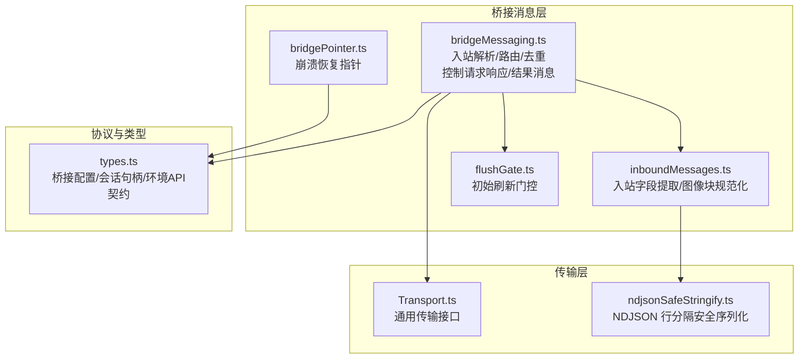
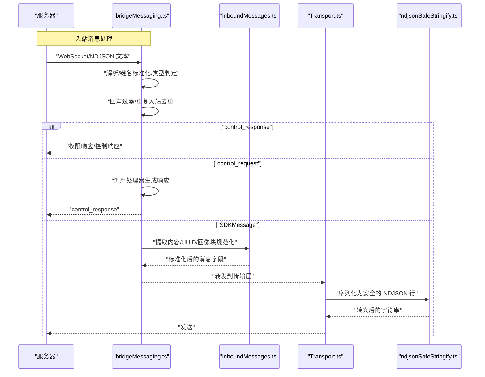
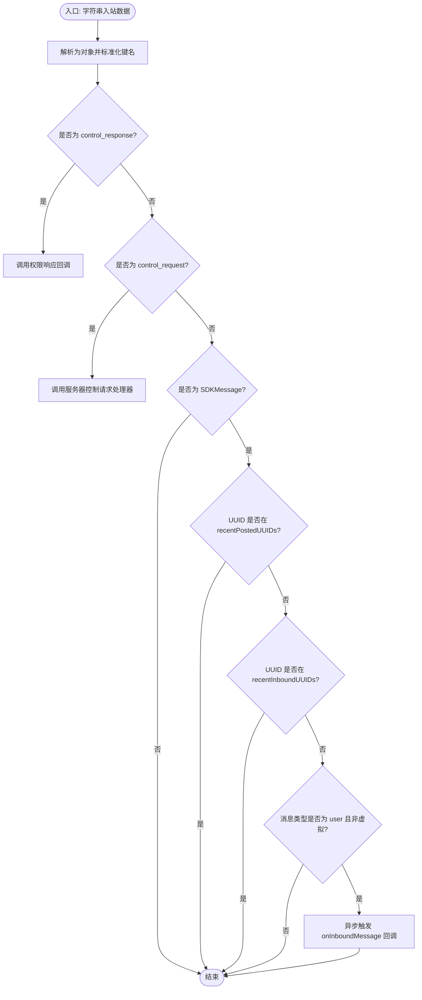
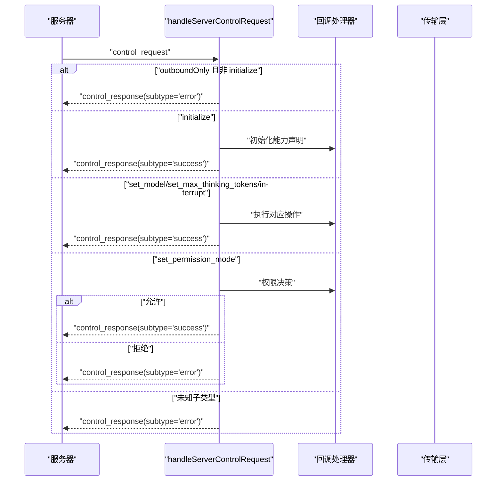
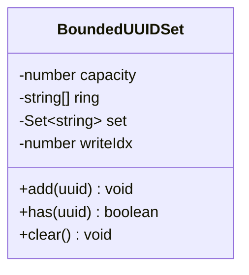
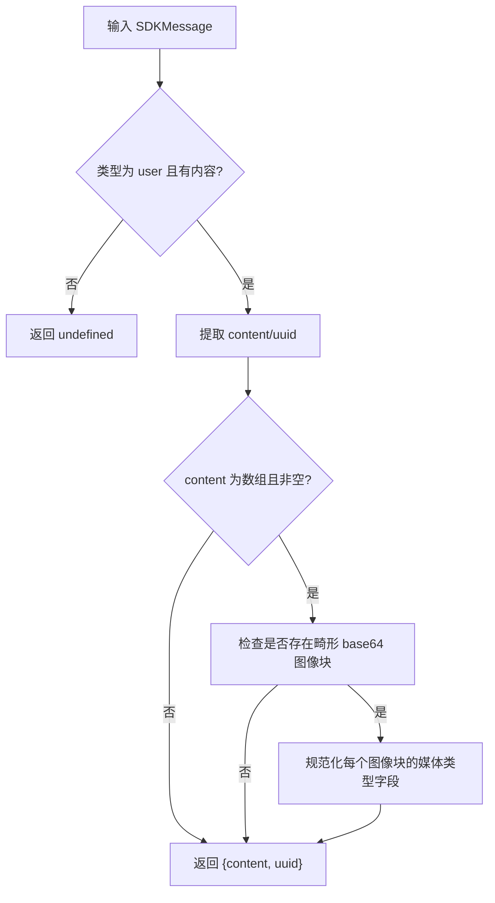
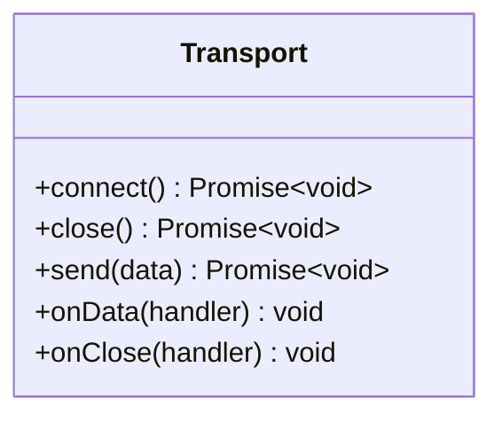
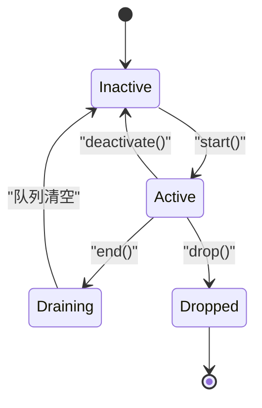
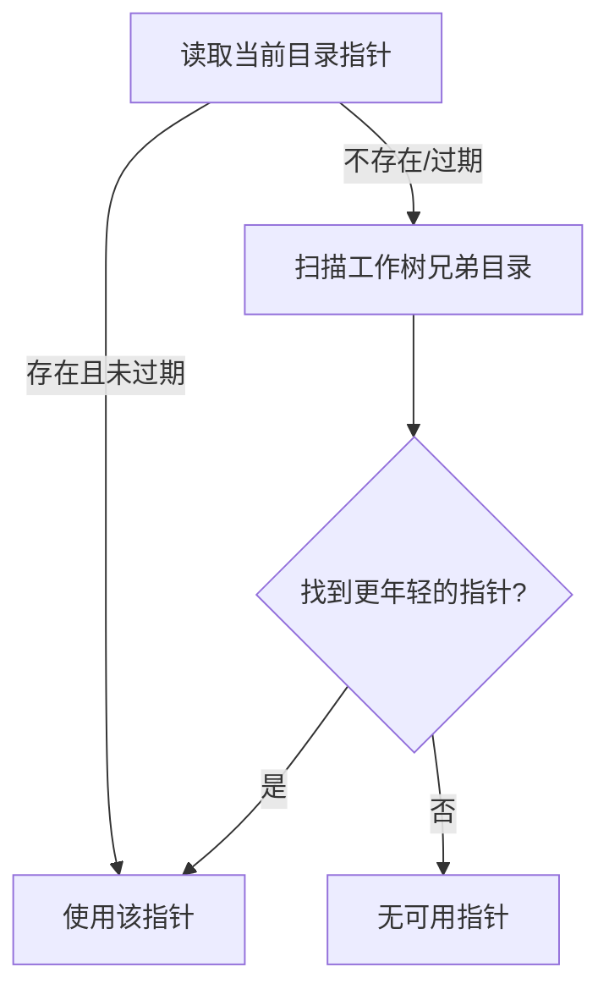
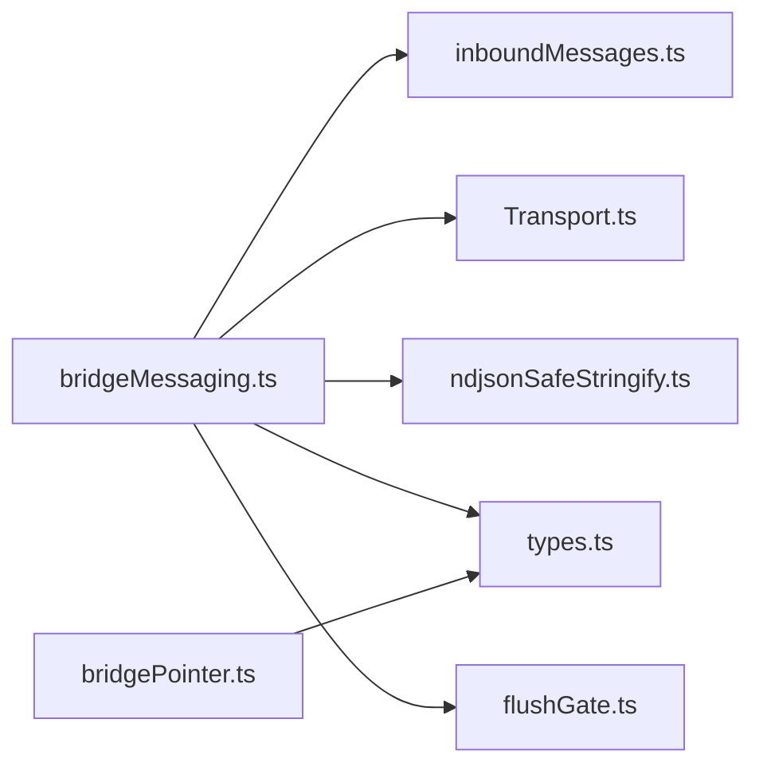

# 消息传递

<cite>
**本文引用的文件**
- [bridgeMessaging.ts](file://src/bridge/bridgeMessaging.ts)
- [types.ts](file://src/bridge/types.ts)
- [inboundMessages.ts](file://src/bridge/inboundMessages.ts)
- [bridgePointer.ts](file://src/bridge/bridgePointer.ts)
- [flushGate.ts](file://src/bridge/flushGate.ts)
- [ndjsonSafeStringify.ts](file://src/cli/ndjsonSafeStringify.ts)
- [Transport.ts](file://src/cli/transports/Transport.ts)
</cite>

## 目录
1. [简介](#简介)
2. [项目结构](#项目结构)
3. [核心组件](#核心组件)
4. [架构总览](#架构总览)
5. [详细组件分析](#详细组件分析)
6. [依赖关系分析](#依赖关系分析)
7. [性能考量](#性能考量)
8. [故障排查指南](#故障排查指南)
9. [结论](#结论)
10. [附录](#附录)

## 简介
本文件围绕桥接消息系统进行深入技术文档化，重点解析 bridgeMessaging.ts 中的消息路由机制、消息格式与传输协议、入站消息处理流程、出站消息发送机制、消息指针管理与消息队列控制，并阐述消息序列化/反序列化、消息确认与重传策略、异常处理与性能优化、可靠性保障与故障恢复。文档同时提供可视化图示与代码路径引用，帮助读者快速定位实现细节。

## 项目结构
消息传递系统主要由以下模块构成：
- 入口与路由：bridgeMessaging.ts 提供入站消息解析、类型判定、去重与路由；出站控制请求响应；结果归档消息构造；以及环形去重集合。
- 消息提取与规范化：inboundMessages.ts 负责从入站用户消息中抽取内容与 UUID，并对图像块进行跨客户端兼容性规范化。
- 传输抽象：Transport.ts 定义通用传输接口（连接、关闭、发送、数据回调、关闭回调）。
- 序列化工具：ndjsonSafeStringify.ts 对 JSON 输出进行行分隔安全转义，避免在单行 NDJSON 流中被错误切分。
- 队列与门控：flushGate.ts 提供初始历史消息刷新期间的写入门控，确保历史消息与新消息不交错。
- 指针与会话状态：bridgePointer.ts 提供崩溃恢复指针（bridge-pointer.json），支持跨工作树扫描与刷新 TTL。
- 类型与协议：types.ts 定义桥接配置、会话句柄、环境 API 客户端等类型契约，为消息系统提供协议边界。

**图表来源**
- [bridgeMessaging.ts](file://src/bridge/bridgeMessaging.ts)
- [inboundMessages.ts](file://src/bridge/inboundMessages.ts)
- [flushGate.ts](file://src/bridge/flushGate.ts)
- [bridgePointer.ts](file://src/bridge/bridgePointer.ts)
- [Transport.ts](file://src/cli/transports/Transport.ts)
- [ndjsonSafeStringify.ts](file://src/cli/ndjsonSafeStringify.ts)
- [types.ts](file://src/bridge/types.ts)

**章节来源**
- [bridgeMessaging.ts](file://src/bridge/bridgeMessaging.ts)
- [inboundMessages.ts](file://src/bridge/inboundMessages.ts)
- [Transport.ts](file://src/cli/transports/Transport.ts)
- [ndjsonSafeStringify.ts](file://src/cli/ndjsonSafeStringify.ts)
- [flushGate.ts](file://src/bridge/flushGate.ts)
- [bridgePointer.ts](file://src/bridge/bridgePointer.ts)
- [types.ts](file://src/bridge/types.ts)

## 核心组件
- 入站消息解析与路由
  - 解析字符串为对象并进行键名标准化，区分 control_response、control_request 与 SDKMessage。
  - 基于 UUID 的回声过滤与重复入站消息去重。
  - 仅转发符合条件的用户消息到上层回调，其他类型忽略。
- 控制请求处理
  - 对服务器发起的控制请求（initialize、set_model、set_max_thinking_tokens、set_permission_mode、interrupt）进行即时响应，超时将导致连接断开。
  - 在“仅出站”模式下拒绝可变请求，返回明确错误。
- 结果消息与会话归档
  - 构造最小化的 SDKResultSuccess 事件，用于会话结束前触发服务端归档。
- 消息指针与持久化
  - 使用 BoundedUUIDSet 维护最近已发出/已入站消息的 UUID，作为二次去重与回声过滤的安全网。
- 图像块规范化
  - 将不同客户端发送的图像块统一为标准字段，修复媒体类型缺失或大小写差异问题。
- 传输与序列化
  - 通过 Transport 接口抽象传输能力；使用 ndjsonSafeStringify 对 JSON 进行行分隔安全转义，防止被按行分割器误切分。

**章节来源**
- [bridgeMessaging.ts](file://src/bridge/bridgeMessaging.ts)
- [inboundMessages.ts](file://src/bridge/inboundMessages.ts)
- [Transport.ts](file://src/cli/transports/Transport.ts)
- [ndjsonSafeStringify.ts](file://src/cli/ndjsonSafeStringify.ts)

## 架构总览
消息传递系统采用“解析—去重—路由—响应—归档”的流水线式处理模型，结合门控队列与崩溃恢复指针，确保消息顺序性、可靠性与可恢复性。

**图表来源**
- [bridgeMessaging.ts](file://src/bridge/bridgeMessaging.ts)
- [inboundMessages.ts](file://src/bridge/inboundMessages.ts)
- [Transport.ts](file://src/cli/transports/Transport.ts)
- [ndjsonSafeStringify.ts](file://src/cli/ndjsonSafeStringify.ts)

## 详细组件分析

### 组件一：入站消息处理与路由（handleIngressMessage）
- 功能要点
  - 解析字符串为对象，标准化控制类消息键名，区分 control_response、control_request 与 SDKMessage。
  - 回声过滤：若 UUID 出现在 recentPostedUUIDs，则直接忽略。
  - 重复入站去重：若 UUID 出现在 recentInboundUUIDs，则忽略以避免历史重放导致的重复处理。
  - 仅当消息类型为 user 且非虚拟消息时才转发给上层回调；其他类型（如 assistant、system 非本地命令、工具结果等）忽略。
  - 异常捕获：解析失败时记录调试日志。
- 复杂度与性能
  - 解析与去重均为 O(1)，整体 O(n) 处理 n 条入站消息。
  - BoundedUUIDSet 使用环形缓冲区与哈希集合，内存占用恒定 O(C)。
- 可靠性与容错
  - 防御式去重与回声过滤降低网络抖动与重连导致的重复风险。
  - 严格类型守卫避免错误消息进入后续处理链。

**图表来源**
- [bridgeMessaging.ts](file://src/bridge/bridgeMessaging.ts)

**章节来源**
- [bridgeMessaging.ts](file://src/bridge/bridgeMessaging.ts)

### 组件二：服务器控制请求处理（handleServerControlRequest）
- 功能要点
  - 支持 initialize、set_model、set_max_thinking_tokens、set_permission_mode、interrupt 等子类型。
  - outboundOnly 模式下拒绝除 initialize 外的可变请求，返回明确错误信息。
  - 未配置传输时记录告警并跳过响应。
  - 未知子类型立即返回错误，避免服务器挂起。
- 处理流程
  - 根据子类型执行对应回调（如中断、设置模型、设置最大思考令牌、设置权限模式）。
  - 构造 control_response 并通过传输层写出。
- 错误处理
  - 缺失回调上下文时返回错误而非静默失败，保证客户端得到真实状态。

**图表来源**
- [bridgeMessaging.ts](file://src/bridge/bridgeMessaging.ts)

**章节来源**
- [bridgeMessaging.ts](file://src/bridge/bridgeMessaging.ts)

### 组件三：消息指针管理（BoundedUUIDSet）
- 数据结构
  - 环形缓冲区 + 哈希集合，容量固定为 O(C)。
- 操作复杂度
  - add/has/clear 均为 O(1)。
- 用途
  - 作为回声过滤与重复入站去重的第二道防线，弥补外部索引排序的不足。
- 边界条件
  - 写入位置到达环尾后循环回到开头，最旧元素被覆盖。

**图表来源**
- [bridgeMessaging.ts](file://src/bridge/bridgeMessaging.ts)

**章节来源**
- [bridgeMessaging.ts](file://src/bridge/bridgeMessaging.ts)

### 组件四：入站消息字段提取与图像块规范化（extractInboundMessageFields / normalizeImageBlocks）
- 功能要点
  - 从 SDKMessage 中提取 content 与 uuid，支持字符串与内容块数组两种形式。
  - 对图像块进行跨客户端兼容性规范化：统一媒体类型字段命名与默认推断。
- 性能特性
  - 快速路径扫描：若无畸形图像块则直接返回原数组引用，零分配。
  - 归一化时按需复制并修正字段，避免污染后续调用。

**图表来源**
- [inboundMessages.ts](file://src/bridge/inboundMessages.ts)

**章节来源**
- [inboundMessages.ts](file://src/bridge/inboundMessages.ts)

### 组件五：传输与序列化（Transport 接口与 NDJSON 安全序列化）
- 传输接口
  - Transport.ts 定义了 connect/close/send/onData/onClose 等方法，便于替换不同传输实现（WebSocket、HTTP/NDJSON 等）。
- 序列化安全
  - ndjsonSafeStringify.ts 将 U+2028/2029 转义为 Unicode 转义序列，避免被按行分割器误切分，保证单条消息完整性。

**图表来源**
- [Transport.ts](file://src/cli/transports/Transport.ts)

**章节来源**
- [Transport.ts](file://src/cli/transports/Transport.ts)
- [ndjsonSafeStringify.ts](file://src/cli/ndjsonSafeStringify.ts)

### 组件六：初始刷新门控（FlushGate）
- 作用
  - 在会话启动时的历史消息批量刷新期间，阻止新消息写入，避免与历史消息交错。
- 生命周期
  - start() 启动门控，enqueue() 返回 true 并排队；end() 关闭门控并返回待刷队列；deactivate() 清空活动标志但保留队列（用于传输替换场景）；drop() 永久丢弃队列。
- 适用场景
  - 初始历史消息通过一次 HTTP POST 刷新至服务器，期间所有新消息必须排队等待。

**图表来源**
- [flushGate.ts](file://src/bridge/flushGate.ts)

**章节来源**
- [flushGate.ts](file://src/bridge/flushGate.ts)

### 组件七：崩溃恢复指针（bridgePointer）
- 作用
  - 记录当前会话的 sessionId 与 environmentId，支持进程崩溃后恢复；定期刷新以匹配后端滚动 TTL。
- 跨工作树扫描
  - 在多工作树环境下并行扫描候选目录，选择最新（最年轻）的指针恢复。
- 容错与清理
  - 读取失败、模式不匹配或过期（>4h）均删除指针，避免误导恢复。

**图表来源**
- [bridgePointer.ts](file://src/bridge/bridgePointer.ts)

**章节来源**
- [bridgePointer.ts](file://src/bridge/bridgePointer.ts)

## 依赖关系分析
- 组件耦合
  - bridgeMessaging.ts 依赖 inboundMessages.ts（图像块规范化）、Transport.ts（传输写出）、ndjsonSafeStringify.ts（序列化）、types.ts（协议类型）。
  - flushGate.ts 与 bridgeMessaging.ts 协同控制初始刷新期间的写入节奏。
  - bridgePointer.ts 与 types.ts 协作提供会话状态持久化与恢复。
- 外部依赖
  - JSON 解析与字符串化来自 utils/slowOperations.js（通过 jsonParse/jsonStringify 包装）。
  - 日志与调试通过 logForDebugging 与 analytics/logEvent 输出。

**图表来源**
- [bridgeMessaging.ts](file://src/bridge/bridgeMessaging.ts)
- [inboundMessages.ts](file://src/bridge/inboundMessages.ts)
- [Transport.ts](file://src/cli/transports/Transport.ts)
- [ndjsonSafeStringify.ts](file://src/cli/ndjsonSafeStringify.ts)
- [flushGate.ts](file://src/bridge/flushGate.ts)
- [bridgePointer.ts](file://src/bridge/bridgePointer.ts)
- [types.ts](file://src/bridge/types.ts)

**章节来源**
- [bridgeMessaging.ts](file://src/bridge/bridgeMessaging.ts)
- [inboundMessages.ts](file://src/bridge/inboundMessages.ts)
- [Transport.ts](file://src/cli/transports/Transport.ts)
- [ndjsonSafeStringify.ts](file://src/cli/ndjsonSafeStringify.ts)
- [flushGate.ts](file://src/bridge/flushGate.ts)
- [bridgePointer.ts](file://src/bridge/bridgePointer.ts)
- [types.ts](file://src/bridge/types.ts)

## 性能考量
- 解析与去重
  - 使用 BoundedUUIDSet 实现 O(1) 去重与回声过滤，内存占用恒定，适合高吞吐场景。
- 序列化安全
  - ndjsonSafeStringify 避免行分隔切分带来的消息丢失与重试风暴，提升传输稳定性。
- 初始刷新门控
  - FlushGate 在历史消息批量刷新期间阻塞新消息写入，减少网络往返与乱序风险。
- 并发与背压
  - 传输层接口支持异步发送与回调注册，配合队列与门控实现平滑背压与有序输出。

[本节为通用性能讨论，无需具体文件引用]

## 故障排查指南
- 入站消息被忽略
  - 检查消息类型是否为 user 且非虚拟；确认 UUID 是否在 recentInboundUUIDs 中；查看解析异常日志。
  - 参考路径：[handleIngressMessage](file://src/bridge/bridgeMessaging.ts)
- 控制请求未响应导致连接断开
  - 确认服务器控制请求处理器已正确注册并能在超时时间内返回响应；检查 outboundOnly 模式下的限制。
  - 参考路径：[handleServerControlRequest](file://src/bridge/bridgeMessaging.ts)
- 图像消息发送失败
  - 检查图像块是否包含正确的媒体类型字段；确保 normalizeImageBlocks 已被调用。
  - 参考路径：[normalizeImageBlocks](file://src/bridge/inboundMessages.ts)
- NDJSON 行切分导致消息丢失
  - 使用 ndjsonSafeStringify 对输出进行行分隔安全转义。
  - 参考路径：[ndjsonSafeStringify](file://src/cli/ndjsonSafeStringify.ts)
- 初始刷新期间消息错序
  - 确保在刷新开始前调用 FlushGate.start()，刷新结束后调用 end() 并顺序发送待刷队列。
  - 参考路径：[FlushGate](file://src/bridge/flushGate.ts)
- 崩溃后无法恢复会话
  - 检查 bridge-pointer.json 是否存在且未过期；必要时跨工作树扫描并选择最新指针。
  - 参考路径：[bridgePointer](file://src/bridge/bridgePointer.ts)

**章节来源**
- [bridgeMessaging.ts](file://src/bridge/bridgeMessaging.ts)
- [inboundMessages.ts](file://src/bridge/inboundMessages.ts)
- [ndjsonSafeStringify.ts](file://src/cli/ndjsonSafeStringify.ts)
- [flushGate.ts](file://src/bridge/flushGate.ts)
- [bridgePointer.ts](file://src/bridge/bridgePointer.ts)

## 结论
本消息传递系统通过严格的入站解析与去重、可控的控制请求响应、安全的序列化与门控队列，实现了高可靠与高性能的消息流转。结合崩溃恢复指针与跨工作树扫描，进一步增强了系统的可恢复性与用户体验。建议在生产环境中持续监控去重命中率、控制请求响应延迟与 NDJSON 安全序列化覆盖率，以维持稳定的服务质量。

[本节为总结性内容，无需具体文件引用]

## 附录
- 示例：发送与接收不同类型消息
  - 发送用户消息：在传输层使用安全序列化后写出；参考 [Transport.ts](file://src/cli/transports/Transport.ts) 与 [ndjsonSafeStringify.ts](file://src/cli/ndjsonSafeStringify.ts)。
  - 接收用户消息：在入站处理中调用 [handleIngressMessage](file://src/bridge/bridgeMessaging.ts)，并通过 [extractInboundMessageFields](file://src/bridge/inboundMessages.ts) 提取内容与 UUID。
- 异常处理最佳实践
  - 使用类型守卫与防御式去重；对解析失败与未知子类型返回明确错误；在 outboundOnly 模式下拒绝不可变请求。
- 性能优化建议
  - 保持 BoundedUUIDSet 容量适中；启用 FlushGate 在历史刷新期间阻塞新消息；对图像块进行快速路径判断避免不必要的复制。

[本节为概念性补充，无需具体文件引用]