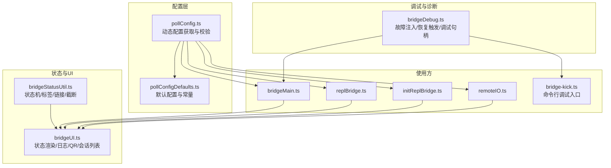
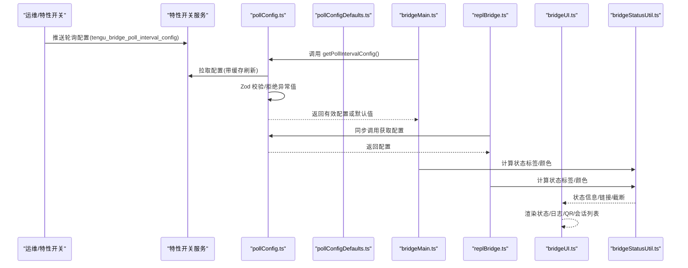
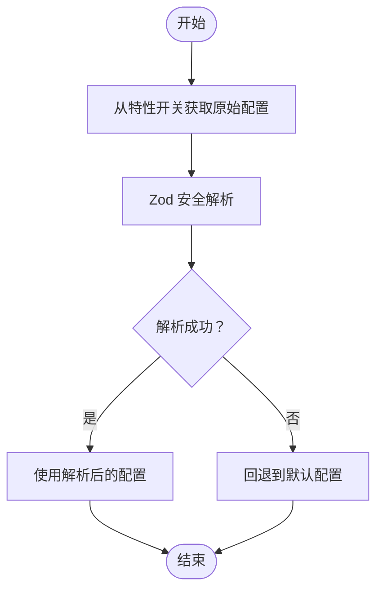
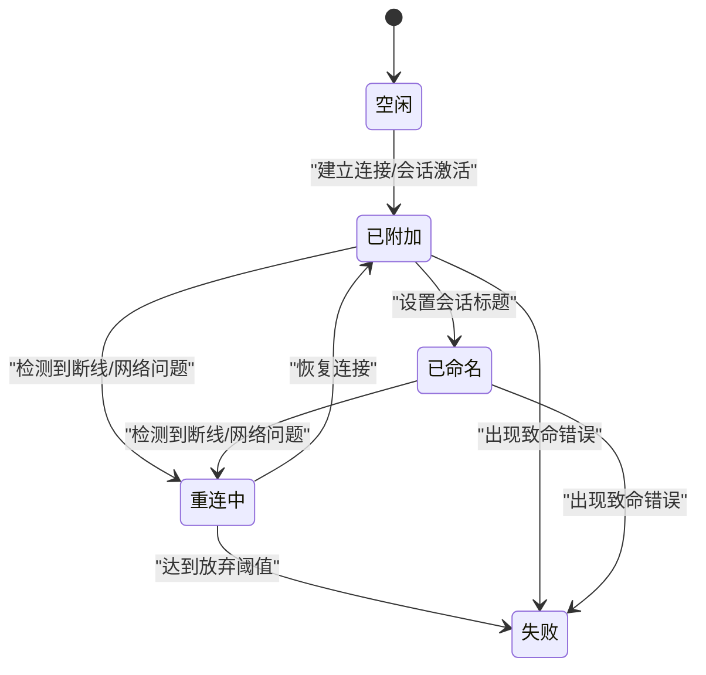
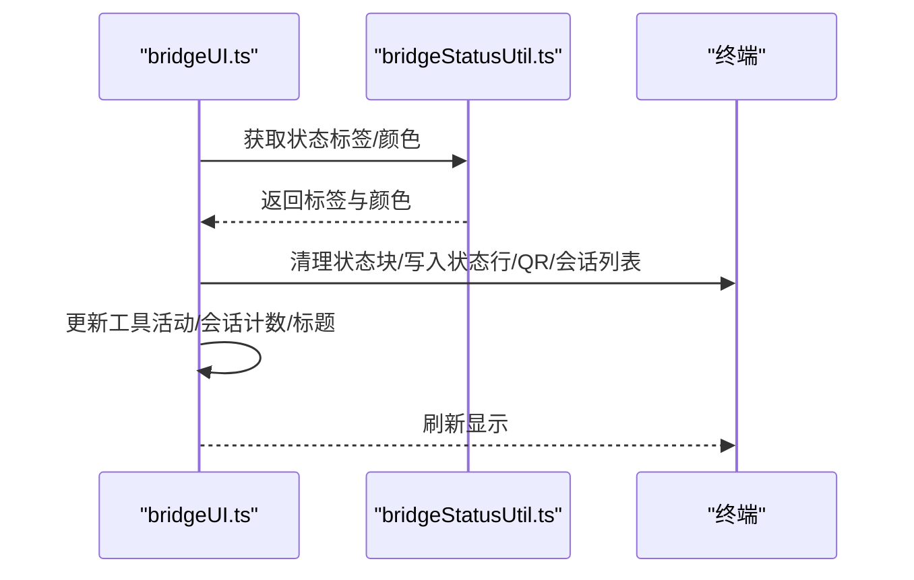
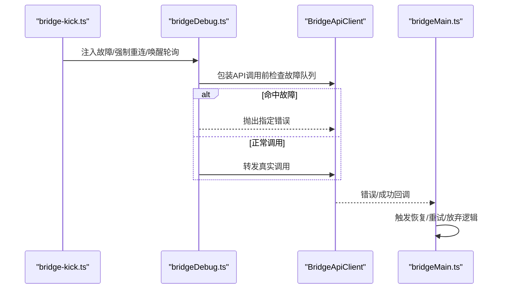
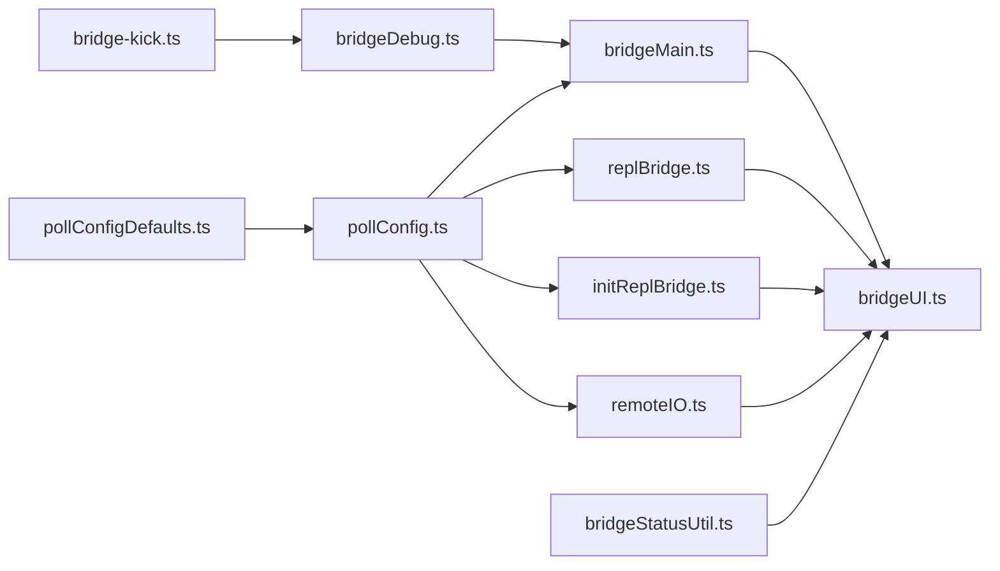

# 配置与监控

<cite>
**本文引用的文件**
- [pollConfig.ts](file://src/bridge/pollConfig.ts)
- [pollConfigDefaults.ts](file://src/bridge/pollConfigDefaults.ts)
- [bridgeStatusUtil.ts](file://src/bridge/bridgeStatusUtil.ts)
- [bridgeUI.ts](file://src/bridge/bridgeUI.ts)
- [bridgeDebug.ts](file://src/bridge/bridgeDebug.ts)
- [bridgeMain.ts](file://src/bridge/bridgeMain.ts)
- [replBridge.ts](file://src/bridge/replBridge.ts)
- [initReplBridge.ts](file://src/bridge/initReplBridge.ts)
- [remoteIO.ts](file://src/cli/remoteIO.ts)
- [bridge-kick.ts](file://src/commands/bridge-kick.ts)
</cite>

## 目录
1. [简介](#简介)
2. [项目结构](#项目结构)
3. [核心组件](#核心组件)
4. [架构总览](#架构总览)
5. [详细组件分析](#详细组件分析)
6. [依赖关系分析](#依赖关系分析)
7. [性能考量](#性能考量)
8. [故障排查指南](#故障排查指南)
9. [结论](#结论)
10. [附录：配置与监控实践示例](#附录配置与监控实践示例)

## 简介
本文件聚焦于“配置与监控”子系统，围绕以下目标展开：
- 深入解析轮询配置管理（pollConfig.ts）：参数校验、默认值来源、动态刷新与回退策略。
- 解释默认配置与合并策略（pollConfigDefaults.ts）：默认值设定、字段含义与兼容性设计。
- 阐述状态显示逻辑（bridgeStatusUtil.ts）：状态机、标签与颜色映射、链接构建与文本截断。
- 展示用户界面更新与日志输出（bridgeUI.ts）：状态渲染、QR 码生成、工具活动追踪与会话列表。
- 解析调试与诊断（bridgeDebug.ts）：故障注入、恢复路径验证与性能观测入口。
- 提供可操作示例：如何配置轮询参数、监控系统状态与进行故障诊断。

## 项目结构
本节聚焦与“配置与监控”直接相关的源码模块及其职责划分：
- 轮询配置与默认值：负责从远程特性开关拉取配置并通过 Zod 校验，提供默认值与多会话扩展。
- 状态工具：负责状态机、标签与颜色、URL 构建、文本截断与闪烁动画分段。
- 用户界面：负责终端内桥接状态的渲染、日志打印、QR 码与会话列表。
- 调试与诊断：负责故障注入、恢复路径触发与调试日志输出。
- 使用方：bridgeMain.ts、replBridge.ts、initReplBridge.ts、remoteIO.ts 等通过统一接口获取轮询配置。

图表来源
- [pollConfig.ts:102-110](file://src/bridge/pollConfig.ts#L102-L110)
- [pollConfigDefaults.ts:55-82](file://src/bridge/pollConfigDefaults.ts#L55-L82)
- [bridgeStatusUtil.ts:124-141](file://src/bridge/bridgeStatusUtil.ts#L124-L141)
- [bridgeUI.ts:294-530](file://src/bridge/bridgeUI.ts#L294-L530)
- [bridgeDebug.ts:54-68](file://src/bridge/bridgeDebug.ts#L54-L68)
- [bridgeMain.ts:603](file://src/bridge/bridgeMain.ts#L603)
- [replBridge.ts:1011](file://src/bridge/replBridge.ts#L1011)
- [initReplBridge.ts:531](file://src/bridge/initReplBridge.ts#L531)
- [remoteIO.ts:184](file://src/cli/remoteIO.ts#L184)
- [bridge-kick.ts:51-114](file://src/commands/bridge-kick.ts#L51-L114)

章节来源
- [pollConfig.ts:102-110](file://src/bridge/pollConfig.ts#L102-L110)
- [pollConfigDefaults.ts:55-82](file://src/bridge/pollConfigDefaults.ts#L55-L82)
- [bridgeStatusUtil.ts:124-141](file://src/bridge/bridgeStatusUtil.ts#L124-L141)
- [bridgeUI.ts:294-530](file://src/bridge/bridgeUI.ts#L294-L530)
- [bridgeDebug.ts:54-68](file://src/bridge/bridgeDebug.ts#L54-L68)
- [bridgeMain.ts:603](file://src/bridge/bridgeMain.ts#L603)
- [replBridge.ts:1011](file://src/bridge/replBridge.ts#L1011)
- [initReplBridge.ts:531](file://src/bridge/initReplBridge.ts#L531)
- [remoteIO.ts:184](file://src/cli/remoteIO.ts#L184)
- [bridge-kick.ts:51-114](file://src/commands/bridge-kick.ts#L51-L114)

## 核心组件
- 轮询配置管理（pollConfig.ts）
  - 通过特性开关获取配置，使用延迟模式的 Zod Schema 进行强校验；对异常值施加“拒绝整对象”的防御策略，并确保至少启用一种容量态存活机制（心跳或轮询）。
  - 返回值在解析失败时回退到默认配置，避免运行期因配置错误导致的不可预测行为。
- 默认配置与合并策略（pollConfigDefaults.ts）
  - 定义单会话与多会话场景下的轮询间隔、回收窗口、保活间隔等关键参数的默认值；为多会话字段提供默认回退，保证旧配置平滑过渡。
- 状态显示逻辑（bridgeStatusUtil.ts）
  - 定义状态机状态与标签/颜色映射；提供连接与会话 URL 构建、文本截断、闪烁动画分段计算等工具函数。
- 用户界面更新（bridgeUI.ts）
  - 统一的状态渲染器，支持连接中、就绪、连接、重连、失败等状态；维护会话计数与列表、工具活动追踪、QR 码生成与切换、日志打印与清屏。
- 调试与诊断（bridgeDebug.ts）
  - 提供故障注入队列、API 包装以替换调用为指定错误、强制重连与唤醒轮询等能力；仅在特定用户类型下生效，避免对外部构建产生开销。

章节来源
- [pollConfig.ts:28-92](file://src/bridge/pollConfig.ts#L28-L92)
- [pollConfig.ts:102-110](file://src/bridge/pollConfig.ts#L102-L110)
- [pollConfigDefaults.ts:13-82](file://src/bridge/pollConfigDefaults.ts#L13-L82)
- [bridgeStatusUtil.ts:9-164](file://src/bridge/bridgeStatusUtil.ts#L9-L164)
- [bridgeUI.ts:42-530](file://src/bridge/bridgeUI.ts#L42-L530)
- [bridgeDebug.ts:54-135](file://src/bridge/bridgeDebug.ts#L54-L135)

## 架构总览
下图展示了“配置—状态—UI—调试”的交互关系与数据流：

图表来源
- [pollConfig.ts:102-110](file://src/bridge/pollConfig.ts#L102-L110)
- [pollConfigDefaults.ts:55-82](file://src/bridge/pollConfigDefaults.ts#L55-L82)
- [bridgeStatusUtil.ts:124-141](file://src/bridge/bridgeStatusUtil.ts#L124-L141)
- [bridgeUI.ts:294-530](file://src/bridge/bridgeUI.ts#L294-L530)
- [bridgeMain.ts:603](file://src/bridge/bridgeMain.ts#L603)
- [replBridge.ts:1011](file://src/bridge/replBridge.ts#L1011)

## 详细组件分析

### 轮询配置管理（pollConfig.ts）
- 设计要点
  - 使用延迟 Schema 与 Zod refine 对字段范围进行严格约束：非负整数最小值、容量态允许 0 或 ≥100 的细化、对象级至少启用一种容量态存活机制。
  - 通过特性开关键名统一拉取配置，设置固定刷新周期，解析失败时整体回退至默认配置，避免部分信任带来的风险。
- 关键字段与语义
  - not_at_capacity/at_capacity 轮询间隔：分别控制空闲与满载时的轮询节奏。
  - non_exclusive_heartbeat_interval_ms：独立的心跳间隔，与轮询并行运行。
  - 多会话扩展字段：针对不同负载阶段提供独立默认回退，保持向后兼容。
  - reclaim_older_than_ms：回收超时未确认的工作项。
  - session_keepalive_interval_v2_ms：静默保活帧间隔，防止代理回收空闲会话。
- 动态更新机制
  - 通过统一函数集中获取配置，便于在桥接主流程与 REPL 流程共享同一套动态参数，实现全量快速调参。

图表来源
- [pollConfig.ts:102-110](file://src/bridge/pollConfig.ts#L102-L110)

章节来源
- [pollConfig.ts:28-92](file://src/bridge/pollConfig.ts#L28-L92)
- [pollConfig.ts:102-110](file://src/bridge/pollConfig.ts#L102-L110)

### 默认配置与合并策略（pollConfigDefaults.ts）
- 设计要点
  - 将默认值集中定义，避免调用链过长；为多会话字段提供默认回退，确保旧配置不需显式补齐即可沿用默认行为。
  - 明确各字段的业务边界与服务器侧约束，如 TTL 与健康门限，保障配置在安全范围内运行。
- 字段说明（摘录）
  - 单会话轮询间隔（空闲/满载）、多会话对应间隔、心跳间隔、回收窗口、保活间隔等。

章节来源
- [pollConfigDefaults.ts:13-82](file://src/bridge/pollConfigDefaults.ts#L13-L82)

### 状态显示逻辑（bridgeStatusUtil.ts）
- 状态机与标签
  - 状态集合：空闲、已附加、已命名、重连中、失败。
  - 标签与颜色映射：根据错误、连接状态、会话状态与重连标志生成人类可读标签与颜色。
- 工具函数
  - 时间戳格式化、工具摘要截断、连接与会话 URL 构建、闪烁动画分段计算、脚注文本拼装、OSC 8 超链接包装等。

图表来源
- [bridgeStatusUtil.ts:9-164](file://src/bridge/bridgeStatusUtil.ts#L9-L164)

章节来源
- [bridgeStatusUtil.ts:9-164](file://src/bridge/bridgeStatusUtil.ts#L9-L164)

### 用户界面更新（bridgeUI.ts）
- 能力概览
  - 状态渲染器：支持连接中、就绪、连接、重连、失败五类状态；维护会话计数与列表、工具活动追踪、QR 码生成与切换、日志打印与清屏。
  - 日志体系：提供普通日志、详细日志、错误日志、重连耗时统计、会话生命周期事件等。
  - 交互提示：支持切换 QR 显示、切换生成模式提示、会话标题更新与刷新。
- 关键流程
  - 初始化横幅：构建连接 URL、生成 QR、启动连接中动画。
  - 状态切换：停止连接中动画、清理状态块、按当前状态渲染新内容。
  - 会话列表：多会话模式下维护每会话标题、URL 与活动状态。

图表来源
- [bridgeUI.ts:187-292](file://src/bridge/bridgeUI.ts#L187-L292)
- [bridgeStatusUtil.ts:124-141](file://src/bridge/bridgeStatusUtil.ts#L124-L141)

章节来源
- [bridgeUI.ts:42-530](file://src/bridge/bridgeUI.ts#L42-L530)

### 调试与诊断（bridgeDebug.ts）
- 故障注入
  - 维护故障队列，按方法名匹配消费；支持致命错误与瞬时错误两类，前者抛出专用致命错误，后者抛出普通错误模拟网络/服务端错误。
- 恢复路径验证
  - 提供强制关闭传输、强制重连环境、唤醒轮询等能力；配合命令行工具桥接调试流程。
- 性能与可观测性
  - 通过调试日志记录注入动作与上下文，便于定位轮询、注册、重连、心跳等关键路径的异常与恢复行为。

图表来源
- [bridgeDebug.ts:70-135](file://src/bridge/bridgeDebug.ts#L70-L135)
- [bridge-kick.ts:51-114](file://src/commands/bridge-kick.ts#L51-L114)

章节来源
- [bridgeDebug.ts:54-135](file://src/bridge/bridgeDebug.ts#L54-L135)
- [bridge-kick.ts:51-114](file://src/commands/bridge-kick.ts#L51-L114)

## 依赖关系分析
- 配置依赖
  - 轮询配置由特性开关驱动，经 Zod 校验后返回给桥接主流程与 REPL 流程；默认值来自独立模块，确保无外部依赖链下的可用性。
- 状态与UI依赖
  - UI 依赖状态工具提供的标签/颜色/链接/截断等能力；状态工具依赖产品常量与格式化工具。
- 调试依赖
  - 调试模块通过包装 API 实现故障注入；命令行工具提供注入入口；仅在特定用户类型下生效。

图表来源
- [pollConfig.ts:102-110](file://src/bridge/pollConfig.ts#L102-L110)
- [pollConfigDefaults.ts:55-82](file://src/bridge/pollConfigDefaults.ts#L55-L82)
- [bridgeStatusUtil.ts:124-141](file://src/bridge/bridgeStatusUtil.ts#L124-L141)
- [bridgeUI.ts:294-530](file://src/bridge/bridgeUI.ts#L294-L530)
- [bridgeDebug.ts:54-68](file://src/bridge/bridgeDebug.ts#L54-L68)
- [bridgeMain.ts:603](file://src/bridge/bridgeMain.ts#L603)
- [replBridge.ts:1011](file://src/bridge/replBridge.ts#L1011)
- [initReplBridge.ts:531](file://src/bridge/initReplBridge.ts#L531)
- [remoteIO.ts:184](file://src/cli/remoteIO.ts#L184)
- [bridge-kick.ts:51-114](file://src/commands/bridge-kick.ts#L51-L114)

章节来源
- [pollConfig.ts:102-110](file://src/bridge/pollConfig.ts#L102-L110)
- [pollConfigDefaults.ts:55-82](file://src/bridge/pollConfigDefaults.ts#L55-L82)
- [bridgeStatusUtil.ts:124-141](file://src/bridge/bridgeStatusUtil.ts#L124-L141)
- [bridgeUI.ts:294-530](file://src/bridge/bridgeUI.ts#L294-L530)
- [bridgeDebug.ts:54-68](file://src/bridge/bridgeDebug.ts#L54-L68)
- [bridgeMain.ts:603](file://src/bridge/bridgeMain.ts#L603)
- [replBridge.ts:1011](file://src/bridge/replBridge.ts#L1011)
- [initReplBridge.ts:531](file://src/bridge/initReplBridge.ts#L531)
- [remoteIO.ts:184](file://src/cli/remoteIO.ts#L184)
- [bridge-kick.ts:51-114](file://src/commands/bridge-kick.ts#L51-L114)

## 性能考量
- 轮询与心跳
  - 空闲轮询间隔较短，有助于快速恢复工作；满载轮询间隔较长，降低服务器压力并留有 TTL 头寸。
  - 心跳与轮询并行，避免互相抑制，提升存活信号的可靠性。
- 回收与保活
  - 回收窗口与保活间隔共同作用，确保在令牌轮换与代理回收场景下的稳定性。
- UI 渲染
  - 状态渲染采用增量清屏与行计数，减少不必要的重绘；QR 生成异步处理并缓存结果，避免阻塞渲染。

## 故障排查指南
- 使用命令行调试
  - 通过桥接调试命令触发传输关闭、轮询故障、注册故障、重连会话故障、心跳故障与强制重连等场景，观察恢复路径与日志输出。
- 关注日志与状态
  - 在 UI 中查看状态标签与颜色变化；结合调试日志定位轮询、注册、重连、心跳等关键路径的异常。
- 验证配置有效性
  - 若配置解析失败，系统将回退到默认配置；建议通过特性开关验证配置键值与数值范围是否符合要求。

章节来源
- [bridge-kick.ts:51-114](file://src/commands/bridge-kick.ts#L51-L114)
- [bridgeDebug.ts:70-135](file://src/bridge/bridgeDebug.ts#L70-L135)
- [bridgeUI.ts:123-137](file://src/bridge/bridgeUI.ts#L123-L137)

## 结论
该配置与监控体系通过“强校验+默认回退+动态刷新”的组合，实现了对轮询行为的精细化控制；状态工具与 UI 渲染提供了清晰的可视化反馈；调试模块则为复杂恢复路径提供了可控的验证手段。整体设计兼顾了安全性、可观测性与可维护性。

## 附录：配置与监控实践示例
- 配置轮询参数
  - 在特性开关中推送键名为 tengu_bridge_poll_interval_config 的 JSON，包含如下字段（示例字段名，具体以源码为准）：not_at_capacity、at_capacity、non_exclusive_heartbeat_interval_ms、multisession_*、reclaim_older_than_ms、session_keepalive_interval_v2_ms。
  - 通过统一函数获取配置并在桥接主流程与 REPL 流程中应用，实现全量快速调参。
- 监控系统状态
  - 在 UI 中观察状态标签与颜色变化；关注会话计数、标题与活动轨迹；必要时切换 QR 显示以辅助连接。
- 故障诊断
  - 使用命令行工具触发特定故障（如轮询 404/503、传输关闭、注册失败等），观察恢复路径与日志输出；结合调试日志定位问题根因。

章节来源
- [pollConfig.ts:102-110](file://src/bridge/pollConfig.ts#L102-L110)
- [bridgeUI.ts:294-530](file://src/bridge/bridgeUI.ts#L294-L530)
- [bridge-kick.ts:51-114](file://src/commands/bridge-kick.ts#L51-L114)