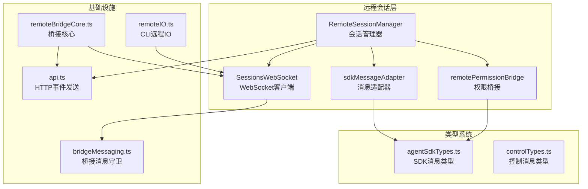
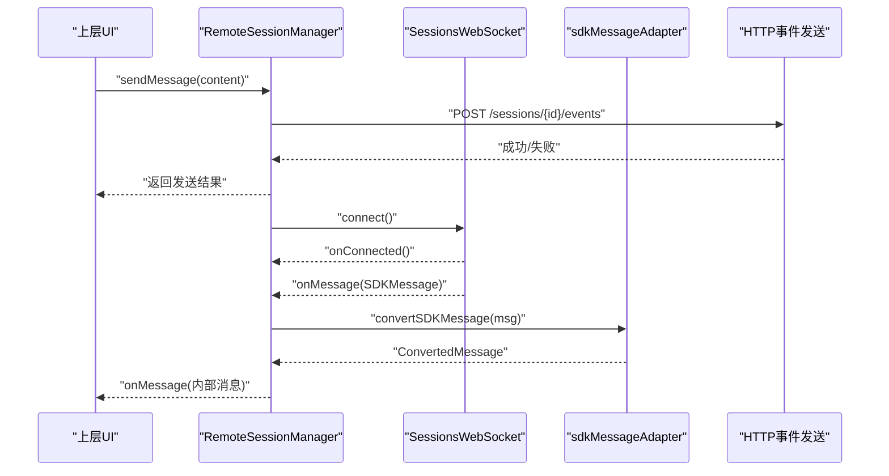
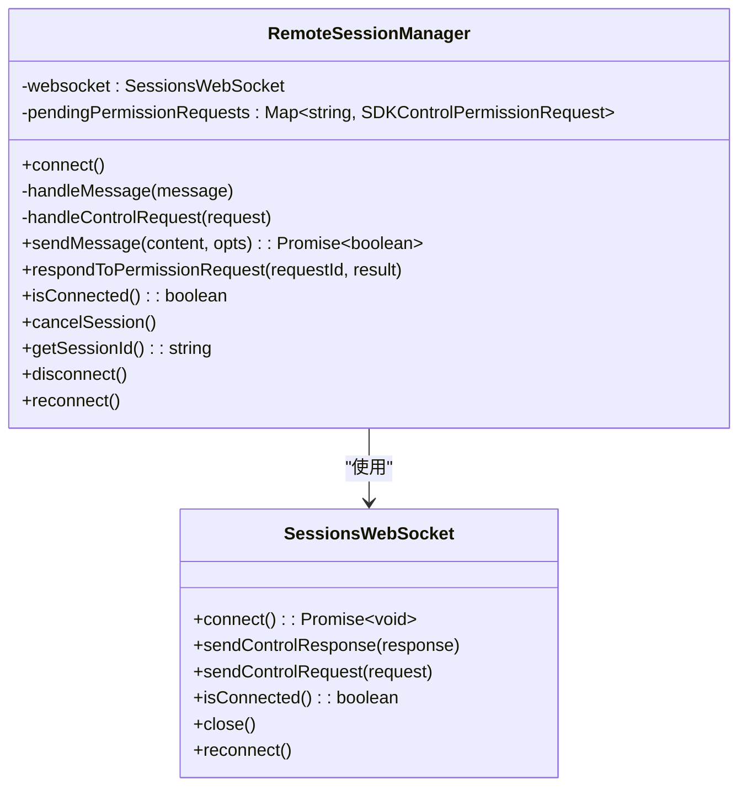
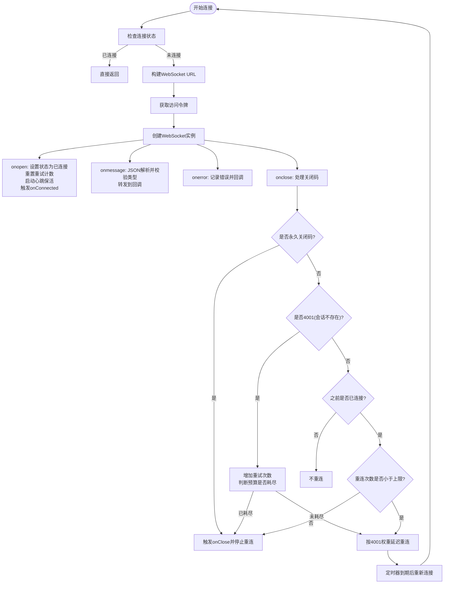
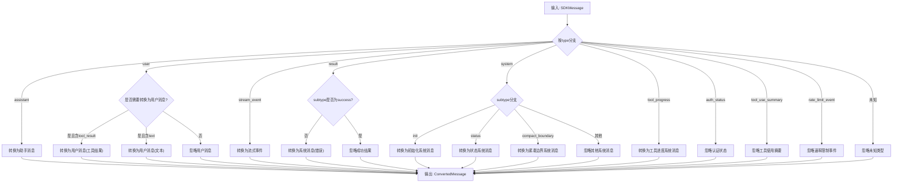
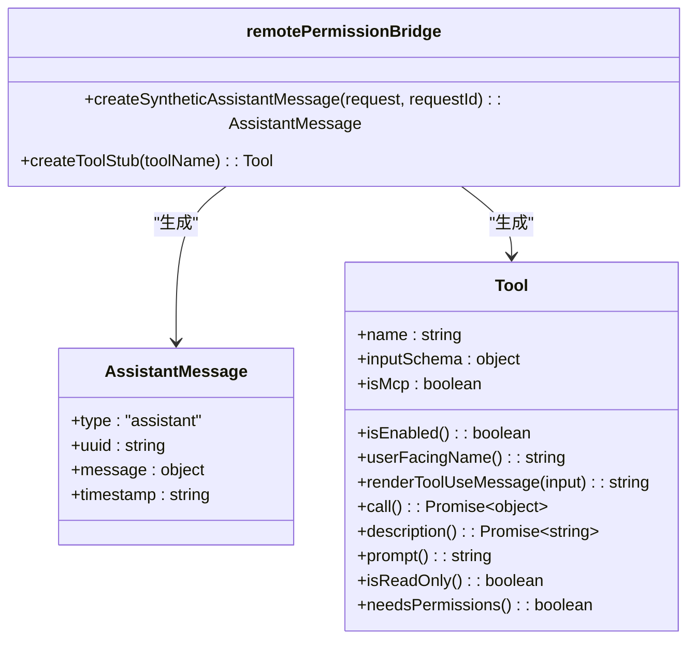
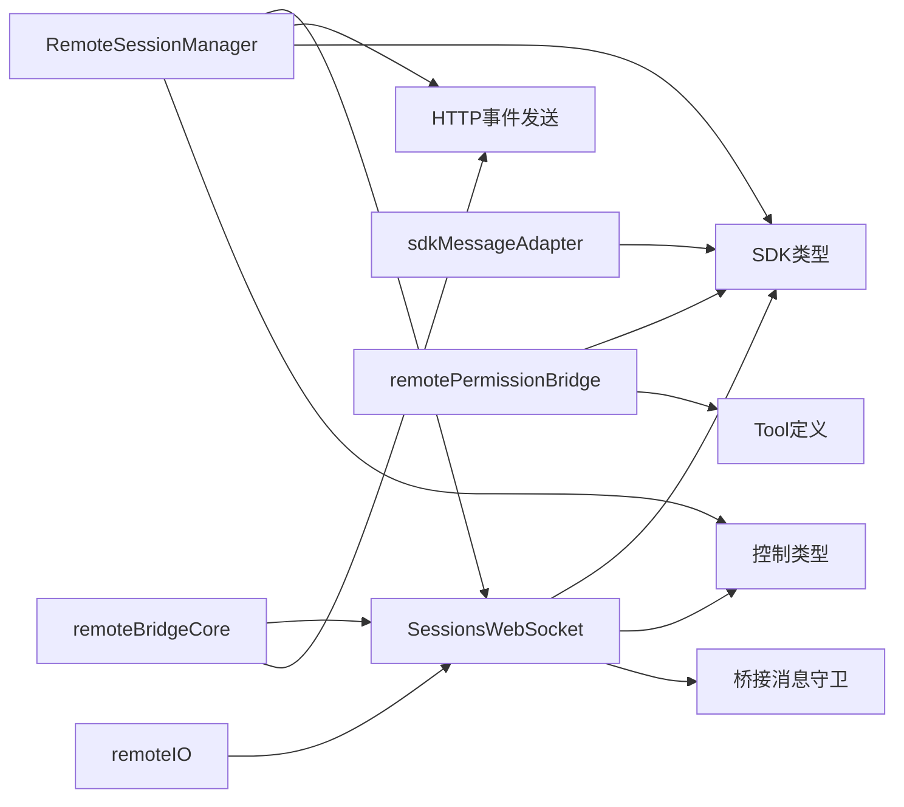

# 远程会话管理系统

<cite>
**本文档引用的文件**
- [RemoteSessionManager.ts](file://src/remote/RemoteSessionManager.ts)
- [SessionsWebSocket.ts](file://src/remote/SessionsWebSocket.ts)
- [sdkMessageAdapter.ts](file://src/remote/sdkMessageAdapter.ts)
- [remotePermissionBridge.ts](file://src/remote/remotePermissionBridge.ts)
- [agentSdkTypes.ts](file://src/entrypoints/agentSdkTypes.ts)
- [controlTypes.ts](file://src/entrypoints/sdk/controlTypes.ts)
- [api.ts](file://src/utils/teleport/api.ts)
- [bridgeMessaging.ts](file://src/bridge/bridgeMessaging.ts)
- [remoteBridgeCore.ts](file://src/bridge/remoteBridgeCore.ts)
- [remoteIO.ts](file://src/cli/remoteIO.ts)
</cite>

## 目录
1. [简介](#简介)
2. [项目结构](#项目结构)
3. [核心组件](#核心组件)
4. [架构概览](#架构概览)
5. [详细组件分析](#详细组件分析)
6. [依赖关系分析](#依赖关系分析)
7. [性能考量](#性能考量)
8. [故障排除指南](#故障排除指南)
9. [结论](#结论)

## 简介
本文件详细阐述远程会话管理系统的实现，重点覆盖以下方面：
- RemoteSessionManager.ts 的会话生命周期管理：连接建立、消息分发、权限请求处理、中断控制与断开清理。
- SessionsWebSocket.ts 的 WebSocket 连接处理：认证、重连策略、心跳保活、错误处理与关闭流程。
- SDK 消息适配器（sdkMessageAdapter.ts）：将 CCR 发送的 SDKMessage 转换为 REPL 内部消息格式。
- 远程权限桥接机制：合成助手消息、工具桩函数，支持远端工具调用的本地展示与权限确认。
- 会话状态同步与数据一致性：去重、幂等、状态报告与保持活跃。
- 会话恢复机制、断线重连处理与并发会话管理。
- 安全考虑、性能监控与最佳实践。

## 项目结构
远程会话管理涉及三个主要模块：
- 会话管理器：负责整体生命周期协调与回调分发。
- WebSocket 客户端：负责与 CCR 服务的实时通信与重连。
- 消息适配器：负责 SDKMessage 到内部消息类型的转换。

**图表来源**
- [RemoteSessionManager.ts:95-324](file://src/remote/RemoteSessionManager.ts#L95-L324)
- [SessionsWebSocket.ts:82-404](file://src/remote/SessionsWebSocket.ts#L82-L404)
- [sdkMessageAdapter.ts:168-278](file://src/remote/sdkMessageAdapter.ts#L168-L278)
- [remotePermissionBridge.ts:12-79](file://src/remote/remotePermissionBridge.ts#L12-L79)
- [agentSdkTypes.ts](file://src/entrypoints/agentSdkTypes.ts)
- [controlTypes.ts](file://src/entrypoints/sdk/controlTypes.ts)
- [api.ts:369-417](file://src/utils/teleport/api.ts#L369-L417)
- [bridgeMessaging.ts:36-70](file://src/bridge/bridgeMessaging.ts#L36-L70)
- [remoteBridgeCore.ts:379-830](file://src/bridge/remoteBridgeCore.ts#L379-L830)
- [remoteIO.ts:174-199](file://src/cli/remoteIO.ts#L174-L199)

**章节来源**
- [RemoteSessionManager.ts:1-344](file://src/remote/RemoteSessionManager.ts#L1-L344)
- [SessionsWebSocket.ts:1-405](file://src/remote/SessionsWebSocket.ts#L1-L405)
- [sdkMessageAdapter.ts:1-303](file://src/remote/sdkMessageAdapter.ts#L1-L303)
- [remotePermissionBridge.ts:1-79](file://src/remote/remotePermissionBridge.ts#L1-L79)

## 核心组件
- RemoteSessionManager：协调 WebSocket 订阅、HTTP 事件发送、权限请求响应与中断控制；维护待处理权限请求映射。
- SessionsWebSocket：封装 WebSocket 连接、认证、心跳、重连与关闭；统一消息解析与回调分发。
- sdkMessageAdapter：将 SDKMessage 转换为 REPL 内部消息类型，处理流式事件、结果消息、系统消息与工具进度消息。
- remotePermissionBridge：生成合成助手消息与工具桩函数，支撑远端工具调用在本地 UI 中的展示与权限确认。

**章节来源**
- [RemoteSessionManager.ts:95-324](file://src/remote/RemoteSessionManager.ts#L95-L324)
- [SessionsWebSocket.ts:82-404](file://src/remote/SessionsWebSocket.ts#L82-L404)
- [sdkMessageAdapter.ts:168-278](file://src/remote/sdkMessageAdapter.ts#L168-L278)
- [remotePermissionBridge.ts:12-79](file://src/remote/remotePermissionBridge.ts#L12-L79)

## 架构概览
远程会话管理采用“管理器 + 客户端 + 适配器”的分层设计：
- RemoteSessionManager 作为协调者，向上提供统一接口，向下委托 SessionsWebSocket 与 HTTP 通道。
- SessionsWebSocket 负责与 CCR 的实时通信，内置重连与心跳保活逻辑。
- sdkMessageAdapter 将 SDKMessage 转换为内部消息，确保 UI 渲染一致性。
- remotePermissionBridge 提供远端工具调用的本地桥接能力。

**图表来源**
- [RemoteSessionManager.ts:108-141](file://src/remote/RemoteSessionManager.ts#L108-L141)
- [SessionsWebSocket.ts:100-205](file://src/remote/SessionsWebSocket.ts#L100-L205)
- [sdkMessageAdapter.ts:168-278](file://src/remote/sdkMessageAdapter.ts#L168-L278)
- [api.ts:369-417](file://src/utils/teleport/api.ts#L369-L417)

## 详细组件分析

### RemoteSessionManager 组件分析
职责与流程：
- 连接管理：通过 SessionsWebSocket 建立订阅，转发连接状态回调。
- 消息处理：区分 SDKMessage 与控制消息（权限请求/响应/取消），SDKMessage 交由上层回调，控制消息由内部处理。
- 权限桥接：记录待处理权限请求，接收用户决策后构造控制响应回传。
- 中断控制：向远端发送中断请求以取消当前请求。
- 断开与重连：关闭连接并清理状态；支持强制重连以应对订阅过期场景。

**图表来源**
- [RemoteSessionManager.ts:95-324](file://src/remote/RemoteSessionManager.ts#L95-L324)
- [SessionsWebSocket.ts:82-404](file://src/remote/SessionsWebSocket.ts#L82-L404)

关键实现要点：
- 类型守卫用于区分 SDKMessage 与控制消息，避免误判。
- 待处理权限请求映射用于匹配用户响应与服务器请求。
- HTTP 事件发送通过统一 API 封装，支持超时与错误日志。
- 中断信号通过控制请求发送，避免阻塞当前请求。

**章节来源**
- [RemoteSessionManager.ts:108-141](file://src/remote/RemoteSessionManager.ts#L108-L141)
- [RemoteSessionManager.ts:146-184](file://src/remote/RemoteSessionManager.ts#L146-L184)
- [RemoteSessionManager.ts:189-214](file://src/remote/RemoteSessionManager.ts#L189-L214)
- [RemoteSessionManager.ts:219-242](file://src/remote/RemoteSessionManager.ts#L219-L242)
- [RemoteSessionManager.ts:247-282](file://src/remote/RemoteSessionManager.ts#L247-L282)
- [RemoteSessionManager.ts:294-323](file://src/remote/RemoteSessionManager.ts#L294-L323)
- [api.ts:369-417](file://src/utils/teleport/api.ts#L369-L417)

### SessionsWebSocket 组件分析
职责与流程：
- 连接建立：根据运行环境选择原生 WebSocket 或 ws 包，注入代理与 TLS 配置。
- 认证与保活：通过请求头携带访问令牌；周期性发送 ping 以维持连接。
- 消息解析：JSON 解析并校验消息类型，转发到上层回调。
- 关闭与重连：区分永久关闭码与临时断开；对特定错误码进行有限重试；调度指数退避重连。

**图表来源**
- [SessionsWebSocket.ts:100-205](file://src/remote/SessionsWebSocket.ts#L100-L205)
- [SessionsWebSocket.ts:234-288](file://src/remote/SessionsWebSocket.ts#L234-L288)
- [SessionsWebSocket.ts:290-299](file://src/remote/SessionsWebSocket.ts#L290-L299)
- [SessionsWebSocket.ts:301-323](file://src/remote/SessionsWebSocket.ts#L301-L323)

关键实现要点：
- 支持 Bun 与 Node 环境差异，自动选择适配的 WebSocket 实现。
- 心跳保活与错误处理分离，确保网络波动下的稳定性。
- 对 4001 错误码进行有限重试，避免在会话压缩期间过早放弃。
- 重连策略结合固定延迟与会话不存在的动态权重，平衡恢复速度与资源消耗。

**章节来源**
- [SessionsWebSocket.ts:100-205](file://src/remote/SessionsWebSocket.ts#L100-L205)
- [SessionsWebSocket.ts:234-288](file://src/remote/SessionsWebSocket.ts#L234-L288)
- [SessionsWebSocket.ts:290-299](file://src/remote/SessionsWebSocket.ts#L290-L299)
- [SessionsWebSocket.ts:301-323](file://src/remote/SessionsWebSocket.ts#L301-L323)

### SDK 消息适配器组件分析
职责与流程：
- 将 SDKMessage 转换为 REPL 内部消息类型，包括助手消息、流式事件、系统消息、工具进度消息等。
- 对用户消息进行条件转换：当启用工具结果转换或历史消息转换时，将远端工具结果或文本消息渲染为本地用户消息。
- 忽略不显示的消息类型（如认证状态、工具使用摘要、速率限制事件）。
- 提供会话结束检测与成功结果提取辅助方法。

**图表来源**
- [sdkMessageAdapter.ts:168-278](file://src/remote/sdkMessageAdapter.ts#L168-L278)

关键实现要点：
- 严格区分用户消息中的工具结果与普通文本，确保本地渲染一致性。
- 对系统消息进行细粒度处理，仅显示必要信息，避免噪声。
- 提供 end 检测与成功结果提取，便于上层控制会话生命周期。

**章节来源**
- [sdkMessageAdapter.ts:168-278](file://src/remote/sdkMessageAdapter.ts#L168-L278)
- [sdkMessageAdapter.ts:283-302](file://src/remote/sdkMessageAdapter.ts#L283-L302)

### 远程权限桥接机制
- 合成助手消息：当远端发起工具调用但本地无真实助手消息时，生成合成消息以驱动 UI 的权限确认流程。
- 工具桩函数：当远端存在本地未加载的工具（如 MCP 工具），创建最小化工具桩以路由到通用权限处理路径。

**图表来源**
- [remotePermissionBridge.ts:12-79](file://src/remote/remotePermissionBridge.ts#L12-L79)

**章节来源**
- [remotePermissionBridge.ts:12-46](file://src/remote/remotePermissionBridge.ts#L12-L46)
- [remotePermissionBridge.ts:53-79](file://src/remote/remotePermissionBridge.ts#L53-L79)

## 依赖关系分析
- RemoteSessionManager 依赖 SessionsWebSocket、HTTP 事件发送 API、SDK 类型与控制类型。
- SessionsWebSocket 依赖 OAuth 配置、代理与 TLS 配置、JSON 序列化工具。
- sdkMessageAdapter 依赖 SDK 类型与消息工具，将 SDKMessage 映射到内部消息。
- remotePermissionBridge 依赖 SDK 控制类型与工具定义，生成合成消息与工具桩。
- 桥接层（bridgeMessaging、remoteBridgeCore、remoteIO）提供跨平台的传输与保持活跃机制。

**图表来源**
- [RemoteSessionManager.ts:1-17](file://src/remote/RemoteSessionManager.ts#L1-L17)
- [SessionsWebSocket.ts:1-15](file://src/remote/SessionsWebSocket.ts#L1-L15)
- [sdkMessageAdapter.ts:1-20](file://src/remote/sdkMessageAdapter.ts#L1-L20)
- [remotePermissionBridge.ts:1-5](file://src/remote/remotePermissionBridge.ts#L1-L5)
- [bridgeMessaging.ts:36-70](file://src/bridge/bridgeMessaging.ts#L36-L70)
- [remoteBridgeCore.ts:379-830](file://src/bridge/remoteBridgeCore.ts#L379-L830)
- [remoteIO.ts:174-199](file://src/cli/remoteIO.ts#L174-L199)

**章节来源**
- [RemoteSessionManager.ts:1-17](file://src/remote/RemoteSessionManager.ts#L1-L17)
- [SessionsWebSocket.ts:1-15](file://src/remote/SessionsWebSocket.ts#L1-L15)
- [sdkMessageAdapter.ts:1-20](file://src/remote/sdkMessageAdapter.ts#L1-L20)
- [remotePermissionBridge.ts:1-5](file://src/remote/remotePermissionBridge.ts#L1-L5)
- [bridgeMessaging.ts:36-70](file://src/bridge/bridgeMessaging.ts#L36-L70)
- [remoteBridgeCore.ts:379-830](file://src/bridge/remoteBridgeCore.ts#L379-L830)
- [remoteIO.ts:174-199](file://src/cli/remoteIO.ts#L174-L199)

## 性能考量
- 心跳保活：定期发送 ping，降低代理与中间层因空闲而回收连接的风险。
- 重连策略：固定延迟与会话不存在的动态权重相结合，减少不必要的重连尝试。
- 消息去重：基于 UUID 的去重集合，避免重复消息导致的 UI 抖动与资源浪费。
- 批量写入：桥接层对消息进行批量发送，减少网络往返与服务器压力。
- 保持活跃：定时发送 keep_alive 帧，防止上游代理与会话入口层回收空闲会话。

**章节来源**
- [SessionsWebSocket.ts:301-323](file://src/remote/SessionsWebSocket.ts#L301-L323)
- [remoteBridgeCore.ts:797-823](file://src/bridge/remoteBridgeCore.ts#L797-L823)
- [remoteIO.ts:174-199](file://src/cli/remoteIO.ts#L174-L199)

## 故障排除指南
常见问题与处理建议：
- 连接频繁断开：检查代理与 TLS 配置，确认网络环境与防火墙设置；关注 4001 错误码的有限重试策略。
- 权限请求无响应：确认 RemoteSessionManager 是否正确记录待处理请求并回调上层；检查控制响应是否成功发送。
- 消息不显示：核对 sdkMessageAdapter 的转换选项与消息类型分支，确保非显示消息被正确忽略。
- 会话无法恢复：使用强制重连接口清理订阅并重建连接；检查会话状态与组织 UUID 参数。

**章节来源**
- [SessionsWebSocket.ts:234-288](file://src/remote/SessionsWebSocket.ts#L234-L288)
- [RemoteSessionManager.ts:146-184](file://src/remote/RemoteSessionManager.ts#L146-L184)
- [sdkMessageAdapter.ts:168-278](file://src/remote/sdkMessageAdapter.ts#L168-L278)

## 结论
远程会话管理系统通过清晰的分层设计实现了稳定的远端交互体验。RemoteSessionManager 提供统一的生命周期管理与权限桥接，SessionsWebSocket 确保连接的可靠性与可恢复性，sdkMessageAdapter 保障了消息渲染的一致性。配合桥接层的传输优化与保持活跃机制，系统在复杂网络环境下仍能维持良好的用户体验。建议在生产环境中结合日志与监控指标持续优化重连参数与消息去重策略，并加强安全配置与访问令牌轮换。