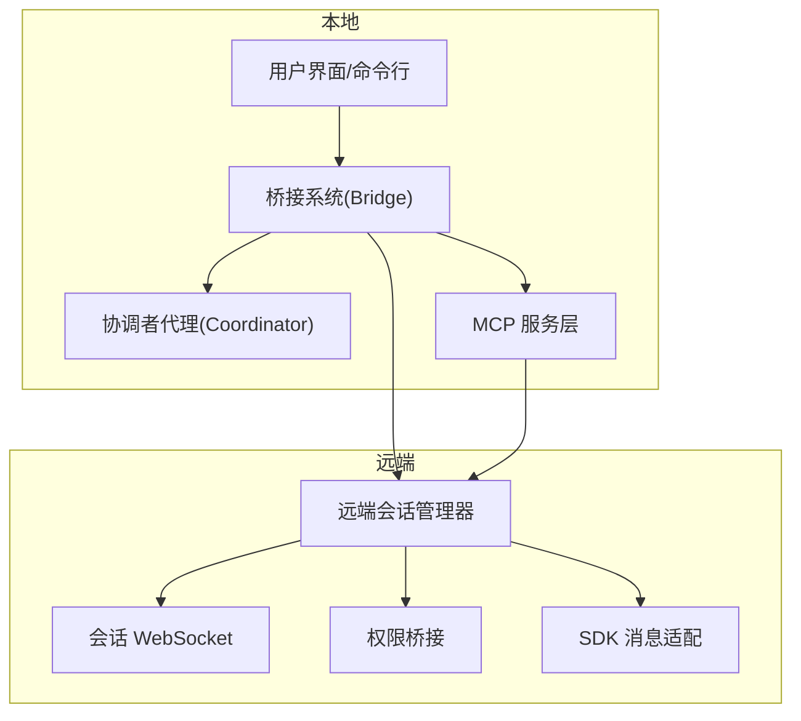
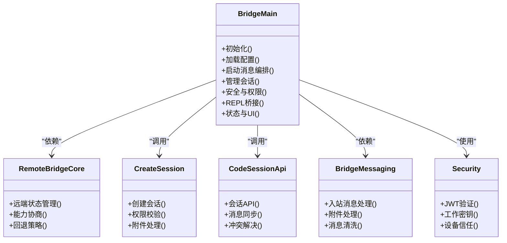
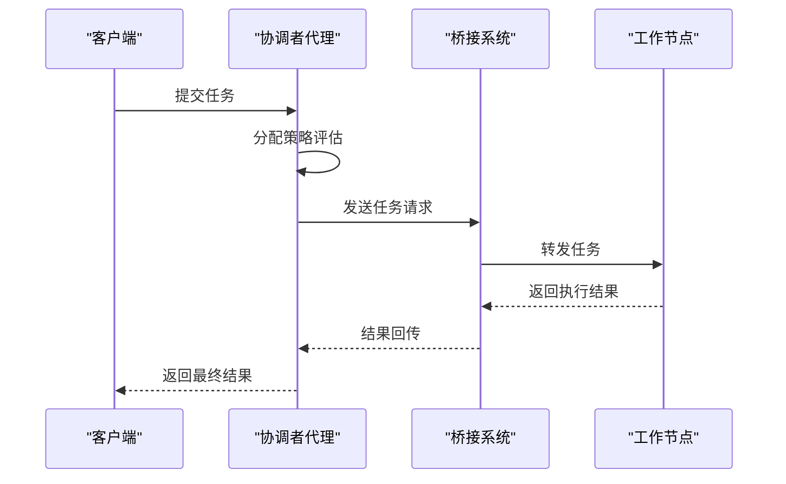
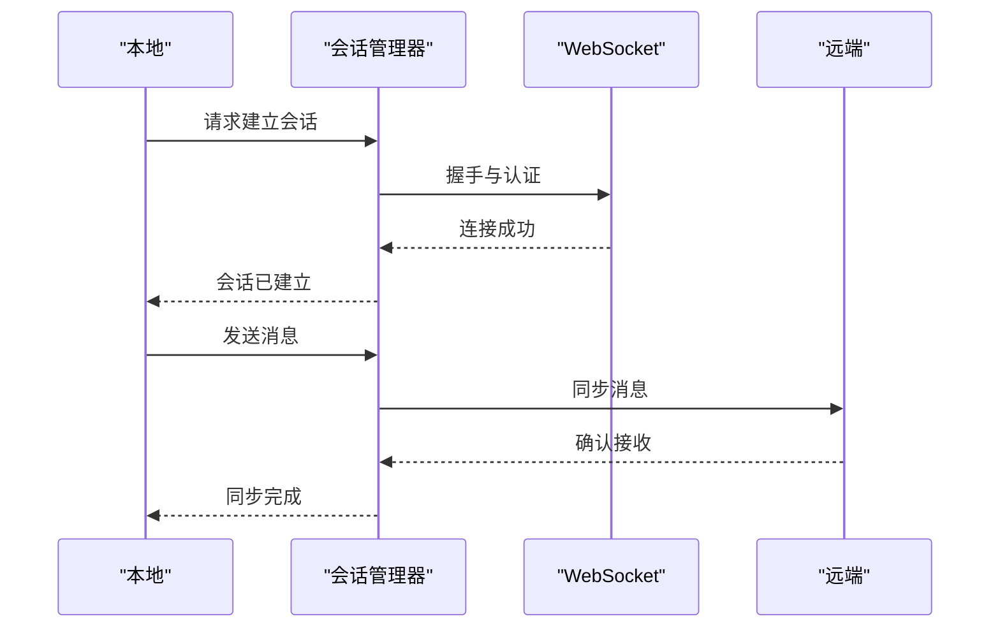
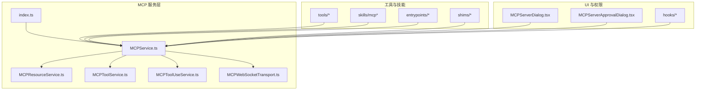
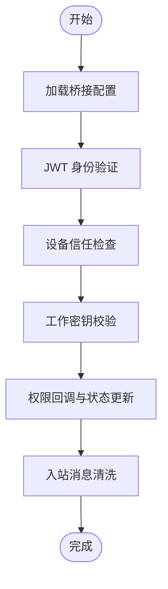
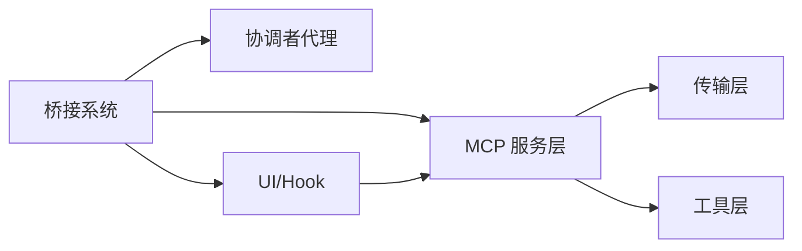

# 远程协作

<cite>
**本文引用的文件**
- [docs/06-bridge.md](file://docs/06-bridge.md)
- [docs/04-coordinator.md](file://docs/04-coordinator.md)
- [src/bridge/bridgeMain.ts](file://src/bridge/bridgeMain.ts)
- [src/bridge/bridgeApi.ts](file://src/bridge/bridgeApi.ts)
- [src/bridge/bridgeMessaging.ts](file://src/bridge/bridgeMessaging.ts)
- [src/bridge/remoteBridgeCore.ts](file://src/bridge/remoteBridgeCore.ts)
- [src/bridge/createSession.ts](file://src/bridge/createSession.ts)
- [src/bridge/codeSessionApi.ts](file://src/bridge/codeSessionApi.ts)
- [src/bridge/peerSessions.ts](file://src/bridge/peerSessions.ts)
- [src/bridge/jwtUtils.ts](file://src/bridge/jwtUtils.ts)
- [src/bridge/workSecret.ts](file://src/bridge/workSecret.ts)
- [src/bridge/trustedDevice.ts](file://src/bridge/trustedDevice.ts)
- [src/bridge/pollConfig.ts](file://src/bridge/pollConfig.ts)
- [src/bridge/pollConfigDefaults.ts](file://src/bridge/pollConfigDefaults.ts)
- [src/bridge/envLessBridgeConfig.ts](file://src/bridge/envLessBridgeConfig.ts)
- [src/bridge/inboundMessages.ts](file://src/bridge/inboundMessages.ts)
- [src/bridge/inboundAttachments.ts](file://src/bridge/inboundAttachments.ts)
- [src/bridge/sessionIdCompat.ts](file://src/bridge/sessionIdCompat.ts)
- [src/bridge/sessionRunner.ts](file://src/bridge/sessionRunner.ts)
- [src/bridge/capacityWake.ts](file://src/bridge/capacityWake.ts)
- [src/bridge/initReplBridge.ts](file://src/bridge/initReplBridge.ts)
- [src/bridge/replBridge.ts](file://src/bridge/replBridge.ts)
- [src/bridge/replBridgeHandle.ts](file://src/bridge/replBridgeHandle.ts)
- [src/bridge/replBridgeTransport.ts](file://src/bridge/replBridgeTransport.ts)
- [src/bridge/webhookSanitizer.ts](file://src/bridge/webhookSanitizer.ts)
- [src/bridge/flushGate.ts](file://src/bridge/flushGate.ts)
- [src/bridge/bridgeStatusUtil.ts](file://src/bridge/bridgeStatusUtil.ts)
- [src/bridge/bridgeUI.ts](file://src/bridge/bridgeUI.ts)
- [src/bridge/bridgePointer.ts](file://src/bridge/bridgePointer.ts)
- [src/bridge/bridgeEnabled.ts](file://src/bridge/bridgeEnabled.ts)
- [src/bridge/bridgeConfig.ts](file://src/bridge/bridgeConfig.ts)
- [src/bridge/bridgeDebug.ts](file://src/bridge/bridgeDebug.ts)
- [src/bridge/debugUtils.ts](file://src/bridge/debugUtils.ts)
- [src/bridge/bridgePermissionCallbacks.ts](file://src/bridge/bridgePermissionCallbacks.ts)
- [src/bridge/types.ts](file://src/bridge/types.ts)
- [src/coordinator/workerAgent.ts](file://src/coordinator/workerAgent.ts)
- [src/coordinator/coordinatorMode.ts](file://src/coordinator/coordinatorMode.ts)
- [src/remote/RemoteSessionManager.ts](file://src/remote/RemoteSessionManager.ts)
- [src/remote/SessionsWebSocket.ts](file://src/remote/SessionsWebSocket.ts)
- [src/remote/remotePermissionBridge.ts](file://src/remote/remotePermissionBridge.ts)
- [src/remote/sdkMessageAdapter.ts](file://src/remote/sdkMessageAdapter.ts)
- [src/services/mcp/index.ts](file://src/services/mcp/index.ts)
- [src/services/mcp/MCPService.ts](file://src/services/mcp/MCPService.ts)
- [src/services/mcp/MCPResourceService.ts](file://src/services/mcp/MCPResourceService.ts)
- [src/services/mcp/MCPToolService.ts](file://src/services/mcp/MCPToolService.ts)
- [src/services/mcp/MCPToolUseService.ts](file://src/services/mcp/MCPToolUseService.ts)
- [src/services/mcp/MCPWebSocketTransport.ts](file://src/services/mcp/MCPWebSocketTransport.ts)
- [src/utils/mcp/mcpWebSocketTransport.ts](file://src/utils/mcp/mcpWebSocketTransport.ts)
- [src/components/mcp/MCPServerDialog.tsx](file://src/components/mcp/MCPServerDialog.tsx)
- [src/components/mcp/MCPServerApprovalDialog.tsx](file://src/components/mcp/MCPServerApprovalDialog.tsx)
- [src/hooks/useRemoteSession.ts](file://src/hooks/useRemoteSession.ts)
- [src/hooks/useMergedClients.ts](file://src/hooks/useMergedClients.ts)
- [src/hooks/useMergedCommands.ts](file://src/hooks/useMergedCommands.ts)
- [src/hooks/useMergedTools.ts](file://src/hooks/useMergedTools.ts)
- [src/tasks/RemoteAgentTask.ts](file://src/tasks/RemoteAgentTask.ts)
- [src/tools/RemoteTriggerTool.ts](file://src/tools/RemoteTriggerTool.ts)
- [src/tools/MCPTool.ts](file://src/tools/MCPTool.ts)
- [src/tools/ListMcpResourcesTool.ts](file://src/tools/ListMcpResourcesTool.ts)
- [src/tools/ReadMcpResourceTool.ts](file://src/tools/ReadMcpResourceTool.ts)
- [src/tools/McpAuthTool.ts](file://src/tools/McpAuthTool.ts)
- [src/skills/mcpSkills.ts](file://src/skills/mcpSkills.ts)
- [src/skills/mcpSkillBuilders.ts](file://src/skills/mcpSkillBuilders.ts)
- [src/entrypoints/mcp.ts](file://src/entrypoints/mcp.ts)
- [src/entrypoints/sdk/mcp.ts](file://src/entrypoints/sdk/mcp.ts)
- [shims/ant-computer-use-mcp/index.ts](file://shims/ant-computer-use-mcp/index.ts)
- [shims/ant-computer-use-mcp/package.json](file://shims/ant-computer-use-mcp/package.json)
- [shims/ant-claude-for-chrome-mcp/index.ts](file://shims/ant-claude-for-chrome-mcp/index.ts)
- [shims/ant-claude-for-chrome-mcp/package.json](file://shims/ant-claude-for-chrome-mcp/package.json)
</cite>

## 目录
1. [引言](#引言)
2. [项目结构](#项目结构)
3. [核心组件](#核心组件)
4. [架构总览](#架构总览)
5. [详细组件分析](#详细组件分析)
6. [依赖关系分析](#依赖关系分析)
7. [性能考虑](#性能考虑)
8. [故障排除指南](#故障排除指南)
9. [结论](#结论)
10. [附录](#附录)

## 引言
本文件系统性梳理 Claude Code 的远程协作能力，重点围绕“桥接系统（Bridge）”与“协调者代理（Coordinator）”两大子系统展开，覆盖远程会话管理、权限控制与安全机制、分布式任务管理与工作分配策略、远程会话建立流程、数据同步与冲突解决、以及 MCP（模型上下文协议）在远程协作中的集成与应用。文档旨在帮助开发者与使用者全面理解架构设计、运行机制与最佳实践。

## 项目结构
远程协作相关代码主要分布在以下模块：
- 桥接系统（Bridge）：负责本地与远端之间的连接、消息编排、会话生命周期管理、权限与安全、REPL 通道等。
- 协调者代理（Coordinator）：负责分布式任务调度与工作分配策略。
- 远端会话与 WebSocket：负责远端会话管理与消息适配。
- MCP 服务与工具：负责外部工具与服务的集成与授权。
- 文档与配置：提供桥接与协调器的高层说明与配置项。

```mermaid
graph TB
subgraph "桥接系统(Bridge)"
BM["bridgeMain.ts"]
BA["bridgeApi.ts"]
BMsg["bridgeMessaging.ts"]
RBC["remoteBridgeCore.ts"]
CS["createSession.ts"]
CSA["codeSessionApi.ts"]
PS["peerSessions.ts"]
JWT["jwtUtils.ts"]
WS["workSecret.ts"]
TD["trustedDevice.ts"]
PC["pollConfig.ts"]
PCD["pollConfigDefaults.ts"]
ELC["envLessBridgeConfig.ts"]
IM["inboundMessages.ts"]
IA["inboundAttachments.ts"]
SID["sessionIdCompat.ts"]
SR["sessionRunner.ts"]
CW["capacityWake.ts"]
IRB["initReplBridge.ts"]
RB["replBridge.ts"]
RBH["replBridgeHandle.ts"]
RBT["replBridgeTransport.ts"]
WSS["webhookSanitizer.ts"]
FG["flushGate.ts"]
BSU["bridgeStatusUtil.ts"]
BI["bridgeUI.ts"]
BP["bridgePointer.ts"]
BE["bridgeEnabled.ts"]
BC["bridgeConfig.ts"]
BD["bridgeDebug.ts"]
DU["debugUtils.ts"]
BPC["bridgePermissionCallbacks.ts"]
BT["types.ts"]
end
subgraph "协调者(Coordinator)"
WA["workerAgent.ts"]
CM["coordinatorMode.ts"]
end
subgraph "远端(Remote)"
RSM["RemoteSessionManager.ts"]
SWS["SessionsWebSocket.ts"]
RPB["remotePermissionBridge.ts"]
SMA["sdkMessageAdapter.ts"]
end
subgraph "MCP 服务与工具"
MSvc["services/mcp/*"]
MUI["components/mcp/*"]
Hooks["hooks/*"]
Tools["tools/*"]
Skills["skills/mcp*"]
Entrypoints["entrypoints/*"]
Shims["shims/*"]
end
BM --> BA
BM --> BMsg
BM --> RBC
BM --> CS
BM --> CSA
BM --> PS
BM --> JWT
BM --> WS
BM --> TD
BM --> PC
BM --> PCD
BM --> ELC
BM --> IM
BM --> IA
BM --> SID
BM --> SR
BM --> CW
BM --> IRB
BM --> RB
BM --> RBH
BM --> RBT
BM --> WSS
BM --> FG
BM --> BSU
BM --> BI
BM --> BP
BM --> BE
BM --> BC
BM --> BD
BM --> DU
BM --> BPC
BM --> BT
BM --> RSM
RSM --> SWS
RSM --> RPB
RSM --> SMA
BM --> MSvc
MSvc --> MUI
MSvc --> Hooks
MSvc --> Tools
MSvc --> Skills
MSvc --> Entrypoints
MSvc --> Shims
WA --> BM
CM --> BM
```

图表来源
- [src/bridge/bridgeMain.ts:1-200](file://src/bridge/bridgeMain.ts#L1-L200)
- [src/bridge/bridgeApi.ts:1-200](file://src/bridge/bridgeApi.ts#L1-L200)
- [src/bridge/remoteBridgeCore.ts:1-200](file://src/bridge/remoteBridgeCore.ts#L1-L200)
- [src/remote/RemoteSessionManager.ts:1-200](file://src/remote/RemoteSessionManager.ts#L1-L200)
- [src/services/mcp/index.ts:1-200](file://src/services/mcp/index.ts#L1-L200)

章节来源
- [src/bridge/bridgeMain.ts:1-200](file://src/bridge/bridgeMain.ts#L1-L200)
- [src/remote/RemoteSessionManager.ts:1-200](file://src/remote/RemoteSessionManager.ts#L1-L200)
- [src/services/mcp/index.ts:1-200](file://src/services/mcp/index.ts#L1-L200)

## 核心组件
- 桥接主入口与消息编排：桥接系统以主入口为核心，负责初始化、配置加载、消息路由与事件分发，确保本地与远端之间的通信顺畅。
- 远端桥核：封装远端桥接的核心行为，处理远端状态、能力协商与回退策略。
- 会话生命周期：从会话创建、运行到结束，贯穿权限校验、附件处理、消息入队与同步。
- 权限与安全：通过 JWT、设备信任、工作密钥与轮换机制，保障会话与数据安全。
- 配置与轮询：支持环境无关配置、默认轮询参数与动态刷新，保证跨环境一致性。
- REPL 通道：为调试与交互提供 REPL 桥接，便于开发与运维。
- 协调者代理：负责分布式任务的调度与工作分配策略，结合桥接系统实现跨节点的任务协同。
- 远端会话管理：通过 WebSocket 管理会会话状态、消息适配与权限桥接。
- MCP 集成：统一的服务发现、资源访问、工具调用与授权流程，支撑外部工具与服务的无缝接入。

章节来源
- [src/bridge/bridgeMain.ts:1-200](file://src/bridge/bridgeMain.ts#L1-L200)
- [src/bridge/remoteBridgeCore.ts:1-200](file://src/bridge/remoteBridgeCore.ts#L1-L200)
- [src/bridge/createSession.ts:1-200](file://src/bridge/createSession.ts#L1-L200)
- [src/bridge/codeSessionApi.ts:1-200](file://src/bridge/codeSessionApi.ts#L1-L200)
- [src/bridge/jwtUtils.ts:1-200](file://src/bridge/jwtUtils.ts#L1-L200)
- [src/bridge/workSecret.ts:1-200](file://src/bridge/workSecret.ts#L1-L200)
- [src/bridge/trustedDevice.ts:1-200](file://src/bridge/trustedDevice.ts#L1-L200)
- [src/bridge/pollConfig.ts:1-200](file://src/bridge/pollConfig.ts#L1-L200)
- [src/bridge/pollConfigDefaults.ts:1-200](file://src/bridge/pollConfigDefaults.ts#L1-L200)
- [src/bridge/envLessBridgeConfig.ts:1-200](file://src/bridge/envLessBridgeConfig.ts#L1-L200)
- [src/bridge/inboundMessages.ts:1-200](file://src/bridge/inboundMessages.ts#L1-L200)
- [src/bridge/inboundAttachments.ts:1-200](file://src/bridge/inboundAttachments.ts#L1-L200)
- [src/bridge/sessionIdCompat.ts:1-200](file://src/bridge/sessionIdCompat.ts#L1-L200)
- [src/bridge/sessionRunner.ts:1-200](file://src/bridge/sessionRunner.ts#L1-L200)
- [src/bridge/capacityWake.ts:1-200](file://src/bridge/capacityWake.ts#L1-L200)
- [src/bridge/initReplBridge.ts:1-200](file://src/bridge/initReplBridge.ts#L1-L200)
- [src/bridge/replBridge.ts:1-200](file://src/bridge/replBridge.ts#L1-L200)
- [src/bridge/replBridgeHandle.ts:1-200](file://src/bridge/replBridgeHandle.ts#L1-L200)
- [src/bridge/replBridgeTransport.ts:1-200](file://src/bridge/replBridgeTransport.ts#L1-L200)
- [src/bridge/webhookSanitizer.ts:1-200](file://src/bridge/webhookSanitizer.ts#L1-L200)
- [src/bridge/flushGate.ts:1-200](file://src/bridge/flushGate.ts#L1-L200)
- [src/bridge/bridgeStatusUtil.ts:1-200](file://src/bridge/bridgeStatusUtil.ts#L1-L200)
- [src/bridge/bridgeUI.ts:1-200](file://src/bridge/bridgeUI.ts#L1-L200)
- [src/bridge/bridgePointer.ts:1-200](file://src/bridge/bridgePointer.ts#L1-L200)
- [src/bridge/bridgeEnabled.ts:1-200](file://src/bridge/bridgeEnabled.ts#L1-L200)
- [src/bridge/bridgeConfig.ts:1-200](file://src/bridge/bridgeConfig.ts#L1-L200)
- [src/bridge/bridgeDebug.ts:1-200](file://src/bridge/bridgeDebug.ts#L1-L200)
- [src/bridge/debugUtils.ts:1-200](file://src/bridge/debugUtils.ts#L1-L200)
- [src/bridge/bridgePermissionCallbacks.ts:1-200](file://src/bridge/bridgePermissionCallbacks.ts#L1-L200)
- [src/bridge/types.ts:1-200](file://src/bridge/types.ts#L1-L200)
- [src/coordinator/workerAgent.ts:1-200](file://src/coordinator/workerAgent.ts#L1-L200)
- [src/coordinator/coordinatorMode.ts:1-200](file://src/coordinator/coordinatorMode.ts#L1-L200)
- [src/remote/RemoteSessionManager.ts:1-200](file://src/remote/RemoteSessionManager.ts#L1-L200)
- [src/remote/SessionsWebSocket.ts:1-200](file://src/remote/SessionsWebSocket.ts#L1-L200)
- [src/remote/remotePermissionBridge.ts:1-200](file://src/remote/remotePermissionBridge.ts#L1-L200)
- [src/remote/sdkMessageAdapter.ts:1-200](file://src/remote/sdkMessageAdapter.ts#L1-L200)

## 架构总览
下图展示远程协作的整体架构：桥接系统作为中枢，连接本地与远端；协调者代理负责任务调度；MCP 服务承载外部工具与资源；远端会话通过 WebSocket 管理状态与消息。

图表来源
- [src/bridge/bridgeMain.ts:1-200](file://src/bridge/bridgeMain.ts#L1-L200)
- [src/coordinator/workerAgent.ts:1-200](file://src/coordinator/workerAgent.ts#L1-L200)
- [src/remote/RemoteSessionManager.ts:1-200](file://src/remote/RemoteSessionManager.ts#L1-L200)
- [src/services/mcp/index.ts:1-200](file://src/services/mcp/index.ts#L1-L200)

## 详细组件分析

### 桥接系统（Bridge）架构与职责
- 初始化与配置：桥接主入口负责加载桥接配置、轮询参数与环境无关配置，确保在不同环境下保持一致的行为。
- 会话生命周期：从会话创建、运行到结束，贯穿权限校验、附件处理、消息入队与同步。
- 消息编排：通过消息模块对入站消息与附件进行清洗与分发，确保消息有序进入处理管线。
- 安全与权限：采用 JWT、工作密钥与设备信任机制，配合权限回调与状态工具，保障会话安全。
- REPL 通道：提供 REPL 桥接，便于调试与运维。
- 状态与 UI：桥接状态工具与 UI 组件协同，向用户反馈桥接状态与操作指引。

图表来源
- [src/bridge/bridgeMain.ts:1-200](file://src/bridge/bridgeMain.ts#L1-L200)
- [src/bridge/remoteBridgeCore.ts:1-200](file://src/bridge/remoteBridgeCore.ts#L1-L200)
- [src/bridge/createSession.ts:1-200](file://src/bridge/createSession.ts#L1-L200)
- [src/bridge/codeSessionApi.ts:1-200](file://src/bridge/codeSessionApi.ts#L1-L200)
- [src/bridge/bridgeMessaging.ts:1-200](file://src/bridge/bridgeMessaging.ts#L1-L200)
- [src/bridge/jwtUtils.ts:1-200](file://src/bridge/jwtUtils.ts#L1-L200)
- [src/bridge/workSecret.ts:1-200](file://src/bridge/workSecret.ts#L1-L200)
- [src/bridge/trustedDevice.ts:1-200](file://src/bridge/trustedDevice.ts#L1-L200)

章节来源
- [src/bridge/bridgeMain.ts:1-200](file://src/bridge/bridgeMain.ts#L1-L200)
- [src/bridge/remoteBridgeCore.ts:1-200](file://src/bridge/remoteBridgeCore.ts#L1-L200)
- [src/bridge/createSession.ts:1-200](file://src/bridge/createSession.ts#L1-L200)
- [src/bridge/codeSessionApi.ts:1-200](file://src/bridge/codeSessionApi.ts#L1-L200)
- [src/bridge/bridgeMessaging.ts:1-200](file://src/bridge/bridgeMessaging.ts#L1-L200)
- [src/bridge/jwtUtils.ts:1-200](file://src/bridge/jwtUtils.ts#L1-L200)
- [src/bridge/workSecret.ts:1-200](file://src/bridge/workSecret.ts#L1-L200)
- [src/bridge/trustedDevice.ts:1-200](file://src/bridge/trustedDevice.ts#L1-L200)

### 协调者代理（Coordinator）与分布式任务管理
- 代理角色：协调者代理负责分布式任务的调度与工作分配策略，结合桥接系统实现跨节点的任务协同。
- 模式与策略：协调器模式定义了任务分发与负载均衡策略，确保任务在多个代理之间高效流转。
- 与桥接系统的交互：协调者代理通过桥接系统与远端节点通信，实现任务的远程执行与状态同步。

图表来源
- [src/coordinator/workerAgent.ts:1-200](file://src/coordinator/workerAgent.ts#L1-L200)
- [src/coordinator/coordinatorMode.ts:1-200](file://src/coordinator/coordinatorMode.ts#L1-L200)
- [src/bridge/bridgeMain.ts:1-200](file://src/bridge/bridgeMain.ts#L1-L200)

章节来源
- [src/coordinator/workerAgent.ts:1-200](file://src/coordinator/workerAgent.ts#L1-L200)
- [src/coordinator/coordinatorMode.ts:1-200](file://src/coordinator/coordinatorMode.ts#L1-L200)
- [src/bridge/bridgeMain.ts:1-200](file://src/bridge/bridgeMain.ts#L1-L200)

### 远端会话建立、数据同步与冲突解决
- 会话建立：通过会话管理器与 WebSocket 建立远端连接，完成握手与状态同步。
- 数据同步：会话 API 负责消息同步与状态更新，确保本地与远端数据一致。
- 冲突解决：在并发写入或网络抖动场景下，采用时间戳、版本号与幂等策略进行冲突检测与修复。

图表来源
- [src/remote/RemoteSessionManager.ts:1-200](file://src/remote/RemoteSessionManager.ts#L1-L200)
- [src/remote/SessionsWebSocket.ts:1-200](file://src/remote/SessionsWebSocket.ts#L1-L200)
- [src/bridge/codeSessionApi.ts:1-200](file://src/bridge/codeSessionApi.ts#L1-L200)

章节来源
- [src/remote/RemoteSessionManager.ts:1-200](file://src/remote/RemoteSessionManager.ts#L1-L200)
- [src/remote/SessionsWebSocket.ts:1-200](file://src/remote/SessionsWebSocket.ts#L1-L200)
- [src/bridge/codeSessionApi.ts:1-200](file://src/bridge/codeSessionApi.ts#L1-L200)

### MCP（模型上下文协议）在远程协作中的作用
- 服务发现与资源访问：MCP 服务层提供统一的资源发现与访问接口，支持列出与读取资源。
- 工具调用与授权：通过 MCP 工具服务与授权工具，实现对外部工具的安全调用与权限控制。
- 技能与入口点：MCP 技能构建器与入口点为远程协作提供可扩展的能力边界。
- 传输与适配：MCP WebSocket 传输与 SDK 消息适配确保跨平台与跨语言的互操作性。

图表来源
- [src/services/mcp/index.ts:1-200](file://src/services/mcp/index.ts#L1-L200)
- [src/services/mcp/MCPService.ts:1-200](file://src/services/mcp/MCPService.ts#L1-L200)
- [src/services/mcp/MCPResourceService.ts:1-200](file://src/services/mcp/MCPResourceService.ts#L1-L200)
- [src/services/mcp/MCPToolService.ts:1-200](file://src/services/mcp/MCPToolService.ts#L1-L200)
- [src/services/mcp/MCPToolUseService.ts:1-200](file://src/services/mcp/MCPToolUseService.ts#L1-L200)
- [src/services/mcp/MCPWebSocketTransport.ts:1-200](file://src/services/mcp/MCPWebSocketTransport.ts#L1-L200)
- [src/tools/MCPTool.ts:1-200](file://src/tools/MCPTool.ts#L1-L200)
- [src/tools/ListMcpResourcesTool.ts:1-200](file://src/tools/ListMcpResourcesTool.ts#L1-L200)
- [src/tools/ReadMcpResourceTool.ts:1-200](file://src/tools/ReadMcpResourceTool.ts#L1-L200)
- [src/tools/McpAuthTool.ts:1-200](file://src/tools/McpAuthTool.ts#L1-L200)
- [src/skills/mcpSkills.ts:1-200](file://src/skills/mcpSkills.ts#L1-L200)
- [src/skills/mcpSkillBuilders.ts:1-200](file://src/skills/mcpSkillBuilders.ts#L1-L200)
- [src/entrypoints/mcp.ts:1-200](file://src/entrypoints/mcp.ts#L1-L200)
- [src/entrypoints/sdk/mcp.ts:1-200](file://src/entrypoints/sdk/mcp.ts#L1-L200)
- [src/components/mcp/MCPServerDialog.tsx:1-200](file://src/components/mcp/MCPServerDialog.tsx#L1-L200)
- [src/components/mcp/MCPServerApprovalDialog.tsx:1-200](file://src/components/mcp/MCPServerApprovalDialog.tsx#L1-L200)
- [src/hooks/useMergedClients.ts:1-200](file://src/hooks/useMergedClients.ts#L1-L200)
- [src/hooks/useMergedCommands.ts:1-200](file://src/hooks/useMergedCommands.ts#L1-L200)
- [src/hooks/useMergedTools.ts:1-200](file://src/hooks/useMergedTools.ts#L1-L200)

章节来源
- [src/services/mcp/index.ts:1-200](file://src/services/mcp/index.ts#L1-L200)
- [src/tools/MCPTool.ts:1-200](file://src/tools/MCPTool.ts#L1-L200)
- [src/tools/ListMcpResourcesTool.ts:1-200](file://src/tools/ListMcpResourcesTool.ts#L1-L200)
- [src/tools/ReadMcpResourceTool.ts:1-200](file://src/tools/ReadMcpResourceTool.ts#L1-L200)
- [src/tools/McpAuthTool.ts:1-200](file://src/tools/McpAuthTool.ts#L1-L200)
- [src/skills/mcpSkills.ts:1-200](file://src/skills/mcpSkills.ts#L1-L200)
- [src/skills/mcpSkillBuilders.ts:1-200](file://src/skills/mcpSkillBuilders.ts#L1-L200)
- [src/entrypoints/mcp.ts:1-200](file://src/entrypoints/mcp.ts#L1-L200)
- [src/entrypoints/sdk/mcp.ts:1-200](file://src/entrypoints/sdk/mcp.ts#L1-L200)
- [src/components/mcp/MCPServerDialog.tsx:1-200](file://src/components/mcp/MCPServerDialog.tsx#L1-L200)
- [src/components/mcp/MCPServerApprovalDialog.tsx:1-200](file://src/components/mcp/MCPServerApprovalDialog.tsx#L1-L200)
- [src/hooks/useMergedClients.ts:1-200](file://src/hooks/useMergedClients.ts#L1-L200)
- [src/hooks/useMergedCommands.ts:1-200](file://src/hooks/useMergedCommands.ts#L1-L200)
- [src/hooks/useMergedTools.ts:1-200](file://src/hooks/useMergedTools.ts#L1-L200)

### 权限控制与安全机制
- JWT 认证：通过 JWT 工具进行身份验证与令牌解析。
- 设备信任：基于可信设备列表与轮换机制，降低会话被冒用的风险。
- 工作密钥：用于会话级加密与签名，防止中间人攻击。
- 权限回调：桥接权限回调与状态工具确保权限变更时的即时生效与审计。
- 入站消息清洗：Webhook 清洗器过滤恶意或异常输入，提升安全性。

图表来源
- [src/bridge/jwtUtils.ts:1-200](file://src/bridge/jwtUtils.ts#L1-L200)
- [src/bridge/trustedDevice.ts:1-200](file://src/bridge/trustedDevice.ts#L1-L200)
- [src/bridge/workSecret.ts:1-200](file://src/bridge/workSecret.ts#L1-L200)
- [src/bridge/bridgePermissionCallbacks.ts:1-200](file://src/bridge/bridgePermissionCallbacks.ts#L1-L200)
- [src/bridge/webhookSanitizer.ts:1-200](file://src/bridge/webhookSanitizer.ts#L1-L200)

章节来源
- [src/bridge/jwtUtils.ts:1-200](file://src/bridge/jwtUtils.ts#L1-L200)
- [src/bridge/trustedDevice.ts:1-200](file://src/bridge/trustedDevice.ts#L1-L200)
- [src/bridge/workSecret.ts:1-200](file://src/bridge/workSecret.ts#L1-L200)
- [src/bridge/bridgePermissionCallbacks.ts:1-200](file://src/bridge/bridgePermissionCallbacks.ts#L1-L200)
- [src/bridge/webhookSanitizer.ts:1-200](file://src/bridge/webhookSanitizer.ts#L1-L200)

### REPL 桥接与调试
- REPL 初始化：桥接系统提供 REPL 初始化逻辑，便于在远程环境中进行调试与诊断。
- 桥接通道：REPL 桥接通过专用传输层与处理器，确保命令与输出的可靠传递。
- 开发与运维：REPL 桥接为开发者与运维人员提供强大的远程诊断能力。

章节来源
- [src/bridge/initReplBridge.ts:1-200](file://src/bridge/initReplBridge.ts#L1-L200)
- [src/bridge/replBridge.ts:1-200](file://src/bridge/replBridge.ts#L1-L200)
- [src/bridge/replBridgeHandle.ts:1-200](file://src/bridge/replBridgeHandle.ts#L1-L200)
- [src/bridge/replBridgeTransport.ts:1-200](file://src/bridge/replBridgeTransport.ts#L1-L200)

## 依赖关系分析
- 组件耦合：桥接系统与协调者代理存在直接依赖，协调者代理通过桥接系统与远端节点通信。
- 外部依赖：MCP 服务层依赖传输层与工具层，形成清晰的分层结构。
- 配置与轮询：桥接配置与轮询参数影响所有相关模块的行为，需保持一致性。
- UI 与 Hook：UI 组件与 Hook 与桥接状态与 MCP 服务紧密耦合，确保用户交互与后端能力的一致性。

图表来源
- [src/bridge/bridgeMain.ts:1-200](file://src/bridge/bridgeMain.ts#L1-L200)
- [src/coordinator/workerAgent.ts:1-200](file://src/coordinator/workerAgent.ts#L1-L200)
- [src/services/mcp/index.ts:1-200](file://src/services/mcp/index.ts#L1-L200)
- [src/hooks/useMergedClients.ts:1-200](file://src/hooks/useMergedClients.ts#L1-L200)
- [src/hooks/useMergedCommands.ts:1-200](file://src/hooks/useMergedCommands.ts#L1-L200)
- [src/hooks/useMergedTools.ts:1-200](file://src/hooks/useMergedTools.ts#L1-L200)

章节来源
- [src/bridge/bridgeMain.ts:1-200](file://src/bridge/bridgeMain.ts#L1-L200)
- [src/coordinator/workerAgent.ts:1-200](file://src/coordinator/workerAgent.ts#L1-L200)
- [src/services/mcp/index.ts:1-200](file://src/services/mcp/index.ts#L1-L200)
- [src/hooks/useMergedClients.ts:1-200](file://src/hooks/useMergedClients.ts#L1-L200)
- [src/hooks/useMergedCommands.ts:1-200](file://src/hooks/useMergedCommands.ts#L1-L200)
- [src/hooks/useMergedTools.ts:1-200](file://src/hooks/useMergedTools.ts#L1-L200)

## 性能考虑
- 轮询与刷新：合理设置轮询间隔与刷新策略，避免频繁请求导致的性能损耗。
- 附件与消息：对大附件与高频消息进行批处理与压缩，减少带宽占用。
- 并发与容量：通过容量唤醒与会话运行器优化并发处理能力，避免拥塞。
- 缓存与状态：利用桥接状态工具与缓存策略，减少重复计算与网络往返。
- 传输优化：选择合适的传输层与序列化方式，提升消息吞吐量。

## 故障排除指南
- 会话无法建立：检查桥接配置、轮询参数与网络连通性；确认 WebSocket 握手是否成功。
- 权限拒绝：核查 JWT 令牌有效性、设备信任列表与权限回调状态。
- 消息丢失：启用消息清洗与重试机制，检查传输层与会话 API 的同步状态。
- REPL 无响应：检查 REPL 初始化与传输通道，确认命令与输出路径正确。
- MCP 工具失败：验证 MCP 服务器授权与资源可用性，查看工具调用日志。

章节来源
- [src/bridge/bridgeMain.ts:1-200](file://src/bridge/bridgeMain.ts#L1-L200)
- [src/bridge/bridgeStatusUtil.ts:1-200](file://src/bridge/bridgeStatusUtil.ts#L1-L200)
- [src/bridge/webhookSanitizer.ts:1-200](file://src/bridge/webhookSanitizer.ts#L1-L200)
- [src/remote/RemoteSessionManager.ts:1-200](file://src/remote/RemoteSessionManager.ts#L1-L200)
- [src/services/mcp/MCPService.ts:1-200](file://src/services/mcp/MCPService.ts#L1-L200)

## 结论
本文档系统梳理了 Claude Code 的远程协作能力，重点阐述了桥接系统与协调者代理的架构设计与实现要点，覆盖会话管理、权限与安全、分布式任务调度、数据同步与冲突解决，以及 MCP 在远程协作中的集成路径。通过合理的配置与最佳实践，可显著提升远程协作的稳定性、安全性与性能表现。

## 附录
- 参考文档：桥接与协调器的高层说明与配置项参见相应文档与源码注释。
- 最佳实践：遵循权限最小化、设备信任、工作密钥轮换与消息清洗等原则。
- 故障排查：按会话、权限、消息、REPL 与 MCP 五个维度逐项排查。

章节来源
- [docs/06-bridge.md:1-200](file://docs/06-bridge.md#L1-L200)
- [docs/04-coordinator.md:1-200](file://docs/04-coordinator.md#L1-L200)
- [src/bridge/bridgeConfig.ts:1-200](file://src/bridge/bridgeConfig.ts#L1-L200)
- [src/bridge/pollConfig.ts:1-200](file://src/bridge/pollConfig.ts#L1-L200)
- [src/bridge/pollConfigDefaults.ts:1-200](file://src/bridge/pollConfigDefaults.ts#L1-L200)
- [src/bridge/envLessBridgeConfig.ts:1-200](file://src/bridge/envLessBridgeConfig.ts#L1-L200)