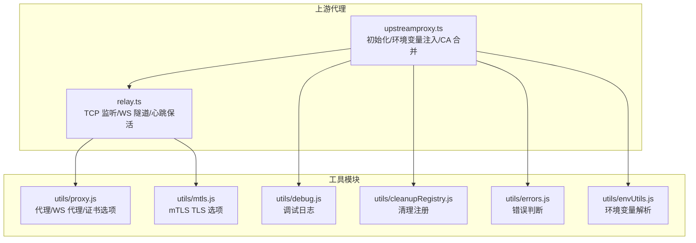
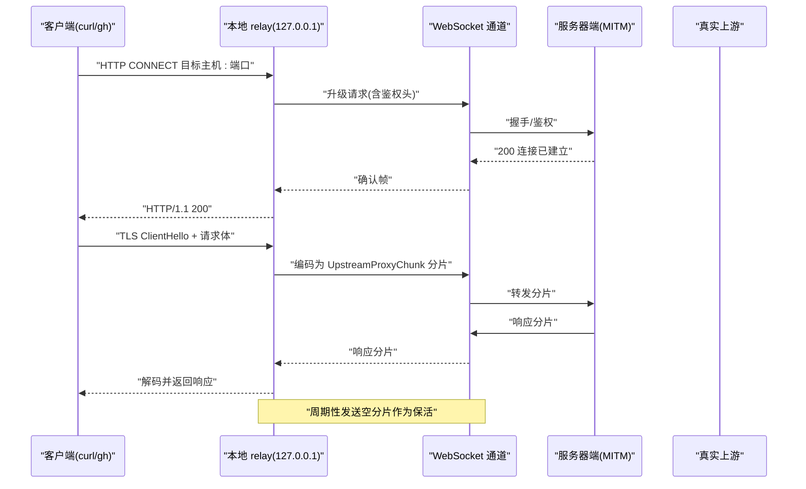
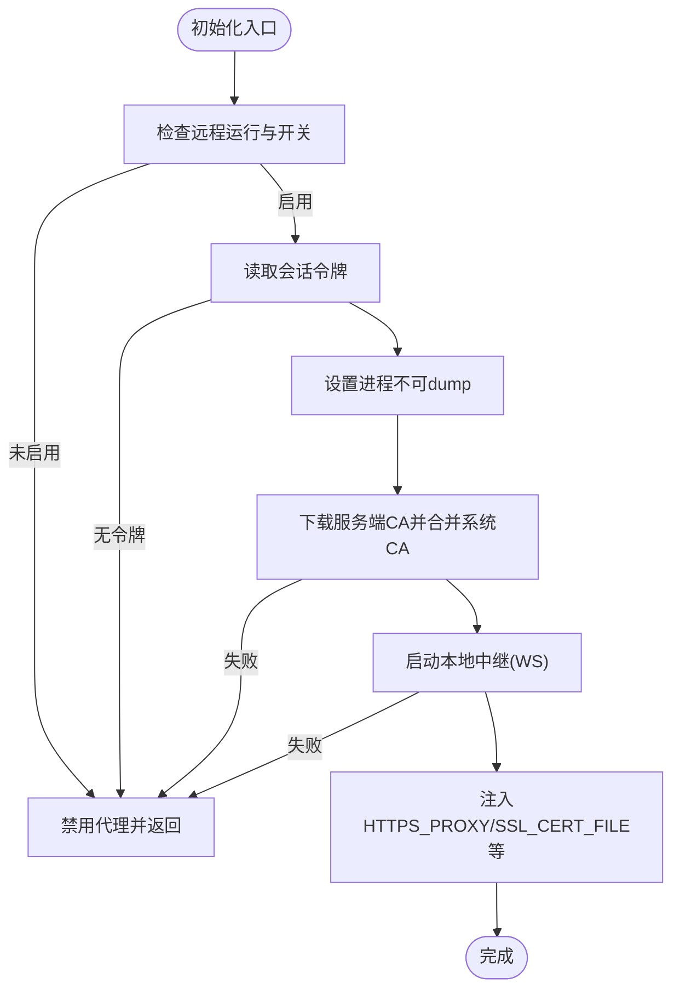
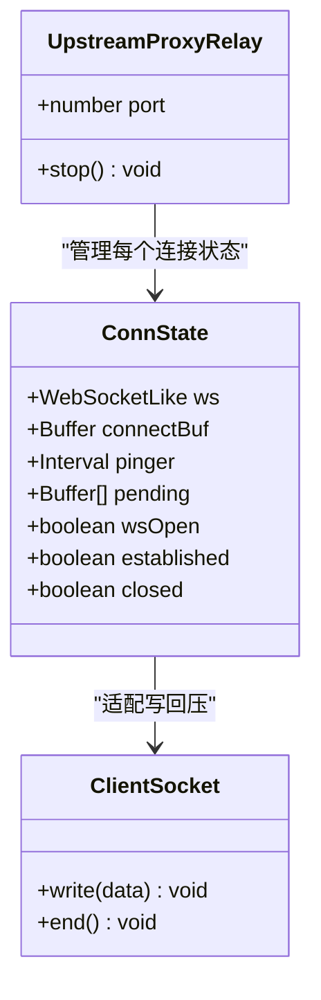
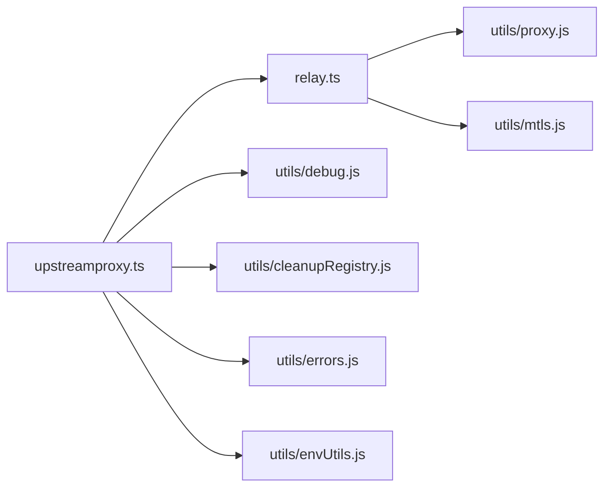

# 上游代理配置

<cite>
**本文档引用的文件**
- [src/upstreamproxy/upstreamproxy.ts](file://src/upstreamproxy/upstreamproxy.ts)
- [src/upstreamproxy/relay.ts](file://src/upstreamproxy/relay.ts)
- [src/utils/telemetry/instrumentation.ts](file://src/utils/telemetry/instrumentation.ts)
- [src/bridge/envLessBridgeConfig.ts](file://src/bridge/envLessBridgeConfig.ts)
- [src/bridge/bridgeMain.ts](file://src/bridge/bridgeMain.ts)
- [src/cli/transports/SerialBatchEventUploader.ts](file://src/cli/transports/SerialBatchEventUploader.ts)
- [src/cli/transports/SSETransport.ts](file://src/cli/transports/SSETransport.ts)
- [src/cli/transports/ccrClient.ts](file://src/cli/transports/ccrClient.ts)
- [src/utils/telemetry/logger.ts](file://src/utils/telemetry/logger.ts)
- [src/commands/plugin/PluginOptionsFlow.tsx](file://src/commands/plugin/PluginOptionsFlow.tsx)
- [src/commands/plugin/PluginOptionsDialog.tsx](file://src/commands/plugin/PluginOptionsDialog.tsx)
- [src/commands/plugin/PluginSettings.tsx](file://src/commands/plugin/PluginSettings.tsx)
- [src/commands/mcp/xaaIdpCommand.ts](file://src/commands/mcp/xaaIdpCommand.ts)
- [src/main.tsx](file://src/main.tsx)
</cite>

## 目录
1. [简介](#简介)
2. [项目结构](#项目结构)
3. [核心组件](#核心组件)
4. [架构总览](#架构总览)
5. [详细组件分析](#详细组件分析)
6. [依赖关系分析](#依赖关系分析)
7. [性能考虑](#性能考虑)
8. [故障排除指南](#故障排除指南)
9. [结论](#结论)
10. [附录](#附录)

## 简介
本文件系统性阐述上游代理（Upstream Proxy）在容器侧的实现与使用，涵盖代理初始化流程、代理地址与认证配置、MITM 证书注入、本地转发机制、网络优化策略（连接池、重试与超时）、安全防护（TLS/证书校验、访问控制）、监控与诊断（连接状态、性能指标、错误日志），以及扩展与定制化配置。目标是帮助开发者与运维人员正确部署、调优与排障上游代理。

## 项目结构
上游代理相关代码位于 src/upstreamproxy 目录，并与工具模块（如代理、mTLS、调试日志等）协同工作：
- upstreamproxy.ts：容器侧代理初始化、环境变量注入、CA 证书下载与合并、代理启用状态管理
- relay.ts：本地 TCP → WebSocket 的 CONNECT 隧道实现，负责数据分片、心跳保活、错误处理
- 工具与集成：代理/证书/日志/桥接配置等模块为上游代理提供运行时支撑

**图表来源**
- [src/upstreamproxy/upstreamproxy.ts:1-286](file://src/upstreamproxy/upstreamproxy.ts#L1-L286)
- [src/upstreamproxy/relay.ts:1-456](file://src/upstreamproxy/relay.ts#L1-L456)

**章节来源**
- [src/upstreamproxy/upstreamproxy.ts:1-286](file://src/upstreamproxy/upstreamproxy.ts#L1-L286)
- [src/upstreamproxy/relay.ts:1-456](file://src/upstreamproxy/relay.ts#L1-L456)

## 核心组件
- 上游代理初始化器
  - 读取会话令牌、设置进程不可转储、下载并合并 CA 证书、启动本地转发、暴露 HTTPS_PROXY/SSL_CERT_FILE 等环境变量
- 连接隧道中继
  - 监听本地回环端口，接收 HTTP CONNECT 请求，通过 WebSocket 将数据以二进制分片传输到服务器端，维持心跳保活，处理错误与关闭
- 环境变量注入
  - 仅在代理启用时注入 HTTPS 代理与证书路径；子进程继承代理环境变量，确保统一出站路由

关键职责与行为：
- 失败降级：任一步骤失败均记录警告并禁用代理，保证会话不被破坏
- 安全隔离：对令牌文件进行 unlink，避免堆转储泄露；Linux 平台设置 prctl 阻止同 UID 调试
- 证书信任：从服务端获取 CA，与系统证书合并写入用户目录，供下游程序信任 MITM 代理

**章节来源**
- [src/upstreamproxy/upstreamproxy.ts:79-153](file://src/upstreamproxy/upstreamproxy.ts#L79-L153)
- [src/upstreamproxy/upstreamproxy.ts:160-199](file://src/upstreamproxy/upstreamproxy.ts#L160-L199)
- [src/upstreamproxy/relay.ts:155-174](file://src/upstreamproxy/relay.ts#L155-L174)

## 架构总览
上游代理在容器内以“本地代理 + 服务器端 MITM”的模式工作：
- 客户端（curl/gh/kubectl 等）通过 HTTPS_PROXY 发送 HTTP CONNECT
- 本地 relay 接收 CONNECT，构造鉴权头，建立 WebSocket 升级
- 服务器端终止 TLS，注入组织凭证，转发至真实上游
- 数据以 UpstreamProxyChunk 分片经 WS 下发回客户端

**图表来源**
- [src/upstreamproxy/relay.ts:344-428](file://src/upstreamproxy/relay.ts#L344-L428)
- [src/upstreamproxy/relay.ts:66-103](file://src/upstreamproxy/relay.ts#L66-L103)

**章节来源**
- [src/upstreamproxy/relay.ts:1-17](file://src/upstreamproxy/relay.ts#L1-L17)
- [src/upstreamproxy/relay.ts:344-428](file://src/upstreamproxy/relay.ts#L344-L428)

## 详细组件分析

### 组件一：上游代理初始化器（upstreamproxy.ts）
职责与流程：
- 条件启用：仅当远程运行且上游代理开关开启时初始化
- 令牌读取：从固定路径读取会话令牌，不存在则禁用代理
- 安全加固：设置进程不可 dump，降低令牌泄露风险
- CA 获取与合并：从服务端下载 CA，与系统 CA 合并写入用户目录
- 中继启动：建立本地 WebSocket 隧道，注册清理函数
- 环境变量注入：仅在启用时注入 HTTPS_PROXY/SSL_CERT_FILE 等；若父进程已注入，子进程透传

关键点：
- 失败降级：任何步骤失败均记录警告并禁用代理
- NO_PROXY 列表：明确排除回环、RFC1918、IMDS、包仓库与 GitHub 等直连域名
- 代理只支持 HTTPS：HTTP CONNECT 才注入代理，明文 HTTP 不走代理以免 405

**图表来源**
- [src/upstreamproxy/upstreamproxy.ts:79-153](file://src/upstreamproxy/upstreamproxy.ts#L79-L153)

**章节来源**
- [src/upstreamproxy/upstreamproxy.ts:79-153](file://src/upstreamproxy/upstreamproxy.ts#L79-L153)
- [src/upstreamproxy/upstreamproxy.ts:160-199](file://src/upstreamproxy/upstreamproxy.ts#L160-L199)

### 组件二：连接隧道中继（relay.ts）
职责与流程：
- 监听本地回环端口，区分客户端数据阶段（累积 CONNECT 请求）与隧道阶段（转发数据）
- 建立 WebSocket 升级，携带鉴权头；服务端返回“已建立”后开始转发
- 数据分片：按最大分片大小切片，避免网关缓冲上限
- 心跳保活：定时发送空分片维持连接活性
- 错误处理：WS 错误或关闭时，若尚未建立则返回 502，否则直接关闭

运行时适配：
- Bun 与 Node 双栈：Bun 使用原生监听与写缓冲队列，Node 使用 net.createServer
- 代理与 TLS：根据运行时选择 ws 包代理或 Bun 原生代理 URL + TLS 选项

**图表来源**
- [src/upstreamproxy/relay.ts:105-127](file://src/upstreamproxy/relay.ts#L105-L127)
- [src/upstreamproxy/relay.ts:135-138](file://src/upstreamproxy/relay.ts#L135-L138)

**章节来源**
- [src/upstreamproxy/relay.ts:155-174](file://src/upstreamproxy/relay.ts#L155-L174)
- [src/upstreamproxy/relay.ts:295-342](file://src/upstreamproxy/relay.ts#L295-L342)
- [src/upstreamproxy/relay.ts:344-428](file://src/upstreamproxy/relay.ts#L344-L428)

### 组件三：环境变量注入与子进程继承
- 当上游代理启用时，注入 HTTPS 代理与证书路径，确保 Bash/MCP/LSP/Hook 等子进程统一走代理
- 若父进程已注入代理变量，子进程透传这些变量，避免重复初始化

**章节来源**
- [src/upstreamproxy/upstreamproxy.ts:160-199](file://src/upstreamproxy/upstreamproxy.ts#L160-L199)

### 组件四：代理/证书/日志工具（跨模块集成）
- 代理与 WebSocket 代理：为上游代理的 WS 升级提供代理与 TLS 选项
- 日志与诊断：统一的调试日志输出，便于定位代理初始化与中继问题
- 桥接配置：心跳间隔、抖动、超时等参数影响连接稳定性与资源占用

**章节来源**
- [src/utils/telemetry/instrumentation.ts:790-825](file://src/utils/telemetry/instrumentation.ts#L790-L825)
- [src/utils/telemetry/logger.ts:1-26](file://src/utils/telemetry/logger.ts#L1-L26)
- [src/bridge/envLessBridgeConfig.ts:60-84](file://src/bridge/envLessBridgeConfig.ts#L60-L84)

## 依赖关系分析
上游代理模块之间的耦合与协作：
- upstreamproxy.ts 依赖 relay.ts 提供本地中继能力
- relay.ts 依赖代理/证书工具模块提供 WS 升级所需的代理与 TLS 选项
- 初始化器通过调试日志与错误工具记录状态与异常
- 子进程通过环境变量继承代理配置，形成统一出站链路

**图表来源**
- [src/upstreamproxy/upstreamproxy.ts:22-29](file://src/upstreamproxy/upstreamproxy.ts#L22-L29)
- [src/upstreamproxy/relay.ts:19-22](file://src/upstreamproxy/relay.ts#L19-L22)

**章节来源**
- [src/upstreamproxy/upstreamproxy.ts:22-29](file://src/upstreamproxy/upstreamproxy.ts#L22-L29)
- [src/upstreamproxy/relay.ts:19-22](file://src/upstreamproxy/relay.ts#L19-L22)

## 性能考虑
- 连接池与并发
  - 本地中继为每个客户端连接维护独立的 WebSocket，未显式复用；建议在上游代理之外由应用层管理连接池
- 分片与背压
  - 数据按最大分片大小切片，避免单次消息过大；Bun 写缓冲采用队列尾追加，确保不丢数据
- 心跳与保活
  - 定期发送空分片维持连接活性，避免网关空闲回收
- 超时与重试
  - CA 获取设置 5 秒超时，防止启动阻塞；其他组件（如桥接、SSE 传输、事件上传）具备指数退避与抖动策略
- 抖动与退避
  - 桥接与事件上传采用抖动与指数退避，避免雪崩效应

**章节来源**
- [src/upstreamproxy/relay.ts:49-54](file://src/upstreamproxy/relay.ts#L49-L54)
- [src/upstreamproxy/relay.ts:430-434](file://src/upstreamproxy/relay.ts#L430-L434)
- [src/upstreamproxy/upstreamproxy.ts:261-264](file://src/upstreamproxy/upstreamproxy.ts#L261-L264)
- [src/bridge/bridgeMain.ts:1268-1316](file://src/bridge/bridgeMain.ts#L1268-L1316)
- [src/cli/transports/SerialBatchEventUploader.ts:235-275](file://src/cli/transports/SerialBatchEventUploader.ts#L235-L275)
- [src/cli/transports/SSETransport.ts:177-188](file://src/cli/transports/SSETransport.ts#L177-L188)

## 故障排除指南
常见问题与排查步骤：

- 无法启用代理
  - 检查远程运行标志与上游代理开关是否开启
  - 确认会话令牌文件存在且可读
  - 观察 CA 下载是否成功（5 秒超时），失败则禁用代理
  - 查看调试日志中的警告信息
  - 参考：[src/upstreamproxy/upstreamproxy.ts:85-103](file://src/upstreamproxy/upstreamproxy.ts#L85-L103)，[src/upstreamproxy/upstreamproxy.ts:125-130](file://src/upstreamproxy/upstreamproxy.ts#L125-L130)

- 代理已启用但子进程未走代理
  - 确认父进程已注入 HTTPS_PROXY/SSL_CERT_FILE 等变量
  - 子进程透传这些变量，无需重复初始化
  - 参考：[src/upstreamproxy/upstreamproxy.ts:167-182](file://src/upstreamproxy/upstreamproxy.ts#L167-L182)

- 连接失败或 502
  - 检查 WS 升级是否成功，确认鉴权头与代理 URL 正确
  - 若 WS 错误发生在“已建立”之前，将返回 502；之后错误直接关闭连接
  - 参考：[src/upstreamproxy/relay.ts:378-428](file://src/upstreamproxy/relay.ts#L378-L428)

- 心跳中断或频繁断开
  - 检查保活分片是否正常发送
  - 观察上游服务端心跳配置与网络延迟
  - 参考：[src/upstreamproxy/relay.ts:430-434](file://src/upstreamproxy/relay.ts#L430-L434)，[src/bridge/envLessBridgeConfig.ts:60-84](file://src/bridge/envLessBridgeConfig.ts#L60-L84)

- 证书校验失败
  - 确认合并后的 CA 文件路径正确，系统 CA 与服务端 CA 成功合并
  - 参考：[src/upstreamproxy/upstreamproxy.ts:274-277](file://src/upstreamproxy/upstreamproxy.ts#L274-L277)

- 代理绕过与直连
  - NO_PROXY 列表覆盖回环、RFC1918、IMDS、包仓库与 GitHub 等直连域名
  - 参考：[src/upstreamproxy/upstreamproxy.ts:37-63](file://src/upstreamproxy/upstreamproxy.ts#L37-L63)

- 重试与退避
  - 对于连接错误与服务器错误，采用指数退避与抖动；必要时检测系统休眠导致的长间隔
  - 参考：[src/bridge/bridgeMain.ts:1268-1316](file://src/bridge/bridgeMain.ts#L1268-L1316)，[src/cli/transports/SerialBatchEventUploader.ts:235-275](file://src/cli/transports/SerialBatchEventUploader.ts#L235-L275)

**章节来源**
- [src/upstreamproxy/upstreamproxy.ts:85-103](file://src/upstreamproxy/upstreamproxy.ts#L85-L103)
- [src/upstreamproxy/upstreamproxy.ts:125-130](file://src/upstreamproxy/upstreamproxy.ts#L125-L130)
- [src/upstreamproxy/upstreamproxy.ts:167-182](file://src/upstreamproxy/upstreamproxy.ts#L167-L182)
- [src/upstreamproxy/relay.ts:378-428](file://src/upstreamproxy/relay.ts#L378-L428)
- [src/upstreamproxy/relay.ts:430-434](file://src/upstreamproxy/relay.ts#L430-L434)
- [src/upstreamproxy/upstreamproxy.ts:274-277](file://src/upstreamproxy/upstreamproxy.ts#L274-L277)
- [src/upstreamproxy/upstreamproxy.ts:37-63](file://src/upstreamproxy/upstreamproxy.ts#L37-L63)
- [src/bridge/bridgeMain.ts:1268-1316](file://src/bridge/bridgeMain.ts#L1268-L1316)
- [src/cli/transports/SerialBatchEventUploader.ts:235-275](file://src/cli/transports/SerialBatchEventUploader.ts#L235-L275)

## 结论
上游代理通过“本地代理 + 服务器端 MITM”的组合，在容器内实现了对 HTTPS 流量的统一拦截与转发。其设计强调失败降级、安全加固与统一出站，配合心跳保活与合理的超时/重试策略，能够在复杂网络环境中保持稳定。通过环境变量注入与 NO_PROXY 列表，既能满足代理需求，又能避免对直连服务的影响。建议在生产中结合日志与诊断工具持续观测代理状态，按需调整心跳与退避参数，确保性能与可靠性平衡。

## 附录

### 配置项与环境变量速查
- 启用条件
  - 远程运行标志与上游代理开关
  - 参考：[src/upstreamproxy/upstreamproxy.ts:85-94](file://src/upstreamproxy/upstreamproxy.ts#L85-L94)
- 会话令牌
  - 默认路径与读取逻辑
  - 参考：[src/upstreamproxy/upstreamproxy.ts:105-110](file://src/upstreamproxy/upstreamproxy.ts#L105-L110)，[src/upstreamproxy/upstreamproxy.ts:206-218](file://src/upstreamproxy/upstreamproxy.ts#L206-L218)
- 服务端基础 URL
  - 优先使用传参，其次环境变量，最后默认值
  - 参考：[src/upstreamproxy/upstreamproxy.ts:118-122](file://src/upstreamproxy/upstreamproxy.ts#L118-L122)
- CA 证书
  - 下载与合并系统 CA，写入用户目录
  - 参考：[src/upstreamproxy/upstreamproxy.ts:122-130](file://src/upstreamproxy/upstreamproxy.ts#L122-L130)，[src/upstreamproxy/upstreamproxy.ts:254-285](file://src/upstreamproxy/upstreamproxy.ts#L254-L285)
- 本地代理
  - 注入 HTTPS_PROXY/SSL_CERT_FILE 等，NO_PROXY 列表
  - 参考：[src/upstreamproxy/upstreamproxy.ts:160-199](file://src/upstreamproxy/upstreamproxy.ts#L160-L199)，[src/upstreamproxy/upstreamproxy.ts:37-63](file://src/upstreamproxy/upstreamproxy.ts#L37-L63)
- 代理/证书/日志工具
  - 代理与 TLS 选项、日志输出
  - 参考：[src/utils/telemetry/instrumentation.ts:790-825](file://src/utils/telemetry/instrumentation.ts#L790-L825)，[src/utils/telemetry/logger.ts:1-26](file://src/utils/telemetry/logger.ts#L1-L26)

### 扩展与定制化
- 自定义路径与参数
  - 支持覆盖令牌路径、系统 CA 路径、合并 CA 输出路径、服务端基础 URL
  - 参考：[src/upstreamproxy/upstreamproxy.ts:79-84](file://src/upstreamproxy/upstreamproxy.ts#L79-L84)
- 插件与 MCP 配置
  - 通过插件选项对话框与设置页面进行配置与保存
  - 参考：[src/commands/plugin/PluginOptionsFlow.tsx:1-67](file://src/commands/plugin/PluginOptionsFlow.tsx#L1-L67)，[src/commands/plugin/PluginOptionsDialog.tsx:38-97](file://src/commands/plugin/PluginOptionsDialog.tsx#L38-L97)，[src/commands/plugin/PluginSettings.tsx:299-333](file://src/commands/plugin/PluginSettings.tsx#L299-L333)
- MCP IdP 管理
  - XAA IdP 连接的配置与缓存
  - 参考：[src/commands/mcp/xaaIdpCommand.ts:1-27](file://src/commands/mcp/xaaIdpCommand.ts#L1-L27)
- 全局环境变量应用
  - 在主入口加载后应用配置环境变量
  - 参考：[src/main.tsx:469-483](file://src/main.tsx#L469-L483)，[src/main.tsx:1965-1971](file://src/main.tsx#L1965-L1971)