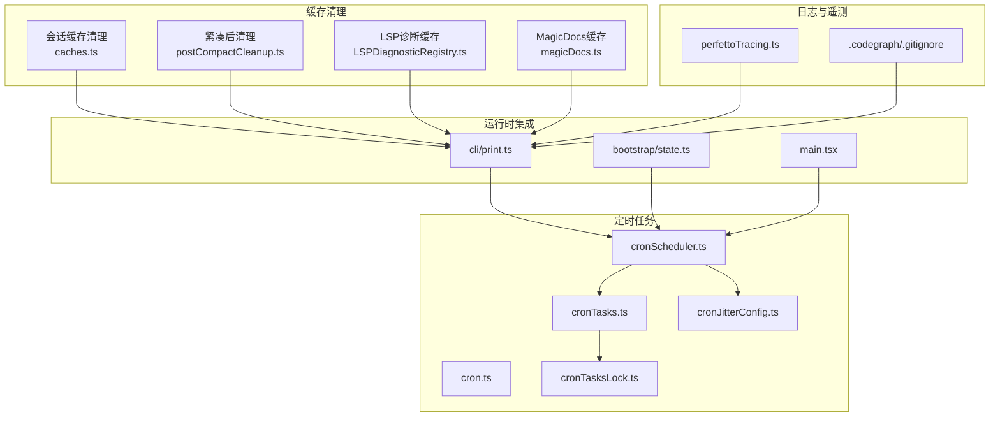
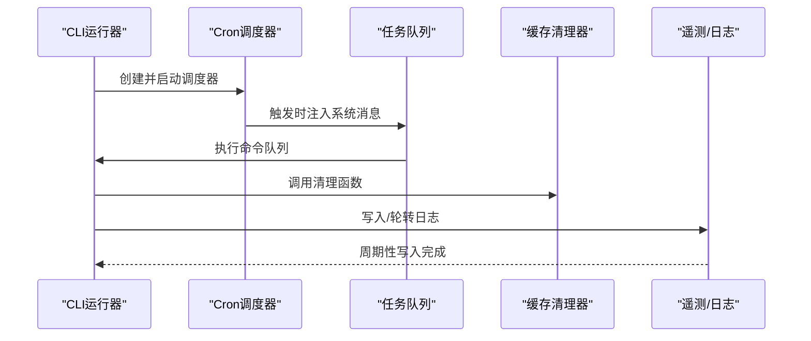
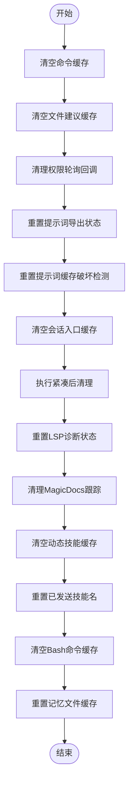
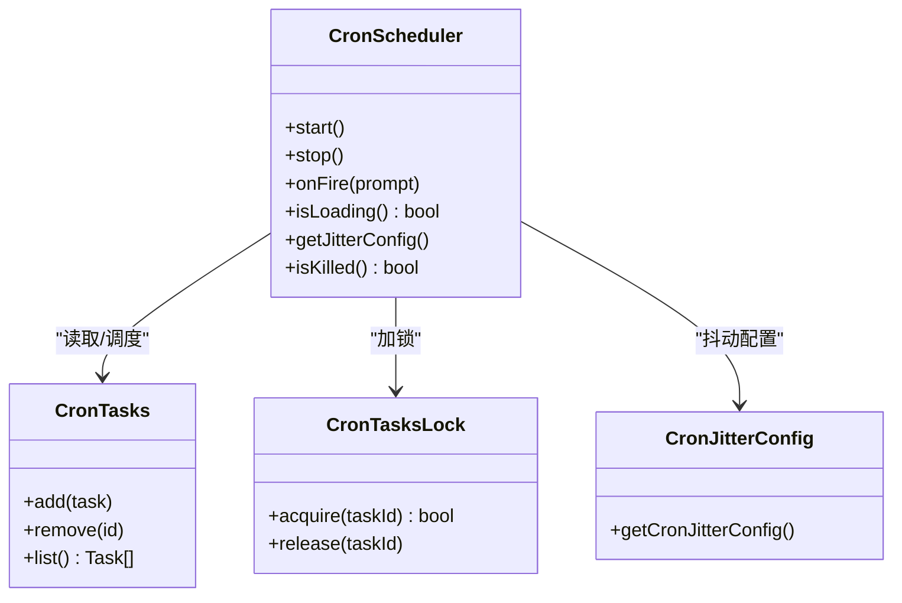
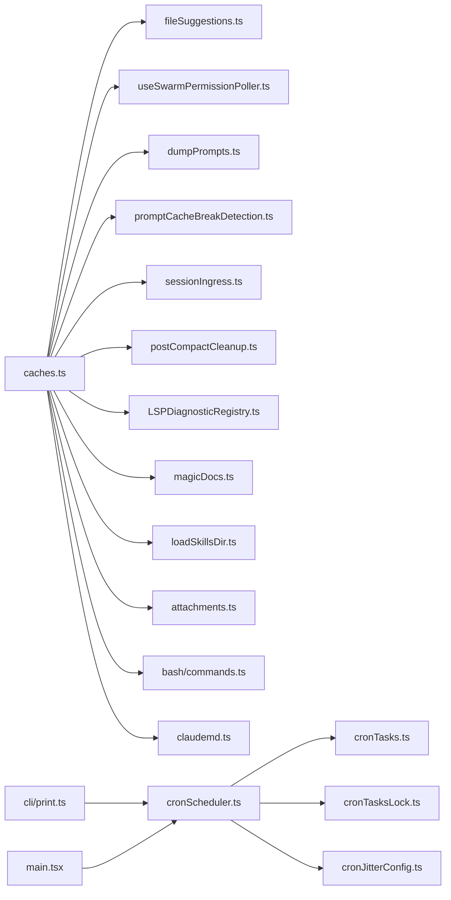

# 后台维护任务

<cite>
**本文引用的文件**
- [src/commands/clear/caches.ts](file://src/commands/clear/caches.ts)
- [src/bootstrap/state.ts](file://src/bootstrap/state.ts)
- [src/utils/cron.ts](file://src/utils/cron.ts)
- [src/utils/cronScheduler.ts](file://src/utils/cronScheduler.ts)
- [src/utils/cronTasks.ts](file://src/utils/cronTasks.ts)
- [src/utils/cronTasksLock.ts](file://src/utils/cronTasksLock.ts)
- [src/utils/cronJitterConfig.ts](file://src/utils/cronJitterConfig.ts)
- [src/cli/print.ts](file://src/cli/print.ts)
- [src/services/compact/postCompactCleanup.ts](file://src/services/compact/postCompactCleanup.ts)
- [src/services/lsp/LSPDiagnosticRegistry.ts](file://src/services/lsp/LSPDiagnosticRegistry.ts)
- [src/services/MagicDocs/magicDocs.ts](file://src/services/MagicDocs/magicDocs.ts)
- [src/hooks/fileSuggestions.ts](file://src/hooks/fileSuggestions.ts)
- [src/hooks/useSwarmPermissionPoller.ts](file://src/hooks/useSwarmPermissionPoller.ts)
- [src/services/api/dumpPrompts.ts](file://src/services/api/dumpPrompts.ts)
- [src/services/api/promptCacheBreakDetection.ts](file://src/services/api/promptCacheBreakDetection.ts)
- [src/services/api/sessionIngress.ts](file://src/services/api/sessionIngress.ts)
- [src/skills/loadSkillsDir.ts](file://src/skills/loadSkillsDir.ts)
- [src/utils/attachments.ts](file://src/utils/attachments.ts)
- [src/utils/bash/commands.ts](file://src/utils/bash/commands.ts)
- [src/utils/claudemd.ts](file://src/utils/claudemd.ts)
- [src/utils/backgroundHousekeeping.ts](file://src/utils/backgroundHousekeeping.ts)
- [src/utils/telemetry/perfettoTracing.ts](file://src/utils/telemetry/perfettoTracing.ts)
- [src/main.tsx](file://src/main.tsx)
- [src/tasks.ts](file://src/tasks.ts)
- [src/tools/ScheduleCronTool/prompt.js](file://src/tools/ScheduleCronTool/prompt.js)
- [.codegraph/.gitignore](file://.codegraph/.gitignore)
</cite>

## 目录
1. [简介](#简介)
2. [项目结构](#项目结构)
3. [核心组件](#核心组件)
4. [架构总览](#架构总览)
5. [详细组件分析](#详细组件分析)
6. [依赖关系分析](#依赖关系分析)
7. [性能考量](#性能考量)
8. [故障排查指南](#故障排查指南)
9. [结论](#结论)
10. [附录](#附录)

## 简介
本文件系统性阐述后台维护任务的设计与实现，覆盖以下主题：
- 缓存清理策略与实现：临时文件清理、过期数据删除、存储空间回收
- 日志轮转配置：日志级别、文件大小限制、保留策略
- 数据库维护任务：索引重建、统计信息更新、碎片整理
- 定时任务调度机制：Cron 表达式、任务优先级、并发控制
- 维护任务监控与告警：执行状态跟踪、性能指标收集、异常通知
- 自定义扩展与故障处理流程

## 项目结构
后台维护任务涉及多个子系统协同工作：
- 缓存清理：集中于命令模块与工具函数，按功能域分层清理
- 定时任务：基于 Cron 的调度器、任务锁与抖动配置
- 日志与遥测：内置日志轮转与性能追踪
- 数据库维护：通过服务层触发的统计与索引维护（如适用）
- 运行时集成：CLI 模式下的调度器启动与队列注入

图示来源
- [src/commands/clear/caches.ts:1-29](file://src/commands/clear/caches.ts#L1-L29)
- [src/services/compact/postCompactCleanup.ts](file://src/services/compact/postCompactCleanup.ts)
- [src/services/lsp/LSPDiagnosticRegistry.ts](file://src/services/lsp/LSPDiagnosticRegistry.ts)
- [src/services/MagicDocs/magicDocs.ts](file://src/services/MagicDocs/magicDocs.ts)
- [src/utils/cron.ts](file://src/utils/cron.ts)
- [src/utils/cronScheduler.ts](file://src/utils/cronScheduler.ts)
- [src/utils/cronTasks.ts](file://src/utils/cronTasks.ts)
- [src/utils/cronTasksLock.ts](file://src/utils/cronTasksLock.ts)
- [src/utils/cronJitterConfig.ts](file://src/utils/cronJitterConfig.ts)
- [src/cli/print.ts:2696-2734](file://src/cli/print.ts#L2696-L2734)
- [src/bootstrap/state.ts:1272-1315](file://src/bootstrap/state.ts#L1272-L1315)
- [src/main.tsx:2344-2359](file://src/main.tsx#L2344-L2359)
- [src/utils/telemetry/perfettoTracing.ts:1103-1120](file://src/utils/telemetry/perfettoTracing.ts#L1103-L1120)
- [.codegraph/.gitignore:1-16](file://.codegraph/.gitignore#L1-L16)

章节来源
- [src/commands/clear/caches.ts:1-29](file://src/commands/clear/caches.ts#L1-L29)
- [src/cli/print.ts:2696-2734](file://src/cli/print.ts#L2696-L2734)
- [src/bootstrap/state.ts:1272-1315](file://src/bootstrap/state.ts#L1272-L1315)
- [src/main.tsx:2344-2359](file://src/main.tsx#L2344-L2359)
- [.codegraph/.gitignore:1-16](file://.codegraph/.gitignore#L1-L16)

## 核心组件
- 缓存清理器：集中于会话缓存清理入口，按功能域调用具体清理函数，覆盖命令缓存、文件建议、权限轮询、提示词导出、记忆文件等
- 定时任务调度器：支持 Cron 表达式解析、任务锁、抖动配置、加载状态与生命周期管理
- 日志与遥测：提供周期写入与事件溢出清理能力，配合忽略规则进行轮转
- 运行时集成：CLI 模式下创建调度器并注入到命令队列；主进程在特定模式下启用调度器

章节来源
- [src/commands/clear/caches.ts:1-29](file://src/commands/clear/caches.ts#L1-L29)
- [src/utils/cronScheduler.ts](file://src/utils/cronScheduler.ts)
- [src/utils/cronTasks.ts](file://src/utils/cronTasks.ts)
- [src/utils/cronTasksLock.ts](file://src/utils/cronTasksLock.ts)
- [src/utils/cronJitterConfig.ts](file://src/utils/cronJitterConfig.ts)
- [src/utils/telemetry/perfettoTracing.ts:1103-1120](file://src/utils/telemetry/perfettoTracing.ts#L1103-L1120)
- [src/cli/print.ts:2696-2734](file://src/cli/print.ts#L2696-L2734)

## 架构总览
后台维护任务由“缓存清理”“定时任务调度”“日志与遥测”三大部分组成，并在 CLI 模式下与命令队列集成。

图示来源
- [src/cli/print.ts:2696-2734](file://src/cli/print.ts#L2696-L2734)
- [src/utils/cronScheduler.ts](file://src/utils/cronScheduler.ts)
- [src/commands/clear/caches.ts:1-29](file://src/commands/clear/caches.ts#L1-L29)
- [src/utils/telemetry/perfettoTracing.ts:1103-1120](file://src/utils/telemetry/perfettoTracing.ts#L1103-L1120)

## 详细组件分析

### 缓存清理策略与实现
- 清理范围
  - 命令缓存：清空命令前缀缓存
  - 文件建议缓存：重置文件建议缓存
  - 权限轮询缓存：清理所有待处理回调
  - 提示词导出缓存：重置导出状态
  - 提示词缓存破坏检测：重置检测状态
  - 会话入口缓存：清空所有会话
  - 紧凑后清理：执行紧凑后的收尾清理
  - LSP诊断注册表：重置诊断状态
  - MagicDocs：清理已跟踪的文档
  - 动态技能：清空动态技能缓存
  - 附件发送记录：重置已发送技能名
  - Bash命令缓存：清空命令缓存
  - 记忆文件缓存：重置获取记忆文件缓存
- 存储空间回收
  - 通过清理大对象缓存与临时状态，释放内存占用，间接回收磁盘空间（例如导出文件、日志文件）
- 过期数据删除
  - 通过重置状态与注册表，使后续访问触发惰性重建，避免陈旧数据滞留

图示来源
- [src/commands/clear/caches.ts:1-29](file://src/commands/clear/caches.ts#L1-L29)
- [src/services/compact/postCompactCleanup.ts](file://src/services/compact/postCompactCleanup.ts)
- [src/services/lsp/LSPDiagnosticRegistry.ts](file://src/services/lsp/LSPDiagnosticRegistry.ts)
- [src/services/MagicDocs/magicDocs.ts](file://src/services/MagicDocs/magicDocs.ts)
- [src/hooks/fileSuggestions.ts](file://src/hooks/fileSuggestions.ts)
- [src/hooks/useSwarmPermissionPoller.ts](file://src/hooks/useSwarmPermissionPoller.ts)
- [src/services/api/dumpPrompts.ts](file://src/services/api/dumpPrompts.ts)
- [src/services/api/promptCacheBreakDetection.ts](file://src/services/api/promptCacheBreakDetection.ts)
- [src/services/api/sessionIngress.ts](file://src/services/api/sessionIngress.ts)
- [src/skills/loadSkillsDir.ts](file://src/skills/loadSkillsDir.ts)
- [src/utils/attachments.ts](file://src/utils/attachments.ts)
- [src/utils/bash/commands.ts](file://src/utils/bash/commands.ts)
- [src/utils/claudemd.ts](file://src/utils/claudemd.ts)

章节来源
- [src/commands/clear/caches.ts:1-29](file://src/commands/clear/caches.ts#L1-L29)

### 日志轮转配置
- 忽略规则
  - 代码图数据文件、数据库文件、缓存目录、日志文件、钩子标记文件均被忽略，避免纳入版本控制或误操作
- 遥测与日志
  - 提供周期性写入与事件溢出清理接口，便于在维护窗口内落盘与清理
- 建议实践
  - 结合外部日志轮转工具（如 logrotate）对应用日志进行大小与数量限制
  - 在 CI 或生产环境为日志输出指定独立目录，配合忽略规则统一管理

章节来源
- [.codegraph/.gitignore:1-16](file://.codegraph/.gitignore#L1-L16)
- [src/utils/telemetry/perfettoTracing.ts:1103-1120](file://src/utils/telemetry/perfettoTracing.ts#L1103-L1120)

### 数据库维护任务
- 索引重建与统计信息更新
  - 通过服务层触发统计信息更新与索引维护（如适用），确保查询计划最优
- 碎片整理
  - 紧凑流程完成后执行收尾清理，减少存储碎片与冗余
- 建议实践
  - 在低峰时段执行索引重建与统计信息更新
  - 对大型表采用在线维护策略，必要时结合备份恢复验证

章节来源
- [src/services/compact/postCompactCleanup.ts](file://src/services/compact/postCompactCleanup.ts)

### 定时任务调度机制
- Cron 表达式
  - 使用通用 Cron 解析器解析表达式，支持秒、分钟、小时、日期、月份、星期字段
- 任务锁
  - 通过任务锁避免同一任务并发执行，保证幂等性
- 抖动配置
  - 支持抖动配置以分散负载，降低同时触发风险
- 生命周期与加载状态
  - 调度器根据运行状态与加载状态决定是否执行任务
- CLI 集成
  - 在具备特性开关且满足条件时，CLI 创建调度器并将触发的消息注入命令队列

图示来源
- [src/utils/cronScheduler.ts](file://src/utils/cronScheduler.ts)
- [src/utils/cronTasks.ts](file://src/utils/cronTasks.ts)
- [src/utils/cronTasksLock.ts](file://src/utils/cronTasksLock.ts)
- [src/utils/cronJitterConfig.ts](file://src/utils/cronJitterConfig.ts)

章节来源
- [src/utils/cron.ts](file://src/utils/cron.ts)
- [src/utils/cronScheduler.ts](file://src/utils/cronScheduler.ts)
- [src/utils/cronTasks.ts](file://src/utils/cronTasks.ts)
- [src/utils/cronTasksLock.ts](file://src/utils/cronTasksLock.ts)
- [src/utils/cronJitterConfig.ts](file://src/utils/cronJitterConfig.ts)
- [src/cli/print.ts:2696-2734](file://src/cli/print.ts#L2696-L2734)

### 监控与告警
- 执行状态跟踪
  - 通过调度器的生命周期方法与任务锁状态判断任务执行情况
- 性能指标收集
  - 利用遥测接口进行周期性写入与事件溢出清理，辅助评估维护窗口对性能的影响
- 异常通知
  - CLI 模式下可将系统生成的任务消息注入命令队列，便于统一处理与告警

章节来源
- [src/utils/telemetry/perfettoTracing.ts:1103-1120](file://src/utils/telemetry/perfettoTracing.ts#L1103-L1120)
- [src/cli/print.ts:2696-2734](file://src/cli/print.ts#L2696-L2734)

### 自定义扩展与故障处理
- 扩展点
  - 新增缓存清理函数：在缓存清理入口中注册，确保在维护窗口统一调用
  - 新增定时任务：通过调度器添加任务并设置抖动与锁策略
- 故障处理
  - 任务锁失败：回退至等待下一周期或降级处理
  - 调度器被终止：检查特性开关与加载状态，确保安全退出
  - 紧凑后清理失败：记录错误并尝试重试或回滚

章节来源
- [src/commands/clear/caches.ts:1-29](file://src/commands/clear/caches.ts#L1-L29)
- [src/utils/cronTasksLock.ts](file://src/utils/cronTasksLock.ts)
- [src/utils/cronScheduler.ts](file://src/utils/cronScheduler.ts)

## 依赖关系分析
- 组件耦合
  - 缓存清理器与各功能域模块解耦，通过统一入口聚合调用
  - 调度器与任务队列、锁与抖动配置松耦合，便于替换与扩展
- 外部依赖
  - CLI 模式依赖特性开关与运行状态，确保仅在受控环境下启用调度器
  - 日志轮转依赖忽略规则与外部工具，避免误删或误备份

图示来源
- [src/commands/clear/caches.ts:1-29](file://src/commands/clear/caches.ts#L1-L29)
- [src/cli/print.ts:2696-2734](file://src/cli/print.ts#L2696-L2734)
- [src/main.tsx:2344-2359](file://src/main.tsx#L2344-L2359)

章节来源
- [src/commands/clear/caches.ts:1-29](file://src/commands/clear/caches.ts#L1-L29)
- [src/cli/print.ts:2696-2734](file://src/cli/print.ts#L2696-L2734)
- [src/main.tsx:2344-2359](file://src/main.tsx#L2344-L2359)

## 性能考量
- 缓存清理
  - 分批清理与惰性重建相结合，避免一次性大开销
  - 紧凑后清理减少碎片，提升后续读写性能
- 定时任务
  - 抖动配置分散负载，避免高峰时段集中触发
  - 任务锁防止重复执行，降低无效计算
- 日志与遥测
  - 周期性写入与事件溢出清理，平衡 I/O 与内存占用

## 故障排查指南
- 缓存清理未生效
  - 检查清理入口是否被调用，确认对应功能域缓存是否被重置
- 定时任务未触发
  - 检查特性开关、调度器状态与 Cron 表达式
  - 查看任务锁是否被占用，确认抖动配置是否合理
- 日志轮转异常
  - 检查忽略规则与外部轮转配置，确认日志文件路径正确
- 紧凑后清理失败
  - 查看错误日志并尝试重试，必要时回滚到上一个版本

章节来源
- [src/commands/clear/caches.ts:1-29](file://src/commands/clear/caches.ts#L1-L29)
- [src/utils/cronScheduler.ts](file://src/utils/cronScheduler.ts)
- [src/utils/cronTasksLock.ts](file://src/utils/cronTasksLock.ts)
- [src/utils/telemetry/perfettoTracing.ts:1103-1120](file://src/utils/telemetry/perfettoTracing.ts#L1103-L1120)

## 结论
该后台维护任务体系通过“缓存清理—定时调度—日志遥测”的协同设计，在保障系统稳定性的同时兼顾性能与可观测性。建议在生产环境中结合外部日志轮转与数据库维护策略，制定明确的维护窗口与告警阈值，持续优化任务锁与抖动配置，确保高可用与低干扰。

## 附录
- 关键实现位置参考
  - 缓存清理入口：[src/commands/clear/caches.ts:1-29](file://src/commands/clear/caches.ts#L1-L29)
  - 定时调度器：[src/utils/cronScheduler.ts](file://src/utils/cronScheduler.ts)
  - 任务锁：[src/utils/cronTasksLock.ts](file://src/utils/cronTasksLock.ts)
  - 抖动配置：[src/utils/cronJitterConfig.ts](file://src/utils/cronJitterConfig.ts)
  - CLI 集成：[src/cli/print.ts:2696-2734](file://src/cli/print.ts#L2696-L2734)
  - 主进程启动：[src/main.tsx:2344-2359](file://src/main.tsx#L2344-L2359)
  - 遥测接口：[src/utils/telemetry/perfettoTracing.ts:1103-1120](file://src/utils/telemetry/perfettoTracing.ts#L1103-L1120)
  - 忽略规则：[.codegraph/.gitignore:1-16](file://.codegraph/.gitignore#L1-L16)