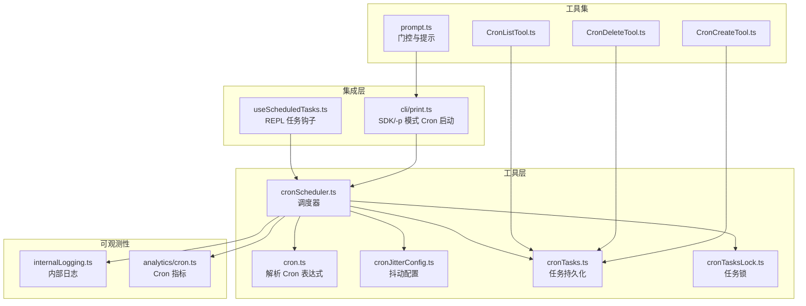
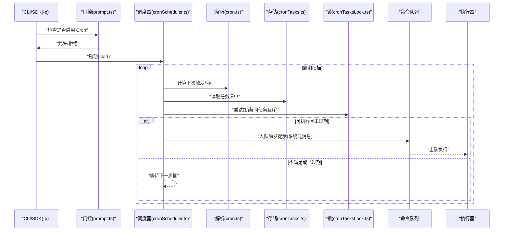
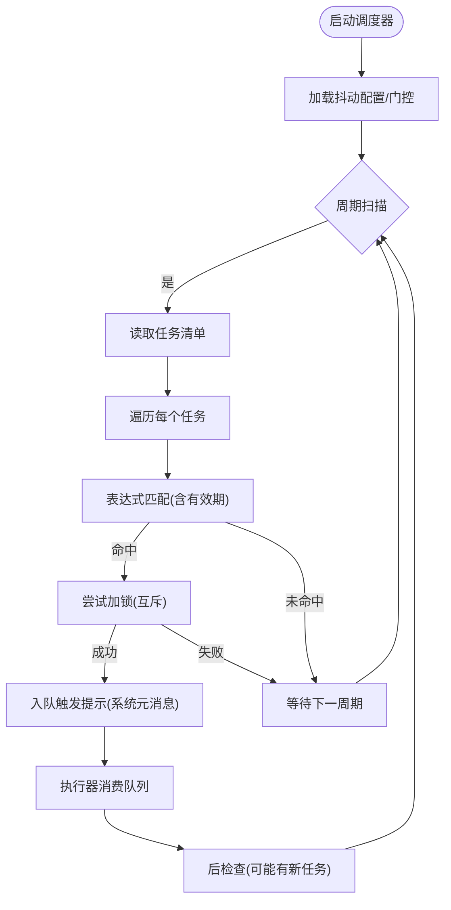
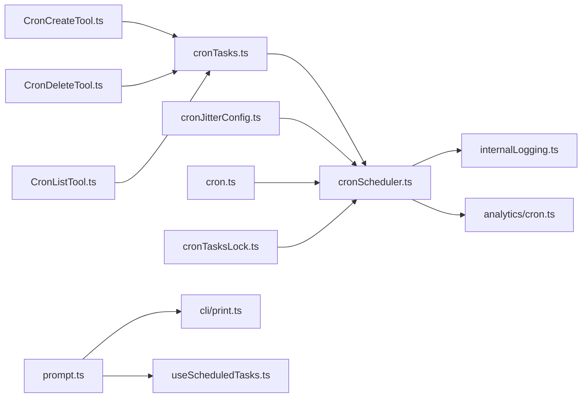

# 定时任务调度

<cite>
**本文引用的文件**
- [src/utils/cron.ts](file://src/utils/cron.ts)
- [src/utils/cronJitterConfig.ts](file://src/utils/cronJitterConfig.ts)
- [src/utils/cronScheduler.ts](file://src/utils/cronScheduler.ts)
- [src/utils/cronTasks.ts](file://src/utils/cronTasks.ts)
- [src/utils/cronTasksLock.ts](file://src/utils/cronTasksLock.ts)
- [src/tools/ScheduleCronTool/CronCreateTool.ts](file://src/tools/ScheduleCronTool/CronCreateTool.ts)
- [src/tools/ScheduleCronTool/CronDeleteTool.ts](file://src/tools/ScheduleCronTool/CronDeleteTool.ts)
- [src/tools/ScheduleCronTool/CronListTool.ts](file://src/tools/ScheduleCronTool/CronListTool.ts)
- [src/tools/ScheduleCronTool/prompt.ts](file://src/tools/ScheduleCronTool/prompt.ts)
- [src/cli/print.ts](file://src/cli/print.ts)
- [src/hooks/useScheduledTasks.ts](file://src/hooks/useScheduledTasks.ts)
- [src/services/internalLogging.ts](file://src/services/internalLogging.ts)
- [src/services/analytics/cron.ts](file://src/services/analytics/cron.ts)
</cite>

## 目录
1. [简介](#简介)
2. [项目结构](#项目结构)
3. [核心组件](#核心组件)
4. [架构总览](#架构总览)
5. [详细组件分析](#详细组件分析)
6. [依赖关系分析](#依赖关系分析)
7. [性能考量](#性能考量)
8. [故障排查指南](#故障排查指南)
9. [结论](#结论)
10. [附录](#附录)

## 简介
本文件系统性阐述该代码库中的定时任务调度能力，覆盖 Cron 表达式语法与使用、调度器实现原理（任务注册、执行队列与并发控制）、任务优先级与资源管理（高优先级任务、资源限制与负载均衡）、监控与日志（执行状态跟踪、性能指标与异常告警）、故障恢复与重试机制，以及调度器健康检查与维护流程。内容以仓库中实际实现为依据，并通过图示帮助读者建立从概念到落地的完整认知。

## 项目结构
围绕定时任务调度的关键模块主要分布在以下位置：
- 工具层：Cron 解析、抖动配置、调度器、任务持久化与锁
- 工具集：Cron 任务的创建、删除、列表等工具
- CLI 集成：在非交互模式下启动 Cron 调度器并注入到命令执行流
- Hook 集成：REPL 环境下的任务订阅与触发
- 日志与分析：内部日志与 Cron 相关指标采集



图表来源
- [src/utils/cron.ts](file://src/utils/cron.ts)
- [src/utils/cronJitterConfig.ts](file://src/utils/cronJitterConfig.ts)
- [src/utils/cronScheduler.ts](file://src/utils/cronScheduler.ts)
- [src/utils/cronTasks.ts](file://src/utils/cronTasks.ts)
- [src/utils/cronTasksLock.ts](file://src/utils/cronTasksLock.ts)
- [src/tools/ScheduleCronTool/CronCreateTool.ts](file://src/tools/ScheduleCronTool/CronCreateTool.ts)
- [src/tools/ScheduleCronTool/CronDeleteTool.ts](file://src/tools/ScheduleCronTool/CronDeleteTool.ts)
- [src/tools/ScheduleCronTool/CronListTool.ts](file://src/tools/ScheduleCronTool/CronListTool.ts)
- [src/tools/ScheduleCronTool/prompt.ts](file://src/tools/ScheduleCronTool/prompt.ts)
- [src/cli/print.ts](file://src/cli/print.ts)
- [src/hooks/useScheduledTasks.ts](file://src/hooks/useScheduledTasks.ts)
- [src/services/internalLogging.ts](file://src/services/internalLogging.ts)
- [src/services/analytics/cron.ts](file://src/services/analytics/cron.ts)

章节来源
- [src/utils/cron.ts](file://src/utils/cron.ts)
- [src/utils/cronJitterConfig.ts](file://src/utils/cronJitterConfig.ts)
- [src/utils/cronScheduler.ts](file://src/utils/cronScheduler.ts)
- [src/utils/cronTasks.ts](file://src/utils/cronTasks.ts)
- [src/utils/cronTasksLock.ts](file://src/utils/cronTasksLock.ts)
- [src/tools/ScheduleCronTool/CronCreateTool.ts](file://src/tools/ScheduleCronTool/CronCreateTool.ts)
- [src/tools/ScheduleCronTool/CronDeleteTool.ts](file://src/tools/ScheduleCronTool/CronDeleteTool.ts)
- [src/tools/ScheduleCronTool/CronListTool.ts](file://src/tools/ScheduleCronTool/CronListTool.ts)
- [src/tools/ScheduleCronTool/prompt.ts](file://src/tools/ScheduleCronTool/prompt.ts)
- [src/cli/print.ts](file://src/cli/print.ts)
- [src/hooks/useScheduledTasks.ts](file://src/hooks/useScheduledTasks.ts)
- [src/services/internalLogging.ts](file://src/services/internalLogging.ts)
- [src/services/analytics/cron.ts](file://src/services/analytics/cron.ts)

## 核心组件
- Cron 表达式解析与匹配：负责将 Cron 表达式转换为可执行的时间判定逻辑，支持秒、分、时、日、月、周字段及通配符、范围、步进等语法。
- 抖动配置：为避免大量任务在同一时刻触发造成尖峰，提供基于比例的抖动参数，用于平滑触发时间。
- 调度器：周期性扫描待执行任务，匹配成功后生成“触发提示”并注入到命令执行队列，确保在合适的时机执行。
- 任务持久化：保存用户定义的 Cron 任务清单，支持创建、删除、列出等操作。
- 任务锁：在多实例或并发场景下，防止同一任务被重复执行。
- CLI 集成：在 SDK/-p 非交互模式下启动调度器，将触发的任务作为系统元消息入队并驱动执行。
- Hook 集成：REPL 环境下通过钩子订阅任务，实现一致的触发体验。
- 日志与指标：记录调度器运行状态、触发事件与异常，采集 Cron 相关性能指标。

章节来源
- [src/utils/cron.ts](file://src/utils/cron.ts)
- [src/utils/cronJitterConfig.ts](file://src/utils/cronJitterConfig.ts)
- [src/utils/cronScheduler.ts](file://src/utils/cronScheduler.ts)
- [src/utils/cronTasks.ts](file://src/utils/cronTasks.ts)
- [src/utils/cronTasksLock.ts](file://src/utils/cronTasksLock.ts)
- [src/cli/print.ts](file://src/cli/print.ts)
- [src/hooks/useScheduledTasks.ts](file://src/hooks/useScheduledTasks.ts)
- [src/services/internalLogging.ts](file://src/services/internalLogging.ts)
- [src/services/analytics/cron.ts](file://src/services/analytics/cron.ts)

## 架构总览
调度系统由“表达式解析 + 抖动 + 扫描 + 触发 + 入队 + 执行”构成闭环；CLI 与 REPL 通过统一的调度器接口接入，保证行为一致性。



图表来源
- [src/cli/print.ts](file://src/cli/print.ts)
- [src/tools/ScheduleCronTool/prompt.ts](file://src/tools/ScheduleCronTool/prompt.ts)
- [src/utils/cronScheduler.ts](file://src/utils/cronScheduler.ts)
- [src/utils/cron.ts](file://src/utils/cron.ts)
- [src/utils/cronTasks.ts](file://src/utils/cronTasks.ts)
- [src/utils/cronTasksLock.ts](file://src/utils/cronTasksLock.ts)

## 详细组件分析

### Cron 表达式语法与使用
- 字段组成：秒、分、时、日、月、周（部分实现支持秒字段，部分实现支持年字段）。支持通配符(*)、范围(-)、步进(/)、最后一个(L)、最近工作日(1W)、第几个(Nth)等扩展语法。
- 匹配策略：按字段粒度进行位图/集合判定，最终综合判断是否到达触发点。
- 有效期：调度器会根据当前时间与表达式计算“下次触发时间”，若已过期则跳过本轮。
- 与抖动结合：在计算触发时间后叠加抖动，降低同时触发概率。

章节来源
- [src/utils/cron.ts](file://src/utils/cron.ts)

### 调度器实现原理
- 初始化与启动：在 CLI 或 REPL 中按需创建调度器实例并启动，设置回调(onFire)、加载状态检测(isLoading)、抖动配置获取(getJitterConfig)、开关状态(isKilled)。
- 扫描与匹配：周期性扫描任务清单，对每个任务调用表达式解析器判断是否应触发。
- 触发与入队：触发时生成“触发提示”，标记为系统元消息，注入命令队列，随后驱动执行。
- 并发控制：通过任务锁确保同一任务不会并发执行；在 CLI 的“运行中/输入关闭”状态下，调度器会避免重复触发。
- 门控与开关：受功能开关与门控函数约束，可在运行时动态启停。



图表来源
- [src/utils/cronScheduler.ts](file://src/utils/cronScheduler.ts)
- [src/utils/cron.ts](file://src/utils/cron.ts)
- [src/utils/cronTasksLock.ts](file://src/utils/cronTasksLock.ts)
- [src/cli/print.ts](file://src/cli/print.ts)

章节来源
- [src/utils/cronScheduler.ts](file://src/utils/cronScheduler.ts)
- [src/cli/print.ts](file://src/cli/print.ts)
- [src/hooks/useScheduledTasks.ts](file://src/hooks/useScheduledTasks.ts)

### 任务注册、执行队列与并发控制
- 任务注册：通过 CronCreateTool 将任务写入持久化存储；CronListTool 列举任务；CronDeleteTool 删除任务。
- 执行队列：触发提示作为系统元消息入队，CLI 在非交互模式下直接驱动 run() 执行，避免空闲订阅者导致的重复触发。
- 并发控制：cronTasksLock 提供任务级互斥，确保同一任务不会并发执行；CLI 运行态与输入关闭态下，调度器会短路触发。

```mermaid
sequenceDiagram
participant User as "用户"
participant Create as "CronCreateTool"
participant Store as "cronTasks.ts"
participant Scheduler as "cronScheduler.ts"
participant Lock as "cronTasksLock.ts"
participant Queue as "命令队列"
participant Run as "run()"
User->>Create : "创建任务"
Create->>Store : "写入任务"
Scheduler->>Store : "读取任务"
Scheduler->>Lock : "加锁(同任务)"
Lock-->>Scheduler : "成功/失败"
alt 成功
Scheduler->>Queue : "入队触发提示"
Queue-->>Run : "出队执行"
else 失败
Scheduler-->>Scheduler : "跳过本轮"
end
```

图表来源
- [src/tools/ScheduleCronTool/CronCreateTool.ts](file://src/tools/ScheduleCronTool/CronCreateTool.ts)
- [src/tools/ScheduleCronTool/CronListTool.ts](file://src/tools/ScheduleCronTool/CronListTool.ts)
- [src/tools/ScheduleCronTool/CronDeleteTool.ts](file://src/tools/ScheduleCronTool/CronDeleteTool.ts)
- [src/utils/cronTasks.ts](file://src/utils/cronTasks.ts)
- [src/utils/cronScheduler.ts](file://src/utils/cronScheduler.ts)
- [src/utils/cronTasksLock.ts](file://src/utils/cronTasksLock.ts)
- [src/cli/print.ts](file://src/cli/print.ts)

章节来源
- [src/tools/ScheduleCronTool/CronCreateTool.ts](file://src/tools/ScheduleCronTool/CronCreateTool.ts)
- [src/tools/ScheduleCronTool/CronDeleteTool.ts](file://src/tools/ScheduleCronTool/CronDeleteTool.ts)
- [src/tools/ScheduleCronTool/CronListTool.ts](file://src/tools/ScheduleCronTool/CronListTool.ts)
- [src/utils/cronTasks.ts](file://src/utils/cronTasks.ts)
- [src/utils/cronTasksLock.ts](file://src/utils/cronTasksLock.ts)
- [src/utils/cronScheduler.ts](file://src/utils/cronScheduler.ts)
- [src/cli/print.ts](file://src/cli/print.ts)

### 任务优先级与资源管理
- 优先级：触发提示在入队时标记为较低优先级，以便与用户主动输入保持优先级差异。
- 资源限制：通过抖动配置降低突发流量；CLI 运行态与输入关闭态下短路触发，避免资源争用。
- 负载均衡：调度器按周期扫描，结合抖动与锁，自然形成“去峰值”的负载分布。

章节来源
- [src/cli/print.ts](file://src/cli/print.ts)
- [src/utils/cronJitterConfig.ts](file://src/utils/cronJitterConfig.ts)
- [src/utils/cronTasksLock.ts](file://src/utils/cronTasksLock.ts)

### 监控与日志
- 内部日志：调度器运行、触发、入队、执行等关键节点记录日志，便于问题定位。
- 性能指标：采集 Cron 相关指标（如触发次数、延迟、抖动效果），辅助容量规划与优化。
- 异常告警：当触发失败、锁冲突、存储读写异常时，记录错误并触发告警通道。

章节来源
- [src/services/internalLogging.ts](file://src/services/internalLogging.ts)
- [src/services/analytics/cron.ts](file://src/services/analytics/cron.ts)

### 故障恢复与重试机制
- 任务锁冲突：若加锁失败，调度器跳过本轮，等待下一周期重试，避免重复执行。
- 存储异常：读取任务清单失败时，调度器短路本轮，等待后续重试。
- 触发异常：触发提示入队失败或执行异常时，记录日志并继续后续扫描。
- 门控与开关：受门控函数与开关状态影响，可在运行时安全地暂停/恢复调度。

章节来源
- [src/utils/cronTasksLock.ts](file://src/utils/cronTasksLock.ts)
- [src/utils/cronTasks.ts](file://src/utils/cronTasks.ts)
- [src/utils/cronScheduler.ts](file://src/utils/cronScheduler.ts)
- [src/tools/ScheduleCronTool/prompt.ts](file://src/tools/ScheduleCronTool/prompt.ts)

### 健康检查与维护流程
- 健康检查：定期扫描任务、验证锁可用性、确认存储连通性。
- 维护流程：清理过期任务、回收无用锁、统计与上报指标、在门控关闭时优雅停止。

章节来源
- [src/utils/cronScheduler.ts](file://src/utils/cronScheduler.ts)
- [src/utils/cronTasks.ts](file://src/utils/cronTasks.ts)
- [src/utils/cronTasksLock.ts](file://src/utils/cronTasksLock.ts)
- [src/services/analytics/cron.ts](file://src/services/analytics/cron.ts)

## 依赖关系分析
调度系统各组件之间存在清晰的职责边界与依赖链：



图表来源
- [src/tools/ScheduleCronTool/CronCreateTool.ts](file://src/tools/ScheduleCronTool/CronCreateTool.ts)
- [src/tools/ScheduleCronTool/CronDeleteTool.ts](file://src/tools/ScheduleCronTool/CronDeleteTool.ts)
- [src/tools/ScheduleCronTool/CronListTool.ts](file://src/tools/ScheduleCronTool/CronListTool.ts)
- [src/utils/cronTasks.ts](file://src/utils/cronTasks.ts)
- [src/utils/cronJitterConfig.ts](file://src/utils/cronJitterConfig.ts)
- [src/utils/cron.ts](file://src/utils/cron.ts)
- [src/utils/cronTasksLock.ts](file://src/utils/cronTasksLock.ts)
- [src/utils/cronScheduler.ts](file://src/utils/cronScheduler.ts)
- [src/tools/ScheduleCronTool/prompt.ts](file://src/tools/ScheduleCronTool/prompt.ts)
- [src/cli/print.ts](file://src/cli/print.ts)
- [src/hooks/useScheduledTasks.ts](file://src/hooks/useScheduledTasks.ts)
- [src/services/internalLogging.ts](file://src/services/internalLogging.ts)
- [src/services/analytics/cron.ts](file://src/services/analytics/cron.ts)

章节来源
- [src/tools/ScheduleCronTool/CronCreateTool.ts](file://src/tools/ScheduleCronTool/CronCreateTool.ts)
- [src/tools/ScheduleCronTool/CronDeleteTool.ts](file://src/tools/ScheduleCronTool/CronDeleteTool.ts)
- [src/tools/ScheduleCronTool/CronListTool.ts](file://src/tools/ScheduleCronTool/CronListTool.ts)
- [src/utils/cronTasks.ts](file://src/utils/cronTasks.ts)
- [src/utils/cronJitterConfig.ts](file://src/utils/cronJitterConfig.ts)
- [src/utils/cron.ts](file://src/utils/cron.ts)
- [src/utils/cronTasksLock.ts](file://src/utils/cronTasksLock.ts)
- [src/utils/cronScheduler.ts](file://src/utils/cronScheduler.ts)
- [src/tools/ScheduleCronTool/prompt.ts](file://src/tools/ScheduleCronTool/prompt.ts)
- [src/cli/print.ts](file://src/cli/print.ts)
- [src/hooks/useScheduledTasks.ts](file://src/hooks/useScheduledTasks.ts)
- [src/services/internalLogging.ts](file://src/services/internalLogging.ts)
- [src/services/analytics/cron.ts](file://src/services/analytics/cron.ts)

## 性能考量
- 抖动策略：通过抖动配置降低触发尖峰，提升整体吞吐稳定性。
- 锁粒度：任务级互斥避免重复执行，减少无效开销。
- 扫描频率：合理设置扫描周期，平衡及时性与 CPU 占用。
- 队列与执行：系统元消息低优先级入队，避免阻塞用户交互。

## 故障排查指南
- 无法触发：检查门控状态、表达式有效性、存储连通性、锁状态。
- 重复执行：核查任务锁是否生效、是否存在并发实例。
- 性能抖动：调整抖动配置、评估扫描频率、检查队列积压。
- 日志定位：关注调度器关键节点日志与异常堆栈，结合指标进行根因分析。

章节来源
- [src/services/internalLogging.ts](file://src/services/internalLogging.ts)
- [src/utils/cronScheduler.ts](file://src/utils/cronScheduler.ts)
- [src/utils/cronTasksLock.ts](file://src/utils/cronTasksLock.ts)
- [src/utils/cronTasks.ts](file://src/utils/cronTasks.ts)

## 结论
该调度系统以“表达式解析 + 抖动 + 扫描 + 触发 + 入队 + 执行”为核心闭环，通过任务锁与门控保障可靠性，结合 CLI 与 REPL 的统一入口实现一致体验。配合完善的日志与指标体系，能够有效支撑生产环境的稳定运行与持续优化。

## 附录
- Cron 表达式语法要点：支持秒/分/时/日/月/周字段，支持通配符、范围、步进、最后一个、最近工作日、第几个等扩展。
- CLI 集成要点：在 SDK/-p 模式下直接启动调度器，触发提示作为系统元消息入队并驱动执行。
- 工具集要点：提供创建、删除、列举 Cron 任务的标准工具，便于用户管理任务生命周期。