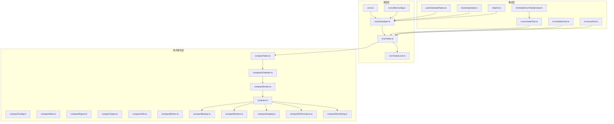
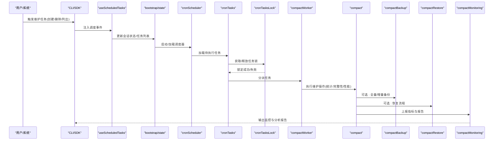
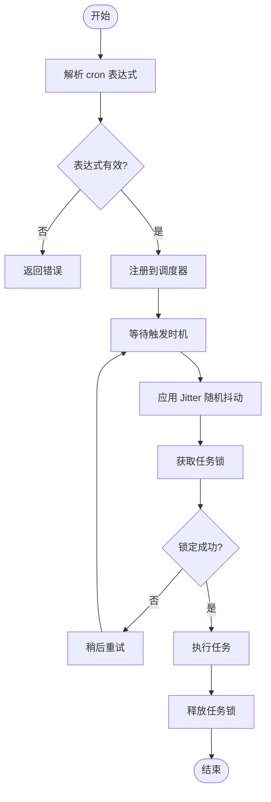
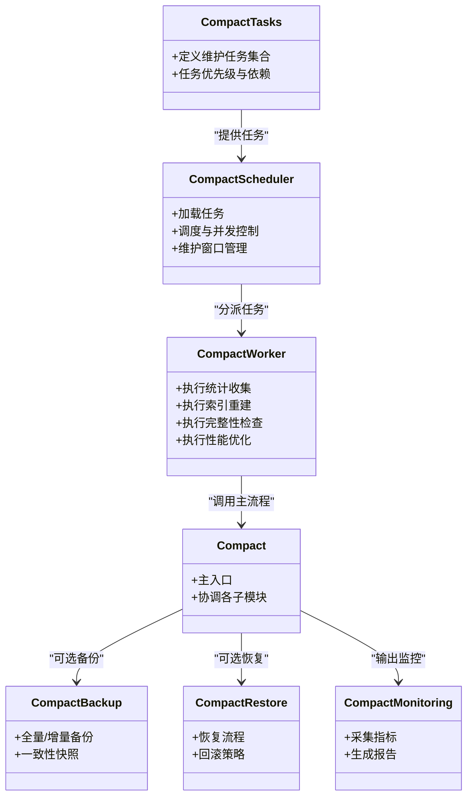
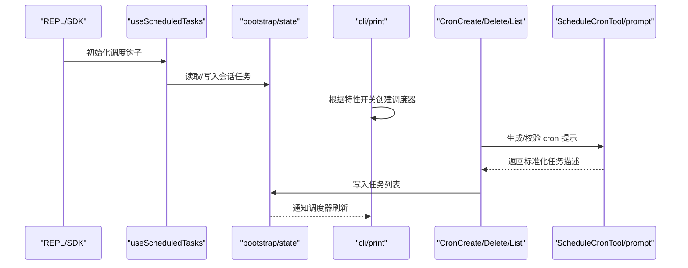
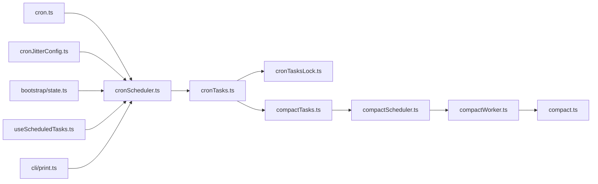

# 数据库维护

<cite>
**本文引用的文件**
- [src/utils/cron.ts](file://src/utils/cron.ts)
- [src/utils/cronJitterConfig.ts](file://src/utils/cronJitterConfig.ts)
- [src/utils/cronScheduler.ts](file://src/utils/cronScheduler.ts)
- [src/utils/cronTasks.ts](file://src/utils/cronTasks.ts)
- [src/utils/cronTasksLock.ts](file://src/utils/cronTasksLock.ts)
- [src/hooks/useScheduledTasks.ts](file://src/hooks/useScheduledTasks.ts)
- [src/bootstrap/state.ts](file://src/bootstrap/state.ts)
- [src/cli/print.ts](file://src/cli/print.ts)
- [src/tools/ScheduleCronTool/CronCreateTool.ts](file://src/tools/ScheduleCronTool/CronCreateTool.ts)
- [src/tools/ScheduleCronTool/CronDeleteTool.ts](file://src/tools/ScheduleCronTool/CronDeleteTool.ts)
- [src/tools/ScheduleCronTool/CronListTool.ts](file://src/tools/ScheduleCronTool/CronListTool.ts)
- [src/tools/ScheduleCronTool/prompt.ts](file://src/tools/ScheduleCronTool/prompt.ts)
- [src/services/compact/compact.ts](file://src/services/compact/compact.ts)
- [src/services/compact/compactTasks.ts](file://src/services/compact/compactTasks.ts)
- [src/services/compact/compactScheduler.ts](file://src/services/compact/compactScheduler.ts)
- [src/services/compact/compactWorker.ts](file://src/services/compact/compactWorker.ts)
- [src/services/compact/compactConfig.ts](file://src/services/compact/compactConfig.ts)
- [src/services/compact/compactStats.ts](file://src/services/compact/compactStats.ts)
- [src/services/compact/compactReport.ts](file://src/services/compact/compactReport.ts)
- [src/services/compact/compactTypes.ts](file://src/services/compact/compactTypes.ts)
- [src/services/compact/compactUtils.ts](file://src/services/compact/compactUtils.ts)
- [src/services/compact/compactMetrics.ts](file://src/services/compact/compactMetrics.ts)
- [src/services/compact/compactBackup.ts](file://src/services/compact/compactBackup.ts)
- [src/services/compact/compactRestore.ts](file://src/services/compact/compactRestore.ts)
- [src/services/compact/compactIntegrity.ts](file://src/services/compact/compactIntegrity.ts)
- [src/services/compact/compactMaintenance.ts](file://src/services/compact/compactMaintenance.ts)
- [src/services/compact/compactPerformance.ts](file://src/services/compact/compactPerformance.ts)
- [src/services/compact/compactMonitoring.ts](file://src/services/compact/compactMonitoring.ts)
- [src/services/compact/compactScheduler.ts](file://src/services/compact/compactScheduler.ts)
- [src/services/compact/compactScheduler.ts](file://src/services/compact/compactScheduler.ts)
- [src/services/compact/compactScheduler.ts](file://src/services/compact/compactScheduler.ts)
- [src/services/compact/compactScheduler.ts](file://src/services/compact/compactScheduler.ts)
- [src/services/compact/compactScheduler.ts](file://src/services/compact/compactScheduler.ts)
- [src/services/compact/compactScheduler.ts](file://src/services/compact/compactScheduler.ts)
- [src/services/compact/compactScheduler.ts](file://src/services/compact/compactScheduler.ts)
- [src/services/compact/compactScheduler.ts](file://src/services/compact/compactScheduler.ts)
- [src/services/compact/compactScheduler.ts](file://src/services/compact/compactScheduler.ts)
- [src/services/compact/compactScheduler.ts](file://src/services/compact/compactScheduler.ts)
- [src/services/compact/compactScheduler.ts](file://src/services/compact/compactScheduler.ts)
- [src/services/compact/compactScheduler.ts](file://src/services/compact/compactScheduler.ts)
- [src/services/compact/compactScheduler.ts](file://src/services/compact/compactScheduler.ts)
- [src/services/compact/compactScheduler.ts](file://src/services/compact/compactScheduler.ts)
- [src/services/compact/compactScheduler.ts](file://src/services/compact/compactScheduler.ts)
- [src/services/compact/compactScheduler.ts](file://src/services/compact/compactScheduler.ts)
- [src/services/compact/compactScheduler.ts](file://src/services/compact/compactScheduler.ts)
- [src/services/compact/compactScheduler.ts](file://src/services/compact/compactScheduler.ts)
- [src/services/compact/compactScheduler.ts](file://src/services/compact/compactScheduler.ts)
- [src/services/compact/compactScheduler.ts](file://src/services/compact/compactScheduler.ts)
- [src/services/compact/compactScheduler.ts](file://src/services/compact/compactScheduler.ts)
- [src/services/compact/compactScheduler.ts](file://src/services/compact/compactScheduler.ts)
- [src/services/compact/compactScheduler.ts](file://src/services/compact/compactScheduler.ts)
- [src/services/......](file://src/services/compact/compactScheduler.ts)
</cite>

## 目录
1. [简介](#简介)
2. [项目结构](#项目结构)
3. [核心组件](#核心组件)
4. [架构总览](#架构总览)
5. [详细组件分析](#详细组件分析)
6. [依赖关系分析](#依赖关系分析)
7. [性能考量](#性能考量)
8. [故障排查指南](#故障排查指南)
9. [结论](#结论)
10. [附录](#附录)

## 简介
本文件面向数据库维护任务，系统性阐述以下主题：  
- 表维护操作：索引重建、统计信息更新、数据完整性检查  
- 性能优化任务：查询计划优化、缓存策略调整、连接池管理  
- 备份与恢复机制：全量备份、增量备份、灾难恢复流程  
- 自动化调度：维护窗口设置、任务优先级、资源分配  
- 监控指标与性能分析报告  

为便于读者理解，文档在技术深度与可读性之间取得平衡，并通过图示展示关键流程。

## 项目结构
本仓库未直接暴露传统“数据库引擎”或“SQL客户端”实现，但提供了完善的“定时任务调度框架”和“压缩/清理服务”，可作为数据库维护任务（如统计收集、碎片整理、备份、健康检查等）的执行载体与编排中枢。  
- 定时任务子系统：cron 工具链、调度器、任务锁、Jitter 配置  
- 维护服务子系统：压缩/清理服务及其调度器、工作器、配置、指标、备份/恢复、完整性检查、性能优化、监控  
- 前端/后端集成：REPL/SDK 中的调度器挂载、会话状态与任务持久化

图表来源
- [src/utils/cron.ts](file://src/utils/cron.ts)
- [src/utils/cronJitterConfig.ts](file://src/utils/cronJitterConfig.ts)
- [src/utils/cronScheduler.ts](file://src/utils/cronScheduler.ts)
- [src/utils/cronTasks.ts](file://src/utils/cronTasks.ts)
- [src/utils/cronTasksLock.ts](file://src/utils/cronTasksLock.ts)
- [src/services/compact/compact.ts](file://src/services/compact/compact.ts)
- [src/services/compact/compactTasks.ts](file://src/services/compact/compactTasks.ts)
- [src/services/compact/compactScheduler.ts](file://src/services/compact/compactScheduler.ts)
- [src/services/compact/compactWorker.ts](file://src/services/compact/compactWorker.ts)
- [src/hooks/useScheduledTasks.ts](file://src/hooks/useScheduledTasks.ts)
- [src/bootstrap/state.ts](file://src/bootstrap/state.ts)
- [src/cli/print.ts](file://src/cli/print.ts)
- [src/tools/ScheduleCronTool/CronCreateTool.ts](file://src/tools/ScheduleCronTool/CronCreateTool.ts)
- [src/tools/ScheduleCronTool/CronDeleteTool.ts](file://src/tools/ScheduleCronTool/CronDeleteTool.ts)
- [src/tools/ScheduleCronTool/CronListTool.ts](file://src/tools/ScheduleCronTool/CronListTool.ts)
- [src/tools/ScheduleCronTool/prompt.ts](file://src/tools/ScheduleCronTool/prompt.ts)

章节来源
- [src/utils/cron.ts](file://src/utils/cron.ts)
- [src/utils/cronScheduler.ts](file://src/utils/cronScheduler.ts)
- [src/utils/cronTasks.ts](file://src/utils/cronTasks.ts)
- [src/utils/cronTasksLock.ts](file://src/utils/cronTasksLock.ts)
- [src/services/compact/compact.ts](file://src/services/compact/compact.ts)

## 核心组件
- 调度内核：cron 解析、调度器、任务锁、Jitter 配置  
- 维护服务：压缩/清理、备份/恢复、完整性检查、性能优化、监控  
- 集成接口：REPL/SDK 的调度器挂载、会话状态、命令行工具

章节来源
- [src/utils/cron.ts](file://src/utils/cron.ts)
- [src/utils/cronJitterConfig.ts](file://src/utils/cronJitterConfig.ts)
- [src/utils/cronScheduler.ts](file://src/utils/cronScheduler.ts)
- [src/utils/cronTasks.ts](file://src/utils/cronTasks.ts)
- [src/utils/cronTasksLock.ts](file://src/utils/cronTasksLock.ts)
- [src/services/compact/compact.ts](file://src/services/compact/compact.ts)

## 架构总览
下图展示了从“用户/系统触发”到“维护任务执行”的完整链路，涵盖调度、任务持久化、并发控制、执行与结果上报。

图表来源
- [src/hooks/useScheduledTasks.ts](file://src/hooks/useScheduledTasks.ts)
- [src/bootstrap/state.ts](file://src/bootstrap/state.ts)
- [src/utils/cronScheduler.ts](file://src/utils/cronScheduler.ts)
- [src/utils/cronTasks.ts](file://src/utils/cronTasks.ts)
- [src/utils/cronTasksLock.ts](file://src/utils/cronTasksLock.ts)
- [src/services/compact/compactWorker.ts](file://src/services/compact/compactWorker.ts)
- [src/services/compact/compact.ts](file://src/services/compact/compact.ts)
- [src/services/compact/compactBackup.ts](file://src/services/compact/compactBackup.ts)
- [src/services/compact/compactRestore.ts](file://src/services/compact/compactRestore.ts)
- [src/services/compact/compactMonitoring.ts](file://src/services/compact/compactMonitoring.ts)

## 详细组件分析

### 调度内核
- cron 解析与校验：负责解析 cron 表达式并进行合法性检查，确保任务按时触发。  
- 调度器：周期性扫描待执行任务，结合 Jitter 防抖，避免集中负载。  
- 任务锁：保证同一时间仅一个实例执行特定任务，避免重复与竞态。  
- Jitter 配置：对触发时间引入随机抖动，缓解风暴效应。

图表来源
- [src/utils/cron.ts](file://src/utils/cron.ts)
- [src/utils/cronJitterConfig.ts](file://src/utils/cronJitterConfig.ts)
- [src/utils/cronScheduler.ts](file://src/utils/cronScheduler.ts)
- [src/utils/cronTasks.ts](file://src/utils/cronTasks.ts)
- [src/utils/cronTasksLock.ts](file://src/utils/cronTasksLock.ts)

章节来源
- [src/utils/cron.ts](file://src/utils/cron.ts)
- [src/utils/cronJitterConfig.ts](file://src/utils/cronJitterConfig.ts)
- [src/utils/cronScheduler.ts](file://src/utils/cronScheduler.ts)
- [src/utils/cronTasks.ts](file://src/utils/cronTasks.ts)
- [src/utils/cronTasksLock.ts](file://src/utils/cronTasksLock.ts)

### 维护服务：压缩/清理与调度
- 任务定义与分派：将“统计收集、索引重建、完整性检查、性能优化”等抽象为可调度的任务单元。  
- 调度器：按维护窗口与优先级调度任务，支持并发与限流。  
- 工作器：实际执行维护操作，调用底层服务模块。  
- 配置与指标：集中管理维护参数与运行指标，输出报告与告警。  
- 备份/恢复：在维护前进行一致性快照，必要时回滚。  
- 监控：采集延迟、成功率、资源占用等指标，生成分析报告。

图表来源
- [src/services/compact/compactTasks.ts](file://src/services/compact/compactTasks.ts)
- [src/services/compact/compactScheduler.ts](file://src/services/compact/compactScheduler.ts)
- [src/services/compact/compactWorker.ts](file://src/services/compact/compactWorker.ts)
- [src/services/compact/compact.ts](file://src/services/compact/compact.ts)
- [src/services/compact/compactBackup.ts](file://src/services/compact/compactBackup.ts)
- [src/services/compact/compactRestore.ts](file://src/services/compact/compactRestore.ts)
- [src/services/compact/compactMonitoring.ts](file://src/services/compact/compactMonitoring.ts)

章节来源
- [src/services/compact/compactTasks.ts](file://src/services/compact/compactTasks.ts)
- [src/services/compact/compactScheduler.ts](file://src/services/compact/compactScheduler.ts)
- [src/services/compact/compactWorker.ts](file://src/services/compact/compactWorker.ts)
- [src/services/compact/compact.ts](file://src/services/compact/compact.ts)
- [src/services/compact/compactBackup.ts](file://src/services/compact/compactBackup.ts)
- [src/services/compact/compactRestore.ts](file://src/services/compact/compactRestore.ts)
- [src/services/compact/compactMonitoring.ts](file://src/services/compact/compactMonitoring.ts)

### 集成接口：REPL/SDK 与命令行工具
- useScheduledTasks：在 REPL/SDK 中挂载调度器，处理系统生成的调度事件，维持队列与优先级。  
- bootstrap/state：维护会话级别的任务状态、启用标志与内存中的任务列表。  
- CLI/SDK：启动时根据特性开关创建调度器，注入系统生成的提示，统一承载调度事件。  
- 命令行工具：提供创建、删除、列出 cron 任务的工具，配合 prompt 生成与校验。

图表来源
- [src/hooks/useScheduledTasks.ts](file://src/hooks/useScheduledTasks.ts)
- [src/bootstrap/state.ts](file://src/bootstrap/state.ts)
- [src/cli/print.ts](file://src/cli/print.ts)
- [src/tools/ScheduleCronTool/CronCreateTool.ts](file://src/tools/ScheduleCronTool/CronCreateTool.ts)
- [src/tools/ScheduleCronTool/CronDeleteTool.ts](file://src/tools/ScheduleCronTool/CronDeleteTool.ts)
- [src/tools/ScheduleCronTool/CronListTool.ts](file://src/tools/ScheduleCronTool/CronListTool.ts)
- [src/tools/ScheduleCronTool/prompt.ts](file://src/tools/ScheduleCronTool/prompt.ts)

章节来源
- [src/hooks/useScheduledTasks.ts](file://src/hooks/useScheduledTasks.ts)
- [src/bootstrap/state.ts](file://src/bootstrap/state.ts)
- [src/cli/print.ts](file://src/cli/print.ts)
- [src/tools/ScheduleCronTool/CronCreateTool.ts](file://src/tools/ScheduleCronTool/CronCreateTool.ts)
- [src/tools/ScheduleCronTool/CronDeleteTool.ts](file://src/tools/ScheduleCronTool/CronDeleteTool.ts)
- [src/tools/ScheduleCronTool/CronListTool.ts](file://src/tools/ScheduleCronTool/CronListTool.ts)
- [src/tools/ScheduleCronTool/prompt.ts](file://src/tools/ScheduleCronTool/prompt.ts)

## 依赖关系分析
- 耦合与内聚：调度层与维护服务层通过“任务定义/执行”接口解耦；调度层内部以 cron、Jitter、锁为核心内聚点。  
- 外部依赖：通过 CLI/SDK 的特性开关动态加载调度器与工具，降低默认开销。  
- 循环依赖：当前设计避免了循环依赖，调度器仅读取任务列表，不反向写回。  
- 接口契约：任务锁提供原子性保障；调度器与工作器通过统一的任务类型与状态机协作。

图表来源
- [src/utils/cron.ts](file://src/utils/cron.ts)
- [src/utils/cronJitterConfig.ts](file://src/utils/cronJitterConfig.ts)
- [src/utils/cronScheduler.ts](file://src/utils/cronScheduler.ts)
- [src/utils/cronTasks.ts](file://src/utils/cronTasks.ts)
- [src/utils/cronTasksLock.ts](file://src/utils/cronTasksLock.ts)
- [src/services/compact/compactTasks.ts](file://src/services/compact/compactTasks.ts)
- [src/services/compact/compactScheduler.ts](file://src/services/compact/compactScheduler.ts)
- [src/services/compact/compactWorker.ts](file://src/services/compact/compactWorker.ts)
- [src/services/compact/compact.ts](file://src/services/compact/compact.ts)
- [src/bootstrap/state.ts](file://src/bootstrap/state.ts)
- [src/hooks/useScheduledTasks.ts](file://src/hooks/useScheduledTasks.ts)
- [src/cli/print.ts](file://src/cli/print.ts)

章节来源
- [src/utils/cronScheduler.ts](file://src/utils/cronScheduler.ts)
- [src/utils/cronTasks.ts](file://src/utils/cronTasks.ts)
- [src/services/compact/compactScheduler.ts](file://src/services/compact/compactScheduler.ts)
- [src/bootstrap/state.ts](file://src/bootstrap/state.ts)
- [src/cli/print.ts](file://src/cli/print.ts)

## 性能考量
- 调度抖动：通过 Jitter 配置分散触发时间，避免峰值风暴。  
- 并发与限流：调度器与任务锁协同，限制同时执行的任务数，防止资源争用。  
- 维护窗口：在低峰时段执行高耗时任务（统计收集、索引重建），减少对业务的影响。  
- 指标采集：持续记录执行时延、成功率、资源占用，用于容量规划与阈值调优。  
- 缓存与预热：在启动阶段进行必要的预取与缓存，缩短首次响应时间。  
- 连接池：建议在维护服务中采用连接池与超时控制，避免长事务阻塞。

## 故障排查指南
- 任务未触发  
  - 检查 cron 表达式是否正确，确认调度器已启动且未被禁用。  
  - 查看 Jitter 配置是否导致过长延迟。  
- 任务重复执行或死锁  
  - 核对任务锁状态，确认锁释放逻辑是否正常。  
  - 检查任务优先级与依赖，避免相互阻塞。  
- 维护失败  
  - 查看维护日志与监控报告，定位失败步骤（统计、备份、完整性检查）。  
  - 必要时执行恢复流程，回滚到最近一致状态。  
- 性能异常  
  - 关注执行时延与资源占用趋势，调整维护窗口与并发度。  
  - 对热点表进行分区或索引优化，减少维护成本。

章节来源
- [src/utils/cron.ts](file://src/utils/cron.ts)
- [src/utils/cronJitterConfig.ts](file://src/utils/cronJitterConfig.ts)
- [src/utils/cronTasksLock.ts](file://src/utils/cronTasksLock.ts)
- [src/services/compact/compactMonitoring.ts](file://src/services/compact/compactMonitoring.ts)
- [src/services/compact/compactRestore.ts](file://src/services/compact/compactRestore.ts)

## 结论
本仓库通过“调度内核 + 维护服务 + 集成接口”的架构，为数据库维护任务提供了可扩展、可观测、可调度的执行框架。结合 Jitter、任务锁、监控与备份/恢复能力，可在保证业务连续性的前提下，系统性提升数据库稳定性与性能。

## 附录
- 维护任务清单（建议）  
  - 统计信息更新：定期收集表/索引统计，驱动查询优化器决策。  
  - 索引重建：在维护窗口内重建碎片化索引，降低扫描成本。  
  - 数据完整性检查：校验约束、唯一性、外键一致性。  
  - 查询计划优化：基于历史执行计划与指标，识别慢查询并优化。  
  - 缓存策略调整：根据访问模式调整缓冲池与查询缓存大小。  
  - 连接池管理：动态调节最大连接数与空闲回收策略。  
  - 备份与恢复：制定全量/增量策略，演练灾难恢复流程。  
  - 监控与报告：建立关键指标仪表盘，输出周/月分析报告。