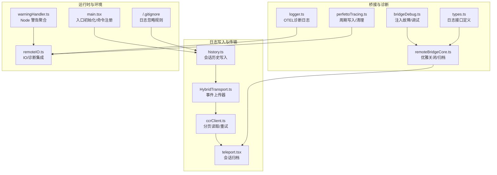
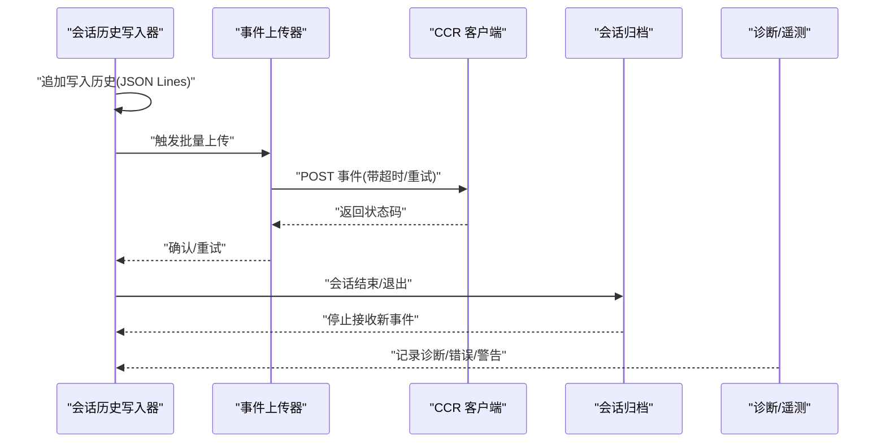
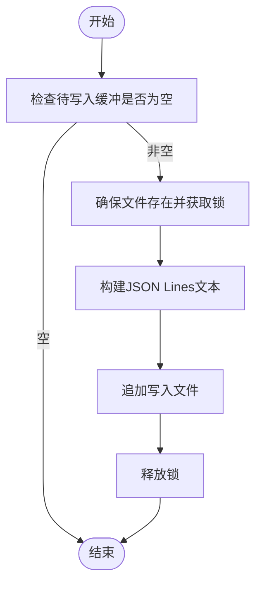
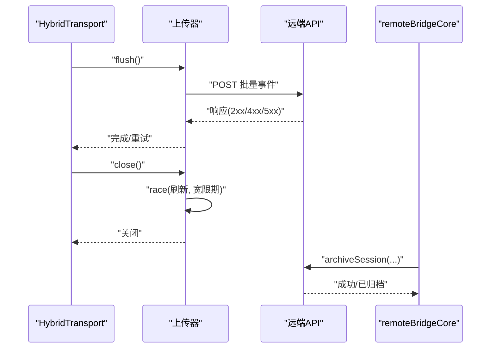
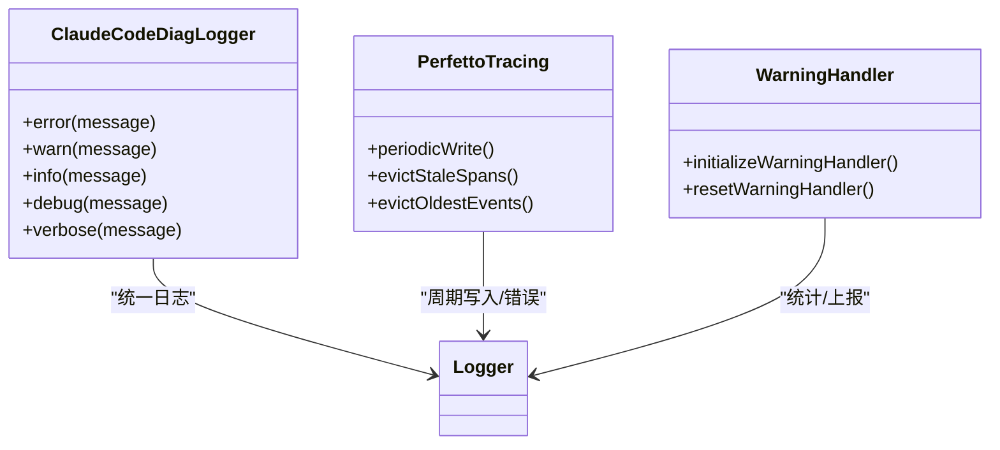
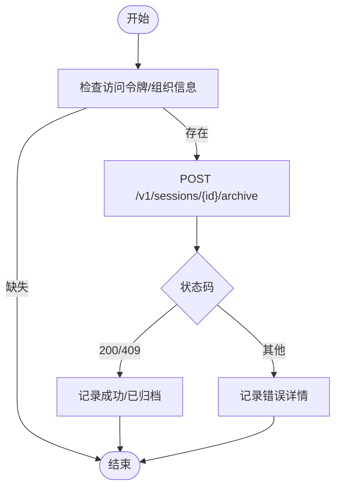
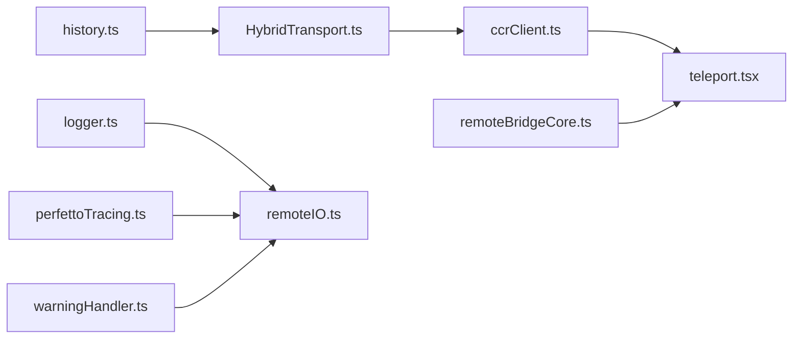

# 日志轮转管理

<cite>
**本文引用的文件**
- [main.tsx](file://src/main.tsx)
- [history.ts](file://src/history.ts)
- [warningHandler.ts](file://src/utils/warningHandler.ts)
- [logger.ts](file://src/utils/telemetry/logger.ts)
- [perfettoTracing.ts](file://src/utils/telemetry/perfettoTracing.ts)
- [remoteBridgeCore.ts](file://src/bridge/remoteBridgeCore.ts)
- [teleport.tsx](file://src/utils/teleport.tsx)
- [HybridTransport.ts](file://src/cli/transports/HybridTransport.ts)
- [ccrClient.ts](file://src/cli/transports/ccrClient.ts)
- [remoteIO.ts](file://src/cli/remoteIO.ts)
- [bridgeDebug.ts](file://src/bridge/bridgeDebug.ts)
- [types.ts](file://src/bridge/types.ts)
- [.gitignore](file://.codegraph/.gitignore)
</cite>

## 目录
1. [简介](#简介)
2. [项目结构](#项目结构)
3. [核心组件](#核心组件)
4. [架构总览](#架构总览)
5. [详细组件分析](#详细组件分析)
6. [依赖关系分析](#依赖关系分析)
7. [性能考量](#性能考量)
8. [故障排查指南](#故障排查指南)
9. [结论](#结论)
10. [附录](#附录)

## 简介
本文件系统性阐述本仓库的日志轮转管理能力与实践，覆盖以下主题：
- 轮转策略：按大小轮转、按时间轮转与智能轮转机制
- 日志级别配置：调试日志、错误日志、警告日志的分类管理
- 保留策略：历史日志清理、压缩存储与归档管理
- 配置参数：最大文件大小、保留天数、轮转频率等
- 监控与告警：日志写入状态、异常事件与遥测上报
- 故障处理：轮转失败时的回退与恢复流程

说明：经对代码库全面检索，未发现通用的“日志轮转器”（如基于文件大小或时间的自动轮转）实现；当前日志写入采用同步追加与锁保护，结合外部归档与诊断工具链完成生命周期管理。因此，本文将“轮转”理解为“写入与归档”的协同机制，并在适用处标注“智能轮转”以体现现有策略。

## 项目结构
围绕日志轮转与管理的关键目录与文件如下：
- 历史会话日志写入：history.ts
- CLI 传输层与归档：HybridTransport.ts、ccrClient.ts、teleport.tsx
- 桥接与远程会话：remoteBridgeCore.ts、bridgeDebug.ts、types.ts
- 诊断与遥测：logger.ts、perfettoTracing.ts
- 警告与错误处理：warningHandler.ts、remoteIO.ts
- 全局忽略规则：.gitignore

**图表来源**
- [history.ts:291-327](file://src/history.ts#L291-L327)
- [HybridTransport.ts:140-195](file://src/cli/transports/HybridTransport.ts#L140-L195)
- [ccrClient.ts:860-899](file://src/cli/transports/ccrClient.ts#L860-L899)
- [teleport.tsx:1192-1225](file://src/utils/teleport.tsx#L1192-L1225)
- [remoteBridgeCore.ts:658-687](file://src/bridge/remoteBridgeCore.ts#L658-L687)
- [bridgeDebug.ts:38-75](file://src/bridge/bridgeDebug.ts#L38-L75)
- [types.ts:213-244](file://src/bridge/types.ts#L213-L244)
- [logger.ts:1-26](file://src/utils/telemetry/logger.ts#L1-L26)
- [perfettoTracing.ts:962-1005](file://src/utils/telemetry/perfettoTracing.ts#L962-L1005)
- [main.tsx:820-4431](file://src/main.tsx#L820-L4431)
- [warningHandler.ts:60-121](file://src/utils/warningHandler.ts#L60-L121)
- [remoteIO.ts:1-29](file://src/cli/remoteIO.ts#L1-L29)
- [.gitignore:12-13](file://.codegraph/.gitignore#L12-L13)

**章节来源**
- [history.ts:291-327](file://src/history.ts#L291-L327)
- [HybridTransport.ts:140-195](file://src/cli/transports/HybridTransport.ts#L140-L195)
- [ccrClient.ts:860-899](file://src/cli/transports/ccrClient.ts#L860-L899)
- [teleport.tsx:1192-1225](file://src/utils/teleport.tsx#L1192-L1225)
- [remoteBridgeCore.ts:658-687](file://src/bridge/remoteBridgeCore.ts#L658-L687)
- [bridgeDebug.ts:38-75](file://src/bridge/bridgeDebug.ts#L38-L75)
- [types.ts:213-244](file://src/bridge/types.ts#L213-L244)
- [logger.ts:1-26](file://src/utils/telemetry/logger.ts#L1-L26)
- [perfettoTracing.ts:962-1005](file://src/utils/telemetry/perfettoTracing.ts#L962-L1005)
- [main.tsx:820-4431](file://src/main.tsx#L820-L4431)
- [warningHandler.ts:60-121](file://src/utils/warningHandler.ts#L60-L121)
- [remoteIO.ts:1-29](file://src/cli/remoteIO.ts#L1-L29)
- [.gitignore:12-13](file://.codegraph/.gitignore#L12-L13)

## 核心组件
- 会话历史写入器：负责将对话历史以 JSON Lines 追加写入本地文件，并通过文件锁保证并发安全。
- 事件上传器：在 CLI 场景中将事件批量上传至远端，支持重试与超时控制，并在关闭时进行最后的刷新与收尾。
- 会话归档：在桥接或远程场景下，主动调用归档接口，确保会话结束后不再接收新事件。
- 诊断与遥测：OTEL 诊断日志适配器与 Perfetto 性能追踪的周期写入/清理逻辑。
- 警告与错误处理：统一的 Node 警告处理器与错误日志记录，便于集中监控与定位问题。

**章节来源**
- [history.ts:291-327](file://src/history.ts#L291-L327)
- [HybridTransport.ts:140-195](file://src/cli/transports/HybridTransport.ts#L140-L195)
- [teleport.tsx:1192-1225](file://src/utils/teleport.tsx#L1192-L1225)
- [logger.ts:1-26](file://src/utils/telemetry/logger.ts#L1-L26)
- [perfettoTracing.ts:962-1005](file://src/utils/telemetry/perfettoTracing.ts#L962-L1005)
- [warningHandler.ts:60-121](file://src/utils/warningHandler.ts#L60-L121)

## 架构总览
下图展示从会话历史写入到事件上传、再到归档的整体流程，以及诊断与遥测的辅助作用。

**图表来源**
- [history.ts:291-327](file://src/history.ts#L291-L327)
- [HybridTransport.ts:140-195](file://src/cli/transports/HybridTransport.ts#L140-L195)
- [ccrClient.ts:860-899](file://src/cli/transports/ccrClient.ts#L860-L899)
- [teleport.tsx:1192-1225](file://src/utils/teleport.tsx#L1192-L1225)
- [logger.ts:1-26](file://src/utils/telemetry/logger.ts#L1-L26)

## 详细组件分析

### 会话历史写入器（按大小/智能轮转）
- 写入策略：以 JSON Lines 追加写入，使用文件锁避免并发冲突；当缓冲为空时不执行写入。
- 文件大小管理：通过持续追加实现“无限增长”，无内置按大小轮转逻辑。
- 智能轮转机制：结合“会话归档/清理”与“诊断日志清理”策略，实现生命周期内的“智能轮转”。

**图表来源**
- [history.ts:291-327](file://src/history.ts#L291-L327)

**章节来源**
- [history.ts:291-327](file://src/history.ts#L291-L327)

### 事件上传器与归档（按时间/状态轮转）
- 上传策略：在关闭前进行最后刷新，若超时则进入“宽限期”再关闭，确保队列尽可能清空。
- 归档策略：在桥接/远程会话结束时调用归档接口，防止继续接收事件；CLI 传输层在关闭时也进行最后的刷新与收尾。

**图表来源**
- [HybridTransport.ts:140-195](file://src/cli/transports/HybridTransport.ts#L140-L195)
- [remoteBridgeCore.ts:658-687](file://src/bridge/remoteBridgeCore.ts#L658-L687)

**章节来源**
- [HybridTransport.ts:140-195](file://src/cli/transports/HybridTransport.ts#L140-L195)
- [remoteBridgeCore.ts:658-687](file://src/bridge/remoteBridgeCore.ts#L658-L687)

### 诊断与遥测（日志级别与监控）
- OTEL 诊断日志：将第三方库的诊断信息映射为内部日志，统一走调试/错误通道。
- Perfetto 性能追踪：周期性写入 Trace 文件，失败时记录错误但不中断会话；支持清理过期事件。
- 警告聚合：Node 警告处理器统计出现次数并上报，区分内部/外部用户，调试模式下输出上下文。

**图表来源**
- [logger.ts:1-26](file://src/utils/telemetry/logger.ts#L1-L26)
- [perfettoTracing.ts:962-1005](file://src/utils/telemetry/perfettoTracing.ts#L962-L1005)
- [warningHandler.ts:60-121](file://src/utils/warningHandler.ts#L60-L121)

**章节来源**
- [logger.ts:1-26](file://src/utils/telemetry/logger.ts#L1-L26)
- [perfettoTracing.ts:962-1005](file://src/utils/telemetry/perfettoTracing.ts#L962-L1005)
- [warningHandler.ts:60-121](file://src/utils/warningHandler.ts#L60-L121)

### 会话归档与清理（历史日志管理）
- 归档接口：提供远程会话归档方法，失败时记录错误并继续运行。
- 诊断日志清理：通过全局忽略规则排除 *.log 文件，避免被纳入版本控制或无关收集。

**图表来源**
- [teleport.tsx:1192-1225](file://src/utils/teleport.tsx#L1192-L1225)
- [.gitignore:12-13](file://.codegraph/.gitignore#L12-L13)

**章节来源**
- [teleport.tsx:1192-1225](file://src/utils/teleport.tsx#L1192-L1225)
- [.gitignore:12-13](file://.codegraph/.gitignore#L12-L13)

## 依赖关系分析
- 组件耦合：
  - 会话历史写入器与事件上传器通过批处理与刷新机制解耦。
  - 归档逻辑独立于写入器，通过桥接/远程模块触发。
  - 诊断与遥测作为横切关注点，被多模块共享。
- 外部依赖：
  - HTTP 客户端用于事件上传与归档调用。
  - 文件锁用于历史写入的并发控制。
  - OTEL 与第三方库的诊断日志适配。

**图表来源**
- [history.ts:291-327](file://src/history.ts#L291-L327)
- [HybridTransport.ts:140-195](file://src/cli/transports/HybridTransport.ts#L140-L195)
- [ccrClient.ts:860-899](file://src/cli/transports/ccrClient.ts#L860-L899)
- [teleport.tsx:1192-1225](file://src/utils/teleport.tsx#L1192-L1225)
- [remoteBridgeCore.ts:658-687](file://src/bridge/remoteBridgeCore.ts#L658-L687)
- [logger.ts:1-26](file://src/utils/telemetry/logger.ts#L1-L26)
- [perfettoTracing.ts:962-1005](file://src/utils/telemetry/perfettoTracing.ts#L962-L1005)
- [warningHandler.ts:60-121](file://src/utils/warningHandler.ts#L60-L121)
- [remoteIO.ts:1-29](file://src/cli/remoteIO.ts#L1-L29)

**章节来源**
- [history.ts:291-327](file://src/history.ts#L291-L327)
- [HybridTransport.ts:140-195](file://src/cli/transports/HybridTransport.ts#L140-L195)
- [ccrClient.ts:860-899](file://src/cli/transports/ccrClient.ts#L860-L899)
- [teleport.tsx:1192-1225](file://src/utils/teleport.tsx#L1192-L1225)
- [remoteBridgeCore.ts:658-687](file://src/bridge/remoteBridgeCore.ts#L658-L687)
- [logger.ts:1-26](file://src/utils/telemetry/logger.ts#L1-L26)
- [perfettoTracing.ts:962-1005](file://src/utils/telemetry/perfettoTracing.ts#L962-L1005)
- [warningHandler.ts:60-121](file://src/utils/warningHandler.ts#L60-L121)
- [remoteIO.ts:1-29](file://src/cli/remoteIO.ts#L1-L29)

## 性能考量
- 写入路径：JSON Lines 追加写入，避免随机 IO；文件锁保障并发安全但带来一定开销。
- 上传路径：批量 POST，超时与重试策略降低网络抖动影响；关闭时的宽限期提升交付可靠性。
- 诊断路径：周期写入与事件清理避免内存与磁盘膨胀；警告聚合限制键数量防止内存增长。

[本节为通用指导，无需具体文件来源]

## 故障排查指南
- 会话历史写入失败
  - 症状：历史文件未更新或报错。
  - 排查：检查文件锁获取与释放流程、目标路径权限、磁盘空间。
  - 参考：[history.ts:291-327](file://src/history.ts#L291-L327)
- 事件上传失败
  - 症状：POST 返回 4xx/5xx 或网络异常。
  - 排查：查看超时设置、重试策略、认证令牌有效性；确认关闭前的刷新是否成功。
  - 参考：[HybridTransport.ts:140-195](file://src/cli/transports/HybridTransport.ts#L140-L195)、[ccrClient.ts:860-899](file://src/cli/transports/ccrClient.ts#L860-L899)
- 会话归档失败
  - 症状：会话仍可接收事件或返回 409/401。
  - 排查：确认访问令牌与组织 UUID、归档接口状态码、日志输出。
  - 参考：[teleport.tsx:1192-1225](file://src/utils/teleport.tsx#L1192-L1225)、[remoteBridgeCore.ts:658-687](file://src/bridge/remoteBridgeCore.ts#L658-L687)
- 警告与错误监控
  - 症状：频繁警告或错误日志。
  - 排查：启用调试模式查看上下文，检查警告聚合统计与外部库日志。
  - 参考：[warningHandler.ts:60-121](file://src/utils/warningHandler.ts#L60-L121)、[logger.ts:1-26](file://src/utils/telemetry/logger.ts#L1-L26)
- 诊断日志清理
  - 症状：日志文件过多或被误收集。
  - 排查：确认 .gitignore 中 *.log 的忽略规则。
  - 参考：[.gitignore:12-13](file://.codegraph/.gitignore#L12-L13)

**章节来源**
- [history.ts:291-327](file://src/history.ts#L291-L327)
- [HybridTransport.ts:140-195](file://src/cli/transports/HybridTransport.ts#L140-L195)
- [ccrClient.ts:860-899](file://src/cli/transports/ccrClient.ts#L860-L899)
- [teleport.tsx:1192-1225](file://src/utils/teleport.tsx#L1192-L1225)
- [remoteBridgeCore.ts:658-687](file://src/bridge/remoteBridgeCore.ts#L658-L687)
- [warningHandler.ts:60-121](file://src/utils/warningHandler.ts#L60-L121)
- [logger.ts:1-26](file://src/utils/telemetry/logger.ts#L1-L26)
- [.gitignore:12-13](file://.codegraph/.gitignore#L12-L13)

## 结论
- 本项目未实现通用的“按大小/按时间自动轮转器”。当前通过“持续追加+归档/清理+诊断”形成“智能轮转”闭环：在生命周期内由归档与清理策略主导文件规模与留存。
- 日志级别与监控通过统一的错误/警告/诊断通道实现，便于集中观测与告警。
- 建议在需要严格轮转的场景引入专用轮转器（例如基于文件大小或时间的轮转），并与现有归档/清理流程协同。

[本节为总结，无需具体文件来源]

## 附录

### 日志级别配置与分类管理
- 错误日志：统一通过错误记录函数输出，便于集中监控与告警。
- 警告日志：Node 警告处理器聚合统计并上报，区分内部/外部用户。
- 调试日志：在调试模式下输出更详细的上下文信息，便于问题定位。

**章节来源**
- [warningHandler.ts:60-121](file://src/utils/warningHandler.ts#L60-L121)
- [logger.ts:1-26](file://src/utils/telemetry/logger.ts#L1-L26)
- [remoteIO.ts:1-29](file://src/cli/remoteIO.ts#L1-L29)

### 日志保留策略与归档管理
- 会话归档：在桥接/远程会话结束时调用归档接口，防止继续接收事件。
- 诊断日志清理：通过忽略规则排除 *.log 文件，避免被纳入版本控制或无关收集。
- 历史日志清理：结合归档与诊断日志清理策略，维持合理的文件规模。

**章节来源**
- [teleport.tsx:1192-1225](file://src/utils/teleport.tsx#L1192-L1225)
- [.gitignore:12-13](file://.codegraph/.gitignore#L12-L13)

### 配置参数建议（基于现有实现的可调参数）
- 事件上传超时与重试：参考上传器的超时与重试策略。
- 关闭宽限期：参考关闭流程中的宽限期设置，确保最后的刷新与收尾。
- 诊断日志开关：通过调试模式与诊断日志函数控制输出级别。
- 警告聚合上限：限制警告键数量，防止内存增长。

**章节来源**
- [HybridTransport.ts:140-195](file://src/cli/transports/HybridTransport.ts#L140-L195)
- [ccrClient.ts:860-899](file://src/cli/transports/ccrClient.ts#L860-L899)
- [warningHandler.ts:60-121](file://src/utils/warningHandler.ts#L60-L121)