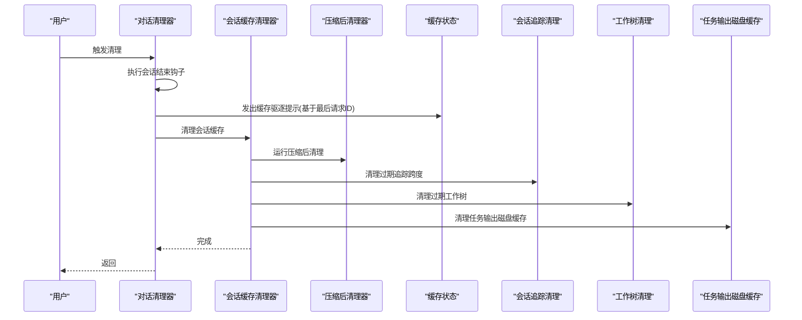
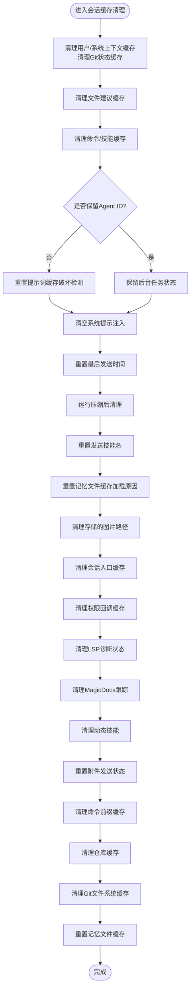
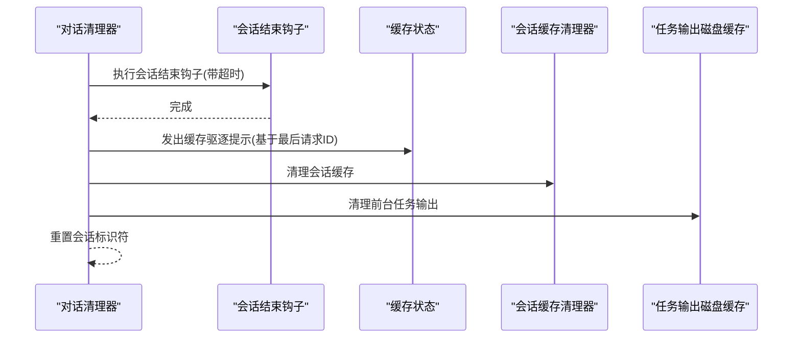
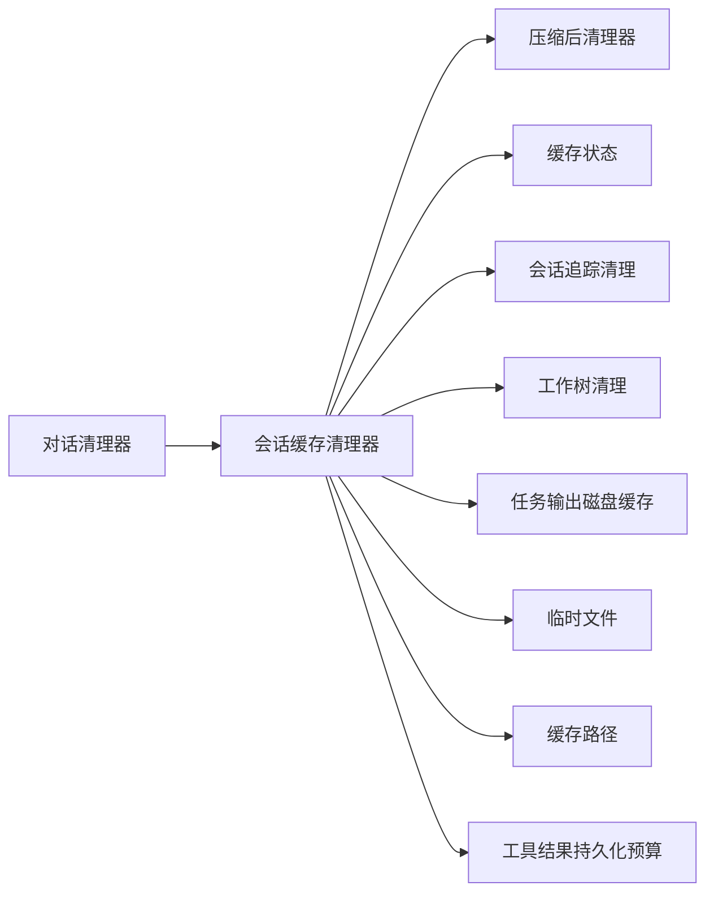

# 缓存清理策略

<cite>
**本文档引用的文件**
- [src/commands/clear/caches.ts](file://src/commands/clear/caches.ts)
- [src/commands/clear/conversation.ts](file://src/commands/clear/conversation.ts)
- [src/services/compact/postCompactCleanup.ts](file://src/services/compact/postCompactCleanup.ts)
- [src/bootstrap/state.ts](file://src/bootstrap/state.ts)
- [src/utils/telemetry/sessionTracing.ts](file://src/utils/telemetry/sessionTracing.ts)
- [src/utils/worktree.ts](file://src/utils/worktree.ts)
- [src/utils/tempfile.ts](file://src/utils/tempfile.ts)
- [src/utils/cachePaths.ts](file://src/utils/cachePaths.ts)
- [src/utils/fileReadCache.ts](file://src/utils/fileReadCache.ts)
- [src/utils/fileStateCache.ts](file://src/utils/fileStateCache.ts)
- [src/utils/completionCache.ts](file://src/utils/completionCache.ts)
- [src/utils/git/gitFilesystem.ts](file://src/utils/git/gitFilesystem.ts)
- [src/utils/detectRepository.ts](file://src/utils/detectRepository.ts)
- [src/utils/imageStore.ts](file://src/utils/imageStore.ts)
- [src/utils/bash/commands.ts](file://src/utils/bash/commands.ts)
- [src/utils/attachments.ts](file://src/utils/attachments.ts)
- [src/utils/claudemd.ts](file://src/utils/claudemd.ts)
- [src/hooks/fileSuggestions.ts](file://src/hooks/fileSuggestions.ts)
- [src/hooks/useSwarmPermissionPoller.ts](file://src/hooks/useSwarmPermissionPoller.ts)
- [src/services/api/dumpPrompts.ts](file://src/services/api/dumpPrompts.ts)
- [src/services/api/promptCacheBreakDetection.ts](file://src/services/api/promptCacheBreakDetection.ts)
- [src/services/api/sessionIngress.ts](file://src/services/api/sessionIngress.ts)
- [src/services/lsp/LSPDiagnosticRegistry.ts](file://src/services/lsp/LSPDiagnosticRegistry.ts)
- [src/services/MagicDocs/magicDocs.ts](file://src/services/MagicDocs/magicDocs.ts)
- [src/skills/loadSkillsDir.ts](file://src/skills/loadSkillsDir.ts)
- [src/utils/toolResultStorage.ts](file://src/utils/toolResultStorage.ts)
- [src/utils/sessionStorage.ts](file://src/utils/sessionStorage.ts)
- [src/utils/task/diskOutput.ts](file://src/utils/task/diskOutput.ts)
- [src/utils/worktree.ts](file://src/utils/worktree.ts)
- [src/bridge/bridgePointer.ts](file://src/bridge/bridgePointer.ts)
- [src/commands/compact/compact.ts](file://src/commands/compact/compact.ts)
- [src/main.tsx](file://src/main.tsx)
</cite>

## 目录
1. [简介](#简介)
2. [项目结构](#项目结构)
3. [核心组件](#核心组件)
4. [架构总览](#架构总览)
5. [详细组件分析](#详细组件分析)
6. [依赖关系分析](#依赖关系分析)
7. [性能考量](#性能考量)
8. [故障排查指南](#故障排查指南)
9. [结论](#结论)
10. [附录](#附录)

## 简介
本文件系统性阐述本仓库中的缓存清理策略，覆盖以下方面：
- 临时文件清理机制：临时目录扫描、过期文件识别与批量删除策略
- 缓存数据生命周期管理：缓存失效时间设置、内存缓存清理、磁盘缓存回收
- 存储空间监控与自动清理触发条件：磁盘使用率阈值、清理优先级、资源占用评估
- 配置选项：清理频率、保留策略、例外规则
- 执行日志与性能影响分析：清理任务的可观测性与对系统的影响

本仓库中存在多类缓存与清理路径，包括会话缓存、工具结果持久化、临时文件、工作树清理等。我们将结合具体实现文件进行说明。

## 项目结构
与缓存清理相关的核心模块分布如下：
- 命令层：会话缓存清理与对话清理入口
- 工具与服务层：各类缓存子系统的清理与重置
- 工具函数层：临时文件生成、缓存路径解析、工作树清理
- 引导与状态层：缓存相关全局状态与提示词缓存破坏检测
- 性能遥测层：会话追踪的过期清理

```mermaid
graph TB
subgraph "命令层"
CC["clear/caches.ts<br/>会话缓存清理"]
CONV["clear/conversation.ts<br/>对话清理"]
COMPACT["commands/compact/compact.ts<br/>压缩后清理"]
end
subgraph "工具与服务层"
PCS["services/compact/postCompactCleanup.ts<br/>压缩后清理"]
STATE["bootstrap/state.ts<br/>缓存相关状态"]
TRACING["utils/telemetry/sessionTracing.ts<br/>会话追踪清理"]
WORKTREE["utils/worktree.ts<br/>工作树清理"]
TEMP["utils/tempfile.ts<br/>临时文件生成"]
CACHEPATHS["utils/cachePaths.ts<br/>缓存路径"]
FILECACHE["utils/fileReadCache.ts<br/>文件读取缓存"]
FILESTATE["utils/fileStateCache.ts<br/>文件状态缓存"]
COMPLETION["utils/completionCache.ts<br/>补全缓存"]
GITFS["utils/git/gitFilesystem.ts<br/>Git文件系统缓存"]
DETECTREPO["utils/detectRepository.ts<br/>仓库检测缓存"]
IMGSTORE["utils/imageStore.ts<br/>图片存储缓存"]
BASHCMDS["utils/bash/commands.ts<br/>命令前缀缓存"]
ATTACH["utils/attachments.ts<br/>附件相关缓存"]
CMDTS["utils/claudemd.ts<br/>记忆文件缓存"]
FILESUG["hooks/fileSuggestions.ts<br/>文件建议缓存"]
SWARM["hooks/useSwarmPermissionPoller.ts<br/>权限回调缓存"]
DUMP["services/api/dumpPrompts.ts<br/>转储状态缓存"]
PROMPTBREAK["services/api/promptCacheBreakDetection.ts<br/>提示词缓存破坏检测"]
SESSIONINGRESS["services/api/sessionIngress.ts<br/>会话入口缓存"]
LSPREG["services/lsp/LSPDiagnosticRegistry.ts<br/>LSP诊断缓存"]
MAGICDOCS["services/MagicDocs/magicDocs.ts<br/>MagicDocs跟踪"]
SKILLS["skills/loadSkillsDir.ts<br/>动态技能缓存"]
TOOLRESULT["utils/toolResultStorage.ts<br/>工具结果持久化预算"]
SESSSTORAGE["utils/sessionStorage.ts<br/>会话存储"]
DISKOUT["utils/task/diskOutput.ts<br/>任务输出磁盘缓存"]
BRIDGEPOINTER["bridge/bridgePointer.ts<br/>桥接指针清理"]
end
CC --> PCS
CC --> STATE
CC --> TRACING
CC --> WORKTREE
CC --> TEMP
CC --> CACHEPATHS
CC --> FILECACHE
CC --> FILESTATE
CC --> COMPLETION
CC --> GITFS
CC --> DETECTREPO
CC --> IMGSTORE
CC --> BASHCMDS
CC --> ATTACH
CC --> CMDTS
CC --> FILESUG
CC --> SWARM
CC --> DUMP
CC --> PROMPTBREAK
CC --> SESSIONINGRESS
CC --> LSPREG
CC --> MAGICDOCS
CC --> SKILLS
CC --> TOOLRESULT
CC --> SESSSTORAGE
CC --> DISKOUT
CC --> BRIDGEPOINTER
CONV --> CC
COMPACT --> PCS
```

图表来源
- [src/commands/clear/caches.ts:1-92](file://src/commands/clear/caches.ts#L1-L92)
- [src/commands/clear/conversation.ts:35-166](file://src/commands/clear/conversation.ts#L35-L166)
- [src/services/compact/postCompactCleanup.ts](file://src/services/compact/postCompactCleanup.ts)
- [src/bootstrap/state.ts:236-257](file://src/bootstrap/state.ts#L236-L257)
- [src/utils/telemetry/sessionTracing.ts:85-120](file://src/utils/telemetry/sessionTracing.ts#L85-L120)
- [src/utils/worktree.ts:1043-1086](file://src/utils/worktree.ts#L1043-L1086)
- [src/utils/tempfile.ts:1-31](file://src/utils/tempfile.ts#L1-L31)
- [src/utils/cachePaths.ts](file://src/utils/cachePaths.ts)
- [src/utils/fileReadCache.ts](file://src/utils/fileReadCache.ts)
- [src/utils/fileStateCache.ts](file://src/utils/fileStateCache.ts)
- [src/utils/completionCache.ts](file://src/utils/completionCache.ts)
- [src/utils/git/gitFilesystem.ts](file://src/utils/git/gitFilesystem.ts)
- [src/utils/detectRepository.ts](file://src/utils/detectRepository.ts)
- [src/utils/imageStore.ts](file://src/utils/imageStore.ts)
- [src/utils/bash/commands.ts](file://src/utils/bash/commands.ts)
- [src/utils/attachments.ts](file://src/utils/attachments.ts)
- [src/utils/claudemd.ts](file://src/utils/claudemd.ts)
- [src/hooks/fileSuggestions.ts](file://src/hooks/fileSuggestions.ts)
- [src/hooks/useSwarmPermissionPoller.ts](file://src/hooks/useSwarmPermissionPoller.ts)
- [src/services/api/dumpPrompts.ts](file://src/services/api/dumpPrompts.ts)
- [src/services/api/promptCacheBreakDetection.ts](file://src/services/api/promptCacheBreakDetection.ts)
- [src/services/api/sessionIngress.ts](file://src/services/api/sessionIngress.ts)
- [src/services/lsp/LSPDiagnosticRegistry.ts](file://src/services/lsp/LSPDiagnosticRegistry.ts)
- [src/services/MagicDocs/magicDocs.ts](file://src/services/MagicDocs/magicDocs.ts)
- [src/skills/loadSkillsDir.ts](file://src/skills/loadSkillsDir.ts)
- [src/utils/toolResultStorage.ts:36-851](file://src/utils/toolResultStorage.ts#L36-L851)
- [src/utils/sessionStorage.ts](file://src/utils/sessionStorage.ts)
- [src/utils/task/diskOutput.ts](file://src/utils/task/diskOutput.ts)
- [src/bridge/bridgePointer.ts:139-210](file://src/bridge/bridgePointer.ts#L139-L210)
- [src/commands/compact/compact.ts:48-83](file://src/commands/compact/compact.ts#L48-L83)

章节来源
- [src/commands/clear/caches.ts:1-92](file://src/commands/clear/caches.ts#L1-L92)
- [src/commands/clear/conversation.ts:35-166](file://src/commands/clear/conversation.ts#L35-L166)

## 核心组件
- 会话缓存清理器：集中清理用户上下文、系统上下文、Git状态、会话开始时间、文件建议、命令/技能缓存、提示词缓存破坏检测、系统提示注入、最后发送时间、动态技能、附件发送状态、命令前缀缓存、记忆文件缓存、仓库缓存、Git文件系统缓存、图片存储缓存、会话入口、权限回调、LSP诊断状态、MagicDocs跟踪、压缩后清理、重置发送技能名、重置记忆文件缓存加载原因等。
- 对话清理器：在清理会话缓存之前执行会话结束钩子，发出缓存驱逐提示；随后清理会话相关缓存、工作目录、文件状态缓存、发现的技能名集合、已加载的嵌套记忆路径集合，并清理前台任务输出。
- 压缩后清理器：清理系统提示部分、微压缩跟踪、分类器批准、推测检查，以及主进程压缩后的内存文件缓存（按加载原因过滤）。
- 缓存相关状态：记录最后一次主请求ID、最近一次API完成时间戳、是否处于压缩后等待状态等，用于统计与驱逐提示。
- 会话追踪清理：定期清理孤儿或过期的追踪跨度，避免内存泄漏。
- 工作树清理：清理过期的代理/工作流工作树，确保不会误删当前会话工作树且失败时保守跳过。
- 临时文件：提供稳定的临时文件路径生成，便于跨子进程复用以保持提示词缓存命中。
- 工具结果持久化预算：根据工具声明的最大结果大小与全局默认阈值，决定是否持久化工具结果，从而间接控制磁盘占用。
- 任务输出磁盘缓存：提供任务输出的清理接口，配合清理流程移除磁盘缓存。

章节来源
- [src/commands/clear/caches.ts:47-92](file://src/commands/clear/caches.ts#L47-L92)
- [src/commands/clear/conversation.ts:49-166](file://src/commands/clear/conversation.ts#L49-L166)
- [src/services/compact/postCompactCleanup.ts](file://src/services/compact/postCompactCleanup.ts)
- [src/bootstrap/state.ts:236-257](file://src/bootstrap/state.ts#L236-L257)
- [src/utils/telemetry/sessionTracing.ts:85-120](file://src/utils/telemetry/sessionTracing.ts#L85-L120)
- [src/utils/worktree.ts:1043-1086](file://src/utils/worktree.ts#L1043-L1086)
- [src/utils/tempfile.ts:1-31](file://src/utils/tempfile.ts#L1-L31)
- [src/utils/toolResultStorage.ts:36-851](file://src/utils/toolResultStorage.ts#L36-L851)
- [src/utils/task/diskOutput.ts](file://src/utils/task/diskOutput.ts)

## 架构总览
下图展示缓存清理在关键路径上的交互关系：

图表来源
- [src/commands/clear/conversation.ts:49-166](file://src/commands/clear/conversation.ts#L49-L166)
- [src/commands/clear/caches.ts:47-92](file://src/commands/clear/caches.ts#L47-L92)
- [src/services/compact/postCompactCleanup.ts](file://src/services/compact/postCompactCleanup.ts)
- [src/bootstrap/state.ts:236-257](file://src/bootstrap/state.ts#L236-L257)
- [src/utils/telemetry/sessionTracing.ts:85-120](file://src/utils/telemetry/sessionTracing.ts#L85-L120)
- [src/utils/worktree.ts:1043-1086](file://src/utils/worktree.ts#L1043-L1086)
- [src/utils/task/diskOutput.ts](file://src/utils/task/diskOutput.ts)

## 详细组件分析

### 会话缓存清理器
- 职责：在恢复会话或清理时，清除会话相关的各类缓存，保证后续文件/技能发现新鲜度；支持选择性保留后台任务的状态。
- 关键点：
  - 清理用户/系统上下文缓存、Git状态缓存、会话开始时间缓存
  - 清理文件建议缓存、命令/技能缓存
  - 重置提示词缓存破坏检测（当未指定保留的Agent ID）
  - 清空系统提示注入、最后发送时间
  - 运行压缩后清理、重置发送技能名、重置记忆文件缓存加载原因
  - 清理存储的图片路径、会话入口缓存、权限回调缓存、LSP诊断状态、MagicDocs跟踪
  - 清理动态技能、附件发送状态、命令前缀缓存、仓库缓存、Git文件系统缓存、记忆文件缓存

图表来源
- [src/commands/clear/caches.ts:47-92](file://src/commands/clear/caches.ts#L47-L92)

章节来源
- [src/commands/clear/caches.ts:47-92](file://src/commands/clear/caches.ts#L47-L92)

### 对话清理器
- 职责：在清理对话时，先执行会话结束钩子，再清理会话相关缓存、工作目录、文件状态缓存、发现的技能名集合、已加载的记忆路径集合，并清理前台任务输出。
- 关键点：
  - 在清理前执行会话结束钩子，带超时保护
  - 发出缓存驱逐提示（基于最后主请求ID）
  - 清理会话缓存并重置会话标识符以强制重新渲染
  - 清理前台任务输出磁盘缓存

图表来源
- [src/commands/clear/conversation.ts:49-166](file://src/commands/clear/conversation.ts#L49-L166)
- [src/bootstrap/state.ts:236-257](file://src/bootstrap/state.ts#L236-L257)

章节来源
- [src/commands/clear/conversation.ts:49-166](file://src/commands/clear/conversation.ts#L49-L166)

### 压缩后清理器
- 职责：在会话内存压缩后，清理系统提示部分、微压缩跟踪、分类器批准、推测检查，以及主进程压缩后的内存文件缓存（按加载原因过滤）。
- 关键点：
  - 与压缩命令协作，在成功压缩后调用
  - 通过标志位区分是否为压缩事件，避免错误标记加载原因

章节来源
- [src/services/compact/postCompactCleanup.ts](file://src/services/compact/postCompactCleanup.ts)
- [src/commands/compact/compact.ts:48-83](file://src/commands/compact/compact.ts#L48-L83)

### 会话追踪清理
- 职责：定期清理孤儿或过期的追踪跨度，防止内存泄漏。
- 关键点：
  - 使用定时器周期性扫描活动跨度
  - 基于跨度创建时间判断是否过期
  - 对未结束的跨度进行结束处理后再清理

章节来源
- [src/utils/telemetry/sessionTracing.ts:85-120](file://src/utils/telemetry/sessionTracing.ts#L85-L120)

### 工作树清理
- 职责：清理过期的代理/工作流工作树，确保安全与一致性。
- 关键点：
  - 仅处理匹配临时模式的工作树
  - 跳过当前会话工作树
  - 失败时保守跳过（如git状态失败、有跟踪变更、无法从远端到达提交）
  - 使用git工作树移除命令清理目录与内部跟踪

章节来源
- [src/utils/worktree.ts:1043-1086](file://src/utils/worktree.ts#L1043-L1086)

### 临时文件与缓存路径
- 临时文件：提供稳定的临时文件路径生成，支持内容哈希派生稳定ID，便于跨子进程复用以保持提示词缓存命中。
- 缓存路径：提供统一的缓存路径解析能力，便于定位与清理。

章节来源
- [src/utils/tempfile.ts:1-31](file://src/utils/tempfile.ts#L1-L31)
- [src/utils/cachePaths.ts](file://src/utils/cachePaths.ts)

### 工具结果持久化预算
- 职责：根据工具声明的最大结果大小与全局默认阈值，决定是否持久化工具结果，从而间接控制磁盘占用。
- 关键点：
  - 支持通过特性开关覆盖特定工具的持久化阈值
  - 对无限值（如Read）直接跳过持久化
  - 维护冻结与新鲜候选集，按预算选择替换策略

章节来源
- [src/utils/toolResultStorage.ts:36-851](file://src/utils/toolResultStorage.ts#L36-L851)

### 任务输出磁盘缓存
- 职责：提供任务输出的清理接口，配合清理流程移除磁盘缓存。
- 关键点：
  - 提供输出清理与符号链接初始化等能力

章节来源
- [src/utils/task/diskOutput.ts](file://src/utils/task/diskOutput.ts)

### 桥接指针清理
- 职责：清理桥接指针文件，幂等处理不存在的情况。
- 关键点：
  - 删除指针文件并记录调试信息
  - 忽略不存在的错误

章节来源
- [src/bridge/bridgePointer.ts:139-210](file://src/bridge/bridgePointer.ts#L139-L210)

## 依赖关系分析
- 组件耦合与内聚：
  - 会话缓存清理器聚合了多个子系统的清理逻辑，内聚度高但外部依赖较多
  - 对话清理器作为上层协调者，依赖会话缓存清理器与任务输出清理器
  - 压缩后清理器与压缩命令紧密耦合
- 直接与间接依赖：
  - 会话缓存清理器直接依赖各缓存子系统与状态模块
  - 间接依赖通过工具函数层（临时文件、缓存路径、工作树）形成
- 循环依赖：
  - 当前设计避免了循环依赖，清理器之间通过函数调用而非模块导入耦合
- 外部依赖与集成点：
  - Git工作树清理依赖git命令
  - 临时文件依赖操作系统临时目录
  - 工具结果持久化预算依赖特性开关与全局阈值

图表来源
- [src/commands/clear/conversation.ts:49-166](file://src/commands/clear/conversation.ts#L49-L166)
- [src/commands/clear/caches.ts:47-92](file://src/commands/clear/caches.ts#L47-L92)
- [src/services/compact/postCompactCleanup.ts](file://src/services/compact/postCompactCleanup.ts)
- [src/bootstrap/state.ts:236-257](file://src/bootstrap/state.ts#L236-L257)
- [src/utils/telemetry/sessionTracing.ts:85-120](file://src/utils/telemetry/sessionTracing.ts#L85-L120)
- [src/utils/worktree.ts:1043-1086](file://src/utils/worktree.ts#L1043-L1086)
- [src/utils/task/diskOutput.ts](file://src/utils/task/diskOutput.ts)
- [src/utils/tempfile.ts:1-31](file://src/utils/tempfile.ts#L1-L31)
- [src/utils/cachePaths.ts](file://src/utils/cachePaths.ts)
- [src/utils/toolResultStorage.ts:36-851](file://src/utils/toolResultStorage.ts#L36-L851)

## 性能考量
- 清理时机与频率：
  - 启动时可进行背景预取与缓存预热，减少首次查询延迟
  - 会话结束钩子带超时保护，避免长时间阻塞
- 内存与磁盘占用：
  - 工具结果持久化预算按工具与全局阈值控制，避免无界增长
  - 临时文件路径稳定化有助于提示词缓存命中，减少重复计算
- 并发与异步：
  - 工作树清理采用并行stat/read，降低单次操作延迟
  - 会话追踪清理使用定时器异步清理，不影响主线程
- 可观测性：
  - 缓存驱逐提示通过最后请求ID关联，便于统计与分析
  - 清理过程记录调试信息，便于问题定位

章节来源
- [src/main.tsx:2344-2359](file://src/main.tsx#L2344-L2359)
- [src/utils/toolResultStorage.ts:36-851](file://src/utils/toolResultStorage.ts#L36-L851)
- [src/utils/worktree.ts:1043-1086](file://src/utils/worktree.ts#L1043-L1086)
- [src/utils/telemetry/sessionTracing.ts:85-120](file://src/utils/telemetry/sessionTracing.ts#L85-L120)
- [src/bootstrap/state.ts:236-257](file://src/bootstrap/state.ts#L236-L257)

## 故障排查指南
- 清理无效或残留：
  - 检查是否正确调用了会话缓存清理器与对话清理器
  - 确认压缩后清理是否在压缩成功后执行
- 性能异常：
  - 关注工具结果持久化预算是否过高导致磁盘占用激增
  - 检查会话追踪清理是否正常运行，避免孤儿跨度累积
- 工作树清理失败：
  - 确认git状态是否可用、是否存在跟踪变更
  - 检查是否误删当前会话工作树
- 临时文件问题：
  - 确认临时文件路径生成是否稳定，避免频繁重建

章节来源
- [src/commands/clear/caches.ts:47-92](file://src/commands/clear/caches.ts#L47-L92)
- [src/commands/clear/conversation.ts:49-166](file://src/commands/clear/conversation.ts#L49-L166)
- [src/services/compact/postCompactCleanup.ts](file://src/services/compact/postCompactCleanup.ts)
- [src/utils/worktree.ts:1043-1086](file://src/utils/worktree.ts#L1043-L1086)
- [src/utils/telemetry/sessionTracing.ts:85-120](file://src/utils/telemetry/sessionTracing.ts#L85-L120)

## 结论
本仓库的缓存清理策略围绕“会话缓存清理器”为核心，结合“对话清理器”、“压缩后清理器”、“会话追踪清理”、“工作树清理”、“临时文件与缓存路径”、“工具结果持久化预算”、“任务输出磁盘缓存”等多个子系统，形成了完整的清理闭环。通过明确的清理时机、可控的清理范围与可观测的日志，系统能够在保证性能的前提下有效管理内存与磁盘资源。

## 附录
- 配置选项与保留策略：
  - 清理频率：可通过启动预取与钩子超时参数间接控制
  - 保留策略：支持保留指定Agent ID的后台任务状态
  - 例外规则：当前实现未暴露显式的清理例外规则，建议通过特性开关与阈值控制实现灵活配置
- 执行日志与性能影响：
  - 日志：清理过程记录调试信息，便于问题定位
  - 性能：清理操作主要集中在会话切换与压缩后，采用异步与并行优化，对主线程影响有限

章节来源
- [src/commands/clear/caches.ts:47-92](file://src/commands/clear/caches.ts#L47-L92)
- [src/commands/clear/conversation.ts:49-166](file://src/commands/clear/conversation.ts#L49-L166)
- [src/utils/toolResultStorage.ts:36-851](file://src/utils/toolResultStorage.ts#L36-L851)
- [src/main.tsx:2344-2359](file://src/main.tsx#L2344-L2359)