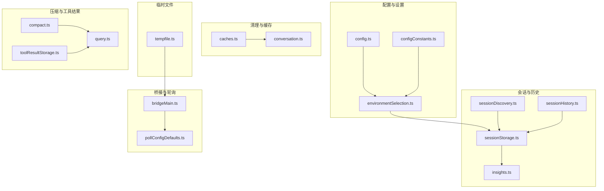
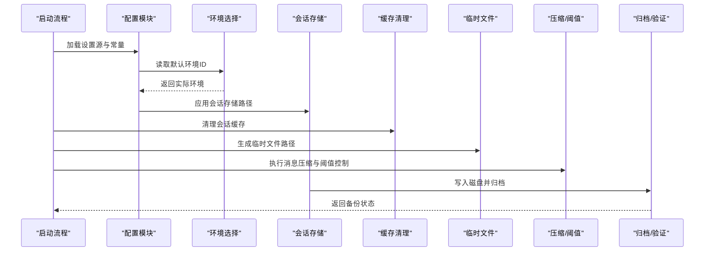
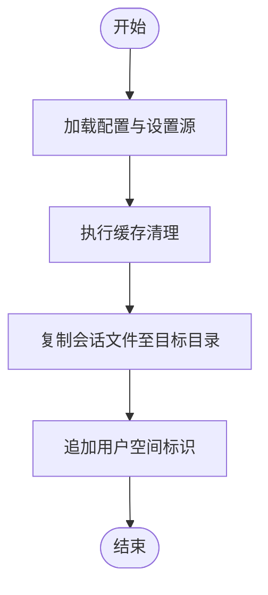
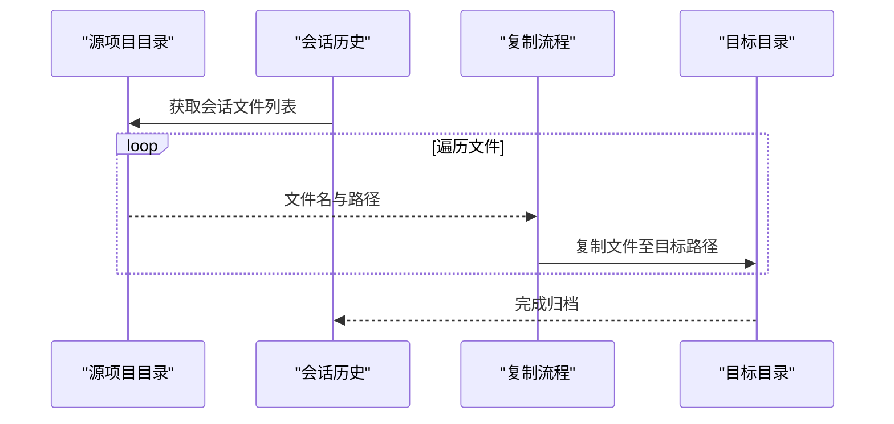
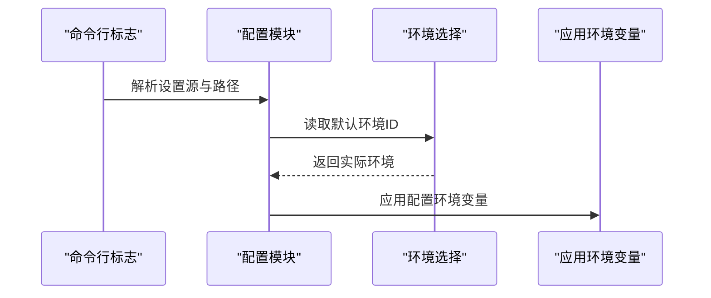
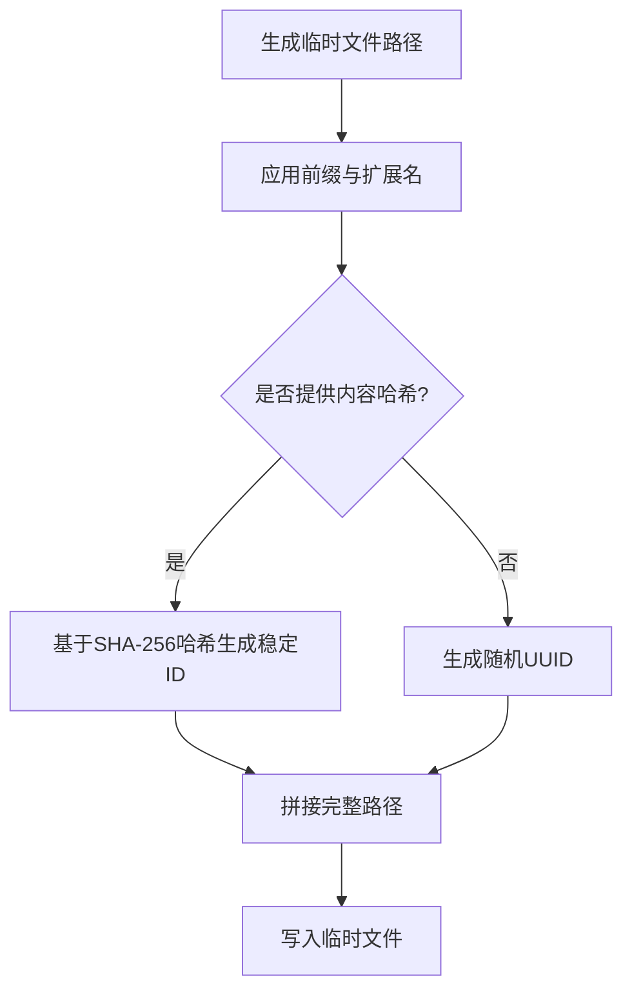
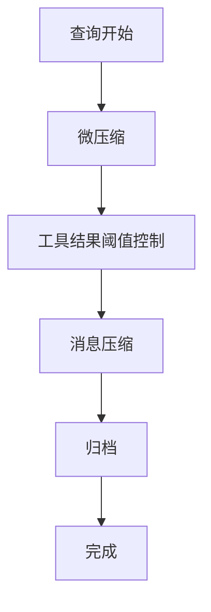
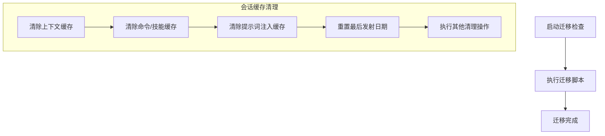
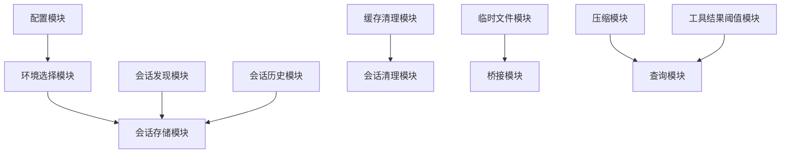

# 备份策略

<cite>
**本文档引用的文件**
- [main.tsx](file://src/main.tsx)
- [config.ts](file://src/utils/config.ts)
- [configConstants.ts](file://src/utils/configConstants.ts)
- [tempfile.ts](file://src/utils/tempfile.ts)
- [sessionStorage.ts](file://src/utils/sessionStorage.ts)
- [sessionDiscovery.ts](file://src/assistant/sessionDiscovery.ts)
- [sessionHistory.ts](file://src/assistant/sessionHistory.ts)
- [insights.ts](file://src/commands/insights.ts)
- [caches.ts](file://src/commands/clear/caches.ts)
- [conversation.ts](file://src/commands/clear/conversation.ts)
- [pollConfigDefaults.ts](file://src/bridge/pollConfigDefaults.ts)
- [bridgeMain.ts](file://src/bridge/bridgeMain.ts)
- [environmentSelection.ts](file://src/utils/teleport/environmentSelection.ts)
- [toolResultStorage.ts](file://src/utils/toolResultStorage.ts)
- [compact.ts](file://src/commands/compact/compact.ts)
- [query.ts](file://src/query.ts)
- [.gitignore](file://.codegraph/.gitignore)
</cite>

## 目录
1. [简介](#简介)
2. [项目结构](#项目结构)
3. [核心组件](#核心组件)
4. [架构总览](#架构总览)
5. [详细组件分析](#详细组件分析)
6. [依赖关系分析](#依赖关系分析)
7. [性能考虑](#性能考虑)
8. [故障排除指南](#故障排除指南)
9. [结论](#结论)
10. [附录](#附录)

## 简介
本文件系统性阐述该代码库中的备份策略设计与实现，覆盖全量备份与增量备份的机制、触发条件、频率与存储位置；会话数据、配置文件与临时文件的备份流程；备份数据的压缩与加密方法；版本管理与清理策略；配置项与自定义设置（保留期限与存储空间限制）；以及备份验证与完整性检查方法。为便于不同技术背景的读者理解，文档采用分层说明与可视化图示相结合的方式。

## 项目结构
围绕备份策略的关键模块分布如下：
- 配置与设置：负责备份相关参数的加载与合并来源
- 会话与历史：负责会话数据的持久化与发现
- 清理与缓存：负责会话级缓存清理与资源回收
- 临时文件：负责临时文件生成与路径管理
- 桥接与轮询：负责桥接会话的运行与调试文件输出
- 压缩与工具结果存储：负责消息压缩与工具结果阈值控制
- 环境选择：负责远程环境默认配置的读取与应用

**图表来源**
- [config.ts](file://src/utils/config.ts)
- [configConstants.ts](file://src/utils/configConstants.ts)
- [environmentSelection.ts](file://src/utils/teleport/environmentSelection.ts)
- [sessionDiscovery.ts](file://src/assistant/sessionDiscovery.ts)
- [sessionHistory.ts](file://src/assistant/sessionHistory.ts)
- [sessionStorage.ts](file://src/utils/sessionStorage.ts)
- [insights.ts](file://src/commands/insights.ts)
- [caches.ts](file://src/commands/clear/caches.ts)
- [conversation.ts](file://src/commands/clear/conversation.ts)
- [tempfile.ts](file://src/utils/tempfile.ts)
- [bridgeMain.ts](file://src/bridge/bridgeMain.ts)
- [pollConfigDefaults.ts](file://src/bridge/pollConfigDefaults.ts)
- [compact.ts](file://src/commands/compact/compact.ts)
- [query.ts](file://src/query.ts)
- [toolResultStorage.ts](file://src/utils/toolResultStorage.ts)

**章节来源**
- [config.ts](file://src/utils/config.ts)
- [configConstants.ts](file://src/utils/configConstants.ts)
- [environmentSelection.ts](file://src/utils/teleport/environmentSelection.ts)
- [sessionDiscovery.ts](file://src/assistant/sessionDiscovery.ts)
- [sessionHistory.ts](file://src/assistant/sessionHistory.ts)
- [sessionStorage.ts](file://src/utils/sessionStorage.ts)
- [insights.ts](file://src/commands/insights.ts)
- [caches.ts](file://src/commands/clear/caches.ts)
- [conversation.ts](file://src/commands/clear/conversation.ts)
- [tempfile.ts](file://src/utils/tempfile.ts)
- [bridgeMain.ts](file://src/bridge/bridgeMain.ts)
- [pollConfigDefaults.ts](file://src/bridge/pollConfigDefaults.ts)
- [compact.ts](file://src/commands/compact/compact.ts)
- [query.ts](file://src/query.ts)
- [toolResultStorage.ts](file://src/utils/toolResultStorage.ts)

## 核心组件
- 配置加载与来源合并：通过设置源与常量配置，统一加载与应用用户、项目、本地与策略等多源设置，确保备份相关参数在启动时生效。
- 会话数据持久化：会话发现与历史模块配合会话存储模块，将对话内容写入磁盘，支持按项目目录复制与归档。
- 缓存清理与会话恢复：清理会话相关缓存以确保恢复后的新鲜状态，避免陈旧上下文影响备份一致性。
- 临时文件管理：生成稳定或随机的临时文件路径，用于桥接调试日志等场景，便于定位问题与审计。
- 消息压缩与工具结果阈值：在查询前进行消息压缩与微压缩，控制工具结果大小，间接影响备份体积与性能。
- 远程环境默认配置：从设置中读取默认环境ID，结合可用环境列表确定实际使用的环境，保障跨环境备份的一致性。

**章节来源**
- [config.ts](file://src/utils/config.ts)
- [configConstants.ts](file://src/utils/configConstants.ts)
- [environmentSelection.ts](file://src/utils/teleport/environmentSelection.ts)
- [sessionDiscovery.ts](file://src/assistant/sessionDiscovery.ts)
- [sessionHistory.ts](file://src/assistant/sessionHistory.ts)
- [sessionStorage.ts](file://src/utils/sessionStorage.ts)
- [insights.ts](file://src/commands/insights.ts)
- [caches.ts](file://src/commands/clear/caches.ts)
- [conversation.ts](file://src/commands/clear/conversation.ts)
- [tempfile.ts](file://src/utils/tempfile.ts)
- [compact.ts](file://src/commands/compact/compact.ts)
- [query.ts](file://src/query.ts)
- [toolResultStorage.ts](file://src/utils/toolResultStorage.ts)

## 架构总览
备份策略的整体流程由“配置加载—会话持久化—清理缓存—临时文件—压缩与阈值—远程环境—归档与验证”构成。下图展示了关键模块间的交互关系：

**图表来源**
- [config.ts](file://src/utils/config.ts)
- [configConstants.ts](file://src/utils/configConstants.ts)
- [environmentSelection.ts](file://src/utils/teleport/environmentSelection.ts)
- [sessionStorage.ts](file://src/utils/sessionStorage.ts)
- [caches.ts](file://src/commands/clear/caches.ts)
- [tempfile.ts](file://src/utils/tempfile.ts)
- [compact.ts](file://src/commands/compact/compact.ts)
- [query.ts](file://src/query.ts)
- [toolResultStorage.ts](file://src/utils/toolResultStorage.ts)

## 详细组件分析

### 全量备份与增量备份机制
- 触发条件
  - 启动阶段：配置加载完成后，根据设置源与常量配置应用备份相关参数。
  - 会话恢复：执行缓存清理，确保恢复后的会话上下文新鲜，避免陈旧数据参与备份。
  - 归档命令：通过会话文件复制到目标目录，形成全量归档。
- 频率
  - 未在代码中显式定义固定周期；可通过外部调度器（如计划任务）调用归档命令实现定期全量备份。
- 存储位置
  - 会话文件按项目目录组织，复制到目标目录时追加当前用户空间标识，形成独立归档路径。
- 增量备份
  - 当前实现以全量复制为主；若需增量，可在归档前比较时间戳或哈希，仅复制变更文件。

**图表来源**
- [config.ts](file://src/utils/config.ts)
- [caches.ts](file://src/commands/clear/caches.ts)
- [insights.ts](file://src/commands/insights.ts)

**章节来源**
- [config.ts](file://src/utils/config.ts)
- [caches.ts](file://src/commands/clear/caches.ts)
- [insights.ts](file://src/commands/insights.ts)

### 会话数据备份流程
- 数据来源：会话发现与历史模块提供会话文件列表，筛选以特定扩展名结尾的文件。
- 复制逻辑：遍历项目目录，逐个复制会话文件到目标项目目录，跳过已存在文件。
- 输出：生成带用户空间标识的目标路径，便于区分不同用户的归档。

**图表来源**
- [sessionDiscovery.ts](file://src/assistant/sessionDiscovery.ts)
- [sessionHistory.ts](file://src/assistant/sessionHistory.ts)
- [insights.ts](file://src/commands/insights.ts)

**章节来源**
- [sessionDiscovery.ts](file://src/assistant/sessionDiscovery.ts)
- [sessionHistory.ts](file://src/assistant/sessionHistory.ts)
- [insights.ts](file://src/commands/insights.ts)

### 配置文件备份流程
- 设置来源：用户设置、项目设置、本地设置与策略设置按优先级合并，最终生效配置决定备份行为。
- 默认环境：从合并设置中读取默认环境ID，结合可用环境列表确定实际使用环境。
- 应用时机：在启动流程中应用配置环境变量，确保后续组件读取到正确的备份参数。

**图表来源**
- [config.ts](file://src/utils/config.ts)
- [configConstants.ts](file://src/utils/configConstants.ts)
- [environmentSelection.ts](file://src/utils/teleport/environmentSelection.ts)
- [main.tsx](file://src/main.tsx)

**章节来源**
- [config.ts](file://src/utils/config.ts)
- [configConstants.ts](file://src/utils/configConstants.ts)
- [environmentSelection.ts](file://src/utils/teleport/environmentSelection.ts)
- [main.tsx](file://src/main.tsx)

### 临时文件备份流程
- 生成策略：根据前缀、扩展名与可选内容哈希生成稳定或随机的临时文件路径，确保在需要时可复现路径。
- 使用场景：桥接调试日志等临时文件，便于问题定位与审计。

**图表来源**
- [tempfile.ts](file://src/utils/tempfile.ts)

**章节来源**
- [tempfile.ts](file://src/utils/tempfile.ts)

### 备份数据的压缩与加密
- 压缩
  - 查询前执行消息压缩与微压缩，减少输入令牌占用，间接降低备份体积与传输成本。
  - 工具结果大小受阈值控制，避免过大结果进入备份。
- 加密
  - 代码库未直接实现备份文件的端到端加密；建议在外部归档层（如压缩包密码保护、云存储加密）实现加密策略。

**图表来源**
- [compact.ts](file://src/commands/compact/compact.ts)
- [query.ts](file://src/query.ts)
- [toolResultStorage.ts](file://src/utils/toolResultStorage.ts)

**章节来源**
- [compact.ts](file://src/commands/compact/compact.ts)
- [query.ts](file://src/query.ts)
- [toolResultStorage.ts](file://src/utils/toolResultStorage.ts)

### 版本管理与清理策略
- 版本管理
  - 运行迁移版本检查，确保迁移脚本按顺序执行，避免版本不一致导致的数据异常。
- 清理策略
  - 会话缓存清理：清除上下文缓存、命令/技能缓存、提示词注入缓存、最后发射日期等，确保恢复后上下文新鲜。
  - 会话结束钩子：在清理会话前执行会话结束钩子，保证资源正确释放。
  - 临时文件：通过临时文件模块生成稳定或随机路径，便于问题定位与审计。

**图表来源**
- [main.tsx](file://src/main.tsx)
- [caches.ts](file://src/commands/clear/caches.ts)
- [conversation.ts](file://src/commands/clear/conversation.ts)
- [tempfile.ts](file://src/utils/tempfile.ts)

**章节来源**
- [main.tsx](file://src/main.tsx)
- [caches.ts](file://src/commands/clear/caches.ts)
- [conversation.ts](file://src/commands/clear/conversation.ts)
- [tempfile.ts](file://src/utils/tempfile.ts)

### 配置选项与自定义设置
- 备份保留期限
  - 代码库未提供内置的保留期限配置项；可通过外部归档策略（如定期删除旧版本）实现。
- 存储空间限制
  - 代码库未提供内置的存储空间上限配置；可通过外部归档工具（如带配额的压缩包）实现。
- 设置来源与优先级
  - 用户设置、项目设置、本地设置与策略设置按优先级合并，最终生效配置决定备份行为。
- 默认环境ID
  - 从合并设置中读取默认环境ID，结合可用环境列表确定实际使用环境。

**章节来源**
- [config.ts](file://src/utils/config.ts)
- [configConstants.ts](file://src/utils/configConstants.ts)
- [environmentSelection.ts](file://src/utils/teleport/environmentSelection.ts)

### 备份验证与完整性检查
- 验证机制
  - 代码库未提供内置的备份完整性校验；建议在外部归档层增加校验步骤（如哈希比对、解压自检）。
- 完整性检查
  - 可通过对比归档前后文件数量、大小与哈希值，确保备份数据完整无损。

**章节来源**
- [insights.ts](file://src/commands/insights.ts)

## 依赖关系分析
- 组件耦合
  - 配置模块与环境选择模块紧密耦合，共同决定备份参数的最终生效值。
  - 会话存储模块依赖会话发现与历史模块提供的文件列表。
  - 缓存清理模块与会话恢复流程耦合，确保恢复后上下文新鲜。
- 外部依赖
  - 临时文件模块依赖操作系统临时目录与哈希算法，用于生成稳定或随机路径。
  - 归档流程依赖文件系统操作，确保复制与写入成功。

**图表来源**
- [config.ts](file://src/utils/config.ts)
- [configConstants.ts](file://src/utils/configConstants.ts)
- [environmentSelection.ts](file://src/utils/teleport/environmentSelection.ts)
- [sessionStorage.ts](file://src/utils/sessionStorage.ts)
- [sessionDiscovery.ts](file://src/assistant/sessionDiscovery.ts)
- [sessionHistory.ts](file://src/assistant/sessionHistory.ts)
- [caches.ts](file://src/commands/clear/caches.ts)
- [conversation.ts](file://src/commands/clear/conversation.ts)
- [tempfile.ts](file://src/utils/tempfile.ts)
- [bridgeMain.ts](file://src/bridge/bridgeMain.ts)
- [compact.ts](file://src/commands/compact/compact.ts)
- [query.ts](file://src/query.ts)
- [toolResultStorage.ts](file://src/utils/toolResultStorage.ts)

**章节来源**
- [config.ts](file://src/utils/config.ts)
- [configConstants.ts](file://src/utils/configConstants.ts)
- [environmentSelection.ts](file://src/utils/teleport/environmentSelection.ts)
- [sessionStorage.ts](file://src/utils/sessionStorage.ts)
- [sessionDiscovery.ts](file://src/assistant/sessionDiscovery.ts)
- [sessionHistory.ts](file://src/assistant/sessionHistory.ts)
- [caches.ts](file://src/commands/clear/caches.ts)
- [conversation.ts](file://src/commands/clear/conversation.ts)
- [tempfile.ts](file://src/utils/tempfile.ts)
- [bridgeMain.ts](file://src/bridge/bridgeMain.ts)
- [compact.ts](file://src/commands/compact/compact.ts)
- [query.ts](file://src/query.ts)
- [toolResultStorage.ts](file://src/utils/toolResultStorage.ts)

## 性能考虑
- 压缩与阈值控制：在查询前进行压缩与工具结果阈值控制，减少输入令牌与备份体积，提升整体性能。
- 缓存清理：及时清理会话缓存，避免陈旧上下文影响后续处理，减少不必要的计算开销。
- 临时文件：通过稳定路径与随机路径的组合，平衡可复现性与安全性，减少重复计算与无效写入。

**章节来源**
- [compact.ts](file://src/commands/compact/compact.ts)
- [query.ts](file://src/query.ts)
- [toolResultStorage.ts](file://src/utils/toolResultStorage.ts)
- [caches.ts](file://src/commands/clear/caches.ts)

## 故障排除指南
- 启动失败
  - 检查设置源解析与路径有效性，确保配置文件可读且格式正确。
  - 关注迁移版本检查日志，确保所有迁移脚本成功执行。
- 归档失败
  - 检查源项目目录权限与目标目录写入权限，确认文件复制过程无阻塞。
  - 对比文件数量与哈希值，定位缺失或损坏的文件。
- 缓存问题
  - 执行缓存清理后重启应用，确保新会话上下文正确加载。
  - 检查会话结束钩子执行情况，避免资源泄漏导致的异常。

**章节来源**
- [main.tsx](file://src/main.tsx)
- [insights.ts](file://src/commands/insights.ts)
- [caches.ts](file://src/commands/clear/caches.ts)
- [conversation.ts](file://src/commands/clear/conversation.ts)

## 结论
该备份策略以配置加载、会话持久化、缓存清理与临时文件管理为核心，结合消息压缩与工具结果阈值控制，形成完整的备份体系。当前实现侧重全量归档与恢复后的上下文新鲜度保障；若需增强，可在外部归档层引入加密、保留期限与存储空间限制，并补充备份验证与完整性检查机制。

## 附录
- 相关文件与路径
  - 配置与常量：[config.ts](file://src/utils/config.ts)、[configConstants.ts](file://src/utils/configConstants.ts)
  - 会话与历史：[sessionDiscovery.ts](file://src/assistant/sessionDiscovery.ts)、[sessionHistory.ts](file://src/assistant/sessionHistory.ts)、[sessionStorage.ts](file://src/utils/sessionStorage.ts)、[insights.ts](file://src/commands/insights.ts)
  - 清理与缓存：[caches.ts](file://src/commands/clear/caches.ts)、[conversation.ts](file://src/commands/clear/conversation.ts)
  - 临时文件：[tempfile.ts](file://src/utils/tempfile.ts)
  - 桥接与轮询：[bridgeMain.ts](file://src/bridge/bridgeMain.ts)、[pollConfigDefaults.ts](file://src/bridge/pollConfigDefaults.ts)
  - 压缩与阈值：[compact.ts](file://src/commands/compact/compact.ts)、[query.ts](file://src/query.ts)、[toolResultStorage.ts](file://src/utils/toolResultStorage.ts)
  - 环境选择：[environmentSelection.ts](file://src/utils/teleport/environmentSelection.ts)
  - 其他：[main.tsx](file://src/main.tsx)、[.gitignore](file://.codegraph/.gitignore)