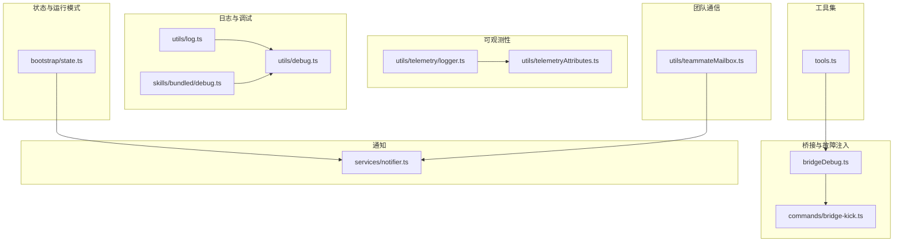
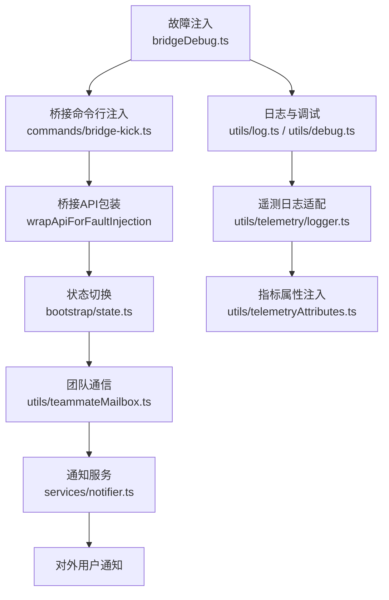
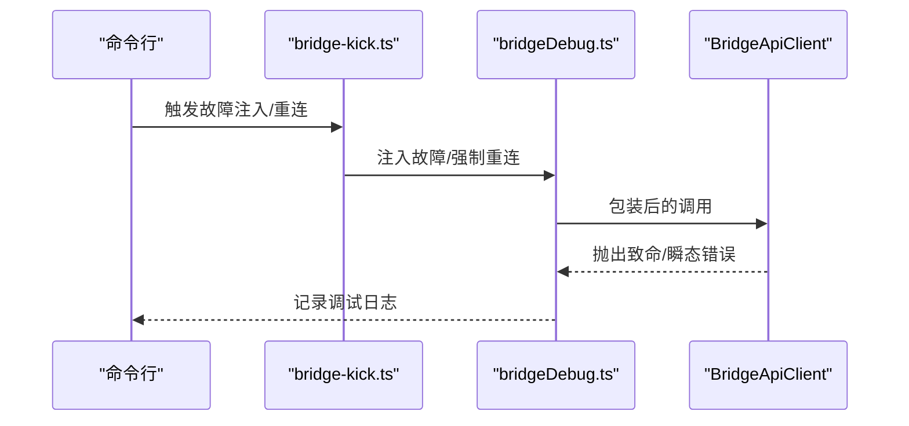
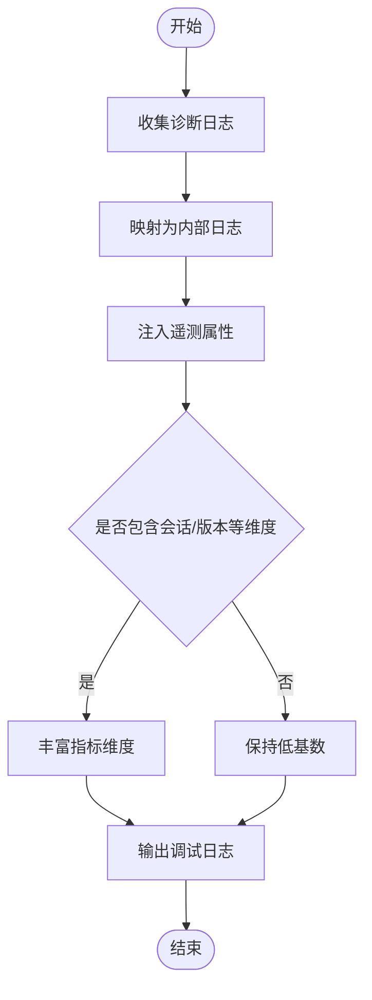
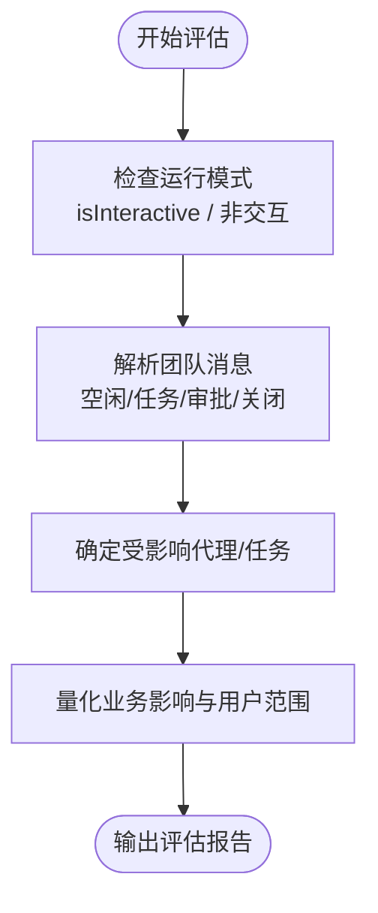
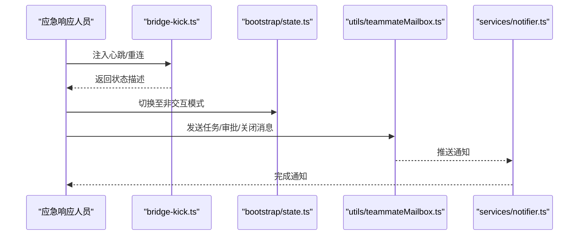
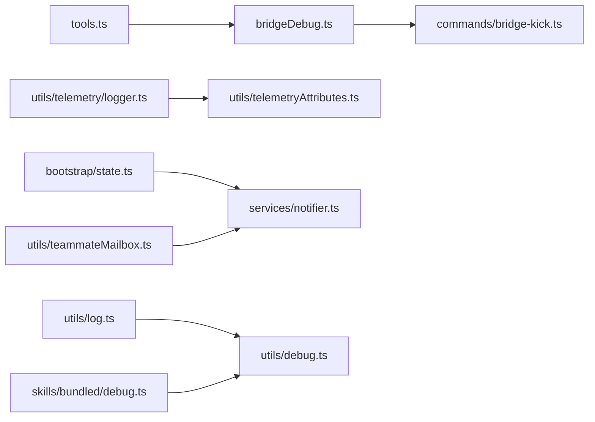

# 应急响应

<cite>
**本文引用的文件**
- [src/bridge/bridgeDebug.ts](file://src/bridge/bridgeDebug.ts)
- [src/commands/bridge-kick.ts](file://src/commands/bridge-kick.ts)
- [src/utils/telemetry/logger.ts](file://src/utils/telemetry/logger.ts)
- [src/utils/telemetryAttributes.ts](file://src/utils/telemetryAttributes.ts)
- [src/bootstrap/state.ts](file://src/bootstrap/state.ts)
- [src/utils/teammateMailbox.ts](file://src/utils/teammateMailbox.ts)
- [src/services/notifier.ts](file://src/services/notifier.ts)
- [src/utils/log.ts](file://src/utils/log.ts)
- [src/utils/debug.ts](file://src/utils/debug.ts)
- [src/skills/bundled/debug.ts](file://src/skills/bundled/debug.ts)
- [src/tools.ts](file://src/tools.ts)
- [src/commands/insights.ts](file://src/commands/insights.ts)
</cite>

## 目录
1. 引言
2. 项目结构
3. 核心组件
4. 架构总览
5. 组件详解
6. 依赖关系分析
7. 性能与可观测性
8. 故障排查指南
9. 结论
10. 附录

## 引言
本文件面向“应急响应”主题，结合代码库中的桥接调试、遥测、状态管理、消息与通知等能力，构建一套可落地的应急响应流程：从故障识别（异常注入、性能监控、日志分析）到影响评估（业务影响、数据与用户范围），再到应急处理（紧急修复、临时方案、用户通知），并明确团队职责、沟通机制、文档记录与事后分析，以及培训与演练要求。

## 项目结构
围绕应急响应的关键技术点，相关模块主要分布在以下区域：
- 桥接与故障注入：bridge 调试工具与命令行注入器
- 遥测与指标：OpenTelemetry 日志适配与属性注入
- 状态与运行模式：全局状态开关与非交互模式
- 团队内通信：Teammate Mailbox 消息协议
- 通知服务：统一通知器
- 日志与调试：通用日志与调试工具
- 工具集：监控工具与条件编译特性

图表来源
- [src/bridge/bridgeDebug.ts:77-110](file://src/bridge/bridgeDebug.ts#L77-L110)
- [src/commands/bridge-kick.ts:159-200](file://src/commands/bridge-kick.ts#L159-L200)
- [src/utils/telemetry/logger.ts:1-26](file://src/utils/telemetry/logger.ts#L1-L26)
- [src/utils/telemetryAttributes.ts:1-42](file://src/utils/telemetryAttributes.ts#L1-L42)
- [src/bootstrap/state.ts:1043-1099](file://src/bootstrap/state.ts#L1043-L1099)
- [src/utils/teammateMailbox.ts:391-977](file://src/utils/teammateMailbox.ts#L391-L977)
- [src/services/notifier.ts](file://src/services/notifier.ts)
- [src/utils/log.ts](file://src/utils/log.ts)
- [src/utils/debug.ts](file://src/utils/debug.ts)
- [src/skills/bundled/debug.ts](file://src/skills/bundled/debug.ts)
- [src/tools.ts:24-55](file://src/tools.ts#L24-L55)

章节来源
- [src/bridge/bridgeDebug.ts:77-110](file://src/bridge/bridgeDebug.ts#L77-L110)
- [src/commands/bridge-kick.ts:159-200](file://src/commands/bridge-kick.ts#L159-L200)
- [src/utils/telemetry/logger.ts:1-26](file://src/utils/telemetry/logger.ts#L1-L26)
- [src/utils/telemetryAttributes.ts:1-42](file://src/utils/telemetryAttributes.ts#L1-L42)
- [src/bootstrap/state.ts:1043-1099](file://src/bootstrap/state.ts#L1043-L1099)
- [src/utils/teammateMailbox.ts:391-977](file://src/utils/teammateMailbox.ts#L391-L977)
- [src/services/notifier.ts](file://src/services/notifier.ts)
- [src/utils/log.ts](file://src/utils/log.ts)
- [src/utils/debug.ts](file://src/utils/debug.ts)
- [src/skills/bundled/debug.ts](file://src/skills/bundled/debug.ts)
- [src/tools.ts:24-55](file://src/tools.ts#L24-L55)

## 核心组件
- 故障注入与桥接恢复：通过桥接调试包装 API 并在命中队列时抛出致命或瞬态错误；命令行支持强制重连与心跳注入，便于演练真实故障场景。
- 遥测与日志：统一的 OpenTelemetry 诊断日志适配器，将错误与警告写入内部日志系统，并输出调试信息；指标属性按环境变量控制是否包含会话 ID、版本号等。
- 状态与运行模式：全局状态维护交互/非交互模式、SDK 进度摘要开关、Kairos 开关等，支撑应急处置时的非交互执行与严格配对校验。
- 团队内通信：定义了空闲通知、任务分配、计划审批、关闭请求等消息类型与解析函数，用于跨代理协作与应急升级。
- 通知服务：集中化通知器，作为对外用户通知的统一出口。
- 日志与调试：通用日志与调试工具，配合技能层调试脚本，形成端到端的可观测闭环。

章节来源
- [src/bridge/bridgeDebug.ts:77-110](file://src/bridge/bridgeDebug.ts#L77-L110)
- [src/commands/bridge-kick.ts:159-200](file://src/commands/bridge-kick.ts#L159-L200)
- [src/utils/telemetry/logger.ts:1-26](file://src/utils/telemetry/logger.ts#L1-L26)
- [src/utils/telemetryAttributes.ts:1-42](file://src/utils/telemetryAttributes.ts#L1-L42)
- [src/bootstrap/state.ts:1043-1099](file://src/bootstrap/state.ts#L1043-L1099)
- [src/utils/teammateMailbox.ts:391-977](file://src/utils/teammateMailbox.ts#L391-L977)
- [src/services/notifier.ts](file://src/services/notifier.ts)
- [src/utils/log.ts](file://src/utils/log.ts)
- [src/utils/debug.ts](file://src/utils/debug.ts)
- [src/skills/bundled/debug.ts](file://src/skills/bundled/debug.ts)

## 架构总览
下图展示了应急响应流程中各组件的交互关系：从“故障注入/监控”触发事件，经“状态切换/非交互模式”稳定执行，到“团队通信/通知”对外发布，最终由“日志/遥测”沉淀证据与指标。

图表来源
- [src/bridge/bridgeDebug.ts:77-110](file://src/bridge/bridgeDebug.ts#L77-L110)
- [src/commands/bridge-kick.ts:159-200](file://src/commands/bridge-kick.ts#L159-L200)
- [src/bootstrap/state.ts:1043-1099](file://src/bootstrap/state.ts#L1043-L1099)
- [src/utils/teammateMailbox.ts:391-977](file://src/utils/teammateMailbox.ts#L391-L977)
- [src/services/notifier.ts](file://src/services/notifier.ts)
- [src/utils/log.ts](file://src/utils/log.ts)
- [src/utils/debug.ts](file://src/utils/debug.ts)
- [src/utils/telemetry/logger.ts:1-26](file://src/utils/telemetry/logger.ts#L1-L26)
- [src/utils/telemetryAttributes.ts:1-42](file://src/utils/telemetryAttributes.ts#L1-L42)

## 组件详解

### 故障识别与注入
- 桥接调试包装：在特定条件下拦截 API 调用，消费故障队列并抛出致命或瞬态错误，便于测试与演练真实故障路径。
- 命令行注入：支持心跳失败、强制重连、状态查询等操作，便于在本地快速复现与验证桥接链路问题。
- 监控工具：条件编译启用的监控工具可用于持续观测系统健康度与性能阈值。

图表来源
- [src/commands/bridge-kick.ts:159-200](file://src/commands/bridge-kick.ts#L159-L200)
- [src/bridge/bridgeDebug.ts:77-110](file://src/bridge/bridgeDebug.ts#L77-L110)

章节来源
- [src/bridge/bridgeDebug.ts:77-110](file://src/bridge/bridgeDebug.ts#L77-L110)
- [src/commands/bridge-kick.ts:159-200](file://src/commands/bridge-kick.ts#L159-L200)
- [src/tools.ts:24-55](file://src/tools.ts#L24-L55)

### 性能监控与日志分析
- 遥测日志适配：将第三方诊断日志映射为内部错误/警告，并输出调试信息，便于定位异常根因。
- 指标属性注入：根据环境变量决定是否包含会话 ID、版本号等维度，降低指标基数并提升可追踪性。
- 日志与调试：统一的日志入口与调试工具，配合技能层调试脚本，形成端到端可观测闭环。

图表来源
- [src/utils/telemetry/logger.ts:1-26](file://src/utils/telemetry/logger.ts#L1-L26)
- [src/utils/telemetryAttributes.ts:1-42](file://src/utils/telemetryAttributes.ts#L1-L42)
- [src/utils/log.ts](file://src/utils/log.ts)
- [src/utils/debug.ts](file://src/utils/debug.ts)
- [src/skills/bundled/debug.ts](file://src/skills/bundled/debug.ts)

章节来源
- [src/utils/telemetry/logger.ts:1-26](file://src/utils/telemetry/logger.ts#L1-L26)
- [src/utils/telemetryAttributes.ts:1-42](file://src/utils/telemetryAttributes.ts#L1-L42)
- [src/utils/log.ts](file://src/utils/log.ts)
- [src/utils/debug.ts](file://src/utils/debug.ts)
- [src/skills/bundled/debug.ts](file://src/skills/bundled/debug.ts)

### 影响评估
- 业务影响分析：利用全局状态中的非交互模式与 SDK 进度摘要开关，评估应急处置对自动化流程的影响范围。
- 数据与用户影响范围：通过团队内通信的消息协议（空闲通知、任务分配、计划审批、关闭请求）判断受影响的代理与任务链路。

图表来源
- [src/bootstrap/state.ts:1043-1099](file://src/bootstrap/state.ts#L1043-L1099)
- [src/utils/teammateMailbox.ts:391-977](file://src/utils/teammateMailbox.ts#L391-L977)

章节来源
- [src/bootstrap/state.ts:1043-1099](file://src/bootstrap/state.ts#L1043-L1099)
- [src/utils/teammateMailbox.ts:391-977](file://src/utils/teammateMailbox.ts#L391-L977)

### 应急处理步骤
- 紧急修复：通过桥接命令行注入模拟真实故障，验证修复路径与回滚策略。
- 临时方案：在非交互模式下稳定执行，避免进一步扰动；必要时启用严格工具结果配对以确保一致性。
- 用户通知：通过通知器统一对外发布，结合团队消息协议进行内部升级与协同。

图表来源
- [src/commands/bridge-kick.ts:159-200](file://src/commands/bridge-kick.ts#L159-L200)
- [src/bootstrap/state.ts:1043-1099](file://src/bootstrap/state.ts#L1043-L1099)
- [src/utils/teammateMailbox.ts:391-977](file://src/utils/teammateMailbox.ts#L391-L977)
- [src/services/notifier.ts](file://src/services/notifier.ts)

章节来源
- [src/commands/bridge-kick.ts:159-200](file://src/commands/bridge-kick.ts#L159-L200)
- [src/bootstrap/state.ts:1043-1099](file://src/bootstrap/state.ts#L1043-L1099)
- [src/utils/teammateMailbox.ts:391-977](file://src/utils/teammateMailbox.ts#L391-L977)
- [src/services/notifier.ts](file://src/services/notifier.ts)

### 应急响应团队职责与沟通机制
- 职责分工建议：
  - 指挥员：负责总体协调、决策与对外沟通
  - 技术专家：负责故障注入验证、修复与回滚
  - 运维工程师：负责状态切换、非交互模式与通知发布
  - 观察员：负责日志与遥测采集、影响评估与事后分析
- 沟通机制：
  - 使用团队内消息协议（空闲通知、任务分配、计划审批、关闭请求）进行跨代理协作
  - 通过通知器统一对外发布用户可见信息

章节来源
- [src/utils/teammateMailbox.ts:391-977](file://src/utils/teammateMailbox.ts#L391-L977)
- [src/services/notifier.ts](file://src/services/notifier.ts)

### 文档记录与事后分析
- 文档记录：将故障注入参数、状态切换、通知内容、日志片段与指标截图归档
- 事后分析：基于团队消息协议中的任务与审批记录，复盘处置过程；结合遥测属性与日志，定位根因并优化预案

章节来源
- [src/utils/telemetryAttributes.ts:1-42](file://src/utils/telemetryAttributes.ts#L1-L42)
- [src/utils/teammateMailbox.ts:391-977](file://src/utils/teammateMailbox.ts#L391-L977)
- [src/commands/insights.ts:2687-2719](file://src/commands/insights.ts#L2687-L2719)

### 培训与演练
- 培训内容：故障注入工具使用、桥接命令行操作、非交互模式切换、团队消息协议与通知发布
- 演练要求：定期组织桌面演练，覆盖心跳失败、连接中断、任务阻塞等典型场景，验证预案有效性

## 依赖关系分析
- 组件耦合：
  - 桥接调试与命令行注入紧密耦合，共同构成故障注入闭环
  - 遥测日志适配与指标属性注入解耦于具体业务，提供横切关注点
  - 全局状态与通知服务分别承担运行模式与对外沟通职责，彼此独立但可协同
- 外部依赖：
  - OpenTelemetry 诊断日志接口
  - 条件编译特性（如 MONITOR_TOOL、AGENT_TRIGGERS 等）

图表来源
- [src/bridge/bridgeDebug.ts:77-110](file://src/bridge/bridgeDebug.ts#L77-L110)
- [src/commands/bridge-kick.ts:159-200](file://src/commands/bridge-kick.ts#L159-L200)
- [src/utils/telemetry/logger.ts:1-26](file://src/utils/telemetry/logger.ts#L1-L26)
- [src/utils/telemetryAttributes.ts:1-42](file://src/utils/telemetryAttributes.ts#L1-L42)
- [src/bootstrap/state.ts:1043-1099](file://src/bootstrap/state.ts#L1043-L1099)
- [src/utils/teammateMailbox.ts:391-977](file://src/utils/teammateMailbox.ts#L391-L977)
- [src/services/notifier.ts](file://src/services/notifier.ts)
- [src/utils/log.ts](file://src/utils/log.ts)
- [src/utils/debug.ts](file://src/utils/debug.ts)
- [src/skills/bundled/debug.ts](file://src/skills/bundled/debug.ts)
- [src/tools.ts:24-55](file://src/tools.ts#L24-L55)

章节来源
- [src/bridge/bridgeDebug.ts:77-110](file://src/bridge/bridgeDebug.ts#L77-L110)
- [src/commands/bridge-kick.ts:159-200](file://src/commands/bridge-kick.ts#L159-L200)
- [src/utils/telemetry/logger.ts:1-26](file://src/utils/telemetry/logger.ts#L1-L26)
- [src/utils/telemetryAttributes.ts:1-42](file://src/utils/telemetryAttributes.ts#L1-L42)
- [src/bootstrap/state.ts:1043-1099](file://src/bootstrap/state.ts#L1043-L1099)
- [src/utils/teammateMailbox.ts:391-977](file://src/utils/teammateMailbox.ts#L391-L977)
- [src/services/notifier.ts](file://src/services/notifier.ts)
- [src/utils/log.ts](file://src/utils/log.ts)
- [src/utils/debug.ts](file://src/utils/debug.ts)
- [src/skills/bundled/debug.ts](file://src/skills/bundled/debug.ts)
- [src/tools.ts:24-55](file://src/tools.ts#L24-L55)

## 性能与可观测性
- 指标维度控制：通过环境变量控制是否包含会话 ID、版本号等高基数属性，平衡可观测性与性能
- 日志与告警：统一的诊断日志适配器将第三方错误/警告转化为内部日志，便于集中检索与告警
- 非交互模式：在应急处置期间切换至非交互模式，减少外部输入干扰，提高稳定性

章节来源
- [src/utils/telemetryAttributes.ts:1-42](file://src/utils/telemetryAttributes.ts#L1-L42)
- [src/utils/telemetry/logger.ts:1-26](file://src/utils/telemetry/logger.ts#L1-L26)
- [src/bootstrap/state.ts:1043-1099](file://src/bootstrap/state.ts#L1043-L1099)

## 故障排查指南
- 快速复现桥接问题：使用命令行注入心跳失败或强制重连，观察桥接状态与调试日志
- 验证修复路径：通过桥接调试包装 API 的致命/瞬态错误模拟，确认修复后行为符合预期
- 审视日志与指标：检查诊断日志适配器输出与指标属性注入情况，定位异常根因
- 协同处置：通过团队消息协议发送任务/审批/关闭消息，确保内部协同一致

章节来源
- [src/commands/bridge-kick.ts:159-200](file://src/commands/bridge-kick.ts#L159-L200)
- [src/bridge/bridgeDebug.ts:77-110](file://src/bridge/bridgeDebug.ts#L77-L110)
- [src/utils/telemetry/logger.ts:1-26](file://src/utils/telemetry/logger.ts#L1-L26)
- [src/utils/telemetryAttributes.ts:1-42](file://src/utils/telemetryAttributes.ts#L1-L42)
- [src/utils/teammateMailbox.ts:391-977](file://src/utils/teammateMailbox.ts#L391-L977)

## 结论
本应急响应文档以代码库中的桥接调试、遥测、状态管理、团队通信与通知等能力为基础，提供了从故障识别、影响评估到应急处理、团队协作、文档记录与事后分析的全流程框架。建议在日常运维中结合条件编译特性与非交互模式，定期开展演练，持续完善预案与工具链。

## 附录
- 关键实现位置参考：
  - 故障注入与桥接恢复：[src/bridge/bridgeDebug.ts:77-110](file://src/bridge/bridgeDebug.ts#L77-L110)、[src/commands/bridge-kick.ts:159-200](file://src/commands/bridge-kick.ts#L159-L200)
  - 遥测与日志：[src/utils/telemetry/logger.ts:1-26](file://src/utils/telemetry/logger.ts#L1-L26)、[src/utils/telemetryAttributes.ts:1-42](file://src/utils/telemetryAttributes.ts#L1-L42)
  - 状态与运行模式：[src/bootstrap/state.ts:1043-1099](file://src/bootstrap/state.ts#L1043-L1099)
  - 团队通信：[src/utils/teammateMailbox.ts:391-977](file://src/utils/teammateMailbox.ts#L391-L977)
  - 通知服务：[src/services/notifier.ts](file://src/services/notifier.ts)
  - 日志与调试：[src/utils/log.ts](file://src/utils/log.ts)、[src/utils/debug.ts](file://src/utils/debug.ts)、[src/skills/bundled/debug.ts](file://src/skills/bundled/debug.ts)
  - 工具集：[src/tools.ts:24-55](file://src/tools.ts#L24-L55)
  - 事后分析：[src/commands/insights.ts:2687-2719](file://src/commands/insights.ts#L2687-L2719)