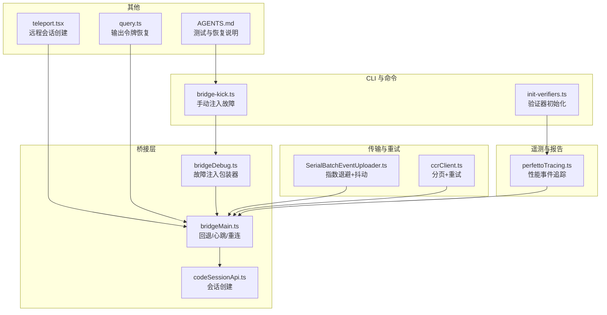
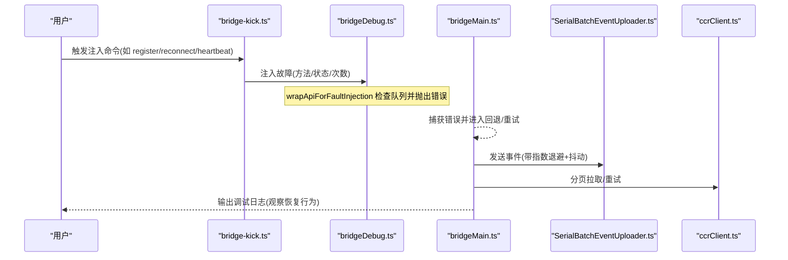
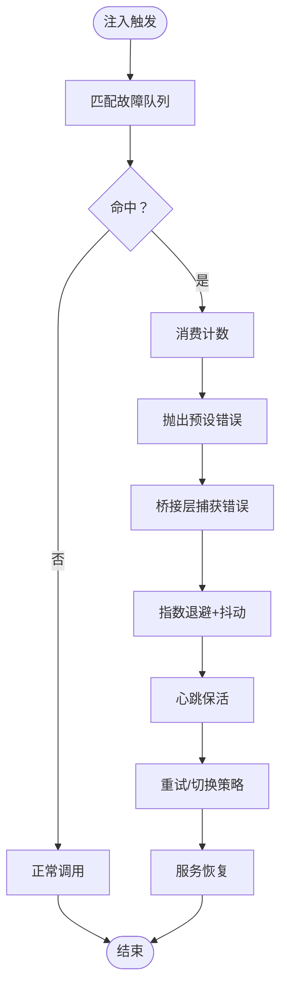
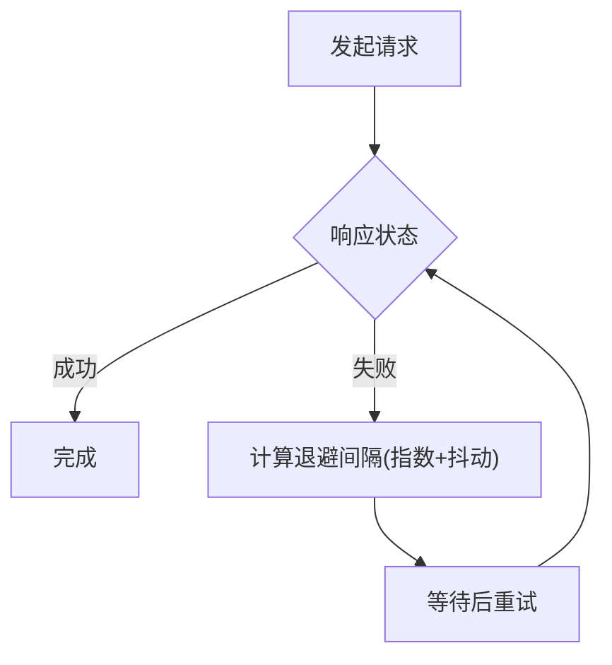
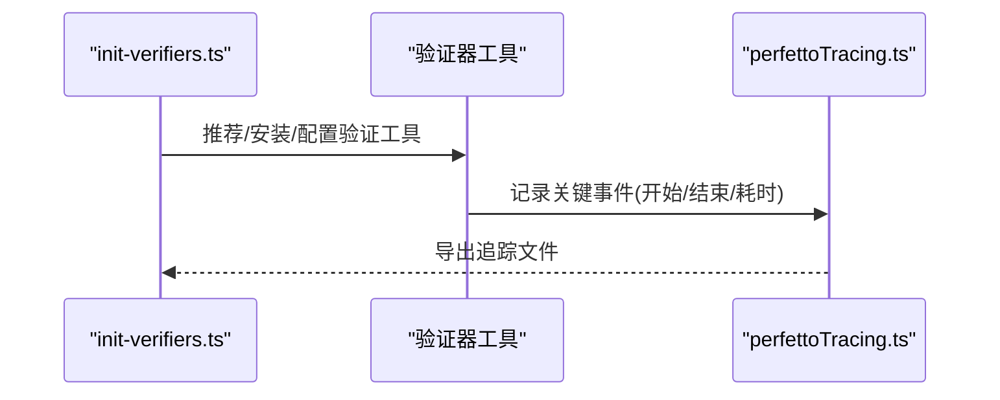
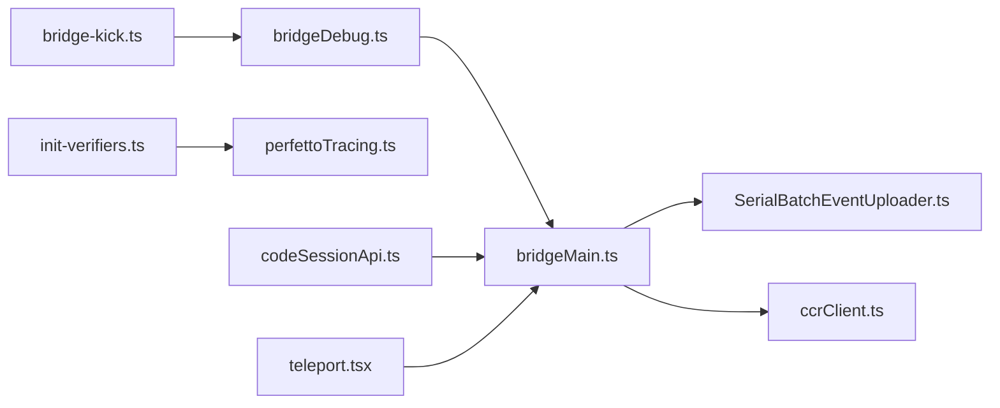

# 恢复测试

<cite>
**本文引用的文件**
- [src/commands/bridge-kick.ts](file://src/commands/bridge-kick.ts)
- [src/bridge/bridgeDebug.ts](file://src/bridge/bridgeDebug.ts)
- [src/bridge/bridgeMain.ts](file://src/bridge/bridgeMain.ts)
- [src/cli/transports/SerialBatchEventUploader.ts](file://src/cli/transports/SerialBatchEventUploader.ts)
- [src/cli/transports/ccrClient.ts](file://src/cli/transports/ccrClient.ts)
- [src/bridge/codeSessionApi.ts](file://src/bridge/codeSessionApi.ts)
- [src/utils/teleport.tsx](file://src/utils/teleport.tsx)
- [src/commands/init-verifiers.ts](file://src/commands/init-verifiers.ts)
- [src/commands/plugin/ValidatePlugin.tsx](file://src/commands/plugin/ValidatePlugin.tsx)
- [src/query.ts](file://src/query.ts)
- [AGENTS.md](file://AGENTS.md)
- [src/utils/telemetry/perfettoTracing.ts](file://src/utils/telemetry/perfettoTracing.ts)
</cite>

## 目录
1. [引言](#引言)
2. [项目结构](#项目结构)
3. [核心组件](#核心组件)
4. [架构总览](#架构总览)
5. [详细组件分析](#详细组件分析)
6. [依赖关系分析](#依赖关系分析)
7. [性能考量](#性能考量)
8. [故障排查指南](#故障排查指南)
9. [结论](#结论)
10. [附录](#附录)

## 引言
本文件系统化阐述本仓库中的“恢复测试”方法论与实践，围绕以下目标展开：  
- 故障演练设计与实施：基于内置的桥接层故障注入工具，构建可重复、可控的故障场景（如注册失败、重连失败、心跳异常等）。  
- 恢复时间验证：结合日志与遥测，度量 RTO（恢复时间目标）与 RPO（恢复点目标），评估系统在不同故障下的恢复能力。  
- 业务连续性测试：覆盖功能正确性、性能稳定性与用户体验一致性，确保在故障后仍能提供可用的服务。  
- 测试数据准备与管理：明确测试数据隔离与清理策略，避免对生产或共享环境造成影响。  
- 结果分析与报告：建立可追溯的观测指标与报告机制，支撑持续改进。  
- 自动化与持续集成：给出可落地的自动化脚本与流水线建议，提升测试效率与覆盖面。

## 项目结构
本仓库为一个大型多模块 TypeScript 应用，涉及 CLI、桥接层、远程会话、遥测与验证工具等。与恢复测试直接相关的关键目录与文件如下：  
- 命令与调试：/src/commands/bridge-kick.ts 提供手动注入桥接层故障的命令；/src/bridge/bridgeDebug.ts 实现故障注入包装器与队列管理。  
- 桥接与恢复：/src/bridge/bridgeMain.ts 包含连接错误回退、心跳保活与重连逻辑；/src/bridge/codeSessionApi.ts 提供会话创建的 API 调用封装。  
- 传输与重试：/src/cli/transports/SerialBatchEventUploader.ts 提供指数退避与抖动控制；/src/cli/transports/ccrClient.ts 提供分页拉取与重试机制。  
- 验证与报告：/src/commands/init-verifiers.ts 用于生成验证器技能与工具链配置；/src/utils/telemetry/perfettoTracing.ts 提供性能事件追踪与采样。  
- 其他辅助：/src/utils/teleport.tsx 提供远程任务会话创建；/src/query.ts 展示输出令牌限制与恢复路径；AGENTS.md 提供整体测试与恢复注意事项。

**图表来源**
- [src/commands/bridge-kick.ts:191-200](file://src/commands/bridge-kick.ts#L191-L200)
- [src/bridge/bridgeDebug.ts:84-110](file://src/bridge/bridgeDebug.ts#L84-L110)
- [src/bridge/bridgeMain.ts:1314-1339](file://src/bridge/bridgeMain.ts#L1314-L1339)
- [src/cli/transports/SerialBatchEventUploader.ts:235-275](file://src/cli/transports/SerialBatchEventUploader.ts#L235-L275)
- [src/cli/transports/ccrClient.ts:860-899](file://src/cli/transports/ccrClient.ts#L860-L899)
- [src/bridge/codeSessionApi.ts:26-61](file://src/bridge/codeSessionApi.ts#L26-L61)
- [src/utils/teleport.tsx:863-901](file://src/utils/teleport.tsx#L863-L901)
- [src/commands/init-verifiers.ts:60-184](file://src/commands/init-verifiers.ts#L60-L184)
- [src/utils/telemetry/perfettoTracing.ts:642-1055](file://src/utils/telemetry/perfettoTracing.ts#L642-L1055)
- [src/query.ts:1185-1221](file://src/query.ts#L1185-L1221)
- [AGENTS.md:19-33](file://AGENTS.md#L19-L33)

**章节来源**
- [src/commands/bridge-kick.ts:116-200](file://src/commands/bridge-kick.ts#L116-L200)
- [src/bridge/bridgeDebug.ts:1-110](file://src/bridge/bridgeDebug.ts#L1-L110)
- [src/bridge/bridgeMain.ts:1314-1339](file://src/bridge/bridgeMain.ts#L1314-L1339)
- [src/cli/transports/SerialBatchEventUploader.ts:235-275](file://src/cli/transports/SerialBatchEventUploader.ts#L235-L275)
- [src/cli/transports/ccrClient.ts:860-899](file://src/cli/transports/ccrClient.ts#L860-L899)
- [src/bridge/codeSessionApi.ts:26-61](file://src/bridge/codeSessionApi.ts#L26-L61)
- [src/utils/teleport.tsx:863-901](file://src/utils/teleport.tsx#L863-L901)
- [src/commands/init-verifiers.ts:60-184](file://src/commands/init-verifiers.ts#L60-L184)
- [src/utils/telemetry/perfettoTracing.ts:642-1055](file://src/utils/telemetry/perfettoTracing.ts#L642-L1055)
- [src/query.ts:1185-1221](file://src/query.ts#L1185-L1221)
- [AGENTS.md:19-33](file://AGENTS.md#L19-L33)

## 核心组件
- 故障注入与诊断
  - 手动注入命令：通过 /bridge-kick 子命令触发特定桥接 API 的故障（如注册失败、重连失败、心跳异常），并支持一次性或多次注入。  
  - 注入包装器：wrapApiForFaultInjection 在调用前检查故障队列，命中则抛出预设错误，区分致命与瞬时两类，用于驱动不同的恢复路径。  
- 恢复与重试
  - 连接回退：在连接错误时按指数退避并加入抖动，避免雪崩效应，并周期性发送心跳以维持租约。  
  - 传输重试：分页拉取与批量上传均采用带抖动的指数退避策略，增强网络波动下的稳定性。  
- 功能与性能验证
  - 验证器生成：init-verifiers.ts 可根据项目类型自动推荐并配置浏览器自动化（Playwright）、CLI 或 API 验证工具。  
  - 性能追踪：perfettoTracing.ts 记录 API 调用、工具执行与用户等待等关键事件，便于分析响应时间与吞吐。  
- 会话与远程能力
  - 会话创建：codeSessionApi.ts 封装会话创建请求，统一处理错误与超时。  
  - 远程会话：teleport.tsx 支持远程任务会话创建，便于在隔离环境中进行恢复测试。

**章节来源**
- [src/commands/bridge-kick.ts:116-200](file://src/commands/bridge-kick.ts#L116-L200)
- [src/bridge/bridgeDebug.ts:84-110](file://src/bridge/bridgeDebug.ts#L84-L110)
- [src/bridge/bridgeMain.ts:1314-1339](file://src/bridge/bridgeMain.ts#L1314-L1339)
- [src/cli/transports/SerialBatchEventUploader.ts:235-275](file://src/cli/transports/SerialBatchEventUploader.ts#L235-L275)
- [src/cli/transports/ccrClient.ts:860-899](file://src/cli/transports/ccrClient.ts#L860-L899)
- [src/commands/init-verifiers.ts:60-184](file://src/commands/init-verifiers.ts#L60-L184)
- [src/utils/telemetry/perfettoTracing.ts:642-1055](file://src/utils/telemetry/perfettoTracing.ts#L642-L1055)
- [src/bridge/codeSessionApi.ts:26-61](file://src/bridge/codeSessionApi.ts#L26-L61)
- [src/utils/teleport.tsx:863-901](file://src/utils/teleport.tsx#L863-L901)

## 架构总览
下图展示了从命令触发到桥接层恢复的整体流程，以及与传输层、遥测层的交互关系。

**图表来源**
- [src/commands/bridge-kick.ts:116-200](file://src/commands/bridge-kick.ts#L116-L200)
- [src/bridge/bridgeDebug.ts:84-110](file://src/bridge/bridgeDebug.ts#L84-L110)
- [src/bridge/bridgeMain.ts:1314-1339](file://src/bridge/bridgeMain.ts#L1314-L1339)
- [src/cli/transports/SerialBatchEventUploader.ts:235-275](file://src/cli/transports/SerialBatchEventUploader.ts#L235-L275)
- [src/cli/transports/ccrClient.ts:860-899](file://src/cli/transports/ccrClient.ts#L860-L899)

## 详细组件分析

### 组件A：桥接层故障注入与恢复
- 设计要点
  - 注入类型：支持一次性与多次注入，区分致命（如 403/404/401）与瞬时（如 503/网络错误）两类，驱动不同恢复策略。  
  - 匹配规则：按 API 方法名匹配，命中即消费队列项，直至计数清零。  
  - 恢复路径：桥接主循环在捕获错误后执行回退与重连，必要时发送心跳维持租约，避免长时间无响应导致的租约过期。  
- 关键流程
  - 注入：/bridge-kick 子命令 -> bridgeDebug.wrapApiForFaultInjection -> 抛出预设错误  
  - 恢复：bridgeMain 处理错误 -> 指数退避+抖动 -> 心跳保活 -> 重试/切换策略  
- RTO/RPO 验证
  - RTO：记录从注入开始到服务恢复正常的时间节点（可通过日志与遥测定位）。  
  - RPO：通过注入前后的数据一致性检查（如会话创建成功与否、事件是否丢失）评估。  

**图表来源**
- [src/commands/bridge-kick.ts:116-200](file://src/commands/bridge-kick.ts#L116-L200)
- [src/bridge/bridgeDebug.ts:84-110](file://src/bridge/bridgeDebug.ts#L84-L110)
- [src/bridge/bridgeMain.ts:1314-1339](file://src/bridge/bridgeMain.ts#L1314-L1339)

**章节来源**
- [src/commands/bridge-kick.ts:116-200](file://src/commands/bridge-kick.ts#L116-L200)
- [src/bridge/bridgeDebug.ts:1-110](file://src/bridge/bridgeDebug.ts#L1-L110)
- [src/bridge/bridgeMain.ts:1314-1339](file://src/bridge/bridgeMain.ts#L1314-L1339)

### 组件B：传输层重试与回退
- 指数退避与抖动
  - SerialBatchEventUploader 使用 baseDelay、maxDelay 与 jitter 控制重试间隔，避免服务器端“惊群效应”。  
  - ccrClient 的分页拉取同样采用带抖动的指数退避，确保在网络波动或服务端限流时稳定获取数据。  
- 回退策略
  - 当出现连接错误或服务端返回 Retry-After 时，按最大延迟上限与随机抖动调整下次尝试时间。  
- RTO/RPO 影响
  - 合理的退避参数可显著降低平均恢复时间，同时避免放大网络拥塞；RPO 通过幂等性与重放控制保障数据一致性。

**图表来源**
- [src/cli/transports/SerialBatchEventUploader.ts:235-275](file://src/cli/transports/SerialBatchEventUploader.ts#L235-L275)
- [src/cli/transports/ccrClient.ts:860-899](file://src/cli/transports/ccrClient.ts#L860-L899)

**章节来源**
- [src/cli/transports/SerialBatchEventUploader.ts:235-275](file://src/cli/transports/SerialBatchEventUploader.ts#L235-L275)
- [src/cli/transports/ccrClient.ts:860-899](file://src/cli/transports/ccrClient.ts#L860-L899)

### 组件C：功能验证与报告
- 验证器生成
  - init-verifiers.ts 根据项目类型（Web、CLI、API）推荐并配置验证工具（Playwright、Chrome DevTools MCP、Asciiiinema、Tmux 等）。  
  - 对于需要登录的场景，提供凭证与登录方式配置建议，强调使用环境变量存储敏感信息。  
- 报告与可视化
  - perfettoTracing.ts 记录 API 调用、工具执行与用户等待等事件，支持导出完整追踪文件，便于分析端到端耗时与瓶颈。  
- 插件验证
  - ValidatePlugin.tsx 提供插件验证的执行与退出码处理，便于在 CI 中集成验证步骤。

**图表来源**
- [src/commands/init-verifiers.ts:60-184](file://src/commands/init-verifiers.ts#L60-L184)
- [src/utils/telemetry/perfettoTracing.ts:642-1055](file://src/utils/telemetry/perfettoTracing.ts#L642-L1055)
- [src/commands/plugin/ValidatePlugin.tsx:58-97](file://src/commands/plugin/ValidatePlugin.tsx#L58-L97)

**章节来源**
- [src/commands/init-verifiers.ts:60-184](file://src/commands/init-verifiers.ts#L60-L184)
- [src/utils/telemetry/perfettoTracing.ts:642-1055](file://src/utils/telemetry/perfettoTracing.ts#L642-L1055)
- [src/commands/plugin/ValidatePlugin.tsx:58-97](file://src/commands/plugin/ValidatePlugin.tsx#L58-L97)

### 组件D：会话创建与远程能力
- 会话创建
  - codeSessionApi.createCodeSession 统一处理请求头、超时与状态校验，失败时记录调试日志，便于定位问题。  
- 远程会话
  - teleport.tsx 支持通过 Git 源或种子包创建远程会话，便于在隔离环境中进行恢复测试与数据隔离。  

**章节来源**
- [src/bridge/codeSessionApi.ts:26-61](file://src/bridge/codeSessionApi.ts#L26-L61)
- [src/utils/teleport.tsx:863-901](file://src/utils/teleport.tsx#L863-L901)

### 组件E：查询与输出令牌恢复
- 场景说明
  - query.ts 展示了在达到输出令牌上限时的恢复路径（如提升上限、降级处理），这与恢复测试中的“资源受限”场景高度相关。  
- 实践建议
  - 在恢复测试中模拟高负载或长对话场景，验证系统能否自动触发恢复策略并保持服务可用。

**章节来源**
- [src/query.ts:1185-1221](file://src/query.ts#L1185-L1221)

## 依赖关系分析
- 组件耦合
  - bridge-kick.ts 依赖 bridgeDebug.ts 的注入能力；bridgeDebug.ts 依赖 bridgeMain.ts 的错误处理与回退逻辑。  
  - 传输层（SerialBatchEventUploader.ts、ccrClient.ts）与桥接层松耦合，通过统一的错误与重试策略协同工作。  
  - 验证与报告（init-verifiers.ts、perfettoTracing.ts）作为横切关注点，贯穿测试生命周期。  
- 外部依赖
  - HTTP 客户端（axios）用于 API 请求与错误模拟；日志与调试工具用于可观测性。  
- 循环依赖
  - 未发现直接循环依赖；各模块职责清晰，接口边界明确。

**图表来源**
- [src/commands/bridge-kick.ts:191-200](file://src/commands/bridge-kick.ts#L191-L200)
- [src/bridge/bridgeDebug.ts:84-110](file://src/bridge/bridgeDebug.ts#L84-L110)
- [src/bridge/bridgeMain.ts:1314-1339](file://src/bridge/bridgeMain.ts#L1314-L1339)
- [src/cli/transports/SerialBatchEventUploader.ts:235-275](file://src/cli/transports/SerialBatchEventUploader.ts#L235-L275)
- [src/cli/transports/ccrClient.ts:860-899](file://src/cli/transports/ccrClient.ts#L860-L899)
- [src/commands/init-verifiers.ts:60-184](file://src/commands/init-verifiers.ts#L60-L184)
- [src/utils/telemetry/perfettoTracing.ts:642-1055](file://src/utils/telemetry/perfettoTracing.ts#L642-L1055)
- [src/bridge/codeSessionApi.ts:26-61](file://src/bridge/codeSessionApi.ts#L26-L61)
- [src/utils/teleport.tsx:863-901](file://src/utils/teleport.tsx#L863-L901)

**章节来源**
- [src/commands/bridge-kick.ts:191-200](file://src/commands/bridge-kick.ts#L191-L200)
- [src/bridge/bridgeDebug.ts:84-110](file://src/bridge/bridgeDebug.ts#L84-L110)
- [src/bridge/bridgeMain.ts:1314-1339](file://src/bridge/bridgeMain.ts#L1314-L1339)
- [src/cli/transports/SerialBatchEventUploader.ts:235-275](file://src/cli/transports/SerialBatchEventUploader.ts#L235-L275)
- [src/cli/transports/ccrClient.ts:860-899](file://src/cli/transports/ccrClient.ts#L860-L899)
- [src/commands/init-verifiers.ts:60-184](file://src/commands/init-verifiers.ts#L60-L184)
- [src/utils/telemetry/perfettoTracing.ts:642-1055](file://src/utils/telemetry/perfettoTracing.ts#L642-L1055)
- [src/bridge/codeSessionApi.ts:26-61](file://src/bridge/codeSessionApi.ts#L26-L61)
- [src/utils/teleport.tsx:863-901](file://src/utils/teleport.tsx#L863-L901)

## 性能考量
- 指数退避与抖动
  - 通过随机抖动降低并发重试引发的“惊群效应”，提升整体吞吐与稳定性。  
- 心跳保活
  - 在连接错误期间定期发送心跳，维持租约，减少因租约过期导致的额外恢复成本。  
- 日志与追踪
  - 利用 perfettoTracing.ts 记录关键事件，结合日志分析端到端耗时，识别瓶颈与异常模式。  
- 资源限制恢复
  - query.ts 展示的输出令牌恢复策略可借鉴到恢复测试中，验证系统在资源受限条件下的自愈能力。

**章节来源**
- [src/cli/transports/SerialBatchEventUploader.ts:235-275](file://src/cli/transports/SerialBatchEventUploader.ts#L235-L275)
- [src/bridge/bridgeMain.ts:1314-1339](file://src/bridge/bridgeMain.ts#L1314-L1339)
- [src/utils/telemetry/perfettoTracing.ts:642-1055](file://src/utils/telemetry/perfettoTracing.ts#L642-L1055)
- [src/query.ts:1185-1221](file://src/query.ts#L1185-L1221)

## 故障排查指南
- 常见问题定位
  - 注入不生效：确认 USER_TYPE 条件与命令参数；检查 bridgeDebug.wrapApiForFaultInjection 是否被调用。  
  - 恢复缓慢：检查退避参数与抖动设置；查看心跳是否按预期发送；核对网络波动与服务端限流情况。  
  - 数据不一致：核对注入前后会话创建与事件拉取结果；结合 perfettoTracing.ts 的事件序列进行比对。  
- 工具与入口
  - 日志：tail debug.log 并结合命令输出定位问题。  
  - 遥测：导出 perfetto 追踪文件，分析端到端耗时与异常。  
  - 验证：使用 init-verifiers.ts 生成的验证器技能，执行端到端回归。

**章节来源**
- [src/bridge/bridgeDebug.ts:84-110](file://src/bridge/bridgeDebug.ts#L84-L110)
- [src/bridge/bridgeMain.ts:1314-1339](file://src/bridge/bridgeMain.ts#L1314-L1339)
- [src/utils/telemetry/perfettoTracing.ts:642-1055](file://src/utils/telemetry/perfettoTracing.ts#L642-L1055)
- [src/commands/init-verifiers.ts:60-184](file://src/commands/init-verifiers.ts#L60-L184)

## 结论
本仓库提供了完善的恢复测试基础：  
- 通过桥接层故障注入与包装器，可精确模拟多种故障场景并驱动恢复路径。  
- 传输层的指数退避与抖动、心跳保活与分页重试，有效提升了系统的鲁棒性。  
- 验证器与遥测工具为功能正确性、性能稳定性与用户体验提供了量化评估手段。  
- 建议在持续集成中引入自动化脚本，结合日志与追踪文件，形成闭环的质量保障体系。

## 附录
- 测试数据准备与管理
  - 隔离策略：使用 teleport.tsx 创建独立远程会话，避免与主环境共享状态。  
  - 清理策略：在测试结束后主动销毁会话与临时资源，防止资源泄漏。  
  - 凭证管理：遵循 init-verifiers.ts 的建议，使用环境变量存储敏感信息。  
- 测试结果分析与报告
  - RTO：从注入到服务恢复的时间差；RPO：注入前后数据一致性对比。  
  - 报告机制：结合 perfettoTracing.ts 的事件与日志，生成可追溯的测试报告。  
- 自动化与持续集成
  - 建议在 CI 中集成以下步骤：启动验证器 -> 触发注入命令 -> 观察日志与追踪 -> 产出报告与工件。

**章节来源**
- [src/utils/teleport.tsx:863-901](file://src/utils/teleport.tsx#L863-L901)
- [src/commands/init-verifiers.ts:60-184](file://src/commands/init-verifiers.ts#L60-L184)
- [src/utils/telemetry/perfettoTracing.ts:642-1055](file://src/utils/telemetry/perfettoTracing.ts#L642-L1055)
- [AGENTS.md:19-33](file://AGENTS.md#L19-L33)