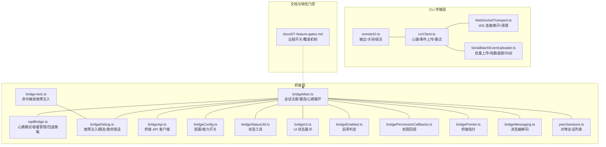
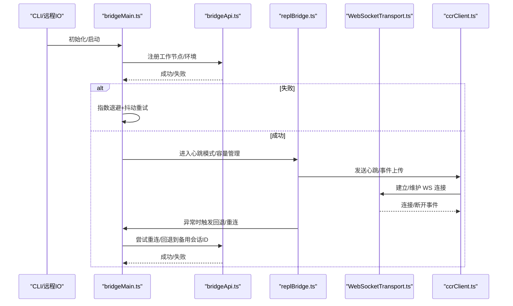
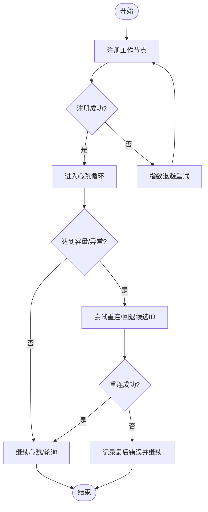
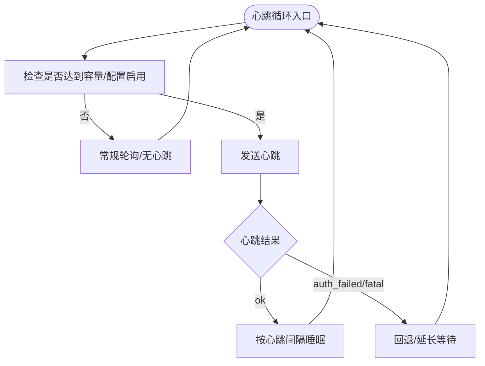
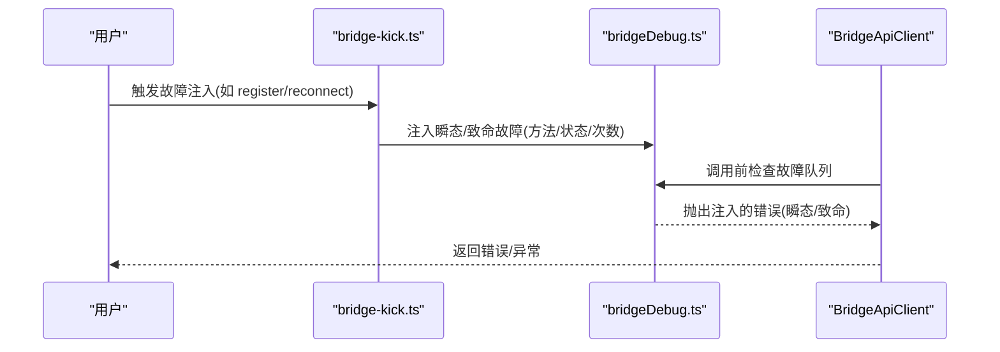
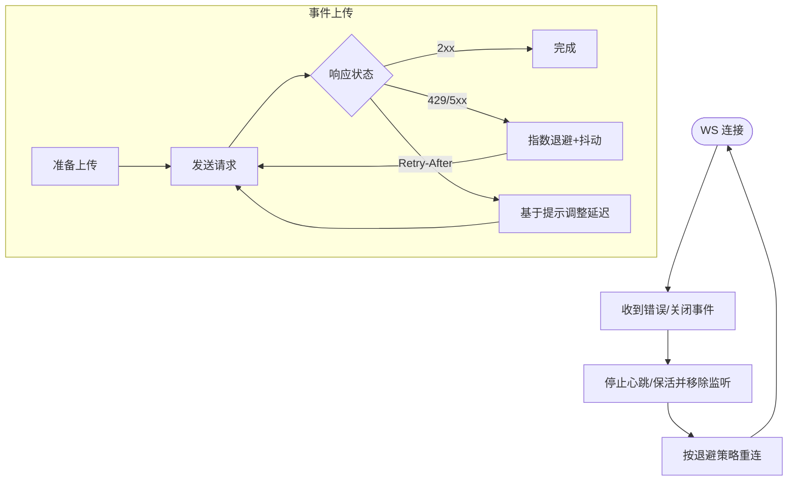
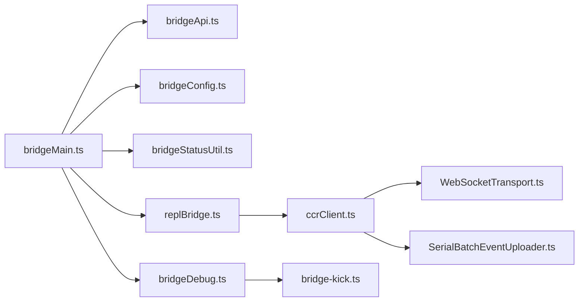

# 故障转移

<cite>
**本文引用的文件**
- [src/bridge/bridgeMain.ts](file://src/bridge/bridgeMain.ts)
- [src/bridge/replBridge.ts](file://src/bridge/replBridge.ts)
- [src/bridge/bridgeDebug.ts](file://src/bridge/bridgeDebug.ts)
- [src/commands/bridge-kick.ts](file://src/commands/bridge-kick.ts)
- [src/cli/transports/ccrClient.ts](file://src/cli/transports/ccrClient.ts)
- [src/cli/transports/WebSocketTransport.ts](file://src/cli/transports/WebSocketTransport.ts)
- [src/cli/transports/SerialBatchEventUploader.ts](file://src/cli/transports/SerialBatchEventUploader.ts)
- [src/bridge/bridgeApi.ts](file://src/bridge/bridgeApi.ts)
- [src/bridge/bridgeConfig.ts](file://src/bridge/bridgeConfig.ts)
- [src/bridge/bridgeStatusUtil.ts](file://src/bridge/bridgeStatusUtil.ts)
- [src/bridge/bridgeUI.ts](file://src/bridge/bridgeUI.ts)
- [src/bridge/bridgeEnabled.ts](file://src/bridge/bridgeEnabled.ts)
- [src/bridge/bridgePermissionCallbacks.ts](file://src/bridge/bridgePermissionCallbacks.ts)
- [src/bridge/bridgePointer.ts](file://src/bridge/bridgePointer.ts)
- [src/bridge/bridgeMessaging.ts](file://src/bridge/bridgeMessaging.ts)
- [src/bridge/peerSessions.ts](file://src/bridge/peerSessions.ts)
- [src/cli/remoteIO.ts](file://src/cli/remoteIO.ts)
- [docs/07-feature-gates.md](file://docs/07-feature-gates.md)
</cite>

## 目录
1. [引言](#引言)
2. [项目结构](#项目结构)
3. [核心组件](#核心组件)
4. [架构总览](#架构总览)
5. [详细组件分析](#详细组件分析)
6. [依赖关系分析](#依赖关系分析)
7. [性能考量](#性能考量)
8. [故障排查指南](#故障排查指南)
9. [结论](#结论)
10. [附录](#附录)

## 引言
本文件系统化阐述本仓库中的故障转移机制，涵盖主备节点切换逻辑（故障检测、自动切换、手动切换）、负载均衡策略（请求分发、节点健康检查、流量路由）、故障隔离（服务降级、熔断保护、优雅停机）、连接重连与会话保持、监控指标与告警、以及测试与演练方法。文档以实际源码为依据，辅以图示帮助理解。

## 项目结构
围绕故障转移的关键模块主要分布在“桥接层”（bridge）与“CLI 传输层”（cli/transports），并通过命令行工具与远程 IO 层进行集成。下图给出与故障转移相关的核心文件与职责概览：

图表来源
- [src/bridge/bridgeMain.ts](file://src/bridge/bridgeMain.ts)
- [src/bridge/replBridge.ts](file://src/bridge/replBridge.ts)
- [src/bridge/bridgeDebug.ts](file://src/bridge/bridgeDebug.ts)
- [src/commands/bridge-kick.ts](file://src/commands/bridge-kick.ts)
- [src/cli/transports/ccrClient.ts](file://src/cli/transports/ccrClient.ts)
- [src/cli/transports/WebSocketTransport.ts](file://src/cli/transports/WebSocketTransport.ts)
- [src/cli/transports/SerialBatchEventUploader.ts](file://src/cli/transports/SerialBatchEventUploader.ts)
- [src/bridge/bridgeApi.ts](file://src/bridge/bridgeApi.ts)
- [src/bridge/bridgeConfig.ts](file://src/bridge/bridgeConfig.ts)
- [src/bridge/bridgeStatusUtil.ts](file://src/bridge/bridgeStatusUtil.ts)
- [src/bridge/bridgeUI.ts](file://src/bridge/bridgeUI.ts)
- [src/bridge/bridgeEnabled.ts](file://src/bridge/bridgeEnabled.ts)
- [src/bridge/bridgePermissionCallbacks.ts](file://src/bridge/bridgePermissionCallbacks.ts)
- [src/bridge/bridgePointer.ts](file://src/bridge/bridgePointer.ts)
- [src/bridge/bridgeMessaging.ts](file://src/bridge/bridgeMessaging.ts)
- [src/bridge/peerSessions.ts](file://src/bridge/peerSessions.ts)
- [src/cli/remoteIO.ts](file://src/cli/remoteIO.ts)
- [docs/07-feature-gates.md](file://docs/07-feature-gates.md)

章节来源
- [src/bridge/bridgeMain.ts](file://src/bridge/bridgeMain.ts)
- [src/bridge/replBridge.ts](file://src/bridge/replBridge.ts)
- [src/bridge/bridgeDebug.ts](file://src/bridge/bridgeDebug.ts)
- [src/commands/bridge-kick.ts](file://src/commands/bridge-kick.ts)
- [src/cli/transports/ccrClient.ts](file://src/cli/transports/ccrClient.ts)
- [src/cli/transports/WebSocketTransport.ts](file://src/cli/transports/WebSocketTransport.ts)
- [src/cli/transports/SerialBatchEventUploader.ts](file://src/cli/transports/SerialBatchEventUploader.ts)
- [src/bridge/bridgeApi.ts](file://src/bridge/bridgeApi.ts)
- [src/bridge/bridgeConfig.ts](file://src/bridge/bridgeConfig.ts)
- [src/bridge/bridgeStatusUtil.ts](file://src/bridge/bridgeStatusUtil.ts)
- [src/bridge/bridgeUI.ts](file://src/bridge/bridgeUI.ts)
- [src/bridge/bridgeEnabled.ts](file://src/bridge/bridgeEnabled.ts)
- [src/bridge/bridgePermissionCallbacks.ts](file://src/bridge/bridgePermissionCallbacks.ts)
- [src/bridge/bridgePointer.ts](file://src/bridge/bridgePointer.ts)
- [src/bridge/bridgeMessaging.ts](file://src/bridge/bridgeMessaging.ts)
- [src/bridge/peerSessions.ts](file://src/bridge/peerSessions.ts)
- [src/cli/remoteIO.ts](file://src/cli/remoteIO.ts)
- [docs/07-feature-gates.md](file://docs/07-feature-gates.md)

## 核心组件
- 会话注册与重连：负责在环境就绪后注册工作节点，并在失败时尝试回退到备用会话标识；支持多候选 ID 尝试以兼容不同会话标签格式。
- 心跳与容量管理：在达到容量上限或特定配置下，通过周期性心跳维持租约、探测服务器状态，并在异常时进入回退策略，避免紧循环。
- 故障注入与调试：提供瞬态/致命两类故障注入，用于模拟网络错误、鉴权失败、会话不存在等场景，支撑故障演练。
- 传输层健壮性：WebSocket 连接断开时清理监听器，防止句柄泄漏；事件上传采用指数退避+抖动，避免雪崩效应。
- 特性门控与覆盖：通过远程开关控制功能开关，支持内部用户覆盖，便于灰度与快速回滚。

章节来源
- [src/bridge/bridgeMain.ts](file://src/bridge/bridgeMain.ts)
- [src/bridge/replBridge.ts](file://src/bridge/replBridge.ts)
- [src/bridge/bridgeDebug.ts](file://src/bridge/bridgeDebug.ts)
- [src/cli/transports/WebSocketTransport.ts](file://src/cli/transports/WebSocketTransport.ts)
- [src/cli/transports/SerialBatchEventUploader.ts](file://src/cli/transports/SerialBatchEventUploader.ts)
- [docs/07-feature-gates.md](file://docs/07-feature-gates.md)

## 架构总览
下图展示从桥接初始化到心跳循环、再到重连与回退的整体流程，体现故障检测、自动切换与手动触发的协同：

图表来源
- [src/bridge/bridgeMain.ts](file://src/bridge/bridgeMain.ts)
- [src/bridge/replBridge.ts](file://src/bridge/replBridge.ts)
- [src/bridge/bridgeApi.ts](file://src/bridge/bridgeApi.ts)
- [src/cli/transports/WebSocketTransport.ts](file://src/cli/transports/WebSocketTransport.ts)
- [src/cli/transports/ccrClient.ts](file://src/cli/transports/ccrClient.ts)

## 详细组件分析

### 组件A：桥接主流程与重连回退
- 主要职责
  - 在环境注册成功后建立会话，若注册失败则按指数退避重试，直至阈值放弃。
  - 支持多候选会话 ID 的重连尝试，兼容不同会话标签格式，提升回退成功率。
  - 在心跳循环中根据服务器状态与容量情况决定是否回退或延长等待。
- 关键行为
  - 注册失败时记录日志并延迟重试，必要时调用停止工作项的带退避操作。
  - 重连阶段尝试多种候选 ID，失败则记录最后错误并继续。
- 适用场景
  - 服务器短暂不可用、会话过期或标签不一致导致的重连失败。

图表来源
- [src/bridge/bridgeMain.ts](file://src/bridge/bridgeMain.ts)

章节来源
- [src/bridge/bridgeMain.ts](file://src/bridge/bridgeMain.ts)

### 组件B：心跳模式与容量管理
- 主要职责
  - 在达到容量上限或启用特定配置时，周期性发送心跳以维持租约。
  - 当心跳返回鉴权失败或致命错误时，进入回退策略，避免紧循环。
  - 在心跳期间捕获容量信号，确保在请求结束或异常时正确退出。
- 关键行为
  - 心跳间隔可配置，支持非独占心跳；当心跳禁用时改为慢速轮询。
  - 遇到致命错误时清空工作状态并快速轮询等待重新派发。
- 适用场景
  - 服务器维护窗口、鉴权失效、单个工作项被回收等。

图表来源
- [src/bridge/replBridge.ts](file://src/bridge/replBridge.ts)

章节来源
- [src/bridge/replBridge.ts](file://src/bridge/replBridge.ts)

### 组件C：故障注入与手动切换
- 主要职责
  - 提供瞬态/致命两类故障注入，模拟网络错误、鉴权失败、会话不存在等。
  - 通过命令行触发注入，支持一次性或多次注入，便于演练不同失败场景。
- 关键行为
  - 包装 API 客户端，在匹配的方法调用前检查故障队列，命中则抛出对应错误。
  - 注入计数递减至零时移除故障条目，避免长期影响。
- 适用场景
  - 测试自动重试、回退策略、UI 状态提示与日志记录。

图表来源
- [src/commands/bridge-kick.ts](file://src/commands/bridge-kick.ts)
- [src/bridge/bridgeDebug.ts](file://src/bridge/bridgeDebug.ts)

章节来源
- [src/commands/bridge-kick.ts](file://src/commands/bridge-kick.ts)
- [src/bridge/bridgeDebug.ts](file://src/bridge/bridgeDebug.ts)

### 组件D：传输层健壮性与连接重连
- 主要职责
  - WebSocket 连接断开时清理监听器，避免句柄泄漏；在断开时停止心跳与保活。
  - 事件上传采用指数退避+抖动，结合服务器返回的 Retry-After 提示，防止雪崩。
- 关键行为
  - 断开时移除所有事件监听，确保旧对象被及时释放。
  - 上传器根据失败次数与服务器提示计算延迟，最大延迟受上限约束。
- 适用场景
  - 网络波动、服务器限流、客户端主动关闭等。

图表来源
- [src/cli/transports/WebSocketTransport.ts](file://src/cli/transports/WebSocketTransport.ts)
- [src/cli/transports/SerialBatchEventUploader.ts](file://src/cli/transports/SerialBatchEventUploader.ts)

章节来源
- [src/cli/transports/WebSocketTransport.ts](file://src/cli/transports/WebSocketTransport.ts)
- [src/cli/transports/SerialBatchEventUploader.ts](file://src/cli/transports/SerialBatchEventUploader.ts)

### 组件E：特性门控与覆盖
- 主要职责
  - 通过远程开关控制功能开关，支持内部用户通过环境变量或界面覆盖。
  - 文档中列举了多个以特定前缀命名的开关及其作用域。
- 适用场景
  - 灰度发布、紧急回滚、A/B 实验等。

章节来源
- [docs/07-feature-gates.md](file://docs/07-feature-gates.md)

## 依赖关系分析
- 组件耦合
  - bridgeMain 依赖 bridgeApi、bridgeConfig、bridgeStatusUtil 等，形成桥接主控制面。
  - replBridge 与 ccrClient、WebSocketTransport 协作，承担心跳与传输细节。
  - bridgeDebug 与 bridge-kick 共同实现故障注入链路。
- 外部依赖
  - WebSocketTransport 与底层运行时（Bun/Node）差异通过条件分支适配。
  - SerialBatchEventUploader 依赖服务器返回的重试提示，实现智能退避。

图表来源
- [src/bridge/bridgeMain.ts](file://src/bridge/bridgeMain.ts)
- [src/bridge/replBridge.ts](file://src/bridge/replBridge.ts)
- [src/bridge/bridgeApi.ts](file://src/bridge/bridgeApi.ts)
- [src/bridge/bridgeConfig.ts](file://src/bridge/bridgeConfig.ts)
- [src/bridge/bridgeStatusUtil.ts](file://src/bridge/bridgeStatusUtil.ts)
- [src/cli/transports/ccrClient.ts](file://src/cli/transports/ccrClient.ts)
- [src/cli/transports/WebSocketTransport.ts](file://src/cli/transports/WebSocketTransport.ts)
- [src/cli/transports/SerialBatchEventUploader.ts](file://src/cli/transports/SerialBatchEventUploader.ts)
- [src/bridge/bridgeDebug.ts](file://src/bridge/bridgeDebug.ts)
- [src/commands/bridge-kick.ts](file://src/commands/bridge-kick.ts)

章节来源
- [src/bridge/bridgeMain.ts](file://src/bridge/bridgeMain.ts)
- [src/bridge/replBridge.ts](file://src/bridge/replBridge.ts)
- [src/bridge/bridgeApi.ts](file://src/bridge/bridgeApi.ts)
- [src/bridge/bridgeConfig.ts](file://src/bridge/bridgeConfig.ts)
- [src/bridge/bridgeStatusUtil.ts](file://src/bridge/bridgeStatusUtil.ts)
- [src/cli/transports/ccrClient.ts](file://src/cli/transports/ccrClient.ts)
- [src/cli/transports/WebSocketTransport.ts](file://src/cli/transports/WebSocketTransport.ts)
- [src/cli/transports/SerialBatchEventUploader.ts](file://src/cli/transports/SerialBatchEventUploader.ts)
- [src/bridge/bridgeDebug.ts](file://src/bridge/bridgeDebug.ts)
- [src/commands/bridge-kick.ts](file://src/commands/bridge-kick.ts)

## 性能考量
- 退避策略
  - 指数退避配合抖动，降低同时重试引发的峰值压力。
  - 对服务器返回的 Retry-After 进行抖动与上限控制，避免“惊群效应”。
- 心跳与轮询
  - 非独占心跳与慢速轮询在容量受限或心跳禁用时作为降载手段。
  - 在异常路径中使用容量信号与睡眠，避免紧循环。
- 连接生命周期
  - 断开时清理监听器，减少内存与句柄泄漏风险。
- 并发与背压
  - 批量上传器在释放背压时批量唤醒等待的解析器，提高吞吐。

章节来源
- [src/cli/transports/SerialBatchEventUploader.ts](file://src/cli/transports/SerialBatchEventUploader.ts)
- [src/bridge/replBridge.ts](file://src/bridge/replBridge.ts)
- [src/cli/transports/WebSocketTransport.ts](file://src/cli/transports/WebSocketTransport.ts)

## 故障排查指南
- 常见症状与定位
  - 注册失败：查看桥接主流程的日志与退避记录，确认是否达到放弃阈值。
  - 心跳异常：检查心跳间隔配置、容量状态与服务器返回码。
  - 重连失败：确认候选会话 ID 列表与标签转换逻辑。
  - 传输层问题：关注 WS 断开事件与监听器清理是否执行。
- 排查步骤
  - 启用调试日志，观察注入点与错误类型（瞬态/致命）。
  - 使用命令触发注入，验证自动重试与回退路径。
  - 检查特性门控状态与覆盖设置，确认功能开关是否符合预期。
- 相关实现参考
  - 注入包装、错误类型与上下文日志。
  - 重连候选 ID 选择与失败记录。
  - WS 断开清理与心跳停止。

章节来源
- [src/bridge/bridgeDebug.ts](file://src/bridge/bridgeDebug.ts)
- [src/commands/bridge-kick.ts](file://src/commands/bridge-kick.ts)
- [src/bridge/bridgeMain.ts](file://src/bridge/bridgeMain.ts)
- [src/cli/transports/WebSocketTransport.ts](file://src/cli/transports/WebSocketTransport.ts)

## 结论
本仓库通过“注册/重连 + 心跳/容量管理 + 故障注入 + 传输层健壮性 + 特性门控”的组合，构建了具备自愈能力的故障转移体系。其要点在于：
- 明确的故障检测（心跳/错误码/鉴权）与回退策略（候选 ID/指数退避）。
- 可观测与可演练（注入/日志/门控）。
- 传输层的稳定性（清理/退避/抖动）保障长时间运行的可靠性。

## 附录

### A. 故障检测、自动切换与手动切换流程
- 故障检测
  - 心跳返回鉴权失败或致命错误时，立即进入回退策略。
  - 注册失败与重连失败均触发指数退避与候选 ID 回退。
- 自动切换
  - 在达到容量上限且心跳异常时，快速轮询等待服务器重新派发工作项。
  - 重连阶段尝试多种候选 ID，提升恢复概率。
- 手动切换
  - 通过命令触发注入，模拟不同错误类型与次数，验证自动切换链路。

章节来源
- [src/bridge/replBridge.ts](file://src/bridge/replBridge.ts)
- [src/bridge/bridgeMain.ts](file://src/bridge/bridgeMain.ts)
- [src/commands/bridge-kick.ts](file://src/commands/bridge-kick.ts)
- [src/bridge/bridgeDebug.ts](file://src/bridge/bridgeDebug.ts)

### B. 负载均衡策略
- 请求分发
  - 通过候选 ID 与会话标签兼容性，实现跨标签的重连与再派发。
- 节点健康检查
  - 心跳作为健康信号；鉴权失败与致命错误视为异常。
- 流量路由
  - 在容量受限或心跳禁用时，采用慢速轮询作为路由降载手段。

章节来源
- [src/bridge/bridgeMain.ts](file://src/bridge/bridgeMain.ts)
- [src/bridge/replBridge.ts](file://src/bridge/replBridge.ts)

### C. 故障隔离机制
- 服务降级
  - 在心跳异常时缩短轮询间隔或切换为慢速轮询，降低负载。
- 熔断保护
  - 指数退避与抖动限制重试频率，避免放大效应。
- 优雅停机
  - 清理 WS 监听器、停止心跳与保活，有序关闭输入流。

章节来源
- [src/cli/transports/WebSocketTransport.ts](file://src/cli/transports/WebSocketTransport.ts)
- [src/cli/transports/SerialBatchEventUploader.ts](file://src/cli/transports/SerialBatchEventUploader.ts)
- [src/bridge/replBridge.ts](file://src/bridge/replBridge.ts)

### D. 连接重连与会话保持
- 连接重连
  - 断开时清理监听器，按退避策略重连；心跳停止后再恢复。
- 会话保持
  - 重连阶段尝试多种候选 ID，兼容不同会话标签，确保工作项被重新派发。

章节来源
- [src/cli/transports/WebSocketTransport.ts](file://src/cli/transports/WebSocketTransport.ts)
- [src/bridge/bridgeMain.ts](file://src/bridge/bridgeMain.ts)

### E. 监控指标与告警机制
- 指标建议
  - 注册/重连成功率、失败类型分布、退避次数、心跳周期、异常退出原因。
- 告警建议
  - 连续失败超过阈值、心跳异常持续时间、重连候选耗尽、WS 断开频次。

章节来源
- [src/bridge/replBridge.ts](file://src/bridge/replBridge.ts)
- [src/bridge/bridgeMain.ts](file://src/bridge/bridgeMain.ts)

### F. 故障转移测试与演练方法
- 自动化测试
  - 使用命令触发注入，覆盖瞬态/致命错误、多次注入与不同会话标签。
- 端到端演练
  - 在本地或沙箱环境模拟网络抖动、服务器限流与会话过期，验证回退与重连。
- 可观测性
  - 开启调试日志，记录注入点、错误类型与回退路径，形成回归基线。

章节来源
- [src/commands/bridge-kick.ts](file://src/commands/bridge-kick.ts)
- [src/bridge/bridgeDebug.ts](file://src/bridge/bridgeDebug.ts)
- [src/bridge/bridgeMain.ts](file://src/bridge/bridgeMain.ts)
- [src/bridge/replBridge.ts](file://src/bridge/replBridge.ts)