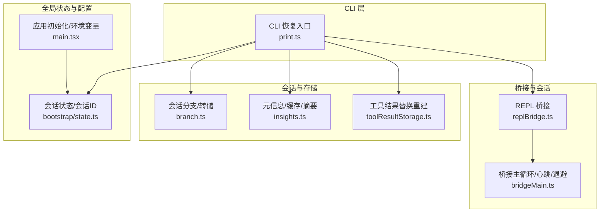
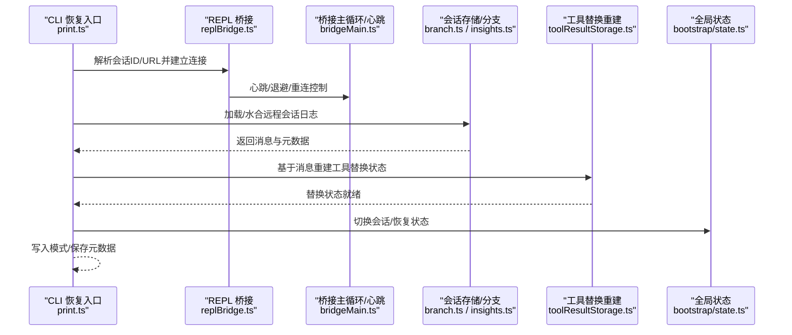
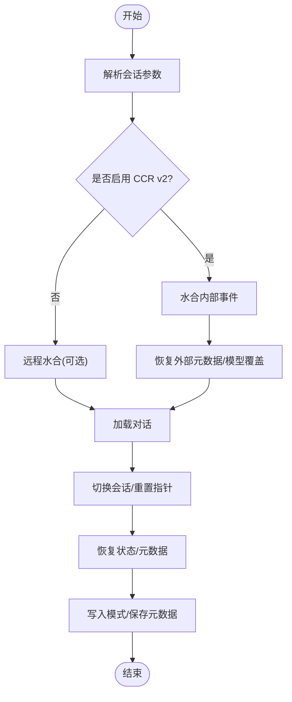
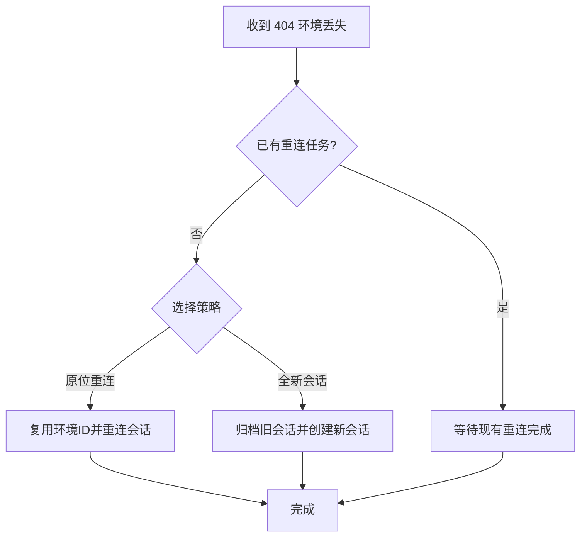
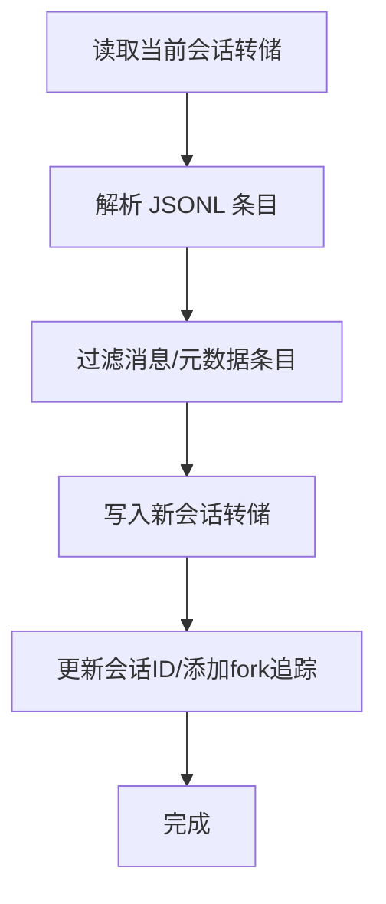
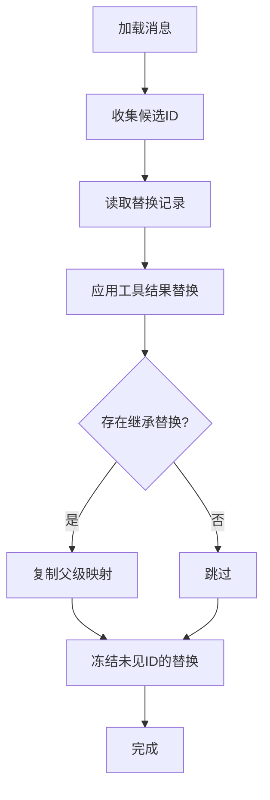
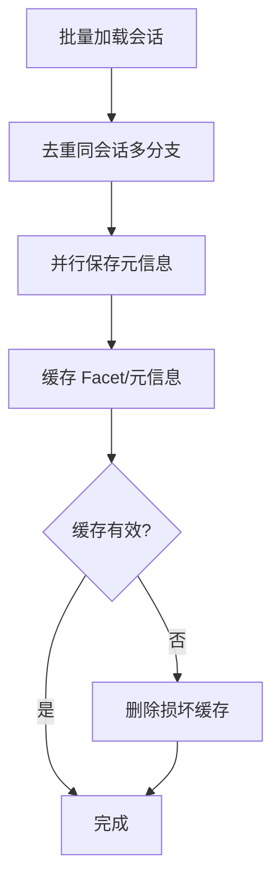
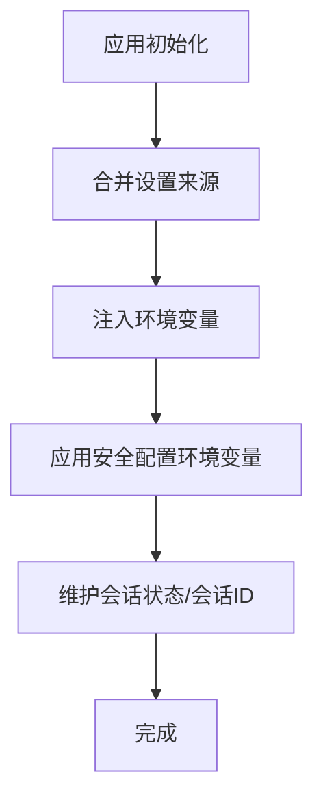
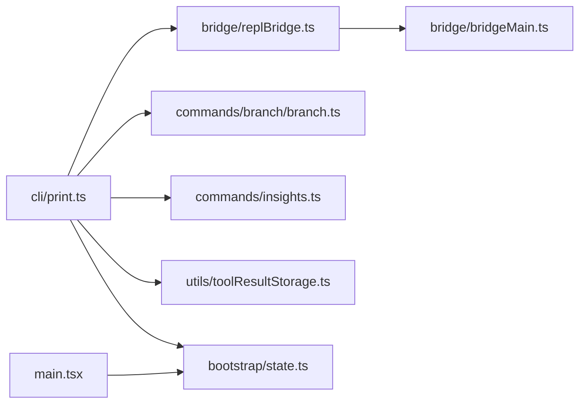

# 数据恢复

<cite>
**本文引用的文件**
- [src/bridge/replBridge.ts](file://src/bridge/replBridge.ts)
- [src/cli/print.ts](file://src/cli/print.ts)
- [src/commands/branch/branch.ts](file://src/commands/branch/branch.ts)
- [src/QueryEngine.ts](file://src/QueryEngine.ts)
- [src/main.tsx](file://src/main.tsx)
- [src/utils/toolResultStorage.ts](file://src/utils/toolResultStorage.ts)
- [src/bootstrap/state.ts](file://src/bootstrap/state.ts)
- [src/commands/insights.ts](file://src/commands/insights.ts)
- [src/bridge/bridgeMain.ts](file://src/bridge/bridgeMain.ts)
- [src/bridge/replBridge.ts](file://src/bridge/replBridge.ts)
</cite>

## 目录
1. [简介](#简介)
2. [项目结构](#项目结构)
3. [核心组件](#核心组件)
4. [架构总览](#架构总览)
5. [详细组件分析](#详细组件分析)
6. [依赖关系分析](#依赖关系分析)
7. [性能考量](#性能考量)
8. [故障排查指南](#故障排查指南)
9. [结论](#结论)
10. [附录：恢复测试方法与验证标准](#附录恢复测试方法与验证标准)

## 简介
本文件系统化梳理该代码库中“数据恢复”的实现与实践，覆盖以下方面：
- 恢复前的数据验证：备份文件完整性检查、版本兼容性校验
- 会话恢复流程：会话状态重建、消息历史恢复、上下文数据恢复
- 配置恢复机制：用户设置恢复、环境变量恢复
- 数据一致性与冲突解决策略
- 恢复过程中的错误处理与回滚机制
- 恢复测试方法与验证标准

## 项目结构
围绕数据恢复的关键模块分布如下：
- 会话与桥接层：负责远程会话的连接、重连、状态恢复与消息回放
- CLI 恢复入口：解析会话参数、拉起远程会话水合（hydrate）、加载对话并重建本地状态
- 分支与转储：会话分支、内容替换记录、元信息缓存与持久化
- 工具结果存储：工具调用结果的替换状态重建，确保预算与缓存一致性
- 全局状态与配置：会话 ID、父会话 ID、环境变量注入、设置来源与优先级

图表来源
- [src/cli/print.ts:4912-5188](file://src/cli/print.ts#L4912-L5188)
- [src/bridge/replBridge.ts:576-615](file://src/bridge/replBridge.ts#L576-L615)
- [src/bridge/bridgeMain.ts:1314-1339](file://src/bridge/bridgeMain.ts#L1314-L1339)
- [src/commands/branch/branch.ts:1-90](file://src/commands/branch/branch.ts#L1-L90)
- [src/commands/insights.ts:803-1010](file://src/commands/insights.ts#L803-L1010)
- [src/utils/toolResultStorage.ts:938-970](file://src/utils/toolResultStorage.ts#L938-L970)
- [src/bootstrap/state.ts:410-454](file://src/bootstrap/state.ts#L410-L454)
- [src/main.tsx:1419-1971](file://src/main.tsx#L1419-L1971)

章节来源
- [src/cli/print.ts:4912-5188](file://src/cli/print.ts#L4912-L5188)
- [src/bridge/replBridge.ts:576-615](file://src/bridge/replBridge.ts#L576-L615)
- [src/bridge/bridgeMain.ts:1314-1339](file://src/bridge/bridgeMain.ts#L1314-L1339)
- [src/commands/branch/branch.ts:1-90](file://src/commands/branch/branch.ts#L1-L90)
- [src/commands/insights.ts:803-1010](file://src/commands/insights.ts#L803-L1010)
- [src/utils/toolResultStorage.ts:938-970](file://src/utils/toolResultStorage.ts#L938-L970)
- [src/bootstrap/state.ts:410-454](file://src/bootstrap/state.ts#L410-L454)
- [src/main.tsx:1419-1971](file://src/main.tsx#L1419-L1971)

## 核心组件
- CLI 恢复入口：负责解析会话标识、触发远程水合、加载对话、切换会话、恢复状态与元数据，并在失败时输出错误并优雅退出
- REPL 桥接与重连：在环境丢失或异常关闭时进行“原位重连”或“全新会话回退”，并使用去重入保护的 Promise 控制并发重连
- 会话分支与转储：从当前会话复制转储，保留原始元数据并更新会话 ID，同时处理内容替换记录
- 工具结果替换重建：基于消息与记录重建内容替换状态，保证预算与提示缓存一致性
- 元信息与缓存：对会话元信息进行去重、缓存、持久化与失效处理
- 全局状态与配置：维护当前会话 ID、父会话 ID、环境变量注入与设置来源优先级

章节来源
- [src/cli/print.ts:4912-5188](file://src/cli/print.ts#L4912-L5188)
- [src/bridge/replBridge.ts:576-615](file://src/bridge/replBridge.ts#L576-L615)
- [src/commands/branch/branch.ts:56-90](file://src/commands/branch/branch.ts#L56-L90)
- [src/utils/toolResultStorage.ts:938-970](file://src/utils/toolResultStorage.ts#L938-L970)
- [src/commands/insights.ts:803-1010](file://src/commands/insights.ts#L803-L1010)
- [src/bootstrap/state.ts:410-454](file://src/bootstrap/state.ts#L410-L454)
- [src/main.tsx:1419-1971](file://src/main.tsx#L1419-L1971)

## 架构总览
下图展示从 CLI 触发到会话恢复的端到端流程，包括远程水合、状态重建、消息回放与元数据恢复。

图表来源
- [src/cli/print.ts:4912-5188](file://src/cli/print.ts#L4912-L5188)
- [src/bridge/replBridge.ts:576-615](file://src/bridge/replBridge.ts#L576-L615)
- [src/bridge/bridgeMain.ts:1314-1339](file://src/bridge/bridgeMain.ts#L1314-L1339)
- [src/commands/branch/branch.ts:56-90](file://src/commands/branch/branch.ts#L56-L90)
- [src/commands/insights.ts:803-1010](file://src/commands/insights.ts#L803-L1010)
- [src/utils/toolResultStorage.ts:938-970](file://src/utils/toolResultStorage.ts#L938-L970)
- [src/bootstrap/state.ts:410-454](file://src/bootstrap/state.ts#L410-L454)

## 详细组件分析

### 组件A：CLI 恢复入口（print.ts）
职责与流程要点：
- 解析会话参数（ID 或 URL），必要时通过 ingress 水合远程会话日志
- 在启用 CCR v2 的情况下，先水合内部事件再恢复外部元数据，确保回放顺序正确
- 加载对话后切换会话、重置指针（如需要）、恢复会话状态与元数据
- 失败时记录错误并以非零码优雅退出

图表来源
- [src/cli/print.ts:4912-5188](file://src/cli/print.ts#L4912-L5188)

章节来源
- [src/cli/print.ts:4912-5188](file://src/cli/print.ts#L4912-L5188)

### 组件B：REPL 桥接与重连（replBridge.ts）
职责与流程要点：
- 环境丢失（404）时采用两阶段重连策略：
  1) 原位重连：复用环境 ID，若成功则重新排队现有会话，保持 URL 不变且不重复发送已刷新消息
  2) 全新会话回退：若返回不同环境 ID 或重连失败，则归档旧会话并创建新会话
- 使用 Promise 去重入保护，避免并发重连导致竞态

图表来源
- [src/bridge/replBridge.ts:576-615](file://src/bridge/replBridge.ts#L576-L615)

章节来源
- [src/bridge/replBridge.ts:576-615](file://src/bridge/replBridge.ts#L576-L615)

### 组件C：会话分支与转储（branch.ts）
职责与流程要点：
- 从当前会话转储复制为新会话，保留原始元数据（时间戳、Git 分支等），仅更新会话 ID 并添加 forkedFrom 追踪
- 解析 JSONL 转储，提取消息与内容替换记录，写入新会话路径

图表来源
- [src/commands/branch/branch.ts:56-90](file://src/commands/branch/branch.ts#L56-L90)

章节来源
- [src/commands/branch/branch.ts:1-90](file://src/commands/branch/branch.ts#L1-L90)

### 组件D：工具结果替换重建（toolResultStorage.ts）
职责与流程要点：
- 基于消息与内容替换记录重建替换状态，确保预算与提示缓存一致性
- 支持继承替换（分叉子代理恢复场景），冻结未被替换的结果以防未来替换

图表来源
- [src/utils/toolResultStorage.ts:938-970](file://src/utils/toolResultStorage.ts#L938-L970)

章节来源
- [src/utils/toolResultStorage.ts:938-970](file://src/utils/toolResultStorage.ts#L938-L970)

### 组件E：元信息与缓存（insights.ts）
职责与流程要点：
- 对会话元信息进行去重（按用户消息数与时长择优），批量加载并缓存
- 提供会话元信息与 Facet 的读写接口，支持缓存损坏时删除并重新生成

图表来源
- [src/commands/insights.ts:803-1010](file://src/commands/insights.ts#L803-L1010)

章节来源
- [src/commands/insights.ts:803-1010](file://src/commands/insights.ts#L803-L1010)

### 组件F：全局状态与配置（bootstrap/state.ts、main.tsx）
职责与流程要点：
- 维护当前会话 ID、父会话 ID，支持重新生成会话 ID 并清理计划 slug 缓存
- 应用初始化阶段合并设置来源（含项目设置、本地设置），注入环境变量，严格 MCP 配置校验与企业配置限制

图表来源
- [src/bootstrap/state.ts:410-454](file://src/bootstrap/state.ts#L410-L454)
- [src/main.tsx:1419-1971](file://src/main.tsx#L1419-L1971)

章节来源
- [src/bootstrap/state.ts:410-454](file://src/bootstrap/state.ts#L410-L454)
- [src/main.tsx:1419-1971](file://src/main.tsx#L1419-L1971)

## 依赖关系分析
- CLI 恢复入口依赖桥接层进行远程水合与连接管理，依赖会话存储与工具替换重建完成本地状态恢复
- 桥接层依赖主循环的心跳与退避策略，以应对网络波动与服务端回收
- 会话分支与元信息缓存相互配合，保障恢复时的历史完整性与性能
- 全局状态与配置贯穿恢复全流程，确保会话 ID 与环境变量的一致性

图表来源
- [src/cli/print.ts:4912-5188](file://src/cli/print.ts#L4912-L5188)
- [src/bridge/replBridge.ts:576-615](file://src/bridge/replBridge.ts#L576-L615)
- [src/bridge/bridgeMain.ts:1314-1339](file://src/bridge/bridgeMain.ts#L1314-L1339)
- [src/commands/branch/branch.ts:56-90](file://src/commands/branch/branch.ts#L56-L90)
- [src/commands/insights.ts:803-1010](file://src/commands/insights.ts#L803-L1010)
- [src/utils/toolResultStorage.ts:938-970](file://src/utils/toolResultStorage.ts#L938-L970)
- [src/bootstrap/state.ts:410-454](file://src/bootstrap/state.ts#L410-L454)
- [src/main.tsx:1419-1971](file://src/main.tsx#L1419-L1971)

章节来源
- [src/cli/print.ts:4912-5188](file://src/cli/print.ts#L4912-L5188)
- [src/bridge/replBridge.ts:576-615](file://src/bridge/replBridge.ts#L576-L615)
- [src/bridge/bridgeMain.ts:1314-1339](file://src/bridge/bridgeMain.ts#L1314-L1339)
- [src/commands/branch/branch.ts:56-90](file://src/commands/branch/branch.ts#L56-L90)
- [src/commands/insights.ts:803-1010](file://src/commands/insights.ts#L803-L1010)
- [src/utils/toolResultStorage.ts:938-970](file://src/utils/toolResultStorage.ts#L938-L970)
- [src/bootstrap/state.ts:410-454](file://src/bootstrap/state.ts#L410-L454)
- [src/main.tsx:1419-1971](file://src/main.tsx#L1419-L1971)

## 性能考量
- 批量加载与并行写入：元信息与 Facet 的缓存采用批量加载与并行保存，减少 I/O 开销
- 去重与缓存失效：对多分支会话进行去重，避免重复计算；缓存损坏自动删除并重算
- 水合顺序：在启用 CCR v2 时，先水合内部事件再恢复外部元数据，确保回放顺序正确，避免额外往返
- 重连退避：桥接主循环在连接错误时采用指数退避与抖动，降低对服务端压力并提升稳定性

## 故障排查指南
- 远程水合失败
  - 现象：无法从 ingress 获取会话日志或 SSE catchup 未生效
  - 排查：确认 ENABLE_SESSION_PERSISTENCE 与 ingress URL 设置；检查 CCR v2 水合顺序
  - 参考
    - [src/cli/print.ts:5048-5072](file://src/cli/print.ts#L5048-L5072)
- 环境丢失（404）
  - 现象：会话因 TTL 过期或服务端回收导致环境丢失
  - 排查：观察原位重连与全新会话回退逻辑；检查重连并发保护
  - 参考
    - [src/bridge/replBridge.ts:576-615](file://src/bridge/replBridge.ts#L576-L615)
- 元信息缓存损坏
  - 现象：Facet/元信息缓存 JSON 结构无效
  - 排查：删除损坏缓存文件后自动重算；检查权限与磁盘空间
  - 参考
    - [src/commands/insights.ts:941-961](file://src/commands/insights.ts#L941-L961)
- 设置来源与环境变量注入失败
  - 现象：MCP 企业配置与动态配置冲突，或环境变量未生效
  - 排查：检查企业 MCP 配置存在性与严格模式；核对设置来源优先级
  - 参考
    - [src/main.tsx:1419-1971](file://src/main.tsx#L1419-L1971)

章节来源
- [src/cli/print.ts:5048-5072](file://src/cli/print.ts#L5048-L5072)
- [src/bridge/replBridge.ts:576-615](file://src/bridge/replBridge.ts#L576-L615)
- [src/commands/insights.ts:941-961](file://src/commands/insights.ts#L941-L961)
- [src/main.tsx:1419-1971](file://src/main.tsx#L1419-L1971)

## 结论
该代码库在数据恢复方面形成了从 CLI 触发、桥接水合、状态重建到元数据与配置恢复的完整闭环。通过两阶段重连、内容替换重建、元信息缓存与去重、严格的设置来源与环境变量注入策略，实现了高可靠与高性能的会话恢复能力。建议在生产环境中结合附录中的测试方法与验证标准，持续保障恢复质量。

## 附录：恢复测试方法与验证标准
- 恢复前数据验证
  - 备份文件完整性检查：读取转储文件，解析 JSONL 并校验消息与元数据条目结构
  - 版本兼容性验证：比对转储格式版本号与当前解析器版本，必要时执行迁移
- 会话恢复流程验证
  - 会话状态重建：切换会话后，当前会话 ID 与父会话 ID 正确更新
  - 消息历史恢复：消息顺序与时间戳一致，工具结果替换状态与预算一致
  - 上下文数据恢复：内容替换记录与继承替换映射正确应用
- 配置恢复验证
  - 用户设置恢复：设置来源优先级与合并结果符合预期
  - 环境变量恢复：注入的环境变量与设置来源一致，MCP 配置严格模式与企业配置约束满足
- 一致性与冲突解决
  - 多分支去重：同一会话多分支仅保留最优分支
  - 缓存失效：损坏缓存自动删除并重算
- 错误处理与回滚
  - 远程水合失败：降级至本地可用数据或提示用户
  - 环境丢失：自动尝试原位重连，失败则创建全新会话并归档旧会话
  - 设置冲突：严格模式下拒绝非法配置变更
- 恢复测试步骤示例
  - 准备阶段：准备带内容替换记录的转储文件与元信息缓存
  - 执行阶段：运行 CLI 恢复命令，观察水合与状态重建日志
  - 验证阶段：对比消息顺序、替换状态、会话 ID 与设置来源结果
  - 回滚验证：模拟环境丢失与设置冲突，验证回滚与降级路径