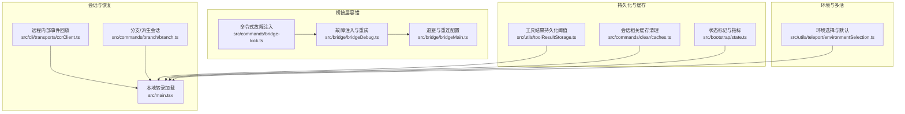
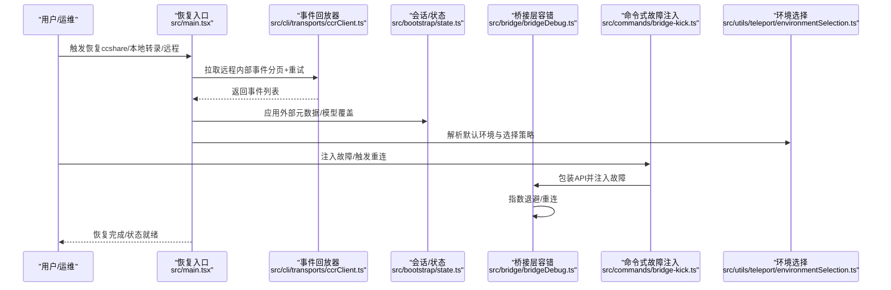
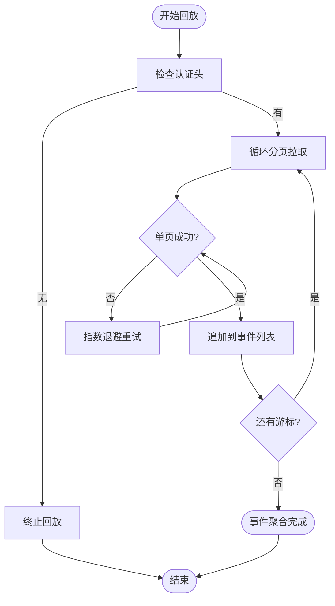
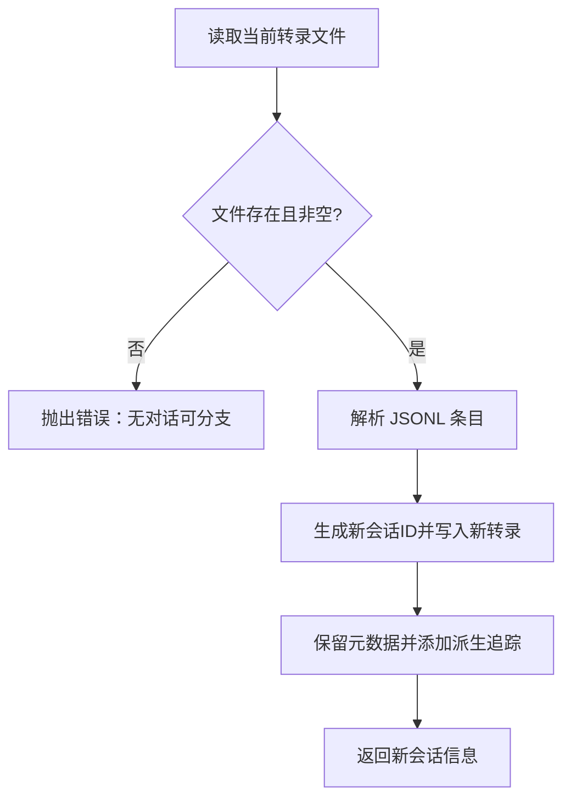
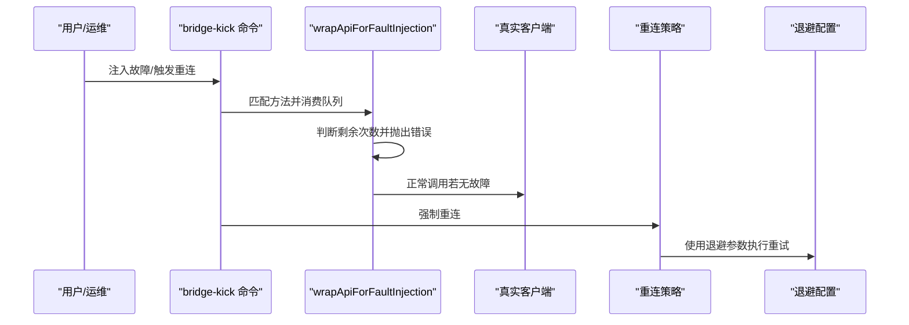
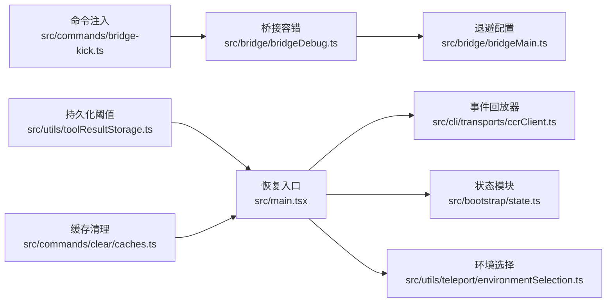

# 灾难恢复

<cite>
**本文引用的文件**
- [AGENTS.md](file://AGENTS.md)
- [src/bridge/bridgeDebug.ts](file://src/bridge/bridgeDebug.ts)
- [src/commands/bridge-kick.ts](file://src/commands/bridge-kick.ts)
- [src/bridge/bridgeMain.ts](file://src/bridge/bridgeMain.ts)
- [src/cli/transports/ccrClient.ts](file://src/cli/transports/ccrClient.ts)
- [src/utils/toolResultStorage.ts](file://src/utils/toolResultStorage.ts)
- [src/commands/clear/caches.ts](file://src/commands/clear/caches.ts)
- [src/bootstrap/state.ts](file://src/bootstrap/state.ts)
- [src/main.tsx](file://src/main.tsx)
- [src/commands/branch/branch.ts](file://src/commands/branch/branch.ts)
- [src/utils/teleport/environmentSelection.ts](file://src/utils/teleport/environmentSelection.ts)
</cite>

## 目录
1. [引言](#引言)
2. [项目结构](#项目结构)
3. [核心组件](#核心组件)
4. [架构总览](#架构总览)
5. [详细组件分析](#详细组件分析)
6. [依赖关系分析](#依赖关系分析)
7. [性能考量](#性能考量)
8. [故障排查指南](#故障排查指南)
9. [结论](#结论)
10. [附录](#附录)

## 引言
本文件面向“灾难恢复”主题，结合仓库中与会话持久化、远程事件回放、桥接层容错、环境选择与恢复、以及缓存清理等能力，系统化梳理可复用的备份与恢复思路、故障转移与隔离策略、应急响应流程及恢复测试方法，并给出文档记录与持续改进建议。需要特别说明的是：当前仓库未提供内置的自动化备份/恢复脚本或数据库迁移工具，因此本方案以现有能力为“基线”，提出可落地的实践建议。

## 项目结构
围绕灾难恢复的关键能力主要分布在以下模块：
- 会话与事件恢复：通过远程内部事件流回放与本地转录文件加载实现会话恢复。
- 桥接层容错与重连：提供指数退避、故障注入与强制重连能力，支撑主备切换与故障隔离。
- 工具结果持久化阈值：控制工具输出的持久化边界，避免过大数据写入导致的恢复瓶颈。
- 缓存与状态：会话缓存清理、状态标记（如压缩后首次调用）有助于在恢复后快速收敛。
- 环境选择与多环境：支持默认环境选择与多环境配置，便于跨环境灾备切换。

图表来源
- [src/cli/transports/ccrClient.ts:860-899](file://src/cli/transports/ccrClient.ts#L860-L899)
- [src/main.tsx:4912-5078](file://src/main.tsx#L4912-L5078)
- [src/commands/branch/branch.ts:56-90](file://src/commands/branch/branch.ts#L56-L90)
- [src/bridge/bridgeDebug.ts:77-110](file://src/bridge/bridgeDebug.ts#L77-L110)
- [src/commands/bridge-kick.ts:116-200](file://src/commands/bridge-kick.ts#L116-L200)
- [src/bridge/bridgeMain.ts:59-98](file://src/bridge/bridgeMain.ts#L59-L98)
- [src/utils/toolResultStorage.ts:36-851](file://src/utils/toolResultStorage.ts#L36-L851)
- [src/commands/clear/caches.ts:28-69](file://src/commands/clear/caches.ts#L28-L69)
- [src/bootstrap/state.ts:236-257](file://src/bootstrap/state.ts#L236-L257)
- [src/utils/teleport/environmentSelection.ts:1-77](file://src/utils/teleport/environmentSelection.ts#L1-L77)

章节来源
- [src/cli/transports/ccrClient.ts:860-899](file://src/cli/transports/ccrClient.ts#L860-L899)
- [src/main.tsx:4912-5078](file://src/main.tsx#L4912-L5078)
- [src/commands/branch/branch.ts:56-90](file://src/commands/branch/branch.ts#L56-L90)
- [src/bridge/bridgeDebug.ts:77-110](file://src/bridge/bridgeDebug.ts#L77-L110)
- [src/commands/bridge-kick.ts:116-200](file://src/commands/bridge-kick.ts#L116-L200)
- [src/bridge/bridgeMain.ts:59-98](file://src/bridge/bridgeMain.ts#L59-L98)
- [src/utils/toolResultStorage.ts:36-851](file://src/utils/toolResultStorage.ts#L36-L851)
- [src/commands/clear/caches.ts:28-69](file://src/commands/clear/caches.ts#L28-L69)
- [src/bootstrap/state.ts:236-257](file://src/bootstrap/state.ts#L236-L257)
- [src/utils/teleport/environmentSelection.ts:1-77](file://src/utils/teleport/environmentSelection.ts#L1-L77)

## 核心组件
- 远程内部事件回放器：提供分页拉取与重试的机制，用于从远端事件流恢复会话状态。
- 会话恢复入口：支持从 ccshare 链接、本地转录文件或远程 ingress 加载会话，并在恢复后刷新协调者模式与代理定义。
- 分支/派生会话：基于当前转录文件复制出新的会话，保留元数据并更新会话标识，便于灾备演练与隔离。
- 桥接层容错：支持故障注入（瞬时/致命）、强制重连与指数退避配置，保障主备切换与故障隔离。
- 工具结果持久化阈值：按工具维度控制结果持久化的大小边界，避免过大输出影响恢复效率。
- 缓存清理：提供会话相关缓存清理接口，确保恢复后上下文新鲜度。
- 状态标记：记录最后一次 API 成功完成时间、是否处于压缩后首次调用等状态，辅助恢复后的性能与一致性判断。
- 环境选择：根据设置源解析默认环境，支持多环境配置，便于跨环境灾备切换。

章节来源
- [src/cli/transports/ccrClient.ts:860-899](file://src/cli/transports/ccrClient.ts#L860-L899)
- [src/main.tsx:4912-5078](file://src/main.tsx#L4912-L5078)
- [src/commands/branch/branch.ts:56-90](file://src/commands/branch/branch.ts#L56-L90)
- [src/bridge/bridgeDebug.ts:77-110](file://src/bridge/bridgeDebug.ts#L77-L110)
- [src/commands/bridge-kick.ts:116-200](file://src/commands/bridge-kick.ts#L116-L200)
- [src/bridge/bridgeMain.ts:59-98](file://src/bridge/bridgeMain.ts#L59-L98)
- [src/utils/toolResultStorage.ts:36-851](file://src/utils/toolResultStorage.ts#L36-L851)
- [src/commands/clear/caches.ts:28-69](file://src/commands/clear/caches.ts#L28-L69)
- [src/bootstrap/state.ts:236-257](file://src/bootstrap/state.ts#L236-L257)
- [src/utils/teleport/environmentSelection.ts:1-77](file://src/utils/teleport/environmentSelection.ts#L1-L77)

## 架构总览
下图展示了灾难恢复的关键交互路径：从事件回放到会话恢复、再到桥接层容错与环境选择，形成闭环的恢复体系。

图表来源
- [src/main.tsx:4912-5078](file://src/main.tsx#L4912-L5078)
- [src/cli/transports/ccrClient.ts:860-899](file://src/cli/transports/ccrClient.ts#L860-L899)
- [src/bootstrap/state.ts:236-257](file://src/bootstrap/state.ts#L236-L257)
- [src/bridge/bridgeDebug.ts:77-110](file://src/bridge/bridgeDebug.ts#L77-L110)
- [src/commands/bridge-kick.ts:116-200](file://src/commands/bridge-kick.ts#L116-L200)
- [src/utils/teleport/environmentSelection.ts:1-77](file://src/utils/teleport/environmentSelection.ts#L1-L77)

## 详细组件分析

### 组件A：远程内部事件回放与恢复路径
- 设计要点
  - 分页拉取与重试：对列表型事件进行分页获取，失败时采用指数退避+抖动重试，保证在弱网络或远端不稳定时仍能完成回放。
  - 事件聚合：将所有页面事件合并，作为后续状态应用的数据源。
  - 恢复入口：支持从 ccshare 链接、本地转录文件或远程 ingress 加载会话；恢复后刷新协调者模式与代理定义，确保运行态一致。
- 复杂度与性能
  - 时间复杂度近似 O(N)，N 为事件总数；空间复杂度 O(N) 存储事件。
  - 通过分页降低单次请求压力，重试策略提升稳定性。
- 错误处理
  - 认证头缺失直接返回空，避免无效请求；每页失败时重试，最终失败返回 null。
- 优化建议
  - 增加断点续拉（基于游标）与并发分页，缩短回放时间。
  - 对大事件进行预过滤，减少内存占用。

图表来源
- [src/cli/transports/ccrClient.ts:860-899](file://src/cli/transports/ccrClient.ts#L860-L899)

章节来源
- [src/cli/transports/ccrClient.ts:860-899](file://src/cli/transports/ccrClient.ts#L860-L899)
- [src/main.tsx:4912-5078](file://src/main.tsx#L4912-L5078)

### 组件B：会话分支与隔离
- 设计要点
  - 基于当前转录文件复制新会话，保留时间戳、Git 分支等元信息，仅替换会话标识并添加派生追踪字段。
  - 适用于灾备演练、对比实验或隔离风险操作。
- 复杂度与性能
  - 文件读取与解析 JSONL 的时间复杂度 O(M)，M 为消息条目数；写入新转录文件 O(M)。
- 错误处理
  - 当前无转录或为空时抛出错误，防止空恢复。
- 优化建议
  - 支持增量复制（仅复制变更段），减少 IO。
  - 提供只读派生视图，避免重复写盘。

图表来源
- [src/commands/branch/branch.ts:56-90](file://src/commands/branch/branch.ts#L56-L90)

章节来源
- [src/commands/branch/branch.ts:56-90](file://src/commands/branch/branch.ts#L56-L90)

### 组件C：桥接层容错与重连
- 设计要点
  - 故障注入：包装 API 调用，在队列中有匹配故障时抛出指定错误，支持瞬时与致命两类。
  - 强制重连：通过命令触发环境与会话的重新连接，配合退避策略实现主备切换。
  - 退避配置：提供连接与通用操作的初始延迟、上限与放弃阈值，以及优雅停机宽限与停止工作基延迟。
- 复杂度与性能
  - 注入逻辑为 O(1) 查找与修改；重连与退避为事件驱动，不阻塞主线程。
- 错误处理
  - 致命故障触发上层策略（如状态 teardown），瞬时故障模拟 5xx/网络异常。
- 优化建议
  - 将故障注入参数化为配置文件，便于批量演练。
  - 增加健康检查与自动切换阈值，实现更智能的主备切换。

图表来源
- [src/commands/bridge-kick.ts:116-200](file://src/commands/bridge-kick.ts#L116-L200)
- [src/bridge/bridgeDebug.ts:77-110](file://src/bridge/bridgeDebug.ts#L77-L110)
- [src/bridge/bridgeMain.ts:59-98](file://src/bridge/bridgeMain.ts#L59-L98)

章节来源
- [src/commands/bridge-kick.ts:116-200](file://src/commands/bridge-kick.ts#L116-L200)
- [src/bridge/bridgeDebug.ts:77-110](file://src/bridge/bridgeDebug.ts#L77-L110)
- [src/bridge/bridgeMain.ts:59-98](file://src/bridge/bridgeMain.ts#L59-L98)

### 组件D：工具结果持久化阈值
- 设计要点
  - 支持按工具名覆盖持久化阈值，否则使用全局默认上限。
  - 对“自读回”类工具（Infinity）禁用持久化，避免环路与冗余。
  - 在预算超支时进行候选选择与替换，保持一致性与可观测性。
- 复杂度与性能
  - 解析与决策为 O(T)（T 为工具候选数），整体开销可控。
- 错误处理
  - 对非对象标志值进行防御性检查，避免异常。
- 优化建议
  - 将阈值与工具类型映射持久化，便于审计与回滚。
  - 对大结果进行分片存储与校验和，提升恢复可靠性。

章节来源
- [src/utils/toolResultStorage.ts:36-851](file://src/utils/toolResultStorage.ts#L36-L851)

### 组件E：缓存清理与状态标记
- 设计要点
  - 提供会话相关缓存清理接口，确保恢复后上下文新鲜度。
  - 状态标记包括最后一次 API 完成时间、压缩后首次调用标记等，辅助恢复后的性能与一致性判断。
- 复杂度与性能
  - 清理为 O(1) 或 O(缓存项数)，状态标记为 O(1)。
- 错误处理
  - 通过可选清除与条件刷新，避免误清空关键状态。
- 优化建议
  - 在恢复前后分别打点，形成缓存命中率与延迟曲线，指导阈值调整。

章节来源
- [src/commands/clear/caches.ts:28-69](file://src/commands/clear/caches.ts#L28-L69)
- [src/bootstrap/state.ts:236-257](file://src/bootstrap/state.ts#L236-L257)

### 组件F：环境选择与多环境
- 设计要点
  - 根据设置源解析默认环境 ID，若未显式配置则选择第一个可用环境。
  - 支持多环境配置，便于跨环境灾备切换。
- 复杂度与性能
  - 解析与匹配为 O(E)（E 为环境数量），通常很小。
- 错误处理
  - 无可用环境时返回空选择，避免错误默认。
- 优化建议
  - 将默认环境与区域/可用区绑定，提高就近恢复概率。

章节来源
- [src/utils/teleport/environmentSelection.ts:1-77](file://src/utils/teleport/environmentSelection.ts#L1-L77)

## 依赖关系分析
- 组件耦合
  - 恢复入口依赖事件回放器与状态模块；事件回放器独立于业务逻辑，耦合度低。
  - 桥接层容错通过包装器与命令注入，与真实客户端解耦。
  - 工具结果持久化阈值与会话恢复解耦，但共同影响恢复体积与速度。
- 外部依赖
  - 远程事件回放依赖远端服务的分页与鉴权接口。
  - 环境选择依赖设置源与远端环境列表。
- 循环依赖
  - 未发现明显循环依赖；各模块职责清晰。

图表来源
- [src/main.tsx:4912-5078](file://src/main.tsx#L4912-L5078)
- [src/cli/transports/ccrClient.ts:860-899](file://src/cli/transports/ccrClient.ts#L860-L899)
- [src/bootstrap/state.ts:236-257](file://src/bootstrap/state.ts#L236-L257)
- [src/utils/teleport/environmentSelection.ts:1-77](file://src/utils/teleport/environmentSelection.ts#L1-L77)
- [src/bridge/bridgeDebug.ts:77-110](file://src/bridge/bridgeDebug.ts#L77-L110)
- [src/bridge/bridgeMain.ts:59-98](file://src/bridge/bridgeMain.ts#L59-L98)
- [src/commands/bridge-kick.ts:116-200](file://src/commands/bridge-kick.ts#L116-L200)
- [src/utils/toolResultStorage.ts:36-851](file://src/utils/toolResultStorage.ts#L36-L851)
- [src/commands/clear/caches.ts:28-69](file://src/commands/clear/caches.ts#L28-L69)

章节来源
- [src/main.tsx:4912-5078](file://src/main.tsx#L4912-L5078)
- [src/cli/transports/ccrClient.ts:860-899](file://src/cli/transports/ccrClient.ts#L860-L899)
- [src/bridge/bridgeDebug.ts:77-110](file://src/bridge/bridgeDebug.ts#L77-L110)
- [src/commands/bridge-kick.ts:116-200](file://src/commands/bridge-kick.ts#L116-L200)
- [src/bridge/bridgeMain.ts:59-98](file://src/bridge/bridgeMain.ts#L59-L98)
- [src/utils/toolResultStorage.ts:36-851](file://src/utils/toolResultStorage.ts#L36-L851)
- [src/commands/clear/caches.ts:28-69](file://src/commands/clear/caches.ts#L28-L69)
- [src/bootstrap/state.ts:236-257](file://src/bootstrap/state.ts#L236-L257)
- [src/utils/teleport/environmentSelection.ts:1-77](file://src/utils/teleport/environmentSelection.ts#L1-L77)

## 性能考量
- 事件回放
  - 分页与重试策略显著提升稳定性；建议引入并发分页与断点续拉，缩短恢复时间。
- 持久化阈值
  - 合理设置工具结果持久化阈值，避免过大输出拖慢恢复；对大结果进行分片与校验。
- 缓存与状态
  - 恢复后清理会话相关缓存，确保上下文新鲜；利用状态标记（如压缩后首次调用）优化后续行为。
- 桥接层退避
  - 依据场景调整初始延迟、上限与放弃阈值，平衡恢复速度与资源消耗。

## 故障排查指南
- 识别与定位
  - 使用命令式故障注入触发特定错误（如 403/503/401），观察桥接层行为与日志。
  - 通过恢复入口的日志与性能打点，定位回放耗时与事件缺失点。
- 影响评估
  - 结合事件回放器的分页与重试统计，评估远端服务可用性与网络质量。
  - 通过环境选择模块确认默认环境是否正确，避免跨区/跨域恢复偏差。
- 处理步骤
  - 若出现认证问题，优先检查认证头与远端鉴权状态。
  - 若出现瞬时故障，等待退避重试或手动触发强制重连。
  - 若出现致命故障，按桥接层策略进行状态 teardown 并重建会话。
  - 恢复完成后，清理相关缓存并核对状态标记，确保一致性。

章节来源
- [src/commands/bridge-kick.ts:116-200](file://src/commands/bridge-kick.ts#L116-L200)
- [src/bridge/bridgeDebug.ts:77-110](file://src/bridge/bridgeDebug.ts#L77-L110)
- [src/bridge/bridgeMain.ts:59-98](file://src/bridge/bridgeMain.ts#L59-L98)
- [src/cli/transports/ccrClient.ts:860-899](file://src/cli/transports/ccrClient.ts#L860-L899)
- [src/utils/teleport/environmentSelection.ts:1-77](file://src/utils/teleport/environmentSelection.ts#L1-L77)

## 结论
本仓库提供了完善的会话恢复、事件回放、桥接层容错与环境选择能力，可作为灾难恢复的“基线”。结合这些能力，可设计出覆盖全量/增量/差异策略（以事件回放与转录文件为基础）、验证与一致性检查、主备切换与隔离、应急响应与恢复测试的完整方案。建议在此基础上补充自动化备份脚本、断点续拉与并发回放、持久化阈值审计与分片校验、以及演练与改进机制，以进一步提升恢复效率与可靠性。

## 附录
- 文档记录与持续改进
  - 建议建立灾难恢复手册，记录备份策略、恢复流程、故障注入演练清单与改进项。
  - 对每次演练进行打点与归档，形成“恢复时间分布”与“成功率趋势”，持续优化阈值与策略。
- 参考与致谢
  - 本文件基于仓库现有能力进行归纳与扩展，未在文中直接引用具体代码片段。

章节来源
- [AGENTS.md:19-33](file://AGENTS.md#L19-L33)