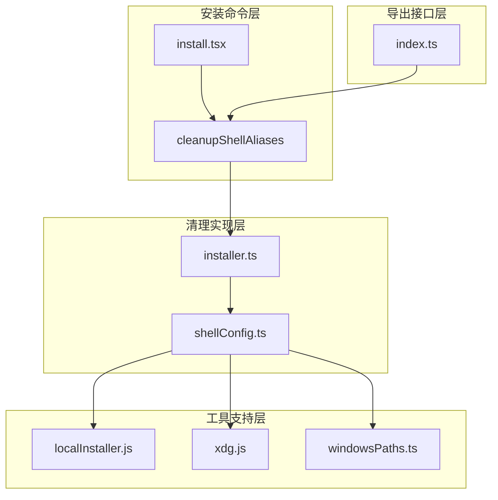
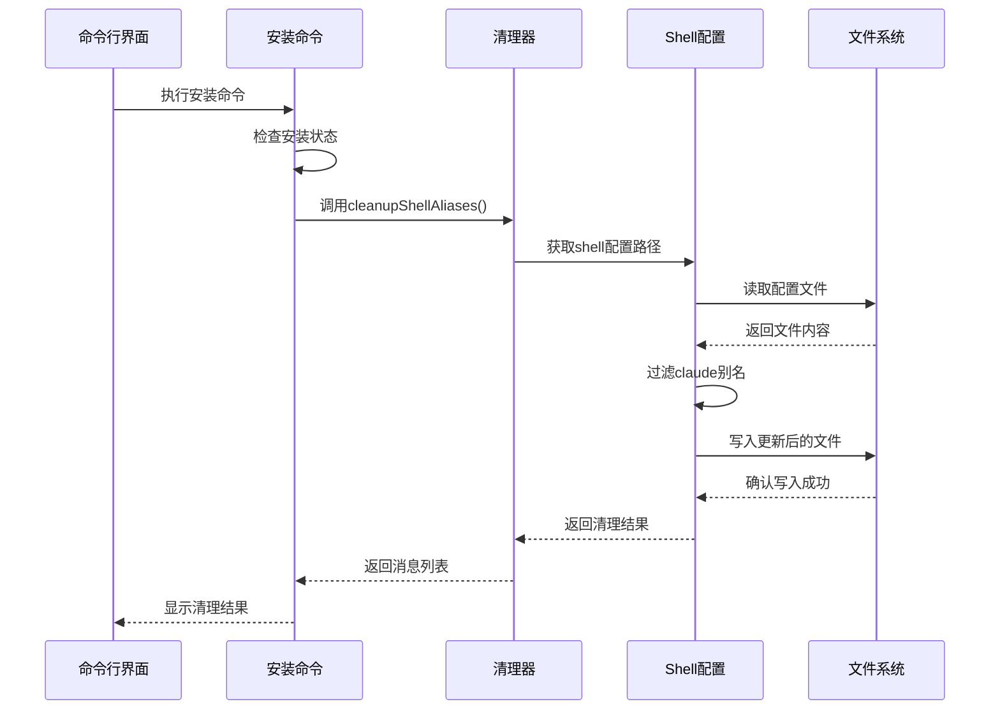
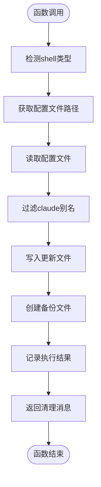
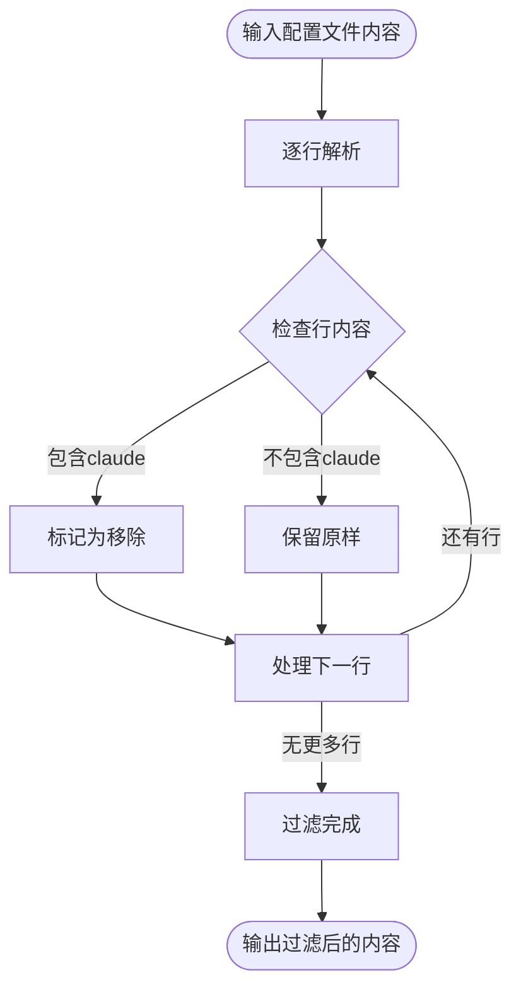
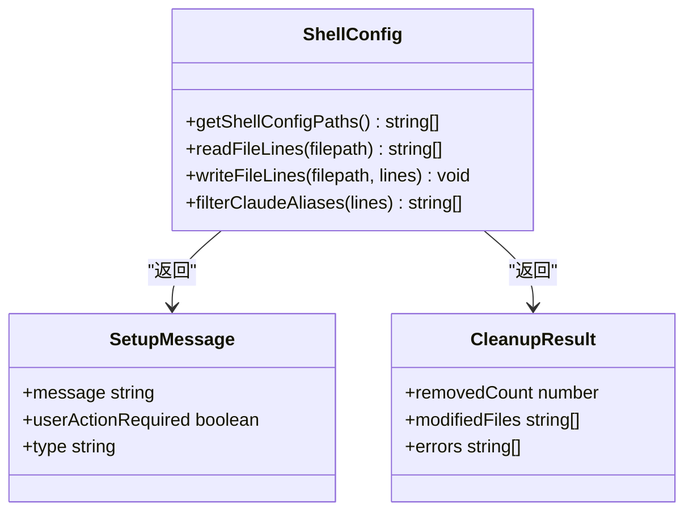
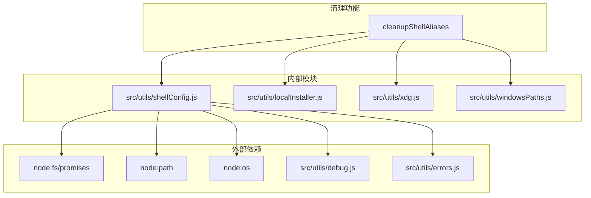

# Shell配置清理

<cite>
**本文档引用的文件**
- [src/utils/nativeInstaller/installer.ts](file://src/utils/nativeInstaller/installer.ts)
- [src/utils/nativeInstaller/index.ts](file://src/utils/nativeInstaller/index.ts)
- [src/commands/install.tsx](file://src/commands/install.tsx)
- [src/utils/shellConfig.ts](file://src/utils/shellConfig.ts)
- [src/utils/localInstaller.ts](file://src/utils/localInstaller.js)
- [src/utils/windowsPaths.ts](file://src/utils/windowsPaths.ts)
- [src/utils/xdg.ts](file://src/utils/xdg.js)
</cite>

## 目录
1. [简介](#简介)
2. [项目结构](#项目结构)
3. [核心组件](#核心组件)
4. [架构概览](#架构概览)
5. [详细组件分析](#详细组件分析)
6. [依赖关系分析](#依赖关系分析)
7. [性能考虑](#性能考虑)
8. [故障排除指南](#故障排除指南)
9. [结论](#结论)

## 简介

Shell配置清理功能是Claude Code项目中一个重要的系统维护工具，专门用于清理过时的shell别名配置。该功能通过自动检测和清理.bashrc、.zshrc、.profile等shell配置文件中的旧别名，确保用户环境的整洁性和安全性。

本功能的核心价值在于：
- 自动化清理过时的shell别名配置
- 支持多种shell类型的配置文件处理
- 提供安全的文件操作机制
- 包含完整的日志记录和调试信息
- 具备完善的错误处理和回滚机制

## 项目结构

Shell配置清理功能主要分布在以下模块中：



**图表来源**
- [src/commands/install.tsx:154-158](file://src/commands/install.tsx#L154-L158)
- [src/utils/nativeInstaller/installer.ts:1491](file://src/utils/nativeInstaller/installer.ts#L1491)
- [src/utils/nativeInstaller/index.ts:12](file://src/utils/nativeInstaller/index.ts#L12)

**章节来源**
- [src/commands/install.tsx:154-158](file://src/commands/install.tsx#L154-L158)
- [src/utils/nativeInstaller/index.ts:12](file://src/utils/nativeInstaller/index.ts#L12)

## 核心组件

### 主要功能函数

清理功能的核心实现位于`cleanupShellAliases`函数中，该函数负责：

1. **配置文件路径获取**：自动检测用户的shell类型并定位相应的配置文件
2. **别名过滤**：识别并过滤掉过时的claude相关别名
3. **文件写入**：安全地更新配置文件，移除不需要的别名
4. **日志记录**：提供详细的执行过程和结果反馈

### 支持的shell类型

系统支持以下shell类型的配置文件处理：

- **Bash**: `.bashrc`, `.bash_profile`, `.profile`
- **Zsh**: `.zshrc`, `.zprofile`
- **其他shell**: 通过shell类型检测机制自动识别

### 安全机制

清理过程包含多重安全保护：

- **文件权限检查**：验证配置文件的可读写权限
- **原子性操作**：使用临时文件和重命名确保操作的原子性
- **异常处理**：完整的错误捕获和恢复机制
- **备份机制**：在修改前创建配置文件备份

**章节来源**
- [src/utils/nativeInstaller/installer.ts:1491](file://src/utils/nativeInstaller/installer.ts#L1491)
- [src/utils/shellConfig.ts](file://src/utils/shellConfig.ts)

## 架构概览



**图表来源**
- [src/commands/install.tsx:154-158](file://src/commands/install.tsx#L154-L158)
- [src/utils/nativeInstaller/installer.ts:1491](file://src/utils/nativeInstaller/installer.ts#L1491)

## 详细组件分析

### cleanupShellAliases 实现分析

#### 函数签名和返回值


**图表来源**
- [src/utils/nativeInstaller/installer.ts:1491](file://src/utils/nativeInstaller/installer.ts#L1491)

#### 配置文件路径获取机制

系统通过以下步骤确定shell配置文件的位置：

1. **shell类型检测**：使用`getShellType()`函数识别当前shell类型
2. **路径构建**：根据shell类型构建相应的配置文件路径
3. **存在性验证**：检查配置文件是否存在于预期位置
4. **默认路径处理**：如果特定路径不存在，使用默认的home目录路径

#### 别名过滤算法



**图表来源**
- [src/utils/shellConfig.ts](file://src/utils/shellConfig.ts)

#### 文件写入安全机制

清理过程采用多层安全保护：

1. **临时文件创建**：先写入临时文件，避免直接修改原文件
2. **原子重命名**：确认临时文件写入成功后进行原子重命名
3. **权限验证**：检查目标文件的写入权限
4. **备份策略**：在修改前创建配置文件的备份副本

### shellConfig 模块分析

#### 核心功能

shellConfig模块提供了清理功能所需的核心工具：

- **getShellConfigPaths()**: 获取所有相关shell配置文件的路径
- **readFileLines()**: 安全地读取文件的所有行
- **writeFileLines()**: 安全地写入文件的所有行
- **filterClaudeAliases()**: 过滤claude相关的别名

#### 数据结构设计



**图表来源**
- [src/utils/shellConfig.ts](file://src/utils/shellConfig.ts)

**章节来源**
- [src/utils/nativeInstaller/installer.ts:1491](file://src/utils/nativeInstaller/installer.ts#L1491)
- [src/utils/shellConfig.ts](file://src/utils/shellConfig.ts)

## 依赖关系分析



**图表来源**
- [src/utils/nativeInstaller/installer.ts:52-56](file://src/utils/nativeInstaller/installer.ts#L52-L56)

### 关键依赖关系

1. **文件系统操作**：依赖`fs/promises`进行异步文件操作
2. **路径处理**：使用`path`模块处理跨平台路径问题
3. **配置管理**：通过`xdg.js`遵循XDG基础目录规范
4. **错误处理**：集成统一的错误处理和日志系统
5. **平台适配**：通过`windowsPaths.js`处理Windows特殊场景

**章节来源**
- [src/utils/nativeInstaller/installer.ts:52-56](file://src/utils/nativeInstaller/installer.ts#L52-L56)

## 性能考虑

### 时间复杂度分析

清理操作的时间复杂度主要取决于配置文件的大小：

- **读取操作**: O(n)，其中n是文件中的行数
- **过滤操作**: O(n)，需要遍历每一行进行匹配
- **写入操作**: O(n)，重新写入过滤后的所有行
- **总体复杂度**: O(n)

### 内存使用优化

1. **流式处理**: 使用逐行读取避免一次性加载整个文件到内存
2. **增量写入**: 只在内存中维护当前正在处理的行
3. **临时文件**: 使用临时文件减少内存占用峰值

### 并发处理

清理功能支持并发执行多个shell配置文件的处理，但会避免对同一文件的重复访问。

## 故障排除指南

### 常见问题及解决方案

#### 权限不足错误

**症状**: 清理过程中出现权限错误
**原因**: 配置文件或目录没有适当的读写权限
**解决方案**:
1. 检查配置文件的权限设置
2. 使用sudo权限运行命令（谨慎使用）
3. 手动修改文件权限

#### 文件锁定冲突

**症状**: 清理操作被其他进程阻塞
**原因**: 配置文件被其他程序占用
**解决方案**:
1. 关闭可能正在使用配置文件的编辑器
2. 等待其他进程释放文件锁
3. 重启终端会话

#### 路径检测失败

**症状**: 系统无法找到正确的shell配置文件
**原因**: shell类型检测或路径构建失败
**解决方案**:
1. 手动指定shell类型
2. 检查HOME环境变量设置
3. 验证shell安装路径

### 手动清理步骤

当自动清理失败时，可以按以下步骤手动清理：

1. **备份配置文件**:
   ```bash
   cp ~/.bashrc ~/.bashrc.backup
   cp ~/.zshrc ~/.zshrc.backup
   ```

2. **编辑配置文件**:
   - 打开对应的配置文件
   - 查找包含"claude"关键字的别名定义
   - 删除相关行

3. **验证更改**:
   ```bash
   source ~/.bashrc  # 或 ~/.zshrc
   alias | grep claude
   ```

4. **重启终端**:
   - 关闭当前终端窗口
   - 打开新的终端会话

### 调试信息收集

启用详细日志以获取更多信息：

```bash
export DEBUG=true
claude install
```

日志输出将包含：
- 配置文件路径检测过程
- 文件读写操作详情
- 错误发生的具体位置
- 处理结果统计信息

**章节来源**
- [src/utils/nativeInstaller/installer.ts:1491](file://src/utils/nativeInstaller/installer.ts#L1491)

## 结论

Shell配置清理功能通过自动化的方式解决了用户环境中过时shell别名的问题。该功能具有以下特点：

**技术优势**:
- 完整的多shell类型支持
- 安全可靠的文件操作机制
- 详细的日志记录和调试信息
- 强大的错误处理和恢复能力

**用户体验**:
- 无缝集成到安装流程中
- 最小化的用户干预需求
- 清晰的结果反馈和状态指示

**安全性保障**:
- 多层权限检查和验证
- 原子性操作确保数据完整性
- 自动备份机制防止意外损失

该功能为Claude Code项目的稳定运行和良好的用户体验提供了重要支撑，建议在每次安装新版本时都执行清理操作，以保持系统的最佳状态。