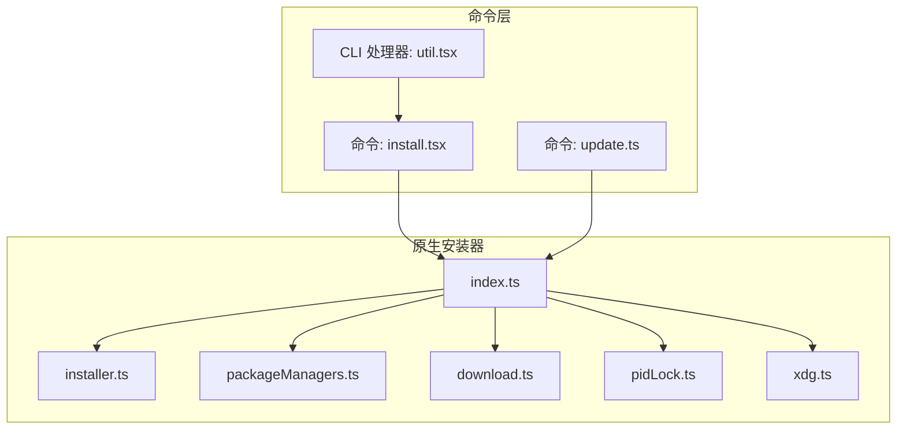
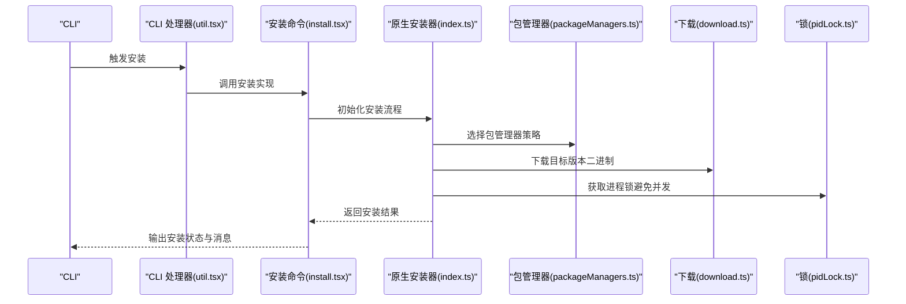
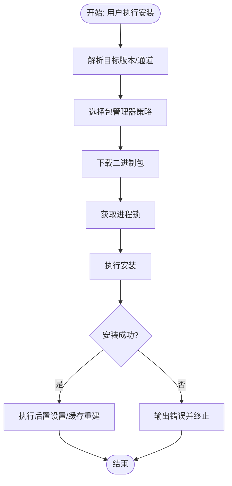
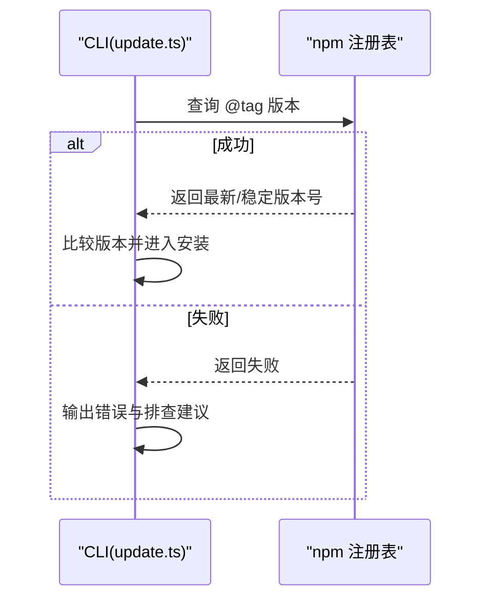
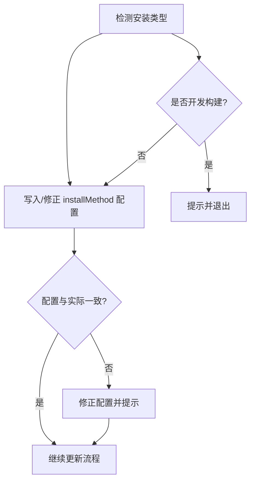
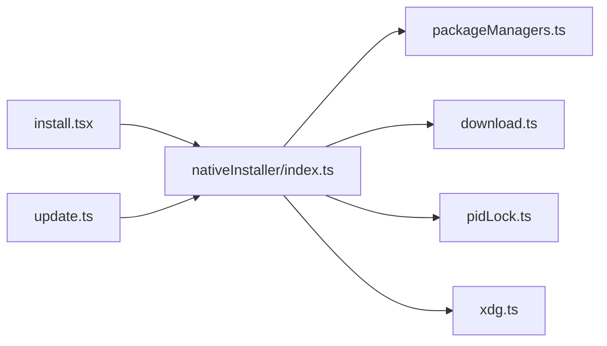

# 安装方式

<cite>
**本文引用的文件**
- [src/commands/install.tsx](file://src/commands/install.tsx)
- [src/cli/update.ts](file://src/cli/update.ts)
- [src/utils/nativeInstaller/index.ts](file://src/utils/nativeInstaller/index.ts)
- [src/utils/nativeInstaller/installer.ts](file://src/utils/nativeInstaller/installer.ts)
- [src/utils/nativeInstaller/packageManagers.ts](file://src/utils/nativeInstaller/packageManagers.ts)
- [src/utils/nativeInstaller/download.ts](file://src/utils/nativeInstaller/download.ts)
- [src/utils/nativeInstaller/pidLock.ts](file://src/utils/nativeInstaller/pidLock.ts)
- [src/utils/xdg.ts](file://src/utils/xdg.ts)
- [src/cli/handlers/util.tsx](file://src/cli/handlers/util.tsx)
- [src/commands/plugin/BrowseMarketplace.tsx](file://src/commands/plugin/BrowseMarketplace.tsx)
</cite>

## 目录
1. [引言](#引言)
2. [项目结构](#项目结构)
3. [核心组件](#核心组件)
4. [架构总览](#架构总览)
5. [详细组件分析](#详细组件分析)
6. [依赖关系分析](#依赖关系分析)
7. [性能考量](#性能考量)
8. [故障排查指南](#故障排查指南)
9. [结论](#结论)
10. [附录](#附录)

## 引言
本文件系统性阐述 Claude Code 的安装方式与更新机制，覆盖以下主题：
- 全局包安装流程：包规格构建、包管理器选择、安装结果处理
- GCS 桶版本获取机制：最新版与稳定版指针读取、网络请求与错误处理
- 版本历史获取：语义化版本列表、新旧排序与限制参数
- 安装方法追踪：安装方式记录与配置更新
- 不同安装方式的优缺点对比与选择建议

## 项目结构
围绕安装与更新的关键目录与文件如下：
- 命令入口与安装 UI：src/commands/install.tsx
- 更新逻辑：src/cli/update.ts
- 原生安装器子模块：src/utils/nativeInstaller/*
- 包管理器适配：src/utils/nativeInstaller/packageManagers.ts
- 下载与锁：src/utils/nativeInstaller/download.ts、src/utils/nativeInstaller/pidLock.ts
- XDG 路径工具：src/utils/xdg.ts
- CLI 安装处理器：src/cli/handlers/util.tsx
- 插件市场安装预览：src/commands/plugin/BrowseMarketplace.tsx

图表来源
- [src/commands/install.tsx:1-43](file://src/commands/install.tsx#L1-L43)
- [src/cli/update.ts:70-211](file://src/cli/update.ts#L70-L211)
- [src/utils/nativeInstaller/index.ts](file://src/utils/nativeInstaller/index.ts)
- [src/utils/nativeInstaller/installer.ts](file://src/utils/nativeInstaller/installer.ts)
- [src/utils/nativeInstaller/packageManagers.ts](file://src/utils/nativeInstaller/packageManagers.ts)
- [src/utils/nativeInstaller/download.ts](file://src/utils/nativeInstaller/download.ts)
- [src/utils/nativeInstaller/pidLock.ts](file://src/utils/nativeInstaller/pidLock.ts)
- [src/utils/xdg.ts:1-45](file://src/utils/xdg.ts#L1-L45)
- [src/cli/handlers/util.tsx:89-109](file://src/cli/handlers/util.tsx#L89-L109)

章节来源
- [src/commands/install.tsx:1-43](file://src/commands/install.tsx#L1-L43)
- [src/cli/update.ts:70-211](file://src/cli/update.ts#L70-L211)
- [src/utils/nativeInstaller/index.ts](file://src/utils/nativeInstaller/index.ts)
- [src/utils/nativeInstaller/installer.ts](file://src/utils/nativeInstaller/installer.ts)
- [src/utils/nativeInstaller/packageManagers.ts](file://src/utils/nativeInstaller/packageManagers.ts)
- [src/utils/nativeInstaller/download.ts](file://src/utils/nativeInstaller/download.ts)
- [src/utils/nativeInstaller/pidLock.ts](file://src/utils/nativeInstaller/pidLock.ts)
- [src/utils/xdg.ts:1-45](file://src/utils/xdg.ts#L1-L45)
- [src/cli/handlers/util.tsx:89-109](file://src/cli/handlers/util.tsx#L89-L109)

## 核心组件
- 安装命令与状态机：install.tsx 提供安装状态切换（检查、清理、安装、设置、成功/错误），并调用原生安装器执行实际安装。
- 更新命令：update.ts 负责检测当前运行环境、决定使用本地或全局更新路径、调用 npm 获取最新版本并执行安装，同时处理权限与并发冲突。
- 原生安装器：index.ts 汇聚安装器、包管理器、下载与锁等能力；installer.ts 实现安装主流程；packageManagers.ts 抽象不同包管理器行为；download.ts 管理下载；pidLock.ts 防止并发安装。
- XDG 工具：xdg.ts 提供 XDG 规范下的状态与缓存目录解析，用于原生安装器组织文件。
- CLI 安装处理器：util.tsx 将 CLI 安装入口转发到安装命令实现。

章节来源
- [src/commands/install.tsx:1-43](file://src/commands/install.tsx#L1-L43)
- [src/cli/update.ts:70-211](file://src/cli/update.ts#L70-L211)
- [src/utils/nativeInstaller/index.ts](file://src/utils/nativeInstaller/index.ts)
- [src/utils/nativeInstaller/installer.ts](file://src/utils/nativeInstaller/installer.ts)
- [src/utils/nativeInstaller/packageManagers.ts](file://src/utils/nativeInstaller/packageManagers.ts)
- [src/utils/nativeInstaller/download.ts](file://src/utils/nativeInstaller/download.ts)
- [src/utils/nativeInstaller/pidLock.ts](file://src/utils/nativeInstaller/pidLock.ts)
- [src/utils/xdg.ts:1-45](file://src/utils/xdg.ts#L1-L45)
- [src/cli/handlers/util.tsx:89-109](file://src/cli/handlers/util.tsx#L89-L109)

## 架构总览
下图展示从 CLI 到安装器的整体调用链路与职责划分：

图表来源
- [src/cli/handlers/util.tsx:89-109](file://src/cli/handlers/util.tsx#L89-L109)
- [src/commands/install.tsx:1-43](file://src/commands/install.tsx#L1-L43)
- [src/utils/nativeInstaller/index.ts](file://src/utils/nativeInstaller/index.ts)
- [src/utils/nativeInstaller/packageManagers.ts](file://src/utils/nativeInstaller/packageManagers.ts)
- [src/utils/nativeInstaller/download.ts](file://src/utils/nativeInstaller/download.ts)
- [src/utils/nativeInstaller/pidLock.ts](file://src/utils/nativeInstaller/pidLock.ts)

## 详细组件分析

### 全局包安装流程
- 包规格构建：安装命令根据用户输入的目标通道（如 latest/stable 或具体版本）与当前平台信息，生成安装规格，并通过原生安装器进行解析与落地。
- 包管理器选择：原生安装器在不同平台与环境下选择合适的包管理器策略（例如 npm、yarn、pnpm 等），以确保兼容性与一致性。
- 安装结果处理：安装完成后，安装命令输出成功/失败信息，并可触发后续设置步骤（如别名、缓存重建等）。

图表来源
- [src/commands/install.tsx:1-43](file://src/commands/install.tsx#L1-L43)
- [src/utils/nativeInstaller/packageManagers.ts](file://src/utils/nativeInstaller/packageManagers.ts)
- [src/utils/nativeInstaller/download.ts](file://src/utils/nativeInstaller/download.ts)
- [src/utils/nativeInstaller/pidLock.ts](file://src/utils/nativeInstaller/pidLock.ts)

章节来源
- [src/commands/install.tsx:1-43](file://src/commands/install.tsx#L1-L43)
- [src/utils/nativeInstaller/packageManagers.ts](file://src/utils/nativeInstaller/packageManagers.ts)
- [src/utils/nativeInstaller/download.ts](file://src/utils/nativeInstaller/download.ts)
- [src/utils/nativeInstaller/pidLock.ts](file://src/utils/nativeInstaller/pidLock.ts)

### GCS 桶版本获取机制
- 最新版与稳定版指针读取：更新命令根据通道（stable 或 latest）选择对应的 npm 标签，向 npm 注册表查询对应版本号，作为“指针”读取最新/稳定版本。
- 网络请求与错误处理：若无法从注册表获取版本，命令会输出明确的可能原因（网络、代理、企业防火墙、内部开发构建未发布至公共注册表等），并给出可操作的排查建议（检查网络、调试日志、手动查看版本、检查登录状态）。
- 结果处理：若版本与当前版本一致则提示已是最新；否则进入安装流程。

图表来源
- [src/cli/update.ts:267-306](file://src/cli/update.ts#L267-L306)

章节来源
- [src/cli/update.ts:267-306](file://src/cli/update.ts#L267-L306)

### 版本历史获取功能
- 语义化版本列表：通过 npm view 命令获取包的版本列表，结合标签（如 latest、stable）筛选候选版本。
- 新旧排序：通常按时间倒序排列，优先展示最新版本。
- 限制参数：可通过通道参数（如 latest/stable）限制返回范围；也可结合用户设置或默认策略控制显示数量或过滤条件。

章节来源
- [src/cli/update.ts:267-275](file://src/cli/update.ts#L267-L275)

### 安装方法跟踪与配置更新
- 安装方式记录：当检测到非包管理器安装时，更新命令会将当前运行的安装类型映射为本地/原生/全局/未知，并写入全局配置。
- 配置更新：若配置与实际运行类型不一致，命令会自动修正配置，确保后续更新与诊断逻辑基于正确安装方式。
- 开发构建保护：对于开发构建，命令会提示无法更新并优雅退出。

图表来源
- [src/cli/update.ts:76-115](file://src/cli/update.ts#L76-L115)
- [src/cli/update.ts:168-211](file://src/cli/update.ts#L168-L211)

章节来源
- [src/cli/update.ts:76-115](file://src/cli/update.ts#L76-L115)
- [src/cli/update.ts:168-211](file://src/cli/update.ts#L168-L211)

### 不同安装方式的优缺点对比与选择建议
- 本地安装（npm-local）
  - 优点：隔离性强，便于多版本共存与快速回滚；适合开发者与测试场景。
  - 缺点：需要在特定工作区执行；升级需逐项目处理。
  - 适用：需要严格版本隔离或频繁切换版本的用户。
- 全局安装（npm-global）
  - 优点：全局可用，命令即开即用；统一升级更便捷。
  - 缺点：权限问题常见；升级影响全局环境。
  - 适用：追求便利性的终端用户与 CI 场景。
- 原生安装（native）
  - 优点：独立于包管理器，减少权限与环境耦合；可自定义安装路径与缓存。
  - 缺点：首次安装复杂度较高；跨平台差异需要适配。
  - 适用：对环境稳定性与可控性要求高、或包管理器受限的用户。
- 选择建议
  - 若追求简单与统一：优先全局安装。
  - 若需要隔离与可移植：优先本地安装。
  - 若受企业网络/权限限制：考虑原生安装以降低依赖。

章节来源
- [src/cli/update.ts:321-352](file://src/cli/update.ts#L321-L352)
- [src/cli/update.ts:373-422](file://src/cli/update.ts#L373-L422)

## 依赖关系分析
- 组件内聚与耦合
  - 安装命令与原生安装器通过 index.ts 解耦，便于扩展包管理器与下载策略。
  - 包管理器抽象（packageManagers.ts）与下载（download.ts）、锁（pidLock.ts）相互独立，提升可测试性与可维护性。
- 外部依赖
  - npm 注册表用于版本查询与下载元数据获取。
  - XDG 目录规范用于在类 Unix 系统上组织状态与缓存，避免权限问题。

图表来源
- [src/commands/install.tsx:1-43](file://src/commands/install.tsx#L1-L43)
- [src/utils/nativeInstaller/index.ts](file://src/utils/nativeInstaller/index.ts)
- [src/utils/nativeInstaller/packageManagers.ts](file://src/utils/nativeInstaller/packageManagers.ts)
- [src/utils/nativeInstaller/download.ts](file://src/utils/nativeInstaller/download.ts)
- [src/utils/nativeInstaller/pidLock.ts](file://src/utils/nativeInstaller/pidLock.ts)
- [src/utils/xdg.ts:1-45](file://src/utils/xdg.ts#L1-L45)
- [src/cli/update.ts:70-211](file://src/cli/update.ts#L70-L211)

章节来源
- [src/commands/install.tsx:1-43](file://src/commands/install.tsx#L1-L43)
- [src/utils/nativeInstaller/index.ts](file://src/utils/nativeInstaller/index.ts)
- [src/utils/nativeInstaller/packageManagers.ts](file://src/utils/nativeInstaller/packageManagers.ts)
- [src/utils/nativeInstaller/download.ts](file://src/utils/nativeInstaller/download.ts)
- [src/utils/nativeInstaller/pidLock.ts](file://src/utils/nativeInstaller/pidLock.ts)
- [src/utils/xdg.ts:1-45](file://src/utils/xdg.ts#L1-L45)
- [src/cli/update.ts:70-211](file://src/cli/update.ts#L70-L211)

## 性能考量
- 并发控制：通过 pidLock 避免多个实例同时安装，减少资源竞争与失败重试成本。
- 下载优化：根据平台与架构选择最优二进制包，减少不必要的解压与校验开销。
- 缓存利用：XDG 缓存目录用于复用已下载内容，缩短重复安装时间。
- 网络超时与重试：在更新流程中对网络请求设置合理超时与重试策略，提升鲁棒性。

## 故障排查指南
- 无法连接 npm 注册表
  - 现象：更新命令提示无法获取最新版本。
  - 排查：检查网络连通性、代理/防火墙策略；确认是否需要登录；尝试手动执行 npm view 查看版本。
- 权限不足
  - 现象：安装失败或提示权限不足。
  - 排查：在全局安装场景尝试修复 npm 权限或使用提权方式；或改用原生安装以规避权限问题。
- 并发冲突
  - 现象：提示另一个实例正在执行更新。
  - 排查：等待当前更新完成后再试。
- 开发构建不可更新
  - 现象：提示无法更新开发构建。
  - 排查：开发构建不支持自动更新，请手动编译或切换到发行版本。

章节来源
- [src/cli/update.ts:277-306](file://src/cli/update.ts#L277-L306)
- [src/cli/update.ts:382-422](file://src/cli/update.ts#L382-L422)

## 结论
本文梳理了 Claude Code 的安装与更新体系：从命令入口到原生安装器，再到包管理器与下载锁的协同；明确了 GCS（npm 注册表）版本获取与错误处理策略；总结了安装方式的优劣与选择建议。遵循本文档的流程与最佳实践，可在不同环境中高效、稳定地完成安装与升级。

## 附录
- 插件市场安装预览：在插件市场页面，用户可直观看到将要安装的命令、代理、钩子与 MCP 服务器清单，便于决策与审计。

章节来源
- [src/commands/plugin/BrowseMarketplace.tsx:660-678](file://src/commands/plugin/BrowseMarketplace.tsx#L660-L678)