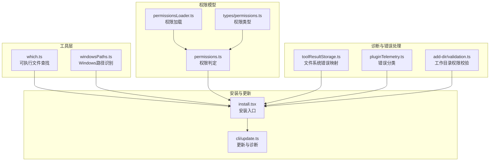
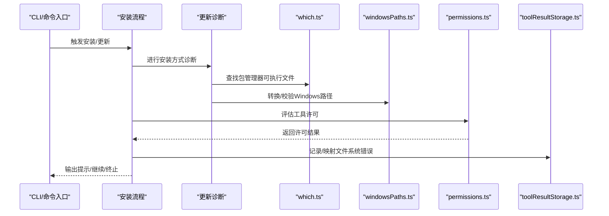
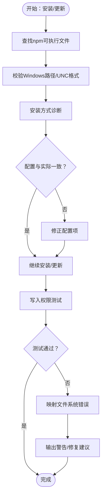
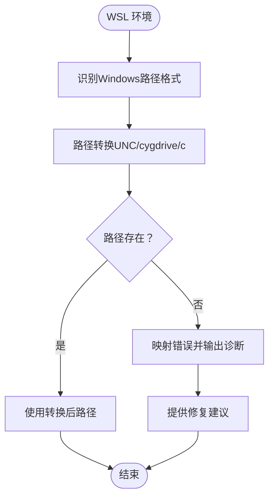
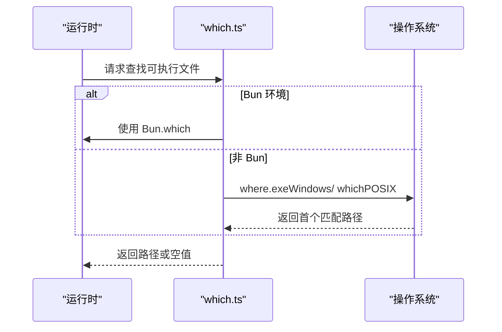
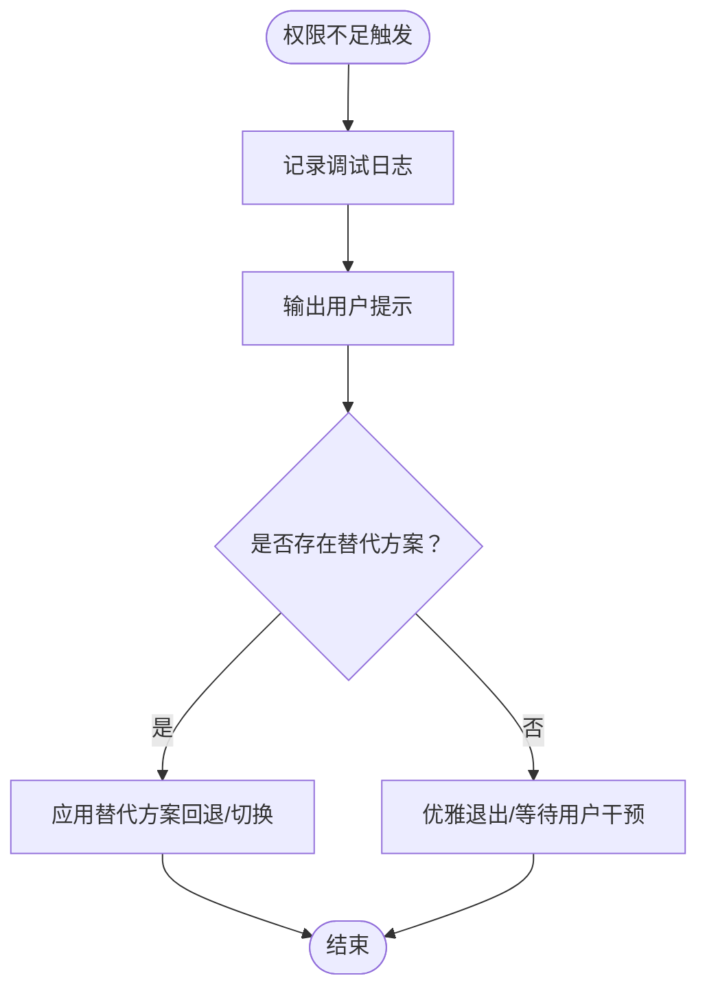
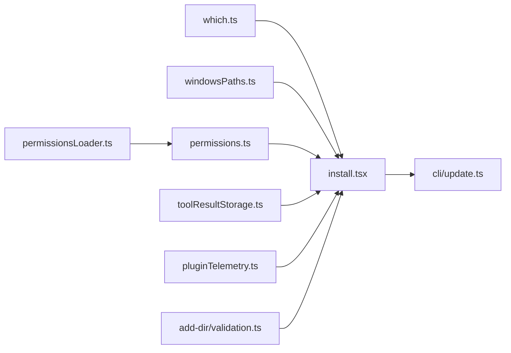

# 权限检查

<cite>
**本文引用的文件**
- [src/utils/which.ts](file://src/utils/which.ts)
- [src/utils/windowsPaths.ts](file://src/utils/windowsPaths.ts)
- [src/utils/permissions/permissions.ts](file://src/utils/permissions/permissions.ts)
- [src/utils/permissions/permissionsLoader.ts](file://src/utils/permissions/permissionsLoader.ts)
- [src/types/permissions.ts](file://src/types/permissions.ts)
- [src/commands/install.tsx](file://src/commands/install.tsx)
- [src/cli/update.ts](file://src/cli/update.ts)
- [src/utils/toolResultStorage.ts](file://src/utils/toolResultStorage.ts)
- [src/utils/telemetry/pluginTelemetry.ts](file://src/utils/telemetry/pluginTelemetry.ts)
- [src/commands/add-dir/validation.ts](file://src/commands/add-dir/validation.ts)
</cite>

## 目录
1. [简介](#简介)
2. [项目结构](#项目结构)
3. [核心组件](#核心组件)
4. [架构总览](#架构总览)
5. [详细组件分析](#详细组件分析)
6. [依赖关系分析](#依赖关系分析)
7. [性能考量](#性能考量)
8. [故障排查指南](#故障排查指南)
9. [结论](#结论)
10. [附录](#附录)

## 简介
本文件系统性阐述本仓库中的“权限检查”能力，重点覆盖以下方面：
- 全局安装权限验证：包括 npm 前缀获取、写入权限测试、错误处理策略
- WSL 环境中 Windows NPM 检测机制：路径识别、错误诊断与修复建议
- 多包管理器支持：Bun 与 npm 的检测逻辑
- 权限不足时的处理流程：用户提示、日志记录、替代方案
- 权限检查失败的常见原因与解决方法

本说明面向开发者与运维人员，既提供高层概览也给出可操作的技术细节。

## 项目结构
围绕权限检查的关键模块分布如下：
- 工具层（跨平台命令发现与路径转换）
  - [src/utils/which.ts](file://src/utils/which.ts)：统一的可执行文件查找接口，兼容 Bun 与 Node
  - [src/utils/windowsPaths.ts](file://src/utils/windowsPaths.ts)：Windows 路径识别与存在性检测辅助
- 权限模型与加载
  - [src/utils/permissions/permissions.ts](file://src/utils/permissions/permissions.ts)：权限判定与工具许可评估
  - [src/utils/permissions/permissionsLoader.ts](file://src/utils/permissions/permissionsLoader.ts)：权限配置加载与缓存
  - [src/types/permissions.ts](file://src/types/permissions.ts)：权限类型定义
- 安装与更新流程
  - [src/commands/install.tsx](file://src/commands/install.tsx)：安装入口，涉及安装方式与权限校验
  - [src/cli/update.ts](file://src/cli/update.ts)：更新流程中的安装方式诊断与配置同步
- 错误分类与诊断
  - [src/utils/toolResultStorage.ts](file://src/utils/toolResultStorage.ts)：文件系统错误消息映射
  - [src/utils/telemetry/pluginTelemetry.ts](file://src/utils/telemetry/pluginTelemetry.ts)：插件命令错误分类（含权限类）
  - [src/commands/add-dir/validation.ts](file://src/commands/add-dir/validation.ts)：工作目录权限上下文下的路径有效性与权限判断

图表来源
- [src/utils/which.ts:1-82](file://src/utils/which.ts#L1-L82)
- [src/utils/windowsPaths.ts:1-173](file://src/utils/windowsPaths.ts#L1-L173)
- [src/utils/permissions/permissions.ts](file://src/utils/permissions/permissions.ts)
- [src/utils/permissions/permissionsLoader.ts](file://src/utils/permissions/permissionsLoader.ts)
- [src/types/permissions.ts](file://src/types/permissions.ts)
- [src/commands/install.tsx](file://src/commands/install.tsx)
- [src/cli/update.ts:70-211](file://src/cli/update.ts#L70-L211)
- [src/utils/toolResultStorage.ts:1014-1040](file://src/utils/toolResultStorage.ts#L1014-L1040)
- [src/utils/telemetry/pluginTelemetry.ts:238-259](file://src/utils/telemetry/pluginTelemetry.ts#L238-L259)
- [src/commands/add-dir/validation.ts:45-93](file://src/commands/add-dir/validation.ts#L45-L93)

章节来源
- [src/utils/which.ts:1-82](file://src/utils/which.ts#L1-L82)
- [src/utils/windowsPaths.ts:1-173](file://src/utils/windowsPaths.ts#L1-L173)
- [src/utils/permissions/permissions.ts](file://src/utils/permissions/permissions.ts)
- [src/utils/permissions/permissionsLoader.ts](file://src/utils/permissions/permissionsLoader.ts)
- [src/types/permissions.ts](file://src/types/permissions.ts)
- [src/commands/install.tsx](file://src/commands/install.tsx)
- [src/cli/update.ts:70-211](file://src/cli/update.ts#L70-L211)
- [src/utils/toolResultStorage.ts:1014-1040](file://src/utils/toolResultStorage.ts#L1014-L1040)
- [src/utils/telemetry/pluginTelemetry.ts:238-259](file://src/utils/telemetry/pluginTelemetry.ts#L238-L259)
- [src/commands/add-dir/validation.ts:45-93](file://src/commands/add-dir/validation.ts#L45-L93)

## 核心组件
- 可执行文件查找（which）：在 Bun 与 Node 环境下统一提供命令解析，优先使用 Bun.which，否则调用 where.exe（Windows）或 which（POSIX），返回首个匹配路径或空值
- Windows 路径识别：提供路径存在性检测与多种 POSIX 到 Windows 路径转换规则，用于 WSL/Windows 双环境路径适配
- 权限判定与加载：基于工具与输入上下文进行许可评估，并通过加载器维护权限配置缓存
- 安装与更新流程：在安装与更新过程中进行安装方式诊断、配置同步与错误提示
- 错误映射与分类：对文件系统错误进行人类可读映射；对插件命令错误按网络、权限等类别分类

章节来源
- [src/utils/which.ts:1-82](file://src/utils/which.ts#L1-L82)
- [src/utils/windowsPaths.ts:1-173](file://src/utils/windowsPaths.ts#L1-L173)
- [src/utils/permissions/permissions.ts](file://src/utils/permissions/permissions.ts)
- [src/utils/permissions/permissionsLoader.ts](file://src/utils/permissions/permissionsLoader.ts)
- [src/commands/install.tsx](file://src/commands/install.tsx)
- [src/cli/update.ts:70-211](file://src/cli/update.ts#L70-L211)
- [src/utils/toolResultStorage.ts:1014-1040](file://src/utils/toolResultStorage.ts#L1014-L1040)
- [src/utils/telemetry/pluginTelemetry.ts:238-259](file://src/utils/telemetry/pluginTelemetry.ts#L238-L259)

## 架构总览
权限检查贯穿“安装/更新 → 工具许可 → 文件系统操作 → 错误处理”的主链路。下图展示关键交互：

图表来源
- [src/commands/install.tsx](file://src/commands/install.tsx)
- [src/cli/update.ts:70-211](file://src/cli/update.ts#L70-L211)
- [src/utils/which.ts:1-82](file://src/utils/which.ts#L1-L82)
- [src/utils/windowsPaths.ts:1-173](file://src/utils/windowsPaths.ts#L1-L173)
- [src/utils/permissions/permissions.ts](file://src/utils/permissions/permissions.ts)
- [src/utils/toolResultStorage.ts:1014-1040](file://src/utils/toolResultStorage.ts#L1014-L1040)

## 详细组件分析

### 组件A：全局安装权限验证（npm 前缀获取、写入权限测试、错误处理）
- npm 前缀获取与写入权限测试
  - 通过可执行文件查找定位 npm（Windows 使用 where.exe，POSIX 使用 which），随后结合安装诊断与配置同步，确保当前运行环境与配置一致
  - 在更新流程中，若检测到配置与实际运行不一致，会自动修正配置项，避免后续权限与路径问题
- 错误处理
  - 对于安装失败或权限不足的情况，输出明确警告与修复建议，必要时回退到 JS/npm 更新逻辑
  - 文件系统错误映射为人类可读信息，便于用户理解（如权限不足、只读文件系统等）

图表来源
- [src/cli/update.ts:70-211](file://src/cli/update.ts#L70-L211)
- [src/utils/which.ts:1-82](file://src/utils/which.ts#L1-L82)
- [src/utils/windowsPaths.ts:1-173](file://src/utils/windowsPaths.ts#L1-L173)
- [src/utils/toolResultStorage.ts:1014-1040](file://src/utils/toolResultStorage.ts#L1014-L1040)

章节来源
- [src/cli/update.ts:70-211](file://src/cli/update.ts#L70-L211)
- [src/utils/which.ts:1-82](file://src/utils/which.ts#L1-L82)
- [src/utils/windowsPaths.ts:1-173](file://src/utils/windowsPaths.ts#L1-L173)
- [src/utils/toolResultStorage.ts:1014-1040](file://src/utils/toolResultStorage.ts#L1014-L1040)

### 组件B：WSL 环境中 Windows NPM 检测机制（路径识别、错误诊断、修复建议）
- 路径识别
  - 提供多种 POSIX 到 Windows 路径转换规则（UNC、/cygdrive、/c/…），并结合存在性检测函数，提升在 WSL 中对 Windows 可执行文件的识别准确率
- 错误诊断
  - 将文件系统错误映射为可读信息，帮助区分“权限不足”“只读文件系统”等场景
- 修复建议
  - 在安装/更新流程中，针对路径与权限问题输出明确提示，并引导用户调整 PATH、权限或切换安装方式

图表来源
- [src/utils/windowsPaths.ts:148-173](file://src/utils/windowsPaths.ts#L148-L173)
- [src/utils/windowsPaths.ts:15-22](file://src/utils/windowsPaths.ts#L15-L22)
- [src/utils/toolResultStorage.ts:1014-1040](file://src/utils/toolResultStorage.ts#L1014-L1040)

章节来源
- [src/utils/windowsPaths.ts:1-173](file://src/utils/windowsPaths.ts#L1-L173)
- [src/utils/toolResultStorage.ts:1014-1040](file://src/utils/toolResultStorage.ts#L1014-L1040)

### 组件C：多包管理器支持（Bun 与 npm 的检测逻辑）
- Bun 优先检测
  - 在 which.ts 中，若运行于 Bun 环境，优先使用 Bun.which 获取可执行文件路径，避免额外进程开销
- Node 回退
  - 若非 Bun 或 Bun.which 不可用，则根据平台选择 where.exe（Windows）或 which（POSIX），返回首个匹配路径
- 安装/更新流程联动
  - 在安装与更新流程中，先定位包管理器可执行文件，再依据其类型进行相应处理（如跳过某些包管理器安装场景的配置更新）

图表来源
- [src/utils/which.ts:58-82](file://src/utils/which.ts#L58-L82)
- [src/utils/which.ts:4-31](file://src/utils/which.ts#L4-L31)

章节来源
- [src/utils/which.ts:1-82](file://src/utils/which.ts#L1-L82)

### 组件D：权限不足的处理流程（用户提示、日志记录、替代方案）
- 用户提示
  - 在安装/更新与工具使用过程中，针对权限不足、网络异常等错误输出明确警告与修复建议
- 日志记录
  - 使用调试日志记录安装方式、版本查询等关键步骤，便于问题复现与追踪
- 替代方案
  - 当检测到开发构建或特定安装方式不可更新时，输出提示并优雅退出
  - 对于非原生安装，回退到 JS/npm 更新逻辑，移除原生安装符号链接以避免冲突

图表来源
- [src/cli/update.ts:70-211](file://src/cli/update.ts#L70-L211)
- [src/utils/toolResultStorage.ts:1014-1040](file://src/utils/toolResultStorage.ts#L1014-L1040)

章节来源
- [src/cli/update.ts:70-211](file://src/cli/update.ts#L70-L211)
- [src/utils/toolResultStorage.ts:1014-1040](file://src/utils/toolResultStorage.ts#L1014-L1040)

### 组件E：权限检查失败的常见原因与解决方法
- 常见原因
  - 权限不足（EACCES/EPERM）
  - 只读文件系统（EROFS）
  - 路径不存在（ENOENT）
  - 包管理器未找到（where/which 返回空）
- 解决方法
  - 提升权限或切换到用户级安装目录
  - 检查并修复文件系统挂载选项
  - 确认 PATH 中包含包管理器路径
  - 在 WSL 中使用正确的路径转换规则

章节来源
- [src/utils/toolResultStorage.ts:1014-1040](file://src/utils/toolResultStorage.ts#L1014-L1040)
- [src/utils/telemetry/pluginTelemetry.ts:238-259](file://src/utils/telemetry/pluginTelemetry.ts#L238-L259)
- [src/commands/add-dir/validation.ts:45-93](file://src/commands/add-dir/validation.ts#L45-L93)

## 依赖关系分析
- 组件耦合
  - which.ts 与 windowsPaths.ts 分别承担“可执行文件查找”和“路径识别”，二者在安装/更新流程中协同工作
  - permissions.ts 与 permissionsLoader.ts 形成“权限判定+加载”的组合，被安装/更新与工具使用流程调用
  - toolResultStorage.ts 与 pluginTelemetry.ts 提供错误映射与分类，贯穿安装/更新与工具使用阶段
- 外部依赖
  - Bun.which（可选）用于高性能的可执行文件查找
  - where.exe/which（系统命令）用于跨平台查找

图表来源
- [src/utils/which.ts:1-82](file://src/utils/which.ts#L1-L82)
- [src/utils/windowsPaths.ts:1-173](file://src/utils/windowsPaths.ts#L1-L173)
- [src/utils/permissions/permissions.ts](file://src/utils/permissions/permissions.ts)
- [src/utils/permissions/permissionsLoader.ts](file://src/utils/permissions/permissionsLoader.ts)
- [src/commands/install.tsx](file://src/commands/install.tsx)
- [src/cli/update.ts:70-211](file://src/cli/update.ts#L70-L211)
- [src/utils/toolResultStorage.ts:1014-1040](file://src/utils/toolResultStorage.ts#L1014-L1040)
- [src/utils/telemetry/pluginTelemetry.ts:238-259](file://src/utils/telemetry/pluginTelemetry.ts#L238-L259)
- [src/commands/add-dir/validation.ts:45-93](file://src/commands/add-dir/validation.ts#L45-L93)

## 性能考量
- Bun.which 优先：在 Bun 环境下直接调用 Bun.which，避免进程启动开销，显著提升可执行文件查找性能
- 缓存与记忆化：windowsPaths.ts 中对路径转换使用 LRU 缓存，减少重复计算
- 并行与竞速：在工具许可请求中，权限提示工具与钩子并行运行，谁先完成谁获胜，缩短等待时间

章节来源
- [src/utils/which.ts:58-82](file://src/utils/which.ts#L58-L82)
- [src/utils/windowsPaths.ts:148-173](file://src/utils/windowsPaths.ts#L148-L173)

## 故障排查指南
- 安装/更新失败
  - 检查包管理器是否可执行（which/where 输出），确认 PATH 正确
  - 若为 WSL 环境，核对路径转换是否正确（UNC/cygdrive/c）
  - 关注配置与实际运行方式是否一致，必要时允许自动修正
- 权限不足
  - 使用人类可读错误消息定位具体路径，尝试提升权限或改用用户级安装
  - 对只读文件系统，检查挂载参数或切换目标目录
- 插件命令错误
  - 根据错误分类（网络/权限/验证等）采取针对性修复措施

章节来源
- [src/cli/update.ts:70-211](file://src/cli/update.ts#L70-L211)
- [src/utils/toolResultStorage.ts:1014-1040](file://src/utils/toolResultStorage.ts#L1014-L1040)
- [src/utils/telemetry/pluginTelemetry.ts:238-259](file://src/utils/telemetry/pluginTelemetry.ts#L238-L259)
- [src/commands/add-dir/validation.ts:45-93](file://src/commands/add-dir/validation.ts#L45-L93)

## 结论
本仓库通过“统一可执行文件查找 + 跨平台路径识别 + 权限判定与加载 + 明确的错误映射与分类”，构建了覆盖安装、更新与工具使用的完整权限检查体系。在 Bun 与 npm 环境下均具备良好支持，并针对 WSL 场景提供了稳健的路径识别与诊断能力。建议在生产部署中启用调试日志与错误映射，以便快速定位与解决问题。

## 附录
- 相关类型与模型
  - 权限类型定义与权限判定逻辑位于权限工具模块
  - 安装与更新流程中的安装方式诊断与配置同步逻辑位于 CLI 更新模块

章节来源
- [src/types/permissions.ts](file://src/types/permissions.ts)
- [src/utils/permissions/permissions.ts](file://src/utils/permissions/permissions.ts)
- [src/utils/permissions/permissionsLoader.ts](file://src/utils/permissions/permissionsLoader.ts)
- [src/cli/update.ts:70-211](file://src/cli/update.ts#L70-L211)