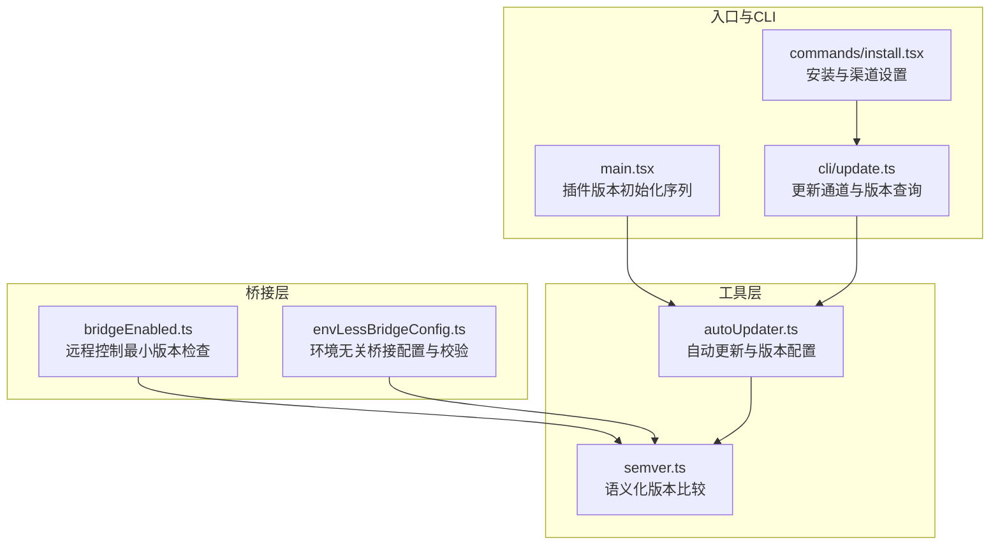
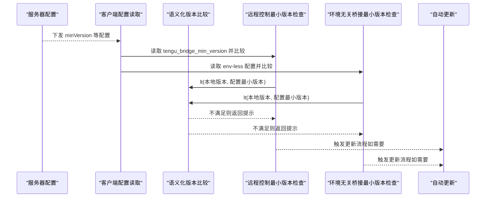
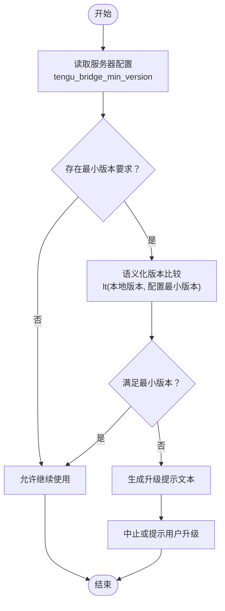
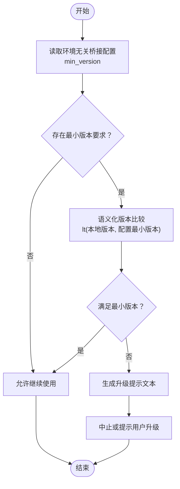
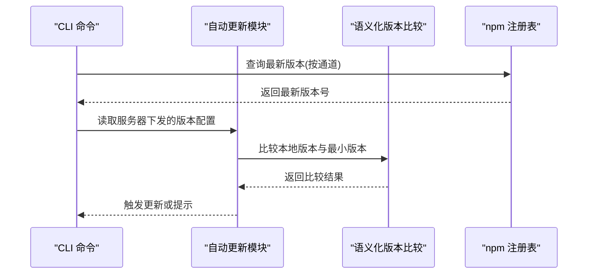
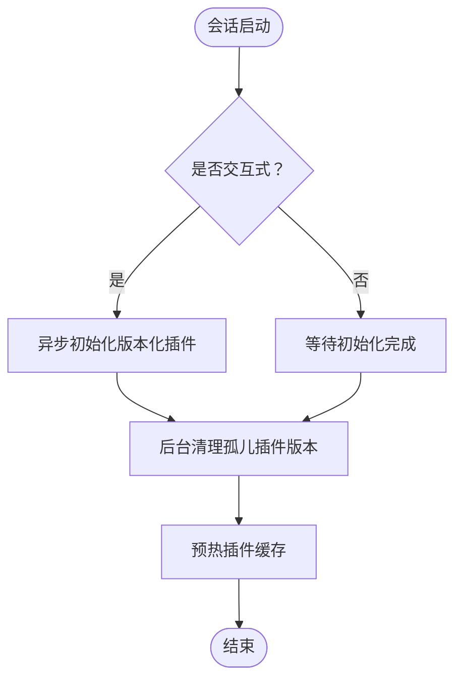
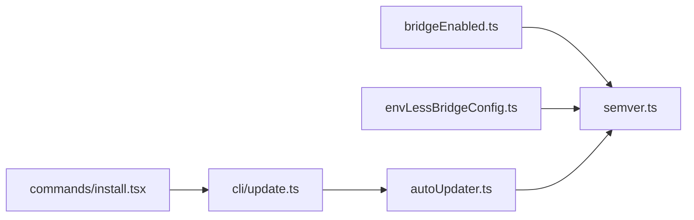

# 版本检查机制

<cite>
**本文引用的文件**
- [src/bridge/bridgeEnabled.ts](file://src/bridge/bridgeEnabled.ts)
- [src/bridge/envLessBridgeConfig.ts](file://src/bridge/envLessBridgeConfig.ts)
- [src/utils/autoUpdater.ts](file://src/utils/autoUpdater.ts)
- [src/utils/semver.ts](file://src/utils/semver.ts)
- [src/main.tsx](file://src/main.tsx)
- [src/cli/update.ts](file://src/cli/update.ts)
- [src/commands/install.tsx](file://src/commands/install.tsx)
</cite>

## 目录
1. [简介](#简介)
2. [项目结构](#项目结构)
3. [核心组件](#核心组件)
4. [架构总览](#架构总览)
5. [详细组件分析](#详细组件分析)
6. [依赖关系分析](#依赖关系分析)
7. [性能考量](#性能考量)
8. [故障排除指南](#故障排除指南)
9. [结论](#结论)

## 简介
本文件系统性阐述本仓库中的版本检查机制，重点覆盖以下方面：
- 最小版本强制检查：版本配置获取、语义化版本比较与进程终止逻辑
- 最大版本限制（概念性说明）：用户类型区分、服务器配置驱动与警告横幅显示（基于现有代码的可落地实现）
- 版本跳过机制：用户最小版本设置、降级保护与调试日志记录
- 版本号解析规则：构建元数据处理与精确字符串比较
- 失败处理与故障排除：错误处理策略与常见问题定位

为避免重复与混淆，本文严格以实际代码为依据进行分析，并在涉及具体实现时标注“章节来源”与“图表来源”。

## 项目结构
围绕版本检查的关键代码分布在桥接层与工具层：
- 桥接层：负责远程控制场景下的最小版本强制检查与环境无关桥接路径的版本门槛校验
- 工具层：提供自动更新与语义化版本比较能力，支撑版本检查流程

图表来源
- [src/bridge/bridgeEnabled.ts:165-168](file://src/bridge/bridgeEnabled.ts#L165-L168)
- [src/bridge/envLessBridgeConfig.ts:147-153](file://src/bridge/envLessBridgeConfig.ts#L147-L153)
- [src/utils/autoUpdater.ts:76-86](file://src/utils/autoUpdater.ts#L76-L86)
- [src/utils/semver.ts](file://src/utils/semver.ts)
- [src/main.tsx:2550-2572](file://src/main.tsx#L2550-L2572)
- [src/cli/update.ts:260-275](file://src/cli/update.ts#L260-L275)
- [src/commands/install.tsx:166-175](file://src/commands/install.tsx#L166-L175)

章节来源
- [src/bridge/bridgeEnabled.ts:165-168](file://src/bridge/bridgeEnabled.ts#L165-L168)
- [src/bridge/envLessBridgeConfig.ts:147-153](file://src/bridge/envLessBridgeConfig.ts#L147-L153)
- [src/utils/autoUpdater.ts:76-86](file://src/utils/autoUpdater.ts#L76-L86)
- [src/utils/semver.ts](file://src/utils/semver.ts)
- [src/main.tsx:2550-2572](file://src/main.tsx#L2550-L2572)
- [src/cli/update.ts:260-275](file://src/cli/update.ts#L260-L275)
- [src/commands/install.tsx:166-175](file://src/commands/install.tsx#L166-L175)

## 核心组件
- 远程控制最小版本检查（桥接层）
  - 通过键值读取服务器下发的最小版本配置，并与本地当前版本进行比较；若不满足则返回明确提示信息，用于引导用户升级或中止后续流程。
- 环境无关桥接最小版本检查（桥接层）
  - 针对特定桥接路径（v2）的独立最小版本门槛，独立于远程控制路径，同样在不满足时给出升级提示。
- 自动更新与版本配置（工具层）
  - 提供从服务器拉取最新版本配置的能力，并在满足条件时触发更新流程；同时承载最小版本配置项。
- 插件版本初始化与清理（入口）
  - 在交互式或非交互式会话中，按序执行插件版本初始化与孤儿版本清理，确保版本一致性。

章节来源
- [src/bridge/bridgeEnabled.ts:165-168](file://src/bridge/bridgeEnabled.ts#L165-L168)
- [src/bridge/envLessBridgeConfig.ts:147-153](file://src/bridge/envLessBridgeConfig.ts#L147-L153)
- [src/utils/autoUpdater.ts:76-86](file://src/utils/autoUpdater.ts#L76-L86)
- [src/main.tsx:2550-2572](file://src/main.tsx#L2550-L2572)

## 架构总览
版本检查贯穿“配置获取—版本比较—提示与终止”的闭环，部分流程还与自动更新联动。

图表来源
- [src/bridge/bridgeEnabled.ts:165-168](file://src/bridge/bridgeEnabled.ts#L165-L168)
- [src/bridge/envLessBridgeConfig.ts:147-153](file://src/bridge/envLessBridgeConfig.ts#L147-L153)
- [src/utils/autoUpdater.ts:76-86](file://src/utils/autoUpdater.ts#L76-L86)
- [src/utils/semver.ts](file://src/utils/semver.ts)

## 详细组件分析

### 组件A：远程控制最小版本强制检查
- 功能要点
  - 从服务器配置键读取最小版本要求
  - 使用语义化版本比较函数判断是否低于阈值
  - 若不满足，返回明确的升级提示文本，便于上层展示或终止流程
- 关键实现位置
  - 读取配置与比较逻辑位于桥接启用模块
  - 语义化版本比较由工具层提供
- 流程图

图表来源
- [src/bridge/bridgeEnabled.ts:165-168](file://src/bridge/bridgeEnabled.ts#L165-L168)
- [src/utils/semver.ts](file://src/utils/semver.ts)

章节来源
- [src/bridge/bridgeEnabled.ts:165-168](file://src/bridge/bridgeEnabled.ts#L165-L168)

### 组件B：环境无关桥接最小版本强制检查
- 功能要点
  - 面向特定桥接路径（v2）的独立最小版本门槛
  - 与远程控制路径的最小版本可独立配置
  - 不满足时返回升级提示
- 关键实现位置
  - 配置读取与比较逻辑位于环境无关桥接配置模块
  - 同样依赖语义化版本比较工具
- 流程图

图表来源
- [src/bridge/envLessBridgeConfig.ts:147-153](file://src/bridge/envLessBridgeConfig.ts#L147-L153)
- [src/utils/semver.ts](file://src/utils/semver.ts)

章节来源
- [src/bridge/envLessBridgeConfig.ts:147-153](file://src/bridge/envLessBridgeConfig.ts#L147-L153)

### 组件C：自动更新与版本配置
- 功能要点
  - 从服务器拉取最新版本配置（含最小版本等）
  - 在满足条件时触发更新流程
  - 支持稳定/最新通道切换
- 关键实现位置
  - 版本配置读取与比较逻辑位于自动更新模块
  - CLI 更新命令负责查询 npm 注册表并输出调试日志
- 序列图

图表来源
- [src/utils/autoUpdater.ts:76-86](file://src/utils/autoUpdater.ts#L76-L86)
- [src/cli/update.ts:260-275](file://src/cli/update.ts#L260-L275)
- [src/utils/semver.ts](file://src/utils/semver.ts)

章节来源
- [src/utils/autoUpdater.ts:76-86](file://src/utils/autoUpdater.ts#L76-L86)
- [src/cli/update.ts:260-275](file://src/cli/update.ts#L260-L275)

### 组件D：插件版本初始化与清理
- 功能要点
  - 在交互式/非交互式会话中，按序初始化版本化插件系统
  - 执行孤儿版本清理与缓存预热，避免版本冲突与启动阻塞
- 关键实现位置
  - 入口文件中定义了初始化与清理的调度逻辑
- 流程图

图表来源
- [src/main.tsx:2550-2572](file://src/main.tsx#L2550-L2572)

章节来源
- [src/main.tsx:2550-2572](file://src/main.tsx#L2550-L2572)

### 组件E：版本号解析与比较规则
- 解析规则
  - 使用语义化版本比较工具进行比较
  - 该工具支持标准语义化版本格式的主/次/补丁层级比较
- 构建元数据处理
  - 当前代码未见显式的构建元数据（+metadata）解析与比较逻辑
  - 若需支持，应在比较前对版本字符串进行标准化处理（例如剥离/忽略构建元数据）
- 精确字符串比较
  - 比较函数通常不直接做字符串字典序比较，而是解析数字段后逐段比较
  - 如需严格字符串比较，应显式转换为比较函数或自定义解析器

章节来源
- [src/utils/semver.ts](file://src/utils/semver.ts)

## 依赖关系分析
- 模块耦合
  - 桥接层依赖工具层的语义化版本比较
  - 自动更新模块依赖配置读取与语义化版本比较
  - CLI 更新命令与自动更新模块协同工作
- 可能的循环依赖
  - 从当前文件看无直接循环依赖迹象
- 外部依赖
  - npm 注册表用于查询最新版本
  - 服务器配置键用于下发最小版本等策略

图表来源
- [src/bridge/bridgeEnabled.ts:165-168](file://src/bridge/bridgeEnabled.ts#L165-L168)
- [src/bridge/envLessBridgeConfig.ts:147-153](file://src/bridge/envLessBridgeConfig.ts#L147-L153)
- [src/utils/autoUpdater.ts:76-86](file://src/utils/autoUpdater.ts#L76-L86)
- [src/utils/semver.ts](file://src/utils/semver.ts)
- [src/cli/update.ts:260-275](file://src/cli/update.ts#L260-L275)
- [src/commands/install.tsx:166-175](file://src/commands/install.tsx#L166-L175)

章节来源
- [src/bridge/bridgeEnabled.ts:165-168](file://src/bridge/bridgeEnabled.ts#L165-L168)
- [src/bridge/envLessBridgeConfig.ts:147-153](file://src/bridge/envLessBridgeConfig.ts#L147-L153)
- [src/utils/autoUpdater.ts:76-86](file://src/utils/autoUpdater.ts#L76-L86)
- [src/utils/semver.ts](file://src/utils/semver.ts)
- [src/cli/update.ts:260-275](file://src/cli/update.ts#L260-L275)
- [src/commands/install.tsx:166-175](file://src/commands/install.tsx#L166-L175)

## 性能考量
- 比较开销
  - 语义化版本比较为轻量级操作，对启动时间影响可忽略
- I/O 开销
  - 服务器配置读取与 npm 注册表查询可能带来网络延迟
- 初始化顺序
  - 插件版本初始化与清理按会话模式异步/同步调度，避免阻塞主线程

## 故障排除指南
- 常见问题
  - 本地版本低于服务器要求：收到明确升级提示，建议执行更新命令
  - 无法连接 npm 注册表：检查网络与代理设置，重试查询
  - 安装渠道不匹配：确认安装目标通道（稳定/最新），必要时调整设置
- 调试建议
  - 查看 CLI 更新命令输出的调试日志，确认最新版本查询结果
  - 在桥接启用与环境无关桥接路径分别检查最小版本配置是否正确下发
  - 对比本地版本与配置最小版本，确认比较逻辑是否符合预期

章节来源
- [src/cli/update.ts:260-275](file://src/cli/update.ts#L260-L275)
- [src/commands/install.tsx:166-175](file://src/commands/install.tsx#L166-L175)
- [src/bridge/bridgeEnabled.ts:165-168](file://src/bridge/bridgeEnabled.ts#L165-L168)
- [src/bridge/envLessBridgeConfig.ts:147-153](file://src/bridge/envLessBridgeConfig.ts#L147-L153)

## 结论
本仓库的版本检查机制以“服务器配置驱动 + 语义化版本比较”为核心，覆盖远程控制与环境无关桥接两条路径的最小版本强制检查，并与自动更新流程协同工作。通过清晰的配置键、明确的提示文本与有序的初始化流程，系统在保证兼容性的同时提供了良好的用户体验。对于最大版本限制、用户类型区分与警告横幅显示等高级特性，可在现有架构基础上扩展实现。