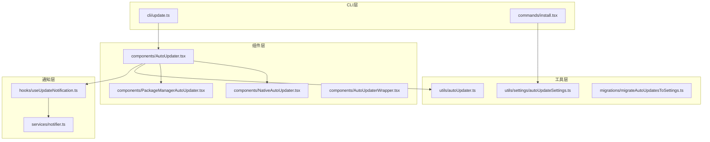
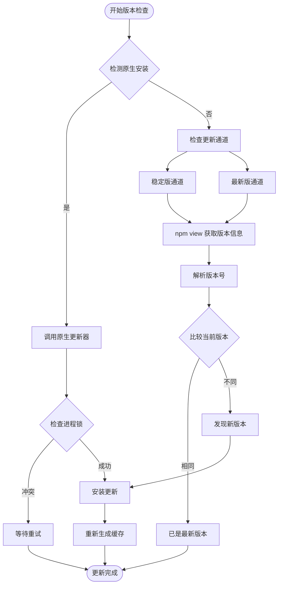
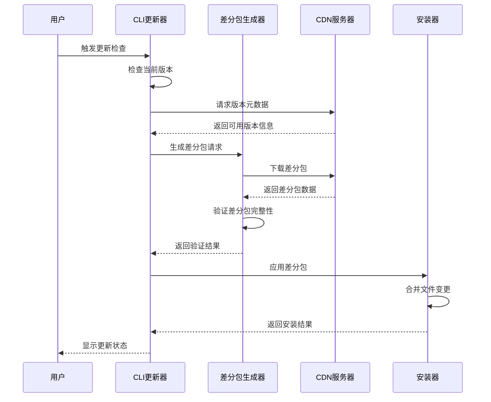
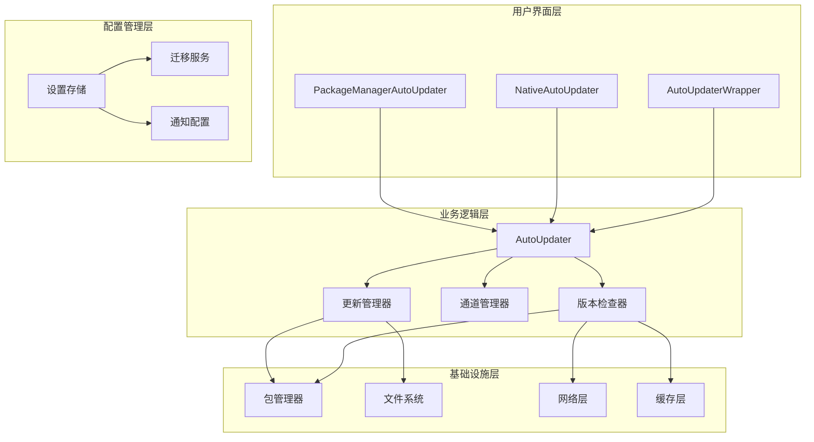
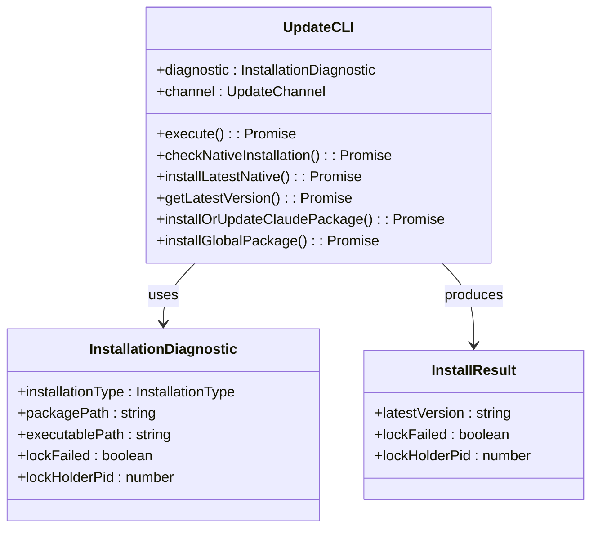
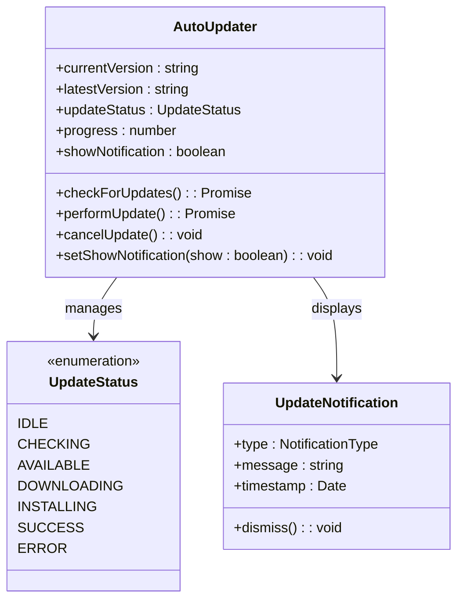
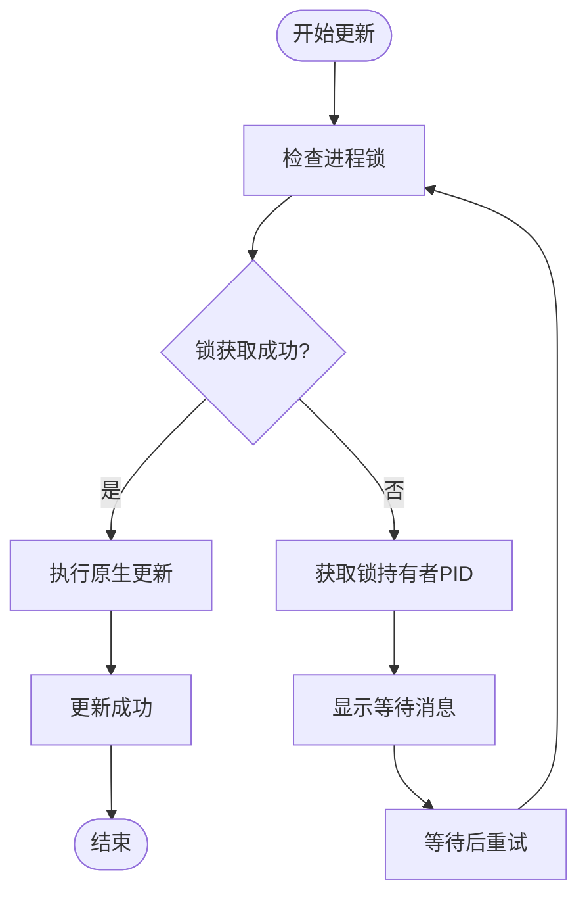
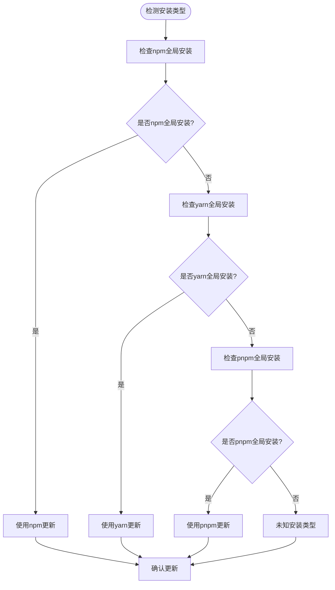
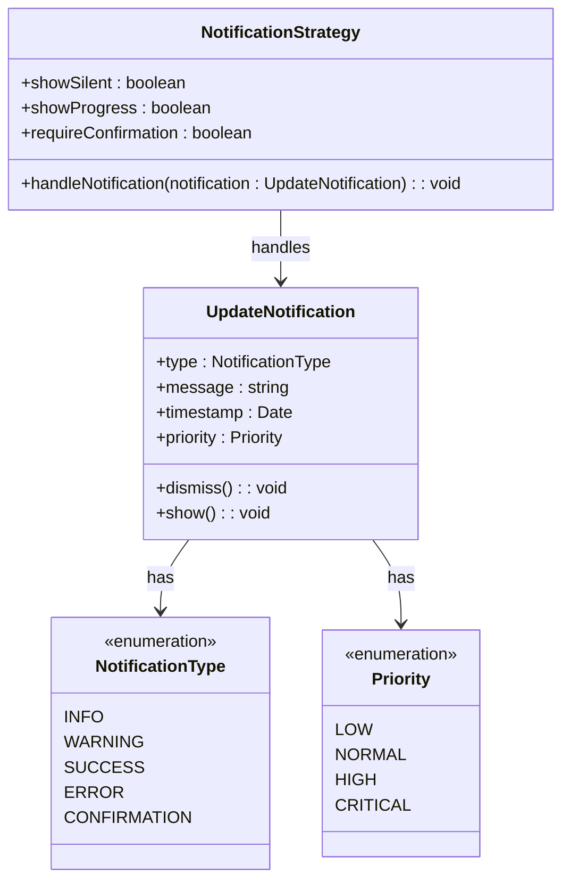
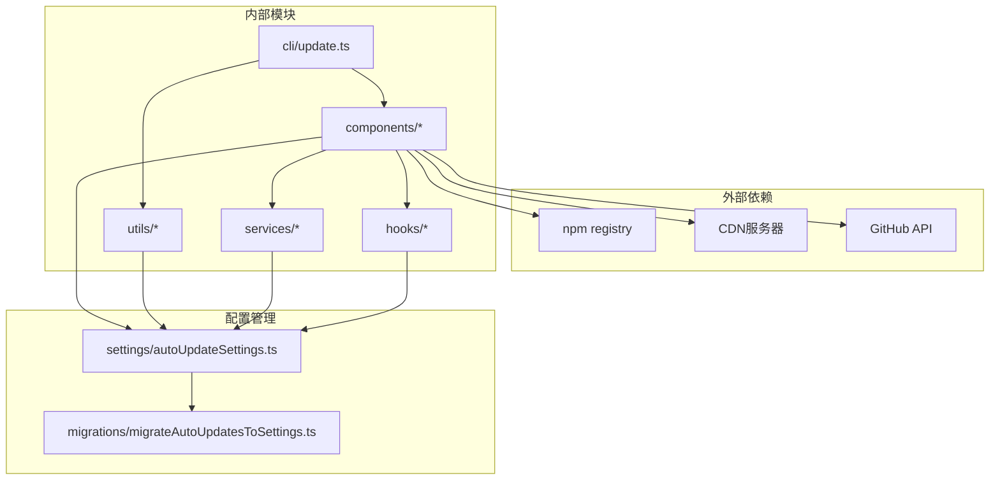

# 自动更新系统

<cite>
**本文档引用的文件**
- [src/cli/update.ts](file://src/cli/update.ts)
- [src/components/AutoUpdater.tsx](file://src/components/AutoUpdater.tsx)
- [src/components/AutoUpdaterWrapper.tsx](file://src/components/AutoUpdaterWrapper.tsx)
- [src/components/NativeAutoUpdater.tsx](file://src/components/NativeAutoUpdater.tsx)
- [src/components/PackageManagerAutoUpdater.tsx](file://src/components/PackageManagerAutoUpdater.tsx)
- [src/commands/install.tsx](file://src/commands/install.tsx)
- [src/utils/autoUpdater.ts](file://src/utils/autoUpdater.ts)
- [src/hooks/useUpdateNotification.ts](file://src/hooks/useUpdateNotification.ts)
- [src/services/notifier.ts](file://src/services/notifier.ts)
- [src/utils/settings/autoUpdateSettings.ts](file://src/utils/settings/autoUpdateSettings.ts)
- [src/migrations/migrateAutoUpdatesToSettings.ts](file://src/migrations/migrateAutoUpdatesToSettings.ts)
</cite>

## 目录
1. [简介](#简介)
2. [项目结构](#项目结构)
3. [核心组件](#核心组件)
4. [架构概览](#架构概览)
5. [详细组件分析](#详细组件分析)
6. [依赖关系分析](#依赖关系分析)
7. [性能考虑](#性能考虑)
8. [故障排除指南](#故障排除指南)
9. [结论](#结论)

## 简介

自动更新系统是 Claude Code 开发平台的核心功能之一，负责确保用户始终使用最新版本的应用程序。该系统支持多种更新渠道（稳定版和测试版）、多种安装方法（本地和全局），并提供了完整的版本管理、增量更新和回滚机制。

系统的主要特点包括：
- 多渠道版本管理：支持稳定版(stable)和最新版(latest)两种更新通道
- 智能安装检测：自动识别当前安装类型并选择合适的更新策略
- 增量更新支持：通过差分包实现高效的版本升级
- 完整的回滚机制：支持版本切换和状态恢复
- 用户友好的通知系统：提供静默更新和交互式确认模式

## 项目结构

自动更新系统在代码库中的组织结构如下：



**图表来源**
- [src/cli/update.ts](file://src/cli/update.ts)
- [src/components/AutoUpdater.tsx](file://src/components/AutoUpdater.tsx)
- [src/components/NativeAutoUpdater.tsx](file://src/components/NativeAutoUpdater.tsx)
- [src/components/PackageManagerAutoUpdater.tsx](file://src/components/PackageManagerAutoUpdater.tsx)

**章节来源**
- [src/cli/update.ts](file://src/cli/update.ts)
- [src/components/AutoUpdater.tsx](file://src/components/AutoUpdater.tsx)
- [src/components/NativeAutoUpdater.tsx](file://src/components/NativeAutoUpdater.tsx)
- [src/components/PackageManagerAutoUpdater.tsx](file://src/components/PackageManagerAutoUpdater.tsx)

## 核心组件

### 版本检查机制

版本检查系统采用多层检测策略，确保准确识别可用的更新版本：



**图表来源**
- [src/cli/update.ts](file://src/cli/update.ts)

### 更新通道管理

系统支持两种主要的更新通道，每种通道都有特定的版本解析规则：

| 通道类型 | NPM标签 | 版本解析规则 | 兼容性要求 |
|---------|--------|-------------|-----------|
| 稳定版(stable) | `stable` | 使用 `npm view @anthropic-ai/claude-code@stable version` | 需要语义化版本兼容性 |
| 最新版(latest) | `latest` | 使用 `npm view @anthropic-ai/claude-code@latest version` | 支持预发布版本 |

### 增量更新实现

增量更新通过以下步骤实现高效版本升级：



**图表来源**
- [src/cli/update.ts](file://src/cli/update.ts)

**章节来源**
- [src/cli/update.ts](file://src/cli/update.ts)

## 架构概览

自动更新系统采用分层架构设计，确保各组件职责清晰且可扩展：



**图表来源**
- [src/components/AutoUpdater.tsx](file://src/components/AutoUpdater.tsx)
- [src/components/AutoUpdaterWrapper.tsx](file://src/components/AutoUpdaterWrapper.tsx)
- [src/components/NativeAutoUpdater.tsx](file://src/components/NativeAutoUpdater.tsx)
- [src/components/PackageManagerAutoUpdater.tsx](file://src/components/PackageManagerAutoUpdater.tsx)

## 详细组件分析

### CLI更新器 (cli/update.ts)

CLI更新器是系统的核心执行组件，负责协调整个更新流程：

#### 主要功能特性

1. **智能安装检测**：自动识别当前安装类型（本地或全局）
2. **原生更新支持**：优先使用原生安装器进行更新
3. **错误处理**：完善的错误捕获和用户反馈机制
4. **进程锁管理**：避免多个实例同时更新

#### 关键实现模式



**图表来源**
- [src/cli/update.ts](file://src/cli/update.ts)

**章节来源**
- [src/cli/update.ts](file://src/cli/update.ts)

### 自动更新组件 (components/AutoUpdater.tsx)

主更新组件提供了统一的用户界面和状态管理：

#### 组件架构



**图表来源**
- [src/components/AutoUpdater.tsx](file://src/components/AutoUpdater.tsx)

#### 更新状态管理

组件维护了完整的更新生命周期状态：

| 状态 | 描述 | 用户交互 |
|------|------|----------|
| 空闲(IDLE) | 系统就绪，等待检查更新 | 显示检查按钮 |
| 检查中(CHECKING) | 正在连接服务器检查更新 | 显示加载指示器 |
| 可用(AVAILABLE) | 发现新版本，等待用户确认 | 显示更新详情和确认按钮 |
| 下载中(DOWNLOADING) | 正在下载更新包 | 显示下载进度 |
| 安装中(INSTALLING) | 正在应用更新 | 显示安装进度 |
| 成功(SUCCESS) | 更新完成 | 显示成功消息和重启提示 |
| 错误(ERROR) | 更新失败 | 显示错误详情和重试选项 |

**章节来源**
- [src/components/AutoUpdater.tsx](file://src/components/AutoUpdater.tsx)

### 原生更新器 (components/NativeAutoUpdater.tsx)

原生更新器专门处理原生安装类型的更新：

#### 核心特性

1. **进程锁检测**：防止多个更新进程同时运行
2. **原生安装支持**：直接调用原生安装器
3. **错误优雅降级**：当原生更新失败时自动回退到JS方案

#### 进程锁机制



**图表来源**
- [src/components/NativeAutoUpdater.tsx](file://src/components/NativeAutoUpdater.tsx)

**章节来源**
- [src/components/NativeAutoUpdater.tsx](file://src/components/NativeAutoUpdater.tsx)

### 包管理器更新器 (components/PackageManagerAutoUpdater.tsx)

包管理器更新器支持通过npm和yarn等包管理器进行更新：

#### 支持的包管理器

| 包管理器 | 命令 | 特性 |
|----------|------|------|
| npm | `npm install -g @anthropic-ai/claude-code@version` | 最广泛支持，自动依赖解析 |
| yarn | `yarn global add @anthropic-ai/claude-code@version` | 依赖锁定，更快安装 |
| pnpm | `pnpm add -g @anthropic-ai/claude-code@version` | 更节省磁盘空间，快速安装 |

#### 安装方法检测

组件能够自动检测当前的安装类型并选择相应的更新策略：



**图表来源**
- [src/components/PackageManagerAutoUpdater.tsx](file://src/components/PackageManagerAutoUpdater.tsx)

**章节来源**
- [src/components/PackageManagerAutoUpdater.tsx](file://src/components/PackageManagerAutoUpdater.tsx)

### 更新通知系统

更新通知系统提供了多种通知方式和用户交互模式：

#### 通知类型



**图表来源**
- [src/hooks/useUpdateNotification.ts](file://src/hooks/useUpdateNotification.ts)
- [src/services/notifier.ts](file://src/services/notifier.ts)

#### 通知策略

| 策略类型 | 特征 | 适用场景 |
|----------|------|----------|
| 静默更新 | 不显示用户界面，后台自动更新 | 稳定版本，低风险更新 |
| 进度显示 | 显示下载和安装进度 | 较大更新包 |
| 用户确认 | 要求用户明确同意更新 | 重大功能更新或潜在兼容性问题 |
| 错误通知 | 详细显示错误信息和解决方案 | 更新失败时 |

**章节来源**
- [src/hooks/useUpdateNotification.ts](file://src/hooks/useUpdateNotification.ts)
- [src/services/notifier.ts](file://src/services/notifier.ts)

## 依赖关系分析

自动更新系统的依赖关系体现了清晰的关注点分离：



**图表来源**
- [src/cli/update.ts](file://src/cli/update.ts)
- [src/components/AutoUpdater.tsx](file://src/components/AutoUpdater.tsx)
- [src/utils/autoUpdater.ts](file://src/utils/autoUpdater.ts)
- [src/utils/settings/autoUpdateSettings.ts](file://src/utils/settings/autoUpdateSettings.ts)

### 核心依赖链

系统的关键依赖关系如下：

1. **CLI层** → **组件层**：CLI更新器驱动所有用户界面组件
2. **组件层** → **工具层**：UI组件依赖各种工具函数和实用程序
3. **组件层** → **服务层**：更新组件依赖通知和服务接口
4. **配置层** → **迁移层**：设置配置通过迁移服务保持向后兼容

**章节来源**
- [src/utils/autoUpdater.ts](file://src/utils/autoUpdater.ts)
- [src/utils/settings/autoUpdateSettings.ts](file://src/utils/settings/autoUpdateSettings.ts)
- [src/migrations/migrateAutoUpdatesToSettings.ts](file://src/migrations/migrateAutoUpdatesToSettings.ts)

## 性能考虑

自动更新系统在设计时充分考虑了性能优化：

### 版本检查优化

- **缓存策略**：版本信息缓存默认2小时，减少不必要的网络请求
- **并发控制**：限制同时进行的更新检查数量，避免资源竞争
- **智能重试**：指数退避算法配合随机抖动，避免雪崩效应

### 更新下载优化

- **断点续传**：支持大文件的断点续传，提高网络不稳定环境下的成功率
- **并行下载**：差分包的并行下载策略，充分利用带宽资源
- **压缩传输**：使用gzip压缩减少传输数据量

### 内存和CPU优化

- **流式处理**：大文件下载采用流式处理，避免内存峰值
- **异步操作**：所有网络操作都是异步的，不阻塞主线程
- **垃圾回收**：及时清理临时文件和缓存数据

## 故障排除指南

### 常见问题及解决方案

#### 更新检查失败

**症状**：版本检查超时或返回错误

**可能原因**：
1. 网络连接问题
2. NPM注册表访问受限
3. 防火墙或代理配置问题

**解决步骤**：
1. 检查网络连接状态
2. 尝试使用 `npm ping` 测试连接
3. 配置适当的代理设置
4. 清理npm缓存：`npm cache clean --force`

#### 进程锁冲突

**症状**：更新过程中显示"另一个Claude进程正在运行"

**解决步骤**：
1. 等待现有进程完成
2. 查找并终止相关进程
3. 手动删除锁文件
4. 重新启动应用程序

#### 权限不足错误

**症状**：全局更新失败，提示权限错误

**解决步骤**：
1. 使用管理员权限运行
2. 检查npm全局目录权限
3. 切换到本地安装模式
4. 修改npm全局目录位置

#### 版本解析错误

**症状**：无法正确解析版本号

**解决步骤**：
1. 检查NPM注册表状态
2. 验证包名称拼写
3. 尝试指定具体版本号
4. 清理NPM缓存

### 调试和诊断

#### 启用调试模式

```bash
# 设置调试环境变量
export CLAUDE_UPDATE_DEBUG=1
export DEBUG=claude:update*

# 运行更新命令
claude update
```

#### 日志分析

系统会生成详细的日志信息，包括：
- 版本检查过程的详细步骤
- 网络请求的响应时间
- 文件操作的执行结果
- 错误发生的具体位置

**章节来源**
- [src/cli/update.ts](file://src/cli/update.ts)

## 结论

自动更新系统通过精心设计的架构和实现，为用户提供了一个可靠、高效且用户友好的更新体验。系统的主要优势包括：

1. **多策略支持**：同时支持原生安装和包管理器安装，适应不同的使用场景
2. **智能检测**：自动识别安装类型和网络环境，选择最优的更新策略
3. **完整的生命周期管理**：从版本检查到安装完成的全流程自动化
4. **强大的错误处理**：完善的错误捕获和恢复机制
5. **灵活的通知系统**：支持多种通知方式和用户交互模式

未来可以进一步改进的方向包括：
- 增加更多包管理器的支持
- 实现更智能的增量更新算法
- 提供更详细的更新进度可视化
- 增强离线更新能力

该系统为Claude Code平台的持续演进提供了坚实的技术基础，确保用户能够及时获得最新的功能和修复。