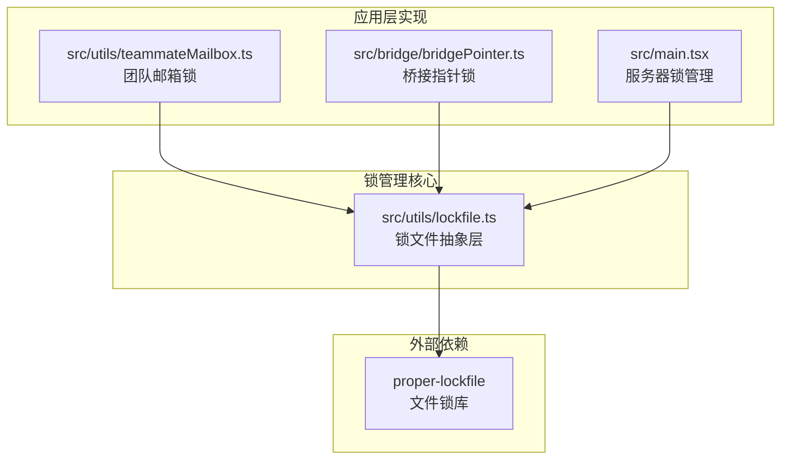
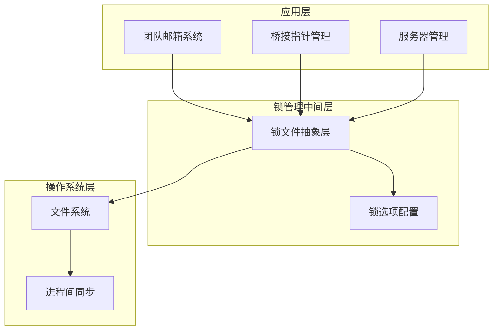
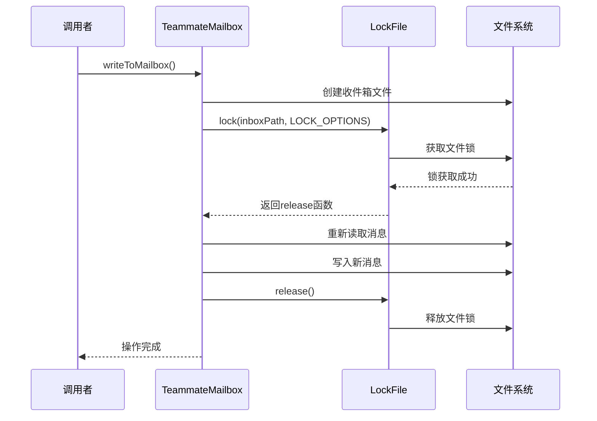
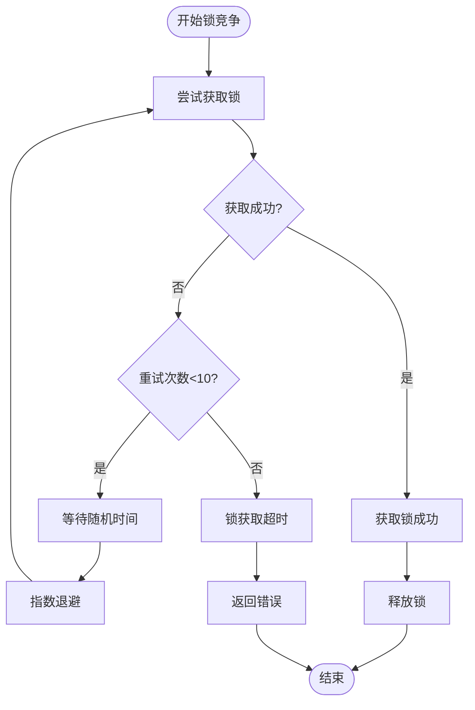
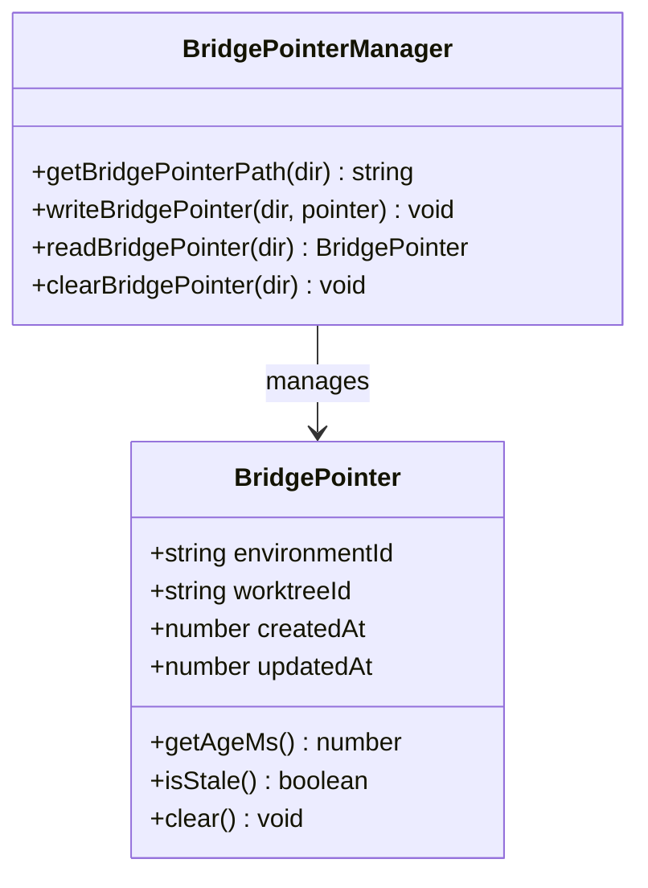
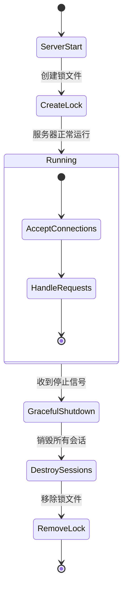
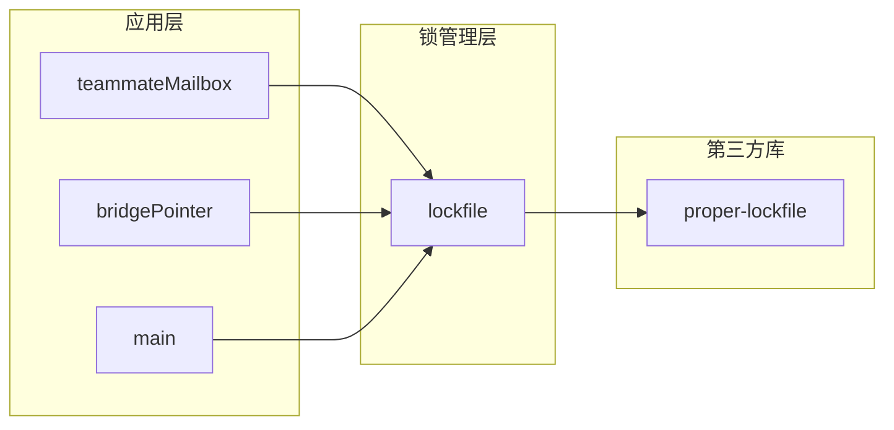

# 锁管理机制

<cite>
**本文档引用的文件**
- [src/utils/lockfile.ts](file://src/utils/lockfile.ts)
- [src/utils/teammateMailbox.ts](file://src/utils/teammateMailbox.ts)
- [src/bridge/bridgePointer.ts](file://src/bridge/bridgePointer.ts)
- [src/main.tsx](file://src/main.tsx)
- [src/cli/transports/ccrClient.ts](file://src/cli/transports/ccrClient.ts)
</cite>

## 目录
1. [简介](#简介)
2. [项目结构](#项目结构)
3. [核心组件](#核心组件)
4. [架构概览](#架构概览)
5. [详细组件分析](#详细组件分析)
6. [依赖关系分析](#依赖关系分析)
7. [性能考虑](#性能考虑)
8. [故障排除指南](#故障排除指南)
9. [结论](#结论)

## 简介

本文档详细介绍了Claude-Code项目中的锁管理机制，重点分析了并发更新锁的实现原理。该系统采用基于文件系统的锁机制，通过proper-lockfile库提供可靠的进程间同步能力，确保在多进程环境中对共享资源的安全访问。

锁管理机制主要应用于以下场景：
- 团队成员邮箱的并发写入保护
- 桥接指针文件的原子性操作
- 服务器锁的生命周期管理
- 进程间通信的同步控制

## 项目结构

锁管理机制在项目中的分布如下：

**图表来源**
- [src/utils/lockfile.ts:1-44](file://src/utils/lockfile.ts#L1-L44)
- [src/utils/teammateMailbox.ts:23-41](file://src/utils/teammateMailbox.ts#L23-L41)
- [src/bridge/bridgePointer.ts:52-210](file://src/bridge/bridgePointer.ts#L52-L210)

**章节来源**
- [src/utils/lockfile.ts:1-44](file://src/utils/lockfile.ts#L1-L44)
- [src/utils/teammateMailbox.ts:1-800](file://src/utils/teammateMailbox.ts#L1-L800)

## 核心组件

### 锁文件抽象层

锁文件抽象层提供了延迟加载的proper-lockfile封装，避免在启动时引入不必要的性能开销。

**关键特性：**
- 延迟初始化：仅在实际使用时才加载proper-lockfile
- 异步API：提供lock、unlock、check等异步方法
- 同步API：提供lockSync等同步方法用于特殊场景

### 团队邮箱锁实现

团队邮箱系统使用文件锁确保多个代理同时写入同一收件箱时的数据一致性。

**锁配置：**
- 最大重试次数：10次
- 最小等待时间：5毫秒
- 最大等待时间：100毫秒
- 自动退避机制：指数增长的等待间隔

**锁文件路径：**
- 主数据文件：`.claude/teams/{team_name}/inboxes/{agent_name}.json`
- 锁文件：`{inbox_path}.lock`

### 桥接指针锁

桥接指针文件用于跟踪工作树状态，包含4小时的TTL（生存时间）机制。

**TTL配置：**
- 默认TTL：4小时（14400000毫秒）
- 超时清理：过期文件自动删除
- 年龄计算：基于文件修改时间

### 服务器锁管理

主程序实现了服务器级别的锁管理，支持优雅关闭和进程间协调。

**关键功能：**
- 服务器启动时创建锁文件
- 接收SIGINT和SIGTERM信号进行优雅关闭
- 销毁所有会话后移除锁文件

**章节来源**
- [src/utils/lockfile.ts:26-44](file://src/utils/lockfile.ts#L26-L44)
- [src/utils/teammateMailbox.ts:31-41](file://src/utils/teammateMailbox.ts#L31-L41)
- [src/bridge/bridgePointer.ts:105-112](file://src/bridge/bridgePointer.ts#L105-L112)
- [src/main.tsx:4038](file://src/main.tsx#L4038)

## 架构概览

锁管理系统的整体架构采用分层设计，从底层的文件系统锁到上层的应用逻辑实现：

**图表来源**
- [src/utils/teammateMailbox.ts:134-192](file://src/utils/teammateMailbox.ts#L134-L192)
- [src/bridge/bridgePointer.ts:83-112](file://src/bridge/bridgePointer.ts#L83-L112)
- [src/main.tsx:4032-4040](file://src/main.tsx#L4032-L4040)

## 详细组件分析

### 团队邮箱锁实现

团队邮箱系统是锁管理机制的核心应用场景，实现了复杂的并发控制逻辑。

#### 锁获取流程

**图表来源**
- [src/utils/teammateMailbox.ts:134-192](file://src/utils/teammateMailbox.ts#L134-L192)
- [src/utils/lockfile.ts:26-31](file://src/utils/lockfile.ts#L26-L31)

#### 锁配置参数详解

| 参数名称 | 默认值 | 作用说明 |
|---------|--------|----------|
| retries.retries | 10 | 最大重试次数 |
| retries.minTimeout | 5 | 初始等待时间(毫秒) |
| retries.maxTimeout | 100 | 最大等待时间(毫秒) |
| lockfilePath | 自动生成 | 锁文件的完整路径 |

#### 锁超时机制

锁超时机制通过指数退避算法实现，避免过度竞争：

**图表来源**
- [src/utils/teammateMailbox.ts:31-41](file://src/utils/teammateMailbox.ts#L31-L41)

#### 锁释放逻辑

锁释放采用finally模式确保即使发生异常也能正确释放锁：

**异常处理策略：**
- 使用try-finally确保锁释放
- 处理锁可能已被其他进程释放的情况
- 记录锁释放过程中的异常信息

**章节来源**
- [src/utils/teammateMailbox.ts:134-192](file://src/utils/teammateMailbox.ts#L134-L192)
- [src/utils/teammateMailbox.ts:184-192](file://src/utils/teammateMailbox.ts#L184-L192)

### 桥接指针锁实现

桥接指针系统实现了基于TTL的过期清理机制，防止长时间占用导致的资源泄漏。

#### 指针文件管理

**图表来源**
- [src/bridge/bridgePointer.ts:52-210](file://src/bridge/bridgePointer.ts#L52-L210)

#### TTL清理机制

桥接指针的TTL机制提供了自动清理功能：

**TTL配置：**
- 4小时（14400000毫秒）的生存时间
- 基于文件修改时间的年龄计算
- 自动删除过期的指针文件

**清理流程：**
1. 读取文件修改时间
2. 计算当前年龄
3. 比较与TTL阈值
4. 删除过期文件或返回null

**章节来源**
- [src/bridge/bridgePointer.ts:76-112](file://src/bridge/bridgePointer.ts#L76-L112)
- [src/bridge/bridgePointer.ts:186-202](file://src/bridge/bridgePointer.ts#L186-L202)

### 服务器锁管理

服务器级别的锁管理确保了单实例运行的约束，防止多个服务器实例同时运行。

#### 锁文件生命周期

**图表来源**
- [src/main.tsx:4032-4040](file://src/main.tsx#L4032-L4040)

#### 信号处理机制

服务器实现了完整的信号处理机制：

**支持的信号：**
- SIGINT：优雅关闭（Ctrl+C）
- SIGTERM：终止信号

**关闭流程：**
1. 设置关闭标志
2. 停止接受新连接
3. 销毁所有活动会话
4. 移除服务器锁
5. 正常退出进程

**章节来源**
- [src/main.tsx:4032-4040](file://src/main.tsx#L4032-L4040)

## 依赖关系分析

锁管理机制的依赖关系相对简单，主要依赖于proper-lockfile库：

**图表来源**
- [src/utils/lockfile.ts:12-24](file://src/utils/lockfile.ts#L12-L24)

**章节来源**
- [src/utils/lockfile.ts:12-24](file://src/utils/lockfile.ts#L12-L24)

## 性能考虑

锁管理机制在设计时充分考虑了性能影响：

### 启动时延优化

锁文件抽象层采用了延迟加载策略，避免在应用启动时引入额外的性能开销。

**优化措施：**
- 首次使用时才加载proper-lockfile
- 避免静态导入导致的启动时延
- 在不需要锁功能时不影响启动性能

### 竞争条件防护

系统通过多种机制防止竞态条件的发生：

**TOCTOU防护：**
- 桥接指针系统直接操作文件而不进行存在性检查
- 使用TTL机制自动清理过期文件
- 避免了检查-使用模式的竞态条件

**锁竞争优化：**
- 指数退避算法减少锁竞争
- 最大重试次数限制避免无限等待
- 自动抖动机制分散锁请求

### 内存和CPU效率

锁管理机制尽量减少了内存和CPU的使用：

**资源使用：**
- 锁文件仅在需要时创建
- 异步操作避免阻塞事件循环
- 及时释放锁资源

## 故障排除指南

### 常见问题及解决方案

#### 锁获取失败

**症状：** 应用程序无法获取文件锁，操作失败

**可能原因：**
- 锁文件被其他进程持有
- 文件权限不足
- 磁盘空间不足

**解决步骤：**
1. 检查是否存在其他持有锁的进程
2. 验证文件权限设置
3. 清理磁盘空间
4. 查看锁文件是否需要手动清理

#### 锁超时问题

**症状：** 锁操作长时间无响应

**诊断方法：**
1. 检查系统负载情况
2. 分析锁竞争频率
3. 监控文件系统性能

**优化建议：**
1. 减少同时进行的锁操作
2. 调整重试参数
3. 检查是否有死锁情况

#### TTL清理异常

**症状：** 过期的桥接指针文件未被清理

**排查步骤：**
1. 验证TTL阈值设置
2. 检查文件修改时间
3. 确认清理逻辑执行

**解决方案：**
1. 手动删除过期文件
2. 检查系统时间设置
3. 验证文件系统支持

### 日志分析

系统提供了详细的调试日志，有助于问题诊断：

**关键日志点：**
- 锁获取开始和结束
- 锁释放操作
- 错误和异常情况
- TTL清理通知

**章节来源**
- [src/utils/teammateMailbox.ts:184-192](file://src/utils/teammateMailbox.ts#L184-L192)
- [src/bridge/bridgePointer.ts:98-112](file://src/bridge/bridgePointer.ts#L98-L112)

## 结论

Claude-Code项目的锁管理机制通过合理的架构设计和实现细节，为多进程环境下的并发控制提供了可靠的基础。系统的主要优势包括：

**设计优势：**
- 延迟加载避免启动时延
- 完善的异常处理机制
- 自动化的资源清理
- 灵活的配置选项

**适用场景：**
- 多代理协作系统
- 文件系统级的并发控制
- 服务器级别的进程协调

**改进建议：**
- 可以考虑添加锁监控和统计功能
- 增加更多详细的错误诊断信息
- 提供锁冲突的可视化工具

该锁管理机制为整个系统的稳定性和可靠性提供了重要保障，是项目架构中不可或缺的重要组成部分。