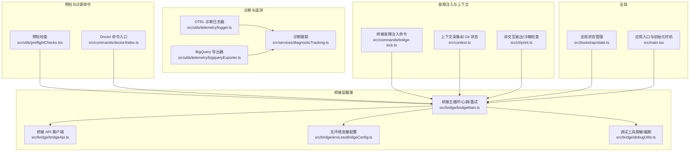
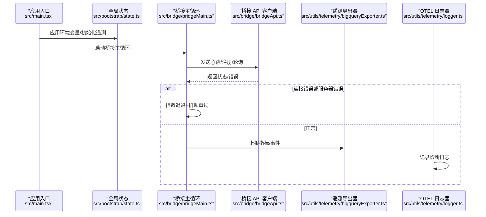
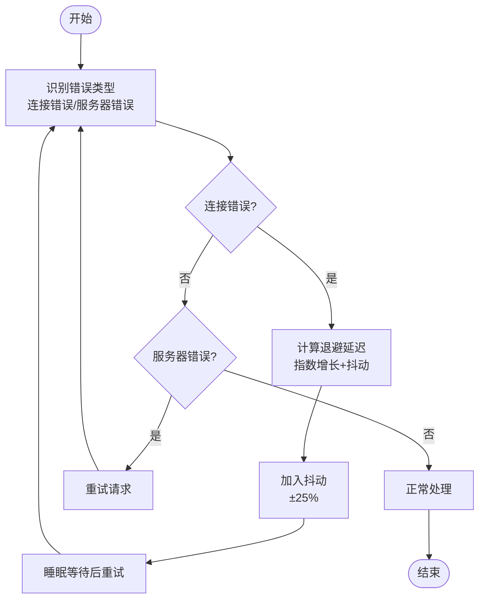
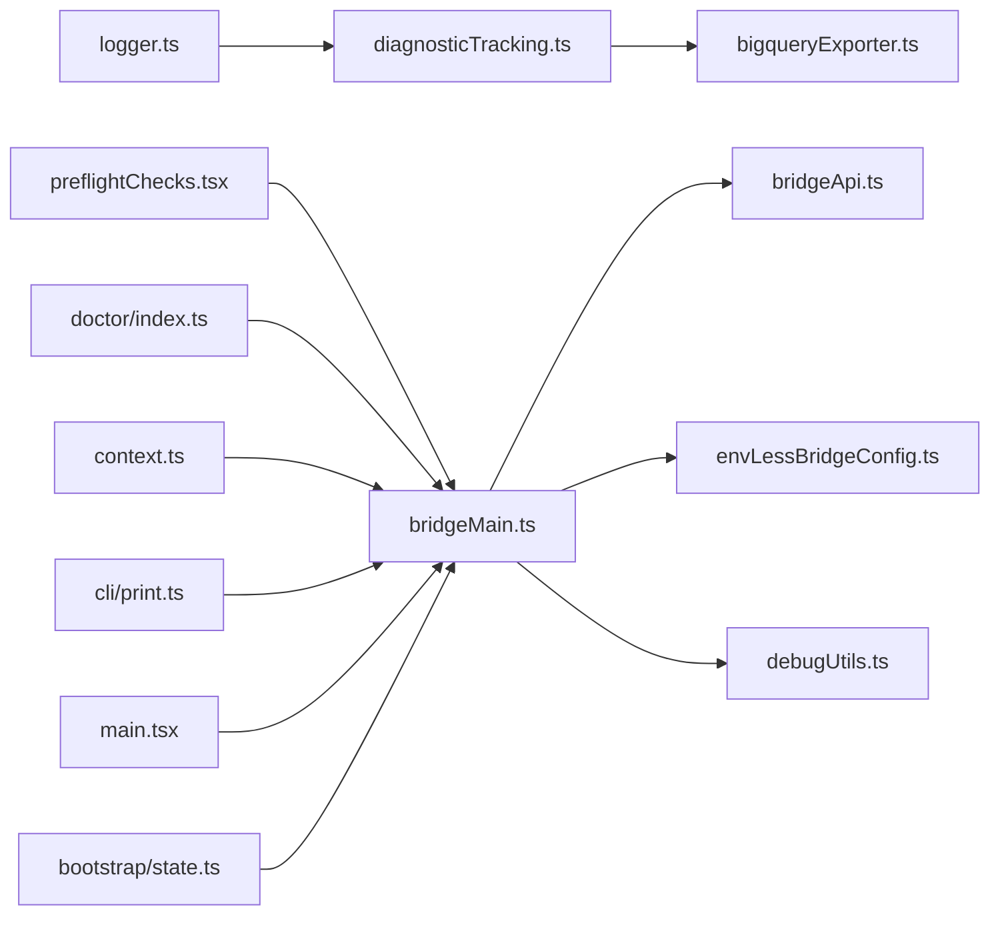

# 健康检查

<cite>
**本文引用的文件**
- [src/services/diagnosticTracking.ts](file://src/services/diagnosticTracking.ts)
- [src/utils/preflightChecks.tsx](file://src/utils/preflightChecks.tsx)
- [src/commands/doctor/index.ts](file://src/commands/doctor/index.ts)
- [src/bridge/bridgeMain.ts](file://src/bridge/bridgeMain.ts)
- [src/bridge/bridgeApi.ts](file://src/bridge/bridgeApi.ts)
- [src/bridge/envLessBridgeConfig.ts](file://src/bridge/envLessBridgeConfig.ts)
- [src/bridge/debugUtils.ts](file://src/bridge/debugUtils.ts)
- [src/commands/bridge-kick.ts](file://src/commands/bridge-kick.ts)
- [src/context.ts](file://src/context.ts)
- [src/cli/print.ts](file://src/cli/print.ts)
- [src/utils/telemetry/logger.ts](file://src/utils/telemetry/logger.ts)
- [src/utils/telemetry/bigqueryExporter.ts](file://src/utils/telemetry/bigqueryExporter.ts)
- [src/bootstrap/state.ts](file://src/bootstrap/state.ts)
- [src/main.tsx](file://src/main.tsx)
</cite>

## 目录
1. [简介](#简介)
2. [项目结构](#项目结构)
3. [核心组件](#核心组件)
4. [架构总览](#架构总览)
5. [组件详解](#组件详解)
6. [依赖关系分析](#依赖关系分析)
7. [性能考量](#性能考量)
8. [故障排查指南](#故障排查指南)
9. [结论](#结论)
10. [附录](#附录)

## 简介
本文件系统化梳理代码库中的“健康检查与诊断跟踪”体系，涵盖以下主题：
- 服务状态监控：核心服务运行状态检测、依赖服务连通性测试、资源使用情况监控
- 诊断跟踪配置：健康检查的触发条件、检查频率设置、失败重试机制
- 预检检查：启动前的环境验证、配置检查、服务可用性确认
- 结果处理：状态报告生成、异常通知、自动修复建议
- 自定义扩展：如何新增健康检查项与最佳实践

该体系以桥接层（Bridge）为核心，围绕心跳、连接错误识别、指数退避与抖动、以及诊断日志与遥测导出形成闭环。

## 项目结构
与健康检查直接相关的模块主要分布在以下位置：
- 诊断跟踪与日志：src/services/diagnosticTracking.ts、src/utils/telemetry/logger.ts、src/utils/telemetry/bigqueryExporter.ts
- 预检检查：src/utils/preflightChecks.tsx、src/commands/doctor/index.ts
- 桥接层健康与重试：src/bridge/bridgeMain.ts、src/bridge/bridgeApi.ts、src/bridge/envLessBridgeConfig.ts、src/bridge/debugUtils.ts
- 故障注入与诊断：src/commands/bridge-kick.ts
- 上下文与打印：src/context.ts、src/cli/print.ts
- 全局状态与初始化：src/bootstrap/state.ts、src/main.tsx

图表来源
- [src/services/diagnosticTracking.ts](file://src/services/diagnosticTracking.ts)
- [src/utils/telemetry/logger.ts](file://src/utils/telemetry/logger.ts)
- [src/utils/telemetry/bigqueryExporter.ts](file://src/utils/telemetry/bigqueryExporter.ts)
- [src/utils/preflightChecks.tsx](file://src/utils/preflightChecks.tsx)
- [src/commands/doctor/index.ts](file://src/commands/doctor/index.ts)
- [src/bridge/bridgeMain.ts](file://src/bridge/bridgeMain.ts)
- [src/bridge/bridgeApi.ts](file://src/bridge/bridgeApi.ts)
- [src/bridge/envLessBridgeConfig.ts](file://src/bridge/envLessBridgeConfig.ts)
- [src/bridge/debugUtils.ts](file://src/bridge/debugUtils.ts)
- [src/commands/bridge-kick.ts](file://src/commands/bridge-kick.ts)
- [src/context.ts](file://src/context.ts)
- [src/cli/print.ts](file://src/cli/print.ts)
- [src/bootstrap/state.ts](file://src/bootstrap/state.ts)
- [src/main.tsx](file://src/main.tsx)

章节来源
- [src/services/diagnosticTracking.ts](file://src/services/diagnosticTracking.ts)
- [src/utils/preflightChecks.tsx](file://src/utils/preflightChecks.tsx)
- [src/commands/doctor/index.ts](file://src/commands/doctor/index.ts)
- [src/bridge/bridgeMain.ts](file://src/bridge/bridgeMain.ts)
- [src/bridge/bridgeApi.ts](file://src/bridge/bridgeApi.ts)
- [src/bridge/envLessBridgeConfig.ts](file://src/bridge/envLessBridgeConfig.ts)
- [src/bridge/debugUtils.ts](file://src/bridge/debugUtils.ts)
- [src/commands/bridge-kick.ts](file://src/commands/bridge-kick.ts)
- [src/context.ts](file://src/context.ts)
- [src/cli/print.ts](file://src/cli/print.ts)
- [src/utils/telemetry/logger.ts](file://src/utils/telemetry/logger.ts)
- [src/utils/telemetry/bigqueryExporter.ts](file://src/utils/telemetry/bigqueryExporter.ts)
- [src/bootstrap/state.ts](file://src/bootstrap/state.ts)
- [src/main.tsx](file://src/main.tsx)

## 核心组件
- 诊断跟踪服务：集中记录诊断事件、聚合统计与导出，支撑健康状态可视化与问题定位。
- 预检检查：在启动阶段对环境、配置、依赖进行验证，提前发现潜在问题。
- 桥接层健康：通过心跳、连接错误识别、指数退避与抖动、重试策略保障服务可用性。
- 诊断日志与遥测：OTEL 诊断日志器与 BigQuery 导出器，统一异常与性能指标上报。
- 故障注入：用于模拟桥接层故障，验证恢复与重试链路。
- 上下文采集：在诊断场景中收集环境信息（如 Git 状态），辅助定位问题。
- 初始化与全局状态：确保遥测、桥接等子系统在正确时机初始化。

章节来源
- [src/services/diagnosticTracking.ts](file://src/services/diagnosticTracking.ts)
- [src/utils/preflightChecks.tsx](file://src/utils/preflightChecks.tsx)
- [src/bridge/bridgeMain.ts](file://src/bridge/bridgeMain.ts)
- [src/utils/telemetry/logger.ts](file://src/utils/telemetry/logger.ts)
- [src/utils/telemetry/bigqueryExporter.ts](file://src/utils/telemetry/bigqueryExporter.ts)
- [src/commands/bridge-kick.ts](file://src/commands/bridge-kick.ts)
- [src/context.ts](file://src/context.ts)
- [src/bootstrap/state.ts](file://src/bootstrap/state.ts)
- [src/main.tsx](file://src/main.tsx)

## 架构总览
健康检查与诊断跟踪的整体流程如下：
- 启动阶段：应用入口根据会话类型决定是否应用环境变量、初始化遥测；随后进入桥接主循环。
- 桥接主循环：周期性发送心跳，识别连接错误与服务器错误，采用指数退避+抖动策略重试。
- 诊断与日志：OTEL 诊断日志器统一记录第三方库诊断信息；BigQuery 导出器定期批量上报指标。
- 预检与上下文：Doctor 命令与预检检查在启动前验证环境；上下文采集补充现场信息。
- 故障注入：桥接故障注入命令可模拟认证失败、网络错误等，验证恢复链路。

图表来源
- [src/main.tsx](file://src/main.tsx)
- [src/bootstrap/state.ts](file://src/bootstrap/state.ts)
- [src/bridge/bridgeMain.ts](file://src/bridge/bridgeMain.ts)
- [src/bridge/bridgeApi.ts](file://src/bridge/bridgeApi.ts)
- [src/utils/telemetry/bigqueryExporter.ts](file://src/utils/telemetry/bigqueryExporter.ts)
- [src/utils/telemetry/logger.ts](file://src/utils/telemetry/logger.ts)

## 组件详解

### 诊断跟踪服务（诊断事件与导出）
- 职责：集中记录诊断事件、聚合统计、按周期导出到目标存储（如 BigQuery）。
- 关键点：
  - 事件采集：在桥接主循环、API 请求、上下文采集等路径埋点。
  - 统计聚合：按时间窗口、维度聚合，减少噪声。
  - 导出策略：批量上报、超时控制、错误回调与重试。

章节来源
- [src/services/diagnosticTracking.ts](file://src/services/diagnosticTracking.ts)
- [src/utils/telemetry/bigqueryExporter.ts](file://src/utils/telemetry/bigqueryExporter.ts)

### 预检检查与 Doctor 命令
- 预检检查（preflightChecks）：
  - 在启动前执行，覆盖环境变量、依赖、权限、沙箱可用性等。
  - 对于必须启用但不可用的情况，给出明确拒绝与原因；对于可选配置，给出警告与建议。
- Doctor 命令：
  - 提供交互式诊断界面，汇总环境、配置、桥接状态、MCP 服务器等信息，便于快速定位问题。

章节来源
- [src/utils/preflightChecks.tsx](file://src/utils/preflightChecks.tsx)
- [src/commands/doctor/index.ts](file://src/commands/doctor/index.ts)
- [src/cli/print.ts](file://src/cli/print.ts)

### 桥接层健康与重试机制
- 心跳与容量控制：
  - 主循环周期性调用心跳接口，维持工作项存活；当达到最大会话数或到期时，进入带截止时间的轮询等待。
- 连接错误识别：
  - 通过错误码集合识别连接类错误（如拒绝、重置、超时、网络不可达等）。
  - 识别 HTTP 5xx 错误（ERR_BAD_RESPONSE）。
- 指数退避与抖动：
  - 初始延迟、最大延迟、倍率上限受配置约束；每次重试加入 ±25% 抖动，避免雪崩。
- 停止工作项的幂等重试：
  - 为防止僵尸任务，停止工作项采用最多 3 次指数退避重试，确保服务端感知结束。
- 配置与边界：
  - 无环境变量配置文件对关键参数（如心跳间隔、抖动比例、超时）设定上下界，避免极端值导致抖动或饥饿。

图表来源
- [src/bridge/bridgeMain.ts](file://src/bridge/bridgeMain.ts)
- [src/bridge/bridgeApi.ts](file://src/bridge/bridgeApi.ts)
- [src/bridge/envLessBridgeConfig.ts](file://src/bridge/envLessBridgeConfig.ts)

章节来源
- [src/bridge/bridgeMain.ts](file://src/bridge/bridgeMain.ts)
- [src/bridge/bridgeApi.ts](file://src/bridge/bridgeApi.ts)
- [src/bridge/envLessBridgeConfig.ts](file://src/bridge/envLessBridgeConfig.ts)

### 诊断日志与遥测
- OTEL 诊断日志器：
  - 将第三方库的诊断日志转换为统一格式，并记录错误与告警，便于问题追踪。
- BigQuery 导出器：
  - 将指标转换为内部载荷，按超时限制与聚合策略上报，失败时记录错误并回调 ExportResultCode。

章节来源
- [src/utils/telemetry/logger.ts](file://src/utils/telemetry/logger.ts)
- [src/utils/telemetry/bigqueryExporter.ts](file://src/utils/telemetry/bigqueryExporter.ts)

### 故障注入与恢复验证
- 桥接故障注入命令：
  - 可注入注册、重连、心跳等阶段的致命或瞬时故障，模拟认证失败、未找到、网络错误等场景。
  - 通过强制重连与状态描述，验证桥接层的恢复与降级策略。

章节来源
- [src/commands/bridge-kick.ts](file://src/commands/bridge-kick.ts)
- [src/bridge/bridgeMain.ts](file://src/bridge/bridgeMain.ts)

### 上下文采集与资源使用
- 上下文采集：
  - 在诊断场景中采集仓库状态、分支、最近提交、用户名等信息，作为问题定位依据。
- 资源使用：
  - 通过内存使用指示器、堆转储命令等辅助定位资源瓶颈与泄漏。

章节来源
- [src/context.ts](file://src/context.ts)

### 初始化与全局状态
- 应用入口：
  - 根据会话类型决定是否应用环境变量、初始化遥测；在非交互模式下应用更严格的信任策略。
- 全局状态：
  - 提供遥测提供者、交互性标记、客户端类型等全局状态访问器，供各模块查询。

章节来源
- [src/main.tsx](file://src/main.tsx)
- [src/bootstrap/state.ts](file://src/bootstrap/state.ts)

## 依赖关系分析
- 模块耦合：
  - 桥接主循环依赖 API 客户端与配置模块；API 客户端依赖网络层与超时策略。
  - 诊断跟踪服务依赖遥测导出器与日志器；预检检查与 Doctor 命令依赖全局状态与上下文采集。
- 外部依赖：
  - OTEL 诊断日志器与 BigQuery 导出器分别对接第三方库与云服务。
- 循环依赖：
  - 当前结构以桥接主循环为中心向外辐射，未见明显循环依赖。

图表来源
- [src/bridge/bridgeMain.ts](file://src/bridge/bridgeMain.ts)
- [src/bridge/bridgeApi.ts](file://src/bridge/bridgeApi.ts)
- [src/bridge/envLessBridgeConfig.ts](file://src/bridge/envLessBridgeConfig.ts)
- [src/bridge/debugUtils.ts](file://src/bridge/debugUtils.ts)
- [src/services/diagnosticTracking.ts](file://src/services/diagnosticTracking.ts)
- [src/utils/telemetry/bigqueryExporter.ts](file://src/utils/telemetry/bigqueryExporter.ts)
- [src/utils/telemetry/logger.ts](file://src/utils/telemetry/logger.ts)
- [src/utils/preflightChecks.tsx](file://src/utils/preflightChecks.tsx)
- [src/commands/doctor/index.ts](file://src/commands/doctor/index.ts)
- [src/context.ts](file://src/context.ts)
- [src/cli/print.ts](file://src/cli/print.ts)
- [src/main.tsx](file://src/main.tsx)
- [src/bootstrap/state.ts](file://src/bootstrap/state.ts)

章节来源
- [src/bridge/bridgeMain.ts](file://src/bridge/bridgeMain.ts)
- [src/bridge/bridgeApi.ts](file://src/bridge/bridgeApi.ts)
- [src/bridge/envLessBridgeConfig.ts](file://src/bridge/envLessBridgeConfig.ts)
- [src/bridge/debugUtils.ts](file://src/bridge/debugUtils.ts)
- [src/services/diagnosticTracking.ts](file://src/services/diagnosticTracking.ts)
- [src/utils/telemetry/bigqueryExporter.ts](file://src/utils/telemetry/bigqueryExporter.ts)
- [src/utils/telemetry/logger.ts](file://src/utils/telemetry/logger.ts)
- [src/utils/preflightChecks.tsx](file://src/utils/preflightChecks.tsx)
- [src/commands/doctor/index.ts](file://src/commands/doctor/index.ts)
- [src/context.ts](file://src/context.ts)
- [src/cli/print.ts](file://src/cli/print.ts)
- [src/main.tsx](file://src/main.tsx)
- [src/bootstrap/state.ts](file://src/bootstrap/state.ts)

## 性能考量
- 心跳频率与抖动：
  - 心跳间隔与抖动比例需平衡保活与网络压力；过小的心跳会增加服务器负载，过大的抖动可能影响响应速度。
- 指数退避上限：
  - 最大延迟与倍率上限应结合业务 SLA 设定，避免长时间退避导致用户体验劣化。
- 导出批大小与超时：
  - 指标导出应分批、限时，失败时快速回退并记录错误，避免阻塞主线程。
- 预检检查粒度：
  - 预检检查应尽量并发执行，缩短启动时间；对昂贵操作（如网络探测）设置超时与短路逻辑。

## 故障排查指南
- 常见症状与定位步骤：
  - 连接被拒/超时：检查网络连通性、代理配置、防火墙规则；查看桥接主循环的连接错误识别与重试日志。
  - 服务器 5xx：确认上游服务健康度与限流策略；关注心跳与重试次数。
  - 认证失败：核对令牌有效期与作用域；通过桥接故障注入命令验证认证链路。
  - 沙箱不可用：在非交互模式下检查沙箱不可用原因；必要时放宽安全策略或修复依赖。
- 诊断工具与命令：
  - Doctor 命令：汇总环境与配置信息，快速定位问题。
  - 桥接故障注入：模拟多种错误场景，验证恢复链路。
  - 上下文采集：获取仓库状态、分支、最近提交等信息，辅助定位问题根因。
- 异常通知与自动修复建议：
  - OTEL 诊断日志器与 BigQuery 导出器负责异常与指标上报；结合 Doctor 输出与预检检查结果，给出修复建议（如更新依赖、调整配置、重启服务）。

章节来源
- [src/bridge/bridgeMain.ts](file://src/bridge/bridgeMain.ts)
- [src/commands/bridge-kick.ts](file://src/commands/bridge-kick.ts)
- [src/commands/doctor/index.ts](file://src/commands/doctor/index.ts)
- [src/context.ts](file://src/context.ts)
- [src/utils/telemetry/logger.ts](file://src/utils/telemetry/logger.ts)
- [src/utils/telemetry/bigqueryExporter.ts](file://src/utils/telemetry/bigqueryExporter.ts)

## 结论
本健康检查与诊断跟踪体系以桥接层为核心，结合心跳、错误识别、指数退避与抖动、预检检查、上下文采集与遥测导出，形成从“发现问题—定位根因—恢复验证—持续监控”的完整闭环。通过桥接故障注入命令与 Doctor 命令，团队可在可控环境下验证恢复策略的有效性，提升系统稳定性与可观测性。

## 附录

### 健康检查触发条件与频率
- 触发条件：
  - 达到最大会话数或租约到期时进入轮询等待。
  - 发生连接错误或服务器错误时启动重试。
- 频率设置：
  - 心跳间隔由配置决定，支持 ± 抖动；在空闲或容量饱和时动态调整。
- 失败重试：
  - 连接错误采用指数退避+抖动；服务器错误进行有限次重试；停止工作项采用幂等重试。

章节来源
- [src/bridge/bridgeMain.ts](file://src/bridge/bridgeMain.ts)
- [src/bridge/envLessBridgeConfig.ts](file://src/bridge/envLessBridgeConfig.ts)

### 预检检查清单（示例）
- 环境变量与配置：是否满足最低要求、是否存在冲突。
- 依赖与权限：二进制、库、网络权限是否可用。
- 沙箱状态：是否启用且可用，不可用时的替代方案。
- 服务可用性：桥接 API、MCP 服务器、远程服务连通性。

章节来源
- [src/utils/preflightChecks.tsx](file://src/utils/preflightChecks.tsx)
- [src/cli/print.ts](file://src/cli/print.ts)

### 自定义健康检查扩展方法
- 新增检查项：
  - 在预检检查模块中添加新检查函数，返回“通过/警告/失败”及原因。
  - 在 Doctor 命令中集成新的诊断视图或数据源。
- 事件与日志：
  - 在关键路径埋点，使用诊断跟踪服务记录事件与指标。
  - 通过 OTEL 诊断日志器统一记录第三方库诊断信息。
- 导出与告警：
  - 在 BigQuery 导出器中增加自定义指标维度，设置阈值告警规则。

章节来源
- [src/utils/preflightChecks.tsx](file://src/utils/preflightChecks.tsx)
- [src/services/diagnosticTracking.ts](file://src/services/diagnosticTracking.ts)
- [src/utils/telemetry/logger.ts](file://src/utils/telemetry/logger.ts)
- [src/utils/telemetry/bigqueryExporter.ts](file://src/utils/telemetry/bigqueryExporter.ts)