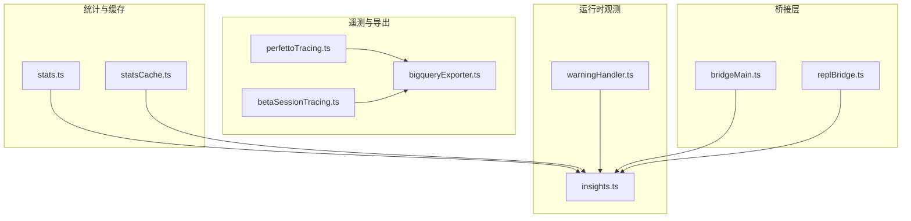
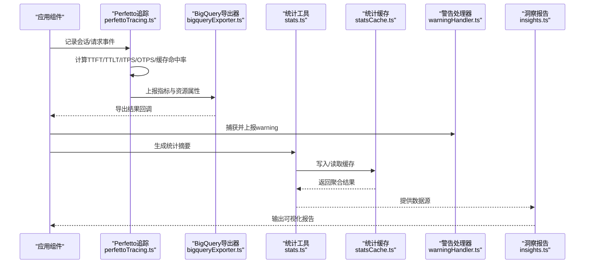
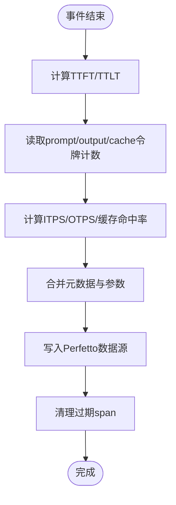
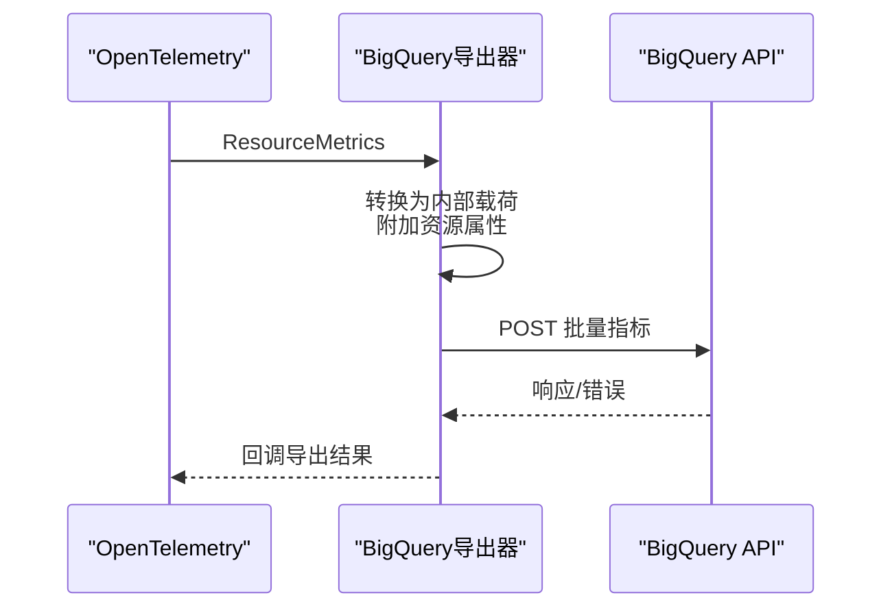
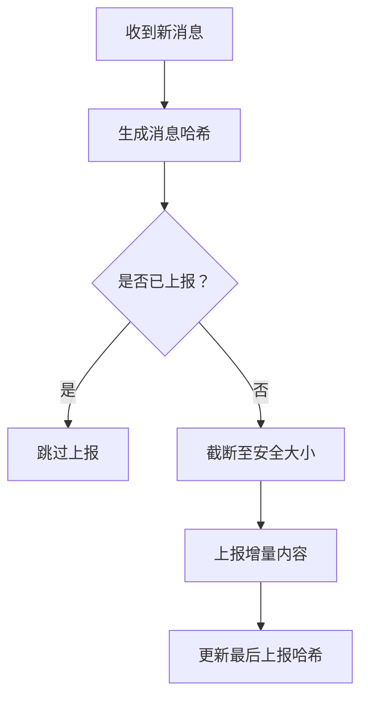
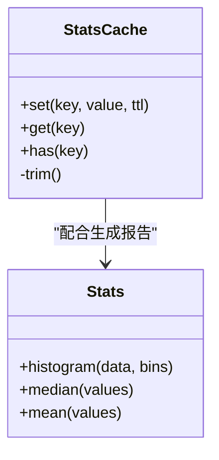
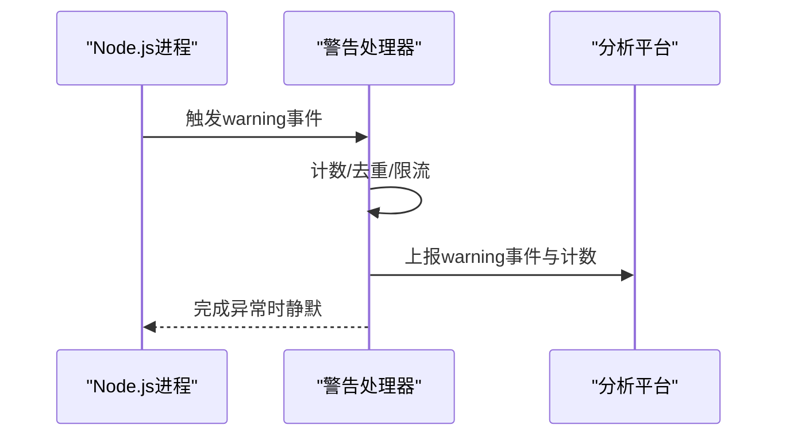
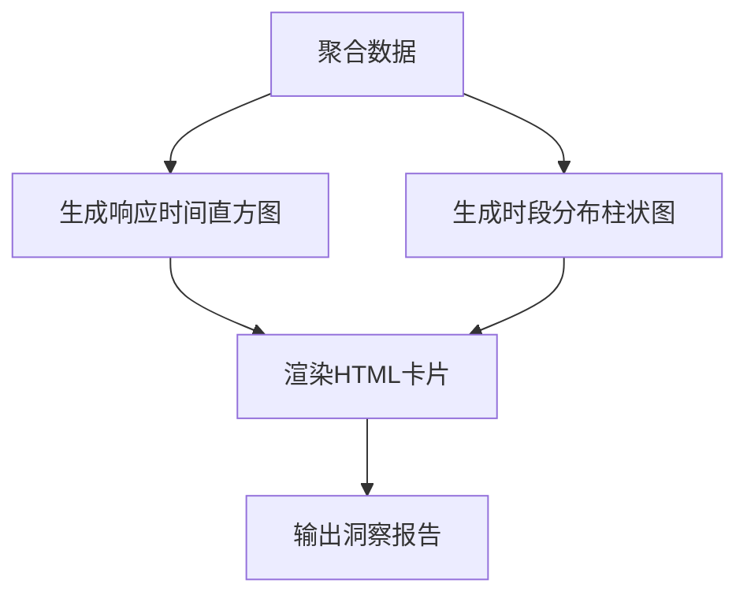
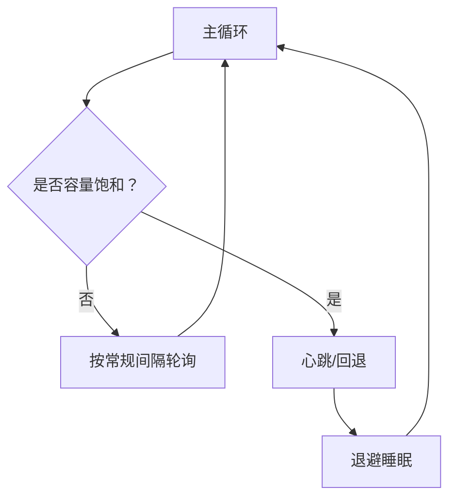
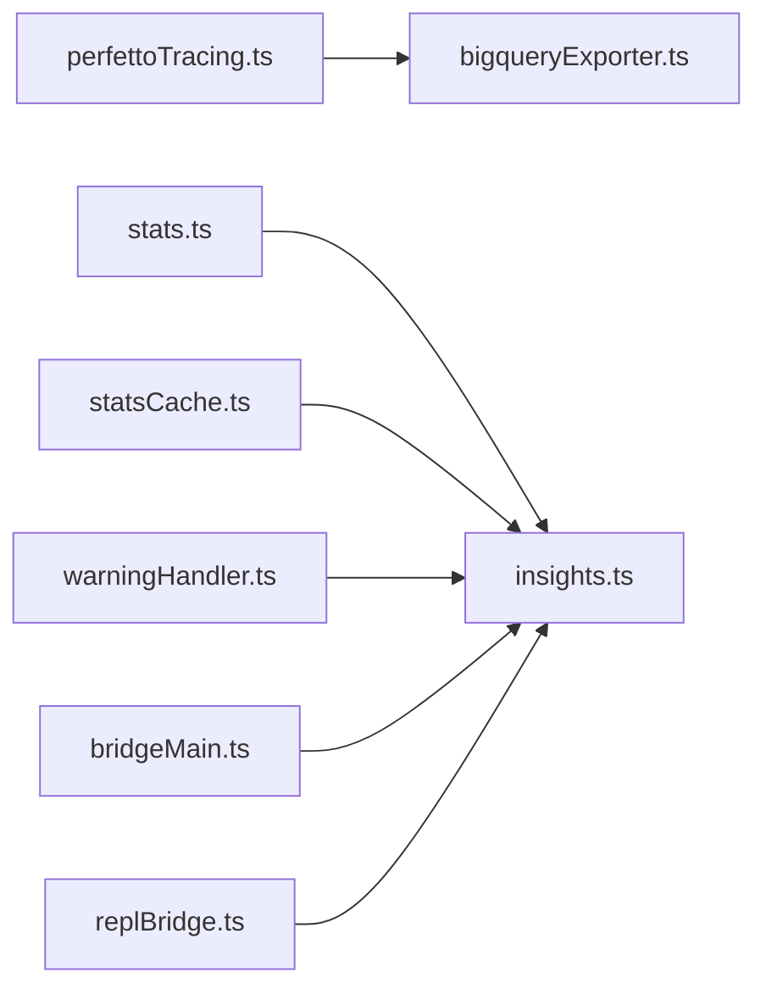

# 性能监控

<cite>
**本文引用的文件**
- [perfettoTracing.ts](file://src/utils/telemetry/perfettoTracing.ts)
- [bigqueryExporter.ts](file://src/utils/telemetry/bigqueryExporter.ts)
- [betaSessionTracing.ts](file://src/utils/telemetry/betaSessionTracing.ts)
- [stats.ts](file://src/utils/stats.ts)
- [statsCache.ts](file://src/utils/statsCache.ts)
- [warningHandler.ts](file://src/utils/warningHandler.ts)
- [insights.ts](file://src/commands/insights.ts)
- [bridgeMain.ts](file://src/bridge/bridgeMain.ts)
- [replBridge.ts](file://src/bridge/replBridge.ts)
</cite>

## 目录
1. [简介](#简介)
2. [项目结构](#项目结构)
3. [核心组件](#核心组件)
4. [架构总览](#架构总览)
5. [详细组件分析](#详细组件分析)
6. [依赖关系分析](#依赖关系分析)
7. [性能考量](#性能考量)
8. [故障排查指南](#故障排查指南)
9. [结论](#结论)
10. [附录](#附录)

## 简介
本文件系统化梳理该代码库中的性能监控能力，覆盖关键性能指标（响应时间、吞吐量、错误率、资源利用率）、数据采集与存储（采样策略、聚合与历史管理）、告警与通知、性能分析工具与仪表板、优化建议与最佳实践。内容以仓库现有实现为依据，结合可落地的流程与可视化图示，帮助读者快速理解并应用。

## 项目结构
与性能监控直接相关的模块主要分布在以下位置：
- 指标采集与导出：src/utils/telemetry 下的 Perfetto 追踪、BigQuery 导出器、Beta 会话追踪
- 统计与缓存：src/utils/stats.ts、src/utils/statsCache.ts
- 警告与事件上报：src/utils/warningHandler.ts
- 命令行洞察报告：src/commands/insights.ts
- 桥接层容量与心跳：src/bridge/bridgeMain.ts、src/bridge/replBridge.ts

图表来源
- [perfettoTracing.ts](file://src/utils/telemetry/perfettoTracing.ts)
- [bigqueryExporter.ts](file://src/utils/telemetry/bigqueryExporter.ts)
- [betaSessionTracing.ts](file://src/utils/telemetry/betaSessionTracing.ts)
- [stats.ts](file://src/utils/stats.ts)
- [statsCache.ts](file://src/utils/statsCache.ts)
- [warningHandler.ts](file://src/utils/warningHandler.ts)
- [insights.ts](file://src/commands/insights.ts)
- [bridgeMain.ts](file://src/bridge/bridgeMain.ts)
- [replBridge.ts](file://src/bridge/replBridge.ts)

章节来源
- [perfettoTracing.ts](file://src/utils/telemetry/perfettoTracing.ts)
- [bigqueryExporter.ts](file://src/utils/telemetry/bigqueryExporter.ts)
- [betaSessionTracing.ts](file://src/utils/telemetry/betaSessionTracing.ts)
- [stats.ts](file://src/utils/stats.ts)
- [statsCache.ts](file://src/utils/statsCache.ts)
- [warningHandler.ts](file://src/utils/warningHandler.ts)
- [insights.ts](file://src/commands/insights.ts)
- [bridgeMain.ts](file://src/bridge/bridgeMain.ts)
- [replBridge.ts](file://src/bridge/replBridge.ts)

## 核心组件
- 指标采集与派生
  - Perfetto 追踪：记录会话/请求生命周期事件，计算 TTFT、TTLT、ITPS、OTPS、缓存命中率等派生指标，并写入 Perfetto 数据源。
  - BigQuery 导出器：将 OpenTelemetry 指标转换为内部载荷并批量上报至 BigQuery。
  - Beta 会话追踪：按会话/查询源增量上报消息，控制内容大小与哈希，便于调试与对比。
- 统计与缓存
  - stats.ts：通用统计工具（均值、中位数、直方图桶等）。
  - statsCache.ts：带过期与上限的缓存，支持键空间限制，避免无限增长。
- 运行时观测
  - warningHandler.ts：统一捕获 Node.js warning，按类型与出现次数上报到分析平台。
  - insights.ts：生成用户交互与响应时间分布等可视化报告。
- 桥接层容量与心跳
  - bridgeMain.ts、replBridge.ts：在高负载或容量饱和时调整轮询与心跳间隔，避免紧循环与抖动。

章节来源
- [perfettoTracing.ts](file://src/utils/telemetry/perfettoTracing.ts)
- [bigqueryExporter.ts](file://src/utils/telemetry/bigqueryExporter.ts)
- [betaSessionTracing.ts](file://src/utils/telemetry/betaSessionTracing.ts)
- [stats.ts](file://src/utils/stats.ts)
- [statsCache.ts](file://src/utils/statsCache.ts)
- [warningHandler.ts](file://src/utils/warningHandler.ts)
- [insights.ts](file://src/commands/insights.ts)
- [bridgeMain.ts](file://src/bridge/bridgeMain.ts)
- [replBridge.ts](file://src/bridge/replBridge.ts)

## 架构总览
下图展示从采集到导出的关键链路，以及与命令行洞察报告的衔接。

图表来源
- [perfettoTracing.ts](file://src/utils/telemetry/perfettoTracing.ts)
- [bigqueryExporter.ts](file://src/utils/telemetry/bigqueryExporter.ts)
- [stats.ts](file://src/utils/stats.ts)
- [statsCache.ts](file://src/utils/statsCache.ts)
- [warningHandler.ts](file://src/utils/warningHandler.ts)
- [insights.ts](file://src/commands/insights.ts)

## 详细组件分析

### Perfetto 追踪与派生指标
- 关键职责
  - 将会话/请求事件映射为 Perfetto span，维护代理进程 ID 映射与过期清理。
  - 在事件结束时计算 TTFT（首次字/令牌耗时）、TTLT（总时延）、ITPS（输入令牌/秒）、OTPS（输出令牌/秒）、缓存命中率等派生指标。
  - 合并元数据与原始参数，形成统一上报载荷。
- 采样与派生逻辑
  - 通过时间戳差值与令牌计数计算 ITPS/OTPS。
  - 缓存命中率基于“从缓存读取的提示词令牌”与“总提示词令牌”的比值。
- 清理与稳定性
  - 定期清理超过 TTL 的陈旧 span，降低内存压力。
  - 使用数值哈希作为线程 ID，确保非零且稳定。

图表来源
- [perfettoTracing.ts](file://src/utils/telemetry/perfettoTracing.ts)

章节来源
- [perfettoTracing.ts](file://src/utils/telemetry/perfettoTracing.ts)

### BigQuery 导出器
- 关键职责
  - 将 OpenTelemetry 指标转换为内部载荷，附加服务版本、操作系统、架构、聚合时序等资源属性。
  - 支持客户类型与订阅类型标注，区分 Claude AI 订阅用户与 API 用户。
  - 异步批量上报，失败时返回错误码并记录日志。
- 数据处理
  - 过滤数值型数据点，转换时间戳格式，保证导出载荷结构一致。
  - 提供优雅关闭与强制刷新能力，确保退出前的数据落盘。

图表来源
- [bigqueryExporter.ts](file://src/utils/telemetry/bigqueryExporter.ts)

章节来源
- [bigqueryExporter.ts](file://src/utils/telemetry/bigqueryExporter.ts)

### Beta 会话追踪
- 关键职责
  - 增量追踪每个查询源（agent）的最后上报消息哈希，仅上报新增消息，减少传输体积。
  - 控制内容大小（默认 60KB），必要时截断并标记。
  - 生成短哈希用于标识系统提示与消息，便于去重与对比。
- 启用条件
  - 需要启用开关与目标端点；外部用户在无头/SDK 场景或特定组织白名单时启用。

图表来源
- [betaSessionTracing.ts](file://src/utils/telemetry/betaSessionTracing.ts)

章节来源
- [betaSessionTracing.ts](file://src/utils/telemetry/betaSessionTracing.ts)

### 统计与缓存
- stats.ts
  - 提供通用统计函数（均值、中位数、分位数、直方图桶等），用于生成洞察报告与趋势分析。
- statsCache.ts
  - 实现带 TTL 与最大键数的缓存，防止无限增长；当达到上限时丢弃新键，避免内存膨胀。

图表来源
- [stats.ts](file://src/utils/stats.ts)
- [statsCache.ts](file://src/utils/statsCache.ts)

章节来源
- [stats.ts](file://src/utils/stats.ts)
- [statsCache.ts](file://src/utils/statsCache.ts)

### 警告与事件上报
- warningHandler.ts
  - 全局捕获 Node.js warning，限制唯一键数量以避免内存增长。
  - 区分内部/外部警告，按出现次数上报到分析平台；调试模式下打印上下文信息。
  - 处理异常时静默失败，不干扰主流程。

图表来源
- [warningHandler.ts](file://src/utils/warningHandler.ts)

章节来源
- [warningHandler.ts](file://src/utils/warningHandler.ts)

### 命令行洞察报告
- insights.ts
  - 生成用户响应时间分布直方图、时段分布柱状图等可视化卡片。
  - 计算中位数与平均值，辅助定位异常与趋势。
  - 支持固定顺序与降序排序，限制最大条目数，提升可读性。

图表来源
- [insights.ts](file://src/commands/insights.ts)

章节来源
- [insights.ts](file://src/commands/insights.ts)

### 桥接层容量与心跳
- bridgeMain.ts、replBridge.ts
  - 在容量饱和或认证失败/致命错误时，采用退避睡眠策略，避免紧轮询。
  - 根据活跃会话数量动态选择轮询间隔，保障空闲与高负载场景的稳定性。
  - 心跳周期与回退逻辑协同，确保恢复后平滑进入工作状态。

图表来源
- [bridgeMain.ts](file://src/bridge/bridgeMain.ts)
- [replBridge.ts](file://src/bridge/replBridge.ts)

章节来源
- [bridgeMain.ts](file://src/bridge/bridgeMain.ts)
- [replBridge.ts](file://src/bridge/replBridge.ts)

## 依赖关系分析
- 组件耦合
  - Perfetto 追踪与 BigQuery 导出器之间存在强关联：前者产出指标，后者负责批量上报。
  - 统计工具与缓存为洞察报告提供数据基础，warningHandler 与桥接层为系统健康度提供观测信号。
- 外部依赖
  - BigQuery 导出器依赖 HTTP 客户端进行批量上报，需关注超时与错误处理。
  - Perfetto 追踪依赖稳定的事件时间戳与令牌计数来源。

图表来源
- [perfettoTracing.ts](file://src/utils/telemetry/perfettoTracing.ts)
- [bigqueryExporter.ts](file://src/utils/telemetry/bigqueryExporter.ts)
- [stats.ts](file://src/utils/stats.ts)
- [statsCache.ts](file://src/utils/statsCache.ts)
- [warningHandler.ts](file://src/utils/warningHandler.ts)
- [insights.ts](file://src/commands/insights.ts)
- [bridgeMain.ts](file://src/bridge/bridgeMain.ts)
- [replBridge.ts](file://src/bridge/replBridge.ts)

章节来源
- [bigqueryExporter.ts](file://src/utils/telemetry/bigqueryExporter.ts)
- [insights.ts](file://src/commands/insights.ts)

## 性能考量
- 指标派生成本
  - ITPS/OTPS/缓存命中率等派生指标计算简单，但需确保令牌计数与时间戳准确，避免重复计算。
- 导出吞吐
  - BigQuery 导出器采用批量上报与异步回调，建议合理设置超时与重试策略，避免阻塞主流程。
- 缓存与内存
  - statsCache 的键上限与 TTL 可控，建议根据业务峰值与保留窗口调优，防止缓存膨胀。
- 观测开销
  - Perfetto 追踪与 Beta 会话追踪在调试场景价值高，生产环境建议按比例采样或按会话/查询源阈值触发。
- 桥接层稳定性
  - 容量饱和时的退避与心跳策略有效降低抖动，建议结合实际负载曲线调整间隔参数。

## 故障排查指南
- 指标缺失或异常
  - 检查 Perfetto 追踪是否正确记录开始/结束事件，确认令牌计数与时间戳来源。
  - 若 OTel 指标未到达 BigQuery，检查导出器的端点、超时与错误回调。
- 报告为空或不更新
  - 确认 stats.ts/StatsCache 的数据是否被正确写入与读取；检查 TTL 是否过短导致提前失效。
- 警告风暴
  - 查看 warningHandler 的键上限是否触发，必要时扩大上限或缩短观察窗口。
- 桥接层卡顿
  - 检查容量饱和与心跳配置，确认退避睡眠是否生效；核对轮询间隔与活跃会话数。

章节来源
- [perfettoTracing.ts](file://src/utils/telemetry/perfettoTracing.ts)
- [bigqueryExporter.ts](file://src/utils/telemetry/bigqueryExporter.ts)
- [stats.ts](file://src/utils/stats.ts)
- [statsCache.ts](file://src/utils/statsCache.ts)
- [warningHandler.ts](file://src/utils/warningHandler.ts)
- [bridgeMain.ts](file://src/bridge/bridgeMain.ts)
- [replBridge.ts](file://src/bridge/replBridge.ts)

## 结论
该代码库提供了从事件采集、指标派生、批量导出到可视化报告与桥接层稳定性控制的完整性能监控闭环。通过合理配置采样策略、聚合与缓存、告警阈值与通知，可有效支撑性能问题的定位与优化。建议在生产环境中结合业务特征逐步放开观测范围，并持续迭代阈值与仪表板。

## 附录
- 关键指标清单
  - 响应时间：TTFT、TTLT
  - 吞吐量：ITPS、OTPS
  - 错误率：由导出器/事件上报统计
  - 资源利用率：由 BigQuery 导出器附加的资源属性反映
- 采样与聚合建议
  - 对高频事件采用按会话/查询源采样；对长尾事件采用滑动窗口聚合。
- 告警配置建议
  - 响应时间：TTFT/TTLT 分位数阈值；OTPS 低于基线阈值触发。
  - 错误率：连续窗口内异常比例阈值；warning 数量突增阈值。
- 仪表板配置
  - 使用 insights.ts 的直方图与柱状图模板，结合 stats.ts 的统计函数构建实时看板。
  - 桥接层指标：轮询间隔、心跳周期、退避睡眠时长。