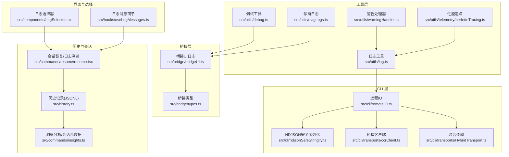
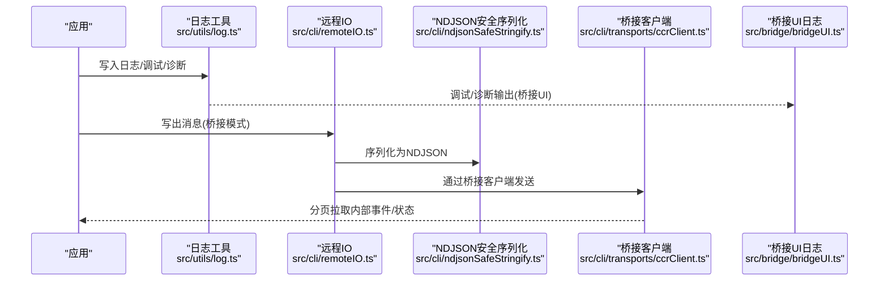
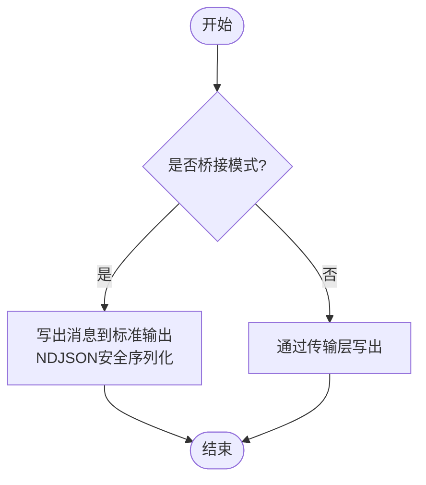
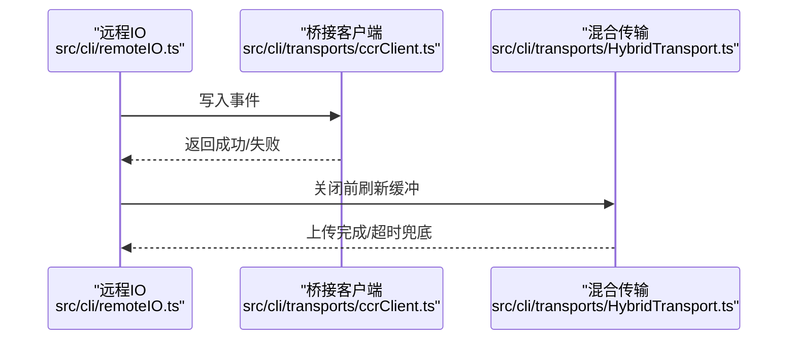
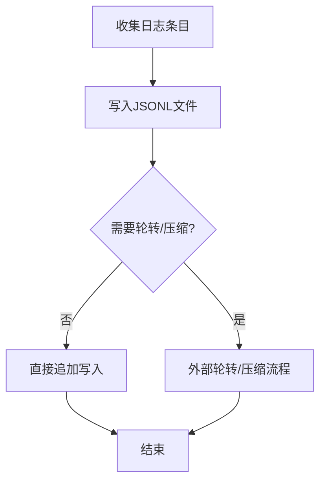
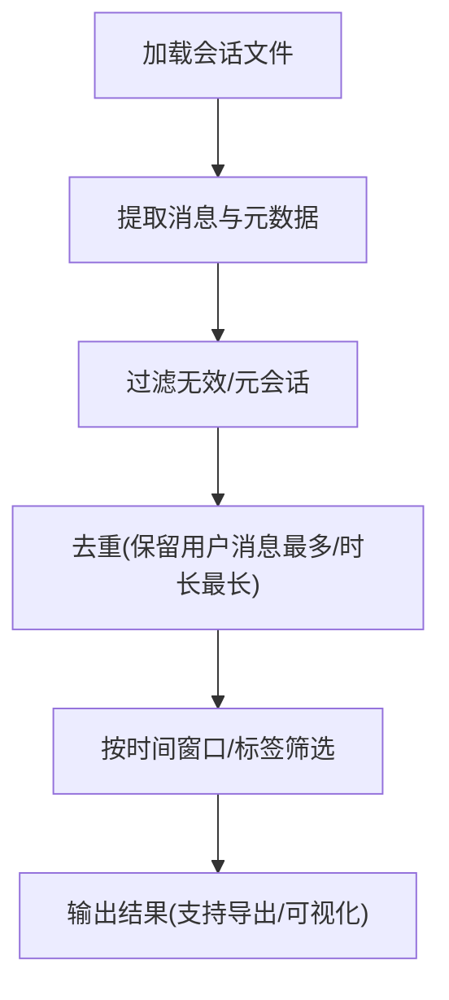
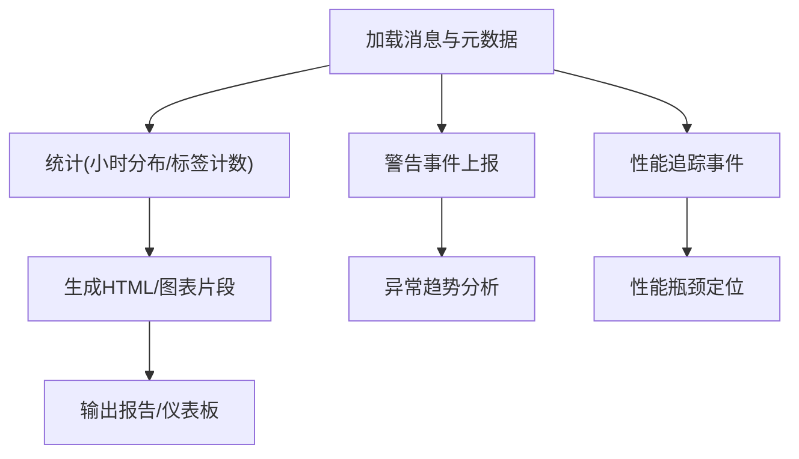
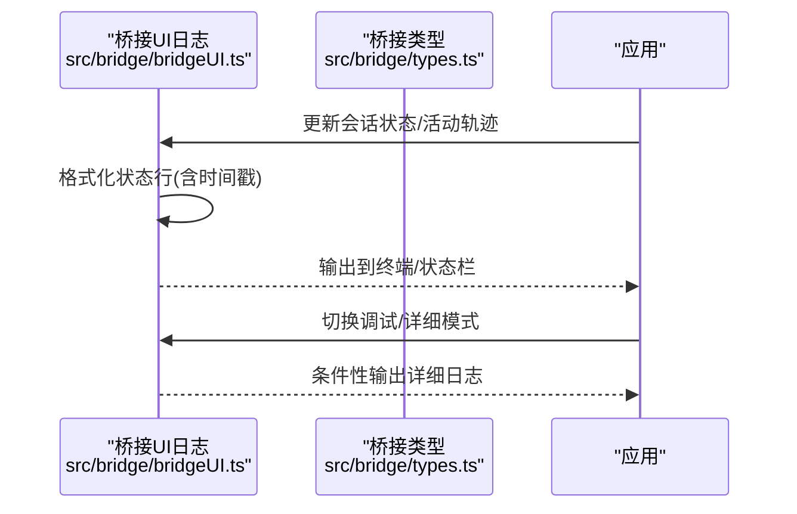
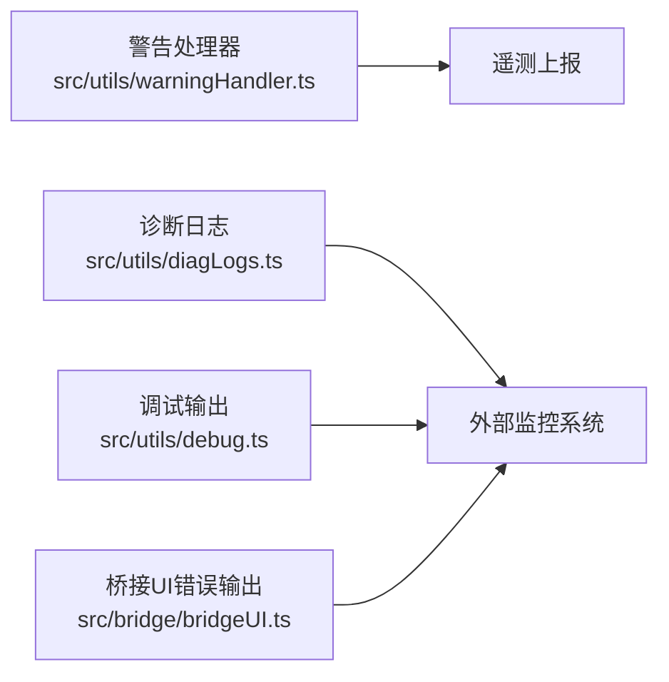
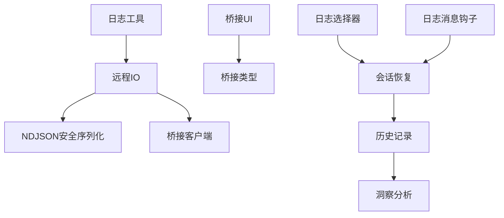

# 日志监控

<cite>
**本文引用的文件**
- [src/utils/log.ts](file://src/utils/log.ts)
- [src/utils/debug.ts](file://src/utils/debug.ts)
- [src/utils/diagLogs.ts](file://src/utils/diagLogs.ts)
- [src/cli/remoteIO.ts](file://src/cli/remoteIO.ts)
- [src/cli/ndjsonSafeStringify.ts](file://src/cli/ndjsonSafeStringify.ts)
- [src/cli/transports/ccrClient.ts](file://src/cli/transports/ccrClient.ts)
- [src/cli/transports/HybridTransport.ts](file://src/cli/transports/HybridTransport.ts)
- [src/bridge/bridgeUI.ts](file://src/bridge/bridgeUI.ts)
- [src/bridge/types.ts](file://src/bridge/types.ts)
- [src/history.ts](file://src/history.ts)
- [src/commands/insights.ts](file://src/commands/insights.ts)
- [src/commands/resume/resume.tsx](file://src/commands/resume/resume.tsx)
- [src/components/LogSelector.tsx](file://src/components/LogSelector.tsx)
- [src/hooks/useLogMessages.ts](file://src/hooks/useLogMessages.ts)
- [src/utils/warningHandler.ts](file://src/utils/warningHandler.ts)
- [src/utils/telemetry/perfettoTracing.ts](file://src/utils/telemetry/perfettoTracing.ts)
</cite>

## 目录
1. [简介](#简介)
2. [项目结构](#项目结构)
3. [核心组件](#核心组件)
4. [架构总览](#架构总览)
5. [详细组件分析](#详细组件分析)
6. [依赖关系分析](#依赖关系分析)
7. [性能考量](#性能考量)
8. [故障排查指南](#故障排查指南)
9. [结论](#结论)
10. [附录](#附录)

## 简介
本文件系统化梳理该代码库中的日志监控能力，覆盖日志采集、格式标准化、多源聚合、分析与检索、存储与轮转、可视化与告警、以及与外部监控系统的集成路径。内容以“可操作”为目标，既面向开发者也兼顾非技术读者。

## 项目结构
围绕日志监控的关键模块分布如下：
- 工具层：统一日志与调试接口、诊断日志、警告处理、遥测追踪
- CLI 层：远程 IO 传输、NDJSON 安全序列化、桥接客户端与混合传输
- 桥接层：桥接 UI 日志与状态输出、桥接类型定义
- 历史与会话：历史记录写入（JSONL）、会话元数据与洞察分析
- 命令与界面：日志选择器、日志消息钩子、会话恢复与日志浏览
- 可视化与告警：桥接 UI 的状态栏日志、错误提示、警告事件上报

**图示来源**
- [src/utils/log.ts](file://src/utils/log.ts)
- [src/utils/debug.ts](file://src/utils/debug.ts)
- [src/utils/diagLogs.ts](file://src/utils/diagLogs.ts)
- [src/utils/warningHandler.ts](file://src/utils/warningHandler.ts)
- [src/utils/telemetry/perfettoTracing.ts](file://src/utils/telemetry/perfettoTracing.ts)
- [src/cli/remoteIO.ts](file://src/cli/remoteIO.ts)
- [src/cli/ndjsonSafeStringify.ts](file://src/cli/ndjsonSafeStringify.ts)
- [src/cli/transports/ccrClient.ts](file://src/cli/transports/ccrClient.ts)
- [src/cli/transports/HybridTransport.ts](file://src/cli/transports/HybridTransport.ts)
- [src/bridge/bridgeUI.ts](file://src/bridge/bridgeUI.ts)
- [src/bridge/types.ts](file://src/bridge/types.ts)
- [src/history.ts](file://src/history.ts)
- [src/commands/insights.ts](file://src/commands/insights.ts)
- [src/commands/resume/resume.tsx](file://src/commands/resume/resume.tsx)
- [src/components/LogSelector.tsx](file://src/components/LogSelector.tsx)
- [src/hooks/useLogMessages.ts](file://src/hooks/useLogMessages.ts)

**章节来源**
- [src/utils/log.ts](file://src/utils/log.ts)
- [src/cli/remoteIO.ts](file://src/cli/remoteIO.ts)
- [src/bridge/bridgeUI.ts](file://src/bridge/bridgeUI.ts)
- [src/history.ts](file://src/history.ts)

## 核心组件
- 统一日志与调试接口：提供统一的日志写入、调试输出、诊断日志与错误处理入口，便于集中控制日志级别与输出格式。
- 远程 IO 与传输：支持桥接模式下的事件写入、NDJSON 安全序列化、分页拉取内部事件、优雅关闭与缓冲上传。
- 桥接 UI 日志：在桥接交互中输出状态、错误、重连等信息，便于用户感知连接与会话状态。
- 历史与会话：将历史记录以 JSONL 写入磁盘，支持按会话加载与元数据提取；结合洞察命令进行会话统计与可视化。
- 警告与遥测：全局警告处理器将警告事件上报至遥测平台，并在调试模式下输出上下文信息；性能追踪支持触发写入与事件淘汰。

**章节来源**
- [src/utils/log.ts](file://src/utils/log.ts)
- [src/utils/debug.ts](file://src/utils/debug.ts)
- [src/utils/diagLogs.ts](file://src/utils/diagLogs.ts)
- [src/cli/remoteIO.ts](file://src/cli/remoteIO.ts)
- [src/cli/ndjsonSafeStringify.ts](file://src/cli/ndjsonSafeStringify.ts)
- [src/cli/transports/ccrClient.ts](file://src/cli/transports/ccrClient.ts)
- [src/cli/transports/HybridTransport.ts](file://src/cli/transports/HybridTransport.ts)
- [src/bridge/bridgeUI.ts](file://src/bridge/bridgeUI.ts)
- [src/history.ts](file://src/history.ts)
- [src/commands/insights.ts](file://src/commands/insights.ts)
- [src/utils/warningHandler.ts](file://src/utils/warningHandler.ts)
- [src/utils/telemetry/perfettoTracing.ts](file://src/utils/telemetry/perfettoTracing.ts)

## 架构总览
日志从应用内部产生，经由统一日志工具与调试接口输出；在桥接模式下通过远程 IO 将消息写入传输层，NDJSON 安全序列化确保跨进程/网络传输稳定；同时桥接 UI 输出状态与错误信息，供用户观察。历史记录以 JSONL 形式持久化，支持后续加载与分析；警告与遥测组件负责监控与性能追踪。

**图示来源**
- [src/utils/log.ts](file://src/utils/log.ts)
- [src/cli/remoteIO.ts](file://src/cli/remoteIO.ts)
- [src/cli/ndjsonSafeStringify.ts](file://src/cli/ndjsonSafeStringify.ts)
- [src/cli/transports/ccrClient.ts](file://src/cli/transports/ccrClient.ts)
- [src/bridge/bridgeUI.ts](file://src/bridge/bridgeUI.ts)

## 详细组件分析

### 日志采集与输出格式标准化
- 统一日志接口：提供统一的日志写入入口，便于集中控制输出目标与格式。
- 调试与诊断：调试模式下输出详细上下文；诊断日志用于无 PII 的运行时观测。
- NDJSON 安全序列化：对 U+2028/2029 行分隔符进行转义，避免跨语言/跨进程解析中断。
- 桥接模式输出：在桥接模式下，控制请求消息与调试消息会被写出到标准输出，保证父进程可观测权限请求与调试信息。

**图示来源**
- [src/cli/remoteIO.ts](file://src/cli/remoteIO.ts)
- [src/cli/ndjsonSafeStringify.ts](file://src/cli/ndjsonSafeStringify.ts)

**章节来源**
- [src/utils/log.ts](file://src/utils/log.ts)
- [src/utils/debug.ts](file://src/utils/debug.ts)
- [src/utils/diagLogs.ts](file://src/utils/diagLogs.ts)
- [src/cli/remoteIO.ts](file://src/cli/remoteIO.ts)
- [src/cli/ndjsonSafeStringify.ts](file://src/cli/ndjsonSafeStringify.ts)

### 多源日志聚合与桥接传输
- 桥接客户端：支持分页拉取内部事件，带重试与指数退避，记录调试信息。
- 混合传输：在关闭前进行缓冲区刷新与优雅关闭，确保队列事件完成上传。
- 事件写入：远程 IO 在桥接模式下将事件写入传输层，必要时回退到标准输出。

**图示来源**
- [src/cli/remoteIO.ts](file://src/cli/remoteIO.ts)
- [src/cli/transports/ccrClient.ts](file://src/cli/transports/ccrClient.ts)
- [src/cli/transports/HybridTransport.ts](file://src/cli/transports/HybridTransport.ts)

**章节来源**
- [src/cli/transports/ccrClient.ts](file://src/cli/transports/ccrClient.ts)
- [src/cli/transports/HybridTransport.ts](file://src/cli/transports/HybridTransport.ts)
- [src/cli/remoteIO.ts](file://src/cli/remoteIO.ts)

### 日志存储与管理（轮转、压缩、清理）
- 历史记录持久化：采用 JSON Lines（JSONL）格式写入本地文件，使用文件锁保障并发安全，追加写入并设置严格权限。
- 存储位置：位于配置目录下的历史文件，写入前确保文件存在并加锁。
- 清理策略：当前实现未见显式的轮转与压缩逻辑；建议结合外部工具或扩展点实现轮转与压缩。

**图示来源**
- [src/history.ts](file://src/history.ts)

**章节来源**
- [src/history.ts](file://src/history.ts)

### 日志查询与过滤（时间范围、标签、SQL-like 语法）
- 会话元数据与洞察：从会话文件加载消息，生成会话元数据，进行去重与筛选，支持按时间窗口与子会话分支聚合。
- 日志选择器与消息钩子：提供日志选择器组件与消息钩子，支撑日志浏览与过滤。
- 会话恢复：支持按项目、PR 关联、自定义标题等条件筛选可恢复会话。

**图示来源**
- [src/commands/insights.ts](file://src/commands/insights.ts)
- [src/commands/resume/resume.tsx](file://src/commands/resume/resume.tsx)
- [src/components/LogSelector.tsx](file://src/components/LogSelector.tsx)
- [src/hooks/useLogMessages.ts](file://src/hooks/useLogMessages.ts)

**章节来源**
- [src/commands/insights.ts](file://src/commands/insights.ts)
- [src/commands/resume/resume.tsx](file://src/commands/resume/resume.tsx)
- [src/components/LogSelector.tsx](file://src/components/LogSelector.tsx)
- [src/hooks/useLogMessages.ts](file://src/hooks/useLogMessages.ts)

### 日志分析与可视化（关键词、模式、异常）
- 关键词与模式：通过消息内容与元数据进行统计与可视化（如小时分布直方图），辅助发现模式与异常。
- 异常检测：全局警告处理器将警告事件上报遥测，便于异常趋势分析与告警联动。
- 性能追踪：性能追踪支持触发写入与事件淘汰，辅助定位性能瓶颈。

**图示来源**
- [src/commands/insights.ts](file://src/commands/insights.ts)
- [src/utils/warningHandler.ts](file://src/utils/warningHandler.ts)
- [src/utils/telemetry/perfettoTracing.ts](file://src/utils/telemetry/perfettoTracing.ts)

**章节来源**
- [src/commands/insights.ts](file://src/commands/insights.ts)
- [src/utils/warningHandler.ts](file://src/utils/warningHandler.ts)
- [src/utils/telemetry/perfettoTracing.ts](file://src/utils/telemetry/perfettoTracing.ts)

### 实时日志流与状态展示
- 桥接 UI 日志：在桥接交互中输出状态、错误、重连等信息，支持详细/简洁模式切换与二维码显示控制。
- 调试输出：在调试模式下输出带时间戳的状态行，便于实时观察连接与会话状态。

**图示来源**
- [src/bridge/bridgeUI.ts](file://src/bridge/bridgeUI.ts)
- [src/bridge/types.ts](file://src/bridge/types.ts)

**章节来源**
- [src/bridge/bridgeUI.ts](file://src/bridge/bridgeUI.ts)
- [src/bridge/types.ts](file://src/bridge/types.ts)

### 告警通知与外部监控集成
- 警告事件上报：全局警告处理器将警告事件上报遥测平台，便于构建告警规则与通知。
- 诊断日志与调试：诊断日志与调试输出可用于外部监控系统采集，形成端到端可观测性。
- 桥接 UI 错误输出：桥接 UI 的错误输出可被外部日志系统捕获，作为告警输入。

**图示来源**
- [src/utils/warningHandler.ts](file://src/utils/warningHandler.ts)
- [src/utils/diagLogs.ts](file://src/utils/diagLogs.ts)
- [src/utils/debug.ts](file://src/utils/debug.ts)
- [src/bridge/bridgeUI.ts](file://src/bridge/bridgeUI.ts)

**章节来源**
- [src/utils/warningHandler.ts](file://src/utils/warningHandler.ts)
- [src/utils/diagLogs.ts](file://src/utils/diagLogs.ts)
- [src/utils/debug.ts](file://src/utils/debug.ts)
- [src/bridge/bridgeUI.ts](file://src/bridge/bridgeUI.ts)

## 依赖关系分析
- 组件耦合：日志工具与调试接口贯穿多个层；远程 IO 依赖 NDJSON 安全序列化与桥接客户端；桥接 UI 依赖桥接类型定义。
- 外部依赖：桥接客户端使用分页拉取与重试机制；混合传输在关闭时进行缓冲区刷新与优雅关闭。
- 循环依赖：当前分析未发现循环依赖迹象。

**图示来源**
- [src/utils/log.ts](file://src/utils/log.ts)
- [src/cli/remoteIO.ts](file://src/cli/remoteIO.ts)
- [src/cli/ndjsonSafeStringify.ts](file://src/cli/ndjsonSafeStringify.ts)
- [src/cli/transports/ccrClient.ts](file://src/cli/transports/ccrClient.ts)
- [src/bridge/bridgeUI.ts](file://src/bridge/bridgeUI.ts)
- [src/bridge/types.ts](file://src/bridge/types.ts)
- [src/history.ts](file://src/history.ts)
- [src/commands/insights.ts](file://src/commands/insights.ts)
- [src/commands/resume/resume.tsx](file://src/commands/resume/resume.tsx)
- [src/components/LogSelector.tsx](file://src/components/LogSelector.tsx)
- [src/hooks/useLogMessages.ts](file://src/hooks/useLogMessages.ts)

**章节来源**
- [src/utils/log.ts](file://src/utils/log.ts)
- [src/cli/remoteIO.ts](file://src/cli/remoteIO.ts)
- [src/cli/transports/ccrClient.ts](file://src/cli/transports/ccrClient.ts)
- [src/bridge/bridgeUI.ts](file://src/bridge/bridgeUI.ts)
- [src/history.ts](file://src/history.ts)
- [src/commands/insights.ts](file://src/commands/insights.ts)
- [src/commands/resume/resume.tsx](file://src/commands/resume/resume.tsx)
- [src/components/LogSelector.tsx](file://src/components/LogSelector.tsx)
- [src/hooks/useLogMessages.ts](file://src/hooks/useLogMessages.ts)

## 性能考量
- 写入路径：历史记录采用追加写入与文件锁，避免竞争；NDJSON 安全序列化减少解析中断风险。
- 传输路径：桥接客户端分页拉取与重试机制降低单次失败影响；混合传输在关闭时进行缓冲区刷新，提升可靠性。
- 警告与遥测：警告事件上报与性能追踪支持触发写入与事件淘汰，避免内存无限增长。

**章节来源**
- [src/history.ts](file://src/history.ts)
- [src/cli/transports/ccrClient.ts](file://src/cli/transports/ccrClient.ts)
- [src/cli/transports/HybridTransport.ts](file://src/cli/transports/HybridTransport.ts)
- [src/utils/warningHandler.ts](file://src/utils/warningHandler.ts)
- [src/utils/telemetry/perfettoTracing.ts](file://src/utils/telemetry/perfettoTracing.ts)

## 故障排查指南
- 桥接模式下日志缺失：检查远程 IO 是否正确写出到标准输出与传输层；确认 NDJSON 安全序列化是否生效。
- 历史记录写入失败：检查文件锁与权限设置；确认 JSONL 写入是否成功。
- 警告未上报：检查全局警告处理器安装与遥测上报逻辑；确认调试模式下是否输出详细信息。
- 性能问题：启用性能追踪，触发写入并观察事件数量与淘汰策略。

**章节来源**
- [src/cli/remoteIO.ts](file://src/cli/remoteIO.ts)
- [src/cli/ndjsonSafeStringify.ts](file://src/cli/ndjsonSafeStringify.ts)
- [src/history.ts](file://src/history.ts)
- [src/utils/warningHandler.ts](file://src/utils/warningHandler.ts)
- [src/utils/telemetry/perfettoTracing.ts](file://src/utils/telemetry/perfettoTracing.ts)

## 结论
该代码库提供了完善的日志采集、格式标准化、多源传输、历史持久化与基础分析能力。建议在现有基础上补充：
- 显式的日志轮转与压缩策略
- 更丰富的 SQL-like 查询语法与标签过滤
- 集成外部监控系统的标准化指标导出
- 实时告警规则与可视化看板

## 附录
- 日志级别与输出格式：通过统一日志工具与调试接口控制；桥接 UI 提供详细/简洁模式切换。
- 多源聚合：桥接客户端与混合传输确保事件可靠送达；历史记录提供离线分析基础。
- 可视化与告警：桥接 UI 状态输出与警告事件上报构成基础告警来源；洞察命令生成可视化片段。