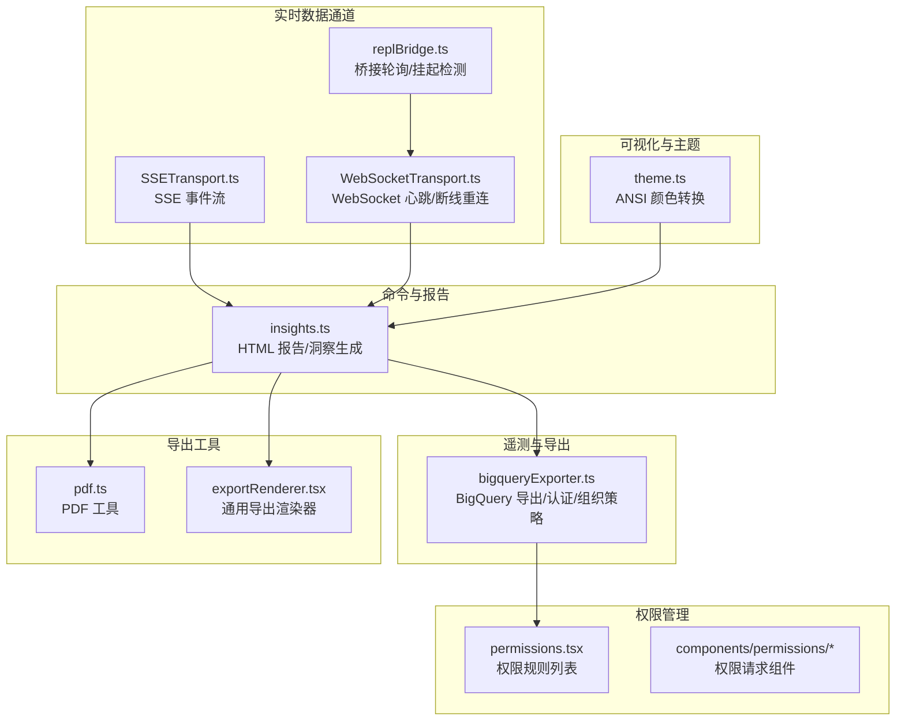
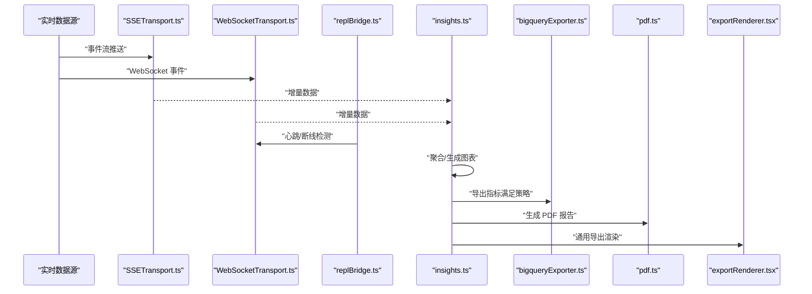
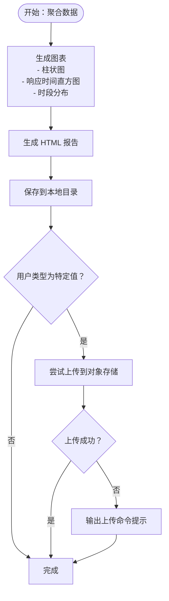
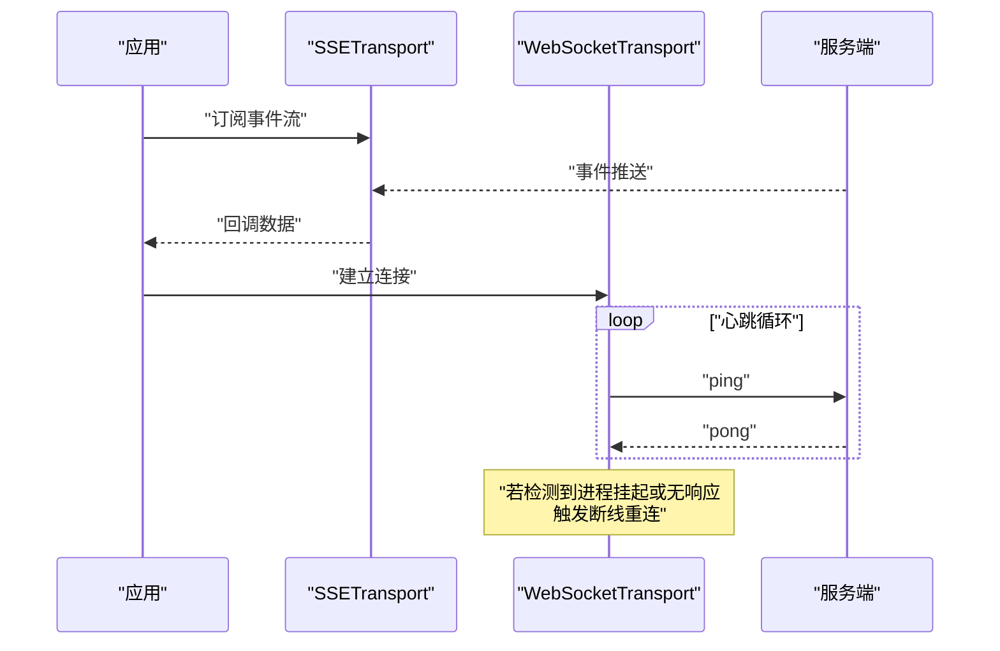
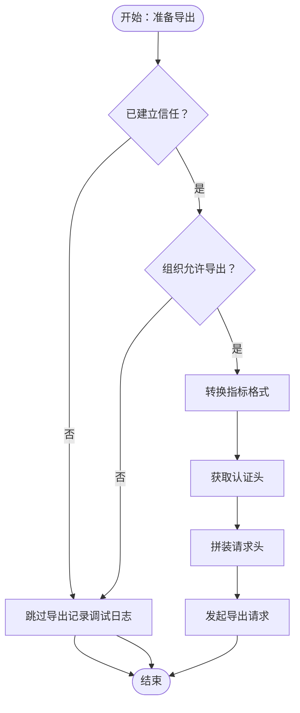
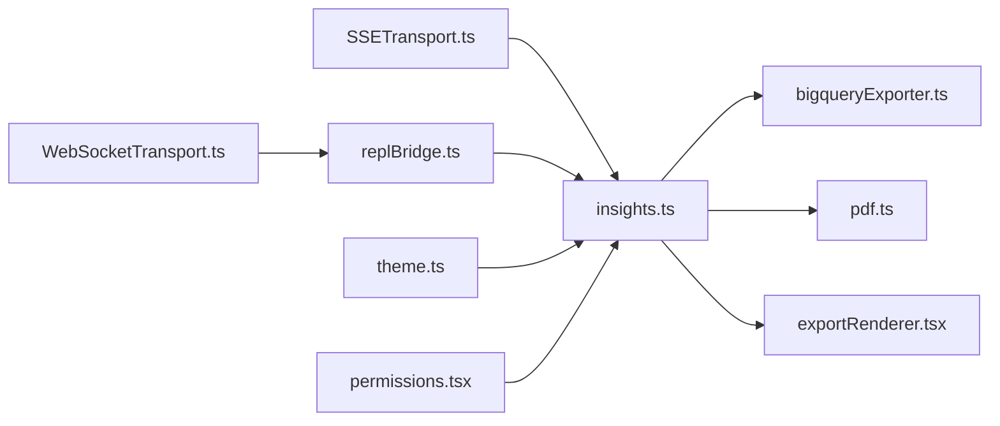

# 监控仪表板

<cite>
**本文引用的文件**
- [insights.ts](file://src/commands/insights.ts)
- [bigqueryExporter.ts](file://src/utils/telemetry/bigqueryExporter.ts)
- [SSETransport.ts](file://src/cli/transports/SSETransport.ts)
- [WebSocketTransport.ts](file://src/cli/transports/WebSocketTransport.ts)
- [replBridge.ts](file://src/bridge/replBridge.ts)
- [theme.ts](file://src/utils/theme.ts)
- [permissions.tsx](file://src/commands/permissions/permissions.tsx)
- [pdf.ts](file://src/utils/pdf.ts)
- [exportRenderer.tsx](file://src/utils/exportRenderer.tsx)
</cite>

## 目录
1. [简介](#简介)
2. [项目结构](#项目结构)
3. [核心组件](#核心组件)
4. [架构总览](#架构总览)
5. [详细组件分析](#详细组件分析)
6. [依赖关系分析](#依赖关系分析)
7. [性能考量](#性能考量)
8. [故障排查指南](#故障排查指南)
9. [结论](#结论)
10. [附录](#附录)

## 简介
本文件面向“监控仪表板”的配置与定制、实时数据展示、历史数据分析、权限管理、导出能力以及维护升级流程进行系统化说明。基于仓库中的现有实现，重点围绕以下方面展开：
- 图表类型与可视化：柱状图、时序分布直方图、时段分布等。
- 实时监控数据：通过事件流传输通道（SSE/WS）持续接收数据，心跳与断线重连保障稳定性。
- 历史数据分析：会话洞察报告、HTML 报告生成、可选上传至对象存储。
- 权限管理：权限规则列表、权限请求与决策、工作区与文件系统权限。
- 导出能力：HTML 报告、PDF 渲染、通用导出渲染器。
- 维护与升级：遥测导出器的组织级开关、信任态检查、认证头注入。

## 项目结构
与监控仪表板相关的能力主要分布在如下模块：
- 命令与报告：insights.ts 提供洞察与 HTML 报告生成。
- 实时数据通道：SSETransport 与 WebSocketTransport 提供事件流与心跳检测。
- 遥测与导出：bigqueryExporter 负责指标导出与认证头处理。
- 主题与终端可视化：theme.ts 将主题色转换为 ANSI 序列用于终端图表。
- 权限管理：permissions.tsx 与 components/permissions 提供权限规则与请求界面。
- 导出工具：pdf.ts 与 exportRenderer.tsx 支持 PDF 与通用导出渲染。

**图表来源**
- [insights.ts](file://src/commands/insights.ts)
- [SSETransport.ts](file://src/cli/transports/SSETransport.ts)
- [WebSocketTransport.ts](file://src/cli/transports/WebSocketTransport.ts)
- [replBridge.ts](file://src/bridge/replBridge.ts)
- [bigqueryExporter.ts](file://src/utils/telemetry/bigqueryExporter.ts)
- [theme.ts](file://src/utils/theme.ts)
- [permissions.tsx](file://src/commands/permissions/permissions.tsx)
- [pdf.ts](file://src/utils/pdf.ts)
- [exportRenderer.tsx](file://src/utils/exportRenderer.tsx)

**章节来源**
- [insights.ts](file://src/commands/insights.ts)
- [SSETransport.ts](file://src/cli/transports/SSETransport.ts)
- [WebSocketTransport.ts](file://src/cli/transports/WebSocketTransport.ts)
- [replBridge.ts](file://src/bridge/replBridge.ts)
- [bigqueryExporter.ts](file://src/utils/telemetry/bigqueryExporter.ts)
- [theme.ts](file://src/utils/theme.ts)
- [permissions.tsx](file://src/commands/permissions/permissions.tsx)
- [pdf.ts](file://src/utils/pdf.ts)
- [exportRenderer.tsx](file://src/utils/exportRenderer.tsx)

## 核心组件
- 洞察与报告生成：负责聚合数据、生成 HTML 报告卡片（统计、柱状图、时序分布、时段分布等），并支持本地保存或上传到对象存储。
- 实时数据通道：SSE 与 WebSocket 传输层提供事件流订阅、错误重试、连接健康检测与断线重连。
- 遥测导出：BigQuery 导出器在满足信任态与组织策略的前提下，对指标进行转换并发起导出请求。
- 主题与终端可视化：将主题颜色映射为 ANSI 序列，适配不同终端色彩能力。
- 权限管理：权限规则列表与各类权限请求组件，覆盖文件系统、脚本执行、笔记本编辑等场景。
- 导出工具：PDF 渲染与通用导出渲染器，支撑报告导出与第三方集成。

**章节来源**
- [insights.ts](file://src/commands/insights.ts)
- [SSETransport.ts](file://src/cli/transports/SSETransport.ts)
- [WebSocketTransport.ts](file://src/cli/transports/WebSocketTransport.ts)
- [bigqueryExporter.ts](file://src/utils/telemetry/bigqueryExporter.ts)
- [theme.ts](file://src/utils/theme.ts)
- [permissions.tsx](file://src/commands/permissions/permissions.tsx)
- [pdf.ts](file://src/utils/pdf.ts)
- [exportRenderer.tsx](file://src/utils/exportRenderer.tsx)

## 架构总览
下图展示了从实时数据接入到报告生成与导出的整体流程，以及与权限、遥测的关系。

**图表来源**
- [insights.ts](file://src/commands/insights.ts)
- [SSETransport.ts](file://src/cli/transports/SSETransport.ts)
- [WebSocketTransport.ts](file://src/cli/transports/WebSocketTransport.ts)
- [replBridge.ts](file://src/bridge/replBridge.ts)
- [bigqueryExporter.ts](file://src/utils/telemetry/bigqueryExporter.ts)
- [pdf.ts](file://src/utils/pdf.ts)
- [exportRenderer.tsx](file://src/utils/exportRenderer.tsx)

## 详细组件分析

### 洞察与报告生成（insights.ts）
- 功能要点
  - 聚合会话与交互数据，生成统计卡片与多种图表（目标类别、工具使用、语言分布、会话类型、响应时间分布、时段分布、工具错误等）。
  - 生成 HTML 报告并保存到本地；在特定用户类型下尝试上传到对象存储，并提供回退提示。
  - 支持时区切换以调整时段分布视图。
- 关键图表
  - 柱状图：按类别计数排序，最大值归一化显示百分比条形。
  - 响应时间直方图：按区间分桶统计频次。
  - 时段分布：按时间段分组统计消息数量。
- 输出与导出
  - HTML 报告文件路径与可选上传链接；同时支持构建导出数据结构供后台上传。

**图表来源**
- [insights.ts](file://src/commands/insights.ts)

**章节来源**
- [insights.ts](file://src/commands/insights.ts)

### 实时数据通道（SSETransport 与 WebSocketTransport）
- SSETransport
  - 提供连接状态查询、数据回调注册、关闭与事件回调注册。
  - URL 转换：将 SSE 流地址转换为对应的 POST 事件端点。
- WebSocketTransport
  - 心跳与断线重连：周期性发送 ping 并检测长时间 tick 缺失（进程挂起）以主动重连。
  - 连接健康：通过间隔与超阈值判断，避免 NAT 映射失效导致的无效等待。

**图表来源**
- [SSETransport.ts](file://src/cli/transports/SSETransport.ts)
- [WebSocketTransport.ts](file://src/cli/transports/WebSocketTransport.ts)

**章节来源**
- [SSETransport.ts](file://src/cli/transports/SSETransport.ts)
- [WebSocketTransport.ts](file://src/cli/transports/WebSocketTransport.ts)

### 遥测导出（bigqueryExporter.ts）
- 功能要点
  - 信任态检查：在交互模式下未建立信任则跳过导出。
  - 组织级策略：检查指标导出是否被组织禁用。
  - 认证与请求：注入认证头，构造请求头并发起导出。
- 处理流程
  - 若不满足条件直接返回成功；否则转换指标格式、获取认证头、拼装请求头后导出。

**图表来源**
- [bigqueryExporter.ts](file://src/utils/telemetry/bigqueryExporter.ts)

**章节来源**
- [bigqueryExporter.ts](file://src/utils/telemetry/bigqueryExporter.ts)

### 主题与终端可视化（theme.ts）
- 功能要点
  - 将主题颜色解析为 RGB 并转换为 ANSI 转义序列，用于终端图表渲染。
  - 针对 Apple Terminal 的 256 色模式进行适配，确保颜色一致性。

**章节来源**
- [theme.ts](file://src/utils/theme.ts)

### 权限管理（permissions.tsx 与 components/permissions）
- 功能要点
  - 权限规则列表：展示与管理权限规则，支持最近拒绝项与工作区 Tab。
  - 权限请求组件：覆盖文件系统、脚本执行、笔记本编辑、Web 获取等场景。
  - 命令入口：通过本地 JSX 命令调用权限规则列表界面。
- 适用范围
  - 文件读写、脚本运行、远程资源访问、计划模式进入/退出等。

**章节来源**
- [permissions.tsx](file://src/commands/permissions/permissions.tsx)
- [insights.ts](file://src/commands/insights.ts)

### 导出能力（pdf.ts 与 exportRenderer.tsx）
- 功能要点
  - PDF 工具：提供 PDF 渲染与导出能力。
  - 通用导出渲染器：支持将内容渲染为可导出格式，便于与第三方系统集成。
- 使用场景
  - 结合洞察报告生成 PDF 版本，或通过通用渲染器对接外部系统。

**章节来源**
- [pdf.ts](file://src/utils/pdf.ts)
- [exportRenderer.tsx](file://src/utils/exportRenderer.tsx)

## 依赖关系分析
- 数据流依赖
  - 实时数据通道（SSE/WS）向洞察模块提供增量数据，驱动图表更新。
  - 桥接层（replBridge）维持连接健康，保障数据可达性。
- 导出与策略依赖
  - 遥测导出器受信任态与组织策略约束，仅在满足条件下执行。
- 可视化依赖
  - 主题工具为终端图表提供颜色支持，间接影响终端内可视化质量。
- 权限依赖
  - 权限规则与请求组件贯穿多个操作面（文件、脚本、网络等），与命令与服务交互紧密。

**图表来源**
- [insights.ts](file://src/commands/insights.ts)
- [SSETransport.ts](file://src/cli/transports/SSETransport.ts)
- [WebSocketTransport.ts](file://src/cli/transports/WebSocketTransport.ts)
- [replBridge.ts](file://src/bridge/replBridge.ts)
- [bigqueryExporter.ts](file://src/utils/telemetry/bigqueryExporter.ts)
- [theme.ts](file://src/utils/theme.ts)
- [permissions.tsx](file://src/commands/permissions/permissions.tsx)
- [pdf.ts](file://src/utils/pdf.ts)
- [exportRenderer.tsx](file://src/utils/exportRenderer.tsx)

**章节来源**
- [insights.ts](file://src/commands/insights.ts)
- [SSETransport.ts](file://src/cli/transports/SSETransport.ts)
- [WebSocketTransport.ts](file://src/cli/transports/WebSocketTransport.ts)
- [replBridge.ts](file://src/bridge/replBridge.ts)
- [bigqueryExporter.ts](file://src/utils/telemetry/bigqueryExporter.ts)
- [theme.ts](file://src/utils/theme.ts)
- [permissions.tsx](file://src/commands/permissions/permissions.tsx)
- [pdf.ts](file://src/utils/pdf.ts)
- [exportRenderer.tsx](file://src/utils/exportRenderer.tsx)

## 性能考量
- 实时通道
  - 心跳与断线重连机制降低长连接失效风险，提升稳定性。
  - 进程挂起检测避免长时间空转，缩短恢复时间。
- 报告生成
  - HTML 报告采用静态卡片与内联样式，减少复杂渲染开销。
  - 对柱状图与直方图进行最大值归一化，避免极端值影响视觉比例。
- 导出与认证
  - 在组织策略或信任态不满足时提前短路，避免无效请求与网络开销。
- 终端可视化
  - ANSI 颜色转换在不同终端上保持一致表现，减少额外计算成本。

[本节为通用指导，无需列出具体文件来源]

## 故障排查指南
- 实时数据无更新
  - 检查 WebSocket 心跳是否正常，确认是否存在进程挂起导致的心跳缺失。
  - 核实 SSE URL 是否正确转换为 POST 事件端点。
- 报告未上传
  - 确认当前用户类型是否满足自动上传条件，查看上传失败提示并按建议执行上传命令。
- 导出失败
  - 检查信任态与组织策略是否允许导出；核对认证头是否正确注入。
- 权限问题
  - 通过权限规则列表查看最近拒绝项，按提示补充授权或调整规则。

**章节来源**
- [WebSocketTransport.ts](file://src/cli/transports/WebSocketTransport.ts)
- [SSETransport.ts](file://src/cli/transports/SSETransport.ts)
- [insights.ts](file://src/commands/insights.ts)
- [bigqueryExporter.ts](file://src/utils/telemetry/bigqueryExporter.ts)
- [permissions.tsx](file://src/commands/permissions/permissions.tsx)

## 结论
本仓库提供了从实时数据接入、图表生成、报告导出到权限与遥测策略的完整链路。监控仪表板可通过以下方式实现：
- 选择合适的图表类型（柱状图、直方图、时段分布）并结合时区切换增强可读性。
- 依托 SSE/WS 通道与心跳机制保障实时数据稳定到达。
- 利用洞察报告生成与导出工具（HTML/PDF/通用渲染器）形成闭环。
- 通过权限规则与请求组件实现细粒度的数据访问控制。
- 通过遥测导出器与组织策略确保合规与性能平衡。

[本节为总结性内容，无需列出具体文件来源]

## 附录
- 术语
  - 实时数据：通过事件流通道持续推送的数据。
  - 历史数据：会话与交互累积形成的离线数据，用于生成报告与分析。
  - 权限规则：定义哪些操作需要用户授权及授权范围。
  - 导出：将报告或指标数据输出为 HTML/PDF 或第三方可消费格式。

[本节为补充说明，无需列出具体文件来源]