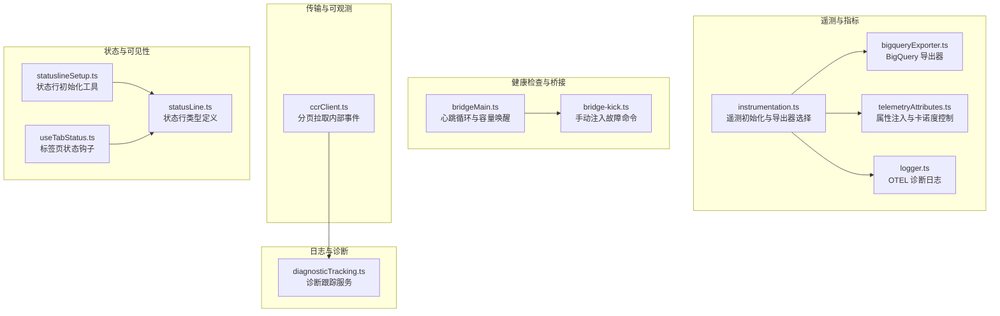
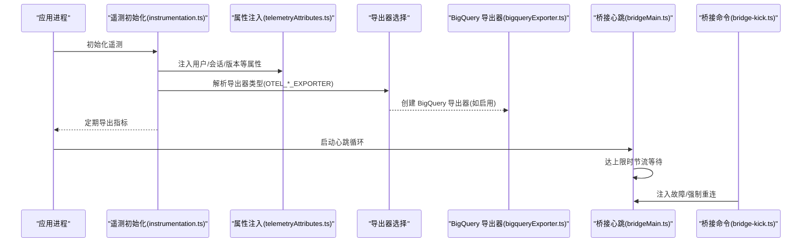
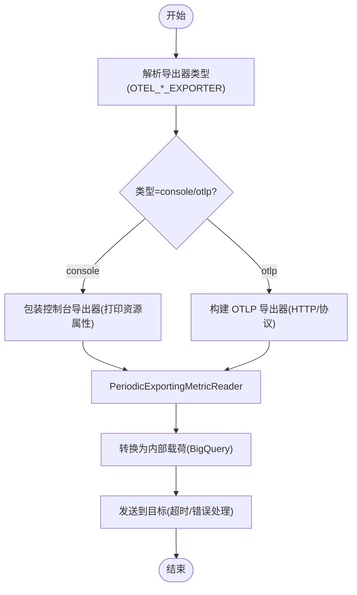
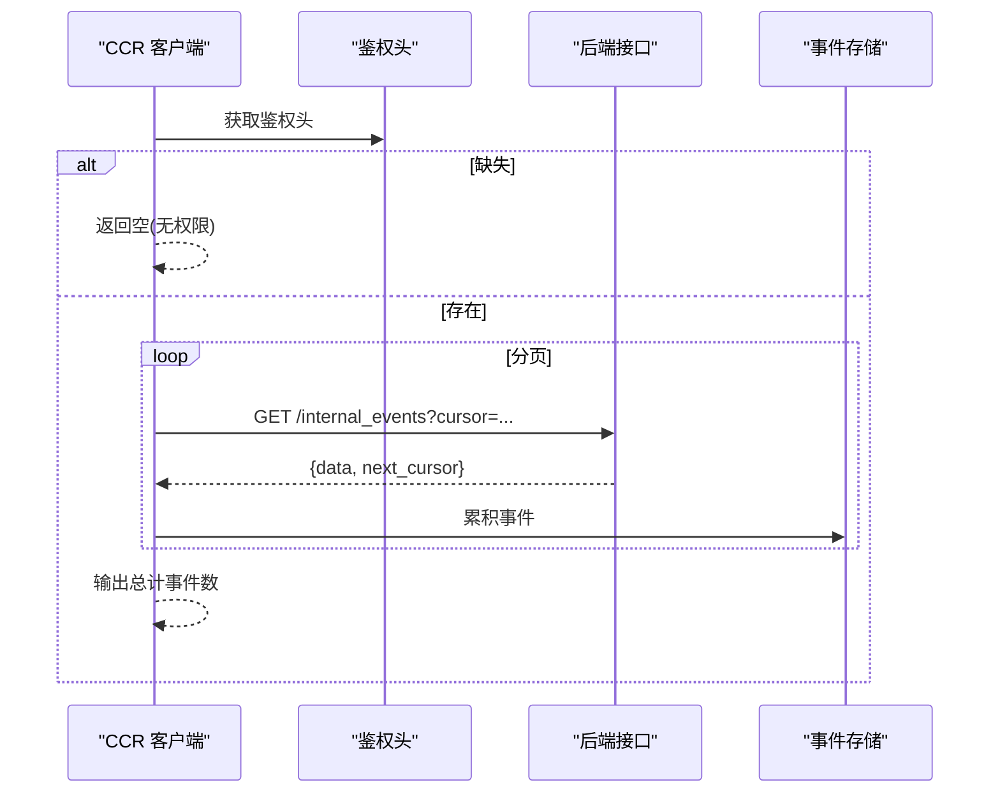
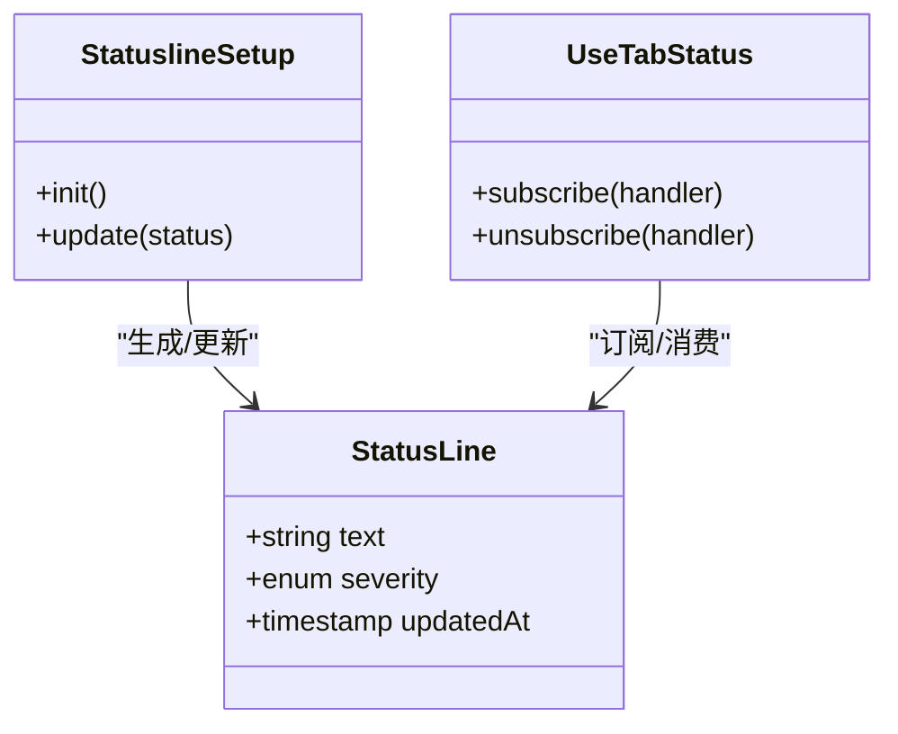
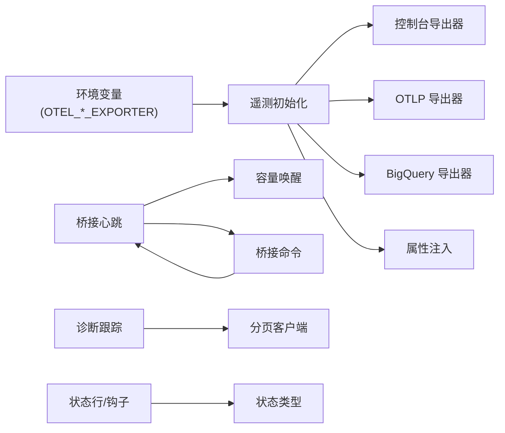

# 运维监控

<cite>
**本文引用的文件**
- [instrumentation.ts](file://src/utils/telemetry/instrumentation.ts)
- [bigqueryExporter.ts](file://src/utils/telemetry/bigqueryExporter.ts)
- [logger.ts](file://src/utils/telemetry/logger.ts)
- [telemetryAttributes.ts](file://src/utils/telemetryAttributes.ts)
- [bridgeMain.ts](file://src/bridge/bridgeMain.ts)
- [bridge-kick.ts](file://src/commands/bridge-kick.ts)
- [ccrClient.ts](file://src/cli/transports/ccrClient.ts)
- [diagnosticTracking.ts](file://src/services/diagnosticTracking.ts)
- [statusLine.ts](file://src/types/statusLine.ts)
- [statuslineSetup.ts](file://src/tools/AgentTool/built-in/statuslineSetup.ts)
- [useTabStatus.ts](file://src/ink/hooks/useTabStatus.ts)
- [preflightChecks.tsx](file://src/utils/preflightChecks.tsx)
</cite>

## 目录
1. [简介](#简介)
2. [项目结构](#项目结构)
3. [核心组件](#核心组件)
4. [架构总览](#架构总览)
5. [详细组件分析](#详细组件分析)
6. [依赖关系分析](#依赖关系分析)
7. [性能考量](#性能考量)
8. [故障排查指南](#故障排查指南)
9. [结论](#结论)
10. [附录](#附录)

## 简介
本文件面向运维与平台工程团队，系统化梳理该代码库中的运维监控能力，覆盖健康检查（服务状态、依赖与可用性）、性能监控（指标采集、阈值与告警）、日志监控（聚合、格式与查询）、故障检测与自动恢复（异常识别、重连与降级）、监控仪表板配置（可视化与趋势）以及监控数据导出与第三方系统对接方案。内容以仓库现有实现为依据，结合可操作的配置建议与流程图示，帮助读者快速落地。

## 项目结构
围绕监控主题的关键目录与文件如下：
- 指标与遥测：src/utils/telemetry/*
- 健康检查与桥接：src/bridge/*
- 日志与诊断：src/services/diagnosticTracking.ts、src/utils/log.ts
- 命令行与传输层：src/cli/transports/ccrClient.ts
- 状态与可见性：src/types/statusLine.ts、src/tools/AgentTool/built-in/statuslineSetup.ts、src/ink/hooks/useTabStatus.ts
- 预检与可用性：src/utils/preflightChecks.tsx



**图示来源**
- [instrumentation.ts:130-215](file://src/utils/telemetry/instrumentation.ts#L130-L215)
- [bigqueryExporter.ts:130-219](file://src/utils/telemetry/bigqueryExporter.ts#L130-L219)
- [telemetryAttributes.ts:16-42](file://src/utils/telemetryAttributes.ts#L16-L42)
- [logger.ts:1-26](file://src/utils/telemetry/logger.ts#L1-L26)
- [bridgeMain.ts:657-687](file://src/bridge/bridgeMain.ts#L657-L687)
- [bridge-kick.ts:159-200](file://src/commands/bridge-kick.ts#L159-L200)
- [ccrClient.ts:860-899](file://src/cli/transports/ccrClient.ts#L860-L899)
- [diagnosticTracking.ts](file://src/services/diagnosticTracking.ts)
- [statusLine.ts](file://src/types/statusLine.ts)
- [statuslineSetup.ts](file://src/tools/AgentTool/built-in/statuslineSetup.ts)
- [useTabStatus.ts](file://src/ink/hooks/useTabStatus.ts)

**章节来源**
- [instrumentation.ts:130-215](file://src/utils/telemetry/instrumentation.ts#L130-L215)
- [bridgeMain.ts:657-687](file://src/bridge/bridgeMain.ts#L657-L687)
- [ccrClient.ts:860-899](file://src/cli/transports/ccrClient.ts#L860-L899)

## 核心组件
- 遥测与指标导出
  - 通过环境变量选择导出器类型（console、otlp），并按周期导出指标；支持 BigQuery 导出器用于内部或特定客户场景。
  - 属性注入与卡诺度控制，避免高基数导致的资源浪费。
  - OTEL 诊断日志统一输出到应用日志系统。
- 健康检查与桥接
  - 心跳循环在达到会话上限时进入节流等待，周期性发送心跳并响应容量信号，确保资源可控。
  - 提供命令行注入故障的能力，便于演练与验证恢复链路。
- 日志与诊断
  - 诊断跟踪服务负责收集与上报诊断信息，配合分页客户端拉取内部事件，支撑问题定位。
- 状态与可见性
  - 状态行类型与初始化工具提供统一的状态呈现；标签页状态钩子用于 UI 层面的健康指示。

**章节来源**
- [instrumentation.ts:119-215](file://src/utils/telemetry/instrumentation.ts#L119-L215)
- [bigqueryExporter.ts:130-219](file://src/utils/telemetry/bigqueryExporter.ts#L130-L219)
- [telemetryAttributes.ts:16-42](file://src/utils/telemetryAttributes.ts#L16-L42)
- [logger.ts:1-26](file://src/utils/telemetry/logger.ts#L1-L26)
- [bridgeMain.ts:657-687](file://src/bridge/bridgeMain.ts#L657-L687)
- [bridge-kick.ts:159-200](file://src/commands/bridge-kick.ts#L159-L200)
- [diagnosticTracking.ts](file://src/services/diagnosticTracking.ts)
- [statusLine.ts](file://src/types/statusLine.ts)
- [statuslineSetup.ts](file://src/tools/AgentTool/built-in/statuslineSetup.ts)
- [useTabStatus.ts](file://src/ink/hooks/useTabStatus.ts)

## 架构总览
下图展示了从遥测采集、属性注入、导出到外部系统的整体链路，以及健康检查与桥接在运行期的交互。



**图示来源**
- [instrumentation.ts:455-470](file://src/utils/telemetry/instrumentation.ts#L455-L470)
- [bigqueryExporter.ts:130-219](file://src/utils/telemetry/bigqueryExporter.ts#L130-L219)
- [telemetryAttributes.ts:29-42](file://src/utils/telemetryAttributes.ts#L29-L42)
- [bridgeMain.ts:657-687](file://src/bridge/bridgeMain.ts#L657-L687)
- [bridge-kick.ts:159-200](file://src/commands/bridge-kick.ts#L159-L200)

## 详细组件分析

### 组件A：遥测与指标导出
- 导出器选择与周期
  - 通过环境变量解析导出器类型，支持 console 与 otlp；默认导出间隔可由环境变量配置。
  - 控制台导出器在调试时打印资源属性，便于快速核验。
- BigQuery 导出器
  - 将指标转换为内部载荷，包含资源属性与数据点；对时间戳进行规范化；失败时记录错误并回调结果码。
- 属性注入与卡诺度控制
  - 默认开启会话 ID、账户 UUID 等属性；可通过环境变量开关决定是否包含版本号等高基数属性。
- OTEL 诊断日志
  - 将 OTEL 的诊断日志映射到应用日志系统，统一错误与警告输出。



**图示来源**
- [instrumentation.ts:119-215](file://src/utils/telemetry/instrumentation.ts#L119-L215)
- [bigqueryExporter.ts:130-219](file://src/utils/telemetry/bigqueryExporter.ts#L130-L219)
- [telemetryAttributes.ts:16-42](file://src/utils/telemetryAttributes.ts#L16-L42)
- [logger.ts:1-26](file://src/utils/telemetry/logger.ts#L1-L26)

**章节来源**
- [instrumentation.ts:119-215](file://src/utils/telemetry/instrumentation.ts#L119-L215)
- [bigqueryExporter.ts:130-219](file://src/utils/telemetry/bigqueryExporter.ts#L130-L219)
- [telemetryAttributes.ts:16-42](file://src/utils/telemetryAttributes.ts#L16-L42)
- [logger.ts:1-26](file://src/utils/telemetry/logger.ts#L1-L26)

### 组件B：健康检查与桥接
- 心跳循环与容量唤醒
  - 当活动会话数达到上限时，进入非独占心跳节流等待，周期性发送心跳并响应容量信号，避免资源过载。
- 故障注入与重连
  - 提供命令行注入心跳故障（如 401 认证失败）与强制重连，便于演练恢复链路与验证降级策略。

```mermaid
sequenceDiagram
participant Loop as "心跳循环"
participant Cap as "容量唤醒"
participant HB as "心跳请求"
participant CLI as "桥接命令"
Loop->>Loop : 判断会话数是否达上限
alt 达到上限
Loop->>Cap : signal() 捕获容量信号
Loop->>HB : 发送心跳
alt 返回认证失败/致命错误
Loop->>Cap : cleanup()
Loop-->>Loop : 结束循环
else 正常
Loop->>Loop : 睡眠(节流间隔)
end
else 未达上限
Loop-->>Loop : 退出循环
end
CLI->>Loop : 注入故障/强制重连
```

**图示来源**
- [bridgeMain.ts:657-687](file://src/bridge/bridgeMain.ts#L657-L687)
- [bridge-kick.ts:159-200](file://src/commands/bridge-kick.ts#L159-L200)

**章节来源**
- [bridgeMain.ts:657-687](file://src/bridge/bridgeMain.ts#L657-L687)
- [bridge-kick.ts:159-200](file://src/commands/bridge-kick.ts#L159-L200)

### 组件C：日志监控与诊断
- 诊断跟踪服务
  - 负责收集与上报诊断信息，支撑问题定位与根因分析。
- 分页拉取内部事件
  - 客户端在鉴权头缺失时返回空；否则分页拉取列表，累积事件并记录总数，便于离线分析与审计。



**图示来源**
- [ccrClient.ts:860-899](file://src/cli/transports/ccrClient.ts#L860-L899)
- [diagnosticTracking.ts](file://src/services/diagnosticTracking.ts)

**章节来源**
- [ccrClient.ts:860-899](file://src/cli/transports/ccrClient.ts#L860-L899)
- [diagnosticTracking.ts](file://src/services/diagnosticTracking.ts)

### 组件D：状态与可见性
- 状态行类型与初始化
  - 类型定义与初始化工具提供统一的状态呈现，便于 UI 与终端显示当前工作项状态。
- 标签页状态钩子
  - 在 UI 层面提供状态钩子，用于渲染与更新标签页的健康指示。



**图示来源**
- [statusLine.ts](file://src/types/statusLine.ts)
- [statuslineSetup.ts](file://src/tools/AgentTool/built-in/statuslineSetup.ts)
- [useTabStatus.ts](file://src/ink/hooks/useTabStatus.ts)

**章节来源**
- [statusLine.ts](file://src/types/statusLine.ts)
- [statuslineSetup.ts](file://src/tools/AgentTool/built-in/statuslineSetup.ts)
- [useTabStatus.ts](file://src/ink/hooks/useTabStatus.ts)

### 组件E：预检与可用性评估
- 预检检查
  - 提供运行前的环境与依赖检查，作为可用性评估的一部分，确保关键前置条件满足后再启动核心服务。

**章节来源**
- [preflightChecks.tsx](file://src/utils/preflightChecks.tsx)

## 依赖关系分析
- 遥测模块依赖环境变量驱动导出器选择，并在启用时组合 BigQuery 导出器与周期读取器。
- 桥接模块通过心跳循环与容量唤醒维持服务健康，命令行工具提供故障注入与重连能力。
- 诊断与日志模块通过分页客户端与诊断跟踪服务形成闭环，支撑问题定位。
- 状态与可见性模块通过类型与钩子在 UI 层面反映健康状态。



**图示来源**
- [instrumentation.ts:455-470](file://src/utils/telemetry/instrumentation.ts#L455-L470)
- [bigqueryExporter.ts:130-219](file://src/utils/telemetry/bigqueryExporter.ts#L130-L219)
- [bridgeMain.ts:657-687](file://src/bridge/bridgeMain.ts#L657-L687)
- [bridge-kick.ts:159-200](file://src/commands/bridge-kick.ts#L159-L200)
- [ccrClient.ts:860-899](file://src/cli/transports/ccrClient.ts#L860-L899)
- [diagnosticTracking.ts](file://src/services/diagnosticTracking.ts)
- [statusLine.ts](file://src/types/statusLine.ts)
- [statuslineSetup.ts](file://src/tools/AgentTool/built-in/statuslineSetup.ts)
- [useTabStatus.ts](file://src/ink/hooks/useTabStatus.ts)

**章节来源**
- [instrumentation.ts:455-470](file://src/utils/telemetry/instrumentation.ts#L455-L470)
- [bridgeMain.ts:657-687](file://src/bridge/bridgeMain.ts#L657-L687)
- [ccrClient.ts:860-899](file://src/cli/transports/ccrClient.ts#L860-L899)

## 性能考量
- 指标卡诺度控制
  - 通过环境变量开关控制是否包含高基数属性（如版本号），避免指标维度爆炸导致的存储与查询压力。
- 导出周期与批量
  - 使用周期读取器定期导出，减少频繁 IO；BigQuery 导出器内置超时与错误处理，保障稳定性。
- 心跳节流
  - 在会话数达到上限时进入节流等待，降低 CPU 与网络开销，防止雪崩效应。

**章节来源**
- [telemetryAttributes.ts:16-42](file://src/utils/telemetryAttributes.ts#L16-L42)
- [instrumentation.ts:130-215](file://src/utils/telemetry/instrumentation.ts#L130-L215)
- [bridgeMain.ts:657-687](file://src/bridge/bridgeMain.ts#L657-L687)

## 故障排查指南
- 遥测导出失败
  - 检查导出器类型与端点配置；查看 BigQuery 导出器的超时与错误回调；确认 OTEL 诊断日志输出。
- 心跳异常
  - 观察桥接心跳循环是否被触发；使用桥接命令注入故障（如 401）验证 onHeartbeatFatal → 工作态 teardown 流程；必要时强制重连。
- 诊断事件缺失
  - 确认鉴权头是否正确；检查分页拉取逻辑与游标推进；关注累计事件数量与 next_cursor 变化。

**章节来源**
- [bigqueryExporter.ts:130-219](file://src/utils/telemetry/bigqueryExporter.ts#L130-L219)
- [bridge-kick.ts:159-200](file://src/commands/bridge-kick.ts#L159-L200)
- [ccrClient.ts:860-899](file://src/cli/transports/ccrClient.ts#L860-L899)

## 结论
该代码库提供了完善的监控基础能力：以 OpenTelemetry 为核心的指标采集与导出、基于环境变量的灵活配置、针对高基数的属性控制、心跳与桥接的健康检查机制、以及诊断与日志的闭环支持。结合本文档的配置建议与流程图示，可在不侵入业务的前提下快速搭建可观测体系，并为后续扩展到更丰富的仪表板与第三方系统打下坚实基础。

## 附录
- 监控仪表板配置建议
  - 指标面板：会话数、心跳成功率、导出延迟、BigQuery 错误率、CPU/内存使用率。
  - 实时告警：心跳失败、导出超时、错误率突增、会话数接近上限。
  - 历史趋势：按天/小时聚合的错误率与延迟分布。
- 数据导出与集成
  - 优先使用 OTLP 协议对接企业级 APM；BigQuery 适配内部与合规需求；控制台导出器用于本地调试。
- 第三方系统对接
  - 通过 OTLP 导出器对接 Prometheus/Grafana、CloudWatch、DataDog 等；BigQuery 适配 BI 工具与审计报表。