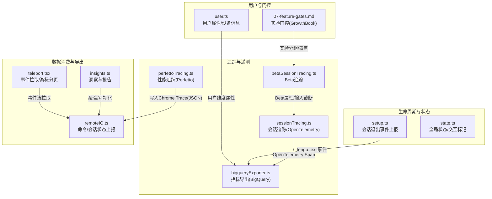
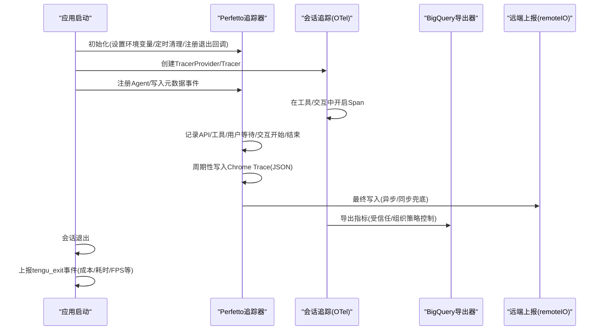
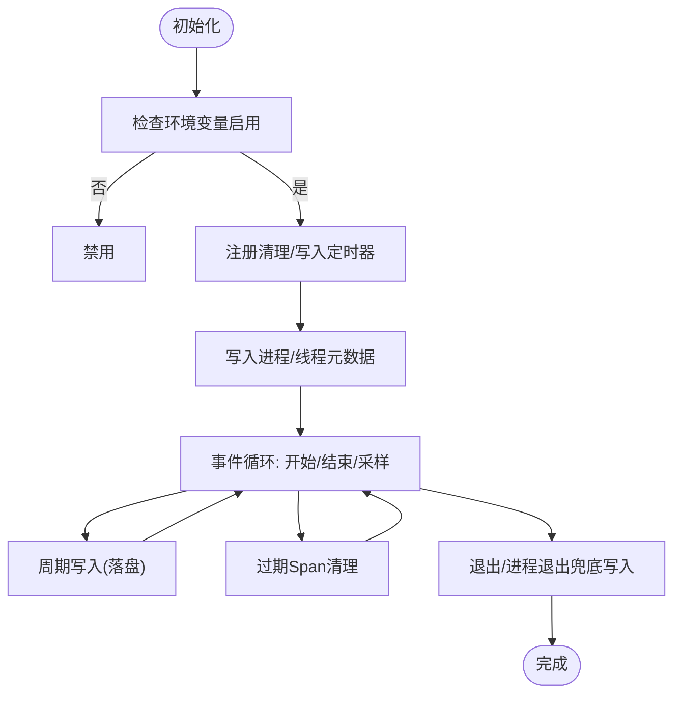
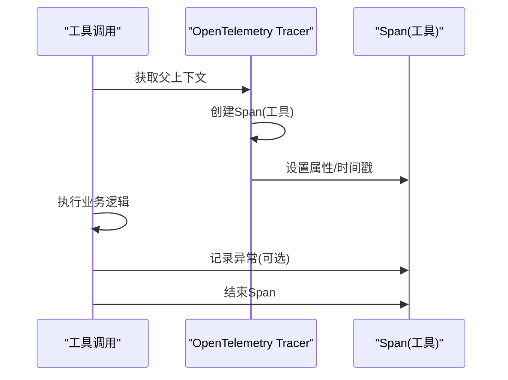
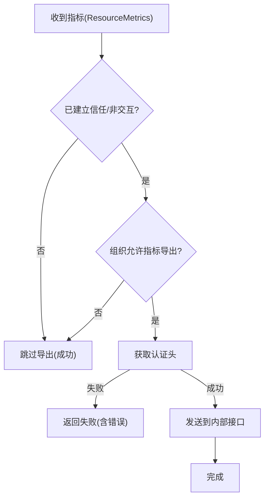
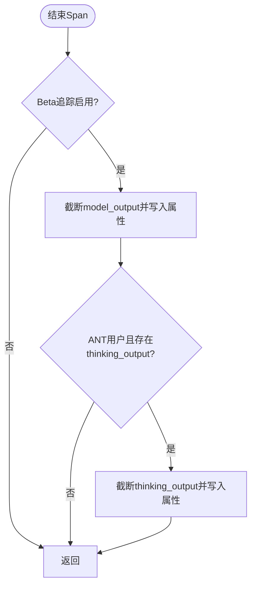
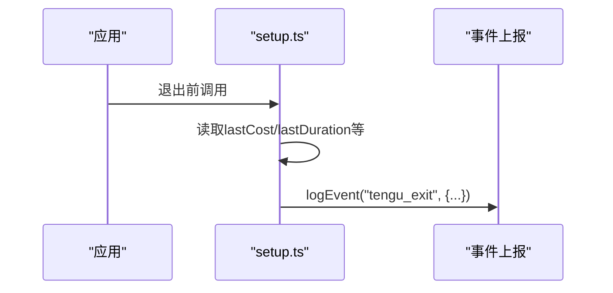
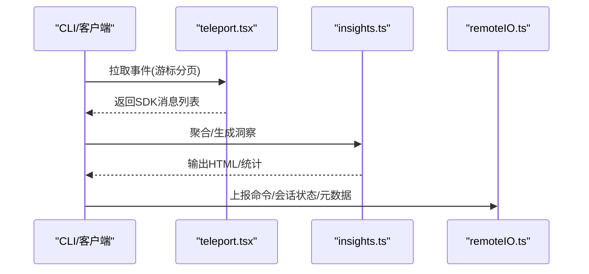
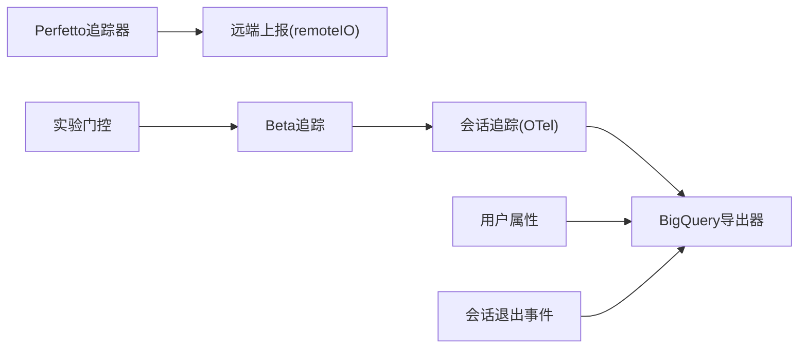

# 追踪监控

<cite>
**本文引用的文件**
- [perfettoTracing.ts](file://src/utils/telemetry/perfettoTracing.ts)
- [sessionTracing.ts](file://src/utils/telemetry/sessionTracing.ts)
- [bigqueryExporter.ts](file://src/utils/telemetry/bigqueryExporter.ts)
- [betaSessionTracing.ts](file://src/utils/telemetry/betaSessionTracing.ts)
- [setup.ts](file://src/setup.ts)
- [state.ts](file://src/bootstrap/state.ts)
- [user.ts](file://src/utils/user.ts)
- [insights.ts](file://src/commands/insights.ts)
- [remoteIO.ts](file://src/cli/remoteIO.ts)
- [teleport.tsx](file://src/utils/teleport.tsx)
- [07-feature-gates.md](file://docs/07-feature-gates.md)
</cite>

## 目录
1. [简介](#简介)
2. [项目结构](#项目结构)
3. [核心组件](#核心组件)
4. [架构总览](#架构总览)
5. [详细组件分析](#详细组件分析)
6. [依赖关系分析](#依赖关系分析)
7. [性能考量](#性能考量)
8. [故障排查指南](#故障排查指南)
9. [结论](#结论)
10. [附录](#附录)

## 简介
本文件系统性梳理本仓库中的追踪监控体系，涵盖以下方面：
- 会话追踪：用户行为追踪、会话生命周期管理、关键事件记录
- 性能追踪：Perfetto 集成、性能数据采集与分析报告生成
- Beta 版本追踪：实验数据收集、用户行为分析与功能效果评估
- 可视化展示：调用链图、性能热力图与用户体验分析
- 配置选项、隐私保护与数据导出

## 项目结构
追踪监控相关代码主要分布在如下模块：
- 会话与性能追踪：src/utils/telemetry 下的 perfettoTracing.ts、sessionTracing.ts、betaSessionTracing.ts、bigqueryExporter.ts
- 生命周期与状态：src/bootstrap/state.ts、src/setup.ts
- 用户与实验门控：src/utils/user.ts、docs/07-feature-gates.md
- 数据消费与导出：src/commands/insights.ts、src/cli/remoteIO.ts、src/utils/teleport.tsx

**图表来源**
- [perfettoTracing.ts:253-335](file://src/utils/telemetry/perfettoTracing.ts#L253-L335)
- [sessionTracing.ts:778-833](file://src/utils/telemetry/sessionTracing.ts#L778-L833)
- [bigqueryExporter.ts:87-128](file://src/utils/telemetry/bigqueryExporter.ts#L87-L128)
- [setup.ts:448-477](file://src/setup.ts#L448-L477)
- [state.ts:1043-1099](file://src/bootstrap/state.ts#L1043-L1099)
- [user.ts:104-152](file://src/utils/user.ts#L104-L152)
- [insights.ts:1612-2719](file://src/commands/insights.ts#L1612-L2719)
- [remoteIO.ts:140-172](file://src/cli/remoteIO.ts#L140-L172)
- [teleport.tsx:657-695](file://src/utils/teleport.tsx#L657-L695)

**章节来源**
- [perfettoTracing.ts:253-335](file://src/utils/telemetry/perfettoTracing.ts#L253-L335)
- [sessionTracing.ts:778-833](file://src/utils/telemetry/sessionTracing.ts#L778-L833)
- [bigqueryExporter.ts:87-128](file://src/utils/telemetry/bigqueryExporter.ts#L87-L128)
- [setup.ts:448-477](file://src/setup.ts#L448-L477)
- [state.ts:1043-1099](file://src/bootstrap/state.ts#L1043-L1099)
- [user.ts:104-152](file://src/utils/user.ts#L104-L152)
- [insights.ts:1612-2719](file://src/commands/insights.ts#L1612-L2719)
- [remoteIO.ts:140-172](file://src/cli/remoteIO.ts#L140-L172)
- [teleport.tsx:657-695](file://src/utils/teleport.tsx#L657-L695)

## 核心组件
- Perfetto 性能追踪器：以 Chrome Trace JSON 格式记录 API 调用、工具执行、用户等待、交互等事件，支持周期落盘、过期清理与最终收尾写入。
- 会话级 OpenTelemetry 追踪：在工具调用、交互上下文中创建/嵌套 Span，统一记录属性与异常，便于调用链分析。
- BigQuery 指标导出器：按组织策略与信任状态决定是否导出，负责认证头注入与传输。
- Beta 版本追踪增强：对响应内容进行安全截断，仅在特定环境暴露敏感思考输出；为工具输入添加 Beta 属性。
- 会话退出事件上报：在应用退出时汇总最近一次会话的成本、耗时、FPS 等指标并上报。
- 实验门控与用户属性：通过 GrowthBook 提供远程实验评估，结合用户设备、订阅等级等属性。

**章节来源**
- [perfettoTracing.ts:253-335](file://src/utils/telemetry/perfettoTracing.ts#L253-L335)
- [sessionTracing.ts:778-833](file://src/utils/telemetry/sessionTracing.ts#L778-L833)
- [bigqueryExporter.ts:87-128](file://src/utils/telemetry/bigqueryExporter.ts#L87-L128)
- [betaSessionTracing.ts:417-456](file://src/utils/telemetry/betaSessionTracing.ts#L417-L456)
- [setup.ts:448-477](file://src/setup.ts#L448-L477)
- [07-feature-gates.md:141-151](file://docs/07-feature-gates.md#L141-L151)

## 架构总览
下图展示了从初始化到数据落盘/上报的关键流程：

**图表来源**
- [perfettoTracing.ts:253-335](file://src/utils/telemetry/perfettoTracing.ts#L253-L335)
- [perfettoTracing.ts:990-1071](file://src/utils/telemetry/perfettoTracing.ts#L990-L1071)
- [sessionTracing.ts:778-833](file://src/utils/telemetry/sessionTracing.ts#L778-L833)
- [bigqueryExporter.ts:87-128](file://src/utils/telemetry/bigqueryExporter.ts#L87-L128)
- [remoteIO.ts:140-172](file://src/cli/remoteIO.ts#L140-L172)
- [setup.ts:448-477](file://src/setup.ts#L448-L477)

## 详细组件分析

### Perfetto 性能追踪器
- 初始化与环境控制
  - 通过环境变量触发启用，注册多层清理与兜底写入（周期写入、退出回调、进程退出）。
  - 维护元数据事件集合与事件缓冲，上限容量与“半量淘汰”策略保证内存与存储可控。
- 代理/进程建模
  - 为每个 Agent 分配唯一进程/线程 ID，并在 UI 中标注父子关系。
- 事件类型与生命周期
  - API 调用、工具执行、用户输入等待、交互等待等，均以“开始/结束”事件记录，支持采样阶段细分。
- 容错与收尾
  - 对悬而未决的 Span 进行过期清理与强制关闭，确保 Trace 可解析且不丢失关键信息。

**图表来源**
- [perfettoTracing.ts:253-335](file://src/utils/telemetry/perfettoTracing.ts#L253-L335)
- [perfettoTracing.ts:187-247](file://src/utils/telemetry/perfettoTracing.ts#L187-L247)
- [perfettoTracing.ts:990-1071](file://src/utils/telemetry/perfettoTracing.ts#L990-L1071)

**章节来源**
- [perfettoTracing.ts:94-123](file://src/utils/telemetry/perfettoTracing.ts#L94-L123)
- [perfettoTracing.ts:253-335](file://src/utils/telemetry/perfettoTracing.ts#L253-L335)
- [perfettoTracing.ts:425-463](file://src/utils/telemetry/perfettoTracing.ts#L425-L463)
- [perfettoTracing.ts:687-763](file://src/utils/telemetry/perfettoTracing.ts#L687-L763)
- [perfettoTracing.ts:765-835](file://src/utils/telemetry/perfettoTracing.ts#L765-L835)
- [perfettoTracing.ts:948-1071](file://src/utils/telemetry/perfettoTracing.ts#L948-L1071)

### 会话级 OpenTelemetry 追踪
- 上下文传播
  - 在工具调用与交互上下文中创建子 Span，继承父 Span 上下文，便于构建完整调用链。
- 异常与属性
  - 自动记录异常与自定义属性，支持在测试或无追踪环境下降级运行。
- 全局状态
  - 提供交互/非交互模式标记，影响部分遥测行为。

**图表来源**
- [sessionTracing.ts:788-833](file://src/utils/telemetry/sessionTracing.ts#L788-L833)
- [state.ts:1057-1067](file://src/bootstrap/state.ts#L1057-L1067)

**章节来源**
- [sessionTracing.ts:778-833](file://src/utils/telemetry/sessionTracing.ts#L778-L833)
- [state.ts:1043-1099](file://src/bootstrap/state.ts#L1043-L1099)

### BigQuery 指标导出器
- 信任与组织策略
  - 仅在已建立信任或非交互模式下导出；组织级别可整体关闭指标导出。
- 认证与传输
  - 注入认证头，失败时返回明确错误码，避免阻断主流程。
- 数据转换
  - 将内部指标转换为内部格式后发送。

**图表来源**
- [bigqueryExporter.ts:87-128](file://src/utils/telemetry/bigqueryExporter.ts#L87-L128)

**章节来源**
- [bigqueryExporter.ts:87-128](file://src/utils/telemetry/bigqueryExporter.ts#L87-L128)

### Beta 版本追踪增强
- 响应内容截断
  - 对模型输出与思考输出进行长度截断与原长度记录，保障隐私与体积控制。
- 工具输入属性
  - 在 Beta 模式下为工具输入序列化参数打上属性，便于回溯与分析。
- 环境限制
  - 仅在特定用户类型可见敏感思考输出。

**图表来源**
- [betaSessionTracing.ts:417-456](file://src/utils/telemetry/betaSessionTracing.ts#L417-L456)

**章节来源**
- [betaSessionTracing.ts:417-456](file://src/utils/telemetry/betaSessionTracing.ts#L417-L456)

### 会话退出事件上报
- 触发时机
  - 应用退出时汇总最近一次会话的成本、耗时、FPS 等指标并上报。
- 数据字段
  - 包括 API 时延、工具时延、总时长、增删行数、Token 数、FPS 统计、会话 ID 与附加指标。

**图表来源**
- [setup.ts:448-477](file://src/setup.ts#L448-L477)

**章节来源**
- [setup.ts:448-477](file://src/setup.ts#L448-L477)

### 用户属性与实验门控
- 用户属性
  - 设备 ID、会话 ID、邮箱、平台、组织/账户 UUID、用户类型、订阅等级、速率限制等级、首次 Token 时间等。
- 实验门控
  - GrowthBook SDK 远程评估，内部用户 20 分钟刷新，外部用户 6 小时刷新，支持磁盘缓存与 UI 覆盖。

**章节来源**
- [user.ts:104-152](file://src/utils/user.ts#L104-L152)
- [07-feature-gates.md:141-151](file://docs/07-feature-gates.md#L141-L151)

### 数据消费与导出
- 洞察与报告
  - 聚合会话 Facet、目标类别、结果、满意度、摩擦度等，生成可视化图表与导出结构。
- 事件流拉取
  - 通过游标分页拉取事件，过滤无关类型，支持跳过元数据。
- 远端上报
  - 将命令生命周期、会话状态变更、元数据变化上报至远端。

**图表来源**
- [teleport.tsx:657-695](file://src/utils/teleport.tsx#L657-L695)
- [insights.ts:1612-2719](file://src/commands/insights.ts#L1612-L2719)
- [remoteIO.ts:140-172](file://src/cli/remoteIO.ts#L140-L172)

**章节来源**
- [insights.ts:1612-2719](file://src/commands/insights.ts#L1612-L2719)
- [teleport.tsx:657-695](file://src/utils/teleport.tsx#L657-L695)
- [remoteIO.ts:140-172](file://src/cli/remoteIO.ts#L140-L172)

## 依赖关系分析
- 组件耦合
  - Perfetto 追踪器与远端上报模块松耦合，通过文件落盘与兜底写入保障可靠性。
  - 会话追踪与 BigQuery 导出器通过通用指标接口连接，受信任与组织策略约束。
  - Beta 追踪增强依赖用户属性与实验门控，确保只在授权范围内生效。
- 外部依赖
  - GrowthBook SDK 用于远程实验评估与覆盖。
  - OpenTelemetry 提供 Tracer/TracerProvider 与 Span 生命周期管理。

**图表来源**
- [perfettoTracing.ts:253-335](file://src/utils/telemetry/perfettoTracing.ts#L253-L335)
- [sessionTracing.ts:778-833](file://src/utils/telemetry/sessionTracing.ts#L778-L833)
- [bigqueryExporter.ts:87-128](file://src/utils/telemetry/bigqueryExporter.ts#L87-L128)
- [betaSessionTracing.ts:417-456](file://src/utils/telemetry/betaSessionTracing.ts#L417-L456)
- [user.ts:104-152](file://src/utils/user.ts#L104-L152)
- [07-feature-gates.md:141-151](file://docs/07-feature-gates.md#L141-L151)
- [setup.ts:448-477](file://src/setup.ts#L448-L477)

**章节来源**
- [perfettoTracing.ts:253-335](file://src/utils/telemetry/perfettoTracing.ts#L253-L335)
- [sessionTracing.ts:778-833](file://src/utils/telemetry/sessionTracing.ts#L778-L833)
- [bigqueryExporter.ts:87-128](file://src/utils/telemetry/bigqueryExporter.ts#L87-L128)
- [betaSessionTracing.ts:417-456](file://src/utils/telemetry/betaSessionTracing.ts#L417-L456)
- [user.ts:104-152](file://src/utils/user.ts#L104-L152)
- [07-feature-gates.md:141-151](file://docs/07-feature-gates.md#L141-L151)
- [setup.ts:448-477](file://src/setup.ts#L448-L477)

## 性能考量
- Perfetto 追踪
  - 事件上限与半量淘汰策略降低内存峰值；周期写入避免长时间驻留内存；过期 Span 清理防止悬挂事件堆积。
  - 微秒级时间戳与分类标签便于 UI 聚类与筛选。
- OpenTelemetry 追踪
  - 通过弱引用与强引用映射管理活跃 Span，减少泄漏风险；异常自动记录提升可观测性。
- 指标导出
  - 受信任与组织策略控制，避免不必要的网络开销；认证失败快速失败，不影响主流程。

[本节为通用性能讨论，无需具体文件引用]

## 故障排查指南
- Perfetto 追踪未生成文件
  - 检查环境变量是否启用；确认写入路径可写；查看周期写入与退出写入日志。
  - 关注“trace_truncated”标记，确认是否达到事件上限。
- 会话追踪无数据
  - 确认已初始化 TracerProvider/Tracer；检查上下文是否正确传播；查看异常记录。
- 指标未上报
  - 检查信任状态与组织策略；核对认证头是否注入；关注返回的错误码。
- 事件拉取异常
  - 检查游标与分页参数；确认过滤规则是否导致遗漏；验证超时与状态码。

**章节来源**
- [perfettoTracing.ts:990-1071](file://src/utils/telemetry/perfettoTracing.ts#L990-L1071)
- [sessionTracing.ts:778-833](file://src/utils/telemetry/sessionTracing.ts#L778-L833)
- [bigqueryExporter.ts:87-128](file://src/utils/telemetry/bigqueryExporter.ts#L87-L128)
- [teleport.tsx:657-695](file://src/utils/teleport.tsx#L657-L695)

## 结论
本追踪监控体系通过 Perfetto 与 OpenTelemetry 的组合，实现了从底层性能到高层会话行为的全链路观测；借助 BigQuery 导出器与实验门控，兼顾了数据价值与隐私合规；通过洞察与事件流拉取，形成闭环的数据消费与反馈机制。建议在生产环境中合理配置阈值与采样策略，持续优化落盘与上报路径，确保可观测性与性能的平衡。

[本节为总结性内容，无需具体文件引用]

## 附录

### 配置选项与环境变量
- Perfetto 启用
  - 通过环境变量触发初始化，注册清理与兜底写入。
- 实验门控
  - GrowthBook SDK 远程评估，内部用户 20 分钟刷新，外部用户 6 小时刷新。
- 指标导出
  - 受信任状态与组织策略控制；认证头由导出器注入。

**章节来源**
- [perfettoTracing.ts:253-335](file://src/utils/telemetry/perfettoTracing.ts#L253-L335)
- [07-feature-gates.md:141-151](file://docs/07-feature-gates.md#L141-L151)
- [bigqueryExporter.ts:87-128](file://src/utils/telemetry/bigqueryExporter.ts#L87-L128)

### 隐私保护与数据最小化
- 内容截断
  - 对模型输出与思考输出进行截断，保留原始长度以便复原。
- 条件可见性
  - 仅在特定用户类型可见敏感思考输出。
- 组织策略
  - 组织可整体关闭指标导出，避免不必要的数据外传。

**章节来源**
- [betaSessionTracing.ts:417-456](file://src/utils/telemetry/betaSessionTracing.ts#L417-L456)
- [bigqueryExporter.ts:87-128](file://src/utils/telemetry/bigqueryExporter.ts#L87-L128)

### 数据导出与可视化
- 导出格式
  - 洞察导出结构包含元数据、聚合数据、洞察结果与 Facet 汇总。
- 可视化
  - 生成响应时间直方图、满意度/摩擦度分布等图表卡片。
- 事件流
  - 支持游标分页拉取事件，过滤无关类型，便于离线分析。

**章节来源**
- [insights.ts:2652-2689](file://src/commands/insights.ts#L2652-L2689)
- [insights.ts:1612-2719](file://src/commands/insights.ts#L1612-L2719)
- [teleport.tsx:657-695](file://src/utils/teleport.tsx#L657-L695)