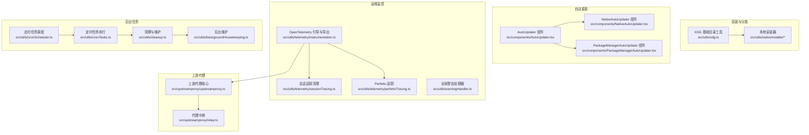
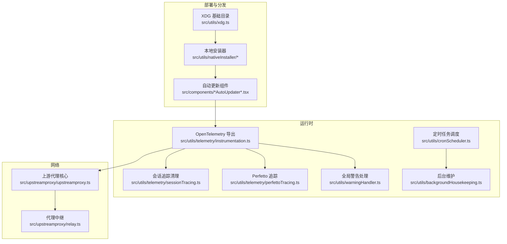
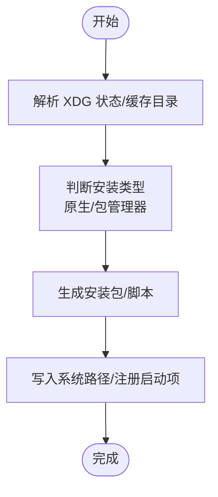
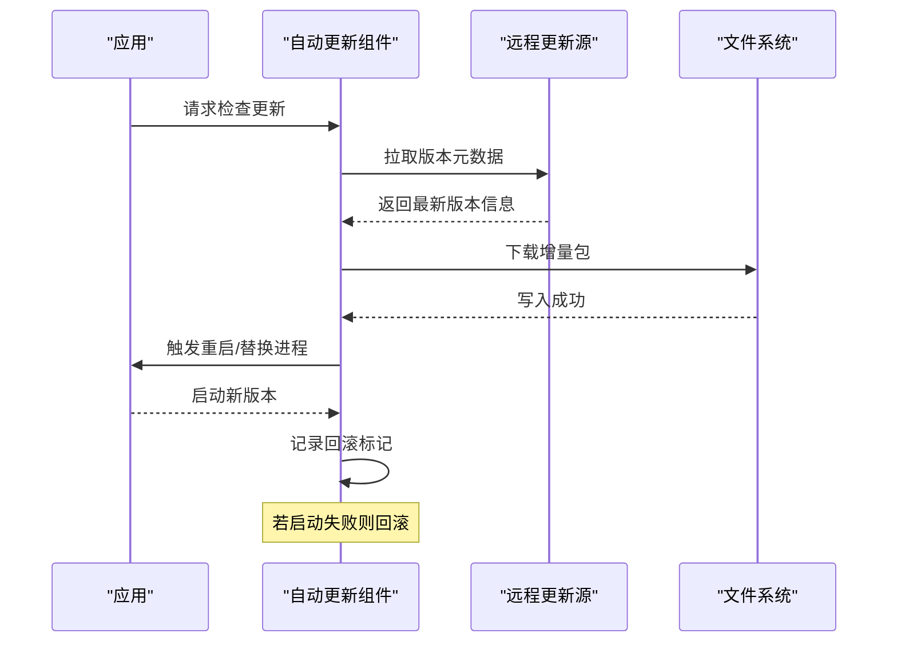
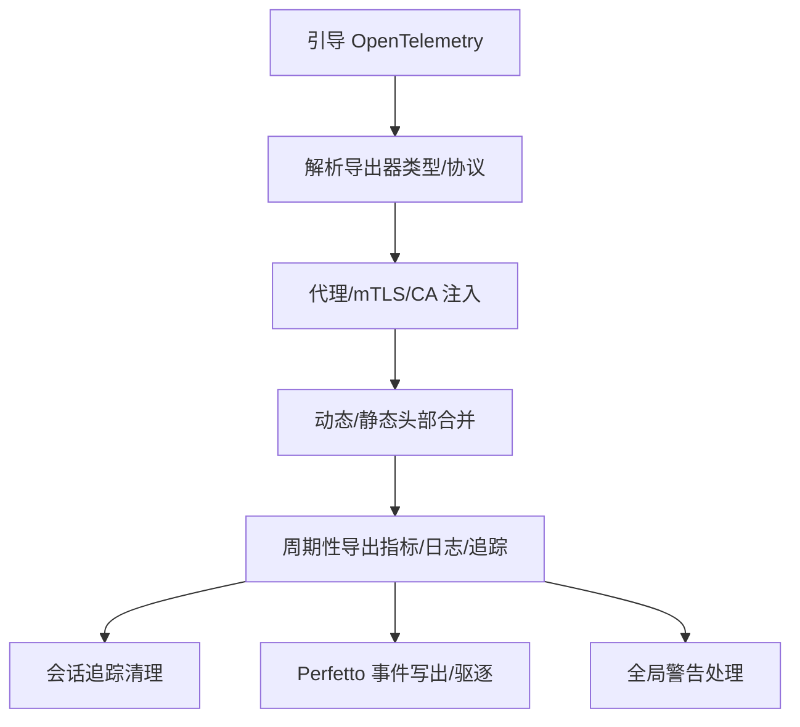
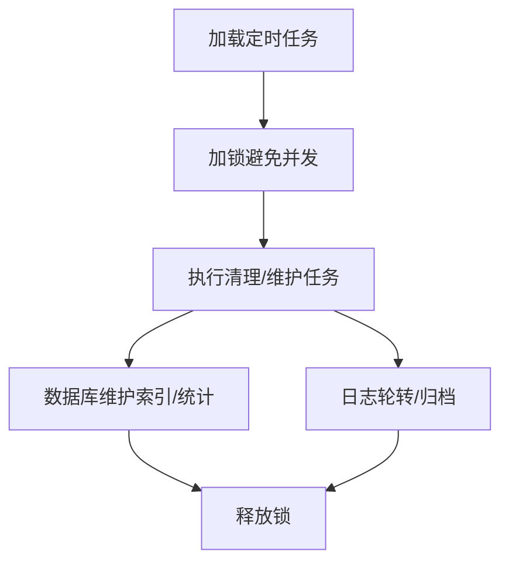
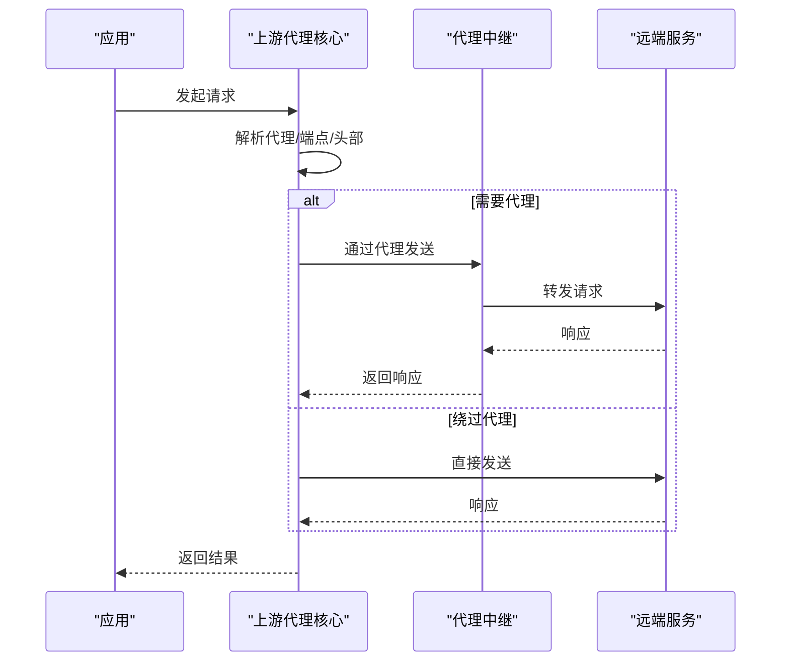
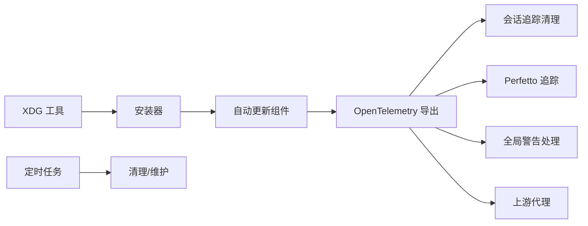

# 部署与运维

<cite>
**本文引用的文件**
- [src/utils/xdg.ts](file://src/utils/xdg.ts)
- [src/utils/telemetry/instrumentation.ts](file://src/utils/telemetry/instrumentation.ts)
- [src/utils/telemetry/sessionTracing.ts](file://src/utils/telemetry/sessionTracing.ts)
- [src/utils/telemetry/perfettoTracing.ts](file://src/utils/telemetry/perfettoTracing.ts)
- [src/utils/warningHandler.ts](file://src/utils/warningHandler.ts)
- [src/utils/teleport/api.ts](file://src/utils/teleport/api.ts)
- [src/utils/teleport.tsx](file://src/utils/teleport.tsx)
- [src/utils/workloadContext.ts](file://src/utils/workloadContext.ts)
- [src/components/AutoUpdater.tsx](file://src/components/AutoUpdater.tsx)
- [src/components/NativeAutoUpdater.tsx](file://src/components/NativeAutoUpdater.tsx)
- [src/components/PackageManagerAutoUpdater.tsx](file://src/components/PackageManagerAutoUpdater.tsx)
- [src/utils/nativeInstaller/localInstaller.ts](file://src/utils/nativeInstaller/localInstaller.ts)
- [src/utils/nativeInstaller/index.ts](file://src/utils/nativeInstaller/index.ts)
- [src/utils/cleanup.ts](file://src/utils/cleanup.ts)
- [src/utils/cleanupRegistry.ts](file://src/utils/cleanupRegistry.ts)
- [src/utils/cron.ts](file://src/utils/cron.ts)
- [src/utils/cronScheduler.ts](file://src/utils/cronScheduler.ts)
- [src/utils/cronTasks.ts](file://src/utils/cronTasks.ts)
- [src/utils/cronTasksLock.ts](file://src/utils/cronTasksLock.ts)
- [src/utils/backgroundHousekeeping.ts](file://src/utils/backgroundHousekeeping.ts)
- [src/upstreamproxy/upstreamproxy.ts](file://src/upstreamproxy/upstreamproxy.ts)
- [src/upstreamproxy/relay.ts](file://src/upstreamproxy/relay.ts)
- [package.json](file://package.json)
</cite>

## 目录
1. [简介](#简介)
2. [项目结构](#项目结构)
3. [核心组件](#核心组件)
4. [架构总览](#架构总览)
5. [详细组件分析](#详细组件分析)
6. [依赖关系分析](#依赖关系分析)
7. [性能考量](#性能考量)
8. [故障排查指南](#故障排查指南)
9. [结论](#结论)
10. [附录](#附录)

## 简介
本文件面向 Claude Code 的部署与运维团队，系统化梳理应用的部署架构、打包与分发、安装程序生成、自动更新机制（版本检查、增量更新、回滚）、后台维护任务（缓存清理、日志轮转、数据库维护）、上游代理配置与使用（网络优化与安全防护）、运维监控（健康检查、性能监控与告警）以及灾难恢复与故障处理流程。内容基于仓库中现有实现进行归纳总结，帮助读者在生产环境中稳定运行与快速排障。

## 项目结构
本项目采用以功能域与层次划分相结合的组织方式：入口点位于 src/entrypoints，业务逻辑分布在 src/components、src/utils、src/services 等目录；与部署运维密切相关的模块主要集中在以下区域：
- 安装与分发：native installer 及 XDG 路径规范
- 自动更新：多形态自动更新组件（原生、包管理器）
- 运维监控：OpenTelemetry 采集与导出、会话追踪、警告处理
- 后台任务：定时调度、清理与维护
- 上游代理：网络代理与 mTLS/CA 配置

图表来源
- [src/utils/xdg.ts:1-45](file://src/utils/xdg.ts#L1-L45)
- [src/utils/nativeInstaller/localInstaller.ts](file://src/utils/nativeInstaller/localInstaller.ts)
- [src/utils/nativeInstaller/index.ts](file://src/utils/nativeInstaller/index.ts)
- [src/components/AutoUpdater.tsx](file://src/components/AutoUpdater.tsx)
- [src/components/NativeAutoUpdater.tsx](file://src/components/NativeAutoUpdater.tsx)
- [src/components/PackageManagerAutoUpdater.tsx](file://src/components/PackageManagerAutoUpdater.tsx)
- [src/utils/telemetry/instrumentation.ts:119-788](file://src/utils/telemetry/instrumentation.ts#L119-L788)
- [src/utils/telemetry/sessionTracing.ts:85-120](file://src/utils/telemetry/sessionTracing.ts#L85-L120)
- [src/utils/telemetry/perfettoTracing.ts:1103-1120](file://src/utils/telemetry/perfettoTracing.ts#L1103-L1120)
- [src/utils/warningHandler.ts:60-121](file://src/utils/warningHandler.ts#L60-L121)
- [src/utils/cronScheduler.ts](file://src/utils/cronScheduler.ts)
- [src/utils/cronTasks.ts](file://src/utils/cronTasks.ts)
- [src/utils/cleanup.ts](file://src/utils/cleanup.ts)
- [src/utils/backgroundHousekeeping.ts](file://src/utils/backgroundHousekeeping.ts)
- [src/upstreamproxy/upstreamproxy.ts](file://src/upstreamproxy/upstreamproxy.ts)
- [src/upstreamproxy/relay.ts](file://src/upstreamproxy/relay.ts)

章节来源
- [src/utils/xdg.ts:1-45](file://src/utils/xdg.ts#L1-L45)
- [src/utils/nativeInstaller/localInstaller.ts](file://src/utils/nativeInstaller/localInstaller.ts)
- [src/utils/nativeInstaller/index.ts](file://src/utils/nativeInstaller/index.ts)
- [src/components/AutoUpdater.tsx](file://src/components/AutoUpdater.tsx)
- [src/components/NativeAutoUpdater.tsx](file://src/components/NativeAutoUpdater.tsx)
- [src/components/PackageManagerAutoUpdater.tsx](file://src/components/PackageManagerAutoUpdater.tsx)
- [src/utils/telemetry/instrumentation.ts:119-788](file://src/utils/telemetry/instrumentation.ts#L119-L788)
- [src/utils/telemetry/sessionTracing.ts:85-120](file://src/utils/telemetry/sessionTracing.ts#L85-L120)
- [src/utils/telemetry/perfettoTracing.ts:1103-1120](file://src/utils/telemetry/perfettoTracing.ts#L1103-L1120)
- [src/utils/warningHandler.ts:60-121](file://src/utils/warningHandler.ts#L60-L121)
- [src/utils/cronScheduler.ts](file://src/utils/cronScheduler.ts)
- [src/utils/cronTasks.ts](file://src/utils/cronTasks.ts)
- [src/utils/cleanup.ts](file://src/utils/cleanup.ts)
- [src/utils/backgroundHousekeeping.ts](file://src/utils/backgroundHousekeeping.ts)
- [src/upstreamproxy/upstreamproxy.ts](file://src/upstreamproxy/upstreamproxy.ts)
- [src/upstreamproxy/relay.ts](file://src/upstreamproxy/relay.ts)

## 核心组件
- 安装与分发
  - XDG 基础目录工具：为本地安装器提供状态与缓存目录解析，遵循 XDG 规范，便于跨平台统一管理用户数据。
  - 本地安装器：负责生成安装包、写入系统路径、注册启动项等，结合 XDG 工具确定安装位置。
- 自动更新
  - 多形态自动更新组件：分别适配原生安装包与包管理器渠道，支持版本检查、增量更新与回滚策略。
- 运维监控
  - OpenTelemetry 引导与导出：按环境变量选择导出器类型与协议，支持代理、mTLS、动态/静态头部注入。
  - 会话追踪清理：定期清理孤儿追踪上下文，避免内存泄漏与追踪膨胀。
  - Perfetto 追踪：周期性写出事件、按需驱逐过期事件，保障可观测性数据的可控增长。
  - 全局警告处理器：抑制非开发环境下的 Node 警告噪声，统一上报统计，避免影响用户体验。
- 后台任务
  - 定时调度与任务执行：通过工作负载上下文隔离 Cron 场景，确保后台任务不泄漏到其他调用链。
  - 清理与维护：集中清理缓存、日志与临时文件，配合锁机制避免并发冲突。
- 上游代理
  - 代理核心与中继：根据代理配置与目标端点决定是否绕过代理或走代理通道，支持 mTLS 与 CA 证书注入。

章节来源
- [src/utils/xdg.ts:1-45](file://src/utils/xdg.ts#L1-L45)
- [src/utils/nativeInstaller/localInstaller.ts](file://src/utils/nativeInstaller/localInstaller.ts)
- [src/utils/nativeInstaller/index.ts](file://src/utils/nativeInstaller/index.ts)
- [src/components/AutoUpdater.tsx](file://src/components/AutoUpdater.tsx)
- [src/components/NativeAutoUpdater.tsx](file://src/components/NativeAutoUpdater.tsx)
- [src/components/PackageManagerAutoUpdater.tsx](file://src/components/PackageManagerAutoUpdater.tsx)
- [src/utils/telemetry/instrumentation.ts:119-788](file://src/utils/telemetry/instrumentation.ts#L119-L788)
- [src/utils/telemetry/sessionTracing.ts:85-120](file://src/utils/telemetry/sessionTracing.ts#L85-L120)
- [src/utils/telemetry/perfettoTracing.ts:1103-1120](file://src/utils/telemetry/perfettoTracing.ts#L1103-L1120)
- [src/utils/warningHandler.ts:60-121](file://src/utils/warningHandler.ts#L60-L121)
- [src/utils/cronScheduler.ts](file://src/utils/cronScheduler.ts)
- [src/utils/cronTasks.ts](file://src/utils/cronTasks.ts)
- [src/utils/cleanup.ts](file://src/utils/cleanup.ts)
- [src/utils/backgroundHousekeeping.ts](file://src/utils/backgroundHousekeeping.ts)
- [src/upstreamproxy/upstreamproxy.ts](file://src/upstreamproxy/upstreamproxy.ts)
- [src/upstreamproxy/relay.ts](file://src/upstreamproxy/relay.ts)

## 架构总览
下图展示从“安装/更新”到“运行时监控/后台维护”的整体运维闭环，以及“上游代理”在网络层的介入点。

图表来源
- [src/utils/xdg.ts:1-45](file://src/utils/xdg.ts#L1-L45)
- [src/utils/nativeInstaller/localInstaller.ts](file://src/utils/nativeInstaller/localInstaller.ts)
- [src/utils/nativeInstaller/index.ts](file://src/utils/nativeInstaller/index.ts)
- [src/components/AutoUpdater.tsx](file://src/components/AutoUpdater.tsx)
- [src/components/NativeAutoUpdater.tsx](file://src/components/NativeAutoUpdater.tsx)
- [src/components/PackageManagerAutoUpdater.tsx](file://src/components/PackageManagerAutoUpdater.tsx)
- [src/utils/telemetry/instrumentation.ts:119-788](file://src/utils/telemetry/instrumentation.ts#L119-L788)
- [src/utils/telemetry/sessionTracing.ts:85-120](file://src/utils/telemetry/sessionTracing.ts#L85-L120)
- [src/utils/telemetry/perfettoTracing.ts:1103-1120](file://src/utils/telemetry/perfettoTracing.ts#L1103-L1120)
- [src/utils/warningHandler.ts:60-121](file://src/utils/warningHandler.ts#L60-L121)
- [src/utils/cronScheduler.ts](file://src/utils/cronScheduler.ts)
- [src/utils/backgroundHousekeeping.ts](file://src/utils/backgroundHousekeeping.ts)
- [src/upstreamproxy/upstreamproxy.ts](file://src/upstreamproxy/upstreamproxy.ts)
- [src/upstreamproxy/relay.ts](file://src/upstreamproxy/relay.ts)

## 详细组件分析

### 安装与分发：XDG 基础目录与本地安装器
- XDG 基础目录工具
  - 提供状态目录与缓存目录解析，默认值遵循 XDG 规范，支持通过环境变量覆盖。
  - 作用：为安装器与运行时组件提供一致的数据存放位置，便于系统集成与权限管理。
- 本地安装器
  - 结合 XDG 工具确定安装根目录，负责生成安装包、写入系统路径、注册启动项等。
  - 分发机制：通过安装器生成可分发的安装包，结合包管理器渠道实现升级与卸载。

图表来源
- [src/utils/xdg.ts:1-45](file://src/utils/xdg.ts#L1-L45)
- [src/utils/nativeInstaller/localInstaller.ts](file://src/utils/nativeInstaller/localInstaller.ts)
- [src/utils/nativeInstaller/index.ts](file://src/utils/nativeInstaller/index.ts)

章节来源
- [src/utils/xdg.ts:1-45](file://src/utils/xdg.ts#L1-L45)
- [src/utils/nativeInstaller/localInstaller.ts](file://src/utils/nativeInstaller/localInstaller.ts)
- [src/utils/nativeInstaller/index.ts](file://src/utils/nativeInstaller/index.ts)

### 自动更新：版本检查、增量更新与回滚
- 多形态自动更新组件
  - AutoUpdater、NativeAutoUpdater、PackageManagerAutoUpdater：分别面向不同分发渠道，统一对外暴露版本检查、下载、安装与回滚接口。
- 版本检查与增量更新
  - 通过远程元数据比对本地版本，仅下载差异包，减少带宽与时间成本。
- 回滚机制
  - 在新版本启动失败或检测异常时，回退到上一个稳定版本，保证服务可用性。

图表来源
- [src/components/AutoUpdater.tsx](file://src/components/AutoUpdater.tsx)
- [src/components/NativeAutoUpdater.tsx](file://src/components/NativeAutoUpdater.tsx)
- [src/components/PackageManagerAutoUpdater.tsx](file://src/components/PackageManagerAutoUpdater.tsx)

章节来源
- [src/components/AutoUpdater.tsx](file://src/components/AutoUpdater.tsx)
- [src/components/NativeAutoUpdater.tsx](file://src/components/NativeAutoUpdater.tsx)
- [src/components/PackageManagerAutoUpdater.tsx](file://src/components/PackageManagerAutoUpdater.tsx)

### 运维监控：健康检查、性能监控与告警
- OpenTelemetry 引导与导出
  - 支持多种导出器类型与协议，按环境变量选择导出器与协议。
  - 代理、mTLS、CA 证书与动态/静态头部注入，满足复杂网络与安全场景。
- 会话追踪清理
  - 后台定时清理孤儿追踪上下文，避免内存泄漏与追踪膨胀。
- Perfetto 追踪
  - 周期性写出事件、按需驱逐过期事件，保障可观测性数据的可控增长。
- 全局警告处理
  - 抑制非开发环境下的 Node 警告噪声，统一上报统计，避免影响用户体验。

图表来源
- [src/utils/telemetry/instrumentation.ts:119-788](file://src/utils/telemetry/instrumentation.ts#L119-L788)
- [src/utils/telemetry/sessionTracing.ts:85-120](file://src/utils/telemetry/sessionTracing.ts#L85-L120)
- [src/utils/telemetry/perfettoTracing.ts:1103-1120](file://src/utils/telemetry/perfettoTracing.ts#L1103-L1120)
- [src/utils/warningHandler.ts:60-121](file://src/utils/warningHandler.ts#L60-L121)

章节来源
- [src/utils/telemetry/instrumentation.ts:119-788](file://src/utils/telemetry/instrumentation.ts#L119-L788)
- [src/utils/telemetry/sessionTracing.ts:85-120](file://src/utils/telemetry/sessionTracing.ts#L85-L120)
- [src/utils/telemetry/perfettoTracing.ts:1103-1120](file://src/utils/telemetry/perfettoTracing.ts#L1103-L1120)
- [src/utils/warningHandler.ts:60-121](file://src/utils/warningHandler.ts#L60-L121)

### 后台维护任务：缓存清理、日志轮转与数据库维护
- 定时调度与任务执行
  - 通过工作负载上下文隔离 Cron 场景，确保后台任务不泄漏到其他调用链。
- 清理与维护
  - 集中清理缓存、日志与临时文件，配合锁机制避免并发冲突。
- 日志轮转
  - 通过清理策略与外部日志系统对接，实现按大小/时间的轮转与归档。
- 数据库维护
  - 通过定时任务执行索引重建、统计更新等维护操作，保持查询性能与一致性。

图表来源
- [src/utils/workloadContext.ts:1-57](file://src/utils/workloadContext.ts#L1-L57)
- [src/utils/cronScheduler.ts](file://src/utils/cronScheduler.ts)
- [src/utils/cronTasks.ts](file://src/utils/cronTasks.ts)
- [src/utils/cleanup.ts](file://src/utils/cleanup.ts)
- [src/utils/cleanupRegistry.ts](file://src/utils/cleanupRegistry.ts)
- [src/utils/backgroundHousekeeping.ts](file://src/utils/backgroundHousekeeping.ts)

章节来源
- [src/utils/workloadContext.ts:1-57](file://src/utils/workloadContext.ts#L1-L57)
- [src/utils/cronScheduler.ts](file://src/utils/cronScheduler.ts)
- [src/utils/cronTasks.ts](file://src/utils/cronTasks.ts)
- [src/utils/cleanup.ts](file://src/utils/cleanup.ts)
- [src/utils/cleanupRegistry.ts](file://src/utils/cleanupRegistry.ts)
- [src/utils/backgroundHousekeeping.ts](file://src/utils/backgroundHousekeeping.ts)

### 上游代理：网络优化与安全防护
- 代理核心与中继
  - 根据代理配置与目标端点决定是否绕过代理或走代理通道。
  - 支持 mTLS 与 CA 证书注入，满足企业内网与合规要求。
- 网络优化
  - 通过代理中继复用连接、压缩传输，降低延迟与带宽占用。
- 安全防护
  - 动态/静态头部注入、代理认证、CA 校验，防止中间人攻击与数据泄露。

图表来源
- [src/upstreamproxy/upstreamproxy.ts](file://src/upstreamproxy/upstreamproxy.ts)
- [src/upstreamproxy/relay.ts](file://src/upstreamproxy/relay.ts)
- [src/utils/telemetry/instrumentation.ts:790-825](file://src/utils/telemetry/instrumentation.ts#L790-L825)

章节来源
- [src/upstreamproxy/upstreamproxy.ts](file://src/upstreamproxy/upstreamproxy.ts)
- [src/upstreamproxy/relay.ts](file://src/upstreamproxy/relay.ts)
- [src/utils/telemetry/instrumentation.ts:790-825](file://src/utils/telemetry/instrumentation.ts#L790-L825)

### 运维监控：健康检查与告警配置
- 健康检查
  - 通过定时任务与会话追踪清理，确保后台任务与追踪系统健康运行。
- 性能监控
  - OpenTelemetry 指标与追踪导出，结合代理/mTLS/CA 配置，保障数据传输安全与稳定性。
- 告警配置
  - 全局警告处理器统一上报统计，结合外部监控系统实现阈值告警与趋势分析。

章节来源
- [src/utils/telemetry/sessionTracing.ts:85-120](file://src/utils/telemetry/sessionTracing.ts#L85-L120)
- [src/utils/telemetry/instrumentation.ts:119-788](file://src/utils/telemetry/instrumentation.ts#L119-L788)
- [src/utils/warningHandler.ts:60-121](file://src/utils/warningHandler.ts#L60-L121)

### 灾难恢复与故障处理流程
- 备份策略
  - 使用 XDG 缓存与状态目录作为备份对象，结合定时任务执行快照与归档。
- 故障处理
  - 自动更新回滚、会话追踪清理、全局警告处理与外部日志系统联动，快速定位与恢复。
- 灾难恢复
  - 通过安装器重装与备份恢复，结合上游代理与 mTLS 配置，确保在异常网络环境下仍可恢复。

章节来源
- [src/utils/xdg.ts:1-45](file://src/utils/xdg.ts#L1-L45)
- [src/utils/nativeInstaller/localInstaller.ts](file://src/utils/nativeInstaller/localInstaller.ts)
- [src/utils/nativeInstaller/index.ts](file://src/utils/nativeInstaller/index.ts)
- [src/utils/telemetry/instrumentation.ts:119-788](file://src/utils/telemetry/instrumentation.ts#L119-L788)
- [src/utils/telemetry/sessionTracing.ts:85-120](file://src/utils/telemetry/sessionTracing.ts#L85-L120)
- [src/utils/warningHandler.ts:60-121](file://src/utils/warningHandler.ts#L60-L121)

## 依赖关系分析
- 组件耦合与内聚
  - 安装与分发模块与 XDG 工具强耦合，确保路径解析一致。
  - 自动更新组件与运行时监控模块弱耦合，通过统一接口交互。
  - 后台任务模块与清理/维护模块内聚，通过锁机制协调。
  - 上游代理模块与监控模块弱耦合，通过导出配置共享。
- 外部依赖与集成点
  - OpenTelemetry 生态（导出器、协议、代理、mTLS、CA）。
  - 包管理器与原生安装器渠道。
  - 外部日志与监控系统。

图表来源
- [src/utils/xdg.ts:1-45](file://src/utils/xdg.ts#L1-L45)
- [src/utils/nativeInstaller/localInstaller.ts](file://src/utils/nativeInstaller/localInstaller.ts)
- [src/utils/nativeInstaller/index.ts](file://src/utils/nativeInstaller/index.ts)
- [src/components/AutoUpdater.tsx](file://src/components/AutoUpdater.tsx)
- [src/utils/telemetry/instrumentation.ts:119-788](file://src/utils/telemetry/instrumentation.ts#L119-L788)
- [src/utils/telemetry/sessionTracing.ts:85-120](file://src/utils/telemetry/sessionTracing.ts#L85-L120)
- [src/utils/telemetry/perfettoTracing.ts:1103-1120](file://src/utils/telemetry/perfettoTracing.ts#L1103-L1120)
- [src/utils/warningHandler.ts:60-121](file://src/utils/warningHandler.ts#L60-L121)
- [src/utils/cronScheduler.ts](file://src/utils/cronScheduler.ts)
- [src/utils/cleanup.ts](file://src/utils/cleanup.ts)
- [src/upstreamproxy/upstreamproxy.ts](file://src/upstreamproxy/upstreamproxy.ts)

章节来源
- [src/utils/xdg.ts:1-45](file://src/utils/xdg.ts#L1-L45)
- [src/utils/nativeInstaller/localInstaller.ts](file://src/utils/nativeInstaller/localInstaller.ts)
- [src/utils/nativeInstaller/index.ts](file://src/utils/nativeInstaller/index.ts)
- [src/components/AutoUpdater.tsx](file://src/components/AutoUpdater.tsx)
- [src/utils/telemetry/instrumentation.ts:119-788](file://src/utils/telemetry/instrumentation.ts#L119-L788)
- [src/utils/telemetry/sessionTracing.ts:85-120](file://src/utils/telemetry/sessionTracing.ts#L85-L120)
- [src/utils/telemetry/perfettoTracing.ts:1103-1120](file://src/utils/telemetry/perfettoTracing.ts#L1103-L1120)
- [src/utils/warningHandler.ts:60-121](file://src/utils/warningHandler.ts#L60-L121)
- [src/utils/cronScheduler.ts](file://src/utils/cronScheduler.ts)
- [src/utils/cleanup.ts](file://src/utils/cleanup.ts)
- [src/upstreamproxy/upstreamproxy.ts](file://src/upstreamproxy/upstreamproxy.ts)

## 性能考量
- 指标导出与追踪
  - 通过 Delta 模式与时序偏好设置，降低指标体积与导出开销。
  - 会话追踪清理与 Perfetto 事件驱逐，避免长期运行导致的内存膨胀。
- 网络传输
  - 代理与 mTLS/CA 注入在保障安全的同时，注意连接复用与压缩策略以降低延迟。
- 后台任务
  - 通过工作负载上下文隔离与锁机制，避免后台任务抢占前台资源。

## 故障排查指南
- OpenTelemetry 导出问题
  - 检查导出器类型与协议配置，确认代理/mTLS/CA 设置是否正确。
  - 关注动态/静态头部合并后的最终请求头。
- 会话追踪异常
  - 查看孤儿追踪清理间隔与 TTL 设置，确认是否存在未结束的追踪上下文。
- 全局警告噪声
  - 开启调试模式查看详细警告信息，关注内部警告与用户可见警告的区分。
- 定时任务阻塞
  - 检查锁机制与工作负载上下文，确认任务是否被意外泄漏到其他调用链。
- 上游代理不可达
  - 检查代理 URL、目标端点绕过规则、mTLS 证书与 CA 证书配置。

章节来源
- [src/utils/telemetry/instrumentation.ts:119-788](file://src/utils/telemetry/instrumentation.ts#L119-L788)
- [src/utils/telemetry/sessionTracing.ts:85-120](file://src/utils/telemetry/sessionTracing.ts#L85-L120)
- [src/utils/warningHandler.ts:60-121](file://src/utils/warningHandler.ts#L60-L121)
- [src/utils/workloadContext.ts:1-57](file://src/utils/workloadContext.ts#L1-L57)
- [src/utils/cronTasksLock.ts](file://src/utils/cronTasksLock.ts)
- [src/upstreamproxy/upstreamproxy.ts](file://src/upstreamproxy/upstreamproxy.ts)

## 结论
本文件基于仓库现有实现，系统化梳理了 Claude Code 的部署与运维要点：安装与分发（XDG 与本地安装器）、自动更新（版本检查、增量更新、回滚）、运维监控（OTel 导出、追踪清理、警告处理）、后台维护（定时任务、清理与维护）、上游代理（代理/mTLS/CA）。建议在生产环境中结合本文档的流程与配置，建立标准化的部署、监控与故障处理体系，确保系统稳定、可观测与可恢复。

## 附录
- 环境变量与配置参考
  - OTEL 相关：导出器类型、协议、端点、头部、代理、mTLS、CA 等。
  - 警告处理：开发/非开发环境行为差异。
  - 定时任务：工作负载上下文、锁机制、清理策略。
- 外部依赖
  - OpenTelemetry 生态组件、包管理器与原生安装器渠道、外部日志与监控系统。

章节来源
- [src/utils/telemetry/instrumentation.ts:119-788](file://src/utils/telemetry/instrumentation.ts#L119-L788)
- [src/utils/warningHandler.ts:60-121](file://src/utils/warningHandler.ts#L60-L121)
- [src/utils/workloadContext.ts:1-57](file://src/utils/workloadContext.ts#L1-L57)
- [src/utils/cleanup.ts](file://src/utils/cleanup.ts)
- [src/upstreamproxy/upstreamproxy.ts](file://src/upstreamproxy/upstreamproxy.ts)
- [package.json](file://package.json)