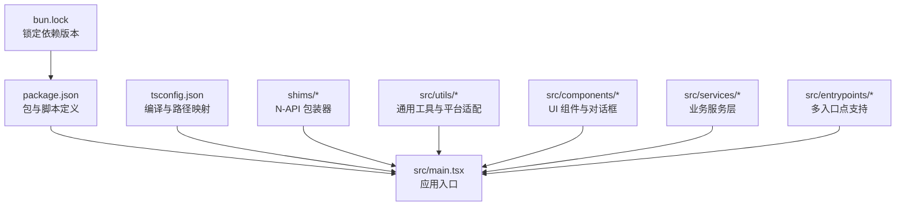
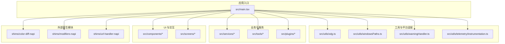
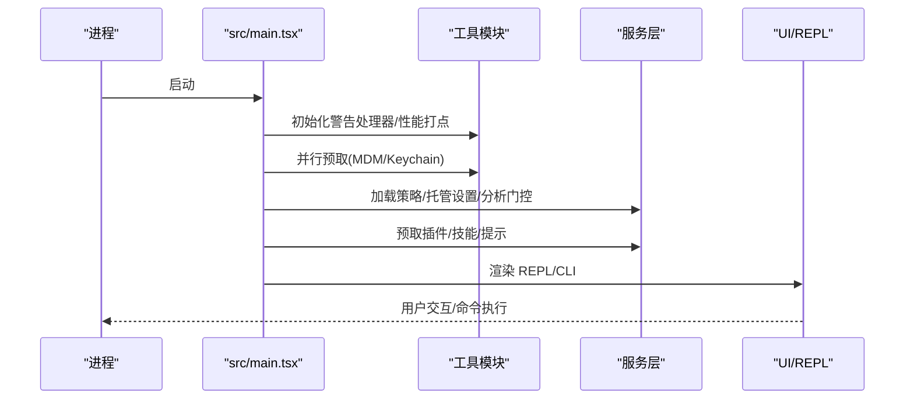
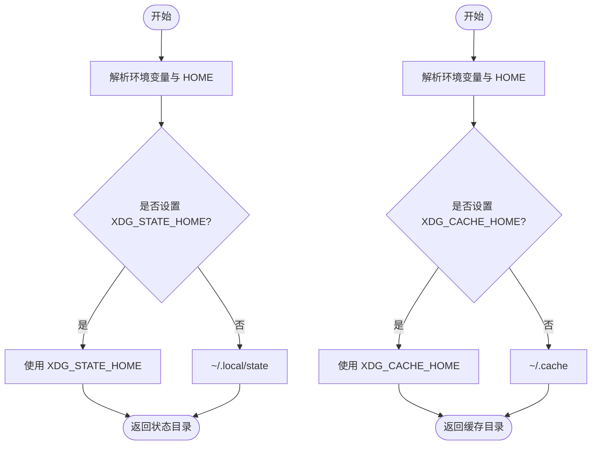
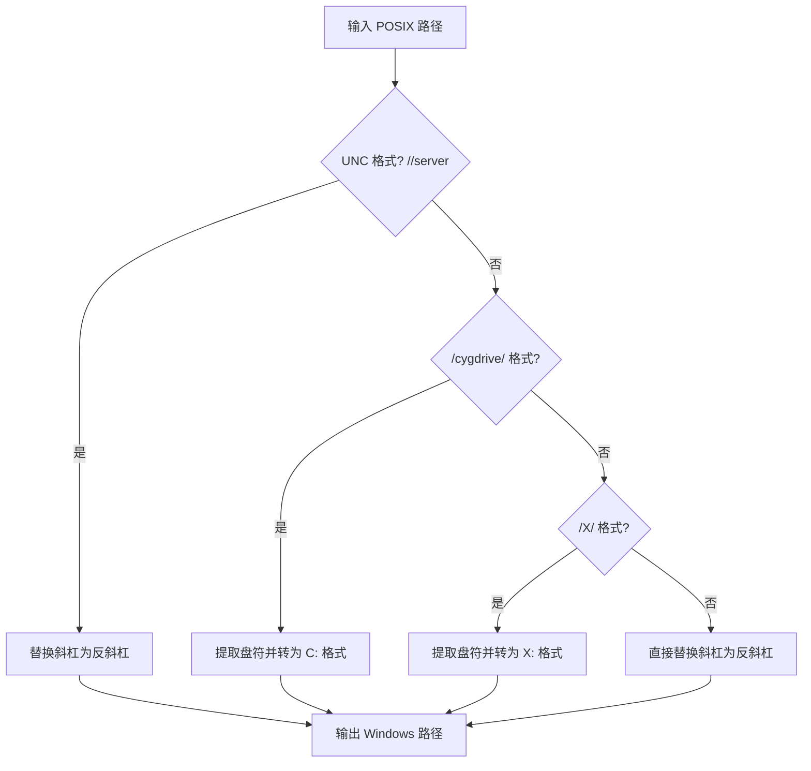
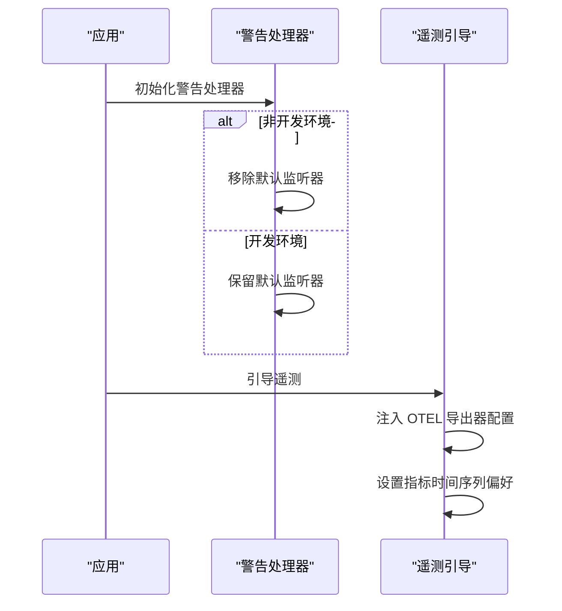
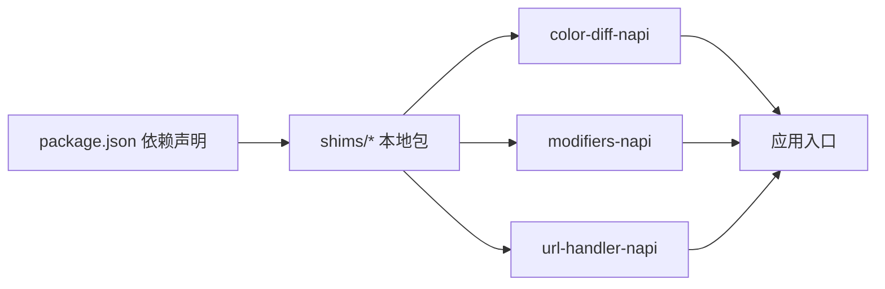
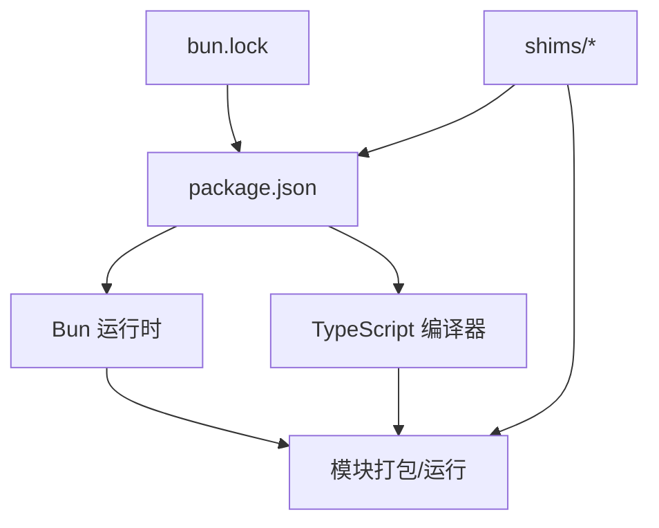

# 部署架构

<cite>
**本文档引用的文件**
- [package.json](file://package.json)
- [tsconfig.json](file://tsconfig.json)
- [bun.lock](file://bun.lock)
- [src/main.tsx](file://src/main.tsx)
- [src/utils/xdg.ts](file://src/utils/xdg.ts)
- [src/utils/windowsPaths.ts](file://src/utils/windowsPaths.ts)
- [src/utils/warningHandler.ts](file://src/utils/warningHandler.ts)
- [src/utils/telemetry/instrumentation.ts](file://src/utils/telemetry/instrumentation.ts)
- [shims/ant-claude-for-chrome-mcp/package.json](file://shims/ant-claude-for-chrome-mcp/package.json)
- [shims/ant-computer-use-input/package.json](file://shims/ant-computer-use-input/package.json)
- [shims/ant-computer-use-mcp/package.json](file://shims/ant-computer-use-mcp/package.json)
- [shims/ant-computer-use-swift/package.json](file://shims/ant-computer-use-swift/package.json)
- [shims/color-diff-napi/package.json](file://shims/color-diff-napi/package.json)
- [shims/modifiers-napi/package.json](file://shims/modifiers-napi/package.json)
- [shims/url-handler-napi/package.json](file://shims/url-handler-napi/package.json)
</cite>

## 目录
1. [简介](#简介)
2. [项目结构](#项目结构)
3. [核心组件](#核心组件)
4. [架构总览](#架构总览)
5. [详细组件分析](#详细组件分析)
6. [依赖关系分析](#依赖关系分析)
7. [性能考虑](#性能考虑)
8. [故障排除指南](#故障排除指南)
9. [结论](#结论)
10. [附录](#附录)

## 简介
本文件系统性阐述 Claude Code 的部署架构与打包流程，重点覆盖以下方面：
- 构建与打包：基于 Bun 的模块化打包、类型与路径配置、N-API 模块集成策略
- 安装与分发：跨平台安装器设计思路（Linux/Windows/macOS）、XDG 路径规范、Windows 路径转换
- 目录结构与文件组织：主进程与渲染进程分离、静态资源与配置管理
- 部署前置准备：环境要求、权限与网络配置
- 最佳实践与常见问题：安全启动、遥测与告警处理、性能优化

## 项目结构
该项目采用以功能域与职责划分的模块化组织方式，核心入口位于 src/main.tsx，配合大量工具函数与服务模块实现完整的 CLI/桌面能力。

图表来源
- [package.json](file://package.json)
- [tsconfig.json](file://tsconfig.json)
- [bun.lock](file://bun.lock)
- [src/main.tsx](file://src/main.tsx)

章节来源
- [package.json](file://package.json)
- [tsconfig.json](file://tsconfig.json)
- [bun.lock](file://bun.lock)
- [src/main.tsx](file://src/main.tsx)

## 核心组件
- 包与运行时
  - 使用 Bun 作为包管理器与运行时，引擎要求 Node ≥ 24.0.0，Bun ≥ 1.3.5
  - scripts 中提供 dev、start、version 等常用命令
- 类型与路径
  - tsconfig 采用 ESNext + bundler 解析，启用 JSX，使用 src/* 路径别名
- N-API 与原生扩展
  - 通过 shims 目录引入多个本地模块（color-diff、modifiers、url-handler），以 file: 协议绑定到本地包
- 工具与平台适配
  - xdg 工具遵循 XDG 规范，提供状态与缓存目录解析
  - windowsPaths 提供 POSIX 到 Windows 路径转换
  - warningHandler 控制 Node 警告输出行为
  - instrumentation 初始化 OpenTelemetry 导出器

章节来源
- [package.json](file://package.json)
- [tsconfig.json](file://tsconfig.json)
- [src/utils/xdg.ts](file://src/utils/xdg.ts)
- [src/utils/windowsPaths.ts](file://src/utils/windowsPaths.ts)
- [src/utils/warningHandler.ts](file://src/utils/warningHandler.ts)
- [src/utils/telemetry/instrumentation.ts](file://src/utils/telemetry/instrumentation.ts)

## 架构总览
下图展示从应用入口到各子系统的调用关系与职责边界：

图表来源
- [src/main.tsx](file://src/main.tsx)
- [src/utils/xdg.ts](file://src/utils/xdg.ts)
- [src/utils/windowsPaths.ts](file://src/utils/windowsPaths.ts)
- [src/utils/warningHandler.ts](file://src/utils/warningHandler.ts)
- [src/utils/telemetry/instrumentation.ts](file://src/utils/telemetry/instrumentation.ts)

## 详细组件分析

### 应用入口与启动流程
- 启动阶段执行多项预热与初始化：
  - 性能打点与并行预取（MDM、Keychain）
  - 设置过滤与早期输入处理
  - 分析器门控与增长实验初始化
  - 远程托管设置与策略加载
  - 插件与技能的预加载
- 交互式与非交互式模式区分，分别控制渲染与提示信息
- 支持多种入口点（CLI、SDK、MCP 服务等）

图表来源
- [src/main.tsx](file://src/main.tsx)
- [src/utils/warningHandler.ts](file://src/utils/warningHandler.ts)

章节来源
- [src/main.tsx](file://src/main.tsx)

### XDG 路径与缓存策略
- getXDGStateHome 与 getXDGCacheHome 提供可配置的状态与缓存目录解析
- 默认值遵循 XDG Base Directory 规范，允许通过环境变量覆盖
- 用于安装器与本地数据的组织，确保跨 Linux 发行版一致性

图表来源
- [src/utils/xdg.ts](file://src/utils/xdg.ts)

章节来源
- [src/utils/xdg.ts](file://src/utils/xdg.ts)

### Windows 路径转换
- posixPathToWindowsPath 支持多种 POSIX 到 Windows 路径格式转换
- 内置缓存提升频繁转换场景下的性能
- 处理 UNC、/cygdrive/ 与普通驱动器盘符等格式

图表来源
- [src/utils/windowsPaths.ts](file://src/utils/windowsPaths.ts)

章节来源
- [src/utils/windowsPaths.ts](file://src/utils/windowsPaths.ts)

### 告警与遥测初始化
- initializeWarningHandler 在非开发环境下移除默认告警处理器，避免污染 stderr 输出
- bootstrapTelemetry 将 ANT_* 构建期变量注入 OTEL 导出器配置，并设置指标时间序列为 delta

图表来源
- [src/utils/warningHandler.ts](file://src/utils/warningHandler.ts)
- [src/utils/telemetry/instrumentation.ts](file://src/utils/telemetry/instrumentation.ts)

章节来源
- [src/utils/warningHandler.ts](file://src/utils/warningHandler.ts)
- [src/utils/telemetry/instrumentation.ts](file://src/utils/telemetry/instrumentation.ts)

### N-API 模块集成
- 通过 shims 目录引入本地模块，使用 file: 协议绑定到本地包
- 典型模块包括 color-diff、modifiers、url-handler，用于图像处理、文本修饰与 URL 处理等能力
- 该模式便于在 Bun/Node 环境中统一管理原生扩展

图表来源
- [package.json](file://package.json)
- [shims/color-diff-napi/package.json](file://shims/color-diff-napi/package.json)
- [shims/modifiers-napi/package.json](file://shims/modifiers-napi/package.json)
- [shims/url-handler-napi/package.json](file://shims/url-handler-napi/package.json)

章节来源
- [package.json](file://package.json)
- [shims/ant-claude-for-chrome-mcp/package.json](file://shims/ant-claude-for-chrome-mcp/package.json)
- [shims/ant-computer-use-input/package.json](file://shims/ant-computer-use-input/package.json)
- [shims/ant-computer-use-mcp/package.json](file://shims/ant-computer-use-mcp/package.json)
- [shims/ant-computer-use-swift/package.json](file://shims/ant-computer-use-swift/package.json)
- [shims/color-diff-napi/package.json](file://shims/color-diff-napi/package.json)
- [shims/modifiers-napi/package.json](file://shims/modifiers-napi/package.json)
- [shims/url-handler-napi/package.json](file://shims/url-handler-napi/package.json)

## 依赖关系分析
- 构建与运行时
  - Bun 作为包管理器与运行时，提供快速冷启动与模块打包能力
  - TypeScript 配置启用 bundler 解析与 JSX，确保前端与后端代码一致的模块化体验
- 依赖锁定
  - bun.lock 锁定所有依赖版本，保证构建一致性与可重复性
- 原生模块
  - 通过 file: 协议将本地 N-API 包纳入依赖树，避免二进制兼容性问题

图表来源
- [package.json](file://package.json)
- [tsconfig.json](file://tsconfig.json)
- [bun.lock](file://bun.lock)

章节来源
- [package.json](file://package.json)
- [tsconfig.json](file://tsconfig.json)
- [bun.lock](file://bun.lock)

## 性能考虑
- 启动性能
  - 并行预取 MDM 与 Keychain，减少首帧阻塞
  - 条件导入与死代码消除（feature 标记）降低运行时体积
- 渲染与交互
  - REPL 渲染后延迟执行部分后台任务，避免抢占主线程
  - 事件循环阻塞检测（仅特定构建）帮助定位性能瓶颈
- 资源与缓存
  - XDG 缓存目录规范化，避免跨发行版差异导致的性能波动
  - Windows 路径转换采用 LRU 缓存，减少重复计算

章节来源
- [src/main.tsx](file://src/main.tsx)
- [src/utils/xdg.ts](file://src/utils/xdg.ts)
- [src/utils/windowsPaths.ts](file://src/utils/windowsPaths.ts)

## 故障排除指南
- 启动被调试器中断
  - 若检测到调试标志或环境变量，入口会直接退出，避免在调试模式下继续执行
- 警告噪声
  - 非开发环境下移除默认警告处理器，减少 stderr 输出；如需查看警告，请切换到开发环境
- 遥测配置
  - ANT_* 变量仅在特定安装类型生效；若未生效，请检查构建环境变量与 OTEL 导出器配置
- 跨平台路径问题
  - Windows 路径转换失败时，优先检查输入路径格式（UNC、/cygdrive、/X/ 等）

章节来源
- [src/main.tsx](file://src/main.tsx)
- [src/utils/warningHandler.ts](file://src/utils/warningHandler.ts)
- [src/utils/telemetry/instrumentation.ts](file://src/utils/telemetry/instrumentation.ts)
- [src/utils/windowsPaths.ts](file://src/utils/windowsPaths.ts)

## 结论
本项目以 Bun 为核心运行时，结合 TypeScript 与模块化架构，实现了高性能、可维护的 CLI/桌面应用。通过 XDG 规范化路径管理、N-API 模块本地化集成以及严格的启动与性能优化策略，为跨平台部署提供了坚实基础。建议在生产环境中严格遵循本文档的部署前置条件与最佳实践，确保安装与运行的稳定性与一致性。

## 附录
- 部署前置准备清单
  - 环境要求：Node ≥ 24.0.0，Bun ≥ 1.3.5
  - 权限配置：Linux 下确保 XDG 目录可写；Windows 下确保用户目录权限正确
  - 网络设置：根据遥测与分析需求配置代理与证书（NODE_EXTRA_CA_CERTS、客户端证书等）
  - 构建一致性：使用 bun.lock 锁定版本，避免依赖漂移