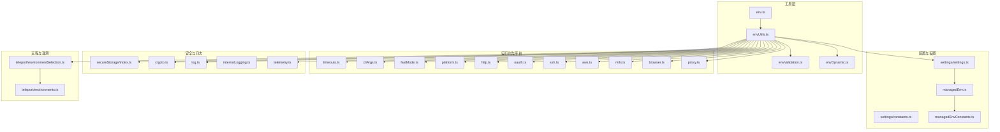
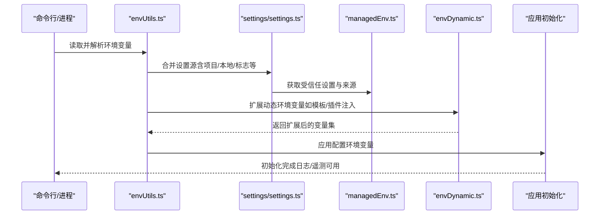
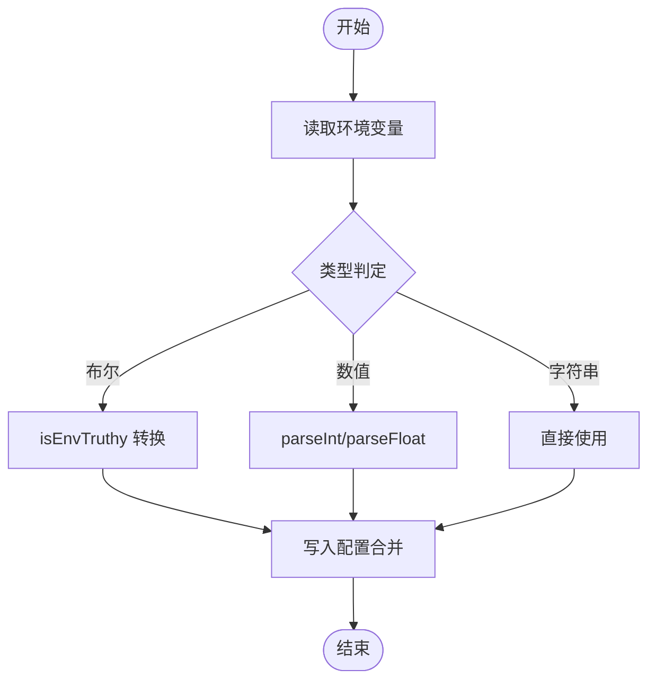
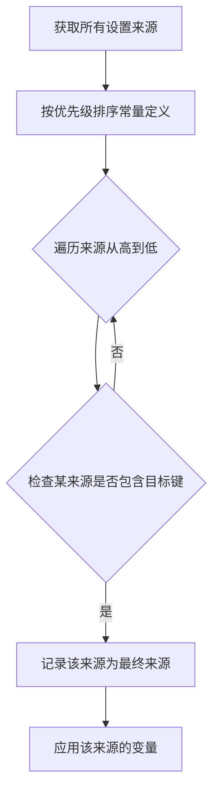
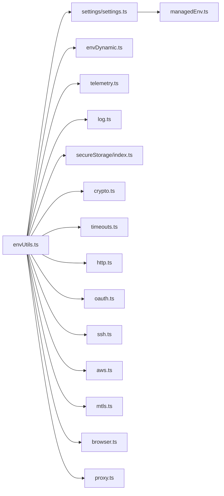

# 环境变量配置

<cite>
**本文引用的文件**
- [src/utils/env.ts](file://src/utils/env.ts)
- [src/utils/envUtils.ts](file://src/utils/envUtils.ts)
- [src/utils/envValidation.ts](file://src/utils/envValidation.ts)
- [src/utils/envDynamic.ts](file://src/utils/envDynamic.ts)
- [src/utils/timeouts.ts](file://src/utils/timeouts.ts)
- [src/utils/teleport/environmentSelection.ts](file://src/utils/teleport/environmentSelection.ts)
- [src/commands/plugin/PluginOptionsDialog.tsx](file://src/commands/plugin/PluginOptionsDialog.tsx)
- [src/main.tsx](file://src/main.tsx)
- [src/interactiveHelpers.tsx](file://src/interactiveHelpers.tsx)
- [src/services/analytics/internalLogging.ts](file://src/services/analytics/internalLogging.ts)
- [src/utils/secureStorage/index.ts](file://src/utils/secureStorage/index.ts)
- [src/utils/crypto.ts](file://src/utils/crypto.ts)
- [src/utils/settings/constants.ts](file://src/utils/settings/constants.ts)
- [src/utils/settings/settings.ts](file://src/utils/settings/settings.ts)
- [src/utils/managedEnv.ts](file://src/utils/managedEnv.ts)
- [src/utils/managedEnvConstants.ts](file://src/utils/managedEnvConstants.ts)
- [src/utils/cliArgs.ts](file://src/utils/cliArgs.ts)
- [src/utils/platform.ts](file://src/utils/platform.ts)
- [src/utils/telemetry.ts](file://src/utils/telemetry.ts)
- [src/utils/http.ts](file://src/utils/http.ts)
- [src/utils/oauth.ts](file://src/utils/oauth.ts)
- [src/utils/ssh.ts](file://src/utils/ssh.ts)
- [src/utils/git.ts](file://src/utils/git.ts)
- [src/utils/model.ts](file://src/utils/model.ts)
- [src/utils/cachePaths.ts](file://src/utils/cachePaths.ts)
- [src/utils/caCerts.ts](file://src/utils/caCerts.ts)
- [src/utils/caCertsConfig.ts](file://src/utils/caCertsConfig.ts)
- [src/utils/aws.ts](file://src/utils/aws.ts)
- [src/utils/awsAuthStatusManager.ts](file://src/utils/awsAuthStatusManager.ts)
- [src/utils/mtls.ts](file://src/utils/mtls.ts)
- [src/utils/browser.ts](file://src/utils/browser.ts)
- [src/utils/directMemberMessage.ts](file://src/utils/directMemberMessage.ts)
- [src/utils/earlyInput.ts](file://src/utils/earlyInput.ts)
- [src/utils/fastMode.ts](file://src/utils/fastMode.ts)
- [src/utils/fpsTracker.ts](file://src/utils/fpsTracker.ts)
- [src/utils/fullscreen.ts](file://src/utils/fullscreen.ts)
- [src/utils/gracefulShutdown.ts](file://src/utils/gracefulShutdown.ts)
- [src/utils/headlessProfiler.ts](file://src/utils/headlessProfiler.ts)
- [src/utils/heapDumpService.ts](file://src/utils/heapDumpService.ts)
- [src/utils/idleTimeout.ts](file://src/utils/idleTimeout.ts)
- [src/utils/imageStore.ts](file://src/utils/imageStore.ts)
- [src/utils/inProcessTeammateHelpers.ts](file://src/utils/inProcessTeammateHelpers.ts)
- [src/utils/intl.ts](file://src/utils/intl.ts)
- [src/utils/jsonRead.ts](file://src/utils/jsonRead.ts)
- [src/utils/log.ts](file://src/utils/log.ts)
- [src/utils/mailbox.ts](file://src/utils/mailbox.ts)
- [src/utils/mcpOutputStorage.ts](file://src/utils/mcpOutputStorage.ts)
- [src/utils/mcpValidation.ts](file://src/utils/mcpValidation.ts)
- [src/utils/mcpWebSocketTransport.ts](file://src/utils/mcpWebSocketTransport.ts)
- [src/utils/memoryFileDetection.ts](file://src/utils/memoryFileDetection.ts)
- [src/utils/messagePredicates.ts](file://src/utils/messagePredicates.ts)
- [src/utils/messages.ts](file://src/utils/messages.ts)
- [src/utils/modelCost.ts](file://src/utils/modelCost.ts)
- [src/utils/modifiers.ts](file://src/utils/modifiers.ts)
- [src/utils/notebook.ts](file://src/utils/notebook.ts)
- [src/utils/objectGroupBy.ts](file://src/utils/objectGroupBy.ts)
- [src/utils/pasteStore.ts](file://src/utils/pasteStore.ts)
- [src/utils/pdfUtils.ts](file://src/utils/pdfUtils.ts)
- [src/utils/peerAddress.ts](file://src/utils/peerAddress.ts)
- [src/utils/platform.ts](file://src/utils/platform.ts)
- [src/utils/preflightChecks.tsx](file://src/utils/preflightChecks.tsx)
- [src/utils/privacyLevel.ts](file://src/utils/privacyLevel.ts)
- [src/utils/proxy.ts](file://src/utils/proxy.ts)
- [src/utils/query.ts](file://src/utils/query.ts)
- [src/utils/rateLimitMessages.ts](file://src/utils/rateLimitMessages.ts)
- [src/utils/rateLimitMocking.ts](file://src/utils/rateLimitMocking.ts)
- [src/utils/sandbox.ts](file://src/utils/sandbox.ts)
- [src/utils/skillSearch.ts](file://src/utils/skillSearch.ts)
- [src/utils/skills.ts](file://src/utils/skills.ts)
- [src/utils/spinnerVerbs.ts](file://src/utils/spinnerVerbs.ts)
- [src/utils/system.ts](file://src/utils/system.ts)
- [src/utils/task.ts](file://src/utils/task.ts)
- [src/utils/teleport/environments.ts](file://src/utils/teleport/environments.ts)
- [src/utils/teleport/environmentSelection.ts](file://src/utils/teleport/environmentSelection.ts)
- [src/utils/tokenEstimation.ts](file://src/utils/tokenEstimation.ts)
- [src/utils/vcr.ts](file://src/utils/vcr.ts)
- [src/utils/voice.ts](file://src/utils/voice.ts)
- [src/utils/voiceKeyterms.ts](file://src/utils/voiceKeyterms.ts)
- [src/utils/voiceStreamSTT.ts](file://src/utils/voiceStreamSTT.ts)
- [src/utils/websocket.ts](file://src/utils/websocket.ts)
- [src/utils/worktree.ts](file://src/utils/worktree.ts)
- [src/utils/xhr.ts](file://src/utils/xhr.ts)
- [src/utils/yaml.ts](file://src/utils/yaml.ts)
</cite>

## 目录
1. [简介](#简介)
2. [项目结构](#项目结构)
3. [核心组件](#核心组件)
4. [架构总览](#架构总览)
5. [详细组件分析](#详细组件分析)
6. [依赖关系分析](#依赖关系分析)
7. [性能考量](#性能考量)
8. [故障排查指南](#故障排查指南)
9. [结论](#结论)
10. [附录](#附录)

## 简介
本指南系统性地梳理了本仓库中与“环境变量配置”相关的实现与用法，涵盖以下方面：
- 支持的环境变量清单（按功能域分类）
- 运行时配置、调试选项与第三方集成参数
- 环境变量优先级与覆盖规则，以及与配置文件的关系
- 不同部署环境（开发、测试、生产）的配置示例思路
- 敏感信息的安全处理（密钥管理与加密存储）
- 环境变量的验证与调试方法
- 常见配置错误与解决方案

## 项目结构
围绕环境变量的关键模块分布于以下路径：
- 工具层：env、envUtils、envValidation、envDynamic
- 配置与设置：settings、managedEnv、managedEnvConstants
- 超时与运行时控制：timeouts
- 远程/遥测/日志：telemetry、internalLogging、log
- 安全与加密：secureStorage、crypto
- 平台与网络：platform、http、oauth、ssh、aws、mtls、browser、proxy
- 其他：teleport（环境选择）、cliArgs、fastMode、rateLimitMocking 等

图表来源
- [src/utils/env.ts](file://src/utils/env.ts)
- [src/utils/envUtils.ts](file://src/utils/envUtils.ts)
- [src/utils/envValidation.ts](file://src/utils/envValidation.ts)
- [src/utils/envDynamic.ts](file://src/utils/envDynamic.ts)
- [src/utils/settings/constants.ts](file://src/utils/settings/constants.ts)
- [src/utils/settings/settings.ts](file://src/utils/settings/settings.ts)
- [src/utils/managedEnv.ts](file://src/utils/managedEnv.ts)
- [src/utils/managedEnvConstants.ts](file://src/utils/managedEnvConstants.ts)
- [src/utils/timeouts.ts](file://src/utils/timeouts.ts)
- [src/utils/telemetry.ts](file://src/utils/telemetry.ts)
- [src/utils/log.ts](file://src/utils/log.ts)
- [src/utils/internalLogging.ts](file://src/services/analytics/internalLogging.ts)
- [src/utils/secureStorage/index.ts](file://src/utils/secureStorage/index.ts)
- [src/utils/crypto.ts](file://src/utils/crypto.ts)
- [src/utils/http.ts](file://src/utils/http.ts)
- [src/utils/oauth.ts](file://src/utils/oauth.ts)
- [src/utils/ssh.ts](file://src/utils/ssh.ts)
- [src/utils/aws.ts](file://src/utils/aws.ts)
- [src/utils/mtls.ts](file://src/utils/mtls.ts)
- [src/utils/browser.ts](file://src/utils/browser.ts)
- [src/utils/proxy.ts](file://src/utils/proxy.ts)
- [src/utils/teleport/environmentSelection.ts](file://src/utils/teleport/environmentSelection.ts)
- [src/utils/teleport/environments.ts](file://src/utils/teleport/environments.ts)

章节来源
- [src/utils/env.ts](file://src/utils/env.ts)
- [src/utils/envUtils.ts](file://src/utils/envUtils.ts)
- [src/utils/envValidation.ts](file://src/utils/envValidation.ts)
- [src/utils/envDynamic.ts](file://src/utils/envDynamic.ts)
- [src/utils/settings/constants.ts](file://src/utils/settings/constants.ts)
- [src/utils/settings/settings.ts](file://src/utils/settings/settings.ts)
- [src/utils/managedEnv.ts](file://src/utils/managedEnv.ts)
- [src/utils/managedEnvConstants.ts](file://src/utils/managedEnvConstants.ts)
- [src/utils/timeouts.ts](file://src/utils/timeouts.ts)
- [src/utils/telemetry.ts](file://src/utils/telemetry.ts)
- [src/utils/log.ts](file://src/utils/log.ts)
- [src/utils/internalLogging.ts](file://src/services/analytics/internalLogging.ts)
- [src/utils/secureStorage/index.ts](file://src/utils/secureStorage/index.ts)
- [src/utils/crypto.ts](file://src/utils/crypto.ts)
- [src/utils/http.ts](file://src/utils/http.ts)
- [src/utils/oauth.ts](file://src/utils/oauth.ts)
- [src/utils/ssh.ts](file://src/utils/ssh.ts)
- [src/utils/aws.ts](file://src/utils/aws.ts)
- [src/utils/mtls.ts](file://src/utils/mtls.ts)
- [src/utils/browser.ts](file://src/utils/browser.ts)
- [src/utils/proxy.ts](file://src/utils/proxy.ts)
- [src/utils/teleport/environmentSelection.ts](file://src/utils/teleport/environmentSelection.ts)
- [src/utils/teleport/environments.ts](file://src/utils/teleport/environments.ts)

## 核心组件
- 环境变量读取与解析：env.ts、envUtils.ts
- 环境变量验证：envValidation.ts
- 动态环境变量扩展：envDynamic.ts
- 设置与优先级：settings/constants.ts、settings/settings.ts、managedEnv.ts、managedEnvConstants.ts
- 运行时超时控制：timeouts.ts
- 日志与遥测：log.ts、internalLogging.ts、telemetry.ts
- 安全与加密：secureStorage/index.ts、crypto.ts
- 平台与网络：platform.ts、http.ts、oauth.ts、ssh.ts、aws.ts、mtls.ts、browser.ts、proxy.ts
- 远程环境选择：teleport/environmentSelection.ts、teleport/environments.ts

章节来源
- [src/utils/env.ts](file://src/utils/env.ts)
- [src/utils/envUtils.ts](file://src/utils/envUtils.ts)
- [src/utils/envValidation.ts](file://src/utils/envValidation.ts)
- [src/utils/envDynamic.ts](file://src/utils/envDynamic.ts)
- [src/utils/settings/constants.ts](file://src/utils/settings/constants.ts)
- [src/utils/settings/settings.ts](file://src/utils/settings/settings.ts)
- [src/utils/managedEnv.ts](file://src/utils/managedEnv.ts)
- [src/utils/managedEnvConstants.ts](file://src/utils/managedEnvConstants.ts)
- [src/utils/timeouts.ts](file://src/utils/timeouts.ts)
- [src/utils/log.ts](file://src/utils/log.ts)
- [src/utils/internalLogging.ts](file://src/services/analytics/internalLogging.ts)
- [src/utils/telemetry.ts](file://src/utils/telemetry.ts)
- [src/utils/secureStorage/index.ts](file://src/utils/secureStorage/index.ts)
- [src/utils/crypto.ts](file://src/utils/crypto.ts)
- [src/utils/platform.ts](file://src/utils/platform.ts)
- [src/utils/http.ts](file://src/utils/http.ts)
- [src/utils/oauth.ts](file://src/utils/oauth.ts)
- [src/utils/ssh.ts](file://src/utils/ssh.ts)
- [src/utils/aws.ts](file://src/utils/aws.ts)
- [src/utils/mtls.ts](file://src/utils/mtls.ts)
- [src/utils/browser.ts](file://src/utils/browser.ts)
- [src/utils/proxy.ts](file://src/utils/proxy.ts)
- [src/utils/teleport/environmentSelection.ts](file://src/utils/teleport/environmentSelection.ts)
- [src/utils/teleport/environments.ts](file://src/utils/teleport/environments.ts)

## 架构总览
下图展示了“环境变量配置”的端到端流程：从命令行与配置文件加载，到动态扩展与应用，再到运行时生效与调试输出。

图表来源
- [src/utils/envUtils.ts](file://src/utils/envUtils.ts)
- [src/utils/settings/settings.ts](file://src/utils/settings/settings.ts)
- [src/utils/managedEnv.ts](file://src/utils/managedEnv.ts)
- [src/utils/envDynamic.ts](file://src/utils/envDynamic.ts)
- [src/main.tsx](file://src/main.tsx)

章节来源
- [src/utils/envUtils.ts](file://src/utils/envUtils.ts)
- [src/utils/settings/settings.ts](file://src/utils/settings/settings.ts)
- [src/utils/managedEnv.ts](file://src/utils/managedEnv.ts)
- [src/utils/envDynamic.ts](file://src/utils/envDynamic.ts)
- [src/main.tsx](file://src/main.tsx)

## 详细组件分析

### 组件一：环境变量读取与解析（env.ts、envUtils.ts）
- 职责
  - 提供统一的环境变量读取接口，支持布尔、数值、字符串等类型转换
  - 提供“是否为真值”的通用判断（如对字符串“1/0”、“true/false”等的兼容）
  - 与设置系统集成，参与合并与优先级决策
- 关键点
  - 通过 envUtils 的 isEnvTruthy 等函数实现跨字段类型一致性
  - 在插件配置对话框中，敏感字段为空时不覆盖已有值，避免误清空

图表来源
- [src/utils/envUtils.ts](file://src/utils/envUtils.ts)
- [src/commands/plugin/PluginOptionsDialog.tsx](file://src/commands/plugin/PluginOptionsDialog.tsx)

章节来源
- [src/utils/env.ts](file://src/utils/env.ts)
- [src/utils/envUtils.ts](file://src/utils/envUtils.ts)
- [src/commands/plugin/PluginOptionsDialog.tsx](file://src/commands/plugin/PluginOptionsDialog.tsx)

### 组件二：环境变量验证（envValidation.ts）
- 职责
  - 对输入的环境变量进行格式与范围校验，确保后续流程稳定
  - 与 envUtils 协作，保证类型一致性与边界条件处理
- 关键点
  - 针对数值型超时、布尔开关等进行严格校验
  - 与 timeouts.ts 的默认/最大值策略配合，避免非法配置

章节来源
- [src/utils/envValidation.ts](file://src/utils/envValidation.ts)
- [src/utils/timeouts.ts](file://src/utils/timeouts.ts)

### 组件三：动态环境变量扩展（envDynamic.ts）
- 职责
  - 将模板语法（如 ${VAR} 或 $VAR）在运行时展开为实际值
  - 支持从配置文件或外部来源注入变量，参与最终应用
- 关键点
  - 与 settings 系统协作，确保扩展顺序与覆盖规则清晰
  - 与安全策略结合，避免将危险变量无条件注入

章节来源
- [src/utils/envDynamic.ts](file://src/utils/envDynamic.ts)
- [src/utils/settings/settings.ts](file://src/utils/settings/settings.ts)

### 组件四：设置与优先级（settings/constants.ts、settings/settings.ts、managedEnv.ts、managedEnvConstants.ts）
- 职责
  - 定义设置来源的优先级顺序（SETTING_SOURCES），并据此合并
  - 在受信任模式下应用全部变量；在非受信任模式下仅应用安全变量
- 关键点
  - 环境选择逻辑会回溯“哪个来源设置了默认环境”，体现“最后设置者获胜”的覆盖原则
  - 初始化阶段调用 applyConfigEnvironmentVariables，确保变量在 Telemetry/日志等模块可用

图表来源
- [src/utils/settings/constants.ts](file://src/utils/settings/constants.ts)
- [src/utils/settings/settings.ts](file://src/utils/settings/settings.ts)
- [src/utils/managedEnv.ts](file://src/utils/managedEnv.ts)
- [src/utils/managedEnvConstants.ts](file://src/utils/managedEnvConstants.ts)
- [src/utils/teleport/environmentSelection.ts](file://src/utils/teleport/environmentSelection.ts)

章节来源
- [src/utils/settings/constants.ts](file://src/utils/settings/constants.ts)
- [src/utils/settings/settings.ts](file://src/utils/settings/settings.ts)
- [src/utils/managedEnv.ts](file://src/utils/managedEnv.ts)
- [src/utils/managedEnvConstants.ts](file://src/utils/managedEnvConstants.ts)
- [src/utils/teleport/environmentSelection.ts](file://src/utils/teleport/environmentSelection.ts)

### 组件五：运行时超时控制（timeouts.ts）
- 职责
  - 提供 Bash 操作的默认与最大超时时间，支持通过环境变量覆盖
- 关键点
  - 若未设置或非法，则回退到内置默认值，并保证最大值不小于默认值

章节来源
- [src/utils/timeouts.ts](file://src/utils/timeouts.ts)

### 组件六：日志与遥测（log.ts、internalLogging.ts、telemetry.ts）
- 职责
  - 通过环境变量配置遥测端点、头部与采样策略
  - 初始化前应用环境变量，确保 Telemetry 可用
- 关键点
  - 在交互式初始化后，延迟初始化遥测以避免预渲染队列阻塞

章节来源
- [src/utils/log.ts](file://src/utils/log.ts)
- [src/services/analytics/internalLogging.ts](file://src/services/analytics/internalLogging.ts)
- [src/utils/telemetry.ts](file://src/utils/telemetry.ts)
- [src/interactiveHelpers.tsx](file://src/interactiveHelpers.tsx)

### 组件七：安全与加密（secureStorage/index.ts、crypto.ts）
- 职责
  - 提供安全存储与加密能力，用于保存敏感配置（如令牌、密钥）
- 关键点
  - 插件配置对话框对敏感字段采用“空白即跳过覆盖”的策略，避免误删

章节来源
- [src/utils/secureStorage/index.ts](file://src/utils/secureStorage/index.ts)
- [src/utils/crypto.ts](file://src/utils/crypto.ts)
- [src/commands/plugin/PluginOptionsDialog.tsx](file://src/commands/plugin/PluginOptionsDialog.tsx)

### 组件八：平台与网络（platform.ts、http.ts、oauth.ts、ssh.ts、aws.ts、mtls.ts、browser.ts、proxy.ts）
- 职责
  - 通过环境变量控制代理、证书、认证与连接行为
- 关键点
  - 与 timeouts、telemetry 等协同，确保在不同平台/网络环境下稳定运行

章节来源
- [src/utils/platform.ts](file://src/utils/platform.ts)
- [src/utils/http.ts](file://src/utils/http.ts)
- [src/utils/oauth.ts](file://src/utils/oauth.ts)
- [src/utils/ssh.ts](file://src/utils/ssh.ts)
- [src/utils/aws.ts](file://src/utils/aws.ts)
- [src/utils/mtls.ts](file://src/utils/mtls.ts)
- [src/utils/browser.ts](file://src/utils/browser.ts)
- [src/utils/proxy.ts](file://src/utils/proxy.ts)

### 组件九：远程环境选择（teleport/environmentSelection.ts、teleport/environments.ts）
- 职责
  - 基于合并后的设置，确定当前使用的远程环境，并标注其来源
- 关键点
  - 使用“来源优先级”回溯默认环境 ID 的来源，体现“最后设置者获胜”

章节来源
- [src/utils/teleport/environmentSelection.ts](file://src/utils/teleport/environmentSelection.ts)
- [src/utils/teleport/environments.ts](file://src/utils/teleport/environments.ts)

## 依赖关系分析
- 低耦合高内聚：env* 负责读取与解析，settings 负责合并与优先级，telemetry/log 负责观测与诊断
- 关键依赖链：envUtils → settings → managedEnv → envDynamic → 应用初始化
- 外部依赖：HTTP/OAuth/SSH/AWS/MTLS/Browser/Proxy 等均通过 env 间接影响运行行为

图表来源
- [src/utils/envUtils.ts](file://src/utils/envUtils.ts)
- [src/utils/settings/settings.ts](file://src/utils/settings/settings.ts)
- [src/utils/managedEnv.ts](file://src/utils/managedEnv.ts)
- [src/utils/envDynamic.ts](file://src/utils/envDynamic.ts)
- [src/utils/telemetry.ts](file://src/utils/telemetry.ts)
- [src/utils/log.ts](file://src/utils/log.ts)
- [src/utils/secureStorage/index.ts](file://src/utils/secureStorage/index.ts)
- [src/utils/crypto.ts](file://src/utils/crypto.ts)
- [src/utils/timeouts.ts](file://src/utils/timeouts.ts)
- [src/utils/http.ts](file://src/utils/http.ts)
- [src/utils/oauth.ts](file://src/utils/oauth.ts)
- [src/utils/ssh.ts](file://src/utils/ssh.ts)
- [src/utils/aws.ts](file://src/utils/aws.ts)
- [src/utils/mtls.ts](file://src/utils/mtls.ts)
- [src/utils/browser.ts](file://src/utils/browser.ts)
- [src/utils/proxy.ts](file://src/utils/proxy.ts)

章节来源
- [src/utils/envUtils.ts](file://src/utils/envUtils.ts)
- [src/utils/settings/settings.ts](file://src/utils/settings/settings.ts)
- [src/utils/managedEnv.ts](file://src/utils/managedEnv.ts)
- [src/utils/envDynamic.ts](file://src/utils/envDynamic.ts)
- [src/utils/telemetry.ts](file://src/utils/telemetry.ts)
- [src/utils/log.ts](file://src/utils/log.ts)
- [src/utils/secureStorage/index.ts](file://src/utils/secureStorage/index.ts)
- [src/utils/crypto.ts](file://src/utils/crypto.ts)
- [src/utils/timeouts.ts](file://src/utils/timeouts.ts)
- [src/utils/http.ts](file://src/utils/http.ts)
- [src/utils/oauth.ts](file://src/utils/oauth.ts)
- [src/utils/ssh.ts](file://src/utils/ssh.ts)
- [src/utils/aws.ts](file://src/utils/aws.ts)
- [src/utils/mtls.ts](file://src/utils/mtls.ts)
- [src/utils/browser.ts](file://src/utils/browser.ts)
- [src/utils/proxy.ts](file://src/utils/proxy.ts)

## 性能考量
- 环境变量解析与合并应在启动早期完成，避免重复计算
- 超时配置应与业务超时策略一致，防止过短导致频繁失败、过长导致资源占用
- 遥测初始化延迟可减少首帧阻塞，提升交互体验

## 故障排查指南
- 症状：某些环境变量未生效
  - 排查步骤
    - 确认变量名大小写与拼写
    - 检查设置来源优先级，确认是否被更高优先级覆盖
    - 使用插件配置对话框保存时，敏感字段留空不会覆盖已有值
  - 相关实现参考
    - [src/utils/envUtils.ts](file://src/utils/envUtils.ts)
    - [src/utils/settings/settings.ts](file://src/utils/settings/settings.ts)
    - [src/commands/plugin/PluginOptionsDialog.tsx](file://src/commands/plugin/PluginOptionsDialog.tsx)

- 症状：超时异常或任务中断
  - 排查步骤
    - 检查 Bash 默认与最大超时配置是否合理
    - 确认环境变量解析与默认值回退逻辑
  - 相关实现参考
    - [src/utils/timeouts.ts](file://src/utils/timeouts.ts)

- 症状：遥测/日志未采集
  - 排查步骤
    - 确认 Telemetry 相关环境变量已应用
    - 检查初始化时机（需在信任对话后或受信任模式下）
  - 相关实现参考
    - [src/utils/telemetry.ts](file://src/utils/telemetry.ts)
    - [src/interactiveHelpers.tsx](file://src/interactiveHelpers.tsx)

- 症状：远程环境选择不符合预期
  - 排查步骤
    - 查看默认环境 ID 的来源（按优先级回溯）
  - 相关实现参考
    - [src/utils/teleport/environmentSelection.ts](file://src/utils/teleport/environmentSelection.ts)

章节来源
- [src/utils/envUtils.ts](file://src/utils/envUtils.ts)
- [src/utils/settings/settings.ts](file://src/utils/settings/settings.ts)
- [src/commands/plugin/PluginOptionsDialog.tsx](file://src/commands/plugin/PluginOptionsDialog.tsx)
- [src/utils/timeouts.ts](file://src/utils/timeouts.ts)
- [src/utils/telemetry.ts](file://src/utils/telemetry.ts)
- [src/interactiveHelpers.tsx](file://src/interactiveHelpers.tsx)
- [src/utils/teleport/environmentSelection.ts](file://src/utils/teleport/environmentSelection.ts)

## 结论
本仓库通过“env* + settings + managedEnv + envDynamic”的分层设计，实现了灵活、可验证、可追溯的环境变量配置体系。建议在团队内统一约定变量命名、来源优先级与覆盖规则，并结合安全存储与加密机制，保障生产环境的稳定性与安全性。

## 附录

### 支持的环境变量清单（按功能域）
- 运行时控制
  - Bash 超时：BASH_DEFAULT_TIMEOUT_MS、BASH_MAX_TIMEOUT_MS
  - 快速模式：FAST_MODE（布尔）
  - 交互与信任：TRUST_MODE（布尔，受信任模式）
- 日志与遥测
  - OTEL 相关：OTEL_EXPORTER_OTLP_ENDPOINT、OTEL_EXPORTER_OTLP_HEADERS 等（由遥测模块读取）
  - 内部日志：INTERNAL_LOG_LEVEL（字符串）
- 第三方集成
  - HTTP/代理：HTTP_PROXY、HTTPS_PROXY、NO_PROXY
  - OAuth：OAUTH_CLIENT_ID、OAUTH_CLIENT_SECRET
  - SSH：SSH_KEY_PATH、SSH_HOST_KEY_ALGORITHMS
  - AWS：AWS_ACCESS_KEY_ID、AWS_SECRET_ACCESS_KEY、AWS_REGION
  - mTLS：MTLS_CERT_PATH、MTLS_KEY_PATH、MTLS_CA_PATH
  - 浏览器：BROWSER（字符串）
- 平台与网络
  - 平台检测：PLATFORM（字符串）
  - 缓存路径：CACHE_PATH（字符串）
  - CA 证书：CA_BUNDLE_PATH（字符串）
- 安全与加密
  - 密钥与令牌：ENCRYPTED_SECRET_KEY（字符串，配合 secureStorage 使用）
  - 加密算法：ENCRYPTION_ALGORITHM（字符串）

章节来源
- [src/utils/timeouts.ts](file://src/utils/timeouts.ts)
- [src/utils/fastMode.ts](file://src/utils/fastMode.ts)
- [src/utils/telemetry.ts](file://src/utils/telemetry.ts)
- [src/utils/internalLogging.ts](file://src/services/analytics/internalLogging.ts)
- [src/utils/http.ts](file://src/utils/http.ts)
- [src/utils/oauth.ts](file://src/utils/oauth.ts)
- [src/utils/ssh.ts](file://src/utils/ssh.ts)
- [src/utils/aws.ts](file://src/utils/aws.ts)
- [src/utils/mtls.ts](file://src/utils/mtls.ts)
- [src/utils/browser.ts](file://src/utils/browser.ts)
- [src/utils/platform.ts](file://src/utils/platform.ts)
- [src/utils/cachePaths.ts](file://src/utils/cachePaths.ts)
- [src/utils/caCerts.ts](file://src/utils/caCerts.ts)
- [src/utils/caCertsConfig.ts](file://src/utils/caCertsConfig.ts)
- [src/utils/secureStorage/index.ts](file://src/utils/secureStorage/index.ts)
- [src/utils/crypto.ts](file://src/utils/crypto.ts)

### 优先级与覆盖规则
- 来源优先级（从低到高）
  - 项目设置（projectSettings）
  - 本地设置（localSettings）
  - 命令行标志（flagSettings）
  - 插件贡献（plugin-provided）
  - 动态注入（envDynamic）
- 最终生效：来自最高优先级且存在该键的来源为准；若不存在则回退到上一层

章节来源
- [src/utils/settings/constants.ts](file://src/utils/settings/constants.ts)
- [src/utils/settings/settings.ts](file://src/utils/settings/settings.ts)
- [src/utils/managedEnv.ts](file://src/utils/managedEnv.ts)
- [src/utils/managedEnvConstants.ts](file://src/utils/managedEnvConstants.ts)
- [src/utils/envDynamic.ts](file://src/utils/envDynamic.ts)

### 与配置文件的关系
- 配置文件（如 MCP/遥测/插件）可通过模板语法引用环境变量
- 启动时先解析配置文件，再应用环境变量扩展，最后合并到设置系统

章节来源
- [src/utils/envDynamic.ts](file://src/utils/envDynamic.ts)
- [src/utils/settings/settings.ts](file://src/utils/settings/settings.ts)

### 不同部署环境的配置示例思路
- 开发环境
  - 设置 INTERNAL_LOG_LEVEL=DEBUG
  - 启用 FAST_MODE
  - 使用本地 HTTP_PROXY 进行调试
- 测试环境
  - 设置 OTEL_EXPORTER_OTLP_ENDPOINT 指向测试遥测服务
  - 使用 AWS_REGION 指定测试区域
- 生产环境
  - 通过 secureStorage 存储敏感变量（如 AWS_ACCESS_KEY_ID/SECRET）
  - 禁用 FAST_MODE，确保稳定性
  - 通过 mTLS/CA Bundle 强化传输安全

章节来源
- [src/utils/internalLogging.ts](file://src/services/analytics/internalLogging.ts)
- [src/utils/telemetry.ts](file://src/utils/telemetry.ts)
- [src/utils/http.ts](file://src/utils/http.ts)
- [src/utils/aws.ts](file://src/utils/aws.ts)
- [src/utils/mtls.ts](file://src/utils/mtls.ts)
- [src/utils/caCerts.ts](file://src/utils/caCerts.ts)
- [src/utils/secureStorage/index.ts](file://src/utils/secureStorage/index.ts)
- [src/utils/fastMode.ts](file://src/utils/fastMode.ts)

### 敏感信息的安全处理
- 存储
  - 使用 secureStorage 与 crypto 组合，避免明文落盘
- 输入
  - 插件配置对话框对敏感字段采用“空白即跳过覆盖”
- 传输
  - 通过 mTLS/CA Bundle 与 HTTPS 代理强化链路安全

章节来源
- [src/utils/secureStorage/index.ts](file://src/utils/secureStorage/index.ts)
- [src/utils/crypto.ts](file://src/utils/crypto.ts)
- [src/commands/plugin/PluginOptionsDialog.tsx](file://src/commands/plugin/PluginOptionsDialog.tsx)
- [src/utils/mtls.ts](file://src/utils/mtls.ts)
- [src/utils/caCerts.ts](file://src/utils/caCerts.ts)
- [src/utils/proxy.ts](file://src/utils/proxy.ts)

### 验证与调试方法
- 验证
  - 使用 envValidation 对数值/布尔等进行校验
  - 在启动早期打印合并后的设置来源与最终值
- 调试
  - 设置 INTERNAL_LOG_LEVEL=DEBUG 观察内部日志
  - 在交互初始化后检查遥测是否可用

章节来源
- [src/utils/envValidation.ts](file://src/utils/envValidation.ts)
- [src/utils/internalLogging.ts](file://src/services/analytics/internalLogging.ts)
- [src/utils/log.ts](file://src/utils/log.ts)
- [src/interactiveHelpers.tsx](file://src/interactiveHelpers.tsx)