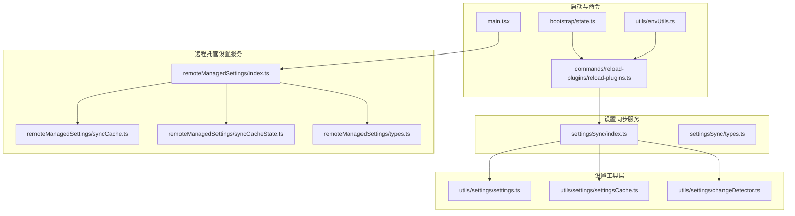
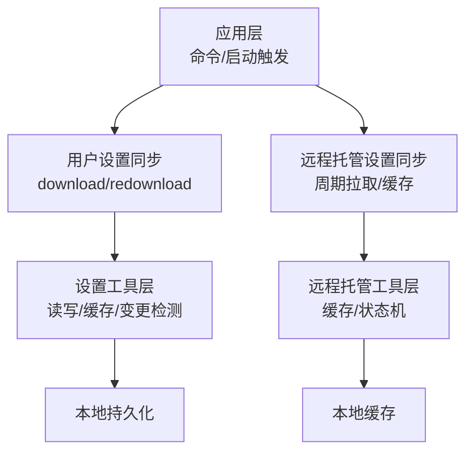
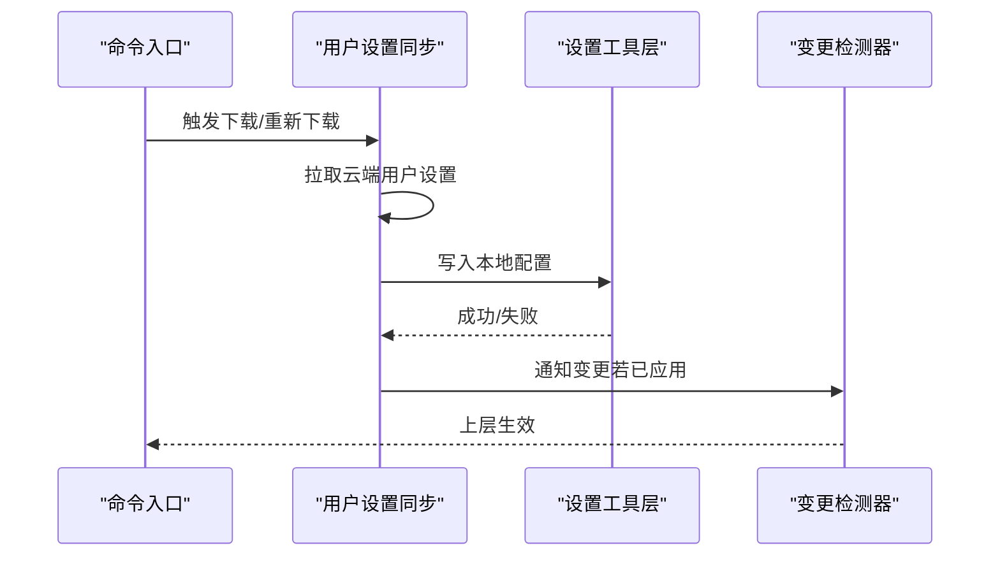
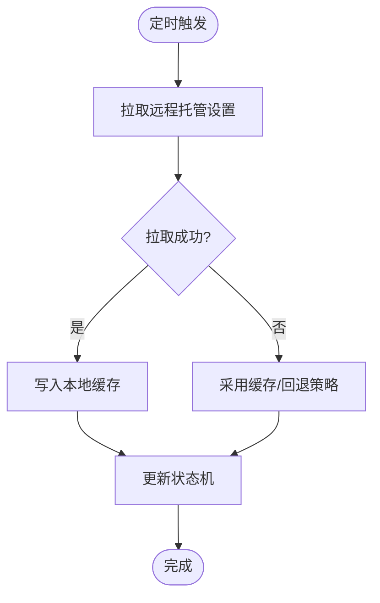
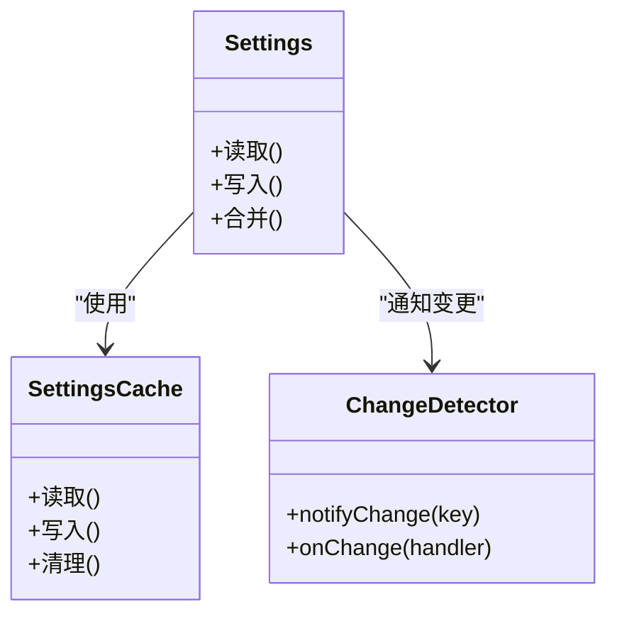
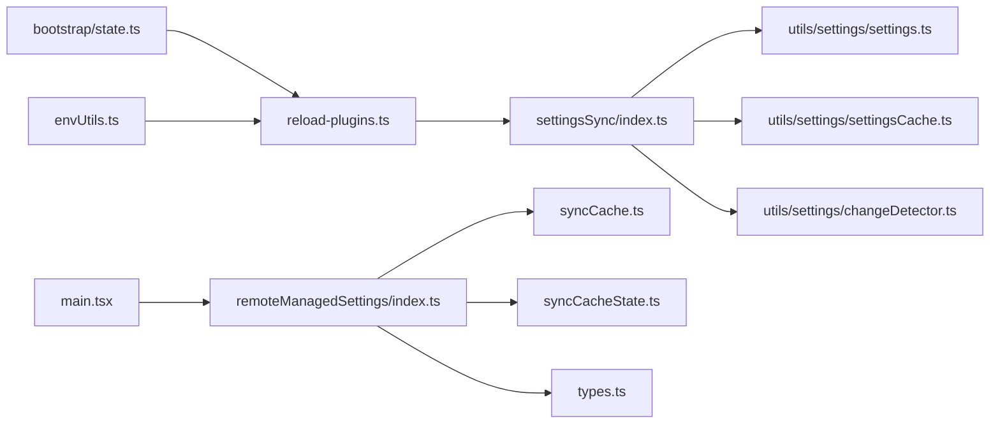

# 设置同步机制

<cite>
**本文引用的文件**
- [src/services/settingsSync/index.ts](file://src/services/settingsSync/index.ts)
- [src/services/settingsSync/types.ts](file://src/services/settingsSync/types.ts)
- [src/services/remoteManagedSettings/index.ts](file://src/services/remoteManagedSettings/index.ts)
- [src/services/remoteManagedSettings/syncCache.ts](file://src/services/remoteManagedSettings/syncCache.ts)
- [src/services/remoteManagedSettings/syncCacheState.ts](file://src/services/remoteManagedSettings/syncCacheState.ts)
- [src/services/remoteManagedSettings/types.ts](file://src/services/remoteManagedSettings/types.ts)
- [src/commands/reload-plugins/reload-plugins.ts](file://src/commands/reload-plugins/reload-plugins.ts)
- [src/utils/settings/settings.ts](file://src/utils/settings/settings.ts)
- [src/utils/settings/settingsCache.ts](file://src/utils/settings/settingsCache.ts)
- [src/utils/settings/changeDetector.ts](file://src/utils/settings/changeDetector.ts)
- [src/bootstrap/state.ts](file://src/bootstrap/state.ts)
- [src/utils/envUtils.ts](file://src/utils/envUtils.ts)
- [src/main.tsx](file://src/main.tsx)
</cite>

## 目录
1. [简介](#简介)
2. [项目结构](#项目结构)
3. [核心组件](#核心组件)
4. [架构总览](#架构总览)
5. [详细组件分析](#详细组件分析)
6. [依赖关系分析](#依赖关系分析)
7. [性能考量](#性能考量)
8. [故障排除指南](#故障排除指南)
9. [结论](#结论)
10. [附录](#附录)

## 简介
本文件系统性阐述本地设置与云端设置的同步机制，覆盖同步原理、协议与冲突解决、数据一致性保障、状态管理（进度、重试、错误处理）、安全机制（加密与传输保护）、性能优化与监控指标，并提供可操作的故障排除步骤。该机制由“用户设置同步”和“远程托管设置”两大子系统协同工作：前者负责从云端拉取用户级配置并应用到本地；后者负责周期性获取并缓存远程托管策略，确保最终一致。

## 项目结构
围绕设置同步的关键目录与文件如下：
- 用户设置同步服务：src/services/settingsSync
- 远程托管设置服务：src/services/remoteManagedSettings
- 设置变更检测与缓存：src/utils/settings
- 启动迁移与环境判断：src/main.tsx、src/bootstrap/state.ts、src/utils/envUtils.ts
- 命令入口触发同步：src/commands/reload-plugins/reload-plugins.ts

图表来源
- [src/services/settingsSync/index.ts](file://src/services/settingsSync/index.ts)
- [src/services/settingsSync/types.ts](file://src/services/settingsSync/types.ts)
- [src/services/remoteManagedSettings/index.ts](file://src/services/remoteManagedSettings/index.ts)
- [src/services/remoteManagedSettings/syncCache.ts](file://src/services/remoteManagedSettings/syncCache.ts)
- [src/services/remoteManagedSettings/syncCacheState.ts](file://src/services/remoteManagedSettings/syncCacheState.ts)
- [src/services/remoteManagedSettings/types.ts](file://src/services/remoteManagedSettings/types.ts)
- [src/utils/settings/settings.ts](file://src/utils/settings/settings.ts)
- [src/utils/settings/settingsCache.ts](file://src/utils/settings/settingsCache.ts)
- [src/utils/settings/changeDetector.ts](file://src/utils/settings/changeDetector.ts)
- [src/commands/reload-plugins/reload-plugins.ts](file://src/commands/reload-plugins/reload-plugins.ts)
- [src/bootstrap/state.ts](file://src/bootstrap/state.ts)
- [src/utils/envUtils.ts](file://src/utils/envUtils.ts)
- [src/main.tsx](file://src/main.tsx)

章节来源
- [src/services/settingsSync/index.ts](file://src/services/settingsSync/index.ts)
- [src/services/remoteManagedSettings/index.ts](file://src/services/remoteManagedSettings/index.ts)
- [src/utils/settings/settings.ts](file://src/utils/settings/settings.ts)
- [src/utils/settings/settingsCache.ts](file://src/utils/settings/settingsCache.ts)
- [src/utils/settings/changeDetector.ts](file://src/utils/settings/changeDetector.ts)
- [src/commands/reload-plugins/reload-plugins.ts](file://src/commands/reload-plugins/reload-plugins.ts)
- [src/bootstrap/state.ts](file://src/bootstrap/state.ts)
- [src/utils/envUtils.ts](file://src/utils/envUtils.ts)
- [src/main.tsx](file://src/main.tsx)

## 核心组件
- 用户设置同步服务（settingsSync）
  - 提供下载与重新下载用户设置的能力，支持在远程模式下拉取最新配置并应用到本地，同时通过变更检测通知上层生效。
- 远程托管设置服务（remoteManagedSettings）
  - 负责周期性拉取远程托管策略，维护本地缓存与状态机，确保在失败时采用最终一致的回退策略。
- 设置工具层（utils/settings）
  - 提供设置读写、缓存与变更检测能力，是同步结果落地与通知的核心。
- 启动与命令入口
  - 启动阶段执行迁移与预取，命令入口在交互式场景触发同步以刷新用户设置。

章节来源
- [src/services/settingsSync/index.ts](file://src/services/settingsSync/index.ts)
- [src/services/remoteManagedSettings/index.ts](file://src/services/remoteManagedSettings/index.ts)
- [src/utils/settings/settings.ts](file://src/utils/settings/settings.ts)
- [src/utils/settings/settingsCache.ts](file://src/utils/settings/settingsCache.ts)
- [src/utils/settings/changeDetector.ts](file://src/utils/settings/changeDetector.ts)
- [src/commands/reload-plugins/reload-plugins.ts](file://src/commands/reload-plugins/reload-plugins.ts)
- [src/bootstrap/state.ts](file://src/bootstrap/state.ts)
- [src/utils/envUtils.ts](file://src/utils/envUtils.ts)
- [src/main.tsx](file://src/main.tsx)

## 架构总览
整体架构分为三层：
- 应用层：命令入口与启动流程，决定何时触发同步。
- 同步服务层：用户设置与远程托管设置两条并行流水线，分别负责不同粒度的配置同步。
- 工具层：统一的设置读写、缓存与变更检测，作为所有同步结果的落点。

图表来源
- [src/commands/reload-plugins/reload-plugins.ts](file://src/commands/reload-plugins/reload-plugins.ts)
- [src/services/settingsSync/index.ts](file://src/services/settingsSync/index.ts)
- [src/services/remoteManagedSettings/index.ts](file://src/services/remoteManagedSettings/index.ts)
- [src/utils/settings/settings.ts](file://src/utils/settings/settings.ts)
- [src/utils/settings/settingsCache.ts](file://src/utils/settings/settingsCache.ts)
- [src/utils/settings/changeDetector.ts](file://src/utils/settings/changeDetector.ts)
- [src/services/remoteManagedSettings/syncCache.ts](file://src/services/remoteManagedSettings/syncCache.ts)
- [src/services/remoteManagedSettings/syncCacheState.ts](file://src/services/remoteManagedSettings/syncCacheState.ts)

## 详细组件分析

### 用户设置同步（settingsSync）
职责与流程
- 在远程模式下，从云端拉取用户设置，应用到本地配置，并通过变更检测通知上层生效。
- 支持“重新下载”，用于在特定交互场景（如插件重载）强制刷新用户设置。
- 与设置变更检测器配合，避免在应用过程中产生不必要的二次写入或循环通知。

关键接口与行为
- 下载用户设置：返回是否成功应用到本地。
- 重新下载用户设置：用于命令触发的即时刷新。
- 与设置变更检测器协作，确保仅在必要时通知上层。

图表来源
- [src/commands/reload-plugins/reload-plugins.ts](file://src/commands/reload-plugins/reload-plugins.ts)
- [src/services/settingsSync/index.ts](file://src/services/settingsSync/index.ts)
- [src/utils/settings/changeDetector.ts](file://src/utils/settings/changeDetector.ts)

章节来源
- [src/services/settingsSync/index.ts](file://src/services/settingsSync/index.ts)
- [src/commands/reload-plugins/reload-plugins.ts](file://src/commands/reload-plugins/reload-plugins.ts)
- [src/utils/settings/changeDetector.ts](file://src/utils/settings/changeDetector.ts)

### 远程托管设置同步（remoteManagedSettings）
职责与流程
- 定期从云端拉取远程托管策略，维护本地缓存与状态机。
- 在拉取失败时采用最终一致的回退策略，保证系统稳定性。
- 与启动阶段的迁移逻辑协同，确保版本演进与兼容。

关键接口与行为
- 同步入口：周期性拉取远程托管设置。
- 缓存与状态：维护本地缓存与状态机，支持从缓存读取。
- 类型定义：明确远程托管设置的数据结构与字段约束。

图表来源
- [src/services/remoteManagedSettings/index.ts](file://src/services/remoteManagedSettings/index.ts)
- [src/services/remoteManagedSettings/syncCache.ts](file://src/services/remoteManagedSettings/syncCache.ts)
- [src/services/remoteManagedSettings/syncCacheState.ts](file://src/services/remoteManagedSettings/syncCacheState.ts)
- [src/services/remoteManagedSettings/types.ts](file://src/services/remoteManagedSettings/types.ts)

章节来源
- [src/services/remoteManagedSettings/index.ts](file://src/services/remoteManagedSettings/index.ts)
- [src/services/remoteManagedSettings/syncCache.ts](file://src/services/remoteManagedSettings/syncCache.ts)
- [src/services/remoteManagedSettings/syncCacheState.ts](file://src/services/remoteManagedSettings/syncCacheState.ts)
- [src/services/remoteManagedSettings/types.ts](file://src/services/remoteManagedSettings/types.ts)

### 设置工具层（utils/settings）
职责与流程
- 统一的设置读写与缓存管理，为同步结果提供持久化落点。
- 变更检测器负责在设置变化时通知上层，避免重复写入与循环依赖。

图表来源
- [src/utils/settings/settings.ts](file://src/utils/settings/settings.ts)
- [src/utils/settings/settingsCache.ts](file://src/utils/settings/settingsCache.ts)
- [src/utils/settings/changeDetector.ts](file://src/utils/settings/changeDetector.ts)

章节来源
- [src/utils/settings/settings.ts](file://src/utils/settings/settings.ts)
- [src/utils/settings/settingsCache.ts](file://src/utils/settings/settingsCache.ts)
- [src/utils/settings/changeDetector.ts](file://src/utils/settings/changeDetector.ts)

### 启动与命令入口
- 启动阶段执行迁移与预取，确保系统在启动时具备最新的配置与安全上下文。
- 命令入口在交互式场景触发用户设置的重新下载，保证用户操作后立即生效。

章节来源
- [src/main.tsx](file://src/main.tsx)
- [src/commands/reload-plugins/reload-plugins.ts](file://src/commands/reload-plugins/reload-plugins.ts)
- [src/bootstrap/state.ts](file://src/bootstrap/state.ts)
- [src/utils/envUtils.ts](file://src/utils/envUtils.ts)

## 依赖关系分析
- 用户设置同步依赖设置工具层进行读写与变更通知。
- 远程托管设置同步依赖本地缓存与状态机，确保最终一致。
- 命令入口与启动流程共同决定同步时机，避免不必要的网络请求。
- 版本迁移与环境判断贯穿整个生命周期，确保兼容性与正确性。

图表来源
- [src/commands/reload-plugins/reload-plugins.ts](file://src/commands/reload-plugins/reload-plugins.ts)
- [src/services/settingsSync/index.ts](file://src/services/settingsSync/index.ts)
- [src/utils/settings/settings.ts](file://src/utils/settings/settings.ts)
- [src/utils/settings/settingsCache.ts](file://src/utils/settings/settingsCache.ts)
- [src/utils/settings/changeDetector.ts](file://src/utils/settings/changeDetector.ts)
- [src/main.tsx](file://src/main.tsx)
- [src/services/remoteManagedSettings/index.ts](file://src/services/remoteManagedSettings/index.ts)
- [src/services/remoteManagedSettings/syncCache.ts](file://src/services/remoteManagedSettings/syncCache.ts)
- [src/services/remoteManagedSettings/syncCacheState.ts](file://src/services/remoteManagedSettings/syncCacheState.ts)
- [src/services/remoteManagedSettings/types.ts](file://src/services/remoteManagedSettings/types.ts)
- [src/bootstrap/state.ts](file://src/bootstrap/state.ts)
- [src/utils/envUtils.ts](file://src/utils/envUtils.ts)

章节来源
- [src/commands/reload-plugins/reload-plugins.ts](file://src/commands/reload-plugins/reload-plugins.ts)
- [src/services/settingsSync/index.ts](file://src/services/settingsSync/index.ts)
- [src/utils/settings/settings.ts](file://src/utils/settings/settings.ts)
- [src/utils/settings/settingsCache.ts](file://src/utils/settings/settingsCache.ts)
- [src/utils/settings/changeDetector.ts](file://src/utils/settings/changeDetector.ts)
- [src/main.tsx](file://src/main.tsx)
- [src/services/remoteManagedSettings/index.ts](file://src/services/remoteManagedSettings/index.ts)
- [src/services/remoteManagedSettings/syncCache.ts](file://src/services/remoteManagedSettings/syncCache.ts)
- [src/services/remoteManagedSettings/syncCacheState.ts](file://src/services/remoteManagedSettings/syncCacheState.ts)
- [src/services/remoteManagedSettings/types.ts](file://src/services/remoteManagedSettings/types.ts)
- [src/bootstrap/state.ts](file://src/bootstrap/state.ts)
- [src/utils/envUtils.ts](file://src/utils/envUtils.ts)

## 性能考量
- 并行预取与懒加载
  - 启动阶段对密钥链与系统配置进行并行预取，减少后续同步的等待时间。
- 条件触发与幂等
  - 仅在远程模式或满足条件时触发用户设置同步，避免无谓网络开销。
  - 重新下载用户设置采用“一次尝试+失败开放”的策略，降低阻塞风险。
- 缓存与最终一致
  - 远程托管设置采用缓存与状态机，失败时回退到缓存，保证系统可用性。
- 迁移与兼容
  - 启动阶段执行迁移，避免运行期频繁切换版本带来的抖动。

章节来源
- [src/main.tsx](file://src/main.tsx)
- [src/commands/reload-plugins/reload-plugins.ts](file://src/commands/reload-plugins/reload-plugins.ts)
- [src/services/remoteManagedSettings/syncCache.ts](file://src/services/remoteManagedSettings/syncCache.ts)
- [src/services/remoteManagedSettings/syncCacheState.ts](file://src/services/remoteManagedSettings/syncCacheState.ts)

## 故障排除指南
常见问题与排查步骤
- 同步未生效
  - 检查是否处于远程模式或满足触发条件。
  - 手动执行相关命令触发重新下载用户设置。
  - 查看变更检测器是否收到通知。
- 拉取失败
  - 观察远程托管设置是否回退到缓存。
  - 检查网络与认证状态，稍后重试。
- 配置不一致
  - 确认迁移版本是否正确，必要时重新执行迁移。
  - 清理缓存后重试，确保本地状态与云端一致。

章节来源
- [src/commands/reload-plugins/reload-plugins.ts](file://src/commands/reload-plugins/reload-plugins.ts)
- [src/services/remoteManagedSettings/syncCacheState.ts](file://src/services/remoteManagedSettings/syncCacheState.ts)
- [src/main.tsx](file://src/main.tsx)

## 结论
该设置同步机制通过“用户设置同步”和“远程托管设置同步”两条主线，结合设置工具层的统一读写与变更检测，实现了在远程模式下的高效、可靠与最终一致的配置同步。通过并行预取、条件触发、缓存与回退策略以及启动迁移，系统在性能与稳定性之间取得平衡。建议在生产环境中持续关注迁移版本、缓存命中率与网络状况，并通过变更检测器与日志进行可观测性建设。

## 附录
- 监控指标建议
  - 同步成功率与失败率
  - 拉取耗时与缓存命中率
  - 变更通知延迟与重复次数
  - 迁移版本一致性
- 调试方法
  - 开启详细日志，定位同步阶段与失败原因
  - 使用变更检测器回调确认设置生效路径
  - 在启动阶段检查迁移是否按预期执行