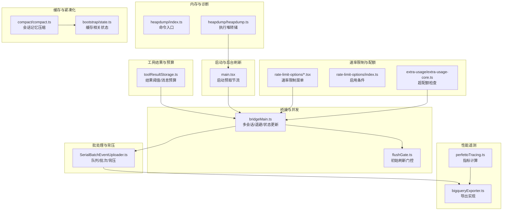
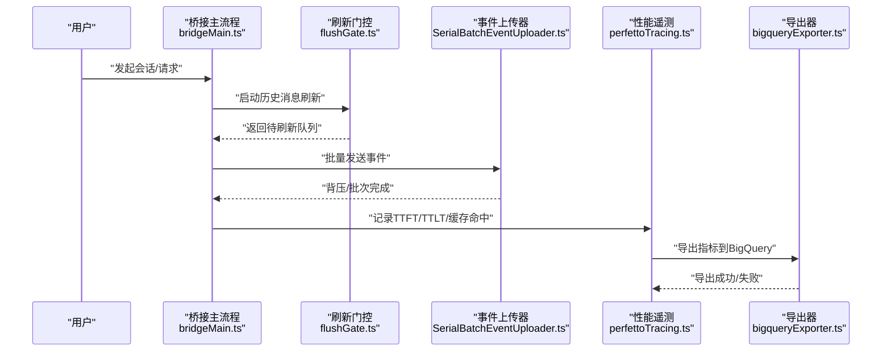
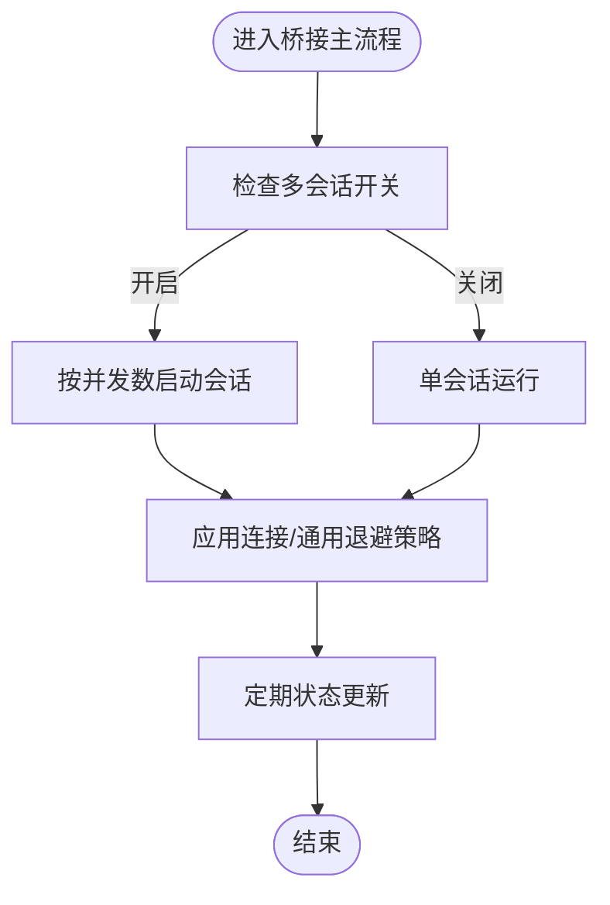
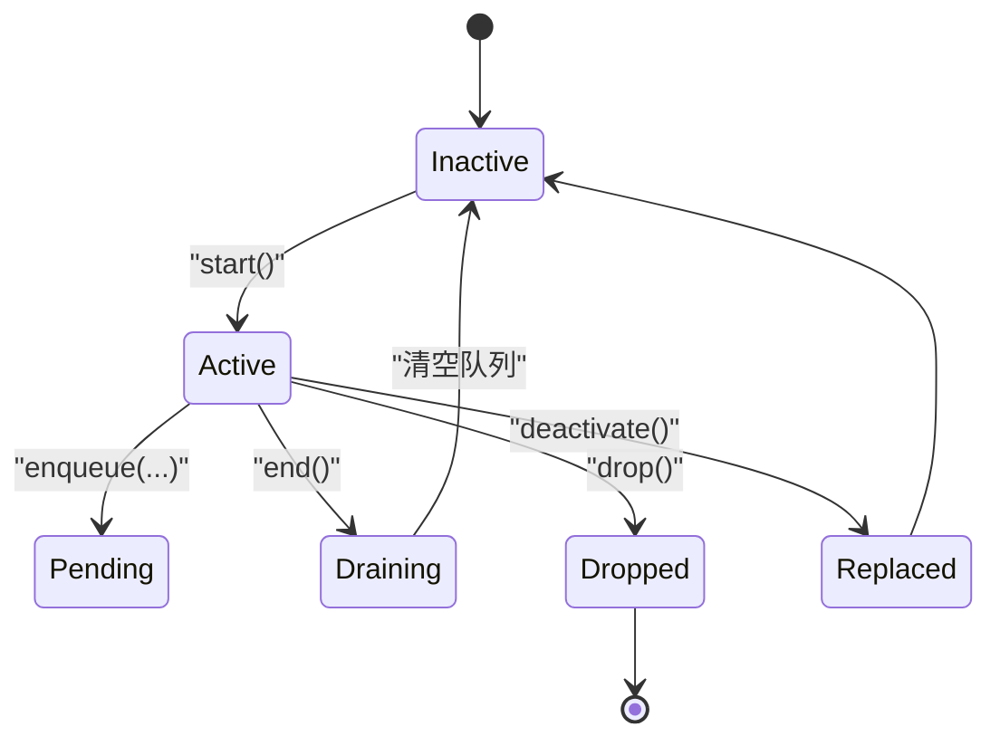
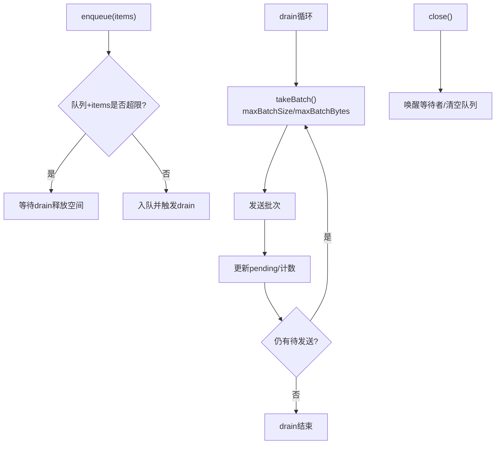
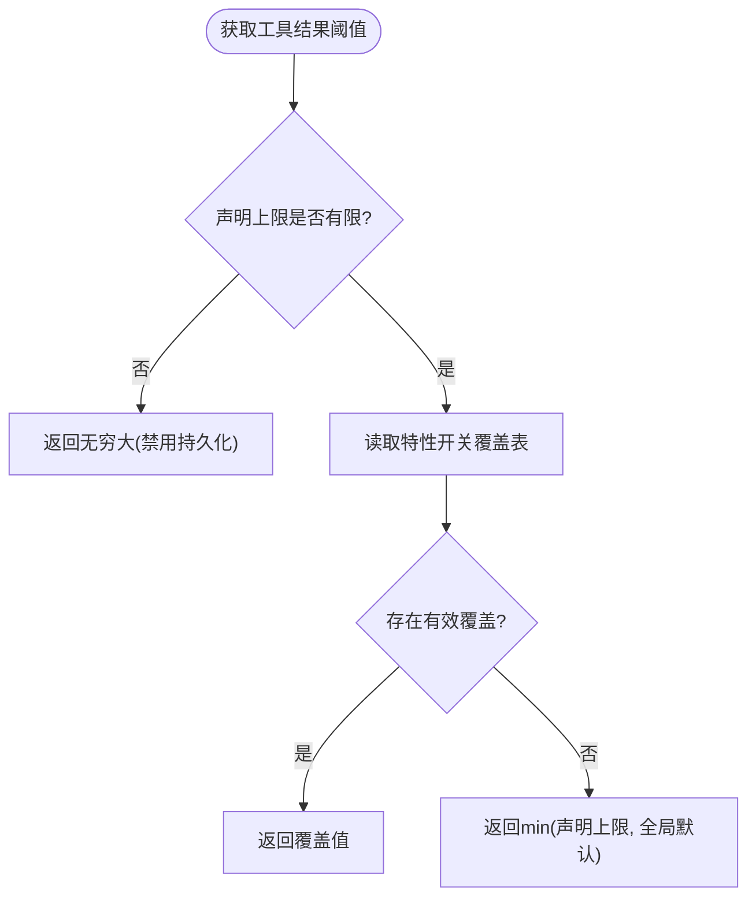
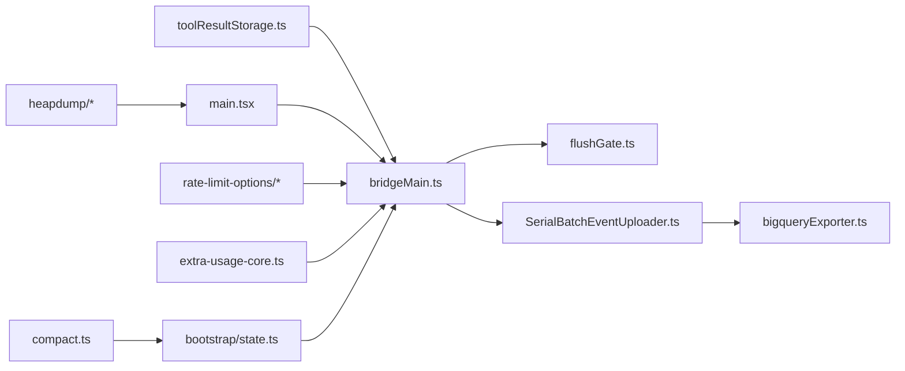

# 性能优化设置

<cite>
**本文引用的文件**
- [src/bridge/bridgeMain.ts](file://src/bridge/bridgeMain.ts)
- [src/bridge/flushGate.ts](file://src/bridge/flushGate.ts)
- [src/cli/transports/SerialBatchEventUploader.ts](file://src/cli/transports/SerialBatchEventUploader.ts)
- [src/utils/toolResultStorage.ts](file://src/utils/toolResultStorage.ts)
- [src/main.tsx](file://src/main.tsx)
- [src/utils/telemetry/perfettoTracing.ts](file://src/utils/telemetry/perfettoTracing.ts)
- [src/utils/telemetry/bigqueryExporter.ts](file://src/utils/telemetry/bigqueryExporter.ts)
- [src/commands/heapdump/heapdump.ts](file://src/commands/heapdump/heapdump.ts)
- [src/commands/heapdump/index.ts](file://src/commands/heapdump/index.ts)
- [src/commands/rate-limit-options/rate-limit-options.tsx](file://src/commands/rate-limit-options/rate-limit-options.tsx)
- [src/commands/rate-limit-options/index.ts](file://src/commands/rate-limit-options/index.ts)
- [src/commands/extra-usage/extra-usage-core.ts](file://src/commands/extra-usage/extra-usage-core.ts)
- [src/bootstrap/state.ts](file://src/bootstrap/state.ts)
- [src/commands/compact/compact.ts](file://src/commands/compact/compact.ts)
</cite>

## 目录
1. [简介](#简介)
2. [项目结构](#项目结构)
3. [核心组件](#核心组件)
4. [架构总览](#架构总览)
5. [详细组件分析](#详细组件分析)
6. [依赖关系分析](#依赖关系分析)
7. [性能考量](#性能考量)
8. [故障排查指南](#故障排查指南)
9. [结论](#结论)
10. [附录](#附录)

## 简介
本文件系统性梳理该代码库中的性能优化设置，覆盖资源限制配置、并发控制、缓存策略、API 速率限制、工具使用限制、内存管理与性能监控等主题，并提供不同负载场景下的配置建议、瓶颈识别与解决方案。

## 项目结构
围绕性能优化的关键模块包括：
- 桥接层与会话并发：桥接主流程、多会话并发开关、退避重连策略
- 事件批处理与背压：串行批事件上传器的队列、批次与背压控制
- 工具结果持久化与预算：工具输出大小阈值、消息内工具结果聚合上限
- 启动预取与后台刷新节流：启动阶段的预取节流参数
- 性能遥测与导出：OTel 指标计算（TTFT/TTLT/OTPS/缓存命中率）与 BigQuery 导出
- 堆转储与内存诊断：堆转储命令与服务
- 速率限制与配额：速率限制菜单、限额检查与团队/企业超配额逻辑
- 缓存与紧凑化：提示缓存相关状态、会话记忆压缩

图表来源
- [src/bridge/bridgeMain.ts:59-98](file://src/bridge/bridgeMain.ts#L59-L98)
- [src/bridge/flushGate.ts:16-71](file://src/bridge/flushGate.ts#L16-L71)
- [src/cli/transports/SerialBatchEventUploader.ts:106-233](file://src/cli/transports/SerialBatchEventUploader.ts#L106-L233)
- [src/utils/toolResultStorage.ts:55-78](file://src/utils/toolResultStorage.ts#L55-L78)
- [src/main.tsx:2344-2359](file://src/main.tsx#L2344-L2359)
- [src/utils/telemetry/perfettoTracing.ts:508-545](file://src/utils/telemetry/perfettoTracing.ts#L508-L545)
- [src/utils/telemetry/bigqueryExporter.ts:130-252](file://src/utils/telemetry/bigqueryExporter.ts#L130-L252)
- [src/commands/heapdump/index.ts:1-12](file://src/commands/heapdump/index.ts#L1-L12)
- [src/commands/heapdump/heapdump.ts:1-17](file://src/commands/heapdump/heapdump.ts#L1-L17)
- [src/commands/rate-limit-options/rate-limit-options.tsx:22-149](file://src/commands/rate-limit-options/rate-limit-options.tsx#L22-L149)
- [src/commands/rate-limit-options/index.ts:1-19](file://src/commands/rate-limit-options/index.ts#L1-L19)
- [src/commands/extra-usage/extra-usage-core.ts:32-63](file://src/commands/extra-usage/extra-usage-core.ts#L32-L63)
- [src/bootstrap/state.ts:236-257](file://src/bootstrap/state.ts#L236-L257)
- [src/commands/compact/compact.ts:48-83](file://src/commands/compact/compact.ts#L48-L83)

章节来源
- [src/bridge/bridgeMain.ts:59-98](file://src/bridge/bridgeMain.ts#L59-L98)
- [src/cli/transports/SerialBatchEventUploader.ts:106-233](file://src/cli/transports/SerialBatchEventUploader.ts#L106-L233)
- [src/utils/toolResultStorage.ts:55-78](file://src/utils/toolResultStorage.ts#L55-L78)
- [src/main.tsx:2344-2359](file://src/main.tsx#L2344-L2359)
- [src/utils/telemetry/perfettoTracing.ts:508-545](file://src/utils/telemetry/perfettoTracing.ts#L508-L545)
- [src/utils/telemetry/bigqueryExporter.ts:130-252](file://src/utils/telemetry/bigqueryExporter.ts#L130-L252)
- [src/commands/heapdump/heapdump.ts:1-17](file://src/commands/heapdump/heapdump.ts#L1-L17)
- [src/commands/heapdump/index.ts:1-12](file://src/commands/heapdump/index.ts#L1-L12)
- [src/commands/rate-limit-options/rate-limit-options.tsx:22-149](file://src/commands/rate-limit-options/rate-limit-options.tsx#L22-L149)
- [src/commands/rate-limit-options/index.ts:1-19](file://src/commands/rate-limit-options/index.ts#L1-L19)
- [src/commands/extra-usage/extra-usage-core.ts:32-63](file://src/commands/extra-usage/extra-usage-core.ts#L32-L63)
- [src/bootstrap/state.ts:236-257](file://src/bootstrap/state.ts#L236-L257)
- [src/commands/compact/compact.ts:48-83](file://src/commands/compact/compact.ts#L48-L83)

## 核心组件
- 多会话并发与退避策略：通过桥接主流程中的退避配置与多会话开关，控制连接建立与一般操作的指数退避上限，以及状态更新频率与默认并发会话数。
- 批量事件上传与背压：串行批事件上传器在队列满或批次字节上限时触发背压等待，确保发送端不压垮下游。
- 工具结果阈值与消息预算：工具结果持久化阈值与消息内工具结果聚合上限可由特性开关动态调整，避免过大的中间结果影响性能。
- 启动预取节流：启动阶段的后台预取可通过特性开关进行节流，减少冷启动时的瞬时压力。
- 性能指标与导出：OTel 指标中计算 TTFT/TTLT/OTPS/缓存命中率等关键指标，并通过 BigQuery 导出器以 delta 聚合方式上报。
- 速率限制与配额：速率限制菜单根据订阅类型与限额状态提供升级/等待/请求超配额等选项；团队/企业用户支持额外用量检查。
- 内存诊断：堆转储命令用于生成堆快照，辅助定位内存泄漏与峰值问题。
- 缓存与紧凑化：提示缓存相关状态与会话记忆压缩，降低上下文体积，提升缓存命中率。

章节来源
- [src/bridge/bridgeMain.ts:59-98](file://src/bridge/bridgeMain.ts#L59-L98)
- [src/cli/transports/SerialBatchEventUploader.ts:106-233](file://src/cli/transports/SerialBatchEventUploader.ts#L106-L233)
- [src/utils/toolResultStorage.ts:55-78](file://src/utils/toolResultStorage.ts#L55-L78)
- [src/main.tsx:2344-2359](file://src/main.tsx#L2344-L2359)
- [src/utils/telemetry/perfettoTracing.ts:508-545](file://src/utils/telemetry/perfettoTracing.ts#L508-L545)
- [src/utils/telemetry/bigqueryExporter.ts:130-252](file://src/utils/telemetry/bigqueryExporter.ts#L130-L252)
- [src/commands/heapdump/heapdump.ts:1-17](file://src/commands/heapdump/heapdump.ts#L1-L17)
- [src/commands/rate-limit-options/rate-limit-options.tsx:22-149](file://src/commands/rate-limit-options/rate-limit-options.tsx#L22-L149)
- [src/commands/extra-usage/extra-usage-core.ts:32-63](file://src/commands/extra-usage/extra-usage-core.ts#L32-L63)
- [src/bootstrap/state.ts:236-257](file://src/bootstrap/state.ts#L236-L257)
- [src/commands/compact/compact.ts:48-83](file://src/commands/compact/compact.ts#L48-L83)

## 架构总览
下图展示性能相关组件之间的交互关系与数据流向：

图表来源
- [src/bridge/bridgeMain.ts:59-98](file://src/bridge/bridgeMain.ts#L59-L98)
- [src/bridge/flushGate.ts:16-71](file://src/bridge/flushGate.ts#L16-L71)
- [src/cli/transports/SerialBatchEventUploader.ts:106-233](file://src/cli/transports/SerialBatchEventUploader.ts#L106-L233)
- [src/utils/telemetry/perfettoTracing.ts:508-545](file://src/utils/telemetry/perfettoTracing.ts#L508-L545)
- [src/utils/telemetry/bigqueryExporter.ts:130-252](file://src/utils/telemetry/bigqueryExporter.ts#L130-L252)

## 详细组件分析

### 组件A：桥接主流程与多会话并发
- 关键点
  - 退避配置：连接初始延迟、上限与放弃时间，以及通用退避策略，防止网络抖动导致的忙轮询。
  - 状态更新间隔：控制实时显示的状态更新频率，平衡响应性与开销。
  - 默认并发会话数：决定一次可并行处理的会话数量。
  - 多会话开关：通过特性门控启用多会话模式，按目标规则分阶段 rollout。
- 性能影响
  - 合理的退避上限可避免级联失败；过小会导致频繁重试，过大则增加延迟。
  - 并发会话数应与 CPU/IO 能力匹配，避免过度调度。
  - 状态更新频率过高会增加渲染与通信成本。

图表来源
- [src/bridge/bridgeMain.ts:59-98](file://src/bridge/bridgeMain.ts#L59-L98)

章节来源
- [src/bridge/bridgeMain.ts:59-98](file://src/bridge/bridgeMain.ts#L59-L98)

### 组件B：刷新门控（初始消息刷新）
- 关键点
  - 生命周期：start/enqueue/end/drop/deactivate 共同保证历史消息与新消息的有序传输。
  - 队列容量：在 flush 进行期间对新消息进行排队，避免交错到达。
- 性能影响
  - 正确使用可避免服务器端乱序与重复处理，但需注意队列长度与内存占用。

图表来源
- [src/bridge/flushGate.ts:16-71](file://src/bridge/flushGate.ts#L16-L71)

章节来源
- [src/bridge/flushGate.ts:16-71](file://src/bridge/flushGate.ts#L16-L71)

### 组件C：串行批事件上传器（背压与批次）
- 关键点
  - 背压机制：当队列长度或字节数超过阈值时阻塞入队，直到 drain 释放空间。
  - 批次策略：同时受最大批次条数与最大批次字节限制，首个元素总是纳入，后续元素按累计字节判断。
  - 异常丢弃：不可序列化项被就地丢弃，避免死锁。
  - 刷新与关闭：flush 等待队列清空；close 清空队列并唤醒等待者。
- 性能影响
  - 合理设置 maxBatchSize 与 maxBatchBytes 可提升吞吐；过小会增加调用次数，过大可能造成延迟与内存峰值。
  - 背压可平滑突发流量，但需避免长时间阻塞。

图表来源
- [src/cli/transports/SerialBatchEventUploader.ts:106-233](file://src/cli/transports/SerialBatchEventUploader.ts#L106-L233)

章节来源
- [src/cli/transports/SerialBatchEventUploader.ts:106-233](file://src/cli/transports/SerialBatchEventUploader.ts#L106-L233)

### 组件D：工具结果阈值与消息预算
- 关键点
  - 工具结果持久化阈值：支持通过特性开关为特定工具设置阈值覆盖，否则采用全局默认上限。
  - 消息内工具结果聚合上限：支持特性开关覆盖，否则使用硬编码常量。
  - 特殊值处理：无穷大表示禁用持久化；对非对象/非法值进行防御性校验。
- 性能影响
  - 合理的阈值可避免过大的中间结果写盘/回放带来的 IO 压力。
  - 聚合上限有助于控制单轮对话的上下文膨胀。

图表来源
- [src/utils/toolResultStorage.ts:55-78](file://src/utils/toolResultStorage.ts#L55-L78)

章节来源
- [src/utils/toolResultStorage.ts:55-78](file://src/utils/toolResultStorage.ts#L55-L78)

### 组件E：启动预取节流
- 关键点
  - 通过特性开关控制后台预取的节流时长，避免频繁拉取。
  - 在裸模式或距离上次预取时间未达阈值时跳过预取。
- 性能影响
  - 适度节流可降低冷启动时的瞬时网络与 CPU 压力。

章节来源
- [src/main.tsx:2344-2359](file://src/main.tsx#L2344-L2359)

### 组件F：性能指标与导出
- 关键点
  - 指标计算：TTFT/TTLT、OTPS（输出令牌每秒）、缓存命中率等。
  - 导出策略：以 delta 聚合上报，确保仪表盘聚合正确。
- 性能影响
  - 指标粒度与采集频率需平衡准确性与开销；delta 聚合避免累积误差。

章节来源
- [src/utils/telemetry/perfettoTracing.ts:508-545](file://src/utils/telemetry/perfettoTracing.ts#L508-L545)
- [src/utils/telemetry/bigqueryExporter.ts:130-252](file://src/utils/telemetry/bigqueryExporter.ts#L130-L252)

### 组件G：速率限制与配额
- 关键点
  - 速率限制菜单：根据订阅类型与限额状态提供升级/等待/请求超配额等选项。
  - 团队/企业超配额：检查额外用量与管理员权限，必要时引导管理员处理。
- 性能影响
  - 合理的限额策略可避免服务端过载；超配额流程需快速反馈，减少无效重试。

章节来源
- [src/commands/rate-limit-options/rate-limit-options.tsx:22-149](file://src/commands/rate-limit-options/rate-limit-options.tsx#L22-L149)
- [src/commands/rate-limit-options/index.ts:1-19](file://src/commands/rate-limit-options/index.ts#L1-L19)
- [src/commands/extra-usage/extra-usage-core.ts:32-63](file://src/commands/extra-usage/extra-usage-core.ts#L32-L63)

### 组件H：内存诊断（堆转储）
- 关键点
  - 提供堆转储命令，便于捕获内存快照进行分析。
- 性能影响
  - 堆转储会短暂暂停 GC 与分配，应谨慎在生产环境触发。

章节来源
- [src/commands/heapdump/heapdump.ts:1-17](file://src/commands/heapdump/heapdump.ts#L1-L17)
- [src/commands/heapdump/index.ts:1-12](file://src/commands/heapdump/index.ts#L1-L12)

### 组件I：缓存与紧凑化
- 关键点
  - 提示缓存相关状态：如“思考清理”“最后 API 请求 ID”“上次完成时间”等，用于缓存命中与失效策略。
  - 会话记忆压缩：在无自定义指令时优先尝试会话记忆压缩，降低上下文体积。
- 性能影响
  - 更好的缓存命中与更短的上下文长度可显著降低推理延迟与成本。

章节来源
- [src/bootstrap/state.ts:236-257](file://src/bootstrap/state.ts#L236-L257)
- [src/commands/compact/compact.ts:48-83](file://src/commands/compact/compact.ts#L48-L83)

## 依赖关系分析
- 组件耦合
  - 桥接主流程依赖刷新门控以保证消息顺序；依赖事件上传器进行遥测上报。
  - 事件上传器与导出器之间为纯数据传递关系，导出器负责最终落库。
  - 工具结果阈值与消息预算通过特性开关与硬编码常量共同决定，降低耦合。
  - 启动预取节流与桥接主流程解耦，通过全局配置与特性开关控制。
- 外部依赖
  - 遥测导出依赖 HTTP 客户端与 BigQuery 接口，异常路径需兜底。
  - 堆转储依赖底层内存快照能力，平台差异较大。

图表来源
- [src/bridge/bridgeMain.ts:59-98](file://src/bridge/bridgeMain.ts#L59-L98)
- [src/bridge/flushGate.ts:16-71](file://src/bridge/flushGate.ts#L16-L71)
- [src/cli/transports/SerialBatchEventUploader.ts:106-233](file://src/cli/transports/SerialBatchEventUploader.ts#L106-L233)
- [src/utils/toolResultStorage.ts:55-78](file://src/utils/toolResultStorage.ts#L55-L78)
- [src/main.tsx:2344-2359](file://src/main.tsx#L2344-L2359)
- [src/utils/telemetry/bigqueryExporter.ts:130-252](file://src/utils/telemetry/bigqueryExporter.ts#L130-L252)
- [src/commands/heapdump/heapdump.ts:1-17](file://src/commands/heapdump/heapdump.ts#L1-L17)
- [src/commands/rate-limit-options/rate-limit-options.tsx:22-149](file://src/commands/rate-limit-options/rate-limit-options.tsx#L22-L149)
- [src/commands/extra-usage/extra-usage-core.ts:32-63](file://src/commands/extra-usage/extra-usage-core.ts#L32-L63)
- [src/bootstrap/state.ts:236-257](file://src/bootstrap/state.ts#L236-L257)
- [src/commands/compact/compact.ts:48-83](file://src/commands/compact/compact.ts#L48-L83)

## 性能考量
- 资源限制配置
  - 工具结果阈值：为高输出工具设置合理阈值，避免写盘与回放开销；对需要禁用持久化的工具返回无穷大。
  - 消息内工具结果聚合上限：通过特性开关按需放宽，结合硬编码上限形成安全边界。
- 并发控制
  - 多会话并发：根据 CPU/IO 与网络带宽设定并发上限；配合退避策略避免拥塞。
  - 刷新门控：在历史消息刷新期间严格排队，确保顺序一致性。
- 缓存策略
  - 提示缓存状态：利用“思考清理”“最后 API 请求 ID”“上次完成时间”等状态，优化缓存命中与失效时机。
  - 会话记忆压缩：在合适场景触发压缩，降低上下文长度。
- API 速率限制
  - 速率限制菜单：根据订阅类型与限额状态提供升级/等待/请求超配额等选项，减少无效重试。
  - 团队/企业超配额：检查额外用量与管理员权限，必要时引导管理员处理。
- 工具使用限制
  - 工具结果阈值与消息预算：通过特性开关与硬编码上限双重保障，避免工具滥用导致的资源耗尽。
- 内存管理
  - 堆转储：在定位内存问题时使用，注意触发时机与平台差异。
  - 启动预取节流：避免冷启动时的瞬时内存峰值。
- 性能监控指标
  - OTel 指标：TTFT/TTLT/OTPS/缓存命中率；导出采用 delta 聚合，确保仪表盘稳定。
- 调优方法
  - 批次与背压：根据网络与服务端能力调整 maxBatchSize 与 maxBatchBytes，观察延迟与吞吐曲线。
  - 并发与退避：逐步提高并发并观察错误率，调整退避上限与放弃时间。
  - 阈值与预算：基于工具输出分布与业务 SLA 调整阈值与聚合上限。
  - 缓存与紧凑化：在高频对话场景启用紧凑化，持续监控缓存命中率变化。

## 故障排查指南
- 事件堆积与延迟
  - 现象：队列长度持续增长，flush 长时间无法完成。
  - 排查：检查 maxBatchSize/maxBatchBytes 是否过小；确认导出器是否频繁失败；观察 backpressureResolvers 是否及时释放。
  - 解决：增大批次上限或减小单条目大小；修复导出器异常；优化上游生成速率。
- 速率限制触发
  - 现象：频繁弹出速率限制菜单或超配额提示。
  - 排查：确认订阅类型与限额状态；检查团队/企业超配额检查逻辑。
  - 解决：引导用户升级计划或等待周期；为团队用户提供管理员请求入口。
- 缓存命中率低
  - 现象：TTFT/TTLT 延迟偏高，缓存命中率偏低。
  - 排查：检查提示缓存状态与紧凑化触发情况；确认上下文是否被频繁压缩。
  - 解决：优化提示构造与上下文保留策略；在合适场景启用紧凑化。
- 内存问题
  - 现象：内存持续上涨或偶发 OOM。
  - 排查：触发堆转储并分析；检查工具结果阈值是否过大；确认事件上传器是否存在内存泄漏。
  - 解决：调整阈值与批次；分析堆快照定位热点；优化对象生命周期。

章节来源
- [src/cli/transports/SerialBatchEventUploader.ts:106-233](file://src/cli/transports/SerialBatchEventUploader.ts#L106-L233)
- [src/commands/rate-limit-options/rate-limit-options.tsx:22-149](file://src/commands/rate-limit-options/rate-limit-options.tsx#L22-L149)
- [src/commands/extra-usage/extra-usage-core.ts:32-63](file://src/commands/extra-usage/extra-usage-core.ts#L32-L63)
- [src/utils/telemetry/perfettoTracing.ts:508-545](file://src/utils/telemetry/perfettoTracing.ts#L508-L545)
- [src/commands/heapdump/heapdump.ts:1-17](file://src/commands/heapdump/heapdump.ts#L1-L17)

## 结论
通过对桥接并发、事件批处理、工具结果阈值、启动预取节流、性能指标与导出、速率限制与配额、内存诊断与缓存紧凑化等模块的系统梳理，可以构建一套可配置、可观测、可扩展的性能优化体系。建议在不同负载场景下以数据驱动的方式迭代调参，并结合监控指标与日志进行持续优化。

## 附录
- 不同负载场景下的配置建议
  - 低负载：较小并发与较保守退避；适当放宽工具结果阈值；启用紧凑化以维持缓存命中。
  - 中负载：中等并发与适中退避；合理批次大小；启用速率限制菜单的等待策略。
  - 高负载：高并发与高退避上限；严格批次与背压；启用超配额流程；关注事件堆积与内存峰值。
- 性能瓶颈识别清单
  - 网络/服务端：TTFT/TTLT 延迟高、导出失败率上升。
  - 上游生成：事件堆积、flush 长时间无法完成。
  - 工具输出：工具结果过大导致 IO 压力。
  - 缓存：缓存命中率低、上下文过长。
  - 内存：堆快照异常、OOM 风险。