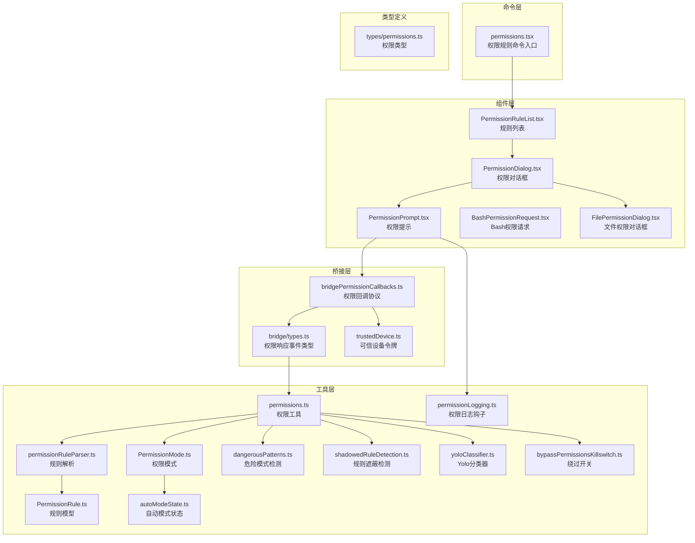
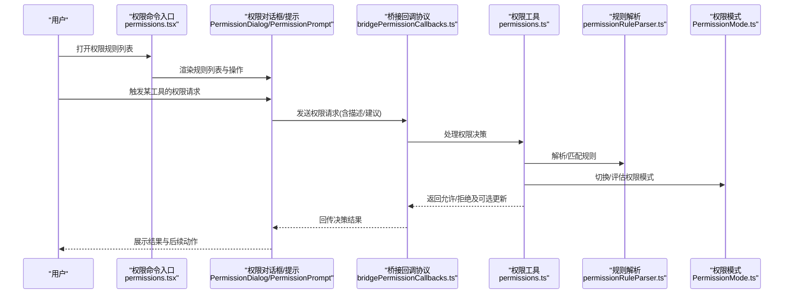
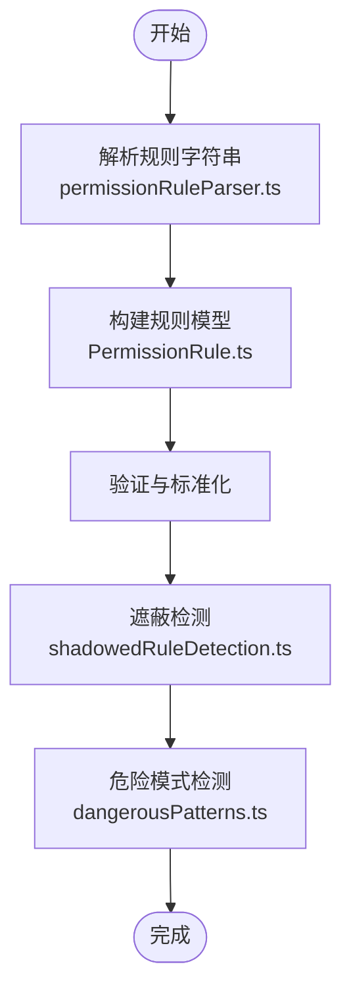
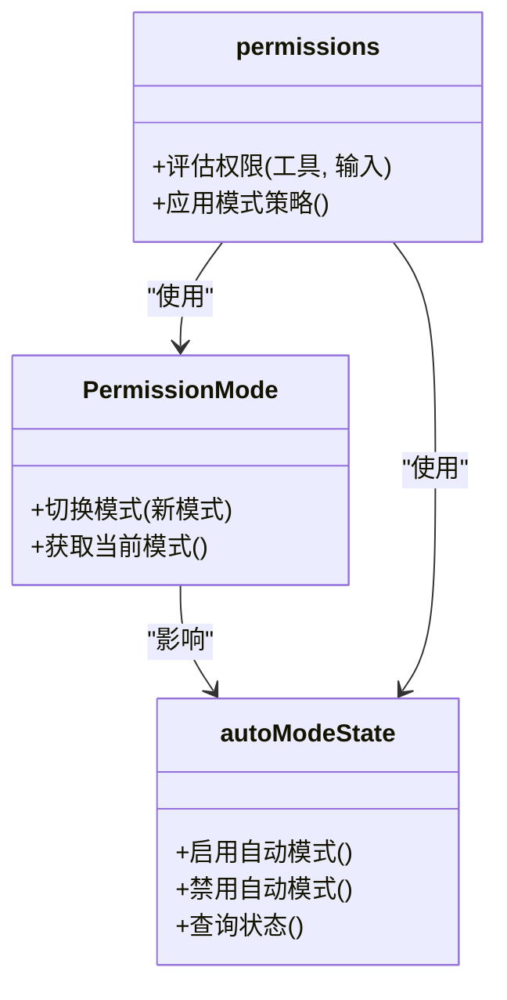
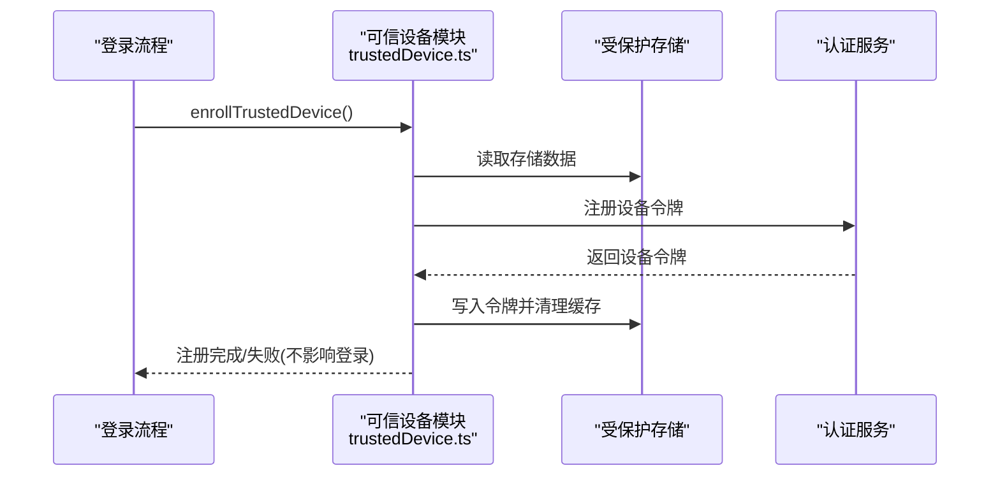
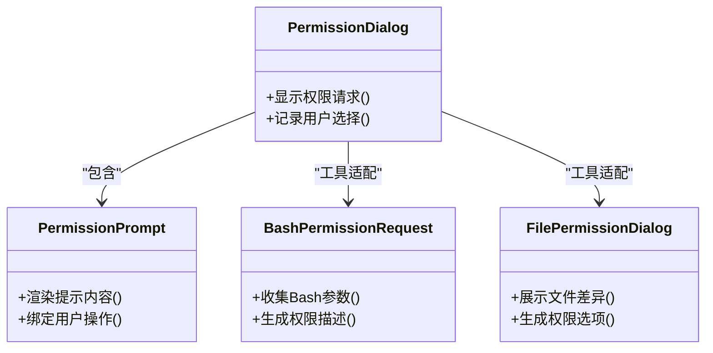
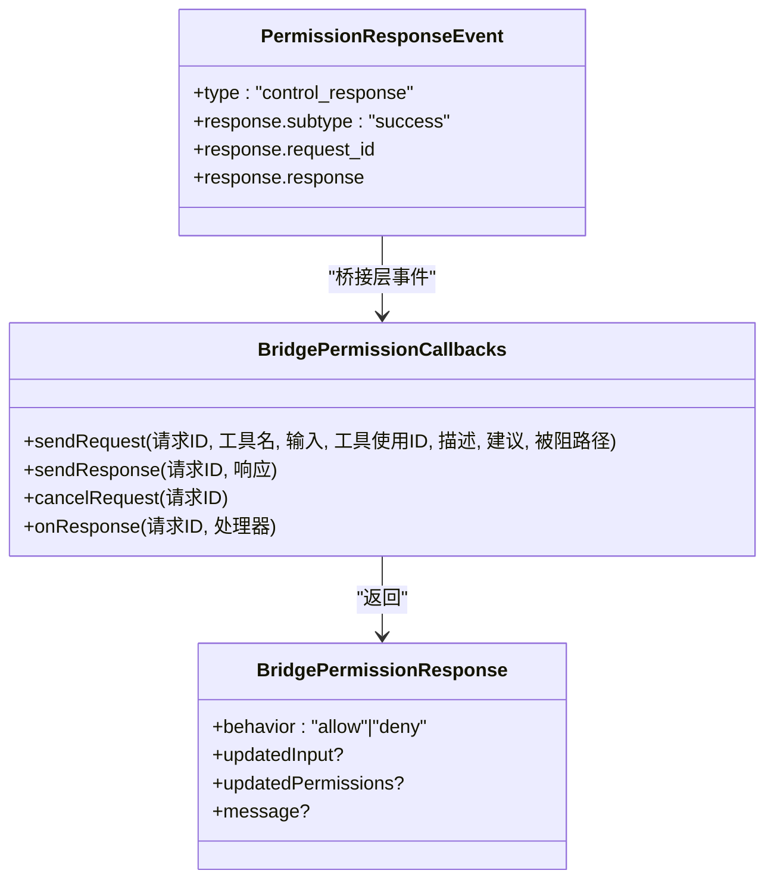
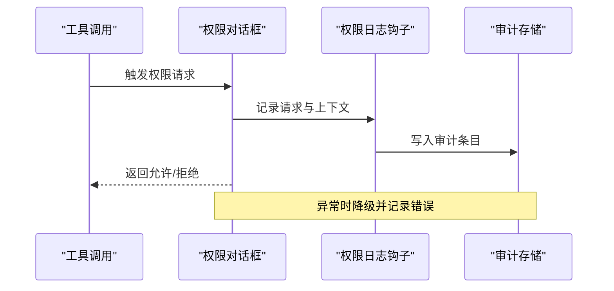
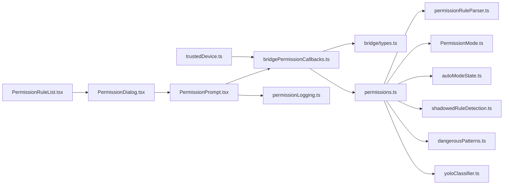

# 权限控制设置

<cite>
**本文档引用的文件**
- [src/commands/permissions/permissions.tsx](file://src/commands/permissions/permissions.tsx)
- [src/bridge/bridgePermissionCallbacks.ts](file://src/bridge/bridgePermissionCallbacks.ts)
- [src/bridge/types.ts](file://src/bridge/types.ts)
- [src/bridge/trustedDevice.ts](file://src/bridge/trustedDevice.ts)
- [src/components/permissions/rules/PermissionRuleList.tsx](file://src/components/permissions/rules/PermissionRuleList.tsx)
- [src/components/permissions/PermissionDialog.tsx](file://src/components/permissions/PermissionDialog.tsx)
- [src/components/permissions/PermissionPrompt.tsx](file://src/components/permissions/PermissionPrompt.tsx)
- [src/components/permissions/BashPermissionRequest/BashPermissionRequest.tsx](file://src/components/permissions/BashPermissionRequest/BashPermissionRequest.tsx)
- [src/components/permissions/FilePermissionDialog/FilePermissionDialog.tsx](file://src/components/permissions/FilePermissionDialog/FilePermissionDialog.tsx)
- [src/utils/permissions/permissions.ts](file://src/utils/permissions/permissions.ts)
- [src/utils/permissions/permissionRuleParser.ts](file://src/utils/permissions/permissionRuleParser.ts)
- [src/utils/permissions/PermissionRule.ts](file://src/utils/permissions/PermissionRule.ts)
- [src/utils/permissions/PermissionMode.ts](file://src/utils/permissions/PermissionMode.ts)
- [src/utils/permissions/autoModeState.ts](file://src/utils/permissions/autoModeState.ts)
- [src/utils/permissions/dangerousPatterns.ts](file://src/utils/permissions/dangerousPatterns.ts)
- [src/utils/permissions/shadowedRuleDetection.ts](file://src/utils/permissions/shadowedRuleDetection.ts)
- [src/utils/permissions/yoloClassifier.ts](file://src/utils/permissions/yoloClassifier.ts)
- [src/utils/permissions/bypassPermissionsKillswitch.ts](file://src/utils/permissions/bypassPermissionsKillswitch.ts)
- [src/hooks/toolPermission/permissionLogging.ts](file://src/hooks/toolPermission/permissionLogging.ts)
- [src/types/permissions.ts](file://src/types/permissions.ts)
- [src/main.tsx](file://src/main.tsx)
</cite>

## 目录
1. [简介](#简介)
2. [项目结构](#项目结构)
3. [核心组件](#核心组件)
4. [架构总览](#架构总览)
5. [详细组件分析](#详细组件分析)
6. [依赖关系分析](#依赖关系分析)
7. [性能考量](#性能考量)
8. [故障排除指南](#故障排除指南)
9. [结论](#结论)
10. [附录](#附录)

## 简介
本文件系统性梳理了该代码库中的权限控制体系，涵盖权限规则配置、访问控制策略、认证授权设置、权限模式与优先级、审计与日志、异常处理等。文档以组件与工具函数为线索，结合实际源码路径，帮助读者快速理解并正确配置权限系统。

## 项目结构
权限相关功能主要分布在以下区域：
- 命令层：提供权限规则列表入口命令
- 组件层：权限弹窗、请求对话框、规则编辑界面
- 桥接层：跨进程/跨会话的权限回调协议
- 工具层：权限规则解析、模式切换、自动模式状态、危险模式检测、分类器、绕过开关、日志钩子
- 类型定义：权限相关接口与事件类型

图表来源
- [src/commands/permissions/permissions.tsx:1-9](file://src/commands/permissions/permissions.tsx#L1-L9)
- [src/components/permissions/rules/PermissionRuleList.tsx](file://src/components/permissions/rules/PermissionRuleList.tsx)
- [src/components/permissions/PermissionDialog.tsx](file://src/components/permissions/PermissionDialog.tsx)
- [src/components/permissions/PermissionPrompt.tsx](file://src/components/permissions/PermissionPrompt.tsx)
- [src/components/permissions/BashPermissionRequest/BashPermissionRequest.tsx](file://src/components/permissions/BashPermissionRequest/BashPermissionRequest.tsx)
- [src/components/permissions/FilePermissionDialog/FilePermissionDialog.tsx](file://src/components/permissions/FilePermissionDialog/FilePermissionDialog.tsx)
- [src/bridge/bridgePermissionCallbacks.ts:1-43](file://src/bridge/bridgePermissionCallbacks.ts#L1-L43)
- [src/bridge/types.ts:117-131](file://src/bridge/types.ts#L117-L131)
- [src/bridge/trustedDevice.ts:33-210](file://src/bridge/trustedDevice.ts#L33-L210)
- [src/utils/permissions/permissions.ts](file://src/utils/permissions/permissions.ts)
- [src/utils/permissions/permissionRuleParser.ts](file://src/utils/permissions/permissionRuleParser.ts)
- [src/utils/permissions/PermissionRule.ts](file://src/utils/permissions/PermissionRule.ts)
- [src/utils/permissions/PermissionMode.ts](file://src/utils/permissions/PermissionMode.ts)
- [src/utils/permissions/autoModeState.ts](file://src/utils/permissions/autoModeState.ts)
- [src/utils/permissions/dangerousPatterns.ts](file://src/utils/permissions/dangerousPatterns.ts)
- [src/utils/permissions/shadowedRuleDetection.ts](file://src/utils/permissions/shadowedRuleDetection.ts)
- [src/utils/permissions/yoloClassifier.ts](file://src/utils/permissions/yoloClassifier.ts)
- [src/utils/permissions/bypassPermissionsKillswitch.ts](file://src/utils/permissions/bypassPermissionsKillswitch.ts)
- [src/hooks/toolPermission/permissionLogging.ts](file://src/hooks/toolPermission/permissionLogging.ts)
- [src/types/permissions.ts](file://src/types/permissions.ts)

章节来源
- [src/commands/permissions/permissions.tsx:1-9](file://src/commands/permissions/permissions.tsx#L1-L9)
- [src/bridge/bridgePermissionCallbacks.ts:1-43](file://src/bridge/bridgePermissionCallbacks.ts#L1-L43)
- [src/bridge/types.ts:117-131](file://src/bridge/types.ts#L117-L131)
- [src/bridge/trustedDevice.ts:33-210](file://src/bridge/trustedDevice.ts#L33-L210)

## 核心组件
- 权限规则命令入口：提供打开权限规则列表的交互入口，并支持在拒绝后重试的反馈消息注入。
- 权限对话框与提示：封装通用的权限弹窗与用户确认流程，承载具体工具的权限请求。
- 权限回调协议：定义桥接层的请求/响应模型，支持允许/拒绝、输入更新、权限建议与取消请求。
- 权限规则解析与模型：提供规则语法解析、规则对象模型、模式切换逻辑、自动模式状态管理。
- 安全与审计：危险模式检测、规则遮蔽检测、Yolo分类器、绕过开关、权限日志钩子。

章节来源
- [src/commands/permissions/permissions.tsx:1-9](file://src/commands/permissions/permissions.tsx#L1-L9)
- [src/components/permissions/PermissionDialog.tsx](file://src/components/permissions/PermissionDialog.tsx)
- [src/components/permissions/PermissionPrompt.tsx](file://src/components/permissions/PermissionPrompt.tsx)
- [src/bridge/bridgePermissionCallbacks.ts:1-43](file://src/bridge/bridgePermissionCallbacks.ts#L1-L43)
- [src/utils/permissions/permissionRuleParser.ts](file://src/utils/permissions/permissionRuleParser.ts)
- [src/utils/permissions/PermissionRule.ts](file://src/utils/permissions/PermissionRule.ts)
- [src/utils/permissions/PermissionMode.ts](file://src/utils/permissions/PermissionMode.ts)
- [src/utils/permissions/autoModeState.ts](file://src/utils/permissions/autoModeState.ts)
- [src/utils/permissions/dangerousPatterns.ts](file://src/utils/permissions/dangerousPatterns.ts)
- [src/utils/permissions/shadowedRuleDetection.ts](file://src/utils/permissions/shadowedRuleDetection.ts)
- [src/utils/permissions/yoloClassifier.ts](file://src/utils/permissions/yoloClassifier.ts)
- [src/utils/permissions/bypassPermissionsKillswitch.ts](file://src/utils/permissions/bypassPermissionsKillswitch.ts)
- [src/hooks/toolPermission/permissionLogging.ts](file://src/hooks/toolPermission/permissionLogging.ts)

## 架构总览
权限控制采用“规则驱动 + 模式切换 + 分类器辅助 + 审计日志”的整体架构。命令入口触发规则列表展示；用户在对话框中确认或拒绝；桥接层负责跨会话的权限决策传递；工具层完成规则解析、模式判断与安全检测；日志钩子记录决策轨迹。

图表来源
- [src/commands/permissions/permissions.tsx:1-9](file://src/commands/permissions/permissions.tsx#L1-L9)
- [src/components/permissions/PermissionDialog.tsx](file://src/components/permissions/PermissionDialog.tsx)
- [src/components/permissions/PermissionPrompt.tsx](file://src/components/permissions/PermissionPrompt.tsx)
- [src/bridge/bridgePermissionCallbacks.ts:1-43](file://src/bridge/bridgePermissionCallbacks.ts#L1-L43)
- [src/utils/permissions/permissions.ts](file://src/utils/permissions/permissions.ts)
- [src/utils/permissions/permissionRuleParser.ts](file://src/utils/permissions/permissionRuleParser.ts)
- [src/utils/permissions/PermissionMode.ts](file://src/utils/permissions/PermissionMode.ts)

## 详细组件分析

### 权限规则配置与语法
- 规则解析：提供规则字符串到内部模型的转换，支持路径/命令/环境变量等维度的匹配条件。
- 规则模型：抽象出统一的规则对象，便于后续匹配、优先级排序与冲突检测。
- 规则遮蔽检测：识别被更宽泛规则覆盖的细粒度规则，避免无效配置。
- 危险模式检测：对潜在高危行为进行标记与拦截建议。

图表来源
- [src/utils/permissions/permissionRuleParser.ts](file://src/utils/permissions/permissionRuleParser.ts)
- [src/utils/permissions/PermissionRule.ts](file://src/utils/permissions/PermissionRule.ts)
- [src/utils/permissions/shadowedRuleDetection.ts](file://src/utils/permissions/shadowedRuleDetection.ts)
- [src/utils/permissions/dangerousPatterns.ts](file://src/utils/permissions/dangerousPatterns.ts)

章节来源
- [src/utils/permissions/permissionRuleParser.ts](file://src/utils/permissions/permissionRuleParser.ts)
- [src/utils/permissions/PermissionRule.ts](file://src/utils/permissions/PermissionRule.ts)
- [src/utils/permissions/shadowedRuleDetection.ts](file://src/utils/permissions/shadowedRuleDetection.ts)
- [src/utils/permissions/dangerousPatterns.ts](file://src/utils/permissions/dangerousPatterns.ts)

### 访问控制策略与权限模式
- 权限模式：定义系统可用的权限模式（如严格/宽松/自动），并提供模式切换逻辑。
- 自动模式状态：维护自动模式的启用状态与上下文，用于工具调用时的默认策略。
- 模式切换：根据当前模式与规则匹配结果动态决定是否允许执行。

图表来源
- [src/utils/permissions/PermissionMode.ts](file://src/utils/permissions/PermissionMode.ts)
- [src/utils/permissions/autoModeState.ts](file://src/utils/permissions/autoModeState.ts)
- [src/utils/permissions/permissions.ts](file://src/utils/permissions/permissions.ts)

章节来源
- [src/utils/permissions/PermissionMode.ts](file://src/utils/permissions/PermissionMode.ts)
- [src/utils/permissions/autoModeState.ts](file://src/utils/permissions/autoModeState.ts)
- [src/utils/permissions/permissions.ts](file://src/utils/permissions/permissions.ts)

### 认证授权设置与可信设备
- 可信设备令牌：通过受保护存储持久化设备令牌，支持在登录后自动注册并缓存，减少每次请求的开销。
- 登录流程集成：在登录成功后尝试注册设备令牌，若失败则回退但不影响主流程。
- 环境变量优先：企业包装场景可通过环境变量直接注入令牌，跳过注册流程。

图表来源
- [src/bridge/trustedDevice.ts:33-210](file://src/bridge/trustedDevice.ts#L33-L210)

章节来源
- [src/bridge/trustedDevice.ts:33-210](file://src/bridge/trustedDevice.ts#L33-L210)

### 权限请求与对话框
- 通用对话框：封装权限请求的弹窗与用户交互，支持显示工具描述、建议与历史拒绝记录。
- 具体工具请求：针对 Bash、文件编辑、笔记本编辑等工具提供专用请求组件。
- 文件权限对话框：提供文件系统权限的可视化配置与差异预览。

图表来源
- [src/components/permissions/PermissionDialog.tsx](file://src/components/permissions/PermissionDialog.tsx)
- [src/components/permissions/PermissionPrompt.tsx](file://src/components/permissions/PermissionPrompt.tsx)
- [src/components/permissions/BashPermissionRequest/BashPermissionRequest.tsx](file://src/components/permissions/BashPermissionRequest/BashPermissionRequest.tsx)
- [src/components/permissions/FilePermissionDialog/FilePermissionDialog.tsx](file://src/components/permissions/FilePermissionDialog/FilePermissionDialog.tsx)

章节来源
- [src/components/permissions/PermissionDialog.tsx](file://src/components/permissions/PermissionDialog.tsx)
- [src/components/permissions/PermissionPrompt.tsx](file://src/components/permissions/PermissionPrompt.tsx)
- [src/components/permissions/BashPermissionRequest/BashPermissionRequest.tsx](file://src/components/permissions/BashPermissionRequest/BashPermissionRequest.tsx)
- [src/components/permissions/FilePermissionDialog/FilePermissionDialog.tsx](file://src/components/permissions/FilePermissionDialog/FilePermissionDialog.tsx)

### 桥接层权限回调协议
- 请求/响应模型：定义允许/拒绝、输入更新、权限建议与附加消息。
- 类型校验：提供类型谓词确保响应负载符合协议。
- 事件类型：桥接层事件携带请求ID与响应载荷，便于跨会话追踪。

图表来源
- [src/bridge/bridgePermissionCallbacks.ts:1-43](file://src/bridge/bridgePermissionCallbacks.ts#L1-L43)
- [src/bridge/types.ts:117-131](file://src/bridge/types.ts#L117-L131)

章节来源
- [src/bridge/bridgePermissionCallbacks.ts:1-43](file://src/bridge/bridgePermissionCallbacks.ts#L1-L43)
- [src/bridge/types.ts:117-131](file://src/bridge/types.ts#L117-L131)

### 权限规则的语法、匹配机制与优先级
- 语法：规则由“主体(工具/路径/命令)+条件+动作(允许/拒绝)”构成，解析器将其标准化为规则模型。
- 匹配：按从细到粗的顺序匹配，优先使用最具体的规则；若存在更宽泛规则，则可能遮蔽更具体规则。
- 优先级：规则按“精确度优先”，同时考虑模式与自动模式状态；危险模式将提升拦截优先级。

章节来源
- [src/utils/permissions/permissionRuleParser.ts](file://src/utils/permissions/permissionRuleParser.ts)
- [src/utils/permissions/PermissionRule.ts](file://src/utils/permissions/PermissionRule.ts)
- [src/utils/permissions/shadowedRuleDetection.ts](file://src/utils/permissions/shadowedRuleDetection.ts)
- [src/utils/permissions/dangerousPatterns.ts](file://src/utils/permissions/dangerousPatterns.ts)

### 不同权限模式的适用场景与安全考虑
- 严格模式：适用于高风险环境，最小化工具使用范围，要求明确授权。
- 宽松模式：适用于开发与测试，降低误报率，但需配合规则与审计。
- 自动模式：基于分类器与规则自动决策，适合日常使用，需定期审查规则有效性。
- 安全考虑：启用危险模式检测与规则遮蔽检测，避免“看起来安全但实际危险”的配置；必要时启用绕过开关以应急处置。

章节来源
- [src/utils/permissions/PermissionMode.ts](file://src/utils/permissions/PermissionMode.ts)
- [src/utils/permissions/autoModeState.ts](file://src/utils/permissions/autoModeState.ts)
- [src/utils/permissions/dangerousPatterns.ts](file://src/utils/permissions/dangerousPatterns.ts)
- [src/utils/permissions/shadowedRuleDetection.ts](file://src/utils/permissions/shadowedRuleDetection.ts)
- [src/utils/permissions/bypassPermissionsKillswitch.ts](file://src/utils/permissions/bypassPermissionsKillswitch.ts)

### 权限配置最佳实践与常见模式
- 最小权限原则：优先使用窄范围规则，逐步放宽。
- 明确语义：规则描述清晰，避免歧义；利用建议与历史拒绝记录优化配置。
- 定期审查：启用阴影规则检测与危险模式检测，定期清理无效规则。
- 自动模式：在保证安全的前提下启用自动模式，减少人工干预。
- 企业场景：通过环境变量注入可信设备令牌，避免注册流程干扰。

章节来源
- [src/utils/permissions/shadowedRuleDetection.ts](file://src/utils/permissions/shadowedRuleDetection.ts)
- [src/utils/permissions/dangerousPatterns.ts](file://src/utils/permissions/dangerousPatterns.ts)
- [src/bridge/trustedDevice.ts:33-210](file://src/bridge/trustedDevice.ts#L33-L210)

### 权限审计、日志记录与异常处理
- 审计与日志：权限日志钩子记录决策过程与结果，便于问题定位与合规审计。
- 异常处理：桥接层对非法响应进行类型校验与降级处理；可信设备注册失败不阻塞登录流程。
- 用户反馈：命令入口支持在拒绝后重试，通过消息队列提示用户重新授权。

图表来源
- [src/hooks/toolPermission/permissionLogging.ts](file://src/hooks/toolPermission/permissionLogging.ts)
- [src/commands/permissions/permissions.tsx:1-9](file://src/commands/permissions/permissions.tsx#L1-L9)

章节来源
- [src/hooks/toolPermission/permissionLogging.ts](file://src/hooks/toolPermission/permissionLogging.ts)
- [src/commands/permissions/permissions.tsx:1-9](file://src/commands/permissions/permissions.tsx#L1-L9)

## 依赖关系分析
- 组件耦合：权限对话框依赖通用提示组件与具体工具请求组件；规则列表依赖对话框与日志钩子。
- 工具层内聚：权限工具聚合了解析、模式、状态、检测与分类器，形成完整的决策闭环。
- 桥接层契约：桥接回调协议与事件类型定义了稳定的跨层通信接口，降低耦合度。
- 外部依赖：可信设备模块依赖受保护存储与认证服务；日志钩子依赖审计存储。

图表来源
- [src/components/permissions/rules/PermissionRuleList.tsx](file://src/components/permissions/rules/PermissionRuleList.tsx)
- [src/components/permissions/PermissionDialog.tsx](file://src/components/permissions/PermissionDialog.tsx)
- [src/components/permissions/PermissionPrompt.tsx](file://src/components/permissions/PermissionPrompt.tsx)
- [src/bridge/bridgePermissionCallbacks.ts:1-43](file://src/bridge/bridgePermissionCallbacks.ts#L1-L43)
- [src/bridge/types.ts:117-131](file://src/bridge/types.ts#L117-L131)
- [src/utils/permissions/permissions.ts](file://src/utils/permissions/permissions.ts)
- [src/utils/permissions/permissionRuleParser.ts](file://src/utils/permissions/permissionRuleParser.ts)
- [src/utils/permissions/PermissionMode.ts](file://src/utils/permissions/PermissionMode.ts)
- [src/utils/permissions/autoModeState.ts](file://src/utils/permissions/autoModeState.ts)
- [src/utils/permissions/shadowedRuleDetection.ts](file://src/utils/permissions/shadowedRuleDetection.ts)
- [src/utils/permissions/dangerousPatterns.ts](file://src/utils/permissions/dangerousPatterns.ts)
- [src/utils/permissions/yoloClassifier.ts](file://src/utils/permissions/yoloClassifier.ts)
- [src/hooks/toolPermission/permissionLogging.ts](file://src/hooks/toolPermission/permissionLogging.ts)
- [src/bridge/trustedDevice.ts:33-210](file://src/bridge/trustedDevice.ts#L33-L210)

章节来源
- [src/components/permissions/rules/PermissionRuleList.tsx](file://src/components/permissions/rules/PermissionRuleList.tsx)
- [src/components/permissions/PermissionDialog.tsx](file://src/components/permissions/PermissionDialog.tsx)
- [src/components/permissions/PermissionPrompt.tsx](file://src/components/permissions/PermissionPrompt.tsx)
- [src/bridge/bridgePermissionCallbacks.ts:1-43](file://src/bridge/bridgePermissionCallbacks.ts#L1-L43)
- [src/bridge/types.ts:117-131](file://src/bridge/types.ts#L117-L131)
- [src/utils/permissions/permissions.ts](file://src/utils/permissions/permissions.ts)
- [src/utils/permissions/permissionRuleParser.ts](file://src/utils/permissions/permissionRuleParser.ts)
- [src/utils/permissions/PermissionMode.ts](file://src/utils/permissions/PermissionMode.ts)
- [src/utils/permissions/autoModeState.ts](file://src/utils/permissions/autoModeState.ts)
- [src/utils/permissions/shadowedRuleDetection.ts](file://src/utils/permissions/shadowedRuleDetection.ts)
- [src/utils/permissions/dangerousPatterns.ts](file://src/utils/permissions/dangerousPatterns.ts)
- [src/utils/permissions/yoloClassifier.ts](file://src/utils/permissions/yoloClassifier.ts)
- [src/hooks/toolPermission/permissionLogging.ts](file://src/hooks/toolPermission/permissionLogging.ts)
- [src/bridge/trustedDevice.ts:33-210](file://src/bridge/trustedDevice.ts#L33-L210)

## 性能考量
- 缓存策略：可信设备令牌读取采用记忆化缓存，减少频繁的系统调用开销。
- 模块懒加载：部分模块在需要时才加载，降低启动时的依赖图复杂度。
- 日志与审计：日志写入异步化，避免阻塞工具调用主路径。
- 规则匹配：优先使用精确规则，减少不必要的模糊匹配成本。

## 故障排除指南
- 权限请求无响应：检查桥接回调协议的请求/响应一致性，确认类型校验通过。
- 规则未生效：检查规则遮蔽情况与模式状态，确认自动模式与严格模式的切换逻辑。
- 可信设备注册失败：查看存储写入与网络请求状态，确认环境变量优先级与门控开关。
- 审计日志缺失：确认日志钩子已接入并检查审计存储的可用性。

章节来源
- [src/bridge/bridgePermissionCallbacks.ts:1-43](file://src/bridge/bridgePermissionCallbacks.ts#L1-L43)
- [src/utils/permissions/shadowedRuleDetection.ts](file://src/utils/permissions/shadowedRuleDetection.ts)
- [src/bridge/trustedDevice.ts:33-210](file://src/bridge/trustedDevice.ts#L33-L210)
- [src/hooks/toolPermission/permissionLogging.ts](file://src/hooks/toolPermission/permissionLogging.ts)

## 结论
该权限控制系统通过“规则+模式+分类器+审计”的组合，实现了灵活且可审计的访问控制。建议在生产环境中采用严格模式与自动模式相结合的方式，辅以定期审查与审计日志，确保安全与效率的平衡。

## 附录
- 常见配置模式参考路径：
  - 规则列表入口：[src/commands/permissions/permissions.tsx:1-9](file://src/commands/permissions/permissions.tsx#L1-L9)
  - 权限对话框：[src/components/permissions/PermissionDialog.tsx](file://src/components/permissions/PermissionDialog.tsx)
  - 权限提示：[src/components/permissions/PermissionPrompt.tsx](file://src/components/permissions/PermissionPrompt.tsx)
  - Bash权限请求：[src/components/permissions/BashPermissionRequest/BashPermissionRequest.tsx](file://src/components/permissions/BashPermissionRequest/BashPermissionRequest.tsx)
  - 文件权限对话框：[src/components/permissions/FilePermissionDialog/FilePermissionDialog.tsx](file://src/components/permissions/FilePermissionDialog/FilePermissionDialog.tsx)
  - 权限回调协议：[src/bridge/bridgePermissionCallbacks.ts:1-43](file://src/bridge/bridgePermissionCallbacks.ts#L1-L43)
  - 权限响应事件类型：[src/bridge/types.ts:117-131](file://src/bridge/types.ts#L117-L131)
  - 可信设备令牌：[src/bridge/trustedDevice.ts:33-210](file://src/bridge/trustedDevice.ts#L33-L210)
  - 权限工具：[src/utils/permissions/permissions.ts](file://src/utils/permissions/permissions.ts)
  - 规则解析：[src/utils/permissions/permissionRuleParser.ts](file://src/utils/permissions/permissionRuleParser.ts)
  - 规则模型：[src/utils/permissions/PermissionRule.ts](file://src/utils/permissions/PermissionRule.ts)
  - 权限模式：[src/utils/permissions/PermissionMode.ts](file://src/utils/permissions/PermissionMode.ts)
  - 自动模式状态：[src/utils/permissions/autoModeState.ts](file://src/utils/permissions/autoModeState.ts)
  - 危险模式检测：[src/utils/permissions/dangerousPatterns.ts](file://src/utils/permissions/dangerousPatterns.ts)
  - 规则遮蔽检测：[src/utils/permissions/shadowedRuleDetection.ts](file://src/utils/permissions/shadowedRuleDetection.ts)
  - Yolo分类器：[src/utils/permissions/yoloClassifier.ts](file://src/utils/permissions/yoloClassifier.ts)
  - 绕过开关：[src/utils/permissions/bypassPermissionsKillswitch.ts](file://src/utils/permissions/bypassPermissionsKillswitch.ts)
  - 权限日志钩子：[src/hooks/toolPermission/permissionLogging.ts](file://src/hooks/toolPermission/permissionLogging.ts)
  - 权限类型定义：[src/types/permissions.ts](file://src/types/permissions.ts)
  - 主入口通知：[src/main.tsx:2881-2916](file://src/main.tsx#L2881-L2916)