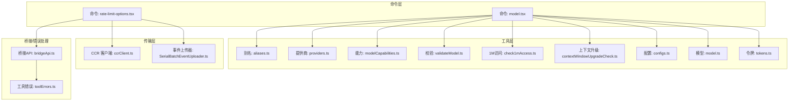
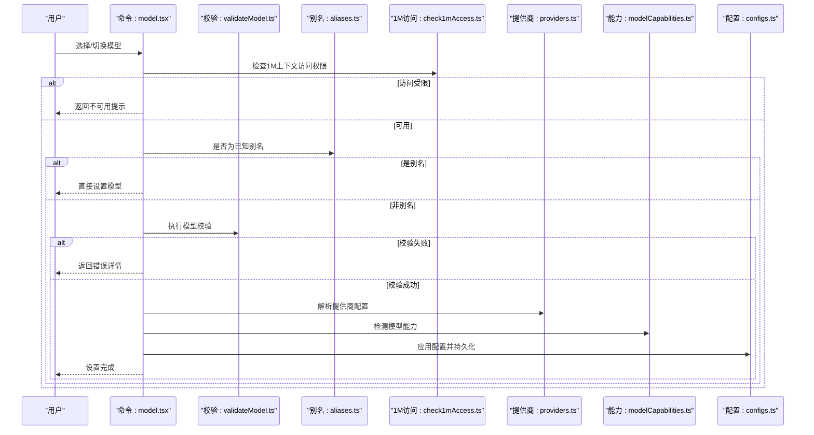
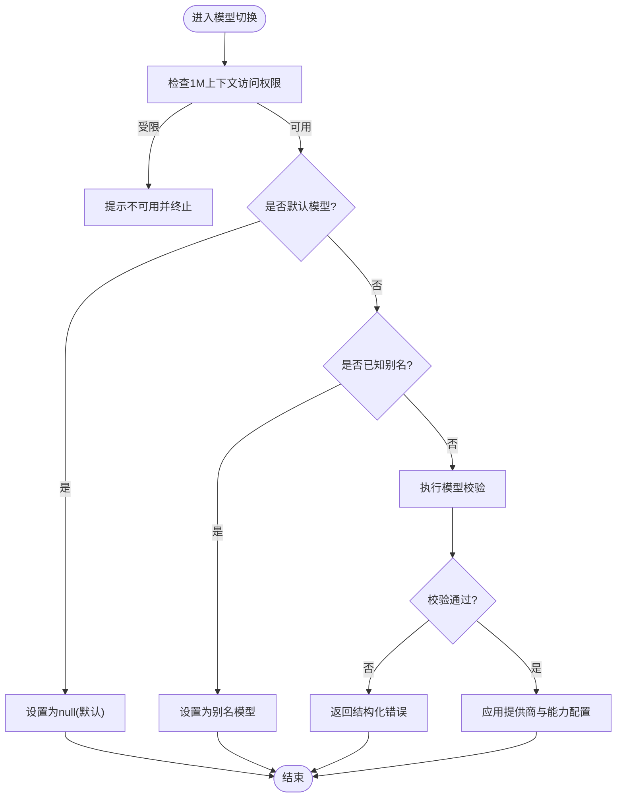
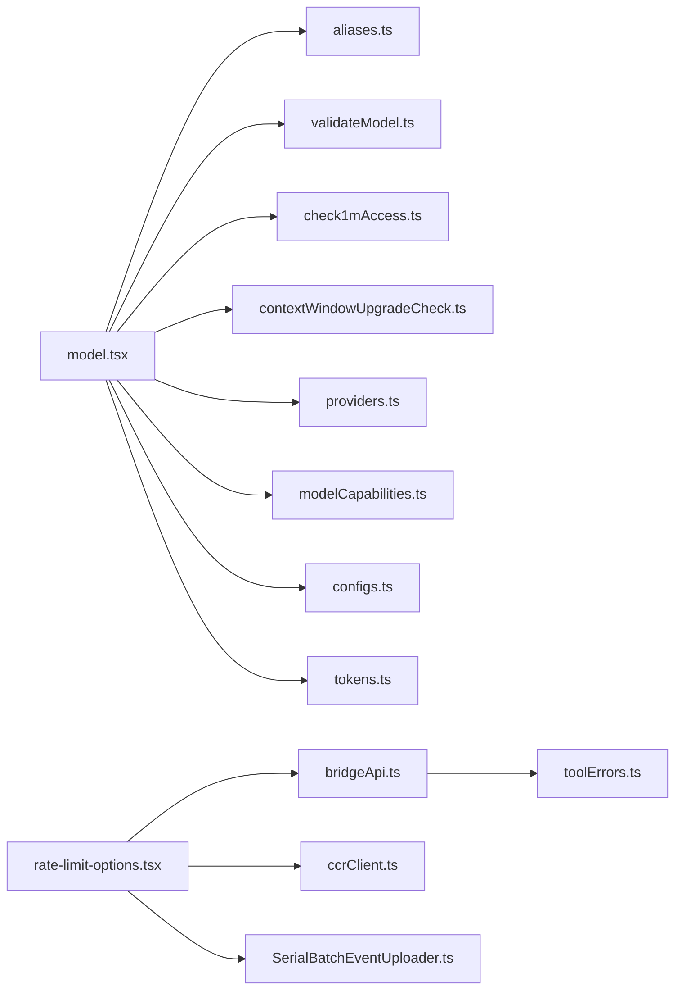

# 模型配置设置

<cite>
**本文引用的文件**
- [src/commands/model/model.tsx](file://src/commands/model/model.tsx)
- [src/utils/model/aliases.ts](file://src/utils/model/aliases.ts)
- [src/utils/model/check1mAccess.ts](file://src/utils/model/check1mAccess.ts)
- [src/utils/model/contextWindowUpgradeCheck.ts](file://src/utils/model/contextWindowUpgradeCheck.ts)
- [src/utils/model/validateModel.ts](file://src/utils/model/validateModel.ts)
- [src/utils/model/providers.ts](file://src/utils/model/providers.ts)
- [src/utils/model/modelCapabilities.ts](file://src/utils/model/modelCapabilities.ts)
- [src/utils/model/configs.ts](file://src/utils/model/configs.ts)
- [src/utils/model/model.ts](file://src/utils/model/model.ts)
- [src/utils/tokens.ts](file://src/utils/tokens.ts)
- [src/commands/rate-limit-options/rate-limit-options.tsx](file://src/commands/rate-limit-options/rate-limit-options.tsx)
- [src/commands/rate-limit-options/index.ts](file://src/commands/rate-limit-options/index.ts)
- [src/bridge/bridgeApi.ts](file://src/bridge/bridgeApi.ts)
- [src/cli/transports/ccrClient.ts](file://src/cli/transports/ccrClient.ts)
- [src/cli/transports/SerialBatchEventUploader.ts](file://src/cli/transports/SerialBatchEventUploader.ts)
- [src/utils/toolErrors.ts](file://src/utils/toolErrors.ts)
</cite>

## 目录
1. [简介](#简介)
2. [项目结构](#项目结构)
3. [核心组件](#核心组件)
4. [架构总览](#架构总览)
5. [详细组件分析](#详细组件分析)
6. [依赖关系分析](#依赖关系分析)
7. [性能考量](#性能考量)
8. [故障排除指南](#故障排除指南)
9. [结论](#结论)
10. [附录](#附录)

## 简介
本文件系统性梳理了代码库中的“模型配置设置”能力，覆盖模型选择、参数调整、上下文窗口配置、模型别名、提供商配置、模型能力检测、切换最佳实践与性能优化建议，以及配置验证规则与错误处理机制。目标是帮助开发者与使用者在不同场景下正确、安全地配置与切换模型，并获得稳定、可预期的性能表现。

## 项目结构
围绕模型配置的核心实现主要集中在以下模块：
- 命令层：负责用户交互与模型配置入口（如命令行或界面操作）
- 工具层：提供模型别名、提供商、能力检测、1M上下文访问检查、配置校验等工具函数
- 传输层：封装与远端服务通信的客户端与重试策略
- 错误处理层：统一描述错误、提取细节、区分致命与非致命错误

图表来源
- [src/commands/model/model.tsx](file://src/commands/model/model.tsx)
- [src/commands/rate-limit-options/rate-limit-options.tsx](file://src/commands/rate-limit-options/rate-limit-options.tsx)
- [src/utils/model/aliases.ts](file://src/utils/model/aliases.ts)
- [src/utils/model/providers.ts](file://src/utils/model/providers.ts)
- [src/utils/model/modelCapabilities.ts](file://src/utils/model/modelCapabilities.ts)
- [src/utils/model/validateModel.ts](file://src/utils/model/validateModel.ts)
- [src/utils/model/check1mAccess.ts](file://src/utils/model/check1mAccess.ts)
- [src/utils/model/contextWindowUpgradeCheck.ts](file://src/utils/model/contextWindowUpgradeCheck.ts)
- [src/utils/model/configs.ts](file://src/utils/model/configs.ts)
- [src/utils/model/model.ts](file://src/utils/model/model.ts)
- [src/utils/tokens.ts](file://src/utils/tokens.ts)
- [src/cli/transports/ccrClient.ts](file://src/cli/transports/ccrClient.ts)
- [src/cli/transports/SerialBatchEventUploader.ts](file://src/cli/transports/SerialBatchEventUploader.ts)
- [src/bridge/bridgeApi.ts](file://src/bridge/bridgeApi.ts)
- [src/utils/toolErrors.ts](file://src/utils/toolErrors.ts)

章节来源
- [src/commands/model/model.tsx](file://src/commands/model/model.tsx)
- [src/utils/model/aliases.ts](file://src/utils/model/aliases.ts)
- [src/utils/model/providers.ts](file://src/utils/model/providers.ts)
- [src/utils/model/modelCapabilities.ts](file://src/utils/model/modelCapabilities.ts)
- [src/utils/model/validateModel.ts](file://src/utils/model/validateModel.ts)
- [src/utils/model/check1mAccess.ts](file://src/utils/model/check1mAccess.ts)
- [src/utils/model/contextWindowUpgradeCheck.ts](file://src/utils/model/contextWindowUpgradeCheck.ts)
- [src/utils/model/configs.ts](file://src/utils/model/configs.ts)
- [src/utils/model/model.ts](file://src/utils/model/model.ts)
- [src/utils/tokens.ts](file://src/utils/tokens.ts)
- [src/commands/rate-limit-options/rate-limit-options.tsx](file://src/commands/rate-limit-options/rate-limit-options.tsx)
- [src/cli/transports/ccrClient.ts](file://src/cli/transports/ccrClient.ts)
- [src/cli/transports/SerialBatchEventUploader.ts](file://src/cli/transports/SerialBatchEventUploader.ts)
- [src/bridge/bridgeApi.ts](file://src/bridge/bridgeApi.ts)
- [src/utils/toolErrors.ts](file://src/utils/toolErrors.ts)

## 核心组件
- 模型选择与切换
  - 支持默认模型、已知别名、1M上下文访问限制检查、以及校验通过后设置模型
- 上下文窗口配置
  - 提供1M上下文访问检查与升级路径提示
  - 使用令牌计数与消息流估计进行上下文大小评估
- 模型别名与提供商
  - 别名映射与已知别名跳过校验逻辑
  - 提供商配置与能力检测
- 配置验证与错误处理
  - 统一的模型校验流程与错误信息构建
  - 远端通信错误分类与重试策略
  - 速率限制与桥接状态错误处理

章节来源
- [src/commands/model/model.tsx](file://src/commands/model/model.tsx)
- [src/utils/model/check1mAccess.ts](file://src/utils/model/check1mAccess.ts)
- [src/utils/model/contextWindowUpgradeCheck.ts](file://src/utils/model/contextWindowUpgradeCheck.ts)
- [src/utils/model/validateModel.ts](file://src/utils/model/validateModel.ts)
- [src/utils/model/aliases.ts](file://src/utils/model/aliases.ts)
- [src/utils/model/providers.ts](file://src/utils/model/providers.ts)
- [src/utils/model/modelCapabilities.ts](file://src/utils/model/modelCapabilities.ts)
- [src/utils/tokens.ts](file://src/utils/tokens.ts)
- [src/utils/toolErrors.ts](file://src/utils/toolErrors.ts)
- [src/cli/transports/ccrClient.ts](file://src/cli/transports/ccrClient.ts)
- [src/cli/transports/SerialBatchEventUploader.ts](file://src/cli/transports/SerialBatchEventUploader.ts)
- [src/bridge/bridgeApi.ts](file://src/bridge/bridgeApi.ts)

## 架构总览
模型配置设置贯穿“命令层 -> 工具层 -> 传输层”的调用链路，同时在“速率限制/桥接状态/远端错误”等维度上具备完善的错误处理与重试机制。

图表来源
- [src/commands/model/model.tsx](file://src/commands/model/model.tsx)
- [src/utils/model/validateModel.ts](file://src/utils/model/validateModel.ts)
- [src/utils/model/aliases.ts](file://src/utils/model/aliases.ts)
- [src/utils/model/check1mAccess.ts](file://src/utils/model/check1mAccess.ts)
- [src/utils/model/providers.ts](file://src/utils/model/providers.ts)
- [src/utils/model/modelCapabilities.ts](file://src/utils/model/modelCapabilities.ts)
- [src/utils/model/configs.ts](file://src/utils/model/configs.ts)

## 详细组件分析

### 模型选择与切换流程
- 默认模型：允许不指定模型，表示使用默认值
- 已知别名：对预定义别名跳过校验，直接应用
- 1M上下文访问：针对特定模型（如 Opus/Sonnet）检查账户是否具备1M上下文访问权限，若无则提示并阻止切换
- 校验通过：执行通用模型校验，失败时返回结构化错误信息

图表来源
- [src/commands/model/model.tsx](file://src/commands/model/model.tsx)
- [src/utils/model/check1mAccess.ts](file://src/utils/model/check1mAccess.ts)
- [src/utils/model/validateModel.ts](file://src/utils/model/validateModel.ts)
- [src/utils/model/aliases.ts](file://src/utils/model/aliases.ts)

章节来源
- [src/commands/model/model.tsx](file://src/commands/model/model.tsx)

### 上下文窗口配置与令牌估算
- 令牌估算策略：基于最后一次API响应的输入/输出/缓存令牌数，并对新增消息进行粗略估计，避免累计计数导致的重复计算
- 并行工具调用场景：当模型一次响应中包含多个工具调用时，消息数组会交错插入工具结果，需回溯到同一条消息的第一个兄弟节点以包含所有工具结果，从而避免低估

章节来源
- [src/utils/tokens.ts](file://src/utils/tokens.ts)

### 模型别名与提供商配置
- 别名映射：支持通过别名快速切换常用模型，避免复杂字符串输入
- 已知别名跳过校验：提升用户体验，减少不必要的校验开销
- 提供商配置：解析并应用提供商参数（如模型名称、版本、能力开关等）

章节来源
- [src/utils/model/aliases.ts](file://src/utils/model/aliases.ts)
- [src/utils/model/providers.ts](file://src/utils/model/providers.ts)

### 模型能力检测
- 能力检测：在切换前对模型的能力进行检测，确保满足当前任务需求（如多模态、工具调用、长上下文等）
- 结合上下文窗口与令牌估算，动态评估是否需要降级或调整策略

章节来源
- [src/utils/model/modelCapabilities.ts](file://src/utils/model/modelCapabilities.ts)

### 配置验证规则与错误处理
- 统一校验：对模型名称、参数类型、必需字段进行校验，生成结构化错误信息
- 工具错误增强：针对工具调用参数缺失、意外参数、类型不匹配等情况，构建可读性强的错误描述
- 远端错误分类：对HTTP状态码进行分类处理，区分认证失败、权限不足、资源不存在、速率限制等场景
- 重试与退避：在客户端层面采用指数退避+抖动策略，结合服务器返回的Retry-After提示，缓解并发压力

章节来源
- [src/utils/model/validateModel.ts](file://src/utils/model/validateModel.ts)
- [src/utils/toolErrors.ts](file://src/utils/toolErrors.ts)
- [src/bridge/bridgeApi.ts](file://src/bridge/bridgeApi.ts)
- [src/cli/transports/ccrClient.ts](file://src/cli/transports/ccrClient.ts)
- [src/cli/transports/SerialBatchEventUploader.ts](file://src/cli/transports/SerialBatchEventUploader.ts)

### 速率限制与桥接状态处理
- 速率限制菜单：在达到限额时提供多种操作选项（等待重置、购买额度、升级计划等），并记录用户行为事件
- 桥接状态错误：对401/403/404/410/429等状态进行明确的错误提示与恢复指引
- 传输层重试：在GET请求失败时进行最多10次重试，指数退避并加入随机抖动，避免雪崩效应

章节来源
- [src/commands/rate-limit-options/rate-limit-options.tsx](file://src/commands/rate-limit-options/rate-limit-options.tsx)
- [src/commands/rate-limit-options/index.ts](file://src/commands/rate-limit-options/index.ts)
- [src/bridge/bridgeApi.ts](file://src/bridge/bridgeApi.ts)
- [src/cli/transports/ccrClient.ts](file://src/cli/transports/ccrClient.ts)
- [src/cli/transports/SerialBatchEventUploader.ts](file://src/cli/transports/SerialBatchEventUploader.ts)

## 依赖关系分析
- 命令层依赖工具层的别名、提供商、能力、校验、1M访问检查与配置模块
- 工具层内部模块相互协作，形成“别名 -> 校验 -> 提供商/能力 -> 配置”的闭环
- 传输层与错误处理层为命令层提供稳定的远端通信与错误恢复能力

图表来源
- [src/commands/model/model.tsx](file://src/commands/model/model.tsx)
- [src/utils/model/aliases.ts](file://src/utils/model/aliases.ts)
- [src/utils/model/validateModel.ts](file://src/utils/model/validateModel.ts)
- [src/utils/model/check1mAccess.ts](file://src/utils/model/check1mAccess.ts)
- [src/utils/model/contextWindowUpgradeCheck.ts](file://src/utils/model/contextWindowUpgradeCheck.ts)
- [src/utils/model/providers.ts](file://src/utils/model/providers.ts)
- [src/utils/model/modelCapabilities.ts](file://src/utils/model/modelCapabilities.ts)
- [src/utils/model/configs.ts](file://src/utils/model/configs.ts)
- [src/utils/tokens.ts](file://src/utils/tokens.ts)
- [src/commands/rate-limit-options/rate-limit-options.tsx](file://src/commands/rate-limit-options/rate-limit-options.tsx)
- [src/bridge/bridgeApi.ts](file://src/bridge/bridgeApi.ts)
- [src/cli/transports/ccrClient.ts](file://src/cli/transports/ccrClient.ts)
- [src/cli/transports/SerialBatchEventUploader.ts](file://src/cli/transports/SerialBatchEventUploader.ts)
- [src/utils/toolErrors.ts](file://src/utils/toolErrors.ts)

## 性能考量
- 令牌估算准确性：优先使用最后API响应的令牌统计并叠加新增消息估计，避免累计计数导致的偏差
- 并行工具调用处理：在存在交错工具结果时，回溯到同消息首个兄弟节点，确保所有工具结果被纳入估算
- 重试与退避：指数退避+抖动策略降低服务器压力峰值；结合服务器Retry-After提示，进一步优化重试时机
- 别名与默认模型：对已知别名跳过校验，减少不必要的网络与解析开销；默认模型无需额外配置

## 故障排除指南
- 1M上下文不可用
  - 现象：切换至支持1M上下文的模型时报错
  - 处理：根据提示了解账户权限情况，按指引申请或升级
- 模型校验失败
  - 现象：模型名称或参数不符合规范
  - 处理：依据结构化错误信息修正模型名称、参数类型或补充缺失字段
- 远端错误
  - 401/403：检查鉴权与组织权限
  - 404：确认资源是否存在或功能是否开放
  - 410：会话已过期，重新启动远程控制
  - 429：触发速率限制，稍后再试或降低请求频率
- 传输层异常
  - GET请求失败：自动重试最多10次，指数退避+抖动；关注日志中的状态码与重试次数

章节来源
- [src/commands/model/model.tsx](file://src/commands/model/model.tsx)
- [src/utils/model/check1mAccess.ts](file://src/utils/model/check1mAccess.ts)
- [src/utils/model/validateModel.ts](file://src/utils/model/validateModel.ts)
- [src/utils/toolErrors.ts](file://src/utils/toolErrors.ts)
- [src/bridge/bridgeApi.ts](file://src/bridge/bridgeApi.ts)
- [src/cli/transports/ccrClient.ts](file://src/cli/transports/ccrClient.ts)
- [src/cli/transports/SerialBatchEventUploader.ts](file://src/cli/transports/SerialBatchEventUploader.ts)

## 结论
该模型配置体系通过“别名、校验、提供商、能力、1M上下文访问检查、令牌估算、错误处理与重试”等模块协同工作，实现了从用户交互到远端通信的完整闭环。遵循本文档的最佳实践与验证规则，可在保证稳定性的同时获得更优的性能体验。

## 附录
- 最佳实践
  - 优先使用已知别名进行快速切换
  - 在启用1M上下文前先检查账户权限
  - 切换模型前后关注令牌估算变化，避免超出预算
  - 遇到速率限制时优先等待重置或降低频率
- 关键流程参考
  - 模型切换主流程：[src/commands/model/model.tsx](file://src/commands/model/model.tsx)
  - 令牌估算策略：[src/utils/tokens.ts](file://src/utils/tokens.ts)
  - 速率限制菜单与桥接错误处理：[src/commands/rate-limit-options/rate-limit-options.tsx](file://src/commands/rate-limit-options/rate-limit-options.tsx)、[src/bridge/bridgeApi.ts](file://src/bridge/bridgeApi.ts)
  - 传输层重试与退避：[src/cli/transports/ccrClient.ts](file://src/cli/transports/ccrClient.ts)、[src/cli/transports/SerialBatchEventUploader.ts](file://src/cli/transports/SerialBatchEventUploader.ts)