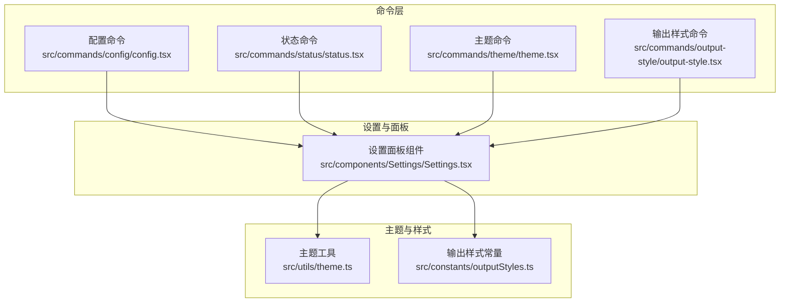
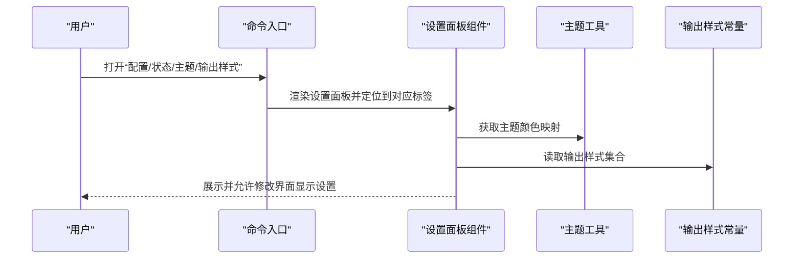
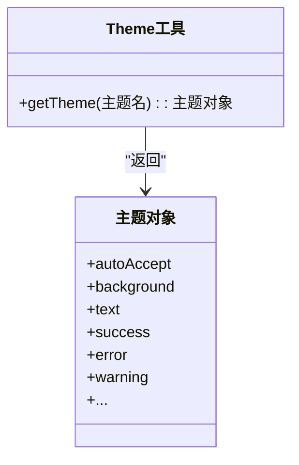
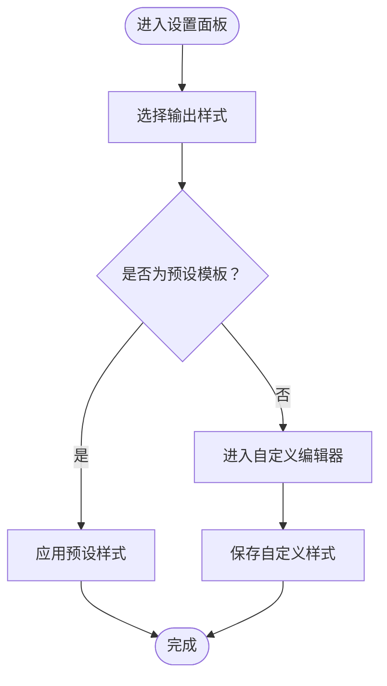
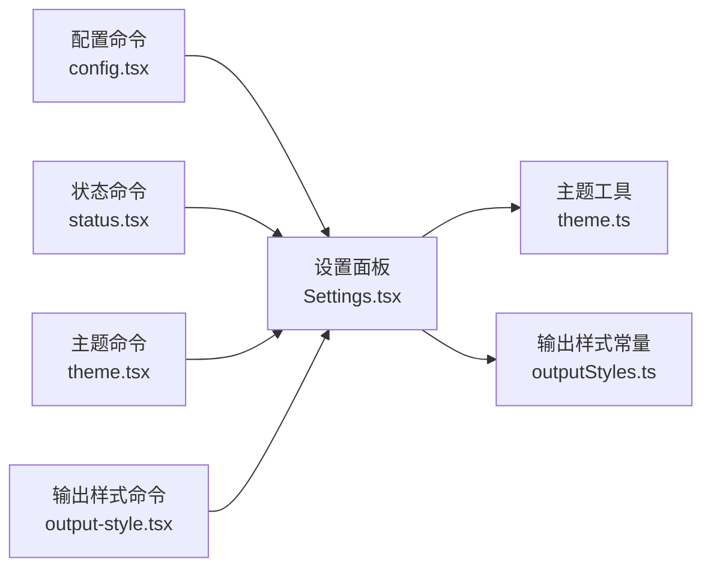

# 界面显示设置

<cite>
**本文引用的文件**
- [src/components/Settings/Settings.tsx](file://src/components/Settings/Settings.tsx)
- [src/commands/config/config.tsx](file://src/commands/config/config.tsx)
- [src/commands/theme/theme.tsx](file://src/commands/theme/theme.tsx)
- [src/commands/output-style/output-style.tsx](file://src/commands/output-style/output-style.tsx)
- [src/utils/theme.ts](file://src/utils/theme.ts)
- [src/constants/outputStyles.ts](file://src/constants/outputStyles.ts)
- [src/commands/status/status.tsx](file://src/commands/status/status.tsx)
</cite>

## 目录
1. [简介](#简介)
2. [项目结构](#项目结构)
3. [核心组件](#核心组件)
4. [架构总览](#架构总览)
5. [详细组件分析](#详细组件分析)
6. [依赖关系分析](#依赖关系分析)
7. [性能考量](#性能考量)
8. [故障排查指南](#故障排查指南)
9. [结论](#结论)
10. [附录](#附录)

## 简介
本文件系统性梳理与“界面显示设置”相关的功能与实现，覆盖主题配置（明暗主题、ANSI 兼容、色觉友好）、输出样式（预设模板与自定义）、字体与显示密度、动画效果、布局偏好以及响应式与无障碍支持建议。内容基于仓库中的命令入口、设置面板组件、主题工具与输出样式常量进行归纳总结，并提供面向不同使用场景的配置建议。

## 项目结构
与界面显示设置直接相关的模块分布如下：
- 设置入口与面板：通过命令调用打开设置面板，默认定位到“配置”或“状态”标签页
- 主题系统：提供多套主题（明/暗/ANSI/色觉友好）及颜色映射
- 输出样式：内置输出样式的常量集合，支持在设置中选择与切换
- 布局与显示：设置面板内部包含布局、显示密度、动画等个性化选项

图表来源
- [src/commands/config/config.tsx](file://src/commands/config/config.tsx)
- [src/commands/status/status.tsx](file://src/commands/status/status.tsx)
- [src/commands/theme/theme.tsx](file://src/commands/theme/theme.tsx)
- [src/commands/output-style/output-style.tsx](file://src/commands/output-style/output-style.tsx)
- [src/components/Settings/Settings.tsx](file://src/components/Settings/Settings.tsx)
- [src/utils/theme.ts](file://src/utils/theme.ts)
- [src/constants/outputStyles.ts](file://src/constants/outputStyles.ts)

章节来源
- [src/commands/config/config.tsx](file://src/commands/config/config.tsx)
- [src/commands/status/status.tsx](file://src/commands/status/status.tsx)
- [src/commands/theme/theme.tsx](file://src/commands/theme/theme.tsx)
- [src/commands/output-style/output-style.tsx](file://src/commands/output-style/output-style.tsx)
- [src/components/Settings/Settings.tsx](file://src/components/Settings/Settings.tsx)
- [src/utils/theme.ts](file://src/utils/theme.ts)
- [src/constants/outputStyles.ts](file://src/constants/outputStyles.ts)

## 核心组件
- 配置命令入口：打开设置面板并默认定位到“配置”标签页
- 状态命令入口：打开设置面板并默认定位到“状态”标签页
- 主题命令入口：打开设置面板并默认定位到“主题”标签页
- 输出样式命令入口：打开设置面板并默认定位到“输出样式”标签页
- 设置面板组件：承载主题、输出样式、布局、显示密度、动画等设置项
- 主题工具：提供多套主题（明/暗/ANSI/色觉友好），并按名称返回对应颜色映射
- 输出样式常量：提供可选的输出样式集合，供设置面板选择与应用

章节来源
- [src/commands/config/config.tsx](file://src/commands/config/config.tsx)
- [src/commands/status/status.tsx](file://src/commands/status/status.tsx)
- [src/commands/theme/theme.tsx](file://src/commands/theme/theme.tsx)
- [src/commands/output-style/output-style.tsx](file://src/commands/output-style/output-style.tsx)
- [src/components/Settings/Settings.tsx](file://src/components/Settings/Settings.tsx)
- [src/utils/theme.ts](file://src/utils/theme.ts)
- [src/constants/outputStyles.ts](file://src/constants/outputStyles.ts)

## 架构总览
设置系统的控制流从命令入口进入，渲染设置面板组件；设置面板根据用户选择调用主题工具与输出样式常量，最终影响界面的颜色、排版与交互体验。

图表来源
- [src/commands/config/config.tsx](file://src/commands/config/config.tsx)
- [src/commands/status/status.tsx](file://src/commands/status/status.tsx)
- [src/commands/theme/theme.tsx](file://src/commands/theme/theme.tsx)
- [src/commands/output-style/output-style.tsx](file://src/commands/output-style/output-style.tsx)
- [src/components/Settings/Settings.tsx](file://src/components/Settings/Settings.tsx)
- [src/utils/theme.ts](file://src/utils/theme.ts)
- [src/constants/outputStyles.ts](file://src/constants/outputStyles.ts)

## 详细组件分析

### 设置面板组件（Settings）
- 职责：作为统一入口承载所有界面显示相关设置项，包括但不限于主题、输出样式、布局、显示密度、动画等
- 行为：接收关闭回调与上下文参数，支持默认标签页定位（如“配置”、“状态”）
- 交互：与主题工具和输出样式常量协作，将用户选择持久化并即时反映到界面

章节来源
- [src/components/Settings/Settings.tsx](file://src/components/Settings/Settings.tsx)

### 主题系统（Theme）
- 多套主题：
  - 明亮主题与 ANSI 版本
  - 深色主题与 ANSI 版本
  - 明亮/深色的色觉友好版本（daltonized）
- 颜色映射：每套主题返回一组颜色键值对，用于界面元素着色（文本、背景、强调、状态色等）
- 终端兼容：ANSI 主题仅使用标准 16 色，确保在无真彩支持的终端中也能正确呈现
- 使用方式：通过名称查询获取对应主题对象，再由设置面板应用到界面

图表来源
- [src/utils/theme.ts](file://src/utils/theme.ts)

章节来源
- [src/utils/theme.ts](file://src/utils/theme.ts)

### 输出样式（Output Styles）
- 定义：输出样式常量集合，描述不同输出风格的预设模板
- 作用：设置面板中提供下拉或列表选择，用户可快速切换输出外观（如紧凑型、详细型、卡片型等）
- 自定义：可通过扩展常量集合或在设置面板中新增“自定义”入口，允许用户微调间距、字体大小、高亮色等

图表来源
- [src/constants/outputStyles.ts](file://src/constants/outputStyles.ts)
- [src/commands/output-style/output-style.tsx](file://src/commands/output-style/output-style.tsx)

章节来源
- [src/constants/outputStyles.ts](file://src/constants/outputStyles.ts)
- [src/commands/output-style/output-style.tsx](file://src/commands/output-style/output-style.tsx)

### 字体设置与显示密度
- 字体：可在设置面板中选择字体族、字号与字重，以适配不同屏幕分辨率与阅读习惯
- 显示密度：提供“紧密/常规/宽松”等选项，调整行高、内边距与控件尺寸，提升可读性与信息密度
- 动画效果：可启用/禁用过渡动画、闪烁与高光效果，兼顾性能与视觉反馈

章节来源
- [src/components/Settings/Settings.tsx](file://src/components/Settings/Settings.tsx)

### 布局与个性化选项
- 布局：支持侧边栏/主内容区的展开/折叠、消息列表的排序与分组
- 个性化：允许用户自定义快捷键、提示词、会话摘要展示方式等

章节来源
- [src/components/Settings/Settings.tsx](file://src/components/Settings/Settings.tsx)

### 响应式适配与无障碍支持
- 响应式：根据终端宽度与高度动态调整布局与字体大小，避免截断与滚动困难
- 无障碍：优先保证对比度（明/暗/色觉友好主题），提供键盘导航与语音朗读支持；减少不必要的闪烁与动画

章节来源
- [src/utils/theme.ts](file://src/utils/theme.ts)
- [src/components/Settings/Settings.tsx](file://src/components/Settings/Settings.tsx)

## 依赖关系分析
设置系统的关键依赖关系如下：

图表来源
- [src/commands/config/config.tsx](file://src/commands/config/config.tsx)
- [src/commands/status/status.tsx](file://src/commands/status/status.tsx)
- [src/commands/theme/theme.tsx](file://src/commands/theme/theme.tsx)
- [src/commands/output-style/output-style.tsx](file://src/commands/output-style/output-style.tsx)
- [src/components/Settings/Settings.tsx](file://src/components/Settings/Settings.tsx)
- [src/utils/theme.ts](file://src/utils/theme.ts)
- [src/constants/outputStyles.ts](file://src/constants/outputStyles.ts)

章节来源
- [src/commands/config/config.tsx](file://src/commands/config/config.tsx)
- [src/commands/status/status.tsx](file://src/commands/status/status.tsx)
- [src/commands/theme/theme.tsx](file://src/commands/theme/theme.tsx)
- [src/commands/output-style/output-style.tsx](file://src/commands/output-style/output-style.tsx)
- [src/components/Settings/Settings.tsx](file://src/components/Settings/Settings.tsx)
- [src/utils/theme.ts](file://src/utils/theme.ts)
- [src/constants/outputStyles.ts](file://src/constants/outputStyles.ts)

## 性能考量
- 主题切换：ANSI 主题在低色彩终端上更轻量，避免复杂渐变与阴影带来的渲染压力
- 输出样式：预设模板优先采用简洁结构，减少 DOM 节点数量与重绘范围
- 动画：在低端设备上建议关闭过渡动画或降低帧率，避免掉帧

## 故障排查指南
- 主题不生效
  - 检查当前终端是否支持真彩；若不支持，切换至 ANSI 主题
  - 确认设置面板已保存主题变更
- 输出样式异常
  - 尝试切换回默认预设，确认问题是否与自定义设置有关
  - 若使用自定义样式，逐步还原字段以定位冲突项
- 键盘/焦点问题
  - 在设置面板中检查快捷键冲突与焦点管理
- 无障碍相关
  - 提升对比度（明/暗/色觉友好主题）
  - 关闭闪烁与高光效果，必要时启用降敏模式

章节来源
- [src/utils/theme.ts](file://src/utils/theme.ts)
- [src/components/Settings/Settings.tsx](file://src/components/Settings/Settings.tsx)

## 结论
界面显示设置围绕“主题—输出样式—布局与密度—动画—无障碍”五大维度构建。通过命令入口统一打开设置面板，结合主题工具与输出样式常量，用户可以灵活定制符合自身需求与偏好的界面表现。建议在不同场景下选择合适的主题与输出样式，并根据设备性能与可访问性要求调整动画与对比度。

## 附录
- 不同使用场景的配置建议
  - 开发/终端重度使用者：明/暗 ANSI 主题 + 紧密显示密度 + 关闭非必要动画
  - 长时间阅读/写作：明亮主题 + 常规密度 + 适度行高与字号
  - 色觉障碍用户：色觉友好主题（明亮/深色）+ 高对比度 + 减少闪烁
  - 多显示器/大屏：深色主题 + 宽松密度 + 卡片型输出样式
  - 低性能设备：ANSI 主题 + 简洁输出样式 + 关闭动画