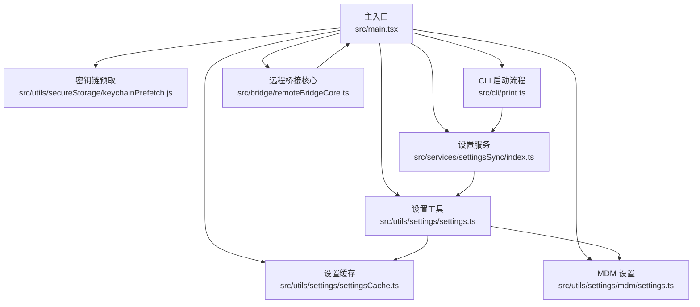
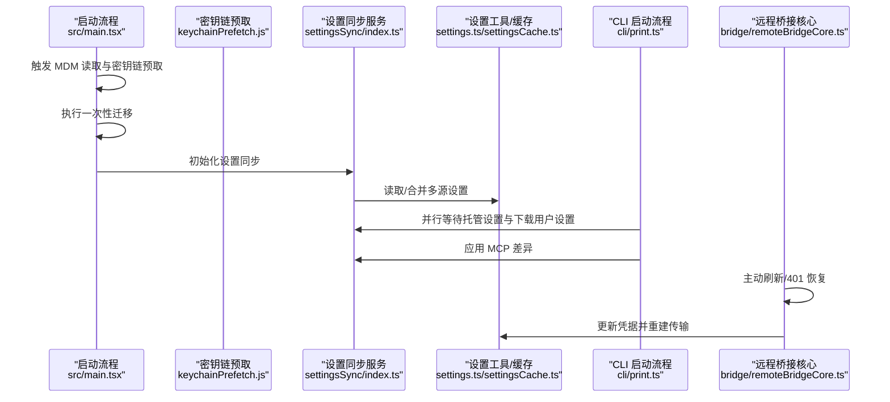
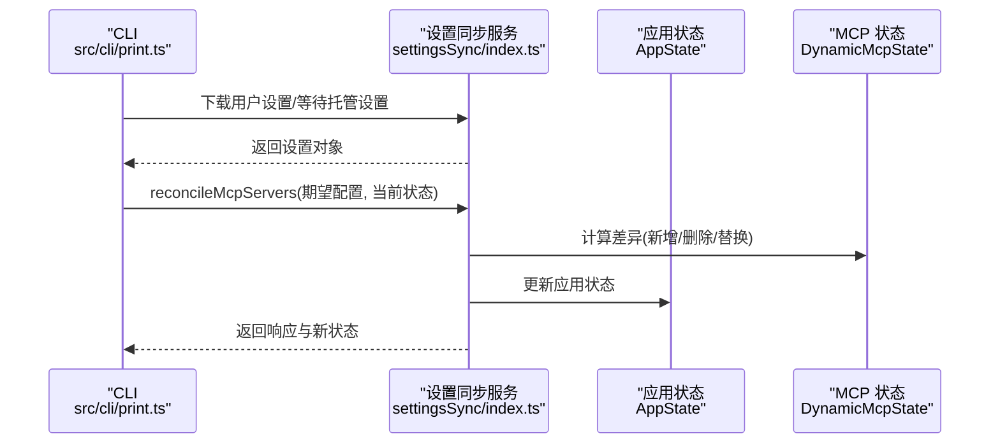
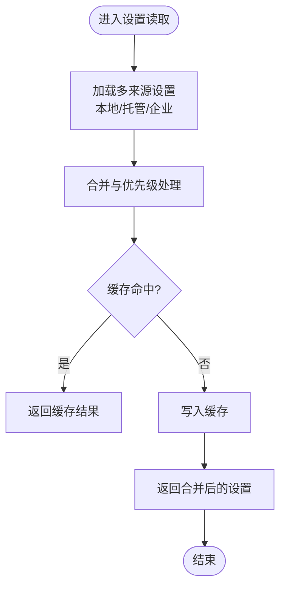
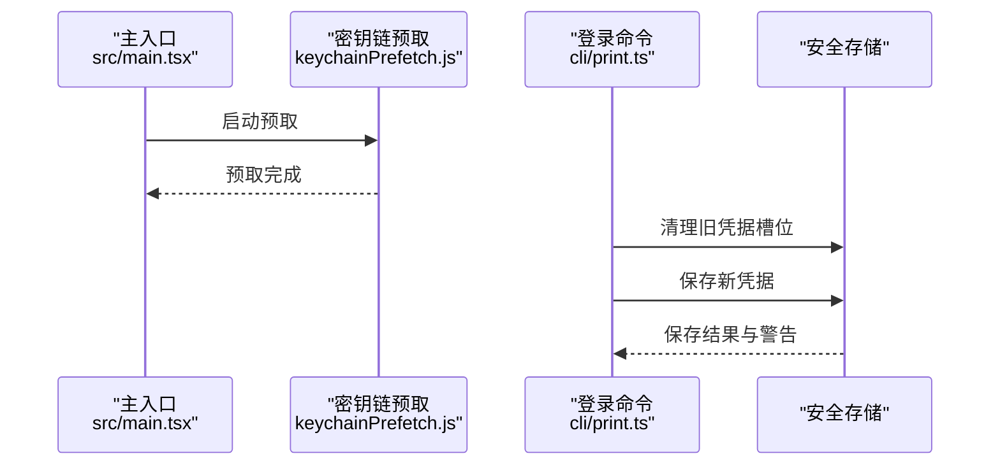
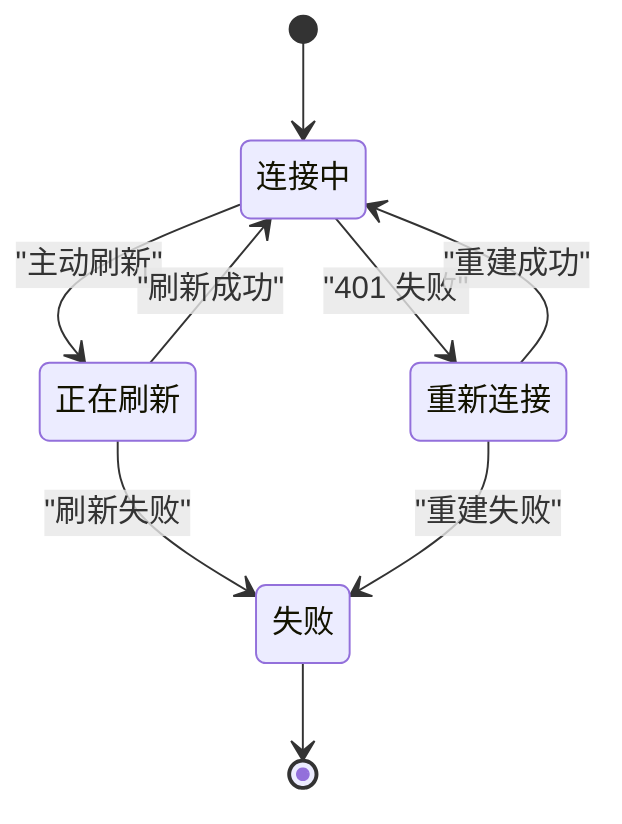
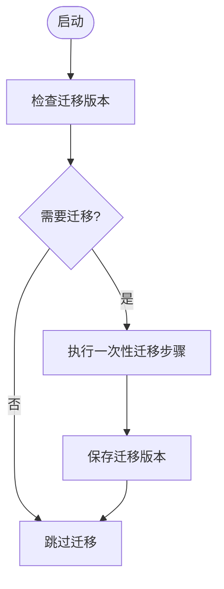
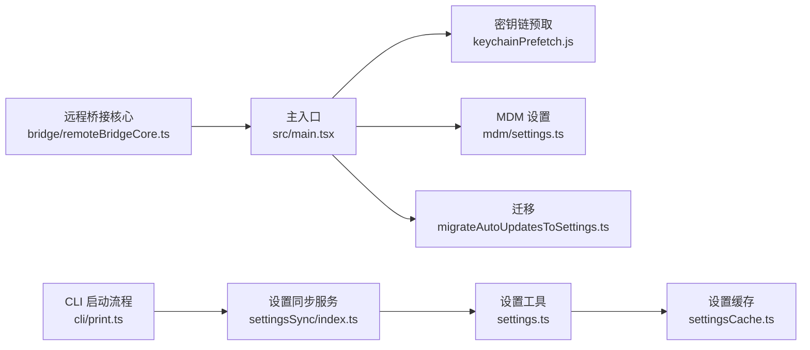

# 设置同步与备份

<cite>
**本文引用的文件**
- [src/main.tsx](file://src/main.tsx)
- [src/services/settingsSync/index.ts](file://src/services/settingsSync/index.ts)
- [src/utils/settings/settings.ts](file://src/utils/settings/settings.ts)
- [src/utils/settings/settingsCache.ts](file://src/utils/settings/settingsCache.ts)
- [src/utils/settings/mdm/settings.ts](file://src/utils/settings/mdm/settings.ts)
- [src/utils/secureStorage/keychainPrefetch.js](file://src/utils/secureStorage/keychainPrefetch.js)
- [src/bridge/remoteBridgeCore.ts](file://src/bridge/remoteBridgeCore.ts)
- [src/cli/print.ts](file://src/cli/print.ts)
- [src/migrations/migrateAutoUpdatesToSettings.ts](file://src/migrations/migrateAutoUpdatesToSettings.ts)
</cite>

## 目录
1. [简介](#简介)
2. [项目结构](#项目结构)
3. [核心组件](#核心组件)
4. [架构总览](#架构总览)
5. [详细组件分析](#详细组件分析)
6. [依赖关系分析](#依赖关系分析)
7. [性能考量](#性能考量)
8. [故障排查指南](#故障排查指南)
9. [结论](#结论)
10. [附录](#附录)

## 简介
本文件系统性阐述本仓库中的“设置同步与备份”能力，覆盖以下主题：
- 设置同步机制：本地与远程设置的来源、合并策略、冲突解决与增量更新
- 备份策略：安全存储、密钥链集成、离线可用性与可恢复性
- 版本管理与迁移：迁移版本号、一次性迁移与异步迁移
- 安全性与一致性：凭据刷新、状态机保护、幂等写入与缓存一致性
- 最佳实践与灾难恢复：备份流程、回滚与恢复建议

## 项目结构
围绕设置同步与备份的关键模块分布如下：
- 入口与启动阶段：主进程入口负责迁移、预取密钥链、等待托管设置加载
- 设置服务：设置同步服务、设置读取与缓存、MDM 设置集成
- 安全存储：密钥链预取与凭据管理
- 远程桥接：远程会话凭据刷新与状态恢复
- CLI：在无头模式下下载用户设置并应用 MCP 变更

图示来源
- [src/main.tsx:13-16](file://src/main.tsx#L13-L16)
- [src/main.tsx:323-352](file://src/main.tsx#L323-L352)
- [src/services/settingsSync/index.ts](file://src/services/settingsSync/index.ts)
- [src/utils/settings/settings.ts](file://src/utils/settings/settings.ts)
- [src/utils/settings/settingsCache.ts](file://src/utils/settings/settingsCache.ts)
- [src/utils/settings/mdm/settings.ts](file://src/utils/settings/mdm/settings.ts)
- [src/utils/secureStorage/keychainPrefetch.js](file://src/utils/secureStorage/keychainPrefetch.js)
- [src/cli/print.ts:1703-1729](file://src/cli/print.ts#L1703-L1729)
- [src/bridge/remoteBridgeCore.ts:332-377](file://src/bridge/remoteBridgeCore.ts#L332-L377)

章节来源
- [src/main.tsx:13-16](file://src/main.tsx#L13-L16)
- [src/main.tsx:323-352](file://src/main.tsx#L323-L352)
- [src/cli/print.ts:1703-1729](file://src/cli/print.ts#L1703-L1729)

## 核心组件
- 主入口与迁移
  - 在启动早期触发 MDM 读取与密钥链预取，以并行缩短冷启动时间
  - 执行一次性迁移（迁移版本号控制），并在成功后持久化版本
  - 异步迁移（非阻塞）用于数据重构，失败静默重试
- 设置服务与缓存
  - 提供设置读取、合并、缓存与失效机制
  - 支持多来源设置（如企业 MDM）的优先级与合并
- 安全存储与凭据
  - 密钥链预取确保凭据可用性，避免启动时同步阻塞
  - 登录命令中对旧 Issuer/Client 清理与新凭据保存，防止审计不一致
- 远程桥接与凭据刷新
  - 基于过期时间调度的主动刷新与 401 恢复重建传输
  - 防止并发恢复导致的重复重建
- CLI 与无头模式
  - 在无头模式下并行等待托管设置与下载用户设置，随后安装插件并应用 MCP 差异

章节来源
- [src/main.tsx:13-16](file://src/main.tsx#L13-L16)
- [src/main.tsx:323-352](file://src/main.tsx#L323-L352)
- [src/utils/settings/settings.ts](file://src/utils/settings/settings.ts)
- [src/utils/settings/settingsCache.ts](file://src/utils/settings/settingsCache.ts)
- [src/utils/settings/mdm/settings.ts](file://src/utils/settings/mdm/settings.ts)
- [src/utils/secureStorage/keychainPrefetch.js](file://src/utils/secureStorage/keychainPrefetch.js)
- [src/bridge/remoteBridgeCore.ts:332-377](file://src/bridge/remoteBridgeCore.ts#L332-L377)
- [src/cli/print.ts:1703-1729](file://src/cli/print.ts#L1703-L1729)

## 架构总览
设置同步与备份的整体流程包括：启动阶段初始化迁移与预取 → 读取多源设置（本地/托管/企业）→ 缓存与合并 → 应用到运行时（含 MCP 服务器）→ 凭据刷新与一致性保障。

图示来源
- [src/main.tsx:13-16](file://src/main.tsx#L13-L16)
- [src/main.tsx:323-352](file://src/main.tsx#L323-L352)
- [src/services/settingsSync/index.ts](file://src/services/settingsSync/index.ts)
- [src/utils/settings/settings.ts](file://src/utils/settings/settings.ts)
- [src/utils/settings/settingsCache.ts](file://src/utils/settings/settingsCache.ts)
- [src/cli/print.ts:1703-1729](file://src/cli/print.ts#L1703-L1729)
- [src/bridge/remoteBridgeCore.ts:332-377](file://src/bridge/remoteBridgeCore.ts#L332-L377)

## 详细组件分析

### 组件一：设置同步服务（settingsSync）
职责
- 负责从远程或托管源获取用户设置，并与本地设置进行合并
- 在无头模式下与 CLI 协作，确保设置在应用前完成下载与生效
- 与 MCP 服务器配置变更协调，实现增量更新

关键行为
- 并行等待托管设置与下载用户设置，降低启动延迟
- 将 MCP 期望状态与当前状态对比，执行增删改操作
- 对于企业环境，限制动态 MCP 配置类型，确保合规

图示来源
- [src/cli/print.ts:1703-1729](file://src/cli/print.ts#L1703-L1729)
- [src/cli/print.ts:5446-5479](file://src/cli/print.ts#L5446-L5479)
- [src/services/settingsSync/index.ts](file://src/services/settingsSync/index.ts)

章节来源
- [src/cli/print.ts:1703-1729](file://src/cli/print.ts#L1703-L1729)
- [src/cli/print.ts:5446-5479](file://src/cli/print.ts#L5446-L5479)
- [src/services/settingsSync/index.ts](file://src/services/settingsSync/index.ts)

### 组件二：设置读取与缓存（settings + settingsCache）
职责
- 提供统一的设置读取接口，支持多来源合并与优先级
- 维护设置缓存，避免重复解析与 IO
- 支持 MDM 设置注入，满足企业集中管控需求

关键行为
- 多来源设置合并（例如企业 MDM 与用户设置）
- 缓存失效与重置，确保配置变更及时生效
- 与密钥链预取协同，减少启动时阻塞

图示来源
- [src/utils/settings/settings.ts](file://src/utils/settings/settings.ts)
- [src/utils/settings/settingsCache.ts](file://src/utils/settings/settingsCache.ts)
- [src/utils/settings/mdm/settings.ts](file://src/utils/settings/mdm/settings.ts)

章节来源
- [src/utils/settings/settings.ts](file://src/utils/settings/settings.ts)
- [src/utils/settings/settingsCache.ts](file://src/utils/settings/settingsCache.ts)
- [src/utils/settings/mdm/settings.ts](file://src/utils/settings/mdm/settings.ts)

### 组件三：密钥链预取与凭据管理
职责
- 在启动早期并行预取密钥链内容，避免后续同步调用造成阻塞
- 登录/切换凭据时清理旧凭据槽位，保存新凭据，确保审计一致性

关键行为
- 预取 OAuth 与历史 API Key，缩短启动时延
- 登录命令中根据 Issuer 与 Client ID 的变化清理旧令牌与密钥
- 保存客户端密钥时失败给出明确提示，便于用户重试

图示来源
- [src/main.tsx:13-16](file://src/main.tsx#L13-L16)
- [src/utils/secureStorage/keychainPrefetch.js](file://src/utils/secureStorage/keychainPrefetch.js)
- [src/cli/print.ts:1703-1729](file://src/cli/print.ts#L1703-L1729)

章节来源
- [src/main.tsx:13-16](file://src/main.tsx#L13-L16)
- [src/utils/secureStorage/keychainPrefetch.js](file://src/utils/secureStorage/keychainPrefetch.js)
- [src/cli/print.ts:1703-1729](file://src/cli/print.ts#L1703-L1729)

### 组件四：远程桥接与凭据刷新
职责
- 基于 JWT 过期时间调度主动刷新，避免频繁重建
- 在 401 场景下进行 OAuth 刷新并重建传输，防止连接中断
- 使用状态机与并发标志，避免重复恢复

图示来源
- [src/bridge/remoteBridgeCore.ts:332-377](file://src/bridge/remoteBridgeCore.ts#L332-L377)
- [src/bridge/remoteBridgeCore.ts:529-551](file://src/bridge/remoteBridgeCore.ts#L529-L551)

章节来源
- [src/bridge/remoteBridgeCore.ts:332-377](file://src/bridge/remoteBridgeCore.ts#L332-L377)
- [src/bridge/remoteBridgeCore.ts:529-551](file://src/bridge/remoteBridgeCore.ts#L529-L551)

### 组件五：迁移与版本管理
职责
- 通过迁移版本号控制一次性迁移的执行范围与次数
- 异步迁移用于非关键路径的数据重构，失败静默重试

关键行为
- 启动时检查迁移版本，未达目标则按顺序执行迁移步骤
- 成功后持久化版本号，避免重复执行
- 异步迁移使用异常捕获，不影响启动流程

图示来源
- [src/main.tsx:323-352](file://src/main.tsx#L323-L352)
- [src/migrations/migrateAutoUpdatesToSettings.ts](file://src/migrations/migrateAutoUpdatesToSettings.ts)

章节来源
- [src/main.tsx:323-352](file://src/main.tsx#L323-L352)
- [src/migrations/migrateAutoUpdatesToSettings.ts](file://src/migrations/migrateAutoUpdatesToSettings.ts)

## 依赖关系分析
- 启动阶段依赖
  - 主入口依赖密钥链预取与 MDM 读取，以提升启动性能
  - 迁移逻辑在设置读取之前执行，确保后续流程基于最新配置
- 设置服务依赖
  - 设置同步服务依赖设置工具与缓存，以实现高效读取与合并
  - CLI 与远程桥接在不同场景下与设置服务交互，确保配置一致性
- 安全存储依赖
  - 登录命令依赖安全存储清理与保存，确保凭据正确落盘

图示来源
- [src/main.tsx:13-16](file://src/main.tsx#L13-L16)
- [src/main.tsx:323-352](file://src/main.tsx#L323-L352)
- [src/services/settingsSync/index.ts](file://src/services/settingsSync/index.ts)
- [src/utils/settings/settings.ts](file://src/utils/settings/settings.ts)
- [src/utils/settings/settingsCache.ts](file://src/utils/settings/settingsCache.ts)
- [src/utils/settings/mdm/settings.ts](file://src/utils/settings/mdm/settings.ts)
- [src/utils/secureStorage/keychainPrefetch.js](file://src/utils/secureStorage/keychainPrefetch.js)
- [src/cli/print.ts:1703-1729](file://src/cli/print.ts#L1703-L1729)
- [src/bridge/remoteBridgeCore.ts:332-377](file://src/bridge/remoteBridgeCore.ts#L332-L377)
- [src/migrations/migrateAutoUpdatesToSettings.ts](file://src/migrations/migrateAutoUpdatesToSettings.ts)

章节来源
- [src/main.tsx:13-16](file://src/main.tsx#L13-L16)
- [src/main.tsx:323-352](file://src/main.tsx#L323-L352)
- [src/services/settingsSync/index.ts](file://src/services/settingsSync/index.ts)
- [src/utils/settings/settings.ts](file://src/utils/settings/settings.ts)
- [src/utils/settings/settingsCache.ts](file://src/utils/settings/settingsCache.ts)
- [src/utils/settings/mdm/settings.ts](file://src/utils/settings/mdm/settings.ts)
- [src/utils/secureStorage/keychainPrefetch.js](file://src/utils/secureStorage/keychainPrefetch.js)
- [src/cli/print.ts:1703-1729](file://src/cli/print.ts#L1703-L1729)
- [src/bridge/remoteBridgeCore.ts:332-377](file://src/bridge/remoteBridgeCore.ts#L332-L377)
- [src/migrations/migrateAutoUpdatesToSettings.ts](file://src/migrations/migrateAutoUpdatesToSettings.ts)

## 性能考量
- 启动并行化
  - MDM 读取与密钥链预取并行执行，缩短冷启动时间
- 缓存与合并
  - 设置缓存避免重复解析；多来源合并采用集合运算，复杂度与配置数量线性相关
- 迁移策略
  - 一次性迁移在启动时执行，异步迁移非阻塞，兼顾一致性与性能
- 远程桥接
  - 基于过期时间的主动刷新减少不必要的重建；401 恢复采用原子标志，避免竞态

## 故障排查指南
常见问题与定位要点
- 启动缓慢
  - 检查是否启用密钥链预取与 MDM 读取；确认网络与权限
- 设置未生效
  - 确认设置来源优先级与缓存是否已重置；查看合并日志
- 凭据错误或 401
  - 检查 OAuth 刷新流程与凭据槽位清理；确认新凭据保存成功
- 迁移失败
  - 查看一次性迁移是否已保存版本；异步迁移失败会被静默重试

章节来源
- [src/main.tsx:13-16](file://src/main.tsx#L13-L16)
- [src/utils/secureStorage/keychainPrefetch.js](file://src/utils/secureStorage/keychainPrefetch.js)
- [src/bridge/remoteBridgeCore.ts:529-551](file://src/bridge/remoteBridgeCore.ts#L529-L551)
- [src/main.tsx:323-352](file://src/main.tsx#L323-L352)

## 结论
本仓库通过“启动并行化 + 设置缓存 + 多源合并 + 迁移版本控制 + 凭据刷新与恢复”的组合，构建了稳定、高性能且可恢复的设置同步与备份体系。配合 CLI 与远程桥接的协作，实现了从本地到远程的一致性与安全性保障。

## 附录
- 最佳实践
  - 启动阶段开启密钥链预取与 MDM 读取
  - 使用迁移版本号管理配置演进，避免重复执行
  - 在企业环境中严格限制动态 MCP 配置类型
  - 登录/切换凭据时清理旧槽位并保存新凭据
- 灾难恢复
  - 保留最近一次设置快照与凭据备份
  - 若迁移失败，重启后异步迁移会自动重试
  - 401 时依赖 OAuth 刷新与传输重建，必要时手动重建