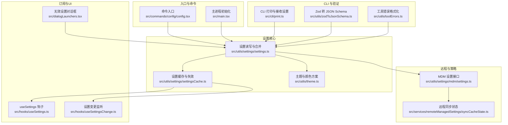
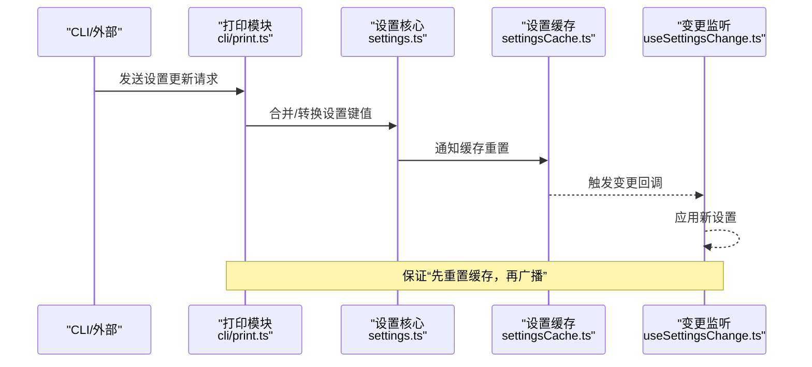
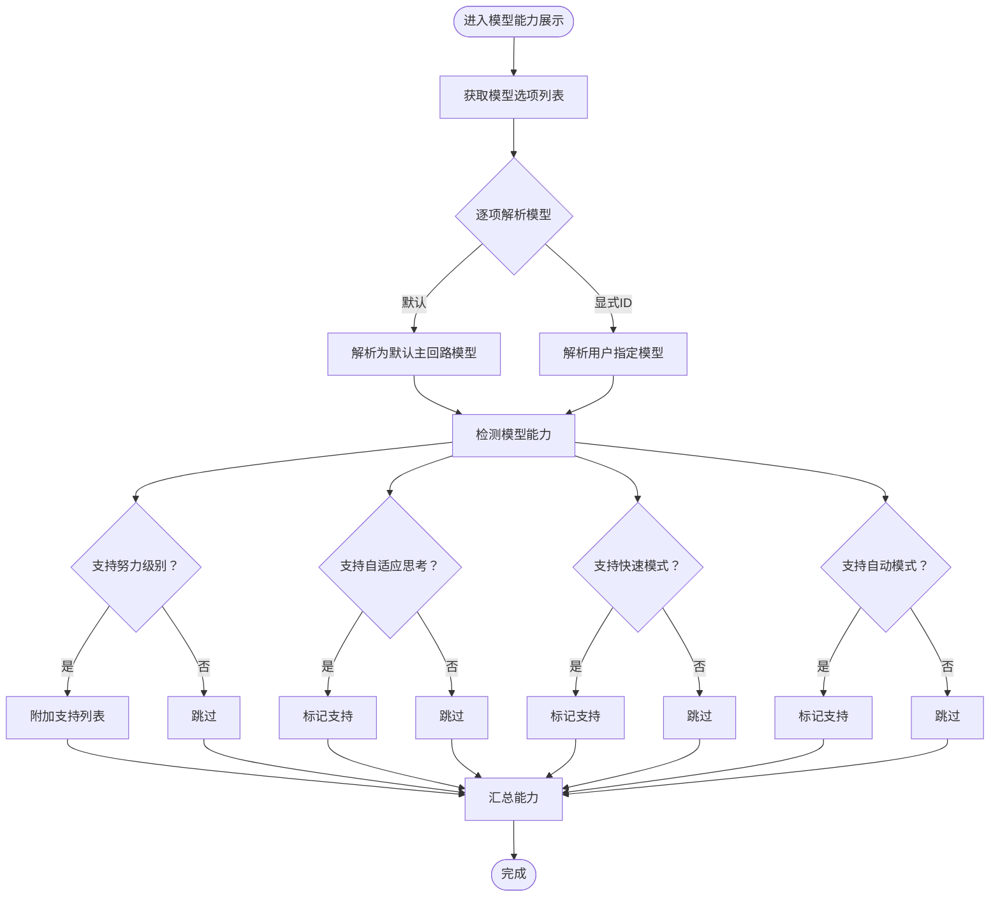
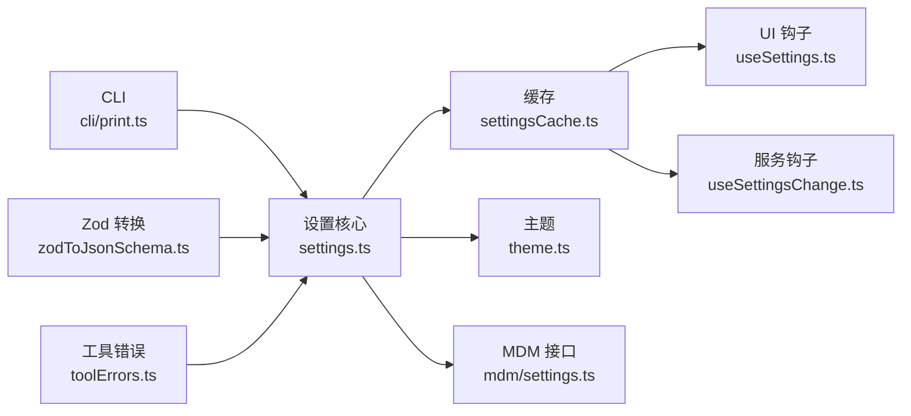

# 设置选项详解

<cite>
**本文引用的文件**
- [src/commands/config/config.tsx](file://src/commands/config/config.tsx)
- [src/components/Settings/Settings.tsx](file://src/components/Settings/Settings.tsx)
- [src/utils/settings/settings.ts](file://src/utils/settings/settings.ts)
- [src/utils/settings/settingsCache.ts](file://src/utils/settings/settingsCache.ts)
- [src/utils/settings/mdm/settings.ts](file://src/utils/settings/mdm/settings.ts)
- [src/utils/theme.ts](file://src/utils/theme.ts)
- [src/hooks/useSettings.ts](file://src/hooks/useSettings.ts)
- [src/hooks/useSettingsChange.ts](file://src/hooks/useSettingsChange.ts)
- [src/services/remoteManagedSettings/syncCacheState.ts](file://src/services/remoteManagedSettings/syncCacheState.ts)
- [src/main.tsx](file://src/main.tsx)
- [src/cli/print.ts](file://src/cli/print.ts)
- [src/dialogLaunchers.tsx](file://src/dialogLaunchers.tsx)
- [src/utils/zodToJsonSchema.ts](file://src/utils/zodToJsonSchema.ts)
- [src/utils/toolErrors.ts](file://src/utils/toolErrors.ts)
- [src/migrations/migrateAutoUpdatesToSettings.ts](file://src/migrations/migrateAutoUpdatesToSettings.ts)
- [src/migrations/migrateBypassPermissionsAcceptedToSettings.ts](file://src/migrations/migrateBypassPermissionsAcceptedToSettings.ts)
- [src/migrations/migrateEnableAllProjectMcpServersToSettings.ts](file://src/migrations/migrateEnableAllProjectMcpServersToSettings.ts)
- [src/migrations/migrateFennecToOpus.ts](file://src/migrations/migrateFennecToOpus.ts)
- [src/migrations/migrateLegacyOpusToCurrent.ts](file://src/migrations/migrateLegacyOpusToCurrent.ts)
- [src/migrations/migrateOpusToOpus1m.ts](file://src/migrations/migrateOpusToOpus1m.ts)
- [src/migrations/migrateReplBridgeEnabledToRemoteControlAtStartup.ts](file://src/migrations/migrateReplBridgeEnabledToRemoteControlAtStartup.ts)
- [src/migrations/migrateSonnet1mToSonnet45.ts](file://src/migrations/migrateSonnet1mToSonnet45.ts)
- [src/migrations/migrateSonnet45ToSonnet46.ts](file://src/migrations/migrateSonnet45ToSonnet46.ts)
- [src/migrations/resetAutoModeOptInForDefaultOffer.ts](file://src/migrations/resetAutoModeOptInForDefaultOffer.ts)
- [src/migrations/resetProToOpusDefault.ts](file://src/migrations/resetProToOpusDefault.ts)
</cite>

## 目录
1. [简介](#简介)
2. [项目结构](#项目结构)
3. [核心组件](#核心组件)
4. [架构总览](#架构总览)
5. [详细组件分析](#详细组件分析)
6. [依赖关系分析](#依赖关系分析)
7. [性能考量](#性能考量)
8. [故障排查指南](#故障排查指南)
9. [结论](#结论)
10. [附录](#附录)

## 简介
本文件为“设置选项”的权威参考，覆盖模型配置、界面主题与定制、权限控制、性能与行为开关、远程托管设置同步、以及版本迁移与兼容性等内容。文档以“可操作”为目标，为每个设置项提供参数含义、取值范围、默认值与影响效果，并解释设置项之间的依赖关系与约束条件；同时给出常见组合的最佳实践与推荐配置。

## 项目结构
设置系统围绕“设置源（文件/标志位/远程）—缓存—订阅者（UI/服务/工具）”的架构组织，支持本地与远程设置的合并与优先级处理，具备强一致性的变更通知与缓存失效机制。

图示来源
- [src/commands/config/config.tsx:1-7](file://src/commands/config/config.tsx#L1-L7)
- [src/main.tsx:469-496](file://src/main.tsx#L469-L496)
- [src/utils/settings/settings.ts](file://src/utils/settings/settings.ts)
- [src/utils/settings/settingsCache.ts](file://src/utils/settings/settingsCache.ts)
- [src/utils/theme.ts:598-613](file://src/utils/theme.ts#L598-L613)
- [src/hooks/useSettings.ts](file://src/hooks/useSettings.ts)
- [src/hooks/useSettingsChange.ts](file://src/hooks/useSettingsChange.ts)
- [src/services/remoteManagedSettings/syncCacheState.ts:1-20](file://src/services/remoteManagedSettings/syncCacheState.ts#L1-L20)
- [src/utils/settings/mdm/settings.ts](file://src/utils/settings/mdm/settings.ts)
- [src/cli/print.ts:3704-3729](file://src/cli/print.ts#L3704-L3729)
- [src/utils/zodToJsonSchema.ts:1-23](file://src/utils/zodToJsonSchema.ts#L1-L23)
- [src/utils/toolErrors.ts:43-80](file://src/utils/toolErrors.ts#L43-L80)
- [src/dialogLaunchers.tsx:40-52](file://src/dialogLaunchers.tsx#L40-L52)

章节来源
- [src/commands/config/config.tsx:1-7](file://src/commands/config/config.tsx#L1-L7)
- [src/main.tsx:469-496](file://src/main.tsx#L469-L496)

## 核心组件
- 设置源与合并：支持多来源设置（文件、运行时标志、远程托管），通过合并策略与优先级实现最终生效值。
- 设置缓存：集中式缓存与失效机制，确保订阅者在变更后能读取最新值。
- 主题系统：内置多套主题与色板，支持自动跟随系统深浅模式。
- 权限与安全：权限规则列表与重试消息集成，配合桥接事件响应。
- 远程托管设置：MDM 接口与同步状态，支持远程策略下发与一致性校验。
- CLI 交互：接收外部设置更新并触发缓存重置与广播。

章节来源
- [src/utils/settings/settings.ts](file://src/utils/settings/settings.ts)
- [src/utils/settings/settingsCache.ts](file://src/utils/settings/settingsCache.ts)
- [src/utils/theme.ts:598-613](file://src/utils/theme.ts#L598-L613)
- [src/commands/permissions/permissions.tsx:1-9](file://src/commands/permissions/permissions.tsx#L1-L9)
- [src/utils/settings/mdm/settings.ts](file://src/utils/settings/mdm/settings.ts)
- [src/services/remoteManagedSettings/syncCacheState.ts:1-20](file://src/services/remoteManagedSettings/syncCacheState.ts#L1-L20)
- [src/cli/print.ts:3704-3729](file://src/cli/print.ts#L3704-L3729)

## 架构总览
设置系统采用“分层解耦 + 订阅广播”的设计：
- 分层：命令层（UI/CLI）、设置核心（读写/合并/缓存）、主题与远程策略、工具与服务。
- 订阅：UI 与服务通过钩子订阅设置变化，统一由缓存层提供最新值。
- 广播：变更通过通知器触发，先重置缓存再广播，避免“读到旧值”的竞态。

图示来源
- [src/cli/print.ts:3704-3729](file://src/cli/print.ts#L3704-L3729)
- [src/utils/settings/settings.ts](file://src/utils/settings/settings.ts)
- [src/utils/settings/settingsCache.ts](file://src/utils/settings/settingsCache.ts)
- [src/hooks/useSettingsChange.ts](file://src/hooks/useSettingsChange.ts)

## 详细组件分析

### 模型配置类别
- 可用模型与能力探测：根据用户指定模型或默认模型，动态探测是否支持“努力级别/自适应思考/快速模式/自动模式”，并在 UI 中呈现相应能力。
- 默认模型与解析：支持“默认”与“显式模型 ID”，解析后进行能力判定。
- 常见取值与默认行为：未显式指定时使用默认主回路模型；不同模型的能力集合不同，需按模型能力表选择。

图示来源
- [src/cli/print.ts:1194-1220](file://src/cli/print.ts#L1194-L1220)

章节来源
- [src/cli/print.ts:1194-1220](file://src/cli/print.ts#L1194-L1220)

### 界面定制与主题
- 主题名称与设置：支持“自动/深色/浅色/色盲友好/ANSI”等主题族，自动跟随系统深浅模式。
- 色彩方案：每套主题包含丰富 UI 元素色彩（如 Claude 主色、闪烁效果、差异高亮、彩虹关键词等），确保在真彩与 ANSI 终端下均具可读性。
- 使用建议：终端真彩优先；若为 ANSI 终端，建议使用 ANSI 主题；色盲用户可选“daltonized”主题。

章节来源
- [src/utils/theme.ts:91-109](file://src/utils/theme.ts#L91-L109)
- [src/utils/theme.ts:115-139](file://src/utils/theme.ts#L115-L139)
- [src/utils/theme.ts:278-310](file://src/utils/theme.ts#L278-L310)
- [src/utils/theme.ts:359-379](file://src/utils/theme.ts#L359-L379)
- [src/utils/theme.ts:440-463](file://src/utils/theme.ts#L440-L463)
- [src/utils/theme.ts:521-542](file://src/utils/theme.ts#L521-L542)
- [src/utils/theme.ts:598-613](file://src/utils/theme.ts#L598-L613)

### 权限控制
- 权限规则列表：提供可视化规则清单与重试入口，便于用户理解与调整权限决策。
- 桥接事件：通过控制响应事件承载权限决策结果，供会话消费。
- 最佳实践：对敏感工具启用“明确授权”；对常用工具可设置“允许但记录”策略，平衡安全与效率。

章节来源
- [src/commands/permissions/permissions.tsx:1-9](file://src/commands/permissions/permissions.tsx#L1-L9)
- [src/bridge/types.ts:117-131](file://src/bridge/types.ts#L117-L131)

### 性能与行为开关
- 工具结果持久化阈值：支持基于特性开关的阈值覆盖，结合全局默认阈值，限制工具输出大小，避免循环读写与资源浪费。
- 缓存共享参数：在压缩流程中并发构建缓存共享参数与钩子，提升长上下文处理效率。
- CLI 设置合并：对外部传入的设置进行浅合并与空值清理，确保设置对象合法并触发缓存重置与广播。

章节来源
- [src/utils/toolResultStorage.ts:36-78](file://src/utils/toolResultStorage.ts#L36-L78)
- [src/commands/compact/compact.ts:155-179](file://src/commands/compact/compact.ts#L155-L179)
- [src/cli/print.ts:3704-3729](file://src/cli/print.ts#L3704-L3729)

### 远程托管设置与同步
- MDM 接口：提供远程策略读取与应用的接口层。
- 同步状态：维护远程设置与本地缓存的一致性，避免冲突与回滚。
- 适用场景：企业环境下的统一策略下发与合规检查。

章节来源
- [src/utils/settings/mdm/settings.ts](file://src/utils/settings/mdm/settings.ts)
- [src/services/remoteManagedSettings/syncCacheState.ts:1-20](file://src/services/remoteManagedSettings/syncCacheState.ts#L1-L20)

### 设置加载与来源控制
- 设置路径与来源标志：支持从命令行标志指定设置文件路径与允许的设置来源集合。
- 缓存重置：当设置来源或路径变更时，立即重置缓存并重新加载。
- 无效设置提示：当设置校验失败时，弹出对话框引导修复。

章节来源
- [src/main.tsx:469-496](file://src/main.tsx#L469-L496)
- [src/dialogLaunchers.tsx:40-52](file://src/dialogLaunchers.tsx#L40-L52)

### 版本迁移与兼容性
- 迁移版本号：当前迁移版本为固定常量，每次新增迁移时需递增版本号并执行迁移脚本。
- 迁移清单：包含自动更新、权限豁免、MCP 服务器启用、模型代际升级、REPL 桥到远程控制启动等迁移步骤。
- 兼容性策略：迁移脚本在启动时顺序执行，确保用户在新版本下获得正确默认值与行为。

章节来源
- [src/main.tsx:323-352](file://src/main.tsx#L323-L352)
- [src/migrations/migrateAutoUpdatesToSettings.ts](file://src/migrations/migrateAutoUpdatesToSettings.ts)
- [src/migrations/migrateBypassPermissionsAcceptedToSettings.ts](file://src/migrations/migrateBypassPermissionsAcceptedToSettings.ts)
- [src/migrations/migrateEnableAllProjectMcpServersToSettings.ts](file://src/migrations/migrateEnableAllProjectMcpServersToSettings.ts)
- [src/migrations/migrateFennecToOpus.ts](file://src/migrations/migrateFennecToOpus.ts)
- [src/migrations/migrateLegacyOpusToCurrent.ts](file://src/migrations/migrateLegacyOpusToCurrent.ts)
- [src/migrations/migrateOpusToOpus1m.ts](file://src/migrations/migrateOpusToOpus1m.ts)
- [src/migrations/migrateReplBridgeEnabledToRemoteControlAtStartup.ts](file://src/migrations/migrateReplBridgeEnabledToRemoteControlAtStartup.ts)
- [src/migrations/migrateSonnet1mToSonnet45.ts](file://src/migrations/migrateSonnet1mToSonnet45.ts)
- [src/migrations/migrateSonnet45ToSonnet46.ts](file://src/migrations/migrateSonnet45ToSonnet46.ts)
- [src/migrations/resetAutoModeOptInForDefaultOffer.ts](file://src/migrations/resetAutoModeOptInForDefaultOffer.ts)
- [src/migrations/resetProToOpusDefault.ts](file://src/migrations/resetProToOpusDefault.ts)

## 依赖关系分析
- 组件耦合：设置核心与缓存高度内聚，UI 与服务通过钩子弱耦合订阅；远程策略与 CLI 作为外部输入参与合并。
- 外部依赖：Zod 用于设置与工具参数的模式校验；JSON Schema 转换用于工具 API 描述生成。
- 循环依赖规避：通过“先重置缓存，再广播”的变更通知链路，避免订阅者读取到旧值。

图示来源
- [src/utils/settings/settings.ts](file://src/utils/settings/settings.ts)
- [src/utils/settings/settingsCache.ts](file://src/utils/settings/settingsCache.ts)
- [src/hooks/useSettings.ts](file://src/hooks/useSettings.ts)
- [src/hooks/useSettingsChange.ts](file://src/hooks/useSettingsChange.ts)
- [src/utils/theme.ts:598-613](file://src/utils/theme.ts#L598-L613)
- [src/utils/settings/mdm/settings.ts](file://src/utils/settings/mdm/settings.ts)
- [src/cli/print.ts:3704-3729](file://src/cli/print.ts#L3704-L3729)
- [src/utils/zodToJsonSchema.ts:1-23](file://src/utils/zodToJsonSchema.ts#L1-L23)
- [src/utils/toolErrors.ts:43-80](file://src/utils/toolErrors.ts#L43-L80)

## 性能考量
- 缓存命中与失效：集中式缓存减少重复解析与计算；变更广播前先重置，避免“读旧值”导致的二次计算。
- 并发优化：压缩流程中并发构建钩子与缓存参数，缩短长上下文处理时间。
- 输出大小控制：通过工具结果持久化阈值与特性开关，限制大体积输出，降低 I/O 与内存压力。
- 终端渲染：ANSI 主题在无真彩支持的终端中仍可保持可读性，避免额外渲染开销。

章节来源
- [src/utils/settings/settingsCache.ts](file://src/utils/settings/settingsCache.ts)
- [src/commands/compact/compact.ts:155-179](file://src/commands/compact/compact.ts#L155-L179)
- [src/utils/toolResultStorage.ts:36-78](file://src/utils/toolResultStorage.ts#L36-L78)
- [src/utils/theme.ts:278-310](file://src/utils/theme.ts#L278-L310)

## 故障排查指南
- 设置校验失败：当设置对象不符合模式时，会弹出无效设置对话框，列出具体错误项；请根据提示修正字段类型或必填项。
- CLI 设置未生效：确认是否通过“空值清理”逻辑将 null 转为删除键；检查是否触发了缓存重置与广播。
- 主题显示异常：在 ANSI 终端中切换至 ANSI 主题；若为色盲用户，选择 daltonized 主题。
- 权限被拒绝：查看权限规则列表，必要时使用重试入口重新发起授权；关注桥接事件中的响应内容。

章节来源
- [src/dialogLaunchers.tsx:40-52](file://src/dialogLaunchers.tsx#L40-L52)
- [src/cli/print.ts:3704-3729](file://src/cli/print.ts#L3704-L3729)
- [src/utils/theme.ts:278-310](file://src/utils/theme.ts#L278-L310)
- [src/commands/permissions/permissions.tsx:1-9](file://src/commands/permissions/permissions.tsx#L1-L9)

## 结论
设置系统以“可合并、可缓存、可广播”为核心，覆盖模型、界面、权限、性能与远程策略等全维度配置。通过严格的变更通知与缓存重置机制，确保 UI 与服务始终读取到一致的最新设置。建议在团队环境中优先采用远程托管设置与迁移策略，保障跨版本兼容与合规性。

## 附录

### 常用设置组合与最佳实践
- 开发日常（高效/低延迟）
  - 模型：选择支持快速模式与自适应思考的模型
  - 主题：浅色或深色（根据终端真彩能力）
  - 权限：常用工具“允许但记录”，敏感工具“明确授权”
- 团队协作（合规/审计）
  - 远程托管设置：开启 MDM 策略，统一模型与权限
  - 迁移：确保迁移版本号已更新，执行模型代际升级
- 企业终端（ANSI）
  - 主题：选择 ANSI 主题，确保可读性
  - 输出：适度降低工具结果持久化阈值，避免大文件传输

### 版本兼容性与变更历史要点
- 当前迁移版本：固定常量，新增迁移需递增并补充迁移脚本
- 关键迁移：
  - 自动更新、权限豁免、MCP 服务器启用、模型代际升级（Sonnet/Opus 系列）、REPL 桥到远程控制启动
- 建议：升级前备份设置文件，升级后核对迁移日志与默认值变化

章节来源
- [src/main.tsx:323-352](file://src/main.tsx#L323-L352)
- [src/migrations/migrateAutoUpdatesToSettings.ts](file://src/migrations/migrateAutoUpdatesToSettings.ts)
- [src/migrations/migrateBypassPermissionsAcceptedToSettings.ts](file://src/migrations/migrateBypassPermissionsAcceptedToSettings.ts)
- [src/migrations/migrateEnableAllProjectMcpServersToSettings.ts](file://src/migrations/migrateEnableAllProjectMcpServersToSettings.ts)
- [src/migrations/migrateFennecToOpus.ts](file://src/migrations/migrateFennecToOpus.ts)
- [src/migrations/migrateLegacyOpusToCurrent.ts](file://src/migrations/migrateLegacyOpusToCurrent.ts)
- [src/migrations/migrateOpusToOpus1m.ts](file://src/migrations/migrateOpusToOpus1m.ts)
- [src/migrations/migrateReplBridgeEnabledToRemoteControlAtStartup.ts](file://src/migrations/migrateReplBridgeEnabledToRemoteControlAtStartup.ts)
- [src/migrations/migrateSonnet1mToSonnet45.ts](file://src/migrations/migrateSonnet1mToSonnet45.ts)
- [src/migrations/migrateSonnet45ToSonnet46.ts](file://src/migrations/migrateSonnet45ToSonnet46.ts)
- [src/migrations/resetAutoModeOptInForDefaultOffer.ts](file://src/migrations/resetAutoModeOptInForDefaultOffer.ts)
- [src/migrations/resetProToOpusDefault.ts](file://src/migrations/resetProToOpusDefault.ts)